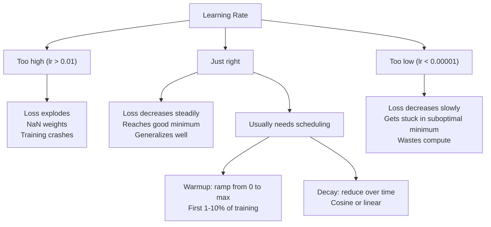
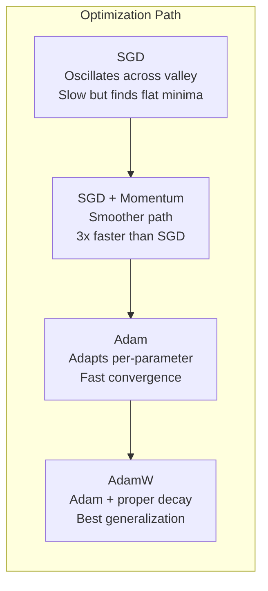
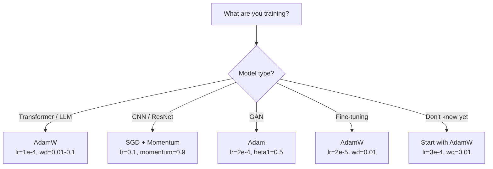

# Optimizers

> 梯度下降法告诉你应该向哪个方向移动。它并不说明移动的距离或速度。SGD就像一把指南针，而Adam则是带有交通数据的GPS。

**类型：** 构建
**语言：** Python
**先决条件：** 第03.05课（损失函数）
**时间：** 约75分钟

## 学习目标

- Implement SGD, SGD with momentum, Adam, and AdamW optimizers from scratch in Python
- Explain how Adam's bias correction compensates for zero-initialized moment estimates in early training steps
- Demonstrate why AdamW produces better generalization than Adam with L2 regularization on the same task
- Select the appropriate optimizer and default hyperparameters for transformers, CNNs, GANs, and fine-tuning

## 问题

您已经计算了梯度。您知道权重#4,721应该减少0.003以减小损失。但是0.003是以什么单位计算的？按什么比例缩放？在第一步和第一千一步中，是否应该移动相同的量？

传统的梯度下降法在每一步都对每个参数应用相同的学习率：w = w - lr * 梯度。这导致了三个问题，使得训练神经网络在实践中变得困难。

首先，振荡现象。损失曲线很少呈平滑的碗状。它更像是长而狭窄的山谷。梯度指向山谷的方向（陡峭方向），而不是沿着山谷的方向（平缓方向）。梯度下降在狭窄的空间中来回跳跃，同时在有用的方向上取得微小的进展。您已经见过这种情况：损失快速下降然后停滞不前，不是因为模型收敛了，而是因为它在振荡。

其次，适用于所有参数的学习率是错误的。一些权重需要大的更新（它们处于早期、欠拟合阶段）。其他则需要小的更新（它们接近最优值）。适用于前者的学习率会破坏后者，反之亦然。

第三，鞍点问题。在高维度中，损失曲线有广阔的平坦区域，那里的梯度接近于零。传统的SGD以梯度的速度爬行这些区域，实际上这个速度是零。模型看起来卡住了。其实并没有卡住——它处于一个平坦区域，另一侧则有有用的下降方向。但SGD没有机制来突破这一状态。

Adam解决了这三个问题。它为每个参数维护两个运行平均值——平均梯度（动量，处理振荡）和平均平方梯度（自适应学习率，处理不同规模）。结合最初几步的偏置校正，它提供了一个适用于80%问题的单一优化器，默认超参数即可生效。本课程从零开始构建这个优化器，以便您准确了解它在其他20%问题中为何失败以及原因。

## 概念

### 随机梯度下降法（SGD）

最简单的优化器。在迷你批次上计算梯度，然后朝相反方向进行步骤操作。

```
w = w - lr * gradient
```

“Stochastic”意味着你使用数据的随机子集（小批量）来估计梯度，而不是整个数据集。这种噪声实际上是有用的——它有助于避免尖锐的局部最小值。但噪声也会导致振荡。

学习率是唯一的调节参数。太高：损失会发散。太低：训练会持续很长时间。最优值取决于架构、数据、批量大小以及训练的当前阶段。对于现代网络上的普通SGD，典型的值范围在0.01到0.1之间。但即使在同一次训练中，理想的学习率也会发生变化。

### 动量

“球滚下坡”的比喻被过度使用，但确实准确。你不是仅仅依靠坡度来前进，而是保持一个能累积速度以克服坡度的速度。

```
m_t = beta * m_{t-1} + gradient
w = w - lr * m_t
```

Beta值（通常为0.9）决定了保留的历史数据量。当beta为0.9时，动量大致是过去10次梯度变化的平均值（1 / (1 - 0.9) = 10）。

这解决了振荡问题：指向同一方向的梯度会累积，而方向相反的梯度则会相互抵消。在那个狭窄的谷地中，“横向”分量每一步都会改变符号并减弱，“纵向”分量则保持稳定并增强。结果是在有效方向上实现平滑加速。

实数情况：仅使用SGD处理条件不佳的损失函数可能需要10,000步。而使用动量（beta=0.9）的SGD在同一问题上通常只需要3,000-5,000步。这种加速效果并非微不足道。

### RMSProp

第一种真正有效的参数自适应学习率方法，由Hinton在Coursera讲座中提出（未正式发表）。

```
s_t = beta * s_{t-1} + (1 - beta) * gradient^2
w = w - lr * gradient / (sqrt(s_t) + epsilon)
```

s_t tracks the running average of squared gradients. Parameters with consistently large gradients get divided by a large number (smaller effective learning rate). Parameters with small gradients get divided by a small number (larger effective learning rate).

This solves the “one learning rate for all parameters” problem. A weight that has already been getting larger and is undergoing updates is probably near its target – slow it down. A weight that has been getting smaller and is also undergoing updates might be under-trained – speed it up.

Epsilon (typically 1e-8) prevents division by zero when a parameter has not been updated.

### Adam：动量法 + RMSProp

亚当结合了这两种想法。它为每个参数维护两个指数移动平均值：

```
m_t = beta1 * m_{t-1} + (1 - beta1) * gradient        (first moment: mean)
v_t = beta2 * v_{t-1} + (1 - beta2) * gradient^2       (second moment: variance)
```

**偏差校正**是大多数解释忽略的关键细节。在第一步中，m_1 = (1 - beta1) * 梯度。当beta1 = 0.9时，这相当于0.1 * 梯度——小了十倍。移动平均尚未稳定下来。偏差校正可以弥补这一不足：

```
m_hat = m_t / (1 - beta1^t)
v_hat = v_t / (1 - beta2^t)
```

在步骤1，当beta1为0.9时：m_hat = m_1 / (1 - 0.9) = m_1 / 0.1 = 实际梯度。在步骤100时：(1 - 0.9^100)约等于1.0，因此修正效果消失。偏差校正在前约10步中很重要，而在约50步之后则无关紧要。

更新：

```
w = w - lr * m_hat / (sqrt(v_hat) + epsilon)
```

Adam默认参数：lr = 0.001，beta1 = 0.9，beta2 = 0.999，epsilon = 1e-8。这些默认值适用于80%的问题。当不适用时，先更改lr。然后更改beta2。几乎从不更改beta1或epsilon。

### AdamW: Properly Handling Weight Decay

L2正则化会在损失函数中添加lambda * w^2。在传统的SGD中，这相当于权重衰减（在每一步从权重中减去lambda * w）。而在Adam算法中，这种等价性被打破。

Loshchilov和Hutter的见解是：当你在损失函数中加入L2项，然后使用Adam处理梯度时，自适应学习率也会调整正则化项。梯度方差较大的参数会受到较少的正则化，而方差较小的参数则会受到更多正则化。这并不是你想要的——你需要的是无论梯度统计特性如何都能实现均匀的正则化。

AdamW通过在对权重进行Adam更新之后直接应用权重衰减来解决这个问题：

```
w = w - lr * m_hat / (sqrt(v_hat) + epsilon) - lr * lambda * w
```

权重衰减项（lr * lambda * w）并未通过Adam的自适应因子进行缩放。每个参数都受到相同的比例缩减。

这看似是一个小细节，但实际上并非如此。在几乎所有任务上，AdamW都能找到比Adam + L2正则化更好的解决方案。它是PyTorch中用于训练变换器、扩散模型以及大多数现代架构的默认优化器。BERT、GPT、LLaMA、Stable Diffusion——所有这些模型都是使用AdamW进行训练的。

### 学习率：最重要的超参数



如果你调整了一个超参数，那么也需要调整学习率。学习率增加10倍的影响比你做出的任何架构决策都要大。常见的默认值如下：

- SGD：lr = 0.01到0.1
- Adam/AdamW：lr = 1e-4到3e-4
- 微调预训练模型：lr = 1e-5到5e-5
- 学习率预热：在前1-10%的步长内进行线性递增

### Optimizer Comparison



### 当每个优化器获胜时



```figure
optimizer-trajectory
```

## 构建它

### 步骤1：Vanilla SGD

```python
class SGD:
    def __init__(self, lr=0.01):
        self.lr = lr

    def step(self, params, grads):
        for i in range(len(params)):
            params[i] -= self.lr * grads[i]
```

### 步骤2：使用动量方法进行SGD训练

```python
class SGDMomentum:
    def __init__(self, lr=0.01, beta=0.9):
        self.lr = lr
        self.beta = beta
        self.velocities = None

    def step(self, params, grads):
        if self.velocities is None:
            self.velocities = [0.0] * len(params)
        for i in range(len(params)):
            self.velocities[i] = self.beta * self.velocities[i] + grads[i]
            params[i] -= self.lr * self.velocities[i]
```

### 步骤3：亚当

```python
import math

class Adam:
    def __init__(self, lr=0.001, beta1=0.9, beta2=0.999, epsilon=1e-8):
        self.lr = lr
        self.beta1 = beta1
        self.beta2 = beta2
        self.epsilon = epsilon
        self.m = None
        self.v = None
        self.t = 0

    def step(self, params, grads):
        if self.m is None:
            self.m = [0.0] * len(params)
            self.v = [0.0] * len(params)

        self.t += 1

        for i in range(len(params)):
            self.m[i] = self.beta1 * self.m[i] + (1 - self.beta1) * grads[i]
            self.v[i] = self.beta2 * self.v[i] + (1 - self.beta2) * grads[i] ** 2

            m_hat = self.m[i] / (1 - self.beta1 ** self.t)
            v_hat = self.v[i] / (1 - self.beta2 ** self.t)

            params[i] -= self.lr * m_hat / (math.sqrt(v_hat) + self.epsilon)
```

### 步骤4：AdamW

```python
class AdamW:
    def __init__(self, lr=0.001, beta1=0.9, beta2=0.999, epsilon=1e-8, weight_decay=0.01):
        self.lr = lr
        self.beta1 = beta1
        self.beta2 = beta2
        self.epsilon = epsilon
        self.weight_decay = weight_decay
        self.m = None
        self.v = None
        self.t = 0

    def step(self, params, grads):
        if self.m is None:
            self.m = [0.0] * len(params)
            self.v = [0.0] * len(params)

        self.t += 1

        for i in range(len(params)):
            self.m[i] = self.beta1 * self.m[i] + (1 - self.beta1) * grads[i]
            self.v[i] = self.beta2 * self.v[i] + (1 - self.beta2) * grads[i] ** 2

            m_hat = self.m[i] / (1 - self.beta1 ** self.t)
            v_hat = self.v[i] / (1 - self.beta2 ** self.t)

            params[i] -= self.lr * m_hat / (math.sqrt(v_hat) + self.epsilon)
            params[i] -= self.lr * self.weight_decay * params[i]
```

### 步骤5：训练比较

Train the same two-layer network on the circle dataset from lesson 05 using all four optimizers. Compare the convergence of the networks.

```python
import random

def sigmoid(x):
    x = max(-500, min(500, x))
    return 1.0 / (1.0 + math.exp(-x))

def make_circle_data(n=200, seed=42):
    random.seed(seed)
    data = []
    for _ in range(n):
        x = random.uniform(-2, 2)
        y = random.uniform(-2, 2)
        label = 1.0 if x * x + y * y < 1.5 else 0.0
        data.append(([x, y], label))
    return data


class OptimizerTestNetwork:
    def __init__(self, optimizer, hidden_size=8):
        random.seed(0)
        self.hidden_size = hidden_size
        self.optimizer = optimizer

        self.w1 = [[random.gauss(0, 0.5) for _ in range(2)] for _ in range(hidden_size)]
        self.b1 = [0.0] * hidden_size
        self.w2 = [random.gauss(0, 0.5) for _ in range(hidden_size)]
        self.b2 = 0.0

    def get_params(self):
        params = []
        for row in self.w1:
            params.extend(row)
        params.extend(self.b1)
        params.extend(self.w2)
        params.append(self.b2)
        return params

    def set_params(self, params):
        idx = 0
        for i in range(self.hidden_size):
            for j in range(2):
                self.w1[i][j] = params[idx]
                idx += 1
        for i in range(self.hidden_size):
            self.b1[i] = params[idx]
            idx += 1
        for i in range(self.hidden_size):
            self.w2[i] = params[idx]
            idx += 1
        self.b2 = params[idx]

    def forward(self, x):
        self.x = x
        self.z1 = []
        self.h = []
        for i in range(self.hidden_size):
            z = self.w1[i][0] * x[0] + self.w1[i][1] * x[1] + self.b1[i]
            self.z1.append(z)
            self.h.append(max(0.0, z))

        self.z2 = sum(self.w2[i] * self.h[i] for i in range(self.hidden_size)) + self.b2
        self.out = sigmoid(self.z2)
        return self.out

    def compute_grads(self, target):
        eps = 1e-15
        p = max(eps, min(1 - eps, self.out))
        d_loss = -(target / p) + (1 - target) / (1 - p)
        d_sigmoid = self.out * (1 - self.out)
        d_out = d_loss * d_sigmoid

        grads = [0.0] * (self.hidden_size * 2 + self.hidden_size + self.hidden_size + 1)
        idx = 0
        for i in range(self.hidden_size):
            d_relu = 1.0 if self.z1[i] > 0 else 0.0
            d_h = d_out * self.w2[i] * d_relu
            grads[idx] = d_h * self.x[0]
            grads[idx + 1] = d_h * self.x[1]
            idx += 2

        for i in range(self.hidden_size):
            d_relu = 1.0 if self.z1[i] > 0 else 0.0
            grads[idx] = d_out * self.w2[i] * d_relu
            idx += 1

        for i in range(self.hidden_size):
            grads[idx] = d_out * self.h[i]
            idx += 1

        grads[idx] = d_out
        return grads

    def train(self, data, epochs=300):
        losses = []
        for epoch in range(epochs):
            total_loss = 0.0
            correct = 0
            for x, y in data:
                pred = self.forward(x)
                grads = self.compute_grads(y)
                params = self.get_params()
                self.optimizer.step(params, grads)
                self.set_params(params)

                eps = 1e-15
                p = max(eps, min(1 - eps, pred))
                total_loss += -(y * math.log(p) + (1 - y) * math.log(1 - p))
                if (pred >= 0.5) == (y >= 0.5):
                    correct += 1
            avg_loss = total_loss / len(data)
            accuracy = correct / len(data) * 100
            losses.append((avg_loss, accuracy))
            if epoch % 75 == 0 or epoch == epochs - 1:
                print(f"    Epoch {epoch:3d}: loss={avg_loss:.4f}, accuracy={accuracy:.1f}%")
        return losses
```

## 使用它

PyTorch optimizers handle parameter groups, gradient clipping, and learning rate scheduling:

```python
import torch
import torch.optim as optim

model = torch.nn.Sequential(
    torch.nn.Linear(784, 256),
    torch.nn.ReLU(),
    torch.nn.Linear(256, 10),
)

optimizer = optim.AdamW(model.parameters(), lr=3e-4, weight_decay=0.01)

scheduler = optim.lr_scheduler.CosineAnnealingLR(optimizer, T_max=100)

for epoch in range(100):
    optimizer.zero_grad()
    output = model(torch.randn(32, 784))
    loss = torch.nn.functional.cross_entropy(output, torch.randint(0, 10, (32,)))
    loss.backward()
    torch.nn.utils.clip_grad_norm_(model.parameters(), max_norm=1.0)
    optimizer.step()
    scheduler.step()
```

The pattern is always: zero_grad, forward, loss, backward, (clip), step, (schedule). Memorize this order. Making mistakes (e.g., calling scheduler.step() before optimizer.step()) is a common source of subtle bugs.

For CNNs, many practitioners still prefer SGD + momentum (lr=0.1, momentum=0.9, weight_decay=1e-4) with a step or cosine schedule. SGD finds flatter minima, which often generalize better. For transformers and LLMs, AdamW with warmup + cosine decay is the universal default. Don’t go against the consensus without a well-founded reason.

## 发货

本课程将生成以下文件：
- `outputs/prompt-optimizer-selector.md` -- 一个决策提示，用于为任何架构选择正确的优化器和学习率。

## 练习

1. Implement Nesterov momentum, where you compute the gradient at the "lookahead" position (w - lr * beta * v) instead of the current position. Compare convergence to standard momentum on the circle dataset.

2. Implement a learning rate warmup schedule: linear ramp from 0 to max_lr over the first 10% of training steps, then cosine decay to 0. Train with Adam + warmup vs Adam without warmup. Measure how many epochs it takes to reach 90% accuracy on the circle dataset.

3. Track the effective learning rate for each parameter during Adam training. The effective rate is lr * m_hat / (sqrt(v_hat) + eps). Plot the distribution of effective rates after 10, 50, and 200 steps. Are all parameters being updated at the same speed?

4. Implement gradient clipping (clip by global norm). Set the max gradient norm to 1.0. Train with and without clipping using a high learning rate (lr=0.01 for Adam). Count how many runs diverge (loss goes to NaN) with and without clipping over 10 random seeds.

5. Compare Adam vs AdamW on a network with large weights. Initialize all weights to random values in [-5, 5] (much larger than normal). Train for 200 epochs with weight_decay=0.1. Plot the L2 norm of weights over training for both optimizers. AdamW should show faster weight shrinkage.

## | 关键词 | 翻译 |

| 术语 | 人们怎么说 | 实际含义 |
|------|------------|----------|
| 学习率 | “步长” | 梯度更新的标量乘数；训练中影响最大的超参数 |
| SGD | “基本梯度下降” | 随机梯度下降：通过减去 lr * 梯度来更新权重，该计算是在小批量数据上进行的 |
| 动量 | “滚动球类比” | 过去梯度的指数移动平均；减少振荡并加速一致方向的发展 |
| RMSProp | “自适应学习率” | 将每个参数的梯度除以其最近梯度的当前 RMS 值；平衡学习率 |
| Adam | “默认优化器” | 结合动量（第一矩）和 RMSProp（第二矩）以及初始阶段的偏差校正 |
| AdamW | “正确实现的 Adam” | Adam 加上解耦的权重衰减；直接对权重应用正则化，而不是通过梯度进行 |
| 偏差校正 | “滚动平均的预热” | 除以 (1 - beta^t) 以补偿 Adam 矩估计的初始零初始化 |
| 权重衰减 | “缩小权重” | 在每一步中减去权重值的一部分；一种惩罚大权重的正则化方法 |
| 学习率调度 | “随时间变化的学习率” | 在训练过程中调整学习率的函数；预热 + 余弦衰减是现代默认方式 |
| 梯度裁剪 | “限制梯度范数” | 当梯度向量的范数超过阈值时缩小梯度向量；防止梯度更新爆炸 |

## 更多阅读资料

- Kingma & Ba, “Adam: A Method for Stochastic Optimization” (2014) – the original Adam paper on convergence analysis and bias correction derivation.  
- Loshchilov & Hutter, “Decoupled Weight Decay Regularization” (2017) – proved that L2 regularization and weight decay are not equivalent in Adam, and proposed AdamW.  
- Smith, “Cyclical Learning Rates for Training Neural Networks” (2017) – introduced the LR range test and cyclical schedules that eliminate the need to tune a fixed learning rate.  
- Ruder, “An Overview of Gradient Descent Optimization Algorithms” (2016) – the best single survey on all optimizer variants, with clear comparisons and explanations.
