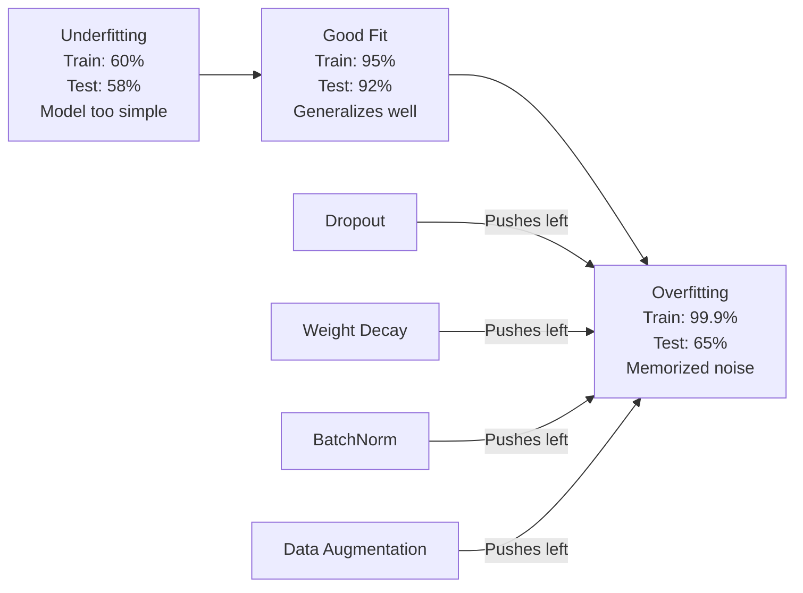
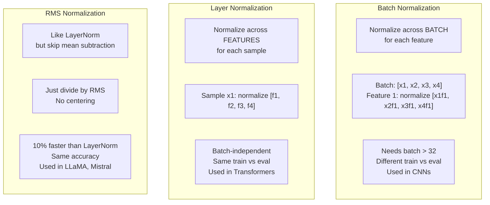
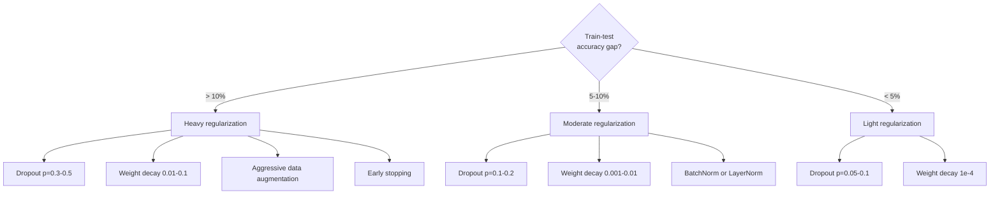

# 正则化

> 您的模型在训练数据上的准确率为99%，在测试数据上的准确率为60%。它是在记忆而非学习。正则化是您对复杂性施加的负担，以强制实现泛化能力。

**类型：** 构建
**语言：** Python
**先决条件：** 第03.06课（优化器）
**时间：** 约75分钟

## 学习目标

- Implement dropout with inverted scaling, L2 weight decay, batch normalization, layer normalization, and RMSNorm from scratch
- Measure the train-test accuracy gap and diagnose overfitting using regularization experiments
- Explain why transformers use LayerNorm instead of BatchNorm and why modern LLMs prefer RMSNorm
- Apply the correct combination of regularization techniques based on the severity of overfitting

## 问题

一个具有足够参数的神经网络可以记住任何数据集。这不是假设——张等人（2017年）通过在ImageNet上训练标准网络并使用随机标签证明了这一点。这些网络在完全随机的标签分配下达到了接近零的训练损失。它们记住了百万个没有规律可循的随机输入-输出对，训练损失为完美值。测试准确率为零。

这就是过拟合问题，随着模型规模的增加，这个问题会变得更严重。GPT-3有1750亿个参数。训练集大约有5000亿个标记。拥有如此多的参数，模型有足够的能力逐字记住训练数据的显著部分。如果没有正则化，它只会重复训练示例而不是学习可泛化的模式。

训练性能与测试性能之间的差距就是过拟合差距。本课程中的每种技术都从不同的角度来应对这一差距。Dropout迫使网络不依赖任何单个神经元。权重衰减防止任何单个权重变得过大。批量归一化平滑了损失曲线，使优化器找到更平坦、更具普遍性的最小值。层归一化也做同样的事情，但适用于批量归一化失败的情况（小批次、可变长度的序列）。RMSNorm通过省略均值计算，使其速度提高10%。每种技术都很简单。结合起来，它们决定了模型是记忆型还是泛化型的差异。

## 概念

### The Overfitting Spectrum

每个模型都位于从欠拟合（过于简单，无法捕捉模式）到过拟合（过于复杂，以至于捕捉了噪声）的某个范围内。最佳状态介于两者之间，正则化可以将模型从过拟合方向推向这一理想状态。



### dropout

最简洁的正则化技术，具有最优雅的解释。在训练过程中，以概率p随机将每个神经元的输出设置为零。

```
output = activation(z) * mask    where mask[i] ~ Bernoulli(1 - p)
```

当p=0.5时，一半的神经元在每次前向传播时都被置为零。网络必须学习冗余表示，因为它无法预测哪些神经元将会可用。这防止了共适应现象——即神经元学会依赖特定其他神经元的存在。

集成解释：具有N个神经元和dropout的网络可以创建2^N种可能的子网络（每种组合中哪些神经元是开启或关闭）。使用dropout进行训练实际上是在同时训练所有2^N个子网络，每个子网络在不同的小批量上运行。在测试时，使用所有神经元（不使用dropout），并将输出乘以(1-p)以匹配训练期间的预期值。这相当于对2^N个子网络的预测进行平均——从单个模型中生成的巨大集成。

在实践中，这种缩放是在训练期间而不是测试期间应用的（反向dropout）。

```
During training:  output = activation(z) * mask / (1 - p)
During testing:   output = activation(z)   (no change needed)
```

This is clearer because the test code doesn't need to be aware of dropout at all.

Default rates: p = 0.1 for transformers, p = 0.5 for MLPs, p = 0.2-0.3 for CNNs. Higher dropout = stronger regularization = more risk of underfitting.

### 权重衰减（L2正则化）

将所有权重的平方大小加到损失中：

```
total_loss = task_loss + (lambda / 2) * sum(w_i^2)
```

正则化项的梯度为lambda * w。这意味着在每一步中，每个权重都会根据其大小成比例地向零收缩。较大的权重会受到更严厉的惩罚。模型会被推到这样一个状态：没有任何一个权重占据主导地位。

为什么这有助于泛化能力：过拟合的模型往往具有较大的权重，这些权重会放大训练数据中的噪声。权重衰减使权重保持较小，从而限制了模型的有效容量，并迫使它依赖于稳健、可泛化的特征，而不是记忆中的特定特性。

lambda超参数控制着强度。典型值如下：

- 在transformers上使用AdamW时，值为0.01
- 在CNNs上使用SGD时，值为1e-4
- 对于严重过拟合的模型，值为0.1

如第06课所述：在SGD中，权重衰减和L2正则化是等效的，但在Adam中则不是。使用Adam进行训练时，始终应使用AdamW（解耦权重衰减）。

### 批量归一化

在将输出传递给下一层之前，对每个小批量中每一层的输出进行标准化。

对于某层的小批量激活值：

```
mu = (1/B) * sum(x_i)           (batch mean)
sigma^2 = (1/B) * sum((x_i - mu)^2)   (batch variance)
x_hat = (x_i - mu) / sqrt(sigma^2 + eps)   (normalize)
y = gamma * x_hat + beta        (scale and shift)
```

Gamma和Beta是可学习的参数，它们允许网络在必要时撤销归一化操作。没有这些参数，你将强制每层的输出都保持零均值和单位方差，这可能不是网络所期望的。

**训练与推理的分隔：**在训练过程中，Mu和Sigma来自当前的小批量数据。在推理时，你使用训练期间累积的运行平均值（指数移动平均，动量=0.1，即90%的旧值+10%的新值）。

BatchNorm为何有效仍存在争议。原始论文声称它减少了“内部协变量偏移”（随着早期层更新而变化的层输入分布）。Santurkar等人（2018年）表明这种解释是错误的。实际原因是：BatchNorm使损失曲面更加平滑。梯度更具预测性，Lipschitz常数更小，优化器可以安全地采取更大的步长。这就是为什么BatchNorm允许使用更高的学习率并更快收敛的原因。

BatchNorm有一个基本限制：它依赖于批量统计信息。当批量大小为1时，均值和方差没有意义。当批量较小（<32）时，统计数据会变得嘈杂，从而影响性能。这对于对象检测等任务非常重要（其中内存限制了批量大小），以及语言建模（其中序列长度各不相同）。

### 层归一化

在特征之间进行标准化，而不是在批次之间。对于单个样本：

```
mu = (1/D) * sum(x_j)           (feature mean)
sigma^2 = (1/D) * sum((x_j - mu)^2)   (feature variance)
x_hat = (x_j - mu) / sqrt(sigma^2 + eps)
y = gamma * x_hat + beta
```

D represents the feature dimension. Each sample is normalized independently—there is no dependence on the batch size. This is why transformers use LayerNorm instead of BatchNorm. Sequences have variable lengths, batch sizes are often small (or 1 during generation), and the computation is identical between training and inference.

LayerNorm in transformers is applied after each self-attention block and each feed-forward block (Post-LN), or before them (Pre-LN, which is more stable for training).

### RMSNorm

LayerNorm without mean subtraction. Proposed by Zhang & Sennrich (2019).

```
rms = sqrt((1/D) * sum(x_j^2))
y = gamma * x / rms
```

就是这样。没有复杂的计算，也没有测试参数。观察结果是：LayerNorm中的重新中心化（均值减法）对模型性能的贡献很小，但会增加计算量。去除这一步骤可以保持相同的准确性，同时减少约10%的计算开销。

LLaMA、LLaMA 2、LLaMA 3、Mistral以及大多数现代大语言模型都使用RMSNorm代替LayerNorm。在数十亿参数和数万亿个词符的规模下，这10%的节省是非常显著的。

### 规范化比较



### 数据增强作为正则化

这不是模型修改，而是数据修改。在保留标签的情况下变换训练输入：

- 图像：随机裁剪、翻转、旋转、颜色抖动、抠图
- 文本：同义词替换、反向翻译、随机删除
- 音频：时间拉伸、音高偏移、添加噪声

其效果与正则化相同：它增加了训练集的有效大小，使模型更难记住特定示例。一个只看到每张图像原始形式的模型可以记住它。而看到一个图像的50种增强版本的模型则被迫学习不变结构。

### 早期停止

最简单的正则化器：当验证损失开始增加时停止训练。此时模型尚未过拟合。在实践中，你需要每轮训练都跟踪验证损失，保存最佳模型，并继续训练一段时间（通常为5-20轮）。如果验证损失在等待窗口内没有改善，则停止训练并加载保存的最佳模型。

### 何时应用什么



```figure
l2-regularization
```

## 构建它

### 步骤1：辍学（训练与评估模式）

```python
import random
import math


class Dropout:
    def __init__(self, p=0.5):
        self.p = p
        self.training = True
        self.mask = None

    def forward(self, x):
        if not self.training:
            return list(x)
        self.mask = []
        output = []
        for val in x:
            if random.random() < self.p:
                self.mask.append(0)
                output.append(0.0)
            else:
                self.mask.append(1)
                output.append(val / (1 - self.p))
        return output

    def backward(self, grad_output):
        grads = []
        for g, m in zip(grad_output, self.mask):
            if m == 0:
                grads.append(0.0)
            else:
                grads.append(g / (1 - self.p))
        return grads
```

### 步骤2：L2权重衰减

```python
def l2_regularization(weights, lambda_reg):
    penalty = 0.0
    for w in weights:
        penalty += w * w
    return lambda_reg * 0.5 * penalty

def l2_gradient(weights, lambda_reg):
    return [lambda_reg * w for w in weights]
```

### 步骤3：批量归一化

```python
class BatchNorm:
    def __init__(self, num_features, momentum=0.1, eps=1e-5):
        self.gamma = [1.0] * num_features
        self.beta = [0.0] * num_features
        self.eps = eps
        self.momentum = momentum
        self.running_mean = [0.0] * num_features
        self.running_var = [1.0] * num_features
        self.training = True
        self.num_features = num_features

    def forward(self, batch):
        batch_size = len(batch)
        if self.training:
            mean = [0.0] * self.num_features
            for sample in batch:
                for j in range(self.num_features):
                    mean[j] += sample[j]
            mean = [m / batch_size for m in mean]

            var = [0.0] * self.num_features
            for sample in batch:
                for j in range(self.num_features):
                    var[j] += (sample[j] - mean[j]) ** 2
            var = [v / batch_size for v in var]

            for j in range(self.num_features):
                self.running_mean[j] = (1 - self.momentum) * self.running_mean[j] + self.momentum * mean[j]
                self.running_var[j] = (1 - self.momentum) * self.running_var[j] + self.momentum * var[j]
        else:
            mean = list(self.running_mean)
            var = list(self.running_var)

        self.x_hat = []
        output = []
        for sample in batch:
            normalized = []
            out_sample = []
            for j in range(self.num_features):
                x_h = (sample[j] - mean[j]) / math.sqrt(var[j] + self.eps)
                normalized.append(x_h)
                out_sample.append(self.gamma[j] * x_h + self.beta[j])
            self.x_hat.append(normalized)
            output.append(out_sample)
        return output
```

### 步骤4：层归一化

```python
class LayerNorm:
    def __init__(self, num_features, eps=1e-5):
        self.gamma = [1.0] * num_features
        self.beta = [0.0] * num_features
        self.eps = eps
        self.num_features = num_features

    def forward(self, x):
        mean = sum(x) / len(x)
        var = sum((xi - mean) ** 2 for xi in x) / len(x)

        self.x_hat = []
        output = []
        for j in range(self.num_features):
            x_h = (x[j] - mean) / math.sqrt(var + self.eps)
            self.x_hat.append(x_h)
            output.append(self.gamma[j] * x_h + self.beta[j])
        return output
```

### 步骤5：RMSNorm

```python
class RMSNorm:
    def __init__(self, num_features, eps=1e-6):
        self.gamma = [1.0] * num_features
        self.eps = eps
        self.num_features = num_features

    def forward(self, x):
        rms = math.sqrt(sum(xi * xi for xi in x) / len(x) + self.eps)
        output = []
        for j in range(self.num_features):
            output.append(self.gamma[j] * x[j] / rms)
        return output
```

### 步骤6：带正则化与不带正则化的训练

```python
def sigmoid(x):
    x = max(-500, min(500, x))
    return 1.0 / (1.0 + math.exp(-x))


def make_circle_data(n=200, seed=42):
    random.seed(seed)
    data = []
    for _ in range(n):
        x = random.uniform(-2, 2)
        y = random.uniform(-2, 2)
        label = 1.0 if x * x + y * y < 1.5 else 0.0
        data.append(([x, y], label))
    return data


class RegularizedNetwork:
    def __init__(self, hidden_size=16, lr=0.05, dropout_p=0.0, weight_decay=0.0):
        random.seed(0)
        self.hidden_size = hidden_size
        self.lr = lr
        self.dropout_p = dropout_p
        self.weight_decay = weight_decay
        self.dropout = Dropout(p=dropout_p) if dropout_p > 0 else None

        self.w1 = [[random.gauss(0, 0.5) for _ in range(2)] for _ in range(hidden_size)]
        self.b1 = [0.0] * hidden_size
        self.w2 = [random.gauss(0, 0.5) for _ in range(hidden_size)]
        self.b2 = 0.0

    def forward(self, x, training=True):
        self.x = x
        self.z1 = []
        self.h = []
        for i in range(self.hidden_size):
            z = self.w1[i][0] * x[0] + self.w1[i][1] * x[1] + self.b1[i]
            self.z1.append(z)
            self.h.append(max(0.0, z))

        if self.dropout and training:
            self.dropout.training = True
            self.h = self.dropout.forward(self.h)
        elif self.dropout:
            self.dropout.training = False
            self.h = self.dropout.forward(self.h)

        self.z2 = sum(self.w2[i] * self.h[i] for i in range(self.hidden_size)) + self.b2
        self.out = sigmoid(self.z2)
        return self.out

    def backward(self, target):
        eps = 1e-15
        p = max(eps, min(1 - eps, self.out))
        d_loss = -(target / p) + (1 - target) / (1 - p)
        d_sigmoid = self.out * (1 - self.out)
        d_out = d_loss * d_sigmoid

        for i in range(self.hidden_size):
            d_relu = 1.0 if self.z1[i] > 0 else 0.0
            d_h = d_out * self.w2[i] * d_relu
            self.w2[i] -= self.lr * (d_out * self.h[i] + self.weight_decay * self.w2[i])
            for j in range(2):
                self.w1[i][j] -= self.lr * (d_h * self.x[j] + self.weight_decay * self.w1[i][j])
            self.b1[i] -= self.lr * d_h
        self.b2 -= self.lr * d_out

    def evaluate(self, data):
        correct = 0
        total_loss = 0.0
        for x, y in data:
            pred = self.forward(x, training=False)
            eps = 1e-15
            p = max(eps, min(1 - eps, pred))
            total_loss += -(y * math.log(p) + (1 - y) * math.log(1 - p))
            if (pred >= 0.5) == (y >= 0.5):
                correct += 1
        return total_loss / len(data), correct / len(data) * 100

    def train_model(self, train_data, test_data, epochs=300):
        history = []
        for epoch in range(epochs):
            total_loss = 0.0
            correct = 0
            for x, y in train_data:
                pred = self.forward(x, training=True)
                self.backward(y)
                eps = 1e-15
                p = max(eps, min(1 - eps, pred))
                total_loss += -(y * math.log(p) + (1 - y) * math.log(1 - p))
                if (pred >= 0.5) == (y >= 0.5):
                    correct += 1
            train_loss = total_loss / len(train_data)
            train_acc = correct / len(train_data) * 100
            test_loss, test_acc = self.evaluate(test_data)
            history.append((train_loss, train_acc, test_loss, test_acc))
            if epoch % 75 == 0 or epoch == epochs - 1:
                gap = train_acc - test_acc
                print(f"    Epoch {epoch:3d}: train_acc={train_acc:.1f}%, test_acc={test_acc:.1f}%, gap={gap:.1f}%")
        return history
```

## 使用它

PyTorch provides all normalization and regularization functions as modules:

```python
import torch
import torch.nn as nn

model = nn.Sequential(
    nn.Linear(784, 256),
    nn.BatchNorm1d(256),
    nn.ReLU(),
    nn.Dropout(0.3),
    nn.Linear(256, 128),
    nn.BatchNorm1d(128),
    nn.ReLU(),
    nn.Dropout(0.3),
    nn.Linear(128, 10),
)

model.train()
out_train = model(torch.randn(32, 784))

model.eval()
out_test = model(torch.randn(1, 784))
```

`model.train()` / `model.eval()`的切换非常重要。它决定是否启用dropout，并指示BatchNorm使用批量统计而非运行统计。在推理之前忘记调用`model.eval()`是深度学习中最常见的错误之一。由于dropout仍然生效且BatchNorm使用的是小批量统计，测试准确率会随机波动。

对于Transformer来说，情况有所不同：

```python
class TransformerBlock(nn.Module):
    def __init__(self, d_model=512, nhead=8, dropout=0.1):
        super().__init__()
        self.attention = nn.MultiheadAttention(d_model, nhead, dropout=dropout)
        self.norm1 = nn.LayerNorm(d_model)
        self.ff = nn.Sequential(
            nn.Linear(d_model, d_model * 4),
            nn.GELU(),
            nn.Linear(d_model * 4, d_model),
            nn.Dropout(dropout),
        )
        self.norm2 = nn.LayerNorm(d_model)
        self.dropout = nn.Dropout(dropout)

    def forward(self, x):
        attended, _ = self.attention(x, x, x)
        x = self.norm1(x + self.dropout(attended))
        x = self.norm2(x + self.ff(x))
        return x
```

LayerNorm，而非BatchNorm。Dropout的参数为0.1，而不是0.5。这些是Transformer的默认设置。

## 发货

本课程将生成以下文件：
- `outputs/prompt-regularization-advisor.md` -- 一个用于诊断过拟合并推荐合适正则化策略的提示词

## 练习

1. Implement spatial dropout for 2D data: instead of dropping individual neurons, drop entire feature channels. Simulate this by treating groups of consecutive features as channels and dropping whole groups. Compare the train-test gap to standard dropout on the circle dataset with hidden_size=32.

2. Implement label smoothing from lesson 05 combined with dropout from this lesson. Train with four configurations: neither, dropout only, label smoothing only, both. Measure the final train-test accuracy gap for each. Which combination gives the smallest gap?

3. Add a BatchNorm layer between the hidden layer and the activation in your circle-dataset network. Train with and without BatchNorm at learning rates 0.01, 0.05, and 0.1. BatchNorm should allow stable training at higher learning rates where the vanilla network diverges.

4. Implement early stopping: track test loss each epoch, save the best weights, and stop if test loss hasn't improved for 20 epochs. Run the regularized network for 1000 epochs. Report which epoch had the best test accuracy and how many epochs of computation you saved.

5. Compare LayerNorm vs RMSNorm on a 4-layer network (not just 2). Initialize both with the same weights. Train for 200 epochs and compare final accuracy, training speed (time per epoch), and gradient magnitudes at the first layer. Verify that RMSNorm is faster with the same accuracy.

## | 关键词 | 翻译 |

| 术语 | 人们怎么说 | 实际含义 |
|------|------------|----------|
| 过拟合 | “模型记住了数据” | 当模型的训练性能显著超过测试性能时，表明它学会了噪声而非信号 |
| 正则化 | “防止过拟合” | 任何限制模型复杂度以提高泛化能力的技术：dropout、权重衰减、归一化、增强 |
| Dropout | “随机删除神经元” | 在训练过程中以概率p随机删除神经元，强制使用冗余表示；相当于训练集成模型 |
| 权重衰减 | “L2惩罚” | 通过每一步减去lambda * w来将所有权重缩小到零；通过权重大小惩罚复杂性 |
| 批量归一化 | “每批归一化” | 在训练期间使用批次统计信息对层输出进行批次维度归一化，在推理时运行平均值 |
| 层归一化 | “每样本归一化” | 对每个样本内的特征进行归一化；与批次无关，用于Transformer中批量大小变化的场景 |
| RMSNorm | “没有均值的LayerNorm” | 均方根归一化；通过去除LayerNorm的均值减少计算量，提高10%的速度并保持相同的准确性 |
| 提前停止 | “在过拟合前停止” | 当验证损失不再改善时停止训练；最简单的正则化方法，通常与其他方法结合使用 |
| 数据增强 | “用更少的数据获得更多数据” | 对训练输入进行变换（翻转、裁剪、添加噪声）以增加有效数据集的大小并强制学习不变性 |
| 泛化差距 | “训练与测试分割” | 训练性能与测试性能之间的差异；正则化的目标是最小化这一差距 |

## 更多阅读资料

- Srivastava et al., “Dropout: A Simple Way to Prevent Neural Networks from Overfitting” (2014) – the original paper on dropout with ensemble interpretation and extensive experiments.
- Ioffe & Szegedy, “Batch Normalization: Accelerating Deep Network Training by Reducing Internal Covariate Shift” (2015) – introduced BatchNorm and its training procedure, one of the most cited deep learning papers.
- Zhang & Sennrich, “Root Mean Square Layer Normalization” (2019) – showed that RMSNorm matches the accuracy of LayerNorm with reduced computational cost; adopted by LLaMA and Mistral.
- Zhang et al., “Understanding Deep Learning Requires Rethinking Generalization” (2017) – the landmark paper showing that neural networks can memorize random labels, challenging traditional views of generalization.
