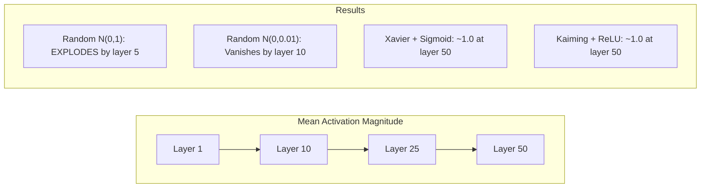
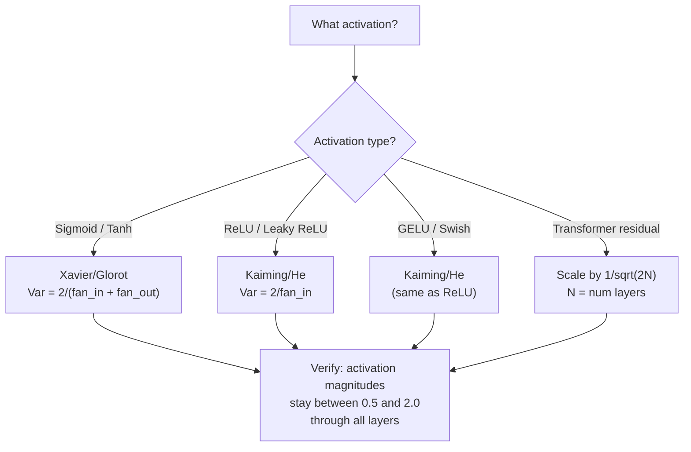

# 权重初始化与训练稳定性

初始化错误会导致训练从未开始。正确初始化后，50层网络的训练过程就像3层一样顺畅。

**类型：**构建
**语言：**Python
**先决条件：**第03.04课（激活函数），第03.07课（正则化）
**时间：**约90分钟

## 学习目标

- Implement zero, random, Xavier/Glorot, and Kaiming/He initialization strategies and measure their effect on activation magnitudes through 50 layers.
- Derive why Xavier init uses Var(w) = 2/(fan_in + fan_out) and Kaiming uses Var(w) = 2/fan_in.
- Demonstrate the symmetry problem with zero initialization and explain why a random scale alone is insufficient.
- Match the correct initialization strategy to the activation function: Xavier for sigmoid/tanh, Kaiming for ReLU/GELU.

## 问题

将所有权重初始化为零。这样就没有东西可以学习。每个神经元计算相同的函数，接收相同的梯度，并且以相同的方式更新。经过10,000个周期后，你的512个神经元的隐藏层仍然只是同一神经元的512个副本。你花费了512个参数，却只得到了1个结果。

如果权重初始化过大，激活值会在网络中爆炸。到第10层时，数值会达到1e15；到第20层时，数值会溢出到无穷大。梯度也会沿着相同的轨迹反向变化。

如果从标准正态分布中随机初始化权重，这种方法适用于3层网络。但在50层时，信号会根据随机缩放值的微小过大而降为零或无限增大。所谓“有效”和“失效”之间的界限非常微妙。

权重初始化是深度学习中最被低估的决策。架构会得到论文的认可，优化器会得到博客文章的关注，但初始化却只得到了一个脚注的提及。但如果出错，其他一切都不重要了——你的网络在训练开始之前就已经死了。

## 概念

### 对称性问题

每一层中的每个神经元都具有相同的结构：将输入乘以权重，加上偏置，然后应用激活函数。如果所有权重都从相同的值开始（零是极端情况），那么每个神经元计算出的输出都是相同的。在反向传播过程中，每个神经元接收到的梯度也是相同的。在更新步骤中，每个神经元的变化量也是相同的。

你遇到了问题。网络有数百个参数，但它们都以同步的方式移动。这被称为对称性，而随机初始化是打破这种对称性的一种暴力方法。每个神经元在权重空间中从不同的起点开始，因此每个神经元学习到不同的特征。

但是“随机”是不够的。随机性的*程度*决定了网络是否能够训练成功。

### 层叠方差传播

考虑一个具有fan_in输入的单层：

```
z = w1*x1 + w2*x2 + ... + w_n*x_n
```

如果每个权重wi来自方差为Var(w)的分布，且每个输入xi的方差为Var(x)，则输出方差为：

```
Var(z) = fan_in * Var(w) * Var(x)
```

如果Var(w) = 1且fan_in = 512，输出方差是输入方差的512倍。经过10层后：512^10 = 1.2e27。你的信号已经爆炸了。

如果Var(w) = 0.001，每层的输出方差会缩小0.001 * 512 = 0.512。经过10层后：0.512^10 = 0.00013。你的信号已经消失了。

目标：选择Var(w)使得Var(z) = Var(x)。信号的幅度在各层中保持恒定。

### Xavier/Glorot Initialization

Glorot和Bengio（2010）推导出了sigmoid和tanh激活函数的解决方案。为了在前向传播和后向传播中保持方差恒定：

```
Var(w) = 2 / (fan_in + fan_out)
```

在实践中，权重来自以下来源：

```
w ~ Uniform(-limit, limit)  where limit = sqrt(6 / (fan_in + fan_out))
```

或：

```
w ~ Normal(0, sqrt(2 / (fan_in + fan_out)))
```

This works because sigmoid and tanh functions are roughly linear near zero, which is the region where properly initialized activation functions operate. The variance remains stable across dozens of layers.

### Kaiming/He Initialization

ReLU将一半的输出置零（所有负数变为零）。由于平均有一半的输入被置零，因此有效的输入值减半。Xavier的初始化方法没有考虑这一点——它低估了所需的方差。

He等人（2015年）调整了公式：

```
Var(w) = 2 / fan_in
```

权重来源于：

```
w ~ Normal(0, sqrt(2 / fan_in))
```

因子2用于补偿ReLU导致一半激活值归零的影响。如果没有这个因子，信号每层会缩小约0.5倍。有50层时：0.5^50 = 8.8e-16。Kaiming初始化可以防止这种情况发生。

### Transformer Initialization

GPT-2 introduced a different pattern. Residual connections add the output of each sub-layer to its input:

```
x = x + sublayer(x)
```

Each additional layer increases variance. With N residual layers, variance grows proportionally to N. GPT-2 scales the weights of residual layers by 1/sqrt(2N), where N is the number of layers. This ensures that the accumulated signal magnitude remains stable.

Llama 3 (405B parameters, 126 layers) uses a similar scheme. Without this scaling, the residual stream would grow indefinitely through 126 layers of attention and feedforward blocks.

```mermaid
flowchart TD
    subgraph "Zero Init"
        Z1["Layer 1<br/>All weights = 0"] --> Z2["Layer 2<br/>All neurons identical"]
        Z2 --> Z3["Layer 3<br/>Still identical"]
        Z3 --> ZR["Result: 1 effective neuron<br/>regardless of width"]
    end

    subgraph "Xavier Init"
        X1["Layer 1<br/>Var = 2/(fan_in+fan_out)"] --> X2["Layer 2<br/>Signal stable"]
        X2 --> X3["Layer 50<br/>Signal stable"]
        X3 --> XR["Result: Trains with<br/>sigmoid/tanh"]
    end

    subgraph "Kaiming Init"
        K1["Layer 1<br/>Var = 2/fan_in"] --> K2["Layer 2<br/>Signal stable"]
        K2 --> K3["Layer 50<br/>Signal stable"]
        K3 --> KR["Result: Trains with<br/>ReLU/GELU"]
    end
```



### 激活强度通过50层实现



### 选择正确的初始化方法



```figure
weight-init-variance
```

## 构建它

### 步骤1：初始化策略

四种初始化权重矩阵的方法。每种方法都会返回一个列表的列表（一个二维矩阵），该矩阵具有扇入列和扇出行。

```python
import math
import random


def zero_init(fan_in, fan_out):
    return [[0.0 for _ in range(fan_in)] for _ in range(fan_out)]


def random_init(fan_in, fan_out, scale=1.0):
    return [[random.gauss(0, scale) for _ in range(fan_in)] for _ in range(fan_out)]


def xavier_init(fan_in, fan_out):
    std = math.sqrt(2.0 / (fan_in + fan_out))
    return [[random.gauss(0, std) for _ in range(fan_in)] for _ in range(fan_out)]


def kaiming_init(fan_in, fan_out):
    std = math.sqrt(2.0 / fan_in)
    return [[random.gauss(0, std) for _ in range(fan_in)] for _ in range(fan_out)]
```

### 步骤2：激活函数

我们需要使用sigmoid、tanh和ReLU来测试每种初始化策略及其预期的激活函数。

```python
def sigmoid(x):
    x = max(-500, min(500, x))
    return 1.0 / (1.0 + math.exp(-x))


def tanh_act(x):
    return math.tanh(x)


def relu(x):
    return max(0.0, x)
```

### 步骤3：通过50层进行前传

通过深度网络传递随机数据，并测量每层的平均激活幅度。

```python
def forward_deep(init_fn, activation_fn, n_layers=50, width=64, n_samples=100):
    random.seed(42)
    layer_magnitudes = []

    inputs = [[random.gauss(0, 1) for _ in range(width)] for _ in range(n_samples)]

    for layer_idx in range(n_layers):
        weights = init_fn(width, width)
        biases = [0.0] * width

        new_inputs = []
        for sample in inputs:
            output = []
            for neuron_idx in range(width):
                z = sum(weights[neuron_idx][j] * sample[j] for j in range(width)) + biases[neuron_idx]
                output.append(activation_fn(z))
            new_inputs.append(output)
        inputs = new_inputs

        magnitudes = []
        for sample in inputs:
            magnitudes.append(sum(abs(v) for v in sample) / width)
        mean_mag = sum(magnitudes) / len(magnitudes)
        layer_magnitudes.append(mean_mag)

    return layer_magnitudes
```

### 步骤4：实验

Run all combinations: zero initialization, random N(0,1), random N(0,0.01), Xavier architecture with sigmoid function, Xavier architecture with tanh function, and Kaiming architecture with ReLU function. Print the magnitudes of important layers.

```python
def run_experiment():
    configs = [
        ("Zero init + Sigmoid", lambda fi, fo: zero_init(fi, fo), sigmoid),
        ("Random N(0,1) + ReLU", lambda fi, fo: random_init(fi, fo, 1.0), relu),
        ("Random N(0,0.01) + ReLU", lambda fi, fo: random_init(fi, fo, 0.01), relu),
        ("Xavier + Sigmoid", xavier_init, sigmoid),
        ("Xavier + Tanh", xavier_init, tanh_act),
        ("Kaiming + ReLU", kaiming_init, relu),
    ]

    print(f"{'Strategy':<30} {'L1':>10} {'L5':>10} {'L10':>10} {'L25':>10} {'L50':>10}")
    print("-" * 80)

    for name, init_fn, act_fn in configs:
        mags = forward_deep(init_fn, act_fn)
        row = f"{name:<30}"
        for idx in [0, 4, 9, 24, 49]:
            val = mags[idx]
            if val > 1e6:
                row += f" {'EXPLODED':>10}"
            elif val < 1e-6:
                row += f" {'VANISHED':>10}"
            else:
                row += f" {val:>10.4f}"
        print(row)
```

### 步骤5：对称性演示

显示零初始化会产生相同的神经元。

```python
def symmetry_demo():
    random.seed(42)
    weights = zero_init(2, 4)
    biases = [0.0] * 4

    inputs = [0.5, -0.3]
    outputs = []
    for neuron_idx in range(4):
        z = sum(weights[neuron_idx][j] * inputs[j] for j in range(2)) + biases[neuron_idx]
        outputs.append(sigmoid(z))

    print("\nSymmetry Demo (4 neurons, zero init):")
    for i, out in enumerate(outputs):
        print(f"  Neuron {i}: output = {out:.6f}")
    all_same = all(abs(outputs[i] - outputs[0]) < 1e-10 for i in range(len(outputs)))
    print(f"  All identical: {all_same}")
    print(f"  Effective parameters: 1 (not {len(weights) * len(weights[0])})")
```

### 步骤6：逐层强度报告

打印一个包含50层激活强度的可视化条形图。

```python
def magnitude_report(name, magnitudes):
    print(f"\n{name}:")
    for i, mag in enumerate(magnitudes):
        if i % 5 == 0 or i == len(magnitudes) - 1:
            if mag > 1e6:
                bar = "X" * 50 + " EXPLODED"
            elif mag < 1e-6:
                bar = "." + " VANISHED"
            else:
                bar_len = min(50, max(1, int(mag * 10)))
                bar = "#" * bar_len
            print(f"  Layer {i+1:3d}: {bar} ({mag:.6f})")
```

## 使用它

PyTorch提供了以下内置函数：

```python
import torch
import torch.nn as nn

layer = nn.Linear(512, 256)

nn.init.xavier_uniform_(layer.weight)
nn.init.xavier_normal_(layer.weight)

nn.init.kaiming_uniform_(layer.weight, nonlinearity='relu')
nn.init.kaiming_normal_(layer.weight, nonlinearity='relu')

nn.init.zeros_(layer.bias)
```

当您调用 `nn.Linear(512, 256)` 时，PyTorch默认使用Kaiming均匀初始化。这就是为什么大多数简单网络能够“正常工作”的原因——PyTorch已经做出了正确的选择。但是，当您构建自定义架构或层数超过20层时，您需要了解发生了什么，并可能覆盖默认设置。

对于变换器，HuggingFace模型通常在其 `_init_weights` 方法中处理初始化问题。GPT-2的实现将残差投影乘以1/sqrt(N)进行缩放。如果您是从头开始构建变换器，则需要自己添加这一步骤。

## 发货

本课程将生成以下文件：
- `outputs/prompt-init-strategy.md` -- 一个用于诊断权重初始化问题并推荐正确策略的提示词

## 练习

1. Add LeCun initialization (Var = 1/fan_in, designed for SELU activation). Run the 50-layer experiment with LeCun init + tanh and compare to Xavier + tanh.

2. Implement the GPT-2 residual scaling: multiply the output of each layer by 1/sqrt(2*N) before adding to the residual stream. Run 50 layers with and without scaling, measure how fast the residual magnitude grows.

3. Create an "init health check" function that takes a network's layer dimensions and activation type, then recommends the correct initialization and warns if the current init will cause problems.

4. Run the experiment with fan_in = 16 vs fan_in = 1024. Xavier and Kaiming adapt to fan_in, but random init doesn't. Show how the gap between "works" and "breaks" widens with larger layers.

5. Implement orthogonal initialization (generate a random matrix, compute its SVD, use the orthogonal matrix U). Compare to Kaiming for ReLU networks at 50 layers.

## | 关键词 | 翻译 |

| 术语 | 人们怎么说 | 实际含义 |
|------|------------|----------|
| 权重初始化 | “随机设置初始权重” | 选择初始权重值的策略，决定了网络是否能够训练 |
| 对称性破坏 | “使神经元不同” | 使用随机初始化确保神经元学习不同的特征，而不是计算相同的函数 |
| 输入数量 | “神经元的输入数量” | 传入连接的数量，决定了输入方差如何在加权和中累积 |
| 输出数量 | “神经元的输出数量” | 传出连接的数量，对于在反向传播过程中保持梯度方差很重要 |
| Xavier/Glorot初始化 | “Sigmoid初始化” | Var(w) = 2/(输入数量 + 输出数量)，旨在通过Sigmoid和Tanh激活函数保留方差 |
| Kaiming/He初始化 | “ReLU初始化” | Var(w) = 2/输入数量，考虑了ReLU将一半激活值归零的情况 |
| 方差传播 | “信号如何通过层增长或缩小” | 基于权重比例分析激活方差如何逐层变化的数学过程 |
| 残差缩放 | “GPT-2的初始化技巧” | 通过将残差连接权重乘以1/sqrt(2N)来防止通过N个变换器层导致方差增长 |
| 死亡网络 | “无法训练的网络” | 由于初始化不良导致所有梯度为零或所有激活值饱和的网络 |
| 爆炸激活值 | “值趋于无穷大” | 当权重方差过高时，导致激活幅度在层中呈指数级增长 |

## 更多阅读资料

- Glorot & Bengio, “Understanding the difficulty of training deep feedforward neural networks” (2010) — the original Xavier initialization paper with variance analysis  
- He et al., “Delving Deep into Rectifiers” (2015) — introduced Kaiming initialization for ReLU networks  
- Radford et al., “Language Models are Unsupervised Multitask Learners” (2019) — GPT-2 paper with residual scaling initialization  
- Mishkin & Matas, “All You Need is a Good Init” (2016) — layer-sequential unit-variance initialization, an empirical alternative to analytical formulas
