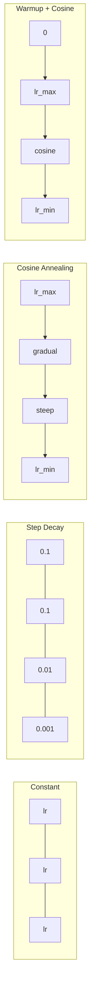
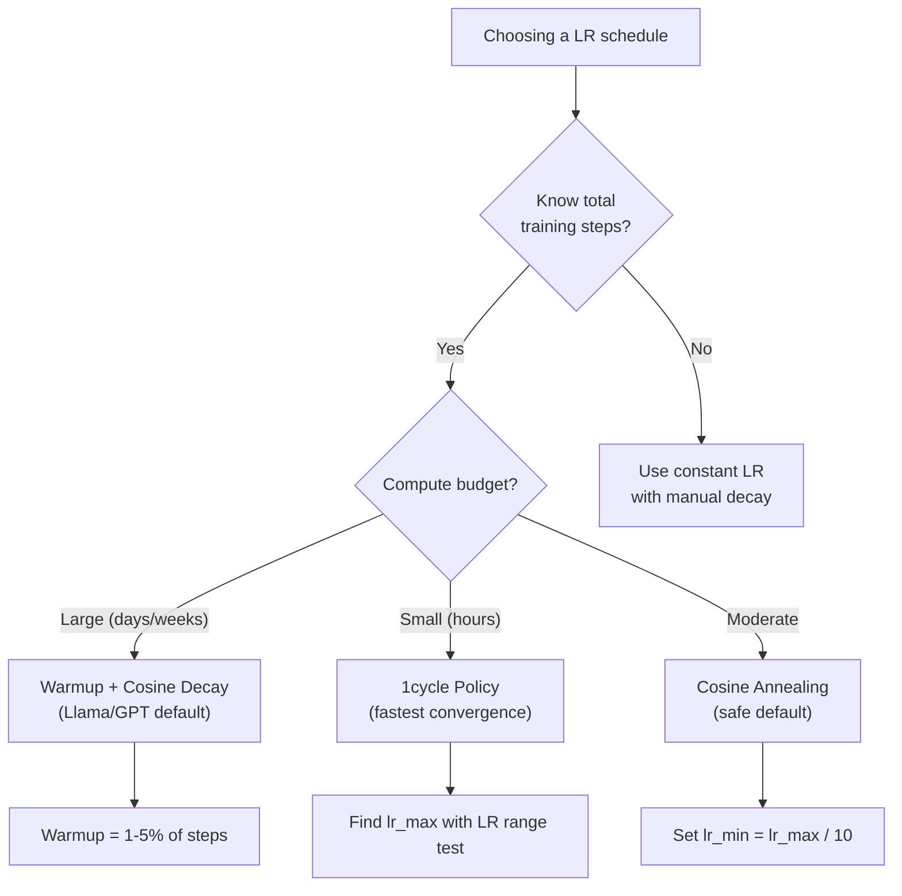
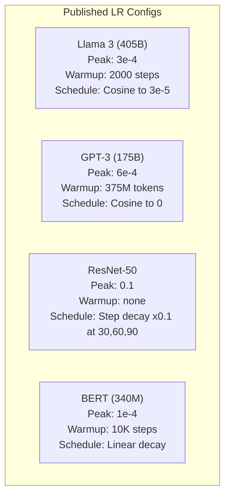

# 学习率调度和预热

学习率是最重要的超参数。不是架构，不是数据集大小，也不是激活函数。是学习率。如果你不调整其他参数，那就调整这个。

**类型：**构建
**语言：**Python
**先决条件：**第03.06课（优化器），第03.08课（权重初始化）
**时间：**约90分钟

## 学习目标

- Implement constant, step decay, cosine annealing, warmup + cosine, and 1cycle learning rate schedules from scratch
- Demonstrate the three failure modes of learning rate selection: divergence (too high), stalling (too low), and oscillation (no decay)
- Explain why warmup is necessary for Adam-based optimizers and how it stabilizes early training
- Compare convergence speed across all five schedules on the same task and select the appropriate one for a given training budget

## 问题

将学习率设置为0.1。训练过程出现发散——损失在3步内无限增大。将其设置为0.0001。训练过程趋于平稳——经过100个周期后，模型几乎无法从随机状态移动。将其设置为0.01。训练持续50个周期后，损失在某个最小值附近波动，但由于步长过大，模型永远无法达到该最小值。

最优学习率不是恒定的。它在训练过程中会变化。早期需要较大的步长以快速覆盖领域；后期则需要较小的步长以达到精确的最小值。一个准确率90%的模型与一个准确率95%的模型之间的差异往往只是由于学习率的差异造成的。

过去三年发布的每个重要模型都使用了学习率调度。Llama 3使用峰值学习率为3e-4，预热步骤为2000步，并采用余弦衰减至3e-5。GPT-3使用学习率为6e-4，预热过程涉及375百万个令牌。这些选择并非随意，而是经过数百万美元投入的广泛超参数调优的结果。

你需要理解学习率调度，因为默认设置可能不适用于你的问题。当微调预训练模型时，正确的调度与从头开始训练时不同。当增加批量大小时，预热期需要相应调整。当在10,000步时训练中断时，你需要确定这是否是调度问题还是其他原因。

## 概念

### 恒定学习率

最简单的方法。选择一个数字，将其用于每一步操作。

```
lr(t) = lr_0
```

这很少是理想的。要么在训练结束时过高（围绕最小值振荡），要么在开始时过低（在微小的步骤上浪费计算资源）。对于小型模型和调试来说效果不错。但对于那些需要训练超过一小时的情况，则不是一个好的选择。

### Step Decay

传统的方法来自ResNet时代。在固定的周期内，将学习率降低一个因子（通常是10倍）。

```
lr(t) = lr_0 * gamma^(floor(epoch / step_size))
```

其中，gamma = 0.1且step_size = 30表示：每30个周期，损失函数的值下降10倍。ResNet-50使用了这一参数——lr=0.1，在30、60和90个周期时损失值分别下降10倍。

问题在于：最佳衰减点取决于数据集和架构。如果转换到不同的问题，就需要重新调整何时进行衰减。这种转变是突然的——当衰减率突然改变时，损失可能会急剧上升。

### 余弦退火

从最大学习率平滑衰减到最小，遵循余弦曲线：

```
lr(t) = lr_min + 0.5 * (lr_max - lr_min) * (1 + cos(pi * t / T))
```

其中 t 是当前步骤，T 是总步骤数。在 t=0 时，余弦项为 1，因此 lr = lr_max。在 t=T 时，余弦项为 -1，因此 lr = lr_min。衰减最初较为温和，中间阶段加速，最后又变得温和。

这是大多数现代训练运行的默认设置。无需调整超参数，只需关注 lr_max 和 lr_min。余弦曲线形状与经验观察结果一致，即大部分学习过程发生在训练的中间阶段——在这个关键时期需要合理的步长。

### 热身：为何从小规模开始

Adam和其他自适应优化器会持续维护梯度均值和方差的估计值。在步骤0时，这些估计值被初始化为零。最初的几次梯度更新基于不稳定的统计数据。如果在此期间学习率过大，模型将采取巨大的、方向错误的步骤。

热身机制可以解决这个问题。从极小的学习率开始（通常是lr_max / warmup_steps或甚至零），然后在前N步内线性增加至lr_max。当达到完整的学习率时，Adam的统计数据已经稳定。

```
lr(t) = lr_max * (t / warmup_steps)     for t < warmup_steps
```

典型的热身阶段占总训练步骤的1-5%。Llama 3经过约1.8万亿个令牌的训练，热身阶段进行了2000步。GPT-3则使用了超过3.75亿个令牌进行热身。

### 线性热身 + 余弦衰减

现代默认设置。线性增长，然后以余弦函数衰减：

```
if t < warmup_steps:
    lr(t) = lr_max * (t / warmup_steps)
else:
    progress = (t - warmup_steps) / (total_steps - warmup_steps)
    lr(t) = lr_min + 0.5 * (lr_max - lr_min) * (1 + cos(pi * progress))
```

这是Llama、GPT、PaLM以及大多数现代transformers所使用的技术。热身过程可以防止早期的不稳定性。余弦衰减使模型稳定在一个良好的最小值上。

### 1Cycle Policy

Leslie Smith的发现（2018年）：在训练的前半段将学习率从低值提高到高值，然后在后半段再将其降低。这似乎违反直觉——为什么会在训练过程中途*增加*学习率呢？

理论依据是：较高的学习率通过为优化轨迹添加噪声来起到正则化的作用。模型在加速阶段探索更多的损失空间，找到更好的“盆地”。然后，在减速阶段，模型在找到的最佳“盆地”内进行优化。

```
Phase 1 (0 to T/2):    lr ramps from lr_max/25 to lr_max
Phase 2 (T/2 to T):    lr ramps from lr_max to lr_max/10000
```

在固定的计算预算下，1周期的训练通常比余弦退火更快。但代价是：你必须提前知道总步数。

### Schedule Shapes



### 决策流程图



### 已发布模型中的实数



```figure
lr-schedule
```

## 构建它

### 步骤1：安排函数

每个函数都接受当前步骤，并返回该步骤的学习率。

```python
import math


def constant_schedule(step, lr=0.01, **kwargs):
    return lr


def step_decay_schedule(step, lr=0.1, step_size=100, gamma=0.1, **kwargs):
    return lr * (gamma ** (step // step_size))


def cosine_schedule(step, lr=0.01, total_steps=1000, lr_min=1e-5, **kwargs):
    if step >= total_steps:
        return lr_min
    return lr_min + 0.5 * (lr - lr_min) * (1 + math.cos(math.pi * step / total_steps))


def warmup_cosine_schedule(step, lr=0.01, total_steps=1000, warmup_steps=100, lr_min=1e-5, **kwargs):
    if total_steps <= warmup_steps:
        return lr * (step / max(warmup_steps, 1))
    if step < warmup_steps:
        return lr * step / warmup_steps
    progress = (step - warmup_steps) / (total_steps - warmup_steps)
    return lr_min + 0.5 * (lr - lr_min) * (1 + math.cos(math.pi * progress))


def one_cycle_schedule(step, lr=0.01, total_steps=1000, **kwargs):
    mid = max(total_steps // 2, 1)
    if step < mid:
        return (lr / 25) + (lr - lr / 25) * step / mid
    else:
        progress = (step - mid) / max(total_steps - mid, 1)
        return lr * (1 - progress) + (lr / 10000) * progress
```

### 步骤2：可视化所有调度

打印一个基于文本的图表，显示每个调度在训练过程中的演变情况。

```python
def visualize_schedule(name, schedule_fn, total_steps=500, **kwargs):
    steps = list(range(0, total_steps, total_steps // 20))
    if total_steps - 1 not in steps:
        steps.append(total_steps - 1)

    lrs = [schedule_fn(s, total_steps=total_steps, **kwargs) for s in steps]
    max_lr = max(lrs) if max(lrs) > 0 else 1.0

    print(f"\n{name}:")
    for s, lr_val in zip(steps, lrs):
        bar_len = int(lr_val / max_lr * 40)
        bar = "#" * bar_len
        print(f"  Step {s:4d}: lr={lr_val:.6f} {bar}")
```

### 步骤3：训练网络

在圆形数据集上构建一个简单的两层网络，与之前的课程相同，但现在我们改变调度方式。

```python
import random


def sigmoid(x):
    x = max(-500, min(500, x))
    return 1.0 / (1.0 + math.exp(-x))


def relu(x):
    return max(0.0, x)


def relu_deriv(x):
    return 1.0 if x > 0 else 0.0


def make_circle_data(n=200, seed=42):
    random.seed(seed)
    data = []
    for _ in range(n):
        x = random.uniform(-2, 2)
        y = random.uniform(-2, 2)
        label = 1.0 if x * x + y * y < 1.5 else 0.0
        data.append(([x, y], label))
    return data


def train_with_schedule(schedule_fn, schedule_name, data, epochs=300, base_lr=0.05, **kwargs):
    random.seed(0)
    hidden_size = 8
    total_steps = epochs * len(data)

    std = math.sqrt(2.0 / 2)
    w1 = [[random.gauss(0, std) for _ in range(2)] for _ in range(hidden_size)]
    b1 = [0.0] * hidden_size
    w2 = [random.gauss(0, std) for _ in range(hidden_size)]
    b2 = 0.0

    step = 0
    epoch_losses = []

    for epoch in range(epochs):
        total_loss = 0
        correct = 0

        for x, target in data:
            lr = schedule_fn(step, lr=base_lr, total_steps=total_steps, **kwargs)

            z1 = []
            h = []
            for i in range(hidden_size):
                z = w1[i][0] * x[0] + w1[i][1] * x[1] + b1[i]
                z1.append(z)
                h.append(relu(z))

            z2 = sum(w2[i] * h[i] for i in range(hidden_size)) + b2
            out = sigmoid(z2)

            error = out - target
            d_out = error * out * (1 - out)

            for i in range(hidden_size):
                d_h = d_out * w2[i] * relu_deriv(z1[i])
                w2[i] -= lr * d_out * h[i]
                for j in range(2):
                    w1[i][j] -= lr * d_h * x[j]
                b1[i] -= lr * d_h
            b2 -= lr * d_out

            total_loss += (out - target) ** 2
            if (out >= 0.5) == (target >= 0.5):
                correct += 1
            step += 1

        avg_loss = total_loss / len(data)
        accuracy = correct / len(data) * 100
        epoch_losses.append(avg_loss)

    return epoch_losses
```

### 步骤4：比较所有调度

使用相同的网络进行每个调度，并比较最终的损失和收敛行为。

```python
def compare_schedules(data):
    configs = [
        ("Constant", constant_schedule, {}),
        ("Step Decay", step_decay_schedule, {"step_size": 15000, "gamma": 0.1}),
        ("Cosine", cosine_schedule, {"lr_min": 1e-5}),
        ("Warmup+Cosine", warmup_cosine_schedule, {"warmup_steps": 3000, "lr_min": 1e-5}),
        ("1cycle", one_cycle_schedule, {}),
    ]

    print(f"\n{'Schedule':<20} {'Start Loss':>12} {'Mid Loss':>12} {'End Loss':>12} {'Best Loss':>12}")
    print("-" * 70)

    for name, schedule_fn, extra_kwargs in configs:
        losses = train_with_schedule(schedule_fn, name, data, epochs=300, base_lr=0.05, **extra_kwargs)
        mid_idx = len(losses) // 2
        best = min(losses)
        print(f"{name:<20} {losses[0]:>12.6f} {losses[mid_idx]:>12.6f} {losses[-1]:>12.6f} {best:>12.6f}")
```

### 步骤5：LR过高与过低

演示三种故障模式：过高（发散）、过低（爬行）和恰到好处。

```python
def lr_sensitivity(data):
    learning_rates = [1.0, 0.1, 0.01, 0.001, 0.0001]

    print("\nLR Sensitivity (constant schedule, 100 epochs):")
    print(f"  {'LR':>10} {'Start Loss':>12} {'End Loss':>12} {'Status':>15}")
    print("  " + "-" * 52)

    for lr in learning_rates:
        losses = train_with_schedule(constant_schedule, f"lr={lr}", data, epochs=100, base_lr=lr)
        start = losses[0]
        end = losses[-1]

        if end > start or math.isnan(end) or end > 1.0:
            status = "DIVERGED"
        elif end > start * 0.9:
            status = "BARELY MOVED"
        elif end < 0.15:
            status = "CONVERGED"
        else:
            status = "LEARNING"

        end_str = f"{end:.6f}" if not math.isnan(end) else "NaN"
        print(f"  {lr:>10.4f} {start:>12.6f} {end_str:>12} {status:>15}")
```

## 使用它

PyTorch提供了`torch.optim.lr_scheduler`中的调度器：

```python
import torch
import torch.optim as optim
from torch.optim.lr_scheduler import CosineAnnealingLR, OneCycleLR, StepLR

model = nn.Sequential(nn.Linear(10, 64), nn.ReLU(), nn.Linear(64, 1))
optimizer = optim.Adam(model.parameters(), lr=3e-4)

scheduler = CosineAnnealingLR(optimizer, T_max=1000, eta_min=1e-5)

for step in range(1000):
    loss = train_step(model, optimizer)
    scheduler.step()
```

对于热身和余弦函数计算，可以使用Lambda调度器或HuggingFace的`get_cosine_schedule_with_warmup`。

```python
from transformers import get_cosine_schedule_with_warmup

scheduler = get_cosine_schedule_with_warmup(
    optimizer,
    num_warmup_steps=2000,
    num_training_steps=100000,
)
```

HuggingFace函数是最常用的Llama和GPT微调脚本所使用的功能。如果不确定，可以使用预热机制加上余弦函数，其中预热时间占总步骤的3-5%。这种方法适用于几乎所有情况。

## 发货

本课程将生成以下文件：
- `outputs/prompt-lr-schedule-advisor.md` -- 一个提示词，建议适合您训练环境的正确学习率调度和超参数设置

## 练习

1. Implement exponential decay: lr(t) = lr_0 * gamma^t where gamma = 0.999. Compare this with cosine annealing on the circle dataset.

2. Implement the learning rate range test (Leslie Smith): train for a few hundred steps while exponentially increasing the LR from 1e-7 to 1. Plot loss vs LR. The optimal max LR is the value just before the loss starts to increase.

3. Train with warmup + cosine but vary the warmup length: 0%, 1%, 5%, 10%, 20% of total steps. Find the optimal combination that results in the most stable training process.

4. Implement cosine annealing with warm restarts (SGDR): reset the learning rate to lr_max every T steps and then decay it again. Compare this with standard cosine annealing for a longer training period.

5. Create a “schedule surgeon” that monitors the training loss and automatically switches from warmup to cosine annealing when the loss stabilizes. If the loss plateaus for too long, reduce the learning rate (lr).

## | 关键词 | 翻译 |

| 术语 | 人们怎么说 | 实际含义 |
|------|------------|----------|
| 学习率 | “模型的学习速度” | 用于乘以梯度以确定参数更新大小的标量 |
| 调度 | “随时间改变学习率” | 将训练步长映射到学习率的函数，旨在优化收敛性 |
| 热身 | “从较小的学习率开始” | 在前N步内线性地将学习率从接近零增加到目标值，以稳定优化器统计信息 |
| 余弦退火 | “平滑学习率衰减” | 在训练过程中根据余弦曲线从lr_max减少到lr_min来降低学习率 |
| 阶梯式衰减 | “在里程碑处降低学习率” | 在固定的周期间隔内将学习率乘以一个因子（通常为0.1） |
| 单循环策略 | “先上升再下降” | Leslie Smith的方法，在单个循环中先上升后下降以实现更快的收敛性 |
| 学习率范围测试 | “找到最佳学习率” | 通过短暂训练并增加学习率来找到损失开始发散的值 |
| 余弦退火加重启 | “重置并重复” | 定期将学习率重置为lr_max并再次衰减（SGDR） |
| Eta最小值 | “学习率的下限” | 调度衰减到的最小学习率 |
| 峰值学习率 | “最大学习率” | 训练过程中达到的最高学习率，通常在热身之后 |

## 更多阅读资料

- Loshchilov & Hutter, “SGDR: Stochastic Gradient Descent with Warm Restarts” (2017) -- introduced cosine annealing and warm restarts.  
- Smith, “Super-Convergence: Very Fast Training of Neural Networks Using Large Learning Rates” (2018) -- the 1cycle policy paper.  
- Touvron et al., “Llama 2: Open Foundation and Fine-Tuned Chat Models” (2023) -- documents the warmup + cosine schedule used at scale.  
- Goyal et al., “Accurate, Large Minibatch SGD: Training ImageNet in 1 Hour” (2017) -- linear scaling rule and warmup for large batch training.
