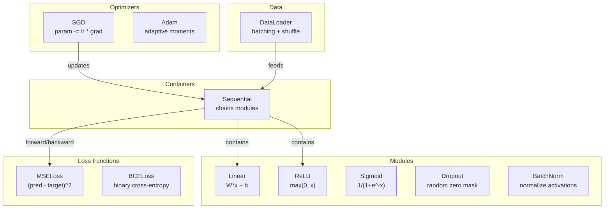
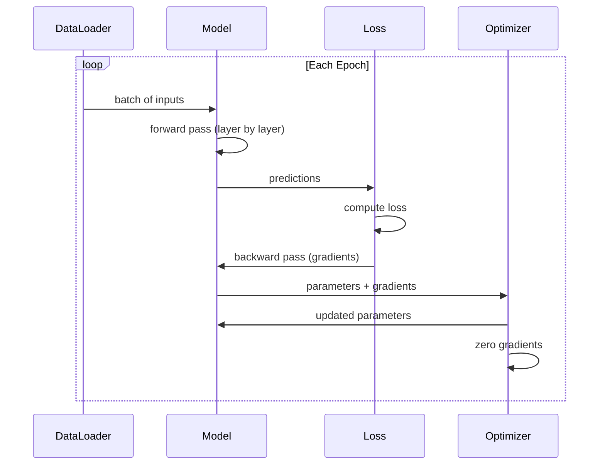
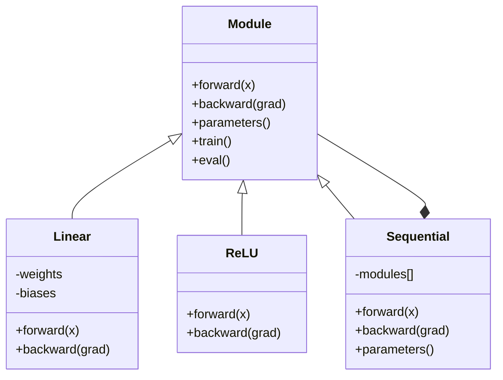

# 构建你自己的迷你框架

您已经构建了神经元、层、网络、反向传播、激活函数、损失函数、优化器、正则化、初始化以及LR调度。这些都是独立的组成部分。现在，将它们连接成一个框架。不是PyTorch，也不是TensorFlow，而是您的框架。

**类型：**构建
**语言：**Python
**先决条件：**第03阶段的所有课程（第01-09课）
**时间：**约120分钟

## 学习目标

- Build a complete deep learning framework (~500 lines of code) using modules, linear layers, ReLU, Sigmoid, Dropout, BatchNorm, Sequential, loss functions, optimizers, and DataLoader.
- Explain the concept of module abstraction (forward, backward, parameters) and explain why toggling between train/eval mode is necessary.
- Integrate all components into a functional training loop that trains a 4-layer network for circle classification.
- Map each component in your framework to its corresponding PyTorch equivalent (nn.Module, nn.Sequential, optim.Adam, DataLoader).

## 问题

您有十节课关于构建模块，分散在不同的文件中。这里有一个`Value`类，那里有一个训练循环，另一个文件中有权重初始化，再另一个文件中有学习率调度。要训练一个网络，您需要从五不同的课程中复制粘贴代码，然后手动将它们连接在一起。

这就是框架解决的问题。PyTorch提供了`nn.Module`、`nn.Sequential`、`optim.Adam`、`DataLoader`以及一个将它们联系起来的训练循环模式。TensorFlow则提供`keras.Layer`、`keras.Sequential`、`keras.optimizers.Adam`。这些并不是魔法，它们是组织模式，使得定义、训练和评估网络成为可能，而无需每次都重新发明轮子。

您将在大约500行Python代码中构建同样的东西。不需要numpy，也不需要外部依赖。一个能够定义任何前馈网络、使用SGD或Adam进行训练、批量处理数据、应用dropout和批量归一化、使用任何激活函数以及安排学习率调度的框架。

完成后，您将确切理解在PyTorch中编写`model = nn.Sequential(...)`时会发生什么。您将理解为什么存在`model.train()`和`model.eval()`。您将理解为什么`optimizer.zero_grad()`是一个单独的调用。您将完全理解这一切，因为您自己构建了这一切。

## 概念

### 模块抽象

在PyTorch中，每一层都继承自`nn.Module`。一个Module有三个职责：

1. **forward()** -- 计算给定输入的输出
2. **parameters()** -- 返回所有可训练的权重
3. **backward()** -- 计算梯度（由PyTorch中的autograd处理，在我们的实现中则是显式处理的）

线性层是一个Module。ReLU激活函数也是一个Module。dropout层是一个Module。批量归一化层也是一个Module。它们都具有相同的接口。

### 顺序容器

`nn.Sequential` chains Modules. Forward pass: feed data through Module 1, then Module 2, then Module 3. Backward pass: reverse the chain. The container itself is a Module -- it has forward(), parameters(), and backward(). This is the composite pattern: a sequence of Modules is itself a Module.

### Training Mode vs Evaluation Mode

在训练过程中，Dropout会随机使神经元归零，但在评估时则将所有数据传递过去。批量归一化在训练时使用批量统计信息，而在评估时则使用运行平均值。`train()`和`eval()`方法可以切换这种行为。每个模块都有一个`training`标志。

### Optimizer

优化器使用参数梯度来更新参数。SGD：`param -= lr * grad`。Adam：保持动量和方差估计，然后进行更新。优化器不知道网络架构的信息——它只看到参数的扁平列表及其梯度。

### DataLoader

Batching is important for two reasons. First, for large problems, it is not possible to store the entire dataset in memory. Second, mini-batch gradient descent introduces noise that helps escape from local minima. DataLoader divides data into batches and optionally shuffles them between epochs.

### 框架架构



### 训练循环



### 模块层次结构



```figure
gradient-clipping
```

## 构建它

### 步骤1：模块基类

每个层实现的抽象接口。

```python
class Module:
    def __init__(self):
        self.training = True

    def forward(self, x):
        raise NotImplementedError

    def backward(self, grad):
        raise NotImplementedError

    def parameters(self):
        return []

    def train(self):
        self.training = True

    def eval(self):
        self.training = False
```

### 步骤2：线性层

基本构建块。存储权重和偏差，计算Wx + b的前向传播，以及权重/输入的梯度反向传播。

```python
import math
import random


class Linear(Module):
    def __init__(self, fan_in, fan_out):
        super().__init__()
        std = math.sqrt(2.0 / fan_in)
        self.weights = [[random.gauss(0, std) for _ in range(fan_in)] for _ in range(fan_out)]
        self.biases = [0.0] * fan_out
        self.weight_grads = [[0.0] * fan_in for _ in range(fan_out)]
        self.bias_grads = [0.0] * fan_out
        self.fan_in = fan_in
        self.fan_out = fan_out
        self.input = None

    def forward(self, x):
        self.input = x
        output = []
        for i in range(self.fan_out):
            val = self.biases[i]
            for j in range(self.fan_in):
                val += self.weights[i][j] * x[j]
            output.append(val)
        return output

    def backward(self, grad):
        input_grad = [0.0] * self.fan_in
        for i in range(self.fan_out):
            self.bias_grads[i] += grad[i]
            for j in range(self.fan_in):
                self.weight_grads[i][j] += grad[i] * self.input[j]
                input_grad[j] += grad[i] * self.weights[i][j]
        return input_grad

    def parameters(self):
        params = []
        for i in range(self.fan_out):
            for j in range(self.fan_in):
                params.append((self.weights, i, j, self.weight_grads))
            params.append((self.biases, i, None, self.bias_grads))
        return params
```

### 步骤3：激活模块

ReLU、Sigmoid和Tanh作为模块使用。每个模块都缓存了它进行反向传播所需的数据。

```python
class ReLU(Module):
    def __init__(self):
        super().__init__()
        self.mask = None

    def forward(self, x):
        self.mask = [1.0 if v > 0 else 0.0 for v in x]
        return [max(0.0, v) for v in x]

    def backward(self, grad):
        return [g * m for g, m in zip(grad, self.mask)]


class Sigmoid(Module):
    def __init__(self):
        super().__init__()
        self.output = None

    def forward(self, x):
        self.output = []
        for v in x:
            v = max(-500, min(500, v))
            self.output.append(1.0 / (1.0 + math.exp(-v)))
        return self.output

    def backward(self, grad):
        return [g * o * (1 - o) for g, o in zip(grad, self.output)]


class Tanh(Module):
    def __init__(self):
        super().__init__()
        self.output = None

    def forward(self, x):
        self.output = [math.tanh(v) for v in x]
        return self.output

    def backward(self, grad):
        return [g * (1 - o * o) for g, o in zip(grad, self.output)]
```

### 步骤4：丢弃模块

在训练过程中随机将元素置零。将剩余元素的数值乘以 1/(1-p)，以保持期望值不变。在评估过程中不执行任何操作。

```python
class Dropout(Module):
    def __init__(self, p=0.5):
        super().__init__()
        self.p = p
        self.mask = None

    def forward(self, x):
        if not self.training:
            return x
        self.mask = [0.0 if random.random() < self.p else 1.0 / (1 - self.p) for _ in x]
        return [v * m for v, m in zip(x, self.mask)]

    def backward(self, grad):
        if self.mask is None:
            return grad
        return [g * m for g, m in zip(grad, self.mask)]
```

### 步骤5：BatchNorm模块

normalize activations to zero mean and unit variance per feature across the batch. Maintain running statistics for eval mode.

```python
class BatchNorm(Module):
    def __init__(self, size, momentum=0.1, eps=1e-5):
        super().__init__()
        self.size = size
        self.gamma = [1.0] * size
        self.beta = [0.0] * size
        self.gamma_grads = [0.0] * size
        self.beta_grads = [0.0] * size
        self.running_mean = [0.0] * size
        self.running_var = [1.0] * size
        self.momentum = momentum
        self.eps = eps
        self.x_norm = None
        self.std_inv = None
        self.batch_input = None

    def forward_batch(self, batch):
        batch_size = len(batch)
        output_batch = []

        if self.training:
            mean = [0.0] * self.size
            for sample in batch:
                for j in range(self.size):
                    mean[j] += sample[j]
            mean = [m / batch_size for m in mean]

            var = [0.0] * self.size
            for sample in batch:
                for j in range(self.size):
                    var[j] += (sample[j] - mean[j]) ** 2
            var = [v / batch_size for v in var]

            self.std_inv = [1.0 / math.sqrt(v + self.eps) for v in var]

            self.x_norm = []
            self.batch_input = batch
            for sample in batch:
                normed = [(sample[j] - mean[j]) * self.std_inv[j] for j in range(self.size)]
                self.x_norm.append(normed)
                output = [self.gamma[j] * normed[j] + self.beta[j] for j in range(self.size)]
                output_batch.append(output)

            for j in range(self.size):
                self.running_mean[j] = (1 - self.momentum) * self.running_mean[j] + self.momentum * mean[j]
                self.running_var[j] = (1 - self.momentum) * self.running_var[j] + self.momentum * var[j]
        else:
            std_inv = [1.0 / math.sqrt(v + self.eps) for v in self.running_var]
            for sample in batch:
                normed = [(sample[j] - self.running_mean[j]) * std_inv[j] for j in range(self.size)]
                output = [self.gamma[j] * normed[j] + self.beta[j] for j in range(self.size)]
                output_batch.append(output)

        return output_batch

    def forward(self, x):
        result = self.forward_batch([x])
        return result[0]

    def backward(self, grad):
        if self.x_norm is None:
            return grad
        for j in range(self.size):
            self.gamma_grads[j] += self.x_norm[0][j] * grad[j]
            self.beta_grads[j] += grad[j]
        return [grad[j] * self.gamma[j] * self.std_inv[j] for j in range(self.size)]

    def parameters(self):
        params = []
        for j in range(self.size):
            params.append((self.gamma, j, None, self.gamma_grads))
            params.append((self.beta, j, None, self.beta_grads))
        return params
```

### 步骤6：顺序容器

链接模块。正向从左到右，反向从右到左。

```python
class Sequential(Module):
    def __init__(self, *modules):
        super().__init__()
        self.modules = list(modules)

    def forward(self, x):
        for module in self.modules:
            x = module.forward(x)
        return x

    def backward(self, grad):
        for module in reversed(self.modules):
            grad = module.backward(grad)
        return grad

    def parameters(self):
        params = []
        for module in self.modules:
            params.extend(module.parameters())
        return params

    def train(self):
        self.training = True
        for module in self.modules:
            module.train()

    def eval(self):
        self.training = False
        for module in self.modules:
            module.eval()
```

### 步骤7：损失函数

MSE和二进制交叉熵。每个都返回损失值，并提供一个向后函数，该函数返回梯度。

```python
class MSELoss:
    def __call__(self, predicted, target):
        self.predicted = predicted
        self.target = target
        n = len(predicted)
        self.loss = sum((p - t) ** 2 for p, t in zip(predicted, target)) / n
        return self.loss

    def backward(self):
        n = len(self.predicted)
        return [2 * (p - t) / n for p, t in zip(self.predicted, self.target)]


class BCELoss:
    def __call__(self, predicted, target):
        self.predicted = predicted
        self.target = target
        eps = 1e-7
        n = len(predicted)
        self.loss = 0
        for p, t in zip(predicted, target):
            p = max(eps, min(1 - eps, p))
            self.loss += -(t * math.log(p) + (1 - t) * math.log(1 - p))
        self.loss /= n
        return self.loss

    def backward(self):
        eps = 1e-7
        n = len(self.predicted)
        grads = []
        for p, t in zip(self.predicted, self.target):
            p = max(eps, min(1 - eps, p))
            grads.append((-t / p + (1 - t) / (1 - p)) / n)
        return grads
```

### 步骤8：SGD和Adam优化器

两者都接受一个参数列表，并使用梯度更新权重。

```python
class SGD:
    def __init__(self, parameters, lr=0.01):
        self.params = parameters
        self.lr = lr

    def step(self):
        for container, i, j, grad_container in self.params:
            if j is not None:
                container[i][j] -= self.lr * grad_container[i][j]
            else:
                container[i] -= self.lr * grad_container[i]

    def zero_grad(self):
        for container, i, j, grad_container in self.params:
            if j is not None:
                grad_container[i][j] = 0.0
            else:
                grad_container[i] = 0.0


class Adam:
    def __init__(self, parameters, lr=0.001, beta1=0.9, beta2=0.999, eps=1e-8):
        self.params = parameters
        self.lr = lr
        self.beta1 = beta1
        self.beta2 = beta2
        self.eps = eps
        self.t = 0
        self.m = [0.0] * len(parameters)
        self.v = [0.0] * len(parameters)

    def step(self):
        self.t += 1
        for idx, (container, i, j, grad_container) in enumerate(self.params):
            if j is not None:
                g = grad_container[i][j]
            else:
                g = grad_container[i]

            self.m[idx] = self.beta1 * self.m[idx] + (1 - self.beta1) * g
            self.v[idx] = self.beta2 * self.v[idx] + (1 - self.beta2) * g * g

            m_hat = self.m[idx] / (1 - self.beta1 ** self.t)
            v_hat = self.v[idx] / (1 - self.beta2 ** self.t)

            update = self.lr * m_hat / (math.sqrt(v_hat) + self.eps)

            if j is not None:
                container[i][j] -= update
            else:
                container[i] -= update

    def zero_grad(self):
        for container, i, j, grad_container in self.params:
            if j is not None:
                grad_container[i][j] = 0.0
            else:
                grad_container[i] = 0.0
```

### 步骤9：DataLoader

将数据分成批次，可选地对每个时期进行随机排序。

```python
class DataLoader:
    def __init__(self, data, batch_size=32, shuffle=True):
        self.data = data
        self.batch_size = batch_size
        self.shuffle = shuffle

    def __iter__(self):
        indices = list(range(len(self.data)))
        if self.shuffle:
            random.shuffle(indices)
        for start in range(0, len(indices), self.batch_size):
            batch_indices = indices[start:start + self.batch_size]
            batch = [self.data[i] for i in batch_indices]
            inputs = [item[0] for item in batch]
            targets = [item[1] for item in batch]
            yield inputs, targets

    def __len__(self):
        return (len(self.data) + self.batch_size - 1) // self.batch_size
```

### 步骤10：在Circle分类上训练四层网络

将所有部件连接在一起。定义模型，选择损失函数，选择优化器，运行训练循环。

```python
def make_circle_data(n=500, seed=42):
    random.seed(seed)
    data = []
    for _ in range(n):
        x = random.uniform(-2, 2)
        y = random.uniform(-2, 2)
        label = 1.0 if x * x + y * y < 1.5 else 0.0
        data.append(([x, y], [label]))
    return data


def train():
    random.seed(42)

    model = Sequential(
        Linear(2, 16),
        ReLU(),
        Linear(16, 16),
        ReLU(),
        Linear(16, 8),
        ReLU(),
        Linear(8, 1),
        Sigmoid(),
    )

    criterion = BCELoss()
    optimizer = Adam(model.parameters(), lr=0.01)

    data = make_circle_data(500)
    split = int(len(data) * 0.8)
    train_data = data[:split]
    test_data = data[split:]

    loader = DataLoader(train_data, batch_size=16, shuffle=True)

    model.train()

    for epoch in range(100):
        total_loss = 0
        total_correct = 0
        total_samples = 0

        for batch_inputs, batch_targets in loader:
            batch_loss = 0
            for x, t in zip(batch_inputs, batch_targets):
                pred = model.forward(x)
                loss = criterion(pred, t)
                batch_loss += loss

                optimizer.zero_grad()
                grad = criterion.backward()
                model.backward(grad)
                optimizer.step()

                predicted_class = 1.0 if pred[0] >= 0.5 else 0.0
                if predicted_class == t[0]:
                    total_correct += 1
                total_samples += 1

            total_loss += batch_loss

        avg_loss = total_loss / total_samples
        accuracy = total_correct / total_samples * 100

        if epoch % 10 == 0 or epoch == 99:
            print(f"Epoch {epoch:3d} | Loss: {avg_loss:.6f} | Train Accuracy: {accuracy:.1f}%")

    model.eval()
    correct = 0
    for x, t in test_data:
        pred = model.forward(x)
        predicted_class = 1.0 if pred[0] >= 0.5 else 0.0
        if predicted_class == t[0]:
            correct += 1
    test_accuracy = correct / len(test_data) * 100
    print(f"\nTest Accuracy: {test_accuracy:.1f}% ({correct}/{len(test_data)})")

    return model, test_accuracy
```

## 使用它

以下是您刚刚构建的PyTorch对应代码：

```python
import torch
import torch.nn as nn
from torch.utils.data import DataLoader, TensorDataset

model = nn.Sequential(
    nn.Linear(2, 16),
    nn.ReLU(),
    nn.Linear(16, 16),
    nn.ReLU(),
    nn.Linear(16, 8),
    nn.ReLU(),
    nn.Linear(8, 1),
    nn.Sigmoid(),
)

criterion = nn.BCELoss()
optimizer = torch.optim.Adam(model.parameters(), lr=0.01)

for epoch in range(100):
    model.train()
    for inputs, targets in dataloader:
        optimizer.zero_grad()
        predictions = model(inputs)
        loss = criterion(predictions, targets)
        loss.backward()
        optimizer.step()

    model.eval()
    with torch.no_grad():
        test_predictions = model(test_inputs)
```

The structure is identical. `Sequential`, `Linear`, `ReLU`, `Sigmoid`, `BCELoss`, `Adam`, `zero_grad`, `backward`, `step`, `train`, `eval`. Every concept maps one-to-one. The difference is that PyTorch handles autograd automatically (no need to implement backward() in each module), runs on GPU, and has been optimized for years. But the bones are the same.

Now when you see PyTorch code, you know exactly what is happening at every line. That understanding is the whole point.

## 发货

本课程将生成以下文件：
- `outputs/prompt-framework-architect.md` -- 用于使用框架抽象设计神经网络架构的提示词

## 练习

1. Add a `SoftmaxCrossEntropyLoss` class for multi-class classification. Softmax the predictions, compute cross-entropy loss, and handle the combined backward pass. Test it on a 3-class spiral dataset.

2. Implement learning rate scheduling in the optimizer: add a `set_lr()` method and wire in the cosine schedule from Lesson 09. Train the circle classifier with warmup + cosine and compare to constant LR.

3. Add a `save()` and `load()` method to Sequential that serializes all weights to a JSON file and loads them back. Verify that a loaded model produces the same predictions as the original.

4. Implement weight decay (L2 regularization) in the Adam optimizer. Add a `weight_decay` parameter that shrinks weights toward zero each step. Compare training with decay=0 vs decay=0.01.

5. Replace the per-sample training loop with proper mini-batch gradient accumulation: accumulate gradients across all samples in a batch, then divide by batch size and take one optimizer step. Measure whether this changes convergence speed.

## | 关键词 | 翻译 |

| 术语 | 人们怎么说 | 实际含义 |
|------|------------|----------|
| 模块 | “一层” | 框架中的基础抽象——任何具有 forward()、backward() 和 parameters() 的函数 |
| 顺序 | “按顺序排列层” | 将模块串联起来的容器，按顺序应用它们， backward() 用于反向处理 |
| 正向传播 | “运行网络” | 通过每个模块依次传递输入来计算输出 |
| 反向传播 | “计算梯度” | 反向通过每个模块传播损失梯度以计算参数梯度 |
| 参数 | “可训练的权重” | 网络中优化器可以更新的所有值——权重和偏置 |
| 优化器 | “更新权重的工具” | 使用梯度更新参数的算法，实现 SGD、Adam 或其他规则 |
| DataLoader | “提供数据的工具” | 将数据集分成批次的迭代器，可选地在不同周期之间随机打乱数据 |
| 训练模式 | “model.train()” | 启用如 dropout 和带批量统计的批标准化等随机行为的标志 |
| 评估模式 | “model.eval()” | 禁用 dropout 并使用运行统计数据进行批标准化的标志 |
| 梯度归零 | “清除梯度” | 在计算下一批次的梯度之前，将所有参数梯度重置为零 |

## 更多阅读资料

- Paszke et al., “PyTorch: An Imperative Style, High-Performance Deep Learning Library” (2019) – the paper describes PyTorch’s design decisions.  
- Chollet, “Deep Learning with Python, Second Edition” (2021) – Chapter 3 covers Keras internals using the same module/layer abstraction.  
- Johnson, “Tiny-DNN” (https://github.com/tiny-dnn/tiny-dnn) – a C++ deep learning framework with only headers for understanding its internal workings.
