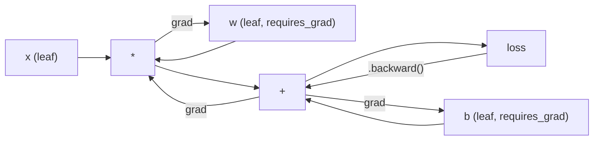
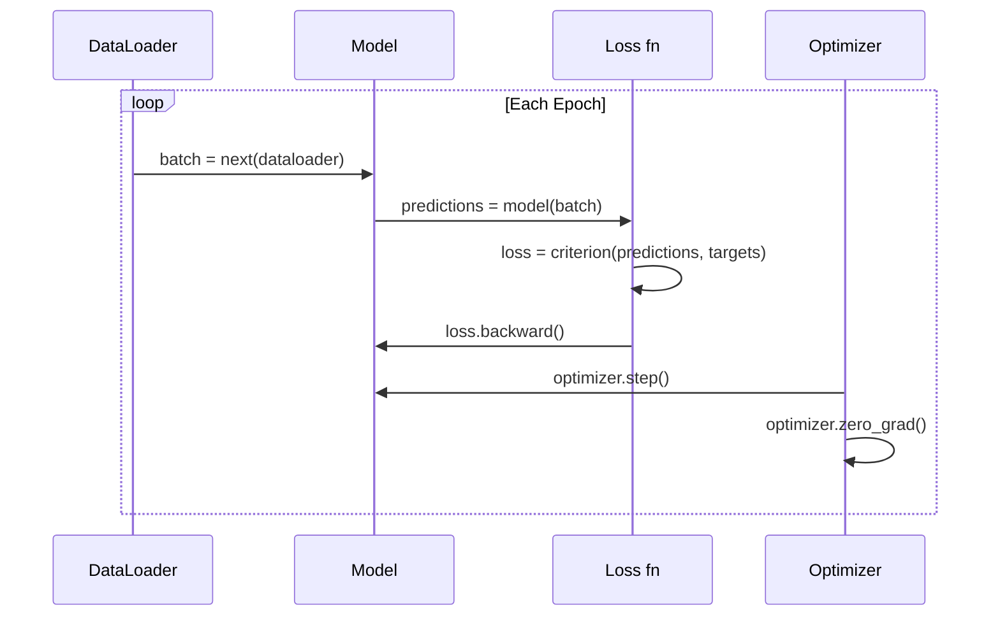

# Introduction to PyTorch

您用活塞和曲轴构建了引擎。现在学习每个人实际使用的那种。

**类型：** 构建
**语言：** Python
**先决条件：** 第03.10课（构建自己的迷你框架）
**时间：** 约75分钟

## 学习目标

- Use PyTorch's nn.Module, nn.Sequential, and autograd to build and train neural networks.
- Utilize PyTorch tensors, GPU acceleration, and the standard training loop (zero_grad, forward, loss, backward, step).
- Convert components of your from-scratch mini framework to their PyTorch equivalents.
- Analyze and compare training speeds between your pure-Python framework and PyTorch for the same task.

## 问题

您拥有一个功能完备的迷你框架。包括线性层、ReLU激活函数、dropout机制、批量归一化、Adam优化器、DataLoader以及训练循环。该框架使用纯Python在圆形分类问题上训练一个四层网络。

然而，在相同的问题上，您的迷你框架的速度比PyTorch慢500倍。

您的迷你框架通过嵌套的Python循环逐个处理样本。而PyTorch则将相同的操作分配给优化的C++/CUDA内核，这些内核在GPU上运行。在单个NVIDIA A100上，PyTorch可以在大约6小时内训练一个ResNet-50网络（2560万个参数），处理128万张图像。而您的框架在相同任务上需要大约3000小时——前提是它不会先耗尽内存。

速度并非唯一的差距。您的框架不支持GPU。没有自动微分功能——您需要为每个模块手写反向传播函数。没有序列化机制。没有分布式训练功能。没有混合精度支持。无法在不使用打印语句的情况下调试梯度流动。

PyTorch填补了所有这些空白。而且，它保持了您已经建立的心理模型：Module、forward()、parameters()、backward()和optimizer.step()。这些概念可以一一对应。语法几乎相同。不同之处在于，PyTorch将十年来的系统工程成果封装在您从头设计的接口中。

## 概念

### Why PyTorch Won

在2015年，TensorFlow要求你在运行任何操作之前先定义静态计算图。你需要构建图、编译它，然后将其用于数据处理。调试意味着需要查看图的可视化结果。改变架构则意味着需要从头开始重建图。

PyTorch于2017年推出，采用了不同的理念： eager执行。你编写Python代码，代码会立即运行。`y = model(x)`实际上会立即计算y，而不是“在图中添加一个节点，稍后计算y”。这意味着标准的Python调试工具可以正常使用。print()函数可以正常工作，pdb也可以。forward过程中的if/else条件语句也能正常运作。

到2020年，市场已经表明了自己的态度。PyTorch在机器学习研究论文中的占比从2017年的7%上升到2022年的超过75%。Meta、Google DeepMind、OpenAI、Anthropic和Hugging Face都使用PyTorch作为其主要框架。TensorFlow 2.x也采用了eager执行作为回应——这实际上是默认承认PyTorch的设计是正确的。

教训是：开发者体验至关重要。一个虽然速度慢10%，但调试效率提高50%的框架总是会胜出。

### Tensor 表示张量，是一种用于多维数据的数据结构。在机器学习、深度学习等领域中，张量被广泛用于处理大量的数据，并且可以表示各种类型的数据，如标量、向量、矩阵等。

张量是一个具有三个关键属性的多维数组：形状、数据类型和设备。

```python
import torch

x = torch.zeros(3, 4)           # shape: (3, 4), dtype: float32, device: cpu
x = torch.randn(2, 3, 224, 224) # batch of 2 RGB images, 224x224
x = torch.tensor([1, 2, 3])     # from a Python list
```

**形状**是维度。标量具有形状()，向量为(n，），矩阵为(m，n)，图像批次为（batch，channels，高度，宽度）。

**数据类型**控制精度和内存使用。

| 数据类型 | 位数 | 范围 | 应用场景 |
|---------|------|-------|----------|
| float32 | 32 | 约7个十进制位 | 默认训练 |
| float16 | 16 | 约3.3个十进制位 | 混合精度 |
| bfloat16 | 16 | 与float32相同，但精度较低 | LLM训练 |
| int8 | 8 | -128至127 | 量化推理 |

**设备**决定计算发生的位置。

```python
device = torch.device("cuda" if torch.cuda.is_available() else "cpu")
x = torch.randn(3, 4, device=device)
x = x.to("cuda")
x = x.cpu()
```

每个操作都需要所有张量位于同一设备上。这是PyTorch初学者最常遇到的错误：`RuntimeError: All tensors are expected to be on the same device`. 解决方法是在计算之前将所有内容移动到同一设备。

**重塑**是常数时间操作——它改变元数据，而不改变数据。

```python
x = torch.randn(2, 3, 4)
x.view(2, 12)      # reshape to (2, 12) -- must be contiguous
x.reshape(6, 4)    # reshape to (6, 4) -- works always
x.permute(2, 0, 1) # reorder dimensions
x.unsqueeze(0)     # add dimension: (1, 2, 3, 4)
x.squeeze()        # remove size-1 dimensions
```

### Autograd

你的迷你框架要求你为每个模块实现 backward() 函数。PyTorch 则不需要。它将张量上的每个操作记录在一个有向无环图（计算图）中，然后反向遍历该图来自动计算梯度。



与您使用的框架的关键区别是：PyTorch使用基于磁带的自微分。在正向传播过程中，每个操作都会附加到一个“磁带”上。调用`.backward()`会反向播放这个磁带。

```python
x = torch.randn(3, requires_grad=True)
y = x ** 2 + 3 * x
z = y.sum()
z.backward()
print(x.grad)  # dz/dx = 2x + 3
```

自动梯度规则如下：

1. 只有具有 `requires_grad=True` 的叶张量才会累积梯度。
2. 默认情况下，梯度会累积——在每次反向传播之前调用 `optimizer.zero_grad()`。
3. `torch.no_grad()` 禁用梯度跟踪（在评估期间使用）。

### nn.Module

`nn.Module`是PyTorch中所有神经网络组件的基础类。你已经在第10课中构建了这种抽象。PyTorch的版本增加了自动参数注册、递归模块发现、设备管理和状态字典序列化功能。

```python
import torch.nn as nn

class MLP(nn.Module):
    def __init__(self, input_dim, hidden_dim, output_dim):
        super().__init__()
        self.layer1 = nn.Linear(input_dim, hidden_dim)
        self.relu = nn.ReLU()
        self.layer2 = nn.Linear(hidden_dim, output_dim)

    def forward(self, x):
        x = self.layer1(x)
        x = self.relu(x)
        x = self.layer2(x)
        return x
```

当您在 `__init__` 中将 `nn.Module` 或 `nn.Parameter` 作为属性分配时，PyTorch会自动注册它。`model.parameters()` 会递归地收集所有已注册的参数。这就是为什么您永远不必像在 mini framework 中那样手动收集权重。

关键构建块：

| Module | 功能 | Parameters |
|--------|------|------------|
| nn.Linear(in, out) | Wx + b | in*out + out |
| nn.Conv2d(in_ch, out_ch, k) | 二维卷积 | in_ch*out_ch*k*k + out_ch |
| nn.BatchNorm1d(features) | 归一化激活值 | 2 * features |
| nn.Dropout(p) | 随机置零 | 0 |
| nn.ReLU() | max(0, x) | 0 |
| nn.GELU() | 高斯误差线性 | 0 |
| nn.Embedding(vocab, dim) | 查找表 | vocab * dim |
| nn.LayerNorm(dim) | 每个样本归一化 | 2 * dim |

### 损失函数和优化器

PyTorch provides production-ready versions of all the models you have built.

**Loss functions** (from `torch.nn`):

| Loss Function | Task | Input Format |
|-------------|------|-------------|
| nn.MSELoss() | Regression | Any shape |
| nn.CrossEntropyLoss() | Multi-class classification | Logits (not softmax) |
| nn.BCEWithLogitsLoss() | Binary classification | Logits (not sigmoid) |
| nn.L1Loss() | Regression (robust) | Any shape |
| nn.CTCLoss() | Sequence alignment | Log probabilities |

Note: `CrossEntropyLoss` internally combines `LogSoftmax` and `NLLLoss`. You need to pass raw logits, not softmax outputs. This is a common mistake that can lead to incorrect gradients being calculated.

**Optimizers** (from `torch.optim`):

| Optimizer | When to use | Typical Learning Rate |
|-----------|-------------|----------------------|
| SGD(params, lr, momentum) | CNNs, well-tuned pipelines | 0.01--0.1 |
| Adam(params, lr) | Default starting point | 1e-3 |
| AdamW(params, lr, weight_decay) | Transformers, fine-tuning | 1e-4--1e-3 |
| LBFGS(params) | Small-scale, second-order | 1.0 |

### 训练循环

每个PyTorch训练循环都遵循相同的5步模式。你已经从第10课中了解到这一点。



规范模式：

```python
for epoch in range(num_epochs):
    model.train()
    for inputs, targets in train_loader:
        inputs, targets = inputs.to(device), targets.to(device)
        optimizer.zero_grad()
        outputs = model(inputs)
        loss = criterion(outputs, targets)
        loss.backward()
        optimizer.step()
```

五行代码位于批处理循环内。这五行代码用于训练GPT-4、Stable Diffusion和LLaMA。架构发生了变化，数据也发生了变化，但这五行代码没有变化。

### 数据集与DataLoader

PyTorch的`Dataset`是一个抽象类，包含两个方法：`__len__`和`__getitem__`。`DataLoader`通过批量处理、随机打乱和多进程数据加载来封装它。

```python
from torch.utils.data import Dataset, DataLoader

class MNISTDataset(Dataset):
    def __init__(self, images, labels):
        self.images = images
        self.labels = labels

    def __len__(self):
        return len(self.labels)

    def __getitem__(self, idx):
        return self.images[idx], self.labels[idx]

loader = DataLoader(dataset, batch_size=64, shuffle=True, num_workers=4)
```

`num_workers=4` will spawn 4 processes to load data in parallel while the GPU trains on the current batch. For workloads with disk constraints (such as large images and audio), this alone can double the training speed.

### GPU Training

将模型迁移到GPU：

```python
device = torch.device("cuda" if torch.cuda.is_available() else "cpu")
model = model.to(device)
```

This recursively moves every parameter and buffer to the GPU. Then, move each batch during training:

```python
inputs, targets = inputs.to(device), targets.to(device)
```

在现代GPU（如A100、H100、RTX 4090）上，通过在前向/反向计算中使用float16精度，同时保留主权重为float32，可以将混合精度计算的内存占用减半并提高吞吐量一倍。

```python
from torch.amp import autocast, GradScaler

scaler = GradScaler()
for inputs, targets in loader:
    with autocast(device_type="cuda"):
        outputs = model(inputs)
        loss = criterion(outputs, targets)
    scaler.scale(loss).backward()
    scaler.step(optimizer)
    scaler.update()
    optimizer.zero_grad()
```

### Comparison: Mini Framework vs PyTorch vs JAX

| 特性 | Mini Framework (L10) | PyTorch | JAX |
|------|---------------------|---------|-----|
| 自动微分 | 手动 backward() | 基于 Tape 的自动微分 | 函数式转换 |
| 执行方式 | 急智模式（Python 循环） | 急智模式（C++ 内核） | 跟踪 + JIT 编译 |
| GPU 支持 | 不支持 | 支持（CUDA，ROCm，MPS） | 支持（CUDA，TPU） |
| 速度（MNIST MLP） | ~300秒/周期 | ~0.5秒/周期 | ~0.3秒/周期 |
| 模块系统 | 自定义 Module 类 | nn.Module | 无状态函数（Flax/Equinox） |
| 调试 | print() | print()，pdb，breakpoint() | 更困难（JIT 跟踪会中断 print） |
| 生态系统 | 无 | Hugging Face，Lightning，timm | Flax，Optax，Orbax |
| 学习曲线 | 需要自行构建 | 中等 | 陡峭（函数式范式） |
| 生产环境使用 | 玩具问题 | Meta，OpenAI，Anthropic，HF | Google DeepMind，Midjourney |

```figure
dropout-mask
```

## 构建它

使用仅基于PyTorch原生的技术，在MNIST数据集上训练了三层MLP。没有高级封装层，也没有`torchvision.datasets`。我们自行下载并解析原始数据。

### 步骤1：从原始文件加载MNIST数据

MNIST is provided in the form of 4 compressed files: training images (60,000 x 28 x 28), training labels, test images (10,000 x 28 x 28), test labels. We download these files and parse their binary format.

```python
import torch
import torch.nn as nn
import struct
import gzip
import urllib.request
import os

def download_mnist(path="./mnist_data"):
    base_url = "https://storage.googleapis.com/cvdf-datasets/mnist/"
    files = [
        "train-images-idx3-ubyte.gz",
        "train-labels-idx1-ubyte.gz",
        "t10k-images-idx3-ubyte.gz",
        "t10k-labels-idx1-ubyte.gz",
    ]
    os.makedirs(path, exist_ok=True)
    for f in files:
        filepath = os.path.join(path, f)
        if not os.path.exists(filepath):
            urllib.request.urlretrieve(base_url + f, filepath)

def load_images(filepath):
    with gzip.open(filepath, "rb") as f:
        magic, num, rows, cols = struct.unpack(">IIII", f.read(16))
        data = f.read()
        images = torch.frombuffer(bytearray(data), dtype=torch.uint8)
        images = images.reshape(num, rows * cols).float() / 255.0
    return images

def load_labels(filepath):
    with gzip.open(filepath, "rb") as f:
        magic, num = struct.unpack(">II", f.read(8))
        data = f.read()
        labels = torch.frombuffer(bytearray(data), dtype=torch.uint8).long()
    return labels
```

### 步骤2：定义模型

三层MLP：784 -> 256 -> 128 -> 10。ReLU激活函数。使用Dropout进行正则化。为了保持简单，不使用批量归一化。

```python
class MNISTModel(nn.Module):
    def __init__(self):
        super().__init__()
        self.net = nn.Sequential(
            nn.Linear(784, 256),
            nn.ReLU(),
            nn.Dropout(0.2),
            nn.Linear(256, 128),
            nn.ReLU(),
            nn.Dropout(0.2),
            nn.Linear(128, 10),
        )

    def forward(self, x):
        return self.net(x)
```

The output layer generates 10 raw logits per digit. No softmax function is used; `CrossEntropyLoss` handles this internally.

Number of parameters: 784*256 + 256 + 256*128 + 128 + 128*10 + 10 = 235,146. This is a very small number by modern standards. GPT-2 Small has 124M parameters. This model is trained in seconds.

### 步骤3：训练循环

标准的前向损失后向步骤模式。

```python
def train_one_epoch(model, loader, criterion, optimizer, device):
    model.train()
    total_loss = 0
    correct = 0
    total = 0
    for images, labels in loader:
        images, labels = images.to(device), labels.to(device)
        optimizer.zero_grad()
        outputs = model(images)
        loss = criterion(outputs, labels)
        loss.backward()
        optimizer.step()
        total_loss += loss.item() * images.size(0)
        _, predicted = outputs.max(1)
        correct += predicted.eq(labels).sum().item()
        total += labels.size(0)
    return total_loss / total, correct / total


def evaluate(model, loader, criterion, device):
    model.eval()
    total_loss = 0
    correct = 0
    total = 0
    with torch.no_grad():
        for images, labels in loader:
            images, labels = images.to(device), labels.to(device)
            outputs = model(images)
            loss = criterion(outputs, labels)
            total_loss += loss.item() * images.size(0)
            _, predicted = outputs.max(1)
            correct += predicted.eq(labels).sum().item()
            total += labels.size(0)
    return total_loss / total, correct / total
```

请注意在评估过程中使用`torch.no Grad()`。这会禁用自动梯度计算，从而减少内存占用并加快推理速度。如果没有它，PyTorch会构建你永远不会使用的计算图。

### 步骤4：将所有部分连接在一起

```python
def main():
    device = torch.device("cuda" if torch.cuda.is_available() else "cpu")

    download_mnist()
    train_images = load_images("./mnist_data/train-images-idx3-ubyte.gz")
    train_labels = load_labels("./mnist_data/train-labels-idx1-ubyte.gz")
    test_images = load_images("./mnist_data/t10k-images-idx3-ubyte.gz")
    test_labels = load_labels("./mnist_data/t10k-labels-idx1-ubyte.gz")

    train_dataset = torch.utils.data.TensorDataset(train_images, train_labels)
    test_dataset = torch.utils.data.TensorDataset(test_images, test_labels)
    train_loader = torch.utils.data.DataLoader(
        train_dataset, batch_size=64, shuffle=True
    )
    test_loader = torch.utils.data.DataLoader(
        test_dataset, batch_size=256, shuffle=False
    )

    model = MNISTModel().to(device)
    criterion = nn.CrossEntropyLoss()
    optimizer = torch.optim.Adam(model.parameters(), lr=1e-3)

    num_params = sum(p.numel() for p in model.parameters())
    print(f"Device: {device}")
    print(f"Parameters: {num_params:,}")
    print(f"Train samples: {len(train_dataset):,}")
    print(f"Test samples: {len(test_dataset):,}")
    print()

    for epoch in range(10):
        train_loss, train_acc = train_one_epoch(
            model, train_loader, criterion, optimizer, device
        )
        test_loss, test_acc = evaluate(
            model, test_loader, criterion, device
        )
        print(
            f"Epoch {epoch+1:2d} | "
            f"Train Loss: {train_loss:.4f} | Train Acc: {train_acc:.4f} | "
            f"Test Loss: {test_loss:.4f} | Test Acc: {test_acc:.4f}"
        )

    torch.save(model.state_dict(), "mnist_mlp.pt")
    print(f"\nModel saved to mnist_mlp.pt")
    print(f"Final test accuracy: {test_acc:.4f}")
```

After 10 epochs, expected output: ~97.8% test accuracy. Training time on CPU: ~30 seconds. On GPU: ~5 seconds. On your mini framework with the same architecture: ~45 minutes.

## 使用它

### 快速对比：Mini Framework 与 PyTorch

| 迷你框架（第10课） | PyTorch |
|---------------------------|---------|
| `model = Sequential(Linear(784, 256), ReLU(), ...)` | `model = nn.Sequential(nn.Linear(784, 256), nn.ReLU(), ...)` |
| `pred = model.forward(x)` | `pred = model(x)` |
| `optimizer.zero_grad()` | `optimizer.zero_grad()` |
| `grad = criterion.backward()` then `model.backward(grad)` | `loss.backward()` |
| `optimizer.step()` | `optimizer.step()` |
| 无GPU | `model.to("cuda")` |
| 每个模块手动反向传播 | Autograd处理所有事情 |

接口几乎相同。区别在于底层实现。

### 保存和加载模型

```python
torch.save(model.state_dict(), "model.pt")

model = MNISTModel()
model.load_state_dict(torch.load("model.pt", weights_only=True))
model.eval()
```

始终保存`state_dict()`（参数字典），而不是模型对象。保存模型对象会使用pickle，这在重构代码时会造成问题。状态字典是可移植的。

### 学习率调度

```python
scheduler = torch.optim.lr_scheduler.CosineAnnealingLR(
    optimizer, T_max=10
)
for epoch in range(10):
    train_one_epoch(model, train_loader, criterion, optimizer, device)
    scheduler.step()
```

PyTorch supports over 15 scheduling algorithms: StepLR, ExponentialLR, CosineAnnealingLR, OneCycleLR, ReduceLROnPlateau. All of them integrate into the same optimizer interface.

## 发货

本课程将生成两个文件：

- `outputs/prompt-pytorch-debugger.md` —— 用于诊断常见PyTorch训练故障的提示词
- `outputs/skill-pytorch-patterns.md` —— 关于PyTorch训练模式的技能参考文档

## 练习

1. **Add batch normalization.** Insert `nn.BatchNorm1d` after each linear layer (before the activation). Compare test accuracy and training speed vs the dropout-only version. Batch norm should reach 98%+ in fewer epochs.

2. **Implement a learning rate finder.** Train for one epoch with exponentially increasing learning rate (from 1e-7 to 1.0). Plot loss vs LR. The optimal LR is just before the loss starts climbing. Use this to pick a better LR for the MNIST model.

3. **Port to GPU with mixed precision.** Add `torch.amp.autocast` and `GradScaler` to the training loop. Measure throughput (samples/second) with and without mixed precision on GPU. On an A100, expect ~2x speedup.

4. **Build a custom Dataset.** Download Fashion-MNIST (same format as MNIST but with clothing items). Implement a `FashionMNISTDataset(Dataset)` class with `__getitem__` and `__len__`. Train the same MLP and compare accuracy. Fashion-MNIST is harder -- expect 88% vs 98%.

5. **Replace Adam with SGD + momentum.** Train with `SGD(params, lr=0.01, momentum=0.9)`. Compare convergence curves. Then add a `CosineAnnealingLR` scheduler and see if SGD catches up to Adam by epoch 10.

## | 关键词 | 翻译 |

| 术语 | 人们怎么说 | 实际含义 |
|------|------------|----------|
| Tensor | “多维数组” | 一种类型化的、支持设备感知的数组，每个操作都内置了自动微分功能 |
| Autograd | “自动反向传播” | 基于磁带的系统，记录正向过程中的操作，然后反向重放以计算精确梯度 |
| nn.Module | “层” | 任何可微计算块的基础类——注册参数、支持嵌套、处理训练/评估模式 |
| state_dict | “模型权重” | 一个OrderedDict，将参数名称映射到张量——训练后的模型的可移植、可序列化表示形式 |
| .backward() | “计算梯度” | 反向遍历计算图，为所有需要grad=True的叶子张量计算并累积梯度 |
| .to(device) | “移动到GPU” | 递归地将所有参数和缓冲区转移到指定的设备（CPU、CUDA、MPS）上 |
| DataLoader | “数据管道” | 一个迭代器，用于批量处理、打乱顺序，并可选地对从Dataset加载的数据进行并行处理 |
| Mixed precision | “使用float16” | 通过float16进行前向/反向传播以提高速度，同时保持float32作为数值稳定性的主要权重 |
| Eager execution | “立即运行” | 操作在被调用时立即执行，而不是延迟到后续的编译步骤——这是区分PyTorch与TF 1.x的核心设计选择 |
| zero_grad | “重置梯度” | 在下次反向传播之前将所有参数梯度设置为零，因为PyTorch默认累积梯度 |

## 更多阅读资料

- Paszke et al., “PyTorch: An Imperative Style, High-Performance Deep Learning Library” (2019) – the original paper explaining PyTorch’s design trade-offs  
- PyTorch Tutorials: “Learning PyTorch with Examples” (https://pytorch.org/tutorials/beginner/pytorch_with_examples.html) – the official guide from tensors to nn.Module  
- PyTorch Performance Tuning Guide (https://pytorch.org/tutorials/recipes/recipes/tuning_guide.html) – mixed precision, DataLoader workers, pinned memory, and other production optimization techniques  
- Horace He, “Making Deep Learning Go Brrrr” (https://horace.io/brrr_intro.html) – why GPU training is fast, with PyTorch-specific optimization strategies
