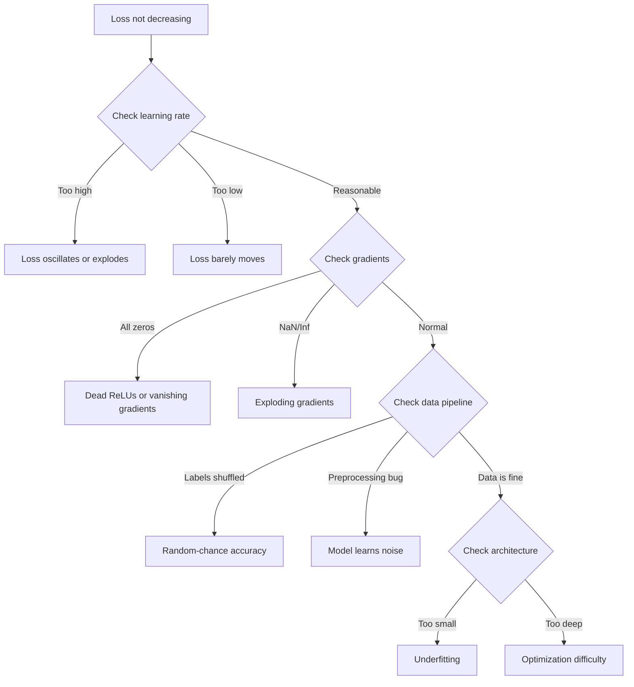
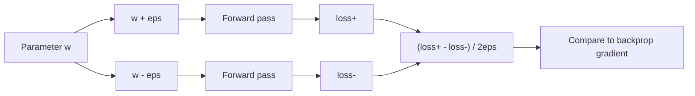
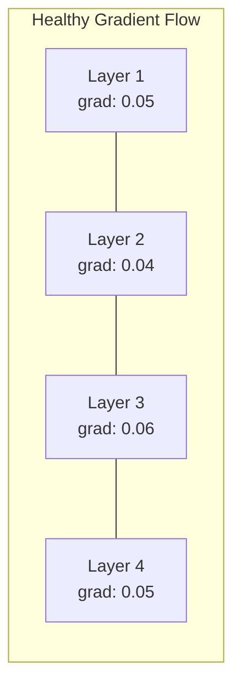
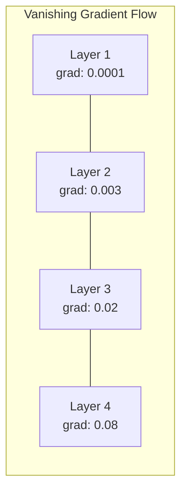
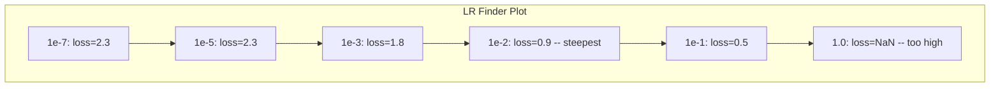

# Debugging Neural Networks

> 您的网络已编译完成。运行成功，并生成了一个数字。但这个数字是错误的，也没有出现任何崩溃情况。欢迎来到最艰难的调试类型——那种没有错误信息的调试。

**类型：** 构建
**语言：** Python, PyTorch
**先决条件：** 第03阶段课程01-10（尤其是反向传播、损失函数、优化器）
**时间：** 约90分钟

## 学习目标

- Use systematic debugging strategies to diagnose common neural network failures such as NaN losses, flat loss curves, overfitting, and oscillation.
- Apply the “overfit one batch” technique to ensure that your model architecture and training loop are correct.
- Analyze gradient magnitudes, activation distributions, and weight norms to identify issues with vanishing or exploding gradients.
- Create a debugging checklist that covers data pipeline, model architecture, loss function, optimizer, and learning rate issues.

## 问题

传统软件在出现故障时会崩溃。空指针异常会引发错误。类型不匹配会在编译时失败。误差一例会导致明显错误的输出。

神经网络则没有这种宽容。

损坏的神经网络会运行到结束，打印出损失值，并输出预测结果。损失可能减少，预测结果看起来也可能合理。但模型实际上是错误的——可能是通过学习捷径、记忆噪声或收敛到无用的局部最小值。谷歌的研究人员估计，60-70%的机器学习调试时间被用于解决那些不产生错误但会降低模型质量的“无声”故障。

一个正常运行的模型和一个损坏的模型之间的区别往往只是一行错误的代码：缺少`zero_grad()`，维度转换错误，学习率偏差10倍。《训练神经网络的标准配方》（2019年）开篇就是这样的：“最常见的神经网络错误是那些不会崩溃的错误。”

这一课教你如何找到这些错误。

## 概念

### 调试心态

忘掉传统的调试方法吧。神经网络调试需要系统化的方法，因为反馈循环很慢（每次训练运行需要几分钟到几小时），而且症状模糊不清（糟糕的损失值可能意味着20种不同的情况）。

黄金法则：**从简单开始，逐步增加复杂性，并独立验证每一部分。**



### 症状1：损失未减少

这是最常见的抱怨。训练循环持续进行，时代轮转，而损失值要么保持平稳，要么剧烈波动。

**错误的学习率。** 过高：损失值会剧烈波动或变为NaN。过低：损失值下降得太慢，看起来是稳定的。对于Adam算法，起始值为1e-3。对于SGD算法，起始值为1e-1或1e-2。在断定其他问题之前，总是尝试使用三种不同范围的学习率（例如，1e-2、1e-3、1e-4）。

**死ReLU。** 如果某个ReLU神经元接收到较大的负输入，它将输出0，其梯度也为0。它不会再激活。如果有足够的神经元死亡，网络就无法学习。检查：打印每个ReLU层之后恰好为0的激活次数比例。如果超过50%的神经元死亡，则改用LeakyReLU或降低学习率。

**梯度消失。** 在使用sigmoid或tanh激活函数的深度网络中，梯度在反向传播时会指数级缩小。当它们到达第一层时，梯度几乎为零。第一层停止学习。解决方法：使用ReLU/GELU函数，添加残差连接，或使用批量归一化。

**梯度爆炸。** 相反的问题——梯度呈指数级增长。这在RNN和非常深的网络中常见。损失值会变为NaN。解决方法：使用梯度裁剪（`torch.nn.utils.clip_grad_norm_`），降低学习率，或添加归一化。

### 症状2：损失减少，但模型性能不佳

损失值下降。训练准确率达到了99%。但测试准确率仅为55%。或者模型在真实数据上产生无意义的结果。

**过拟合。** 模型记住了训练数据，而没有学习到模式。训练和验证损失之间的差距随时间扩大。解决方法：增加数据量、使用dropout技术、权重衰减、提前停止训练、进行数据增强。

**数据泄露。** 测试数据泄露到了训练中。准确率异常高。常见原因：分割前对数据进行随机打乱、使用完整数据集的统计数据进行预处理、在不同分割中重复样本。解决方法：先进行分割，再进行预处理，检查是否存在重复样本。

**标签错误。** 大多数真实数据集中有5-10%的标签是错误的（Northcutt等人，2021年——“测试集中普遍存在的标签错误”）。模型学会了识别噪声。解决方法：使用有信心的学习方法来发现并修正错误的标签示例，或者使用损失截断技术来忽略高损失样本。

### 症状3：损失中出现NaN或Inf

损失值变为`nan`或`inf`。训练已失败。

**学习率过高。**梯度更新过度，导致权重爆炸。修复：将学习率降低10倍。

**对数(0)或对数负数。**交叉熵损失计算`log(p)`。如果模型输出恰好为0或负概率，对数会爆炸。修复：将预测值限制在`[eps, 1-eps]`之间，其中`eps=1e-7`。

**除以零。**批量归一化除以标准差。值为常数的批次标准差为0。修复：在分母中添加epsilon（PyTorch默认已实现此功能，但自定义实现可能不提供）。

**数值溢出。**输入到`exp()`函数的大值激活会产生Inf。Softmax尤其容易出现这种情况。修复：在指数运算前减去最大值（即log-sum-exp技巧）。

### 技术1：渐变检查

比较你的分析梯度（来自反向传播）与数值梯度（来自有限差分）。如果它们不一致，那么你的反向传播过程存在错误。

参数 `w` 的数值梯度：

```
grad_numerical = (loss(w + eps) - loss(w - eps)) / (2 * eps)
```

协议度量（相对差异）：

```
rel_diff = |grad_analytical - grad_numerical| / max(|grad_analytical|, |grad_numerical|, 1e-8)
```

如果 `rel_diff < 1e-5`：正确。如果 `rel_diff > 1e-3`：几乎可以肯定是一个错误。



### 技术2：激活统计

During training, monitor the mean and standard deviation of activations after each layer. Healthy networks maintain activations with a mean near 0 and a std near 1 (after normalization) or at least bounded.

| Health indicator | Mean | Std | Diagnosis |
|-----------------|------|-----|-----------|
| Healthy | ~0 | ~1 | The network is learning normally |
| Saturated | >>0 or <<0 | ~0 | Activations are stuck at extreme values |
| Dead | 0 | 0 | Neurons are dead (all zeros) |
| Exploding | >>10 | >>10 | Activations are growing without bound |

### 技术3：渐变流可视化

绘制每层的平均梯度幅度。在健康的网络中，各层的梯度幅度应该大致相同。如果早期层的梯度比后期层小1000倍，则表明存在梯度消失问题。





### 技术方法4：单批次过拟合测试

这是深度学习中最关键的调试技术。

取一小批数据（8-32个样本），对其进行100多次迭代训练。损失值应接近零，训练准确率应达到100%。如果未达到此标准，说明你的模型或训练循环存在根本性问题——请勿继续进行完整训练。

此测试可以发现以下问题：
- 损坏的损失函数
- 损坏的反向传播过程
- 架构太小，无法表示数据
- 优化器未与模型参数连接
- 数据和标签不匹配

该测试只需30秒即可运行，却能节省数小时的完整训练调试时间。

### 技术5：学习率查找器

Leslie Smith (2017) proposed adjusting the learning rate from a very small value of 1e-7 to a very large value of 10 over one epoch, while recording the loss function. It was observed that the optimal learning rate is roughly 10 times smaller than the rate at which the loss starts to decrease most rapidly.



在此示例中，最佳学习率约为1e-3（在最陡峭点之前一个数量级）。

### Common PyTorch Bugs

These are the bugs that waste the most collective hours in the PyTorch community:

| Bug | Symptom | Fix |
|-----|---------|-----|
| Forgetting `optimizer.zero_grad()` | Gradients accumulate across batches, loss oscillates | Add `optimizer.zero_grad()` before `loss.backward()` |
| Forgetting `model.eval()` at test time | Dropout and batch norm behave differently, test accuracy varies between runs | Add `model.eval()` and `torch.no_grad()` |
| Wrong tensor shapes | Silent broadcasting produces wrong results, no error | Print shapes after every operation during debugging |
| CPU/GPU mismatch | `RuntimeError: expected CUDA tensor` | Use `.to(device)` on model AND data |
| Not detaching tensors | Computation graph grows forever, OOM | Use `.detach()` or `with torch.no_grad()` |
| In-place operations breaking autograd | `RuntimeError: modified by in-place operation` | Replace `x += 1` with `x = x + 1` |
| Data not normalized | Loss stuck at random-chance level | Normalize inputs to mean=0, std=1 |
| Labels as wrong dtype | Cross-entropy expects `Long`, got `Float` | Cast labels: `labels.long()` |

### 《大师调试表》

| 症状 | 可能原因 | 首先尝试的措施 |
|------|-------------|-------------------|
| 损失在 -log(1/num_classes) 处卡住 | 模型预测均匀分布 | 检查数据管道，验证标签与输入匹配 |
| 几步后损失出现 NaN | 学习率过高 | 将学习率降低 10 倍 |
| 立即出现损失 NaN | log(0) 或除以零 | 在 log/除法操作中添加 epsilon |
| 损失剧烈波动 | 学习率过高或批量大小过小 | 降低学习率，增加批量大小 |
| 损失下降后趋于平稳 | 微调阶段学习率过高 | 添加学习率调度（余弦衰减或步长衰减） |
| 训练准确率高但测试准确率低 | 过拟合 | 添加 Dropout、权重衰减，提供更多数据 |
| 训练准确率等于测试准确率但都较低 | 欠拟合 | 使用更大模型、更多层、更多特征 |
| 梯度全部为零 | Dead ReLUs 或计算图分离 | 切换到 LeakyReLU，检查 `.requires_grad` 属性 |
| 训练过程中内存不足 | 批量过大或计算图未释放 | 减小批量大小，在评估时使用 `torch.no_grad()` |

```figure
learning-curves
```

## 构建它

一个用于监控激活、梯度和损失曲线的诊断工具包。你将故意破坏网络，并使用该工具包来诊断每个问题。

### Step 1: The NetworkDebugger Class

Hooked into a PyTorch model to record activation and gradient statistics per layer.

```python
import torch
import torch.nn as nn
import math


class NetworkDebugger:
    def __init__(self, model):
        self.model = model
        self.activation_stats = {}
        self.gradient_stats = {}
        self.loss_history = []
        self.lr_losses = []
        self.hooks = []
        self._register_hooks()

    def _register_hooks(self):
        for name, module in self.model.named_modules():
            if isinstance(module, (nn.Linear, nn.Conv2d, nn.ReLU, nn.LeakyReLU)):
                hook = module.register_forward_hook(self._make_activation_hook(name))
                self.hooks.append(hook)
                hook = module.register_full_backward_hook(self._make_gradient_hook(name))
                self.hooks.append(hook)

    def _make_activation_hook(self, name):
        def hook(module, input, output):
            with torch.no_grad():
                out = output.detach().float()
                self.activation_stats[name] = {
                    "mean": out.mean().item(),
                    "std": out.std().item(),
                    "fraction_zero": (out == 0).float().mean().item(),
                    "min": out.min().item(),
                    "max": out.max().item(),
                }
        return hook

    def _make_gradient_hook(self, name):
        def hook(module, grad_input, grad_output):
            if grad_output[0] is not None:
                with torch.no_grad():
                    grad = grad_output[0].detach().float()
                    self.gradient_stats[name] = {
                        "mean": grad.mean().item(),
                        "std": grad.std().item(),
                        "abs_mean": grad.abs().mean().item(),
                        "max": grad.abs().max().item(),
                    }
        return hook

    def record_loss(self, loss_value):
        self.loss_history.append(loss_value)

    def check_loss_health(self):
        if len(self.loss_history) < 2:
            return "NOT_ENOUGH_DATA"
        recent = self.loss_history[-10:]
        if any(math.isnan(v) or math.isinf(v) for v in recent):
            return "NAN_OR_INF"
        if len(self.loss_history) >= 20:
            first_half = sum(self.loss_history[:10]) / 10
            second_half = sum(self.loss_history[-10:]) / 10
            if second_half >= first_half * 0.99:
                return "NOT_DECREASING"
        if len(recent) >= 5:
            diffs = [recent[i+1] - recent[i] for i in range(len(recent)-1)]
            if max(diffs) - min(diffs) > 2 * abs(sum(diffs) / len(diffs)):
                return "OSCILLATING"
        return "HEALTHY"

    def check_activations(self):
        issues = []
        for name, stats in self.activation_stats.items():
            if stats["fraction_zero"] > 0.5:
                issues.append(f"DEAD_NEURONS: {name} has {stats['fraction_zero']:.0%} zero activations")
            if abs(stats["mean"]) > 10:
                issues.append(f"EXPLODING_ACTIVATIONS: {name} mean={stats['mean']:.2f}")
            if stats["std"] < 1e-6:
                issues.append(f"COLLAPSED_ACTIVATIONS: {name} std={stats['std']:.2e}")
        return issues if issues else ["HEALTHY"]

    def check_gradients(self):
        issues = []
        grad_magnitudes = []
        for name, stats in self.gradient_stats.items():
            grad_magnitudes.append((name, stats["abs_mean"]))
            if stats["abs_mean"] < 1e-7:
                issues.append(f"VANISHING_GRADIENT: {name} abs_mean={stats['abs_mean']:.2e}")
            if stats["abs_mean"] > 100:
                issues.append(f"EXPLODING_GRADIENT: {name} abs_mean={stats['abs_mean']:.2e}")
        if len(grad_magnitudes) >= 2:
            first_mag = grad_magnitudes[0][1]
            last_mag = grad_magnitudes[-1][1]
            if last_mag > 0 and first_mag / last_mag > 100:
                issues.append(f"GRADIENT_RATIO: first/last = {first_mag/last_mag:.0f}x (vanishing)")
        return issues if issues else ["HEALTHY"]

    def print_report(self):
        print("\n=== NETWORK DEBUGGER REPORT ===")
        print(f"\nLoss health: {self.check_loss_health()}")
        if self.loss_history:
            print(f"  Last 5 losses: {[f'{v:.4f}' for v in self.loss_history[-5:]]}")
        print("\nActivation diagnostics:")
        for item in self.check_activations():
            print(f"  {item}")
        print("\nGradient diagnostics:")
        for item in self.check_gradients():
            print(f"  {item}")
        print("\nPer-layer activation stats:")
        for name, stats in self.activation_stats.items():
            print(f"  {name}: mean={stats['mean']:.4f} std={stats['std']:.4f} zero={stats['fraction_zero']:.1%}")
        print("\nPer-layer gradient stats:")
        for name, stats in self.gradient_stats.items():
            print(f"  {name}: abs_mean={stats['abs_mean']:.2e} max={stats['max']:.2e}")

    def remove_hooks(self):
        for hook in self.hooks:
            hook.remove()
        self.hooks.clear()
```

### 步骤2：Overfit-One-Batch测试

```python
def overfit_one_batch(model, x_batch, y_batch, criterion, lr=0.01, steps=200):
    optimizer = torch.optim.Adam(model.parameters(), lr=lr)
    model.train()
    print("\n=== OVERFIT ONE BATCH TEST ===")
    print(f"Batch size: {x_batch.shape[0]}, Steps: {steps}")

    for step in range(steps):
        optimizer.zero_grad()
        output = model(x_batch)
        loss = criterion(output, y_batch)
        loss.backward()
        optimizer.step()

        if step % 50 == 0 or step == steps - 1:
            with torch.no_grad():
                preds = (output > 0).float() if output.shape[-1] == 1 else output.argmax(dim=1)
                targets = y_batch if y_batch.dim() == 1 else y_batch.squeeze()
                acc = (preds.squeeze() == targets).float().mean().item()
            print(f"  Step {step:3d} | Loss: {loss.item():.6f} | Accuracy: {acc:.1%}")

    final_loss = loss.item()
    if final_loss > 0.1:
        print(f"\n  FAIL: Loss did not converge ({final_loss:.4f}). Model or training loop is broken.")
        return False
    print(f"\n  PASS: Loss converged to {final_loss:.6f}")
    return True
```

### 步骤3：学习率查找器

```python
def find_learning_rate(model, x_data, y_data, criterion, start_lr=1e-7, end_lr=10, steps=100):
    import copy
    original_state = copy.deepcopy(model.state_dict())
    optimizer = torch.optim.SGD(model.parameters(), lr=start_lr)
    lr_mult = (end_lr / start_lr) ** (1 / steps)

    model.train()
    results = []
    best_loss = float("inf")
    current_lr = start_lr

    print("\n=== LEARNING RATE FINDER ===")

    for step in range(steps):
        optimizer.zero_grad()
        output = model(x_data)
        loss = criterion(output, y_data)

        if math.isnan(loss.item()) or loss.item() > best_loss * 10:
            break

        best_loss = min(best_loss, loss.item())
        results.append((current_lr, loss.item()))

        loss.backward()
        optimizer.step()

        current_lr *= lr_mult
        for param_group in optimizer.param_groups:
            param_group["lr"] = current_lr

    model.load_state_dict(original_state)

    if len(results) < 10:
        print("  Could not complete LR sweep -- loss diverged too quickly")
        return results

    min_loss_idx = min(range(len(results)), key=lambda i: results[i][1])
    suggested_lr = results[max(0, min_loss_idx - 10)][0]

    print(f"  Swept {len(results)} steps from {start_lr:.0e} to {results[-1][0]:.0e}")
    print(f"  Minimum loss {results[min_loss_idx][1]:.4f} at lr={results[min_loss_idx][0]:.2e}")
    print(f"  Suggested learning rate: {suggested_lr:.2e}")

    return results
```

### 步骤4：渐变检查器

```python
def _flat_to_multi_index(flat_idx, shape):
    multi_idx = []
    remaining = flat_idx
    for dim in reversed(shape):
        multi_idx.insert(0, remaining % dim)
        remaining //= dim
    return tuple(multi_idx)


def gradient_check(model, x, y, criterion, eps=1e-4):
    model.train()
    x_double = x.double()
    y_double = y.double()
    model_double = model.double()

    print("\n=== GRADIENT CHECK ===")
    overall_max_diff = 0
    checked = 0

    for name, param in model_double.named_parameters():
        if not param.requires_grad:
            continue

        layer_max_diff = 0

        model_double.zero_grad()
        output = model_double(x_double)
        loss = criterion(output, y_double)
        loss.backward()
        analytical_grad = param.grad.clone()

        num_checks = min(5, param.numel())
        for i in range(num_checks):
            idx = _flat_to_multi_index(i, param.shape)
            original = param.data[idx].item()

            param.data[idx] = original + eps
            with torch.no_grad():
                loss_plus = criterion(model_double(x_double), y_double).item()

            param.data[idx] = original - eps
            with torch.no_grad():
                loss_minus = criterion(model_double(x_double), y_double).item()

            param.data[idx] = original

            numerical = (loss_plus - loss_minus) / (2 * eps)
            analytical = analytical_grad[idx].item()

            denom = max(abs(numerical), abs(analytical), 1e-8)
            rel_diff = abs(numerical - analytical) / denom

            layer_max_diff = max(layer_max_diff, rel_diff)
            checked += 1

        overall_max_diff = max(overall_max_diff, layer_max_diff)
        status = "OK" if layer_max_diff < 1e-5 else "MISMATCH"
        print(f"  {name}: max_rel_diff={layer_max_diff:.2e} [{status}]")

    model.float()

    print(f"\n  Checked {checked} parameters")
    if overall_max_diff < 1e-5:
        print("  PASS: Gradients match (rel_diff < 1e-5)")
    elif overall_max_diff < 1e-3:
        print("  WARN: Small differences (1e-5 < rel_diff < 1e-3)")
    else:
        print("  FAIL: Gradient mismatch detected (rel_diff > 1e-3)")
    return overall_max_diff
```

### 步骤5：故意破坏网络

现在将工具包应用于损坏的网络，并对每个网络进行诊断。

```python
def demo_broken_networks():
    torch.manual_seed(42)
    x = torch.randn(64, 10)
    y = (x[:, 0] > 0).long()

    print("\n" + "=" * 60)
    print("BUG 1: Learning rate too high (lr=10)")
    print("=" * 60)
    model1 = nn.Sequential(nn.Linear(10, 32), nn.ReLU(), nn.Linear(32, 2))
    debugger1 = NetworkDebugger(model1)
    optimizer1 = torch.optim.SGD(model1.parameters(), lr=10.0)
    criterion = nn.CrossEntropyLoss()
    for step in range(20):
        optimizer1.zero_grad()
        out = model1(x)
        loss = criterion(out, y)
        debugger1.record_loss(loss.item())
        loss.backward()
        optimizer1.step()
    debugger1.print_report()
    debugger1.remove_hooks()

    print("\n" + "=" * 60)
    print("BUG 2: Dead ReLUs from bad initialization")
    print("=" * 60)
    model2 = nn.Sequential(nn.Linear(10, 32), nn.ReLU(), nn.Linear(32, 32), nn.ReLU(), nn.Linear(32, 2))
    with torch.no_grad():
        for m in model2.modules():
            if isinstance(m, nn.Linear):
                m.weight.fill_(-1.0)
                m.bias.fill_(-5.0)
    debugger2 = NetworkDebugger(model2)
    optimizer2 = torch.optim.Adam(model2.parameters(), lr=1e-3)
    for step in range(50):
        optimizer2.zero_grad()
        out = model2(x)
        loss = criterion(out, y)
        debugger2.record_loss(loss.item())
        loss.backward()
        optimizer2.step()
    debugger2.print_report()
    debugger2.remove_hooks()

    print("\n" + "=" * 60)
    print("BUG 3: Missing zero_grad (gradients accumulate)")
    print("=" * 60)
    model3 = nn.Sequential(nn.Linear(10, 32), nn.ReLU(), nn.Linear(32, 2))
    debugger3 = NetworkDebugger(model3)
    optimizer3 = torch.optim.SGD(model3.parameters(), lr=0.01)
    for step in range(50):
        out = model3(x)
        loss = criterion(out, y)
        debugger3.record_loss(loss.item())
        loss.backward()
        optimizer3.step()
    debugger3.print_report()
    debugger3.remove_hooks()

    print("\n" + "=" * 60)
    print("HEALTHY NETWORK: Correct setup for comparison")
    print("=" * 60)
    model_good = nn.Sequential(nn.Linear(10, 32), nn.ReLU(), nn.Linear(32, 2))
    debugger_good = NetworkDebugger(model_good)
    optimizer_good = torch.optim.Adam(model_good.parameters(), lr=1e-3)
    for step in range(50):
        optimizer_good.zero_grad()
        out = model_good(x)
        loss = criterion(out, y)
        debugger_good.record_loss(loss.item())
        loss.backward()
        optimizer_good.step()
    debugger_good.print_report()
    debugger_good.remove_hooks()

    print("\n" + "=" * 60)
    print("OVERFIT-ONE-BATCH TEST (healthy model)")
    print("=" * 60)
    model_test = nn.Sequential(nn.Linear(10, 32), nn.ReLU(), nn.Linear(32, 2))
    overfit_one_batch(model_test, x[:8], y[:8], criterion)

    print("\n" + "=" * 60)
    print("LEARNING RATE FINDER")
    print("=" * 60)
    model_lr = nn.Sequential(nn.Linear(10, 32), nn.ReLU(), nn.Linear(32, 2))
    find_learning_rate(model_lr, x, y, criterion)

    print("\n" + "=" * 60)
    print("GRADIENT CHECK")
    print("=" * 60)
    model_grad = nn.Sequential(nn.Linear(10, 8), nn.ReLU(), nn.Linear(8, 2))
    gradient_check(model_grad, x[:4], y[:4], criterion)
```

## 使用它

### PyTorch Built-in Tools

```python
import torch
import torch.nn as nn

model = nn.Sequential(
    nn.Linear(768, 256),
    nn.ReLU(),
    nn.Linear(256, 10),
)

with torch.autograd.detect_anomaly():
    output = model(input_tensor)
    loss = criterion(output, target)
    loss.backward()

for name, param in model.named_parameters():
    if param.grad is not None:
        print(f"{name}: grad_mean={param.grad.abs().mean():.2e}")
```

### Weights & Biases Integration

```python
import wandb

wandb.init(project="debug-training")

for epoch in range(100):
    loss = train_one_epoch()
    wandb.log({
        "loss": loss,
        "lr": optimizer.param_groups[0]["lr"],
        "grad_norm": torch.nn.utils.clip_grad_norm_(model.parameters(), float("inf")),
    })

    for name, param in model.named_parameters():
        if param.grad is not None:
            wandb.log({f"grad/{name}": wandb.Histogram(param.grad.cpu().numpy())})
```

### TensorBoard

```python
from torch.utils.tensorboard import SummaryWriter

writer = SummaryWriter("runs/debug_experiment")

for epoch in range(100):
    loss = train_one_epoch()
    writer.add_scalar("Loss/train", loss, epoch)

    for name, param in model.named_parameters():
        writer.add_histogram(f"weights/{name}", param, epoch)
        if param.grad is not None:
            writer.add_histogram(f"gradients/{name}", param.grad, epoch)
```

### 调试检查清单（培训前）

1. Run the overfit-one-batch test. If it fails, stop.
2. Print the model summary to verify that the number of parameters is reasonable.
3. Run a single forward pass using random data to check the output shape.
4. Train for 5 epochs to see if the loss decreases.
5. Check the activation statistics to ensure there are no dead layers or excessive activations.
6. Analyze the gradient flow to ensure it does not become zero or too large.
7. Verify the data pipeline by printing 5 random samples with labels.

## 发货

本课程将生成以下文件：
- `outputs/prompt-nn-debugger.md` -- 用于诊断神经网络训练故障的提示词
- `outputs/skill-debug-checklist.md` -- 用于调试训练问题的决策树检查清单

调试的关键部署模式包括：
- 在生产环境中的训练脚本中添加监控钩子
- 每N步将激活和梯度统计信息记录到W&B或TensorBoard中
- 实现针对NaN损失、死亡神经元（超过80%为零）或梯度爆炸的自动警报
- 在更改架构或数据管道时始终运行过拟合一批次测试

## 练习

1. **Add an exploding gradient detector.** Modify the `NetworkDebugger` to detect when gradients exceed a threshold and automatically suggest a gradient clipping value. Test it on a 20-layer network with no normalization.

2. **Build a dead neuron resurrector.** Write a function that identifies dead ReLU neurons (always outputting 0) and reinitializes their incoming weights with Kaiming initialization. Show that this recovers a network where >70% of neurons are dead.

3. **Implement the learning rate finder with plotting.** Extend `find_learning_rate` to save results as a CSV and write a separate script that reads the CSV and displays the LR vs loss curve using matplotlib. Identify the optimal LR for ResNet-18 on CIFAR-10.

4. **Create a data pipeline validator.** Write a function that checks for: duplicate samples across train/test splits, label distribution imbalance (>10:1 ratio), input normalization (mean near 0, std near 1), and NaN/Inf values in the data. Run it on a deliberately corrupted dataset.

5. **Debug a real failure.** Take the mini-framework from Lesson 10, introduce a subtle bug (e.g., transpose the weight matrix in backward), and use gradient checking to locate exactly which parameter has incorrect gradients. Document the debugging process.

## | 关键词 | 翻译 |

| 术语 | 人们的说法 | 实际含义 |
|------|------------|----------|
| 沉默错误 | “运行但产生不良结果” | 不产生错误但会降低模型质量的错误——这是机器学习中的主要故障模式 |
| 死亡ReLU | “神经元死亡” | 输入始终为负的ReLU神经元，因此输出为0并永久接收0梯度 |
| 梯度消失 | “早期层停止学习” | 梯度通过层时呈指数级缩小，使早期层的权重实际上冻结 |
| 梯度爆炸 | “损失变为NaN” | 梯度通过层时呈指数级增长，导致权重更新过大而溢出 |
| 梯度验证 | “验证反向传播是否正确” | 将反向传播的解析梯度与有限差分的数值梯度进行比较 |
| 单批次过拟合 | “最重要的调试测试” | 使用单个小批次数据进行训练，以验证模型能够学习——如果无法学习，则存在根本性问题 |
| 学习率查找器 | “逐步寻找正确的学习率” | 在一个周期内指数级增加学习率，并在损失发散前选择该速率 |
| 数据泄露 | “测试数据泄漏到训练中” | 测试集的信息污染训练过程，导致人为高的准确率 |
| 激活统计 | “监控层状态” | 跟踪每层输出的均值、标准差和零比例，以检测死亡、饱和或爆炸的神经元 |
| 梯度裁剪 | “限制梯度幅度” | 当梯度的范数超过阈值时将其缩小，防止梯度更新爆炸 |

## 更多阅读资料

- Smith, “Cyclical Learning Rates for Training Neural Networks” (2017) -- the paper introduces the learning rate range test (LR finder).
- Northcutt et al., “Pervasive Label Errors in Test Sets Destabilize Machine Learning Benchmarks” (2021) -- demonstrates that 3-6% of labels in ImageNet, CIFAR-10, and other major benchmarks are wrong.
- Zhang et al., “Understanding Deep Learning Requires Rethinking Generalization” (2017) -- the paper shows that neural networks can memorize random labels, which is why the overfit-one-batch test works.
- PyTorch documentation on `torch.autograd.detect_anomaly` and `torch.autograd.set_detect_anomaly` for built-in NaN/Inf detection.
