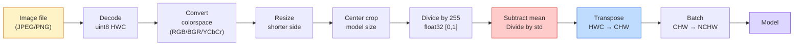
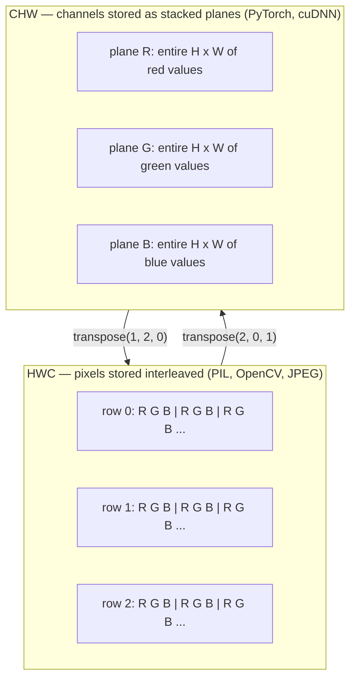

# Image Fundamentals — Pixels, Channels, Color Spaces

> 图像是光样本的张量。你将来使用的每一个视觉模型都基于这一事实。

**类型：**构建
**语言：**Python
**先决条件：**第一阶段第12课（张量操作），第三阶段第11课（PyTorch入门）
**时间：**约45分钟

## 学习目标

- Explain how a continuous scene is discretized into pixels and why sampling/quantization decisions set the ceiling on every downstream model
- Read, slice, and inspect images as NumPy arrays and switch fluently between HWC and CHW layouts
- Convert between RGB, grayscale, HSV, and YCbCr and justify why each color space exists
- Apply pixel-level preprocessing (normalize, standardize, resize, channel-first) exactly as torchvision expects it

## 问题

每篇您阅读的论文、每个您下载的预训练权重、每个您调用的视觉API都假设输入具有特定的编码方式。如果模型期望使用`float32`类型而传入的是`uint8`图像，模型仍然可以运行——但会默默地产生错误结果。如果将BGR格式的图像输入到基于RGB训练的网络中，准确率就会下降十个百分点。当模型期望通道优先的输入时却接收到通道最后的输入，而第一个卷积层将高度视为特征通道，这种情况不会引发错误。它只是破坏了您的指标数据，您将花费一周时间寻找文件加载方式中的错误。

一旦理解了卷积的工作原理，这一操作并不复杂。难点在于“图像”对相机、JPEG解码器、PIL、OpenCV、torchvision以及CUDA内核来说意味着不同的东西。每个库都有自己对应的轴顺序、字节范围和通道约定。无法正确处理这些差异的视觉工程师会导致管道故障。

本课程奠定了基础，以便后续阶段能够在此基础上进行构建。到课程结束时，您将了解什么是像素、为什么每个像素有三个数字而不是一个、 “使用ImageNet统计数据进行归一化”实际上意味着什么，以及如何在本阶段的其他课程所假设的两维或三维布局之间切换。

## 概念

### Full Preprocessing Pipeline Overview

每个生产视觉系统都遵循相同的可逆变换序列。如果有一个步骤出错，模型就会看到与其训练时不同的输入。



那两个红色和蓝色的盒子是80%的隐性故障所在：缺乏标准化和错误的布局。

### 一个像素是一个样本，而不是一个正方形。

相机传感器计数落在微小检测器网格上的光子。每个检测器在极短的时间内整合光线，并发出与击中它的光子数量成正比的电压。然后，传感器将这种电压离散化为一个整数。一个检测器就成为一个像素。

```
Continuous scene                 Sensor grid                     Digital image
(infinite detail)                (H x W detectors)               (H x W integers)

    ~~~~~                        +--+--+--+--+--+                 210 198 180 155 120
   ~   ~   ~                     |  |  |  |  |  |                 205 195 178 152 118
  ~ light ~      ---->           +--+--+--+--+--+     ---->       200 190 175 150 115
   ~~~~~                         |  |  |  |  |  |                 195 185 170 148 112
                                 +--+--+--+--+--+                 188 180 165 145 108
```

在此步骤中有两个选择，它们决定了后续所有内容的上限：

- **空间采样**决定场景中每度有多少个检测器。如果数量太少，边缘会变得不平滑（混叠）。如果数量太多，存储和计算资源将会爆炸。
- **强度量化**决定电压的分级精度。8位可以给出256个等级，这是显示的标准。10、12、16位可以提供更平滑的梯度，适用于医学成像、高动态范围图像以及原始传感器处理流程。

像素不是具有面积的彩色正方形，它是一个单独的测量值。当你调整大小或旋转时，你实际上是在重新采样这个测量网格。

### 为什么是三个频道

一种探测器能够检测整个可见光谱中的光子，即灰度范围。为了获取颜色信息，传感器用红色、绿色和蓝色的滤光片覆盖网格。经过去马赛克处理后，每个空间位置都有三个整数：红色过滤后的探测器响应值、绿色过滤后的值以及蓝色过滤后的值。这三个整数构成了像素的RGB三元组。

```
One pixel in memory:

    (R, G, B) = (210, 140, 30)   <- reddish-orange

An H x W RGB image:

    shape (H, W, 3)     stored as   H rows of W pixels of 3 values
                                    each in [0, 255] for uint8
```

三并非魔法。深度相机增加了Z通道。卫星添加了红外和紫外波段。医学扫描通常有一个通道（X射线、CT）或多个（高光谱）。通道的数量是最后一个轴；卷积层学习在它上面进行混合。

### 两种布局规范：HWC和CHW

相同的张量，两种排序方式。每个库都选择一种。

```
HWC (height, width, channels)           CHW (channels, height, width)

   W ->                                    H ->
  +-----+-----+-----+                     +-----+-----+
H |R G B|R G B|R G B|                   C |R R R R R R|
| +-----+-----+-----+                   | +-----+-----+
v |R G B|R G B|R G B|                   v |G G G G G G|
  +-----+-----+-----+                     +-----+-----+
                                          |B B B B B B|
                                          +-----+-----+

   PIL, OpenCV, matplotlib,              PyTorch, most deep learning
   almost every image file on disk       frameworks, cuDNN kernels
```

CHW的存在是因为卷积核在H和W方向上滑动。将通道轴放在首位意味着每个核在每个通道上看到的是一个连续的2D平面，这能够清晰地实现向量化处理。磁盘格式保持HWC结构，因为这与传感器输出的扫描线方式相匹配。

你将需要输入一千次的一行转换代码：

```
img_chw = img_hwc.transpose(2, 0, 1)      # NumPy
img_chw = img_hwc.permute(2, 0, 1)        # PyTorch tensor
```

内存布局，可视化展示：



### Byte range and dtype

以下三种约定占主导地位：

| 约定 | dtype | 范围 | 出现位置 |
|------|-------|-------|----------|
| 原始格式 | `uint8` | [0, 255] | 磁盘文件、PIL、OpenCV输出 |
| 标准化格式 | `float32` | [0.0, 1.0] | 通过 `img.astype('float32') / 255` 后 |
| 标准格式 | `float32` | 大致 [-2, +2] | 通过减去均值并除以标准差后 |

卷积网络在标准化输入上进行训练。ImageNet的统计数据 `mean=[0.485, 0.456, 0.406]`, `std=[0.229, 0.224, 0.225]` 是整个ImageNet训练集上三个通道的算术平均值和标准差，计算基于[0, 1]标准化的像素值。将原始 `uint8` 格式的数据输入到期望标准化浮点数的模型中，这是应用视觉领域最常见的隐性错误。

### 色彩空间及其存在原因

RGB是捕获格式，但它并不总是模型最实用的表示方式。

```
 RGB               HSV                       YCbCr / YUV

 R red             H hue (angle 0-360)       Y luminance (brightness)
 G green           S saturation (0-1)        Cb chroma blue-yellow
 B blue            V value/brightness (0-1)  Cr chroma red-green

 Linear to         Separates color from      Separates brightness from
 sensor output     brightness. Useful for    color. JPEG and most video
                   color thresholding, UI    codecs compress the chroma
                   sliders, simple filters   channels harder because the
                                             human eye is less sensitive
                                             to chroma detail than to Y.
```

对于大多数现代卷积神经网络，你输入的是RGB格式的数据。你在以下情况下会遇到其他格式：

- **HSV** —— 经典的颜色空间编码，基于颜色的分割，白色平衡。
- **YCbCr** —— 读取JPEG的内部结构，视频管道，仅使用Y通道进行超分辨率处理的模型。
- **灰度** —— OCR、文档模型，任何颜色作为干扰变量而非信号的情况。

从RGB转换为灰度是一种加权求和，而不是平均值，因为人眼对绿色比红色或蓝色更敏感：

```
Y = 0.299 R + 0.587 G + 0.114 B       (ITU-R BT.601, the classic weights)
```

### Aspect ratio, resizing, and interpolation are important concepts in AI engineering.

每个模型都有固定的输入尺寸（大多数ImageNet分类器为224x224，现代检测器为384x384或512x512）。你的图像很少符合这些尺寸要求。三个重要的调整尺寸选项：

- **先调整短边尺寸，然后中心裁剪** — 这是标准的ImageNet方法。保持宽高比，丢弃边缘的一行像素。
- **调整尺寸并填充** — 保持宽高比和所有像素，添加黑色条带。适用于检测和OCR任务。
- **直接调整至目标尺寸** — 拉伸图像。成本低廉，但会扭曲几何形状，适合许多分类任务。

当新网格与旧网格不对齐时，插值方法决定了如何计算中间像素：

```
Nearest neighbour     fastest, blocky, only choice for masks/labels
Bilinear              fast, smooth, default for most image resizing
Bicubic               slower, sharper on upscaling
Lanczos               slowest, best quality, used for final display
```

经验法则：对于训练数据，使用双线性插值；对于需要查看的资产，使用双三次或兰佐斯插值；对于包含整数类ID的数据，使用最近邻插值。

```figure
conv-output-size
```

## 构建它

### 步骤1：加载图片并检查其形状

使用Pillow加载任何JPEG或PNG文件，将其转换为NumPy格式，然后打印结果。为了获得一个可确定的离线运行示例，请生成一个。

```python
import numpy as np
from PIL import Image

def synthetic_rgb(h=128, w=192, seed=0):
    rng = np.random.default_rng(seed)
    yy, xx = np.meshgrid(np.linspace(0, 1, h), np.linspace(0, 1, w), indexing="ij")
    r = (np.sin(xx * 6) * 0.5 + 0.5) * 255
    g = yy * 255
    b = (1 - yy) * xx * 255
    rgb = np.stack([r, g, b], axis=-1) + rng.normal(0, 6, (h, w, 3))
    return np.clip(rgb, 0, 255).astype(np.uint8)

arr = synthetic_rgb()
# Or load from disk:
# arr = np.asarray(Image.open("your_image.jpg").convert("RGB"))

print(f"type:   {type(arr).__name__}")
print(f"dtype:  {arr.dtype}")
print(f"shape:  {arr.shape}     # (H, W, C)")
print(f"min:    {arr.min()}")
print(f"max:    {arr.max()}")
print(f"pixel at (0, 0): {arr[0, 0]}")
```

预期输出：`shape: (H, W, 3)`, `dtype: uint8`, range `[0, 255]`。这是字节来自相机、JPEG解码器还是合成生成器的标准磁盘表示方式。

### 步骤2：分割频道并重新排序布局

分别提取R、G、B，然后将其从HWC转换为CHW用于PyTorch。

```python
R = arr[:, :, 0]
G = arr[:, :, 1]
B = arr[:, :, 2]
print(f"R shape: {R.shape}, mean: {R.mean():.1f}")
print(f"G shape: {G.shape}, mean: {G.mean():.1f}")
print(f"B shape: {B.shape}, mean: {B.mean():.1f}")

arr_chw = arr.transpose(2, 0, 1)
print(f"\nHWC shape: {arr.shape}")
print(f"CHW shape: {arr_chw.shape}")
```

三个灰度平面，每个通道一个。CHW只是重新排序轴；当内存布局允许时，严格不需要数据复制。

### 步骤3：灰度图转换和HSV色彩空间转换

加权求和灰度，然后手动将RGB转换为HSV。

```python
def rgb_to_grayscale(rgb):
    weights = np.array([0.299, 0.587, 0.114], dtype=np.float32)
    return (rgb.astype(np.float32) @ weights).astype(np.uint8)

def rgb_to_hsv(rgb):
    rgb_f = rgb.astype(np.float32) / 255.0
    r, g, b = rgb_f[..., 0], rgb_f[..., 1], rgb_f[..., 2]
    cmax = np.max(rgb_f, axis=-1)
    cmin = np.min(rgb_f, axis=-1)
    delta = cmax - cmin

    h = np.zeros_like(cmax)
    mask = delta > 0
    rmax = mask & (cmax == r)
    gmax = mask & (cmax == g)
    bmax = mask & (cmax == b)
    h[rmax] = ((g[rmax] - b[rmax]) / delta[rmax]) % 6
    h[gmax] = ((b[gmax] - r[gmax]) / delta[gmax]) + 2
    h[bmax] = ((r[bmax] - g[bmax]) / delta[bmax]) + 4
    h = h * 60.0

    s = np.where(cmax > 0, delta / cmax, 0)
    v = cmax
    return np.stack([h, s, v], axis=-1)

gray = rgb_to_grayscale(arr)
hsv = rgb_to_hsv(arr)
print(f"gray shape: {gray.shape}, range: [{gray.min()}, {gray.max()}]")
print(f"hsv   shape: {hsv.shape}")
print(f"hue range: [{hsv[..., 0].min():.1f}, {hsv[..., 0].max():.1f}] degrees")
print(f"sat range: [{hsv[..., 1].min():.2f}, {hsv[..., 1].max():.2f}]")
print(f"val range: [{hsv[..., 2].min():.2f}, {hsv[..., 2].max():.2f}]")
```

色调以度数表示，饱和度和价值介于[0, 1]之间。这与OpenCV的`hsv_full` conventions一致。

### 步骤4：规范化、标准化并反转它

从原始字节转换到预训练过的ImageNet模型所期望的精确张量，然后再返回。

```python
mean = np.array([0.485, 0.456, 0.406], dtype=np.float32)
std = np.array([0.229, 0.224, 0.225], dtype=np.float32)

def preprocess_imagenet(rgb_uint8):
    x = rgb_uint8.astype(np.float32) / 255.0
    x = (x - mean) / std
    x = x.transpose(2, 0, 1)
    return x

def deprocess_imagenet(chw_float32):
    x = chw_float32.transpose(1, 2, 0)
    x = x * std + mean
    x = np.clip(x * 255.0, 0, 255).astype(np.uint8)
    return x

x = preprocess_imagenet(arr)
print(f"preprocessed shape: {x.shape}     # (C, H, W)")
print(f"preprocessed dtype: {x.dtype}")
print(f"preprocessed mean per channel:  {x.mean(axis=(1, 2)).round(3)}")
print(f"preprocessed std  per channel:  {x.std(axis=(1, 2)).round(3)}")

roundtrip = deprocess_imagenet(x)
max_diff = np.abs(roundtrip.astype(int) - arr.astype(int)).max()
print(f"roundtrip max pixel diff: {max_diff}    # should be 0 or 1")
```

Each channel's mean should be close to zero, and standard deviation close to one. The preprocessing and deprocessing steps are precisely what every invocation of `transforms.Normalize` in torchvision is doing behind the scenes.

### 步骤5：使用三种插值方法调整大小

比较最近邻、双线性和对角线插值方法在放大后的效果，以便看出差异。

```python
target = (arr.shape[0] * 3, arr.shape[1] * 3)

nearest = np.asarray(Image.fromarray(arr).resize(target[::-1], Image.NEAREST))
bilinear = np.asarray(Image.fromarray(arr).resize(target[::-1], Image.BILINEAR))
bicubic = np.asarray(Image.fromarray(arr).resize(target[::-1], Image.BICUBIC))

def local_roughness(x):
    gy = np.diff(x.astype(float), axis=0)
    gx = np.diff(x.astype(float), axis=1)
    return float(np.abs(gy).mean() + np.abs(gx).mean())

for name, out in [("nearest", nearest), ("bilinear", bilinear), ("bicubic", bicubic)]:
    print(f"{name:>8}  shape={out.shape}  roughness={local_roughness(out):6.2f}")
```

在粗糙度方面，最接近的得分属于最高等级，因为它保留了硬边。双线性插值是最平滑的。双立方插值则介于两者之间，既保持了感知上的清晰度，又避免了阶梯状伪影。

## 使用它

`torchvision.transforms`整合了上述所有功能，形成一个可组合的管道。下面的代码精确再现了`preprocess_imagenet`的功能，同时还进行了尺寸调整和裁剪处理。

```python
import torch
from torchvision import transforms
from PIL import Image

img = Image.fromarray(synthetic_rgb(256, 256))

pipeline = transforms.Compose([
    transforms.Resize(256),
    transforms.CenterCrop(224),
    transforms.ToTensor(),
    transforms.Normalize(mean=[0.485, 0.456, 0.406], std=[0.229, 0.224, 0.225]),
])

x = pipeline(img)
print(f"tensor type:  {type(x).__name__}")
print(f"tensor dtype: {x.dtype}")
print(f"tensor shape: {tuple(x.shape)}      # (C, H, W)")
print(f"per-channel mean: {x.mean(dim=(1, 2)).tolist()}")
print(f"per-channel std:  {x.std(dim=(1, 2)).tolist()}")

batch = x.unsqueeze(0)
print(f"\nbatched shape: {tuple(batch.shape)}   # (N, C, H, W) — ready for a model")
```

按以下确切顺序进行四步操作：`Resize(256)`将较短的一边缩放为256；`CenterCrop(224)`从中间提取一个224x224的片段；`ToTensor()`除以255并将HWC转换为CHW；`Normalize`减去ImageNet的均值并除以标准差。颠倒这些步骤的顺序会悄悄改变传递给模型的数据。

## 发货

本课程生成以下内容：

- `outputs/prompt-vision-preprocessing-audit.md` —— 一个提示词，可将任何模型卡片或数据集卡片转换为团队必须遵守的预处理不变性检查列表。
- `outputs/skill-image-tensor-inspector.md` —— 一项技能，给定任何图像形状的张量或数组，即可报告其数据类型、布局、范围以及它是处于原始状态、已标准化还是已规范化。

## 练习

1. **(Easy)** Load a JPEG with OpenCV (`cv2.imread`) and with Pillow. Print both shapes and the pixel at `(0, 0)`. Explain the difference in channel-order. Then, write a one-line conversion that makes the OpenCV array identical to the Pillow array.

2. **(Medium)** Write `standardize(img, mean, std)` and its inverse function. These functions should pass a test where the `roundtrip_max_diff <= 1` is satisfied for any uint8 image. Your functions must work on a single image in HWC and on a batch in NCHW with the same parameter settings.

3. **(Hard)** Take a 3-channel ImageNet-standardized tensor and apply a 1x1 convolution that transforms RGB into a single grayscale channel. Initialize the weights to `[0.299, 0.587, 0.114]`, freeze them, and verify that the output matches the manual `rgb_to_grayscale` function within floating-point error tolerance. What other classical color-space transformations can be achieved using 1x1 convolutions?

## | 关键词 | 翻译 |

| 术语 | 人们怎么说 | 实际含义 |
|------|------------|----------|
| Pixel | “彩色方块” | 网格位置处的光强度样本——三个数字表示颜色，一个表示灰度 |
| Channel | “颜色” | 堆叠成图像张量的平行空间网格之一；在HWC中位于最后轴，在CHW中位于第一轴 |
| HWC / CHW | “形状” | 图像张量的轴排序；磁盘和PIL使用HWC，PyTorch和cuDNN使用CHW |
| Normalize | “缩放图像” | 除以255使像素处于[0, 1]范围内——必要但不充分 |
| Standardize | “零中心化” | 减去均值并除以每通道的标准差，使输入分布与模型训练的数据匹配 |
| Grayscale conversion | “平均通道值” | 使用系数0.299/0.587/0.114的加权求和，以匹配人类亮度感知 |
| Interpolation | “如何选择调整大小时的像素” | 决定新网格与旧网格不对齐时输出值的规则——标签使用最近邻插值，训练使用双线性插值，显示使用双三次插值 |
| Aspect ratio | “宽度与高度的比例” | 区分“调整大小和填充”与“调整拉伸”的比率 |

## 更多阅读资料

- [Charles Poynton — A Guided Tour of Color Space](https://poynton.ca/PDFs/Guided_tour.pdf) — the clearest technical treatment of why there are so many color spaces and when each one matters  
- [PyTorch Vision Transforms Docs](https://pytorch.org/vision/stable/transforms.html) — the full pipeline of transforms you will actually compose in production  
- [How JPEG Works (Colt McAnlis)](https://www.youtube.com/watch?v=F1kYBnY6mwg) — a sharp visual tour of chroma subsampling, DCT, and why JPEG encodes YCbCr rather than RGB  
- [ImageNet Preprocessing Conventions (torchvision models)](https://pytorch.org/vision/stable/models.html) — the source of truth for `mean=[0.485, 0.456, 0.406]` and why every model in the zoo expects it
