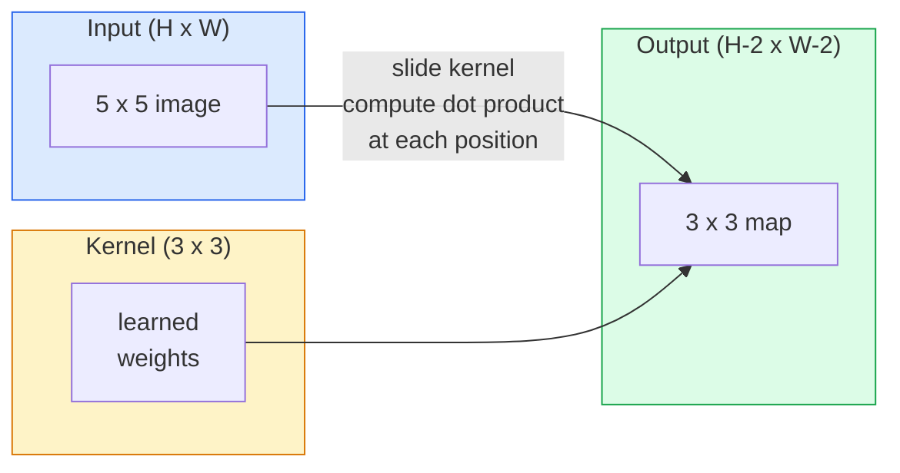
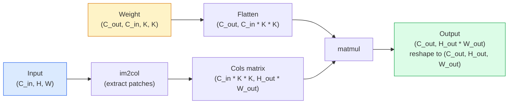

# 从零实现卷积操作

> 卷积是一种小型全连接层，它会在图像上滑动，并在每个位置使用相同的权重。

**类型：** 构建
**语言：** Python
**先修要求：** 第3阶段（深度学习核心），第4阶段第01课（图像基础）
**时长：** 约75分钟

## 学习目标

- 仅使用 NumPy 从零实现 2D 卷积，包括嵌套循环版本和向量化 `im2col` 版本  
- 计算在任意输入尺寸、核大小、填充值及步长组合下的输出空间尺寸，并解释公式 `(H - K + 2P) / S + 1` 的原理  
- 手动设计各种核函数（边缘检测核、模糊核、锐化核、Sobel 核），并说明每种核为何会产生特定的激活模式  
- 将多个卷积层堆叠起来构成特征提取器，并将层叠深度与感受野大小建立关联

## 问题所在

对于 224x224 的 RGB 图像，全连接层中的每个神经元都需要 224 * 224 * 3 = 150,528 个输入权重。仅一个包含 1,000 个单元的隐藏层就已有 1.5 亿个参数——而这还是在模型尚未学习到任何有用信息之前的数值。更糟糕的是，该层无法识别左上角的狗与右下角的狗属于同一模式，它将每个像素位置视为独立的，这对于图像处理而言是完全错误的：将一只猫平移三个像素时，不应迫使网络重新学习这一概念。

图像模型所需的两个特性是**平移等变性**（输入发生变化时输出也会相应变化）和**参数共享**（相同的特征检测器可在各处使用）。全连接层无法提供这两者，而卷积则能免费实现这两点。

卷积并非为深度学习而发明。它其实是 JPEG 压缩、Photoshop 中的高斯模糊、工业视觉中的边缘检测，以及所有已发布的音频滤波器所使用的相同运算方式。从 2012 年到 2020 年，CNN 能在 ImageNet 竞赛中占据主导地位，原因就在于对于那些邻近数值之间存在关联且同一模式可能出现在任意位置的 데이터而言，卷积是更为合适的初始模型结构。

## 概念概述

### 一个内核，滑动机制

二维卷积会使用一个称为核（或滤波器）的小型权重矩阵，在输入数据上滑动，然后在每个位置计算元素级乘积的总和。该总和即为一个输出像素的值。



一个针对 5×5 输入的具体 3×3 示例（无填充，步长为 1）：

```
Input X (5 x 5):                Kernel W (3 x 3):

  1  2  0  1  2                   1  0 -1
  0  1  3  1  0                   2  0 -2
  2  1  0  2  1                   1  0 -1
  1  0  2  1  3
  2  1  1  0  1

The kernel slides across every valid 3 x 3 window. Output Y is 3 x 3:

 Y[0,0] = sum( W * X[0:3, 0:3] )
 Y[0,1] = sum( W * X[0:3, 1:4] )
 Y[0,2] = sum( W * X[0:3, 2:5] )
 Y[1,0] = sum( W * X[1:4, 0:3] )
 ... and so on
```

那个公式——**共享权重、局部性、滑动窗口**——就是整个核心思想。其余的一切都只是辅助性的记录工作。

### 输出大小计算公式

给定输入空间尺寸 `H`、核大小 `K`、填充值 `P` 以及步长 `S`：

```
H_out = floor( (H - K + 2P) / S ) + 1
```

请记住这些数值。在每种架构下，你都需要计算数十次。

| 场景 | H | K | P | S | H_out |
|----------|---|---|---|---|-------|
| 合法卷积，无填充 | 32 | 3 | 0 | 1 | 30 |
| 相同卷积（保持尺寸） | 32 | 3 | 1 | 1 | 32 |
| 缩小2倍 | 32 | 3 | 1 | 2 | 16 |
| 2x2池化 | 32 | 2 | 0 | 2 | 16 |
| 大感受野 | 32 | 7 | 3 | 2 | 16 |

“相同填充”指的是选择 P，使得当 S == 1 时 H_out == H。对于奇数 K，其值为 P = (K - 1) / 2。这就是为什么 3x3 卷积核占主导地位——它们是仍具有中心点的最小奇数卷积核。

### 填充

在没有填充的情况下，每次卷积都会缩小特征图。若堆叠20层此类卷积，原本224×224大小的图像将会变为184×184，这不仅会在边界区域造成计算资源浪费，还会增加需要保持形状一致的残差连接的实现难度。

```
Zero padding (P = 1) on a 5 x 5 input:

  0  0  0  0  0  0  0
  0  1  2  0  1  2  0
  0  0  1  3  1  0  0
  0  2  1  0  2  1  0       Now the kernel can centre on pixel
  0  1  0  2  1  3  0       (0, 0) and still have three rows and
  0  2  1  1  0  1  0       three columns of values to multiply.
  0  0  0  0  0  0  0
```

实际应用中会遇到的模式：`zero`（最常见），`reflect`（镜像边缘，用于避免生成模型中出现生硬的边界），`replicate`（复制边缘），`circular`（环绕处理，用于环形问题）。

### Stride

Stride 表示滑动步长。默认值为 `stride=1`。将 `stride` 设为 `2` 可使空间维度减半，这是无需额外池化层即在 CNN 内部进行下采样的经典方法——所有现代架构（ResNet、ConvNeXt、MobileNet）都在某些地方使用带步长的卷积来替代最大值池化。

```
Stride 1 on a 5 x 5 input, 3 x 3 kernel:

  starts: (0,0) (0,1) (0,2)        -> output row 0
          (1,0) (1,1) (1,2)        -> output row 1
          (2,0) (2,1) (2,2)        -> output row 2

  Output: 3 x 3

Stride 2 on the same input:

  starts: (0,0) (0,2)              -> output row 0
          (2,0) (2,2)              -> output row 1

  Output: 2 x 2
```

### 多个输入通道

真实图像包含三个通道。对RGB输入进行3×3卷积时，实际上是在处理一个3×3×3的体积数据：每个输入通道对应一个3×3的切片。在每个空间位置上，需要将所有三个切片中的数值相乘并求和，然后再加上偏置项。

```
Input:   (C_in,  H,  W)        3 x 5 x 5
Kernel:  (C_in,  K,  K)        3 x 3 x 3 (one kernel)
Output:  (1,     H', W')       2D map

For a layer that produces C_out output channels, you stack C_out kernels:

Weight:  (C_out, C_in, K, K)   e.g. 64 x 3 x 3 x 3
Output:  (C_out, H', W')       64 x 3 x 3

Parameter count: C_out * C_in * K * K + C_out   (the + C_out is biases)
```

最后那一行正是你在规划模型时需要计算的数值。对于输入为3通道、采用64通道的3×3卷积层，其参数量为 `64 * 3 * 3 * 3 + 64 = 1,792`。成本较低。

### im2col 技巧

嵌套循环虽然易于理解，但计算速度较慢。GPU 更适合处理大规模矩阵乘法。解决思路是将输入中每个感受野窗口展平为一个大矩阵的一列，将核函数展平为一行，这样整个卷积操作就转化为了一次单一的矩阵乘法。



每一个生产环境中的卷积实现都是该基础结构的变体，再加上缓存分块技巧（直接卷积、Winograd算法以及用于大核的FFT卷积）。理解了im2col机制，就等于掌握了其核心原理。

### 感受野

单个 3x3 卷积核会处理 9 个输入像素。若在第二层堆叠两个 3x3 卷积核，则该层的神经元可处理 5x5 的输入像素。使用三个 3x3 卷积核则可得到 7x7 的输出尺寸。一般而言：

```
RF after L stacked K x K convs (stride 1) = 1 + L * (K - 1)

With strides:   RF grows multiplicatively with stride along each layer.
```

“自底层至顶层均为 3×3 卷积”这一设计在 VGG、ResNet 和 ConvNeXt 等模型中能够有效工作的根本原因在于：两个 3×3 卷积所处理的输入区域与一个 5×5 卷积相同，但其参数量更少，并且在两者之间还多了一层非线性变换。

```figure
convolution-kernel
```

## 构建它

### 步骤 1：为数组补零

从最基础的原始组件开始：一个用于在 H × W 数组周围填充零的函数。

```python
import numpy as np

def pad2d(x, p):
    if p == 0:
        return x
    h, w = x.shape[-2:]
    out = np.zeros(x.shape[:-2] + (h + 2 * p, w + 2 * p), dtype=x.dtype)
    out[..., p:p + h, p:p + w] = x
    return out

x = np.arange(9).reshape(3, 3)
print(x)
print()
print(pad2d(x, 1))
```

尾轴技巧 `x.shape[:-2]` 的含义是：该函数无需任何修改即可直接应用于 `(H, W)`、`(C, H, W)` 或 `(N, C, H, W)` 格式的张量。

### 步骤 2：使用嵌套循环进行二维卷积

参考实现——虽然速度较慢，但逻辑清晰明确。这正是 `torch.nn.functional.conv2d` 在原理上的运作方式。

```python
def conv2d_naive(x, w, b=None, stride=1, padding=0):
    c_in, h, w_in = x.shape
    c_out, c_in_w, kh, kw = w.shape
    assert c_in == c_in_w

    x_pad = pad2d(x, padding)
    h_out = (h + 2 * padding - kh) // stride + 1
    w_out = (w_in + 2 * padding - kw) // stride + 1

    out = np.zeros((c_out, h_out, w_out), dtype=np.float32)
    for oc in range(c_out):
        for i in range(h_out):
            for j in range(w_out):
                hs = i * stride
                ws = j * stride
                patch = x_pad[:, hs:hs + kh, ws:ws + kw]
                out[oc, i, j] = np.sum(patch * w[oc])
        if b is not None:
            out[oc] += b[oc]
    return out
```

四个嵌套循环（输出通道、行、列，以及针对 C_in、kh、kw 的隐式求和）。这就是您用来检验所有更快速实现方案的基准值。

### 步骤 3：使用手工设计的内核进行验证

构建一个垂直方向的Sobel核，将其应用于合成的阶梯图像上，观察垂直边缘被点亮的效果。

```python
def synthetic_step_image():
    img = np.zeros((1, 16, 16), dtype=np.float32)
    img[:, :, 8:] = 1.0
    return img

sobel_x = np.array([
    [[-1, 0, 1],
     [-2, 0, 2],
     [-1, 0, 1]]
], dtype=np.float32)[None]

x = synthetic_step_image()
y = conv2d_naive(x, sobel_x, padding=1)
print(y[0].round(1))
```

第 7 列应显示较大的正数值（表示从左到右的亮度递增），其余所有位置应为零。执行那次单独的输出操作即可作为验证，确保计算结果正确。

### 第 4 步：im2col

将输入中每个核大小为 K 的窗口转换为矩阵的一列。当 `C_in=3, K=3` 时，每一列包含 27 个数值。

```python
def im2col(x, kh, kw, stride=1, padding=0):
    c_in, h, w = x.shape
    x_pad = pad2d(x, padding)
    h_out = (h + 2 * padding - kh) // stride + 1
    w_out = (w + 2 * padding - kw) // stride + 1

    cols = np.zeros((c_in * kh * kw, h_out * w_out), dtype=x.dtype)
    col = 0
    for i in range(h_out):
        for j in range(w_out):
            hs = i * stride
            ws = j * stride
            patch = x_pad[:, hs:hs + kh, ws:ws + kw]
            cols[:, col] = patch.reshape(-1)
            col += 1
    return cols, h_out, w_out
```

这依然是一个 Python 循环，但现在的核心计算将由一次向量化矩阵乘法来完成。

### 步骤 5：通过 im2col + matmul 执行快速卷积

用一次矩阵乘法替换四重循环。

```python
def conv2d_im2col(x, w, b=None, stride=1, padding=0):
    c_out, c_in, kh, kw = w.shape
    cols, h_out, w_out = im2col(x, kh, kw, stride, padding)
    w_flat = w.reshape(c_out, -1)
    out = w_flat @ cols
    if b is not None:
        out += b[:, None]
    return out.reshape(c_out, h_out, w_out)
```

正确性检查：运行两种实现并加以比较。

```python
rng = np.random.default_rng(0)
x = rng.normal(0, 1, (3, 16, 16)).astype(np.float32)
w = rng.normal(0, 1, (8, 3, 3, 3)).astype(np.float32)
b = rng.normal(0, 1, (8,)).astype(np.float32)

y_naive = conv2d_naive(x, w, b, padding=1)
y_im2col = conv2d_im2col(x, w, b, padding=1)

print(f"max abs diff: {np.max(np.abs(y_naive - y_im2col)):.2e}")
```

`max abs diff` 的值应约为 `1e-5`——该差异源于浮点数的累加顺序，而非程序错误。

### 步骤 6：一组手工设计的核函数

五种滤波器，用于展示在开始训练之前单个卷积层所能表达的内容。

```python
KERNELS = {
    "identity": np.array([[0, 0, 0], [0, 1, 0], [0, 0, 0]], dtype=np.float32),
    "blur_3x3": np.ones((3, 3), dtype=np.float32) / 9.0,
    "sharpen": np.array([[0, -1, 0], [-1, 5, -1], [0, -1, 0]], dtype=np.float32),
    "sobel_x": np.array([[-1, 0, 1], [-2, 0, 2], [-1, 0, 1]], dtype=np.float32),
    "sobel_y": np.array([[-1, -2, -1], [0, 0, 0], [1, 2, 1]], dtype=np.float32),
}

def apply_kernel(img2d, kernel):
    x = img2d[None].astype(np.float32)
    w = kernel[None, None]
    return conv2d_im2col(x, w, padding=1)[0]
```

将这些算法应用于任意灰度图像时，模糊处理可使图像变得柔和，锐化处理则能增强边缘的清晰度。Sobel-x 能突出垂直边缘，而 Sobel-y 则能突出水平边缘。这些正是 AlexNet 和 VGG 中*第一个*经过训练的卷积层所学习到的特征模式——因为无论后续执行何种任务，一个优秀的图像模型都需要具备边缘和斑点检测功能。

## 使用它

PyTorch 的 `nn.Conv2d` 将相同的操作封装在自动求导、CUDA 核函数以及 cuDNN 优化功能之中。其形状语义保持不变。

```python
import torch
import torch.nn as nn

conv = nn.Conv2d(in_channels=3, out_channels=64, kernel_size=3, stride=1, padding=1)
print(conv)
print(f"weight shape: {tuple(conv.weight.shape)}   # (C_out, C_in, K, K)")
print(f"bias shape:   {tuple(conv.bias.shape)}")
print(f"param count:  {sum(p.numel() for p in conv.parameters())}")

x = torch.randn(8, 3, 224, 224)
y = conv(x)
print(f"\ninput  shape: {tuple(x.shape)}")
print(f"output shape: {tuple(y.shape)}")
```

将 `padding=1` 更改为 `padding=0` 后，输出尺寸降至 222x222。将 `stride=1` 更改为 `stride=2` 后，输出尺寸降至 112x112。仍遵循你之前记住的公式。

## 发布它

本课程将生成以下内容：

- `outputs/prompt-cnn-architect.md` — 一个提示词，可根据输入尺寸、参数预算及目标感受野，在每一步中设计具有合适 K/S/P 值的 `Conv2d` 层堆叠结构。
- `outputs/skill-conv-shape-calculator.md` — 一项技能，能够逐层分析网络规格，并为每个模块返回输出形状、感受野以及参数数量。

## 练习题

1. **（简单）** 给定一个 128×128 的灰度输入图像以及由 `[Conv3x3(s=1,p=1), Conv3x3(s=2,p=1), Conv3x3(s=1,p=1), Conv3x3(s=2,p=1)]` 组成的卷积层堆叠，手动计算输出的空间尺寸以及每一层的感受野大小。随后使用 PyTorch 中的 `nn.Sequential` 构造虚拟卷积层进行验证。
2. **（中等）** 对 `conv2d_naive` 和 `conv2d_im2col` 函数进行扩展，使其能够接受 `groups` 参数。证明当 `groups=C_in=C_out` 时即为深度卷积，并说明其参数数量为 `C * K * K` 而非 `C * C * K * K`。
3. **（困难）** 手动实现 `conv2d_im2col` 的反向传播过程：给定输出层的梯度，计算输入层特征图 `x` 和权重矩阵 `w` 的梯度。使用相同的输入数据和权重通过 `torch.autograd.grad` 计算结果进行验证。关键点在于：`im2col` 操作的梯度实际上是 `col2im` 操作，且需要累加所有重叠的窗口对应的梯度值。

## 关键术语

| 术语 | 通俗说法 | 实际含义 |
|------|----------|----------|
| 卷积 | “滑动滤波器” | 在每个空间位置应用具有共享权重的可学习点积运算；从数学上讲属于互相关，但大家通常称之为卷积 |
| 核/滤波器 | “特征检测器” | 形状为 (C_in, K, K) 的小型权重张量，其与输入窗口的点积运算可生成一个输出像素 |
| 步长 | “跳跃的距离” | 连续放置核之间的步幅大小；步长为 2 时，每个空间维度都会缩小一半 |
| 填充 | “边缘填充零值” | 在输入周围添加额外数值，使核能够居中于边界像素上；使用 `same` 填充可保持输出尺寸与输入尺寸一致 |
| 感知域 | “神经元能看到的范围” | 给定输出激活值所依赖的原始输入区域，其大小会随着网络深度和步长的增加而扩大 |
| im2col | “GEMM 算法技巧” | 将每个感知窗口重新排列为列，从而使卷积运算转化为一次大规模矩阵乘法——这是所有快速卷积核的核心机制 |
| 深度卷积 | “每个通道一个核” | 其 `groups == C_in` 的卷积方式，仅通过对应的输入通道来计算每个输出通道；是 MobileNet 和 ConvNeXt 等架构的底层结构 |
| 平移不变性 | “向内平移或向外平移” | 输入平移 k 像素时，输出也会相应平移 k 像素的特性；由于使用了共享权重，这一性质可自然获得 |

## 延伸阅读

- [深度学习中的卷积运算指南（Dumoulin & Visin, 2016）](https://arxiv.org/abs/1603.07285) —— 每门课程都会照搬的关于填充、步长和膨胀操作的权威图表
- [CS231n：用于视觉识别的卷积神经网络](https://cs231n.github.io/convolutional-networks/) —— 标准的讲义，包含原始的im2col解释
- [带注释的ConvNet（fast.ai）](https://nbviewer.org/github/fastai/fastbook/blob/master/13_convolutions.ipynb) —— 从手动实现卷积到训练数字分类器的完整实验笔记
- [CNN的感受野计算方法（Dang Ha The Hien）](https://distill.pub/2019/computing-receptive-fields/) —— 高质量的、可交互的感受野计算说明文档
