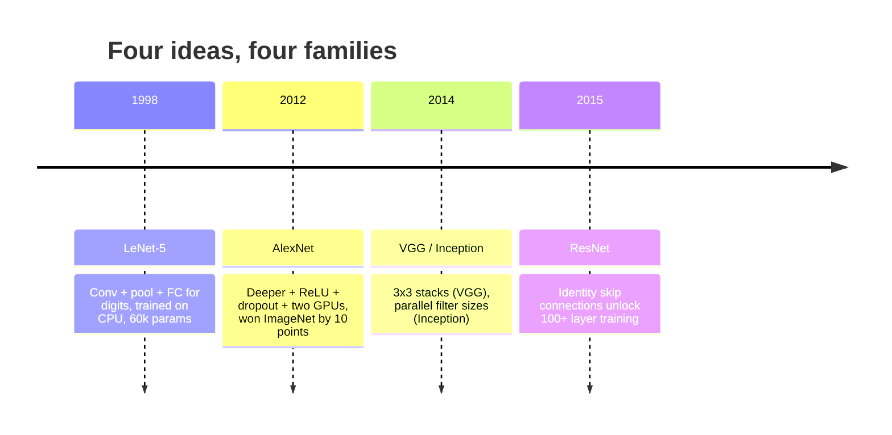
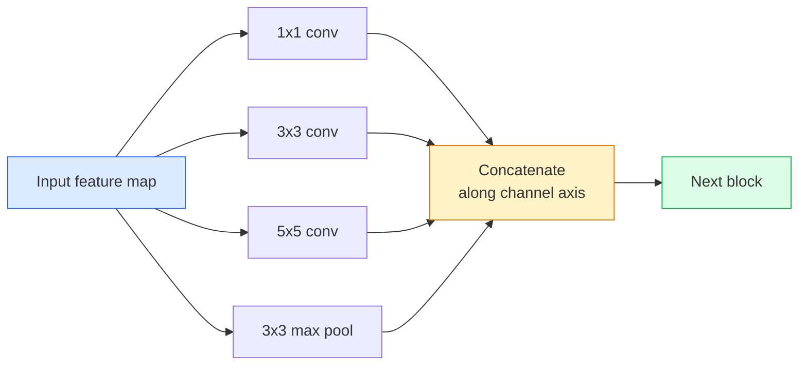
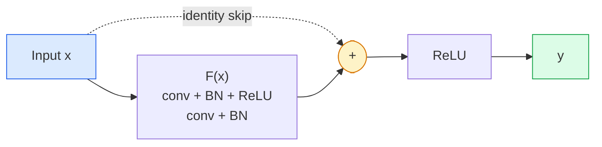

# CNN——从LeNet到ResNet

> 过去三十年来所有重要的卷积神经网络，本质上都是“卷积–非线性运算–下采样”这一固定流程的变体，仅在此基础上加入了新的创新点。请按顺序学习这些创新思想。

**类型：** 学习 + 实践
**语言：** Python
**先修课程：** 第3阶段第11课（PyTorch）、第4阶段第01课（图像基础）、第4阶段第02课（从零实现卷积运算）
**时长：** 约75分钟

## 学习目标

- 追溯 LeNet-5 -> AlexNet -> VGG -> Inception -> ResNet 的架构演进脉络，并说明每个系列带来的独特创新点
- 使用 PyTorch 实现 LeNet-5、一个 VGG 风格的块以及一个 ResNet BasicBlock，每部分的代码行数均不超过 40 行
- 解释为何残差连接能让原本无法训练的 1,000 层网络转变为当前最先进的模型
- 在查看源代码之前，分析现代骨干网络（如 ResNet-18、ResNet-50），预测其输出形状、感受野大小以及参数数量

## 问题所在

2011年，最佳的ImageNet分类器其前5名准确率约为74%。2012年，AlexNet的准确率提升至85%。2015年，ResNet的准确率则达到96%。尽管没有新的数据，也没有新一代GPU出现，这些性能的提升依然得益于架构创新。一名合格的视觉工程师必须了解各项创新理念源自哪篇论文，因为2026年投入使用的所有核心模型都是对这些创新元素的重新组合——而且这些理念还会不断传递：分组卷积从CNN演变为Transformer，残差连接从ResNet延伸至现有的各类大语言模型，而批量归一化则被应用在扩散模型中。

按顺序学习这些网络还能帮助你避免一个常见错误：即在仅需LeNet规模的网络就能解决问题时，却选择使用最大的可用模型。MNIST任务根本不需要ResNet。了解各类网络的性能发展曲线，就能帮你判断应采用何种规模的模型。

## 概念概述

### 改变视觉体验的四大理念



在经典计算机视觉领域中，没有其他概念比这四次飞跃更为重要。

### LeNet-5（1998年）

Yann LeCun的数字识别器。包含60,000个参数。由两个卷积-池化模块、两层全连接层以及tanh激活函数构成。它确立了所有CNN所继承的架构模板：

```
input (1, 32, 32)
  conv 5x5 -> (6, 28, 28)
  avg pool 2x2 -> (6, 14, 14)
  conv 5x5 -> (16, 10, 10)
  avg pool 2x2 -> (16, 5, 5)
  flatten -> 400
  dense -> 120
  dense -> 84
  dense -> 10
```

现代世界所称的卷积神经网络——即通过交替进行卷积操作和下采样，最终将特征输入小型分类头的网络结构——实际上不过是层数更多、通道数更大且激活函数更优的LeNet而已。

### AlexNet（2012年）

导致 ImageNet 训练失败的三个关键变化：

1. 使用 **ReLU** 替代 tanh。这使得梯度不再消失，训练速度提升了六倍。
2. 在全连接层中引入 **Dropout**。正则化技术由此从一种技巧转变为独立的层结构。
3. 增加模型的**深度与宽度**。采用五层卷积层、三层全连接层，共 6000 万个参数，通过在两块 GPU 上并行分配模型权重来进行训练。

该论文的图 2 仍将 GPU 并行结构显示为两条独立的处理流。这种并行方式其实只是硬件层面的临时解决方案，并非架构上的深刻洞察——但上述三个理念至今仍存在于所有现代深度学习模型中。

### VGG（2014）

VGG 提出问题：如果仅使用 3x3 卷积并构建更深的网络，会发生什么？

```
stack:   conv 3x3 -> conv 3x3 -> pool 2x2
repeat:  16 or 19 conv layers
```

两个 3x3 卷积层与一个 5x5 卷积层处理相同的 5x5 输入区域，但其参数量更少（2*9*C^2 = 18C^2 对比 25*C^2），且中间还需多一个 ReLU 层。VGG 将这一观察结果发展成了完整的架构。由于该架构结构简单——仅有一种模块类型并重复使用——它便成为了此后所有类似架构的参考标准。

参数量：1.38 亿个，训练速度慢，推理成本高。

### 《盗梦空间》（2014年，同年上映）

Google 对“我应该使用多大的内核尺寸？”这一问题的回答是：并行使用所有尺寸。



每个分支都有特定的功能：1×1卷积用于通道混合，3×3卷积用于局部纹理处理，5×5卷积用于生成更大规模的图案，而池化操作则用于提取与位置无关的特征——随后通过拼接操作，上一层网络可以选择使用其中最有效的那个分支。Inception v1在每个分支内部都使用了1×1卷积作为瓶颈结构，以此控制参数数量在合理范围内。

### 退化问题

到 2015 年时，VGG-19 能正常运行，而 VGG-32 却无法工作。原本认为增加网络深度会有帮助，但当层数超过约 20 层后，训练损失和测试损失都会恶化。这并非过拟合现象，而是优化器由于梯度在每一层中呈乘性衰减，而无法找到有用的权重。

```
Plain deep network:
  y = f_L( f_{L-1}( ... f_1(x) ... ) )

Gradient wrt early layer:
  dL/dW_1 = dL/dy * df_L/df_{L-1} * ... * df_2/df_1 * df_1/dW_1

Each multiplicative term has magnitude roughly (weight magnitude) * (activation gain).
Stack 100 of them with gains < 1 and the gradient is effectively zero.
```

VGG之所以采用19层结构，是因为同期发布的批量归一化技术能够有效保持激活值的尺度。但即便有批量归一化的辅助，其深度也难以超过30层左右。

### ResNet（2015年）

他、张、任、孙提出了一项修改，解决了所有问题：

```
standard block:   y = F(x)
residual block:   y = F(x) + x
```

`+ x` 的含义是该层始终可以通过将 `F(x)` 设为零来选择不执行任何操作。由于每个额外的模块都存在这种简单的规避手段，因此 1,000 层的 ResNet 的性能最多仅与 1 层网络相当。有了这一保障，优化器愿意让每个模块都具有*一定的*实用性——而将这种具有适度实用性的模块堆叠 100 层，便能达到当前的最先进水平。



该模块有两种常见变体，随处可见：

- **BasicBlock**（ResNet-18、ResNet-34）：包含两个 3x3 卷积层，并在两者之间设置跳跃连接。
- **Bottleneck**（ResNet-50、-101、-152）：包含一个 1x1 下采样层、一个 3x3 主卷积层以及一个 1x1 上采样层，在这三者之间设置跳跃连接。当通道数较多时，这种结构成本更低。

当跳跃连接需要穿过下采样层（步长为 2）时，为了保持形状一致，恒等路径会被替换为一个步长为 2 的 1x1 卷积层。

### 为何残差在视觉之外的领域同样重要

这个理念其实并非关于图像分类。它的目标是把深度神经网络从那种“只能寄希望于梯度能够正常传递”的不可靠状态，转变为一种可靠且可扩展的工程工具。在后续阶段中你将会了解的所有变换器模型，在其每个模块中都包含完全相同的跳接结构。没有 ResNet，也就不会有 GPT。

```figure
pooling
```

## 构建它

### 步骤 1：LeNet-5

一个精简且忠于原版的LeNet模型。采用双曲正切函数作为激活函数，并使用平均池化层。为适应现代技术，唯一的改进在于我们在后端使用了`nn.CrossEntropyLoss`，而非原始的高斯连接方式。

```python
import torch
import torch.nn as nn
import torch.nn.functional as F

class LeNet5(nn.Module):
    def __init__(self, num_classes=10):
        super().__init__()
        self.conv1 = nn.Conv2d(1, 6, kernel_size=5)
        self.conv2 = nn.Conv2d(6, 16, kernel_size=5)
        self.pool = nn.AvgPool2d(2)
        self.fc1 = nn.Linear(16 * 5 * 5, 120)
        self.fc2 = nn.Linear(120, 84)
        self.fc3 = nn.Linear(84, num_classes)

    def forward(self, x):
        x = self.pool(torch.tanh(self.conv1(x)))
        x = self.pool(torch.tanh(self.conv2(x)))
        x = torch.flatten(x, 1)
        x = torch.tanh(self.fc1(x))
        x = torch.tanh(self.fc2(x))
        return self.fc3(x)

net = LeNet5()
x = torch.randn(1, 1, 32, 32)
print(f"output: {net(x).shape}")
print(f"params: {sum(p.numel() for p in net.parameters()):,}")
```

预期输出：`output: torch.Size([1, 10])`，`params: 61,706`。这就是开启现代视觉计算的整个数字分类器。

### 步骤 2：VGG 块

一个可复用模块：两个 3×3 卷积层、ReLU 激活函数、批量归一化层以及最大池化层。

```python
class VGGBlock(nn.Module):
    def __init__(self, in_c, out_c):
        super().__init__()
        self.conv1 = nn.Conv2d(in_c, out_c, kernel_size=3, padding=1)
        self.bn1 = nn.BatchNorm2d(out_c)
        self.conv2 = nn.Conv2d(out_c, out_c, kernel_size=3, padding=1)
        self.bn2 = nn.BatchNorm2d(out_c)
        self.pool = nn.MaxPool2d(2)

    def forward(self, x):
        x = F.relu(self.bn1(self.conv1(x)))
        x = F.relu(self.bn2(self.conv2(x)))
        return self.pool(x)

class MiniVGG(nn.Module):
    def __init__(self, num_classes=10):
        super().__init__()
        self.stack = nn.Sequential(
            VGGBlock(3, 32),
            VGGBlock(32, 64),
            VGGBlock(64, 128),
        )
        self.head = nn.Sequential(
            nn.AdaptiveAvgPool2d(1),
            nn.Flatten(),
            nn.Linear(128, num_classes),
        )

    def forward(self, x):
        return self.head(self.stack(x))

net = MiniVGG()
x = torch.randn(1, 3, 32, 32)
print(f"output: {net(x).shape}")
print(f"params: {sum(p.numel() for p in net.parameters()):,}")
```

在 CIFAR 尺寸的输入数据上使用三个 VGG 块、一个自适应池化层以及一个线性层。参数量约为 29 万，足以应对 CIFAR-10 任务。

### 步骤 3：ResNet 基本块

ResNet-18 和 ResNet-34 的核心构建模块。

```python
class BasicBlock(nn.Module):
    def __init__(self, in_c, out_c, stride=1):
        super().__init__()
        self.conv1 = nn.Conv2d(in_c, out_c, kernel_size=3, stride=stride, padding=1, bias=False)
        self.bn1 = nn.BatchNorm2d(out_c)
        self.conv2 = nn.Conv2d(out_c, out_c, kernel_size=3, stride=1, padding=1, bias=False)
        self.bn2 = nn.BatchNorm2d(out_c)
        if stride != 1 or in_c != out_c:
            self.shortcut = nn.Sequential(
                nn.Conv2d(in_c, out_c, kernel_size=1, stride=stride, bias=False),
                nn.BatchNorm2d(out_c),
            )
        else:
            self.shortcut = nn.Identity()

    def forward(self, x):
        out = F.relu(self.bn1(self.conv1(x)))
        out = self.bn2(self.conv2(out))
        out = out + self.shortcut(x)
        return F.relu(out)
```

在卷积层中设置 `bias=False` 是批量归一化的常规做法——批量归一化本身的 beta 参数已负责处理偏置，因此再单独设置卷积层的偏置属于浪费。只有当步长或通道数发生变化时，`shortcut` 才需要一个真正的卷积层；否则它就是一个无操作的恒等映射。

### 第 4 步：一个微型 ResNet

将四组 BasicBlocks 堆叠起来，即可构建出能够处理 CIFAR 尺寸输入的可用 ResNet 模型。

```python
class TinyResNet(nn.Module):
    def __init__(self, num_classes=10):
        super().__init__()
        self.stem = nn.Sequential(
            nn.Conv2d(3, 32, kernel_size=3, stride=1, padding=1, bias=False),
            nn.BatchNorm2d(32),
            nn.ReLU(inplace=True),
        )
        self.layer1 = self._make_group(32, 32, num_blocks=2, stride=1)
        self.layer2 = self._make_group(32, 64, num_blocks=2, stride=2)
        self.layer3 = self._make_group(64, 128, num_blocks=2, stride=2)
        self.layer4 = self._make_group(128, 256, num_blocks=2, stride=2)
        self.head = nn.Sequential(
            nn.AdaptiveAvgPool2d(1),
            nn.Flatten(),
            nn.Linear(256, num_classes),
        )

    def _make_group(self, in_c, out_c, num_blocks, stride):
        blocks = [BasicBlock(in_c, out_c, stride=stride)]
        for _ in range(num_blocks - 1):
            blocks.append(BasicBlock(out_c, out_c, stride=1))
        return nn.Sequential(*blocks)

    def forward(self, x):
        x = self.stem(x)
        x = self.layer1(x)
        x = self.layer2(x)
        x = self.layer3(x)
        x = self.layer4(x)
        return self.head(x)

net = TinyResNet()
x = torch.randn(1, 3, 32, 32)
print(f"output: {net(x).shape}")
print(f"params: {sum(p.numel() for p in net.parameters()):,}")
```

四组，每组包含两个块。第2、3、4组的步长为2。每次下采样时，通道数都会翻倍。参数量约为280万。这就是能够平滑扩展至ResNet-152的标准架构方案。

### 第 5 步：比较参数与特征的效率

将相同的输入数据分别传递给这三个网络，并比较它们的参数数量。

```python
def summary(name, net, x):
    y = net(x)
    params = sum(p.numel() for p in net.parameters())
    print(f"{name:12s}  input {tuple(x.shape)} -> output {tuple(y.shape)}  params {params:>10,}")

x = torch.randn(1, 3, 32, 32)
summary("LeNet5",     LeNet5(),       torch.randn(1, 1, 32, 32))
summary("MiniVGG",    MiniVGG(),      x)
summary("TinyResNet", TinyResNet(),   x)
```

三种模型，三个时代，参数量相差三个数量级。在经过几轮训练后，针对CIFAR-10数据集的准确率大致为：LeNet达到60%，MiniVGG达到89%，TinyResNet达到93%。

## 使用它

`torchvision.models` 提供了上述所有模型的预训练版本。不同模型系列之间的调用方式完全一致，这正是骨干网络抽象设计的初衷。

```python
from torchvision.models import resnet18, ResNet18_Weights, vgg16, VGG16_Weights

r18 = resnet18(weights=ResNet18_Weights.IMAGENET1K_V1)
r18.eval()

print(f"ResNet-18 params: {sum(p.numel() for p in r18.parameters()):,}")
print(r18.layer1[0])
print()

v16 = vgg16(weights=VGG16_Weights.IMAGENET1K_V1)
v16.eval()
print(f"VGG-16   params: {sum(p.numel() for p in v16.parameters()):,}")
```

ResNet-18 的参数量为 1170 万，而 VGG-16 的参数量则为 1.38 亿。在 ImageNet 测试集上的 top-1 准确率相近（分别为 69.8% 和 71.6%）。残差连接机制使其参数效率提升了 12 倍。正因如此，从 2016 年到 2021 年 ViT 出现之前，ResNet 变体一直占据主导地位；即使在当前计算资源成为限制因素的实际应用场景中，它们依然占据优势。

对于迁移学习而言，操作步骤始终如一：加载预训练模型，冻结主干网络结构，仅替换分类器头部。

```python
for p in r18.parameters():
    p.requires_grad = False
r18.fc = nn.Linear(r18.fc.in_features, 10)
```

三行代码。现在你已拥有一个基于10个类别的CIFAR分类器，它继承了ImageNet训练所得的特征表示。

## 发布它

本课程将生成以下内容：

- `outputs/prompt-backbone-selector.md` — 一个提示词，可根据任务类型、数据集规模及计算资源限制，自动选择合适的 CNN 架构（LeNet/VGG/ResNet/MobileNet/ConvNeXt）。
- `outputs/skill-residual-block-reviewer.md` — 一种能力模块，能够读取 PyTorch 模块并识别残差连接中的错误（如步长变化时缺少快捷连接、快捷连接的激活顺序错误，以及 BN 层在加法运算前的位置不当）。

## 练习题

1. **（简单）** 逐层手动统计 `TinyResNet` 的参数数量，并将其与 `sum(p.numel() for p in net.parameters())` 的结果进行对比。大部分参数集中在卷积层、批归一化层，还是分类头中？
2. **（中等）** 实现瓶颈块结构（1x1 -> 3x3 -> 1x1，并包含跳跃连接），并利用该结构为 CIFAR 数据集构建一个类似 ResNet-50 的网络。将该网络的参数数量与 `TinyResNet` 进行比较。
3. **（困难）** 从 `BasicBlock` 中移除跳跃连接，分别在 CIFAR-10 数据集上训练包含 34 个块的“纯”深度网络和 ResNet 网络，每类网络的训练周期均为 10 轮。绘制两类网络随训练轮次变化的损失曲线。需重现 He 等人论文中的图 1 结果，即该纯深度网络最终收敛到的损失值高于其结构较浅的对应网络。

## 关键术语

| 术语 | 通俗说法 | 实际含义 |
|------|----------|----------|
| Backbone | “模型” | 用于生成特征图并输入到任务处理模块的卷积块堆叠结构 |
| Residual connection | “跳过连接” | `y = F(x) + x`；通过将 F 设为零让优化器学习恒等映射，从而实现任意深度的网络训练 |
| BasicBlock | “带跳过连接的两个 3x3 卷积层” | ResNet-18/34 的基本构建单元：卷积-BN-ReLU-卷积-BN-相加-ReLU |
| Bottleneck | “1x1 下采样，3x3 卷积，1x1 上采样” | ResNet-50/101/152 中的块结构；由于 3x3 卷积在较窄宽度上执行，因此在通道数较多时计算成本较低 |
| Degradation problem | “深度越深效果越差” | 当普通卷积层数量超过约 20 层后，训练误差和测试误差都会上升；该问题可通过残差连接解决，而非增加数据量 |
| Stem | “第一层” | 将 3 色通道输入转换为基础特征宽度的初始卷积层；对于 ImageNet 数据集通常为步长为 2 的 7x7 卷积，对于 CIFAR 数据集则为步长为 1 的 3x3 卷积 |
| Head | “分类器” | 最后一个 Backbone 块之后的层：自适应池化、展平操作以及线性层 |
| Transfer learning | “预训练权重” | 加载在 ImageNet 上训练好的 Backbone，仅对任务相关的分类头进行微调 |

## 延伸阅读

- [用于图像识别的深度残差学习（He等人，2015）](https://arxiv.org/abs/1512.03385) —— ResNet相关论文；其中的每张图表都值得深入研究  
- [非常深的卷积网络（Simonyan与Zisserman，2014）](https://arxiv.org/abs/1409.1556) —— VGG相关论文；至今仍是解释“为何使用3×3滤波器”的最佳参考资料  
- [利用深度CNN进行ImageNet分类（Krizhevsky等人，2012）](https://papers.nips.cc/paper_files/paper/2012/hash/c399862d3b9d6b76c8436e924a68c45b-Abstract.html) —— AlexNet；终结了手工特征时代的关键论文  
- [通过卷积进一步加深网络结构（Szegedy等人，2014）](https://arxiv.org/abs/1409.4842) —— Inception v1；其并行滤波理念至今仍被视觉Transformer所采用
