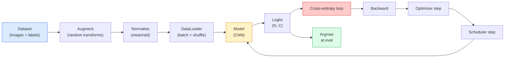

# 图像分类

> 分类器是一个将像素映射为各类别概率分布的函数。其余部分均为实现细节。

**类型：** 构建
**语言：** Python
**先修课程：** 第2阶段第09课（模型评估）、第3阶段第10课（小型框架）、第4阶段第03课（卷积神经网络）
**时长：** 约75分钟

## 学习目标

- 基于 CIFAR-10 构建端到端的图像分类流程：数据集准备、数据增强、模型设计、训练循环以及评估环节。
- 阐述各组件的作用（数据加载器、损失函数、优化器、调度器、数据增强技术），并预测其中任意一个组件出现故障时对损失曲线的影响。
- 从零实现 mixup、cutout 和标签平滑技术，并说明在何种情况下应当使用这些技术。
- 解读混淆矩阵以及各类别的精确度/召回率表格，以便在整体准确率之外诊断数据集和模型存在的问题。

## 问题所在

每一个实际部署的视觉任务，在某种程度上都可以归结为图像分类。检测任务是对区域进行分类，分割任务则是对像素进行分类，而检索任务则是根据与类别质心的相似度来对结果进行排序。掌握正确的分类方法——包括数据集处理流程、数据增强策略、损失函数设计以及评估方式——是能够迁移到该阶段其他所有任务中的核心技能。

大多数分类错误并不出在模型本身，而是存在于数据处理流程中：异常的归一化处理、未打乱的训练集、会扭曲标签的数据增强操作、被训练数据污染的验证集，或是在第30个训练轮次后就开始出现异常的学习率。一个配置正确的CNN在CIFAR-10数据集上的准确率可达93%，而配置错误的版本通常只能达到70%-75%，且其损失曲线在整个训练过程中看起来依然正常。

本课程将手动构建整个数据处理流程，以便对每个环节进行逐一检查。你不会使用`torchvision.datasets`中任何可能隐藏缺陷的组件。

## 概念概述

### 分类流程



此循环中的每一行都可能存在漏洞。交叉熵损失函数直接使用原始的对数概率值，而非 softmax 输出值，因此在计算损失之前若执行了 `model(x).softmax()`，就会悄悄地生成错误的梯度。数据增强操作仅作用于输入数据，而不影响标签数据——不过 mixup 方法除外，它会对输入和标签数据进行混合处理。`optimizer.zero_grad()` 必须在每一步中调用一次；若跳过此步骤，梯度将会累积，从而导致学习率出现极度不稳定的现象。所有这些漏洞都会使学习曲线变得平缓，而不会引发任何错误提示。

### 交叉熵、对数几率与软阈值函数

分类器会为每张图像生成 `C` 个数值，即对数几率。通过应用 softmax 函数可将这些值转换为概率分布：

```
softmax(z)_i = exp(z_i) / sum_j exp(z_j)
```

交叉熵用于衡量正确类别的负对数概率：

```
CE(z, y) = -log( softmax(z)_y )
        = -z_y + log( sum_j exp(z_j) )
```

右侧的公式才是数值上稳定的形式（对数和指数形式）。PyTorch 的 `nn.CrossEntropyLoss` 将 softmax 操作与负对数似然损失合并为单一操作，并直接接收原始逻辑值。若先自行计算 softmax，几乎总会引入错误——因为这样会得到 log(softmax(softmax(z))) 这种没有实际意义的数值。

### 为什么数据增强有效

卷积神经网络通过权重共享具备翻译相关的归纳偏置，但并不具备对裁剪、翻转、颜色抖动或遮挡的固有不变性。要使其学习这些不变性，唯一的办法就是向它展示能够体现这些特性的像素。训练过程中的每一次随机变换都相当于在告诉模型：“这两张图像具有相同的标签；请学习能够忽略二者差异的特征。”

```
Original crop:  "dog facing left"
Flip:           "dog facing right"       <- same label, different pixels
Rotate(+15):    "dog, slight tilt"
Colour jitter:  "dog in warmer light"
RandomErasing:  "dog with patch missing"
```

规则：数据增强操作必须保留原始标签。对数字进行裁剪或旋转处理时，可能会导致“6”变成“9”；针对该数据集，应使用更小的旋转范围，并选择能够保持数字特征不变性的增强方法。

### Mixup 混合模型

常规的增强方法仅对像素进行变换，而标签仍保持独热编码形式。**Mixup**与**Cutmix**则通过同时对像素和标签进行插值来打破这一限制。

```
Mixup:
  lambda ~ Beta(a, a)
  x = lambda * x_i + (1 - lambda) * x_j
  y = lambda * y_i + (1 - lambda) * y_j

Cutmix:
  paste a random rectangle of x_j into x_i
  y = area-weighted mix of y_i and y_j
```

其优势在于：模型不再死记硬背那些极端的独热编码目标，而是学会在各个类别之间进行插值。训练损失会上升，但测试准确率会提高。这是针对任何分类器最经济且有效的鲁棒性提升方案。

### 标签平滑

Mixup 的一种变体。它不是针对 `[0, 0, 1, 0, 0]` 进行训练，而是使用类似 `[eps/C, eps/C, 1-eps, eps/C, eps/C]` 的数据集进行训练，其中 `eps` 取较小的值，如 0.1。该方法可防止模型生成过于极端的对数几率值，并几乎不增加成本即可提升模型的校准精度。自 PyTorch 1.10 版本起，该功能已内置于 `nn.CrossEntropyLoss(label_smoothing=0.1)` 中。

### 超越准确率的评估指标

整体准确率会掩盖数据分布的不平衡问题。一个始终预测多数类的90-10二元分类器，其准确率也会显示为90%。以下工具能够真实反映模型的实际表现：

- **各类别准确率**——每个类别对应一个数值；可立即识别出表现不佳的类别。
- **混淆矩阵**——一个C×C的网格，其中第i行第j列表示被预测为类别j的真实类别i的数量；对角线上的数值代表正确预测，非对角线数值则反映了模型的错误所在。
- **Top-1 / Top-5预测**——判断正确类别是否出现在前1次或前5次预测中；对于ImageNet数据集而言，Top-5预测尤为重要，因为“诺威奇梗”与“诺福克梗”这类类别确实存在较大混淆可能。
- **校准度（ECE）**——置信度为0.8的预测结果，其正确率是否达到80%？现代神经网络往往存在过度自信的问题；可通过温度缩放或标签平滑技术来解决这一问题。

```figure
receptive-field
```

## 构建它

### 步骤 1：确定性的合成数据集

CIFAR-10 数据集存储在磁盘上。为确保本课程的实验结果可复现且效率较高，我们构建了一个结构与 CIFAR 类似的合成数据集——即由 32x32 的 RGB 图像组成，并带有模型必须学习的特定类别结构。同样的处理流程可直接应用于真实的 CIFAR-10 数据集而无需任何修改。

```python
import numpy as np
import torch
from torch.utils.data import Dataset


def synthetic_cifar(num_per_class=1000, num_classes=10, seed=0):
    rng = np.random.default_rng(seed)
    X = []
    Y = []
    for c in range(num_classes):
        centre = rng.uniform(0, 1, (3,))
        freq = 2 + c
        for _ in range(num_per_class):
            yy, xx = np.meshgrid(np.linspace(0, 1, 32), np.linspace(0, 1, 32), indexing="ij")
            r = np.sin(xx * freq) * 0.5 + centre[0]
            g = np.cos(yy * freq) * 0.5 + centre[1]
            b = (xx + yy) * 0.5 * centre[2]
            img = np.stack([r, g, b], axis=-1)
            img += rng.normal(0, 0.08, img.shape)
            img = np.clip(img, 0, 1)
            X.append(img.astype(np.float32))
            Y.append(c)
    X = np.stack(X)
    Y = np.array(Y)
    idx = rng.permutation(len(X))
    return X[idx], Y[idx]


class ArrayDataset(Dataset):
    def __init__(self, X, Y, transform=None):
        self.X = X
        self.Y = Y
        self.transform = transform

    def __len__(self):
        return len(self.X)

    def __getitem__(self, i):
        img = self.X[i]
        if self.transform is not None:
            img = self.transform(img)
        img = torch.from_numpy(img).permute(2, 0, 1)
        return img, int(self.Y[i])
```

每个类别都有其独特的颜色调色板与频率模式，同时还会加入高斯噪声，以此迫使模型学习信号的本质而非死记硬背像素值。共包含10个类别，每个类别有1000张经过随机排列的图像。

### 步骤 2：归一化与数据增强

每个视觉处理流程都包含的两种变换。

```python
def standardize(mean, std):
    mean = np.array(mean, dtype=np.float32)
    std = np.array(std, dtype=np.float32)
    def _fn(img):
        return (img - mean) / std
    return _fn


def random_hflip(p=0.5):
    def _fn(img):
        if np.random.random() < p:
            return img[:, ::-1, :].copy()
        return img
    return _fn


def random_crop(pad=4):
    def _fn(img):
        h, w = img.shape[:2]
        padded = np.pad(img, ((pad, pad), (pad, pad), (0, 0)), mode="reflect")
        y = np.random.randint(0, 2 * pad)
        x = np.random.randint(0, 2 * pad)
        return padded[y:y + h, x:x + w, :]
    return _fn


def compose(*fns):
    def _fn(img):
        for fn in fns:
            img = fn(img)
        return img
    return _fn
```

在裁剪之前先进行反射填充，而非零填充，因为黑色边框是模型会学会以无用方式忽略的信号。

### 步骤 3：混合扰动

在训练步骤中混合两张图像与两个标签。该操作被实现为批量变换，因此位于前向传播之后，而非数据集中。

```python
def mixup_batch(x, y, num_classes, alpha=0.2):
    if alpha <= 0:
        return x, torch.nn.functional.one_hot(y, num_classes).float()
    lam = float(np.random.beta(alpha, alpha))
    idx = torch.randperm(x.size(0), device=x.device)
    x_mixed = lam * x + (1 - lam) * x[idx]
    y_onehot = torch.nn.functional.one_hot(y, num_classes).float()
    y_mixed = lam * y_onehot + (1 - lam) * y_onehot[idx]
    return x_mixed, y_mixed


def soft_cross_entropy(logits, soft_targets):
    log_probs = torch.log_softmax(logits, dim=-1)
    return -(soft_targets * log_probs).sum(dim=-1).mean()
```

`soft_cross_entropy` 是针对软标签分布的交叉熵函数。当目标值恰好为 one-hot 格式时，该函数会退化为常规的 one-hot 交叉熵计算方式。

### 第 4 步：训练循环

完整流程：对数据仅遍历一次，每个批次计算一次梯度，每个训练轮次调整调度器参数一次。

```python
import torch
import torch.nn as nn
from torch.utils.data import DataLoader
from torch.optim import SGD
from torch.optim.lr_scheduler import CosineAnnealingLR

def train_one_epoch(model, loader, optimizer, device, num_classes, use_mixup=True):
    model.train()
    total, correct, loss_sum = 0, 0, 0.0
    for x, y in loader:
        x, y = x.to(device), y.to(device)
        if use_mixup:
            x_m, y_soft = mixup_batch(x, y, num_classes)
            logits = model(x_m)
            loss = soft_cross_entropy(logits, y_soft)
        else:
            logits = model(x)
            loss = nn.functional.cross_entropy(logits, y, label_smoothing=0.1)
        optimizer.zero_grad()
        loss.backward()
        optimizer.step()
        loss_sum += loss.item() * x.size(0)
        total += x.size(0)
        # Training accuracy vs the un-mixed labels `y` is only an approximation
        # when mixup is on (the model saw soft targets, not y). Treat it as a
        # rough progress signal; rely on val accuracy for real performance.
        with torch.no_grad():
            pred = logits.argmax(dim=-1)
            correct += (pred == y).sum().item()
    return loss_sum / total, correct / total


@torch.no_grad()
def evaluate(model, loader, device, num_classes):
    model.eval()
    total, correct = 0, 0
    loss_sum = 0.0
    cm = torch.zeros(num_classes, num_classes, dtype=torch.long)
    for x, y in loader:
        x, y = x.to(device), y.to(device)
        logits = model(x)
        loss = nn.functional.cross_entropy(logits, y)
        pred = logits.argmax(dim=-1)
        for t, p in zip(y.cpu(), pred.cpu()):
            cm[t, p] += 1
        loss_sum += loss.item() * x.size(0)
        total += x.size(0)
        correct += (pred == y).sum().item()
    return loss_sum / total, correct / total, cm
```

编写训练循环时需检查的五个不变量：

1. 训练前调用 `model.train()`，评估前调用 `model.eval()`——这会改变 dropout 和 batchnorm 的行为。
2. 在调用 `.backward()` 之前先调用 `.zero_grad()`。
3. 在累积指标时使用 `.item()`，以避免任何因素使计算图保持活跃状态。
4. 评估期间使用 `@torch.no_grad()`——可节省内存和时间，并防止潜在错误。
5. 对原始 logit 值直接使用 Argmax，而非 softmax——结果相同，但操作次数减少一个。

### 第 5 步：整合所有组件

使用上一课中的 `TinyResNet` 模型，训练若干个 epoch 后进行评估。

```python
from main import synthetic_cifar, ArrayDataset
from main import standardize, random_hflip, random_crop, compose
from main import mixup_batch, soft_cross_entropy
from main import train_one_epoch, evaluate
# TinyResNet comes from the previous lesson (03-cnns-lenet-to-resnet).
# Adjust the import path to wherever you stored the previous lesson's code.
from cnns_lenet_to_resnet import TinyResNet  # example placeholder

X, Y = synthetic_cifar(num_per_class=500)
split = int(0.9 * len(X))
X_train, Y_train = X[:split], Y[:split]
X_val, Y_val = X[split:], Y[split:]

mean = [0.5, 0.5, 0.5]
std = [0.25, 0.25, 0.25]
train_tf = compose(random_hflip(), random_crop(pad=4), standardize(mean, std))
eval_tf = standardize(mean, std)

train_ds = ArrayDataset(X_train, Y_train, transform=train_tf)
val_ds = ArrayDataset(X_val, Y_val, transform=eval_tf)

train_loader = DataLoader(train_ds, batch_size=128, shuffle=True, num_workers=0)
val_loader = DataLoader(val_ds, batch_size=256, shuffle=False, num_workers=0)

device = "cuda" if torch.cuda.is_available() else "cpu"
model = TinyResNet(num_classes=10).to(device)
optimizer = SGD(model.parameters(), lr=0.1, momentum=0.9, weight_decay=5e-4, nesterov=True)
scheduler = CosineAnnealingLR(optimizer, T_max=10)

for epoch in range(10):
    tr_loss, tr_acc = train_one_epoch(model, train_loader, optimizer, device, 10, use_mixup=True)
    va_loss, va_acc, _ = evaluate(model, val_loader, device, 10)
    scheduler.step()
    print(f"epoch {epoch:2d}  lr {scheduler.get_last_lr()[0]:.4f}  "
          f"train {tr_loss:.3f}/{tr_acc:.3f}  val {va_loss:.3f}/{va_acc:.3f}")
```

在合成数据集上，仅需五个训练轮次即可达到近乎完美的验证准确率，这正是我们要证明的：整个流程是正确的，模型能够学习到其可学习的特征。若将数据集替换为真实的 CIFAR-10，同样的训练循环在不做任何改动的情况下也只能将准确率提升至约 90%。

### 步骤 6：读取混淆矩阵

仅凭准确率无法判断模型的缺陷所在，混淆矩阵才能揭示问题。

```python
def print_confusion(cm, labels=None):
    c = cm.shape[0]
    labels = labels or [str(i) for i in range(c)]
    print(f"{'':>6}" + "".join(f"{l:>5}" for l in labels))
    for i in range(c):
        row = cm[i].tolist()
        print(f"{labels[i]:>6}" + "".join(f"{v:>5}" for v in row))
    print()
    tp = cm.diag().float()
    fp = cm.sum(dim=0).float() - tp
    fn = cm.sum(dim=1).float() - tp
    prec = tp / (tp + fp).clamp_min(1)
    rec = tp / (tp + fn).clamp_min(1)
    f1 = 2 * prec * rec / (prec + rec).clamp_min(1e-9)
    for i in range(c):
        print(f"{labels[i]:>6}  prec {prec[i]:.3f}  rec {rec[i]:.3f}  f1 {f1[i]:.3f}")

_, _, cm = evaluate(model, val_loader, device, 10)
print_confusion(cm)
```

行代表真实类别，列代表预测结果。类别 3 与类别 5 之间的非对角线计数若出现聚集现象，说明模型混淆了这两个类别，这可为有针对性的数据收集或针对特定类别的增强训练提供参考依据。

## 使用它

`torchvision` 将上述所有内容封装为符合习惯的组件。对于真实的 CIFAR-10 数据集，整个处理流程仅需四行代码再加上一个训练循环即可完成。

```python
from torchvision.datasets import CIFAR10
from torchvision.transforms import Compose, RandomCrop, RandomHorizontalFlip, ToTensor, Normalize

mean = (0.4914, 0.4822, 0.4465)
std = (0.2470, 0.2435, 0.2616)
train_tf = Compose([
    RandomCrop(32, padding=4, padding_mode="reflect"),
    RandomHorizontalFlip(),
    ToTensor(),
    Normalize(mean, std),
])
eval_tf = Compose([ToTensor(), Normalize(mean, std)])

train_ds = CIFAR10(root="./data", train=True,  download=True, transform=train_tf)
val_ds   = CIFAR10(root="./data", train=False, download=True, transform=eval_tf)
```

有两点需要注意：均值/标准差是**特定于数据集的**——是在 CIFAR-10 训练集上计算得出的，而非 ImageNet；此外，“反射填充”即为社区通用的裁剪策略。若直接复制 ImageNet 的统计数值，会导致约 1% 的准确率偏差，除非有人对模型进行性能分析，否则很难发现这一问题。

## 发布它

本课程将生成以下内容：

- `outputs/prompt-classifier-pipeline-auditor.md` — 一个用于审计训练脚本的提示词，可检测上述五种不变量，并指出首个违规项。
- `outputs/skill-classification-diagnostics.md` — 一种功能模块，输入混淆矩阵与类别名称列表后，能汇总各类别的错误情况，并提出最具影响力的修复方案。

## 练习题

1. **（简单）** 在合成数据集上，对同一模型分别应用混合扰动与不使用混合扰动的情况进行五轮训练。绘制两种情况下的训练损失与验证损失曲线，并解释为何使用混合扰动时的训练损失更高，而验证准确率却相似或更好。
2. **（中等）** 实现 Cutout 技术——在每张训练图像中随机将一个 8x8 的区域置零——并分别对比“无增强”、“水平翻转+裁剪”、“水平翻转+裁剪+Cutout”以及“水平翻转+裁剪+混合扰动”这四种方案的增强效果。报告每种方案对应的验证准确率。
3. **（困难）** 构建一个 CIFAR-100 数据处理流程（包含 100 个类别，输入尺寸相同），并尽可能精确地复现 ResNet-34 的训练过程，其准确率需与已发表结果相差不超过 1%。附加要求：遍历三种不同的学习率及两种权重衰减策略，将相关日志记录到本地 CSV 文件中，并生成最终的“混淆矩阵——最高频错误项”表格。

## 关键术语

| 术语 | 人们常说的叫法 | 实际含义 |
|------|----------------|----------|
| Logits | “原始输出” | 每张图像对应的 C 个数值的预 Softmax 向量；交叉熵损失函数需要的是这些未经过 Softmax 处理的值，而非 Softmax 后的结果 |
| Cross-entropy | “损失函数” | 正确类别的对数概率的负值；通过一个稳定的运算同时整合了对数 Softmax 计算与负对数似然计算 |
| DataLoader | “批处理工具” | 用于封装数据集，具备随机打乱、批量处理以及（可选的）多工作进程加载功能；训练过程中出现的一半错误往往归咎于它 |
| Augmentation | “随机变换” | 训练阶段对像素级数据进行的所有变换，且这些变换需保留原始标签信息；旨在让 CNN 学习到其本身不具备的不变性特征 |
| Mixup / Cutmix | “混合两张图像” | 将输入图像与对应标签进行混合，使分类器学习到平滑的过渡效果，而非生硬的分类边界 |
| Label smoothing | “更柔和的目标值” | 用 (1-eps, eps/(C-1), ...) 替换传统的一热编码方式；有助于提升模型的校准精度，并略微提高准确率 |
| Top-k accuracy | “前 k 名准确率” | 正确类别位于概率最高的 k 个预测结果之中；适用于那些类别边界确实较为模糊的数据集 |
| Confusion matrix | “错误分布表” | 一个 C x C 的表格，其中 (i, j) 位置的数值表示被判定为类别 j 的真实类别为 i 的图像数量；对角线元素代表正确分类，非对角线元素则指示需要修正的问题所在 |

## 延伸阅读

- [CS231n：神经网络训练](https://cs231n.github.io/neural-networks-3/) —— 仍是单页内对训练流程最清晰的概述
- [图像分类的实用技巧（He等人，2019）](https://arxiv.org/abs/1812.01187) —— 每个小技巧共同为ResNet在ImageNet上的准确率提升3-4%
- [mixup：超越经验风险最小化（Zhang等人，2017）](https://arxiv.org/abs/1710.09412) —— mixup方法的原始论文；包含三页的理论阐述及令人信服的实验结果
- [为何温度缩放很重要（Guo等人，2017）](https://arxiv.org/abs/1706.04599) —— 证明现代神经网络存在校准问题的论文，并通过一个标量参数解决了该问题
