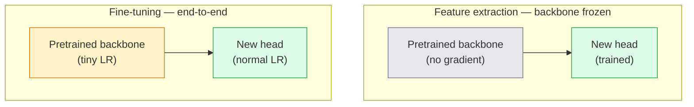

# 迁移学习与微调

> 已有人耗费了数百万 GPU 小时的计算资源，用来教会神经网络边缘、纹理以及物体各部分的特征。在训练自己的模型之前，你应该先利用这些已有的特征。

**类型：** 构建
**语言：** Python
**前置要求：** 第 4 阶段第 03 课（卷积神经网络），第 4 阶段第 04 课（图像分类）
**耗时：** 约 75 分钟

## 学习目标

- 区分特征提取与微调，并根据数据集规模、领域差异以及计算资源选择合适的方法
- 加载预训练的骨干网络，替换其分类头，仅通过不到20行代码即可训练该分类头至可用基准状态
- 采用逐步解冻层级的策略并设置不同的学习率，使得早期生成的通用特征更新幅度小于后期针对特定任务生成的特征
- 诊断三种常见故障：未解冻模块因过高的学习率导致特征漂移、小数据集下批量归一化统计量崩溃，以及灾难性遗忘现象

## 问题所在

在 ImageNet 数据集上训练 ResNet-50 大约需要 2,000 GPU小时。几乎没有团队能为每个待发布的任务都分配如此高的预算。实际上，几乎所有团队都会使用预训练的骨干网络结构，并在其顶部添加一个新的头部，该头部仅通过几百到几千张特定任务的图像进行训练。

这并非捷径。任何在 ImageNet 上训练过的卷积神经网络的第一组卷积块都会学习边缘以及类似 Gabor 的滤波器；接下来的几组块则负责学习纹理和简单的图案；中间层用于学习物体的各个组成部分；最末的几层则用于学习能够形成类似 ImageNet 中 1,000 种类别特征的组合。由于自然界中边缘与纹理的种类有限，这一层级结构的前 90% 几乎可以原封不动地应用于医学影像、工业检测、卫星数据以及所有其他视觉任务中；而真正需要重新训练的只有最后 10%。

要正确实现特征迁移，会面临三个常见问题：过高的学习率会破坏预训练的特征；过度冻结模型会导致其缺乏足够的信息；BatchNorm 的运行统计量可能会因数据集规模过小而发生偏移，而网络的其他部分从未接触过这些数据。本课程将逐一详细讲解这些问题。

## 概念概述

### 特征提取与微调

根据对预训练特征的信任程度以及可用数据量，可选择两种不同的处理模式。



经验法则：

| 数据集规模 | 领域相似度 | 训练方案 |
|--------------|------------|----------|
| < 1k 张图像 | 接近 ImageNet | 冻结主干网络，仅训练头部 |
| 1k-10k | 较接近 | 冻结前 2-3 层，微调其余部分 |
| 10k-100k | 任意 | 使用自适应学习率进行端到端微调 |
| 100k+ | 相差较远 | 对所有层进行微调；若领域差异极大，则考虑从零开始训练 |

“接近 ImageNet”大致指包含物体特征的常规 RGB 照片。医学 CT 扫描、卫星俯视图像以及显微镜图像属于领域差异较大的数据——这些特征仍有用，但需要让更多网络层进行适配。

### 为何冻结机制能够起作用

ImageNet 中 CNN 学习到的特征并非专门针对那 1,000 个类别，而是专注于自然图像的统计特性：特定方向的边缘、纹理、对比度模式以及基本形状。这些统计特性在人类能够识别的几乎所有视觉领域中都保持稳定。正因如此，仅在模型背部结构上进行微调，而在 CIFAR-10 上通过新增一个线性层进行零样本评估时，该模型的准确率仍可达到 80% 以上。这个线性层的作用是学习在该任务中应赋予哪些已学特征更高的权重。

### 判别性学习率

在解冻训练时，早期层的学习速度应当慢于后期层。早期层负责编码需要保留的通用特征；而后期层则负责编码任务特定的结构，这类结构的权重需要进行大量调整。

```
Typical recipe:

  stage 0 (stem + first group): lr = base_lr / 100    (mostly fixed)
  stage 1:                       lr = base_lr / 10
  stage 2:                       lr = base_lr / 3
  stage 3 (last backbone group): lr = base_lr
  head:                          lr = base_lr  (or slightly higher)
```

在 PyTorch 中，这仅仅是传递给优化器的参数组列表。一个模型，五种学习率，无需额外代码。

### BatchNorm 的问题

BN层保存了在ImageNet上计算得到的`running_mean`和`running_var`缓冲区。如果你的任务具有不同的像素分布——如不同的光照条件、传感器类型或颜色空间——这些缓冲区的数值将不再适用。以下是按推荐程度排序的三种解决方案：

1. **以训练模式使用BN进行微调**。让BN与其他参数一同更新其运行统计量。当任务数据集规模适中（>= 5k条样本）时，这是默认选择。
2. **在评估模式下冻结BN**。保留ImageNet上的统计量，仅训练权重部分。适用于数据集规模过小、导致BN的移动平均值出现噪声的情况。
3. **用GroupNorm替换BN**。可彻底消除移动平均值带来的问题。常用于每张GPU处理的批量大小极小的检测和分割模型架构中。

若处理不当，模型的准确率会悄无声息地下降5-15%。

### 头部设计

分类器头部由 1 到 3 个线性层组成，可选地包含一个 Dropout 层。每个 torchvision 底座模型都自带一个默认的头部结构，需要被替换：

```
backbone.fc = nn.Linear(backbone.fc.in_features, num_classes)          # ResNet
backbone.classifier[1] = nn.Linear(..., num_classes)                    # EfficientNet, MobileNet
backbone.heads.head = nn.Linear(..., num_classes)                       # torchvision ViT
```

对于小型数据集，通常一个线性层就足够了。当任务分布与主干网络的训练分布差异较大时，增加一个隐藏层（线性层 -> ReLU激活函数 -> Dropout层 -> 线性层）会有所帮助。

### 逐层学习率衰减

现代微调技术（如 BEiT、DINOv2、ViT-B 微调）中使用的更平滑的判别式学习率版本。它不将层分组为不同阶段，而是为每一层设置略低于其上一层的学习率：

```
lr_layer_k = base_lr * decay^(L - k)
```

当衰减系数为 0.75 且 Transformer 块数为 12 时，第一个块的训练学习率约为头部参数学习率的 `0.75^11 ≈ 0.04倍`。这一点在 Transformer 的微调中更为重要，而对于 CNN 来说通常只需按阶段分组设置学习率即可。

### 需要评估的内容

在迁移学习训练中，需要两个在基础训练时不会记录的数值：

- **仅预训练模型的准确率** —— 在冻结主干网络的情况下，模型顶层的准确率。这是下限值。
- **微调后的准确率** —— 经过端到端训练后的同一模型的准确率。这是上限值。

如果微调后的准确率低于仅预训练模型的准确率，则说明存在学习率或批量归一化方面的问题。务必同时输出这两个数值。

## 构建它

### 步骤 1：加载预训练的骨干网络并对其进行检查

```python
import torch
import torch.nn as nn
from torchvision.models import resnet18, ResNet18_Weights

backbone = resnet18(weights=ResNet18_Weights.IMAGENET1K_V1)
print(backbone)
print()
print("classifier head:", backbone.fc)
print("feature dim:", backbone.fc.in_features)
```

`ResNet18` 包含四个阶段（`layer1..layer4`）、一个主干部分以及一个 `fc` 输出层。所有 torchvision 分类模型框架都具有类似的结构。

### 步骤 2：特征提取——冻结所有参数，仅替换头部网络层

```python
def make_feature_extractor(num_classes=10):
    model = resnet18(weights=ResNet18_Weights.IMAGENET1K_V1)
    for p in model.parameters():
        p.requires_grad = False
    model.fc = nn.Linear(model.fc.in_features, num_classes)
    return model

model = make_feature_extractor(num_classes=10)
trainable = sum(p.numel() for p in model.parameters() if p.requires_grad)
frozen = sum(p.numel() for p in model.parameters() if not p.requires_grad)
print(f"trainable: {trainable:>10,}")
print(f"frozen:    {frozen:>10,}")
```

只有 `model.fc` 是可训练的。其主干网络是一个已冻结的特征提取器。

### 步骤 3：判别式微调

一个用于根据训练阶段构建包含对应学习率的参数组的工具。

```python
def discriminative_param_groups(model, base_lr=1e-3, decay=0.3):
    stages = [
        ["conv1", "bn1"],
        ["layer1"],
        ["layer2"],
        ["layer3"],
        ["layer4"],
        ["fc"],
    ]
    groups = []
    for i, names in enumerate(stages):
        lr = base_lr * (decay ** (len(stages) - 1 - i))
        params = [p for n, p in model.named_parameters()
                  if any(n.startswith(k) for k in names)]
        if params:
            groups.append({"params": params, "lr": lr, "name": "_".join(names)})
    return groups

model = resnet18(weights=ResNet18_Weights.IMAGENET1K_V1)
model.fc = nn.Linear(model.fc.in_features, 10)
for p in model.parameters():
    p.requires_grad = True

groups = discriminative_param_groups(model)
for g in groups:
    print(f"{g['name']:>10s}  lr={g['lr']:.2e}  params={sum(p.numel() for p in g['params']):>8,}")
```

`decay=0.3` 的含义是，每个训练阶段的速率均为下一阶段的 30%。`fc` 层的学习率为 `base_lr`，`layer4` 层的学习率为 `0.3 * base_lr`，而 `conv1` 层的学习率为 `0.3^5 * base_lr ≈ 0.00243 * base_lr`。虽然数值看起来极小，但通过实践验证该策略是有效的。

### 步骤 4：BatchNorm 处理

用于冻结 BN 模型的运行统计量而不冻结其权重的辅助工具。

```python
def freeze_bn_stats(model):
    for m in model.modules():
        if isinstance(m, (nn.BatchNorm1d, nn.BatchNorm2d, nn.BatchNorm3d)):
            m.eval()
            for p in m.parameters():
                p.requires_grad = False
    return model
```

在每个训练轮次开始时调用 `model.train()` 之后执行该操作。`model.train()` 会将所有组件切换至训练模式；而仅对 BN 层进行反向操作以恢复其正常状态。

### 第 5 步：最小化的端到端微调循环

```python
from torch.optim import SGD
from torch.utils.data import DataLoader
from torch.optim.lr_scheduler import CosineAnnealingLR
import torch.nn.functional as F

def fine_tune(model, train_loader, val_loader, device, epochs=5, base_lr=1e-3, freeze_bn=False):
    model = model.to(device)
    groups = discriminative_param_groups(model, base_lr=base_lr)
    optimizer = SGD(groups, momentum=0.9, weight_decay=1e-4, nesterov=True)
    scheduler = CosineAnnealingLR(optimizer, T_max=epochs)

    for epoch in range(epochs):
        model.train()
        if freeze_bn:
            freeze_bn_stats(model)
        tr_loss, tr_correct, tr_total = 0.0, 0, 0
        for x, y in train_loader:
            x, y = x.to(device), y.to(device)
            logits = model(x)
            loss = F.cross_entropy(logits, y, label_smoothing=0.1)
            optimizer.zero_grad()
            loss.backward()
            optimizer.step()
            tr_loss += loss.item() * x.size(0)
            tr_total += x.size(0)
            tr_correct += (logits.argmax(-1) == y).sum().item()
        scheduler.step()

        model.eval()
        va_total, va_correct = 0, 0
        with torch.no_grad():
            for x, y in val_loader:
                x, y = x.to(device), y.to(device)
                pred = model(x).argmax(-1)
                va_total += x.size(0)
                va_correct += (pred == y).sum().item()
        print(f"epoch {epoch}  train {tr_loss/tr_total:.3f}/{tr_correct/tr_total:.3f}  "
              f"val {va_correct/va_total:.3f}")
    return model
```

使用上述训练方案在 CIFAR-10 数据集上训练五个时代后，`ResNet18-IMAGENET1K_V1` 模型的零样本线性探测准确率可从约 70% 提升至微调后的约 93%。若仅优化模型头部而不调整主干网络，其准确率将停滞在约 86% 左右，无法进一步提升。

### 步骤 6：逐步解冻

一种从末尾向开头逐个解冻每个阶段的调度策略。虽然需要额外的训练轮次，但能够有效缓解特征漂移问题。

```python
def progressive_unfreeze_schedule(model):
    stages = ["layer4", "layer3", "layer2", "layer1"]
    yielded = set()

    def start():
        for p in model.parameters():
            p.requires_grad = False
        for p in model.fc.parameters():
            p.requires_grad = True

    def unfreeze(epoch):
        if epoch < len(stages):
            name = stages[epoch]
            yielded.add(name)
            for n, p in model.named_parameters():
                if n.startswith(name):
                    p.requires_grad = True
            return name
        return None

    return start, unfreeze
```

在第一个训练轮次之前，调用一次 `start()` 函数。在每个训练轮次开始时，调用 `unfreeze(epoch)` 函数。每当可训练参数集发生变化时，都需要重新构建优化器；否则，已被冻结的参数仍会保留缓存的历史矩值，从而导致优化器出现混乱。

## 使用它

对于大多数实际任务，使用 `torchvision.models` 加上三行代码就足够了。只有当遇到该库默认配置无法解决的问题时，上述更复杂的工具才会派上用场。

```python
from torchvision.models import resnet50, ResNet50_Weights

model = resnet50(weights=ResNet50_Weights.IMAGENET1K_V2)
model.fc = nn.Linear(model.fc.in_features, num_classes)
optimizer = torch.optim.AdamW(model.parameters(), lr=1e-4, weight_decay=1e-4)
```

另外两个生产级默认选项：

- `timm` 提供了约 800 个预训练的视觉模型骨干网络，并采用统一的 API 接口（`timm.create_model("resnet50", pretrained=True, num_classes=10)`）。对于 torchvision 库之外的任何微调任务，它都是标准选择。
- 对于 Transformer 模型，`transformers.AutoModelForImageClassification.from_pretrained(name, num_labels=N)` 可以用于加载 ViT / BEiT / DeiT 等模型，其加载逻辑与文本模型相同。

## 发布它

本课程将生成以下内容：

- `outputs/prompt-fine-tune-planner.md` — 一个提示词，可根据数据集大小、领域差异以及计算资源预算来决定选择特征提取式微调、渐进式微调还是端到端微调。
- `outputs/skill-freeze-inspector.md` — 一种功能模块，输入 PyTorch 模型后，可输出哪些参数是可训练的、哪些 BatchNorm 层处于评估模式，以及优化器是否实际接收了可训练参数。

## 练习题

1. **(简单)** 在相同的合成 CIFAR 数据集上，将 `ResNet18` 作为线性探针（冻结骨干网络）以及进行完整微调两种方式分别进行训练。并列展示两种方式的准确率。解释哪种差距表明特征迁移效果良好，哪种则表明迁移效果不佳。
2. **(中等)** 故意引入一个错误：在骨干网络阶段将 `base_lr` 设置为 `1e-1`，而非在头部层设置该值。观察训练损失急剧上升的情况，然后通过使用 `discriminative_param_groups` 工具来使其恢复。记录每个阶段开始出现偏差时的学习率数值。
3. **(困难)** 选取一个医学影像数据集（例如 CheXpert-small、PatchCamelyon 或 HAM10000），并比较三种训练方案：(a) 预先在 ImageNet 上预训练后冻结骨干网络并使用线性头部层；(b) 在 ImageNet 上预训练后进行端到端微调；(c) 从零开始训练。报告每种方案的准确率并计算其成本。在何种数据集规模下，从零开始训练才能具备竞争力？

## 关键术语

| 术语 | 常见说法 | 实际含义 |
|------|----------|----------|
| 特征提取 | “冻结并训练头部” | 冻结主干网络的参数，仅新的分类器头部接收梯度 |
| 微调 | “端到端重新训练” | 所有参数均可训练，通常使用的学习率远低于从零开始训练时的值 |
| 判别性学习率 | “早期层使用较小的学习率” | 优化器中针对早期层的参数组设置的学习率为后期层的一小部分 |
| 分层学习率衰减 | “平滑的学习率梯度” | 每层的学习率乘以衰减因子^(L - k)；在Transformer模型微调中较为常见 |
| 灾难性遗忘 | “模型忘记了ImageNet数据” | 过高的学习率在新任务特征被学习之前就覆盖了预训练的特征 |
| BN统计量漂移 | “运行均值出错了” | BatchNorm的running_mean和var是基于与当前任务不同的数据分布计算的，从而隐秘地降低模型精度 |
| 线性探针 | “冻结主干网络 + 线性头部” | 用于评估预训练特征的效果——即在冻结后的表示基础上使用最佳线性分类器所获得的准确率 |
| 灾难性崩溃 | “所有预测结果都指向同一类别” | 当微调时的学习率过高，导致在头部层的梯度稳定之前特征就被破坏时会发生这种情况 |

## 延伸阅读

- [深度神经网络中特征的迁移能力有多强？（Yosinski 等人，2014）](https://arxiv.org/abs/1411.1792) —— 该论文量化了各层之间特征的可迁移性  
- [通用语言模型微调方法（ULMFiT，Howard & Ruder，2018）](https://arxiv.org/abs/1801.06146) —— 最初提出的判别式学习率调整及逐步解冻策略；这些思路可直接应用于视觉任务  
- [timm 文档](https://huggingface.co/docs/timm) —— 现代视觉模型架构的参考资料，以及它们训练时所使用的具体微调默认参数  
- [线性探针评估的简易框架（Kornblith 等人，2019）](https://arxiv.org/abs/1805.08974) —— 为何线性探针准确率很重要，以及如何正确报告该指标
