# 目标检测——从零实现 YOLO

> 检测实际上结合了分类与回归技术，在特征图的每个位置进行计算，随后通过非极大值抑制算法对结果进行优化。

**类型：** 构建
**语言：** Python
**先修知识：** 第4阶段第03课（CNN）、第4阶段第04课（图像分类）、第4阶段第05课（迁移学习）
**耗时：** 约75分钟

## 学习目标

- 解释将检测问题转化为密集预测问题的网格与锚点设计，并说明输出张量中每个数值的含义  
- 计算目标框之间的交并比，并从零实现非极大值抑制算法  
- 在预训练的骨干网络之上构建一个最简的YOLO风格输出层，包括分类损失、物体存在性损失以及边界框回归损失  
- 读取检测指标行（precision@0.5、recall、mAP@0.5、mAP@0.5:0.95），并确定下一步需要调整的参数

## 问题所在

分类结果为“该图像是一只狗”。检测结果则为“像素点 (112, 40, 280, 210) 处有一只狗，像素点 (400, 180, 560, 310) 处有一只猫，画面中不存在其他物体”。正是这种结构上的变化——从为每张图像预测一个标签转变为预测数量可变的带标签框——成为了所有自动驾驶系统、监控产品、文档排版解析器以及工厂视觉检测线的核心依赖。

在视觉识别领域，所有的工程权衡都会在检测阶段集中体现。你需要精确的边界框（回归模块），需要为每个边界框确定正确的类别（分类模块），需要模型能够判断是否存在可检测对象（存在性得分），还需要确保每个真实物体仅被预测一次（非最大值抑制）。若缺少其中任何一项，整个处理流程要么会漏检物体，要么会产生虚假的边界框，又或者会在略微不同的位置重复预测同一个物体多达十五次。

YOLO（You Only Look Once，Redmon 等人，2016 年）通过仅使用卷积神经网络的单次前向传播即可实现实时处理，正是这一设计理念奠定了现代检测器（如 YOLOv8、YOLOv9、YOLO-NAS、RT-DETR）的基础。掌握了其核心原理后，各种变体其实都只是对相同组件的不同组合而已。

## 概念概述

### 密集预测作为检测方法

分类器每张图像会输出 C 个数值。YOLO 风格的检测器每张图像会输出 `(S x S x (5 + C))` 个数值，其中 S 表示空间网格的大小。

```mermaid
flowchart LR
    IMG["Input 416x416 RGB"] --> BB["Backbone<br/>(ResNet, DarkNet, ...)"]
    BB --> FM["Feature map<br/>(C_feat, 13, 13)"]
    FM --> HEAD["Detection head<br/>(1x1 convs)"]
    HEAD --> OUT["Output tensor<br/>(13, 13, B * (5 + C))"]
    OUT --> DEC["Decode<br/>(grid + sigmoid + exp)"]
    DEC --> NMS["Non-max suppression"]
    NMS --> RESULT["Final boxes"]

    style IMG fill:#dbeafe,stroke:#2563eb
    style HEAD fill:#fef3c7,stroke:#d97706
    style NMS fill:#fecaca,stroke:#dc2626
    style RESULT fill:#dcfce7,stroke:#16a34a
```



每个 `S * S` 的网格单元会预测 `B` 个目标框。对于每个目标框：

- 4 个数值用于描述其几何信息：`tx, ty, tw, th`。
- 1 个数值为物体存在概率：“该单元格中心是否存在物体？”
- C 个数值为类别概率。

因此每个单元格总共包含 `B * (5 + C)` 个数值。以 VOC 数据集为例，当 `S=13, B=2, C=20` 时，每个单元格将有 50 个数值。

### 为何需要网格与定位锚点

普通的回归方法会为每个物体预测绝对坐标 `(x, y, w, h)`。这对于卷积网络而言较为困难，因为图像的平移不应使所有预测值以相同幅度变化——每个物体在空间上都有其固定位置。网格机制通过将每个真实框的中心对应到它所在的网格单元来解决这一问题；只有该单元负责处理该物体。

锚点则用于解决第二个问题。具有16像素感受野的特征单元无法轻易地回归出宽度为500像素的框。因此，我们预先为每个单元定义 `B` 个初始框形状（即锚点），并预测从每个锚点出发的小幅度偏移量。模型通过学习选择合适的锚点并进行微调，而非从零开始进行回归。

```
Anchor box priors (example for 416x416 input):

  small:   (30,  60)
  medium:  (75,  170)
  large:   (200, 380)

At each grid cell, every anchor emits (tx, ty, tw, th, obj, c_1, ..., c_C).
```

现代检测器通常会为不同分辨率使用带有不同锚点集的FPN——在浅层高分辨率地图上使用小锚点，在深层低分辨率地图上使用大锚点。核心思路相同，只是尺度更多了。

### 解码预测结果

原始的 `tx, ty, tw, th` 并非框坐标，而是需要在绘图前进行转换的回归目标值：

```
centre x  = (sigmoid(tx) + cell_x) * stride
centre y  = (sigmoid(ty) + cell_y) * stride
width     = anchor_w * exp(tw)
height    = anchor_h * exp(th)
```

`sigmoid` 用于将单元格内的中心偏移量保持不变。`exp` 允许宽度从锚点开始自由缩放，而不会发生符号反转。`stride` 则负责将网格坐标重新转换为像素值。自 v2 版本以来，所有 YOLO 版本的解码步骤均保持一致。

### 交并比

检测算法中用于计算两个框之间通用相似度的指标：

```
IoU(A, B) = area(A intersect B) / area(A union B)
```

IoU 等于 1 表示完全一致；IoU 等于 0 表示没有重叠。预测框与真实框之间的 IoU 值决定了该预测是否属于真阳性（通常要求 IoU >= 0.5）。而 NMS 则利用两个预测框之间的 IoU 值来去除重复的检测结果。

### 非最大值抑制

在相邻锚点上训练的卷积网络，往往会为同一对象预测出重叠的边界框。NMS机制会保留置信度最高的预测结果，并删除所有IoU值超过阈值的其余预测结果。

```
NMS(boxes, scores, iou_threshold):
    sort boxes by score descending
    keep = []
    while boxes not empty:
        pick the top-scoring box, add to keep
        remove every box with IoU > iou_threshold to the picked box
    return keep
```

典型阈值：物体检测的阈值为 0.45。现代检测器已用 `soft-NMS`、`DIoU-NMS` 取代传统的 NMS，或直接通过模型学习抑制策略（如 RT-DETR），但其核心功能依然相同。

### 损失值

YOLO 损失是由三种损失按权重相加得到的：

```
L = lambda_coord * L_box(pred, target, where obj=1)
  + lambda_obj   * L_obj(pred, 1,     where obj=1)
  + lambda_noobj * L_obj(pred, 0,     where obj=0)
  + lambda_cls   * L_cls(pred, target, where obj=1)
```

只有包含对象的单元格才会对框回归损失和分类损失产生影响。不包含对象的单元格仅会对对象性损失产生贡献（用于训练模型保持“沉默”状态）。由于绝大多数单元格都是空的，否则它们会主导总损失，因此 `lambda_noobj` 的值通常较小（约为 0.5）。

现代版本用 CIoU / DIoU 替代 MSE 框损失（这两种方法可直接优化 IoU 值），使用焦点损失来解决类别不平衡问题，并通过质量焦点损失来平衡对象性损失与图像质量。其三组分结构保持不变。

### 检测指标

准确率并不等同于检测性能。以下四个指标则能反映真正的检测能力：

- **Precision@IoU=0.5** — 在被判定为正类的预测结果中，实际正确的数量。
- **Recall@IoU=0.5** — 在所有真实存在的物体中，已被检测到的数量。
- **AP@0.5** — 在 IoU 阈值为 0.5 时的精确率-召回率曲线下面积；每个类别对应一个数值。
- **mAP@0.5:0.95** — 在 IoU 阈值 0.5、0.55……0.95 下的 AP 值的平均值。这是 COCO 数据集所采用的评估指标，也是最严格且最具参考价值的指标。

必须报告这四个指标。如果某个检测器的 mAP@0.5 很高，但 mAP@0.5:0.95 较低，说明其定位虽然大致准确但精度不足；此时应通过优化框回归损失来改进。若检测器精确率很高而召回率很低，则说明其过于保守；可降低置信度阈值或提高物体性权重。

## 构建它

### 步骤 1：IoU

本课程的核心工具。可用于处理格式为`(x1, y1, x2, y2)`的两个矩形数组。

```python
import numpy as np

def box_iou(boxes_a, boxes_b):
    ax1, ay1, ax2, ay2 = boxes_a[:, 0], boxes_a[:, 1], boxes_a[:, 2], boxes_a[:, 3]
    bx1, by1, bx2, by2 = boxes_b[:, 0], boxes_b[:, 1], boxes_b[:, 2], boxes_b[:, 3]

    inter_x1 = np.maximum(ax1[:, None], bx1[None, :])
    inter_y1 = np.maximum(ay1[:, None], by1[None, :])
    inter_x2 = np.minimum(ax2[:, None], bx2[None, :])
    inter_y2 = np.minimum(ay2[:, None], by2[None, :])

    inter_w = np.clip(inter_x2 - inter_x1, 0, None)
    inter_h = np.clip(inter_y2 - inter_y1, 0, None)
    inter = inter_w * inter_h

    area_a = (ax2 - ax1) * (ay2 - ay1)
    area_b = (bx2 - bx1) * (by2 - by1)
    union = area_a[:, None] + area_b[None, :] - inter
    return inter / np.clip(union, 1e-8, None)
```

返回一个 `(N_a, N_b)` 的矩阵，其中包含成对的 IoU 值。若需将其与单个真实框进行比较，可将其中一个数组的形状调整为 `(1, 4)`。

### 步骤 2：非极大值抑制

```python
def nms(boxes, scores, iou_threshold=0.45):
    order = np.argsort(-scores)
    keep = []
    while len(order) > 0:
        i = order[0]
        keep.append(i)
        if len(order) == 1:
            break
        rest = order[1:]
        ious = box_iou(boxes[[i]], boxes[rest])[0]
        order = rest[ious <= iou_threshold]
    return np.array(keep, dtype=np.int64)
```

确定性算法，排序复杂度为 `O(N log N)`，且在相同输入下的行为与 `torchvision.ops.nms` 完全一致。

### 步骤 3：Box 编码与解码

在像素坐标与网络实际回归的 `(tx, ty, tw, th)` 目标值之间进行转换。

```python
def encode(box_xyxy, cell_x, cell_y, stride, anchor_wh):
    x1, y1, x2, y2 = box_xyxy
    cx = 0.5 * (x1 + x2)
    cy = 0.5 * (y1 + y2)
    w = x2 - x1
    h = y2 - y1
    tx = cx / stride - cell_x
    ty = cy / stride - cell_y
    tw = np.log(w / anchor_wh[0] + 1e-8)
    th = np.log(h / anchor_wh[1] + 1e-8)
    return np.array([tx, ty, tw, th])


def decode(tx_ty_tw_th, cell_x, cell_y, stride, anchor_wh):
    tx, ty, tw, th = tx_ty_tw_th
    cx = (sigmoid(tx) + cell_x) * stride
    cy = (sigmoid(ty) + cell_y) * stride
    w = anchor_wh[0] * np.exp(tw)
    h = anchor_wh[1] * np.exp(th)
    return np.array([cx - w / 2, cy - h / 2, cx + w / 2, cy + h / 2])


def sigmoid(x):
    return 1.0 / (1.0 + np.exp(-x))
```

测试：对一个数据框进行编码后再解码——你应该能得到与原始数据非常接近的结果（前提是当 `tx` 不在 Sigmoid 函数的输出范围内时，Sigmoid 的逆函数无法被完美求逆）。

### 第 4 步：最简版 YOLO 头部结构

在特征图上执行一次 1x1 卷积，将其形状重塑为 `(B, S, S, num_anchors, 5 + C)`。

```python
import torch
import torch.nn as nn

class YOLOHead(nn.Module):
    def __init__(self, in_c, num_anchors, num_classes):
        super().__init__()
        self.num_anchors = num_anchors
        self.num_classes = num_classes
        self.conv = nn.Conv2d(in_c, num_anchors * (5 + num_classes), kernel_size=1)

    def forward(self, x):
        n, _, h, w = x.shape
        y = self.conv(x)
        y = y.view(n, self.num_anchors, 5 + self.num_classes, h, w)
        y = y.permute(0, 3, 4, 1, 2).contiguous()
        return y
```

输出形状：`(N, H, W, num_anchors, 5 + C)`。最后一个维度包含 `[tx, ty, tw, th, obj, cls_0, ..., cls_{C-1}]`。

### 步骤 5：真实值标注

对于每一个真实框，确定由哪个 `(cell, anchor)` 负责处理。

```python
def assign_targets(boxes_xyxy, classes, anchors, stride, grid_size, num_classes):
    num_anchors = len(anchors)
    target = np.zeros((grid_size, grid_size, num_anchors, 5 + num_classes), dtype=np.float32)
    has_obj = np.zeros((grid_size, grid_size, num_anchors), dtype=bool)

    for box, cls in zip(boxes_xyxy, classes):
        x1, y1, x2, y2 = box
        cx, cy = 0.5 * (x1 + x2), 0.5 * (y1 + y2)
        gx, gy = int(cx / stride), int(cy / stride)
        bw, bh = x2 - x1, y2 - y1

        ious = np.array([
            (min(bw, aw) * min(bh, ah)) / (bw * bh + aw * ah - min(bw, aw) * min(bh, ah))
            for aw, ah in anchors
        ])
        best = int(np.argmax(ious))
        aw, ah = anchors[best]

        target[gy, gx, best, 0] = cx / stride - gx
        target[gy, gx, best, 1] = cy / stride - gy
        target[gy, gx, best, 2] = np.log(bw / aw + 1e-8)
        target[gy, gx, best, 3] = np.log(bh / ah + 1e-8)
        target[gy, gx, best, 4] = 1.0
        target[gy, gx, best, 5 + cls] = 1.0
        has_obj[gy, gx, best] = True
    return target, has_obj
```

锚点选择的标准为“与真实标签的形状交并比最高”——这是一种成本较低的代理指标，其设定方式与 YOLOv2/v3 相一致。而 v5 及更高版本则采用了更为复杂的策略（任务对齐匹配、动态 k 值），以此进一步优化同一核心理念。

### 步骤 6：三种损失函数

```python
def yolo_loss(pred, target, has_obj, lambda_coord=5.0, lambda_obj=1.0, lambda_noobj=0.5, lambda_cls=1.0):
    has_obj_t = torch.from_numpy(has_obj).bool()
    target_t = torch.from_numpy(target).float()

    # box-regression loss: only on cells with objects
    box_pred = pred[..., :4][has_obj_t]
    box_true = target_t[..., :4][has_obj_t]
    loss_box = torch.nn.functional.mse_loss(box_pred, box_true, reduction="sum")

    # objectness loss
    obj_pred = pred[..., 4]
    obj_true = target_t[..., 4]
    loss_obj_pos = torch.nn.functional.binary_cross_entropy_with_logits(
        obj_pred[has_obj_t], obj_true[has_obj_t], reduction="sum")
    loss_obj_neg = torch.nn.functional.binary_cross_entropy_with_logits(
        obj_pred[~has_obj_t], obj_true[~has_obj_t], reduction="sum")

    # classification loss on cells with objects
    cls_pred = pred[..., 5:][has_obj_t]
    cls_true = target_t[..., 5:][has_obj_t]
    loss_cls = torch.nn.functional.binary_cross_entropy_with_logits(
        cls_pred, cls_true, reduction="sum")

    total = (lambda_coord * loss_box
             + lambda_obj * loss_obj_pos
             + lambda_noobj * loss_obj_neg
             + lambda_cls * loss_cls)
    return total, {"box": loss_box.item(), "obj_pos": loss_obj_pos.item(),
                   "obj_neg": loss_obj_neg.item(), "cls": loss_cls.item()}
```

每个 YOLO 教程中都会直接设定或进行遍历的五个超参数。这些比例至关重要：`lambda_coord=5, lambda_noobj=0.5` 与原始的 YOLOv1 论文一致，且仍可作为合理的默认值使用。

### 步骤 7：推理流程

解码原始头部输出，对对象概率应用 Sigmoid/Exp 函数并设置阈值，最后执行非极大值抑制。

```python
def postprocess(pred_tensor, anchors, stride, img_size, conf_threshold=0.25, iou_threshold=0.45):
    pred = pred_tensor.detach().cpu().numpy()
    grid_h, grid_w = pred.shape[1], pred.shape[2]
    num_anchors = len(anchors)

    boxes, scores, classes = [], [], []
    for gy in range(grid_h):
        for gx in range(grid_w):
            for a in range(num_anchors):
                tx, ty, tw, th, obj, *cls = pred[0, gy, gx, a]
                score = sigmoid(obj) * sigmoid(np.array(cls)).max()
                if score < conf_threshold:
                    continue
                cls_idx = int(np.argmax(cls))
                cx = (sigmoid(tx) + gx) * stride
                cy = (sigmoid(ty) + gy) * stride
                w = anchors[a][0] * np.exp(tw)
                h = anchors[a][1] * np.exp(th)
                boxes.append([cx - w / 2, cy - h / 2, cx + w / 2, cy + h / 2])
                scores.append(float(score))
                classes.append(cls_idx)

    if not boxes:
        return np.zeros((0, 4)), np.zeros((0,)), np.zeros((0,), dtype=int)
    boxes = np.array(boxes)
    scores = np.array(scores)
    classes = np.array(classes)
    keep = nms(boxes, scores, iou_threshold)
    return boxes[keep], scores[keep], classes[keep]
```

这就是完整的评估路径：head -> decode -> threshold -> NMS。

## 使用它

`torchvision.models.detection` 提供了具有相同概念结构的实际可用检测器。加载预训练模型仅需三行代码即可完成。

```python
import torch
from torchvision.models.detection import fasterrcnn_resnet50_fpn_v2

model = fasterrcnn_resnet50_fpn_v2(weights="DEFAULT")
model.eval()
with torch.no_grad():
    predictions = model([torch.randn(3, 400, 600)])
print(predictions[0].keys())
print(f"boxes:  {predictions[0]['boxes'].shape}")
print(f"scores: {predictions[0]['scores'].shape}")
print(f"labels: {predictions[0]['labels'].shape}")
```

对于实时推理管道，`ultralytics`（YOLOv8/v9）是行业标准：`from ultralytics import YOLO; model = YOLO('yolov8n.pt'); model(img)`。该模型会内部处理解码与NMS操作，并返回与上文构建的相同的`boxes / scores / labels`三要素。

## 发布它

本课程将生成以下内容：

- `outputs/prompt-detection-metric-reader.md` — 一个提示脚本，可将包含 `precision, recall, AP, mAP@0.5:0.95` 数据的行转换为简短的诊断信息以及最值得进行的下一步实验建议。
- `outputs/skill-anchor-designer.md` — 一种技能模块，输入真实框数据集后，会对 `(w, h)` 值执行 k-means 分析，从而为每个 FPN 级别生成锚点集合，并提供所需的覆盖率统计信息，以便确定合适的锚点数量。

## 练习题

1. **（简单）** 实现 `box_iou` 函数，并使用它与 `torchvision.ops.box_iou` 对 1,000 组随机框对进行比较。验证两者的最大绝对差异小于 `1e-6`。
2. **（中等）** 将 `yolo_loss` 改写为使用 CIoU 框损失而非 MSE 的版本。在包含 100 张图片的合成数据集上证明，在相同训练轮数下，CIoU 能够获得比 MSE 更高的最终 mAP@0.5:0.95 值。
3. **（困难）** 实现多尺度推理功能：将同一张图像以三种不同的分辨率输入模型，合并所有预测的框，最后仅执行一次 NMS 操作。在保留的测试集上测量该方案相较于单尺度推理的 mAP 提升幅度。

## 关键术语

| 术语 | 常见说法 | 实际含义 |
|------|----------|----------|
| Anchor | “框先验” | 每个网格单元中预定义的框形状，网络通过预测该形状的偏移量而非绝对坐标来进行定位 |
| IoU | “重叠度” | 两个框的交并比；检测任务中通用的相似性度量指标 |
| NMS | “去重” | 一种贪心算法，用于保留得分最高的预测结果，并删除与它们重叠且分数超过阈值的预测结果 |
| Objectness | “此处是否有物体” | 针对每个锚点及每个网格单元的标量值，用于判断该单元中心是否存在物体 |
| Grid stride | “下采样因子” | 每个网格单元对应的像素数；对于输入分辨率为416像素、使用13层网格结构的模型，其stride值为32 |
| mAP | “平均精度均值” | 精度-召回曲线下面积的平均值，该平均值是在不同类别以及（针对COCO数据集）不同的IoU阈值上计算得出的 |
| AP@0.5 | “PASCAL VOC平均精度” | 设置IoU阈值为0.5时的平均精度；该指标的宽松版本 |
| mAP@0.5:0.95 | “COCO平均精度” | 在IoU阈值从0.5逐步增加至0.95（间隔为0.05）的情况下计算的平均值；为更严格的版本，也是当前行业通用的标准 |

## 延伸阅读

- [YOLOv1：You Only Look Once（Redmon 等人，2016）](https://arxiv.org/abs/1506.02640) —— 该系列的奠基论文；此后所有的 YOLO 版本均为对这一结构的改进
- [YOLOv3（Redmon & Farhadi，2018）](https://arxiv.org/abs/1804.02767) —— 引入多尺度 FPN 风格检测头的论文；其中包含的图表最为清晰
- [Ultralytics YOLOv8 文档](https://docs.ultralytics.com) —— 当前的生产环境参考资料；涵盖了数据集格式、数据增强方法以及训练方案
- [《物体检测图解指南》（Jonathan Hui）](https://jonathan-hui.medium.com/object-detection-series-24d03a12f904) —— 用最通俗易懂的英语介绍了各类物体检测算法；对于理解 DETR、RetinaNet、FCOS 和 YOLO 之间的关联具有极高的参考价值
