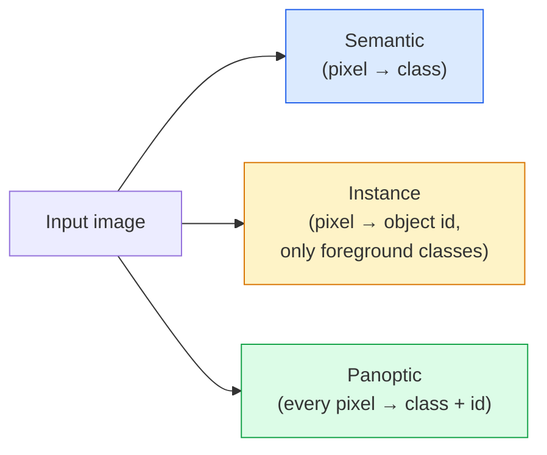
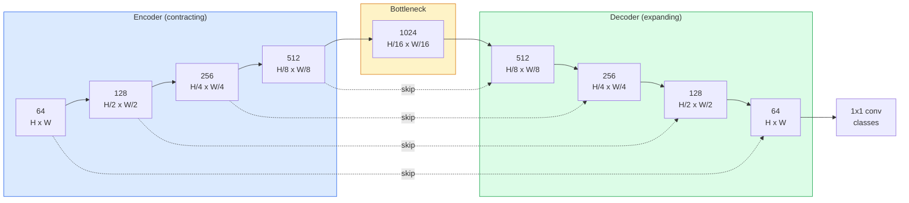

# 语义分割——U-Net

> 分割即是对每个像素进行分类。U-Net通过将下采样编码器与上采样解码器配对，并在二者之间建立跳接通道，从而实现这一目标。

**类型：** 构建
**语言：** Python
**先修知识：** 第4阶段第03课（卷积神经网络），第4阶段第04课（图像分类）
**耗时：** 约75分钟

## 学习目标

- 区分语义分割、实例分割与全景分割，并为特定问题选择合适的任务类型  
- 使用 PyTorch 从零构建 U-Net，包含编码器模块、瓶颈层、带有转置卷积的解码器以及跳跃连接  
- 实现像素级交叉熵损失、Dice 损失，以及目前医学和工业图像分割领域默认采用的组合损失函数  
- 查看各类别的 IoU 和 Dice 指标，判断低分是源于小目标召回率问题、边界精度问题还是类别不平衡问题

## 问题所在

分类任务为每张图像输出一个标签。检测任务为每张图像输出若干个框。分割任务则为每个像素输出一个标签。对于尺寸为 `H x W` 的输入，其输出张量的形状分别为 `H x W`（语义分割）或 `H x W x N_instances`（实例分割）。这意味着每张图像会产生数百万个预测结果，而非仅一个。

正是由于这种结构特性，分割技术几乎被应用于所有需要密集预测的视觉系统中：医学影像（肿瘤掩膜）、自动驾驶（道路、车道、障碍物识别）、卫星图像（建筑物轮廓、农作物边界）、文档解析（版面区域划分）以及机器人技术（可抓取区域检测）。这些任务仅靠为物体框定范围是无法解决的，它们需要精确的轮廓信息。

该架构问题表述简单，但解决起来却十分困难：网络必须同时具备理解图像全局上下文的能力（这是何种场景）以及捕捉局部像素细节的能力（到底是哪个像素属于道路还是路面）。传统的卷积神经网络为了获取上下文信息会进行空间压缩，从而导致细节丢失。而 U-Net 正是那种能够同时兼顾这两点的设计方案。

## 概念概述

### 语义级 vs 实例级 vs 全景级



- **语义分割**的思路是“这个像素代表道路，那个像素代表汽车”。相邻的两辆汽车会被合并为一个整体。
- **实例分割**的思路是“这个像素代表第3辆汽车，那个像素代表第5辆汽车”。它会忽略背景元素（即天空、道路、草地等）。
- **全景分割**则结合了两者：每个像素都会被赋予一个类别标签，每个实例都会获得唯一的ID，同时实现背景与物体的分割。

本课将讲解语义分割。下一课（Mask R-CNN）将介绍实例分割。

### U-Net 结构



编码器将空间分辨率降低四倍，同时使通道数翻倍。解码器则执行相反的操作：将空间分辨率提升四倍，同时使通道数减半。跳跃连接在每个分辨率层级上都将对应的编码器特征与解码器特征进行拼接。最终的 1x1 卷积层在全分辨率下将特征从 `64` 映射到 `num_classes`。

为何需要跳跃连接：当解码器试图输出像素级预测时，它所看到的仅是低分辨率的特征图。若没有跳跃连接，它便无法准确定位边缘，因为这些信息已在编码器阶段被压缩丢失。跳跃连接为解码器提供了编码器在向下处理过程中计算出的高分辨率特征图。

### 转置上采样与双线性上采样

解码器需要扩展空间维度。有两种可选方案：

- **转置卷积**（`nn.ConvTranspose2d`）——可学习的上采样方法。曾是 U-Net 的默认选择。若步长与核大小无法整除，可能会产生棋盘格状的伪影。
- **双线性上采样 + 3x3 卷积**——先进行平滑上采样，再执行卷积操作。产生的伪影更少，参数也更少，现为现代项目的默认选择。

这两种方法在实际应用中都很常见。对于初次实现 U-Net 的项目，使用双线性上采样更为稳妥。

### 像素网格上的交叉熵

对于具有 C 个类别的语义分割任务，模型输出为 `(N, C, H, W)`。目标标签则为包含整数类 ID 的 `(N, H, W)` 形式。交叉熵损失函数与分类任务相同，只是需要在每个空间位置分别计算：

```
Loss = mean over (n, h, w) of -log( softmax(logits[n, :, h, w])[target[n, h, w]] )
```

PyTorch 中的 `F.cross_entropy` 函数可直接处理该形状的数据，无需进行重塑操作。

### 骰子损失函数及其应用必要性

交叉熵损失对每个像素一视同仁。当某一类别在图像中占绝对优势时（如医学影像中背景占比99%，肿瘤仅占1%），这种处理方式是错误的。此时，网络只需在所有位置预测为背景即可达到99%的准确率，但实际上毫无用处。

Dice损失通过直接优化预测掩码与真实掩码之间的重叠度来解决这一问题：

```
Dice(p, y) = 2 * sum(p * y) / (sum(p) + sum(y) + epsilon)
Dice_loss = 1 - Dice
```

其中，`p` 是某一类别的 Sigmoid/Softmax 概率图，`y` 是二值真实标签掩码。仅当两者完全重叠时，损失值为零。由于该损失函数基于比率计算，因此类别不平衡问题无关紧要。

在实际应用中，应使用**组合损失函数**：

```
L = L_cross_entropy + lambda * L_dice       (lambda ~ 1)
```

交叉熵在训练初期能够提供稳定的梯度；而Dice损失则使训练过程更注重让结果与掩码形状完全匹配。这种组合是医学影像领域的默认选择，在任何类别不平衡的数据集上都具有难以超越的性能。

### 评估指标

- **像素精度** — 预测正确的像素所占百分比。成本较低，但在数据不平衡情况下会与分类任务中的精度问题一样出现失效。
- **各类别的 IoU 值** — 每个类别掩码的交并比；所有类别的平均值即为 mIoU。
- **Dice 系数（基于像素的 F1 分数）** — 与 IoU 类似，计算公式为 `Dice = 2 * IoU / (1 + IoU)`。医学影像领域更倾向于使用 Dice 系数，而自动驾驶领域则更常用 IoU；二者呈单调相关关系。
- **边界 F1 分数** — 用于衡量预测边界与真实边界的接近程度，即使是很小的偏移也会被惩罚。在半导体检测等对精度要求极高的任务中非常重要。

应报告各类别的 IoU 值而不仅仅是 mIoU。如果其他九个类别的 IoU 均为 85%，而某个类别仅为 15%，平均 IoU 值会掩盖这一差异。

### 输入分辨率的权衡取舍

U-Net的编码器会将分辨率降低四倍，因此输入尺寸必须能被16整除。医学图像的常见尺寸为512×512或1024×1024，而自动驾驶相关图像的尺寸则为2048×1024。U-Net的内存消耗与`H * W * C_max`成正比，在1024×1024的分辨率下，若使用1024通道作为瓶颈层，单次前向传播就会占用数GB的VRAM。

两种常见的解决方案如下：
1. 对输入图像进行分块处理——将图像分割为256×256大小的块，并通过重叠方式进行处理后再拼接起来。
2. 用扩张卷积替代瓶颈层，这样既能保持较高的空间分辨率，又能扩大感受野（如DeepLab系列模型）。

对于首个模型而言，使用256×256尺寸的输入以及64通道基底的U-Net，在8GB的VRAM上即可顺利完成训练。

## 构建它

### 步骤 1：编码器模块

两个 3x3 卷积层，每个层后均接批量归一化层和ReLU激活函数。第一个卷积层用于改变通道数；第二个卷积层则保持通道数不变。

```python
import torch
import torch.nn as nn
import torch.nn.functional as F

class DoubleConv(nn.Module):
    def __init__(self, in_c, out_c):
        super().__init__()
        self.net = nn.Sequential(
            nn.Conv2d(in_c, out_c, kernel_size=3, padding=1, bias=False),
            nn.BatchNorm2d(out_c),
            nn.ReLU(inplace=True),
            nn.Conv2d(out_c, out_c, kernel_size=3, padding=1, bias=False),
            nn.BatchNorm2d(out_c),
            nn.ReLU(inplace=True),
        )

    def forward(self, x):
        return self.net(x)
```

该模块在各个地方都会被重复使用。此处设置 `bias=False`，是因为 Batch Normalization 的 beta 参数已负责处理偏置项。

### 步骤 2：向下与向上块操作

```python
class Down(nn.Module):
    def __init__(self, in_c, out_c):
        super().__init__()
        self.net = nn.Sequential(
            nn.MaxPool2d(2),
            DoubleConv(in_c, out_c),
        )

    def forward(self, x):
        return self.net(x)


class Up(nn.Module):
    def __init__(self, in_c, out_c):
        super().__init__()
        self.up = nn.Upsample(scale_factor=2, mode="bilinear", align_corners=False)
        self.conv = DoubleConv(in_c, out_c)

    def forward(self, x, skip):
        x = self.up(x)
        if x.shape[-2:] != skip.shape[-2:]:
            x = F.interpolate(x, size=skip.shape[-2:], mode="bilinear", align_corners=False)
        x = torch.cat([skip, x], dim=1)
        return self.conv(x)
```

仅基于空间维度的形状检查（`shape[-2:]`）用于处理维度无法被 16 整除的输入；安全的 `F.interpolate` 方法会在拼接之前对张量进行对齐。若直接比较完整形状，则通道数差异也会触发检查，这种情况应当引发明显的错误提示，而非默默执行插值操作。

### 步骤 3：U-Net 网络

```python
class UNet(nn.Module):
    def __init__(self, in_channels=3, num_classes=2, base=64):
        super().__init__()
        self.inc = DoubleConv(in_channels, base)
        self.d1 = Down(base, base * 2)
        self.d2 = Down(base * 2, base * 4)
        self.d3 = Down(base * 4, base * 8)
        self.d4 = Down(base * 8, base * 16)
        self.u1 = Up(base * 16 + base * 8, base * 8)
        self.u2 = Up(base * 8 + base * 4, base * 4)
        self.u3 = Up(base * 4 + base * 2, base * 2)
        self.u4 = Up(base * 2 + base, base)
        self.outc = nn.Conv2d(base, num_classes, kernel_size=1)

    def forward(self, x):
        x1 = self.inc(x)
        x2 = self.d1(x1)
        x3 = self.d2(x2)
        x4 = self.d3(x3)
        x5 = self.d4(x4)
        x = self.u1(x5, x4)
        x = self.u2(x, x3)
        x = self.u3(x, x2)
        x = self.u4(x, x1)
        return self.outc(x)

net = UNet(in_channels=3, num_classes=2, base=32)
x = torch.randn(1, 3, 256, 256)
print(f"output: {net(x).shape}")
print(f"params: {sum(p.numel() for p in net.parameters()):,}")
```

输出形状为 `(1, 2, 256, 256)`——与输入的空间尺寸相同，包含 `num_classes` 个通道。当 `base=32` 时，模型参数量约为 770 万。

### 第 4 步：损失函数

```python
def dice_loss(logits, targets, num_classes, eps=1e-6):
    probs = F.softmax(logits, dim=1)
    targets_one_hot = F.one_hot(targets, num_classes).permute(0, 3, 1, 2).float()
    dims = (0, 2, 3)
    intersection = (probs * targets_one_hot).sum(dim=dims)
    denom = probs.sum(dim=dims) + targets_one_hot.sum(dim=dims)
    dice = (2 * intersection + eps) / (denom + eps)
    return 1 - dice.mean()


def combined_loss(logits, targets, num_classes, lam=1.0):
    ce = F.cross_entropy(logits, targets)
    dc = dice_loss(logits, targets, num_classes)
    return ce + lam * dc, {"ce": ce.item(), "dice": dc.item()}
```

首先针对每个类别计算 Dice 值，随后取平均值（即宏观 Dice 值）。参数 `eps` 用于避免在批次中不存在的类别导致除零错误。

### 步骤 5：IoU 指标

```python
@torch.no_grad()
def iou_per_class(logits, targets, num_classes):
    preds = logits.argmax(dim=1)
    ious = torch.zeros(num_classes)
    for c in range(num_classes):
        pred_c = (preds == c)
        true_c = (targets == c)
        inter = (pred_c & true_c).sum().float()
        union = (pred_c | true_c).sum().float()
        ious[c] = (inter / union) if union > 0 else torch.tensor(float("nan"))
    return ious
```

返回一个长度为 C 的向量。`nan` 表示批次中不存在的类别——在计算 mIoU 时无需对这类数据进行平均。

### 步骤 6：用于端到端验证的合成数据集

在彩色背景上生成形状，迫使网络学习形状本身而非像素颜色。

```python
import numpy as np
from torch.utils.data import Dataset, DataLoader

def synthetic_segmentation(num_samples=200, size=64, seed=0):
    rng = np.random.default_rng(seed)
    images = np.zeros((num_samples, size, size, 3), dtype=np.float32)
    masks = np.zeros((num_samples, size, size), dtype=np.int64)
    for i in range(num_samples):
        bg = rng.uniform(0, 1, (3,))
        images[i] = bg
        masks[i] = 0
        num_shapes = rng.integers(1, 4)
        for _ in range(num_shapes):
            cls = int(rng.integers(1, 3))
            color = rng.uniform(0, 1, (3,))
            cx, cy = rng.integers(10, size - 10, size=2)
            r = int(rng.integers(4, 12))
            yy, xx = np.meshgrid(np.arange(size), np.arange(size), indexing="ij")
            if cls == 1:
                mask = (xx - cx) ** 2 + (yy - cy) ** 2 < r ** 2
            else:
                mask = (np.abs(xx - cx) < r) & (np.abs(yy - cy) < r)
            images[i][mask] = color
            masks[i][mask] = cls
        images[i] += rng.normal(0, 0.02, images[i].shape)
        images[i] = np.clip(images[i], 0, 1)
    return images, masks


class SegDataset(Dataset):
    def __init__(self, images, masks):
        self.images = images
        self.masks = masks

    def __len__(self):
        return len(self.images)

    def __getitem__(self, i):
        img = torch.from_numpy(self.images[i]).permute(2, 0, 1).float()
        mask = torch.from_numpy(self.masks[i]).long()
        return img, mask
```

三种类别：背景（0）、圆形（1）、正方形（2）。网络必须学会区分这些形状。

### 步骤 7：训练循环

```python
def train_one_epoch(model, loader, optimizer, device, num_classes):
    model.train()
    loss_sum, total = 0.0, 0
    iou_sum = torch.zeros(num_classes)
    for x, y in loader:
        x, y = x.to(device), y.to(device)
        logits = model(x)
        loss, _ = combined_loss(logits, y, num_classes)
        optimizer.zero_grad()
        loss.backward()
        optimizer.step()
        loss_sum += loss.item() * x.size(0)
        total += x.size(0)
        iou_sum += iou_per_class(logits, y, num_classes).nan_to_num(0)
    return loss_sum / total, iou_sum / len(loader)
```

在合成数据集上运行该代码，训练 10 到 30 个 epoch，观察形状类别的 mIoU 值如何上升至 0.9 以上。请注意，`nan_to_num(0)` 函数会将批次中不存在的类别视为零；若需获得精确的各类别 IoU 值，应在评估时根据类别是否存在进行掩码处理，并使用 `torch.nanmean` 对所有批次进行计算，而非在此处直接求平均。

## 使用它

在生产环境中，`segmentation_models_pytorch`（简称“smp”）会将任何基于 torchvision 或 timm 的骨干网络与各类标准分割架构进行封装。共三行代码：

```python
import segmentation_models_pytorch as smp

model = smp.Unet(
    encoder_name="resnet34",
    encoder_weights="imagenet",
    in_channels=3,
    classes=3,
)
```

实际工作中同样值得了解的模型包括：
- **DeepLabV3+**：用扩张卷积替代基于最大池化的下采样方式，从而保持瓶颈层的分辨率；在卫星图像和驾驶数据上的边界检测速度更快。
- **SegFormer**：用分层Transformer替换传统卷积编码器；在众多基准测试中均达到当前最先进水平。
- **Mask2Former** / **OneFormer**：在单一架构中整合了语义分割、实例分割与全景分割功能。

这三款模型均可直接替换 `smp` 或 `transformers` 库中的对应组件，且可使用相同的数据加载器。

## 发布它

本课程将生成以下内容：

- `outputs/prompt-segmentation-task-picker.md` — 一个用于在语义分割、实例分割和全景分割之间进行选择的提示词，并能指定对应任务的架构。
- `outputs/skill-segmentation-mask-inspector.md` — 一种能够报告类别分布、预测掩码统计信息，以及预测不足或边界模糊的类别的工具。

## 练习题

1. **（简单）** 实现用于二值分割任务（前景与背景区分）的 `bce_dice_loss` 函数。在合成双类别数据集上验证：当前景像素占比为 5% 时，该组合损失函数的收敛速度应快于单独使用 BCE 损失函数。
2. **（中等）** 将原有的 `nn.Upsample + conv` 上采样结构替换为 `nn.ConvTranspose2d` 上采样结构。在相同合成数据集上对两种结构进行训练，并比较 mIoU 值。观察使用转置卷积版本时出现的棋盘格状伪影。
3. **（困难）** 选取一个真实的分割数据集（如 Oxford-IIIT Pets、Cityscapes 的子集或医学影像数据），将 U-Net 模型训练至其 IoU 值与 `smp.Unet` 参考模型的差距在 2 点以内。需报告各类别的 IoU 值，并分析哪些类别从在损失函数中加入 Dice 损失中获益最大。

## 关键术语

| 术语 | 常见说法 | 实际含义 |
|------|----------|----------|
| 语义分割 | “给每个像素都标注标签” | 对每个像素进行 C 类分类；同一类别的实例会被合并 |
| 实例分割 | “给每个物体都标注标签” | 将同一类别的不同实例分开；仅关注前景对象 |
| 全景分割 | “语义分割 + 实例分割” | 每个像素都有对应的类别标签；每个物体实例还有唯一的 ID |
| 跳接连接 | “U-Net 的桥梁结构” | 将编码器的特征与解码器中相同分辨率的特征进行拼接；可保留高频细节 |
| 反转卷积 | “反卷积操作” | 可学习的上采样方法；可能会产生棋盘格状的伪影 |
| Dice 损失 | “重叠损失” | 1 - 2|A ∩ B| / (|A| + |B|)；直接优化掩码的重叠程度，且对类别不平衡具有鲁棒性 |
| mIoU | “平均交并比” | 各类别 IoU 的平均值；是分割任务领域的标准评估指标 |
| 边界 F1 分数 | “边界精确度” | 仅基于边界像素计算的 F1 分数；在对精度要求极高的任务中非常重要 |

## 延伸阅读

- [U-Net：用于生物医学图像分割的卷积网络（Ronneberger 等人，2015）](https://arxiv.org/abs/1505.04597) —— 原始论文；大家常引用的图表位于第 2 页
- [全卷积网络（Long 等人，2015）](https://arxiv.org/abs/1411.4038) —— 首次将图像分割问题转化为端到端卷积问题的论文
- [segmentation_models_pytorch](https://github.com/qubvel/segmentation_models.pytorch) —— 生产环境图像分割的参考项目；包含所有标准架构及所有标准损失函数
- [从训练最先进的分割模型中获得的经验（kaggle.com 竞赛）](https://www.kaggle.com/code/iafoss/carvana-unet-pytorch) —— 详细解析在真实数据集中为何需要 TTA、伪标签机制以及类别权重
