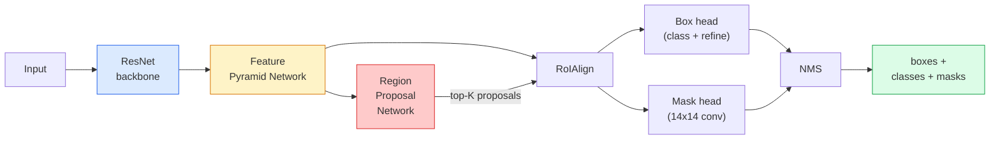

# 实例分割——Mask R-CNN

> 只需在 Faster R-CNN 检测器中添加一个简单的掩码分支，即可实现实例分割功能。其中最棘手的环节是 RoIAlign，其难度远超表面看上去的那样。

**类型：** 构建 + 学习
**语言：** Python
**先修知识：** 第 4 阶段第 06 课（YOLO）、第 4 阶段第 07 课（U-Net）
**耗时：** 约 75 分钟

## 学习目标

- 从头到尾追踪 Mask R-CNN 的架构：主干网络、FPN、RPN、RoIAlign、框检测头以及掩码生成头
- 从零实现 RoIAlign，并解释为何不再使用 RoIPool
- 使用 torchvision 中预训练的 `maskrcnn_resnet50_fpn_v2` 模型生成符合生产标准的实例掩码，并正确解析其输出格式
- 通过替换框检测头和掩码生成头，同时冻结主干网络，在小型自定义数据集上对 Mask R-CNN 进行微调

## 问题所在

语义分割会为每个类别生成一个掩码。而实例分割则能为每个对象生成独立的掩码，即便这些对象属于同一类别也不例外。统计个体数量、跨帧进行目标跟踪以及测量特定对象（如墙面上每块砖的边界框、显微镜图像中的每个细胞）等任务，都需要依赖实例分割技术。

Mask R-CNN（He等人，2017年）通过将实例分割重构为“检测+掩码”的模式解决了这一问题。其设计极为精巧，在随后的五年里，几乎所有关于实例分割的论文都是Mask R-CNN的变体；至今，对于中小规模数据集而言，torchvision库中的实现仍是业界的标准选择。

其中最棘手的工程难题在于采样：如何从一个顶点并不与像素边界对齐的候选框中裁剪出固定大小的特征区域？若处理不当，会导致mAP分数下降数十分之一。RoIAlign正是为解决这一问题而设计的。

## 概念概述

### 架构设计



需要理解的五个核心组件：

1. **骨干网络** — 在 ImageNet 数据集上训练的 ResNet-50 或 ResNet-101。它以 4、8、16、32 的步长生成一系列特征图。
2. **FPN（特征金字塔网络）** — 通过自上而下的路径与横向连接，为每个层级提供 C 个通道的高语义密度特征。检测模块会查询与目标大小相匹配的 FPN 层级。
3. **RPN（区域提议网络）** — 一个小型卷积层，在每个锚点位置预测“此处是否存在目标？”以及“如何优化边界框？”。每张图像可生成约 1000 个候选区域。
4. **RoIAlign** — 从任意 FPN 层级的任意边界框中采样固定大小（例如 7x7）的特征块。采用双线性采样方式，不进行量化处理。
5. **输出头** — 包含一个两层结构的边界框优化与类别选择模块，以及一个小型卷积层，用于为每个候选区域生成 `28x28` 大小的二值掩码。

### 为何选择 RoIAlign 而非 RoIPool

原始的 Fast R-CNN 使用了 RoIPool 技术，该技术会将候选框分割成网格，取每个单元格中的最大特征值，并将所有坐标四舍五入为整数。这种四舍五入操作会导致特征图与输入像素坐标的对齐偏差达到一个完整的特征图像素——在 224x224 的图像上这一偏差较小，但当特征图的步长为 32 时则会造成灾难性的后果。

```
RoIPool:
  box (34.7, 51.3, 98.2, 142.9)
  round -> (34, 51, 98, 142)
  split grid -> round each cell boundary
  misalignment accumulates at every step

RoIAlign:
  box (34.7, 51.3, 98.2, 142.9)
  sample at exact float coordinates using bilinear interpolation
  no rounding anywhere
```

RoIAlign 能够免费将 COCO 数据集上的掩码平均精度提升 3-4 个百分点。目前所有注重目标定位的检测器都在使用它，包括 YOLOv7 seg、RT-DETR、Mask2Former 等。

### RPN即后缀表达式，是一种运算符位于操作数之后的数学表示法。

在特征图的每个位置，放置K个大小和形状各异的锚框。为每个锚框预测一个物体存在概率分数，以及用于将锚框调整成更贴合实际物体的回归偏移量。根据得分保留排名靠前的约1,000个框，在IoU值为0.7时应用NMS算法，最终将筛选后的框传递给各特征分支进行处理。RPN通过专用的小型损失函数进行训练——其结构与第6课中的YOLO损失函数相同，仅包含两类类别（物体/无物体）。

### 掩膜头

在每个候选区域（经过 RoIAlign 处理后），掩码头实际上是一个小型全连接卷积网络：包含四个 3x3 的卷积层、一个 2x 的反卷积层，以及最后一个 1x1 的卷积层，该层会在 `28x28` 的分辨率下生成 `num_classes` 个输出通道。系统仅保留与预测类别对应的通道，其余通道则被忽略。这种设计实现了掩码预测与分类功能的解耦。

随后将尺寸为 28x28 的掩码上采样至该候选区域原有的像素大小，从而得到最终的二值掩码。

### 损失值

Mask R-CNN 由四种损失函数相加构成：

```
L = L_rpn_cls + L_rpn_box + L_box_cls + L_box_reg + L_mask
```

- `L_rpn_cls`, `L_rpn_box` — 用于 RPN 候选框的物体检测损失与边界框回归损失。
- `L_box_cls` — 在分类头上对（C+1）个类别（包括背景）计算的交叉熵损失。
- `L_box_reg` — 对分类头的边界框细化结果施加平滑 L1 损失。
- `L_mask` — 对 28x28 大小的掩码输出值进行逐像素二进制交叉熵计算。

每种损失函数均有默认权重；在 torchvision 实现中，这些权重通过构造函数参数进行设置。

### 输出格式

`torchvision.models.detection.maskrcnn_resnet50_fpn_v2` 会返回一个字典列表，每个元素对应一张图像：

```
{
    "boxes":  (N, 4) in (x1, y1, x2, y2) pixel coordinates,
    "labels": (N,) class IDs, 0 = background so indices are 1-based,
    "scores": (N,) confidence scores,
    "masks":  (N, 1, H, W) float masks in [0, 1] — threshold at 0.5 for binary,
}
```

该掩码已为全图像分辨率。28×28大小的头部输出已在内部进行上采样处理。

## 构建它

### 步骤 1：从零实现 RoIAlign

在 Mask R-CNN 的各个组件中，这一部分用代码表示比用文字描述更易于理解。

```python
import torch
import torch.nn.functional as F

def roi_align_single(feature, box, output_size=7, spatial_scale=1 / 16.0):
    """
    feature: (C, H, W) single-image feature map
    box: (x1, y1, x2, y2) in original image pixel coordinates
    output_size: side of the output grid (7 for box head, 14 for mask head)
    spatial_scale: reciprocal of the feature map stride
    """
    C, H, W = feature.shape
    x1, y1, x2, y2 = [c * spatial_scale - 0.5 for c in box]
    bin_w = (x2 - x1) / output_size
    bin_h = (y2 - y1) / output_size

    grid_y = torch.linspace(y1 + bin_h / 2, y2 - bin_h / 2, output_size)
    grid_x = torch.linspace(x1 + bin_w / 2, x2 - bin_w / 2, output_size)
    yy, xx = torch.meshgrid(grid_y, grid_x, indexing="ij")

    gx = 2 * (xx + 0.5) / W - 1
    gy = 2 * (yy + 0.5) / H - 1
    grid = torch.stack([gx, gy], dim=-1).unsqueeze(0)
    sampled = F.grid_sample(feature.unsqueeze(0), grid, mode="bilinear",
                            align_corners=False)
    return sampled.squeeze(0)
```

每个数值都位于双线性采样的位置。不存在四舍五入、量化或梯度丢失的情况。

### 步骤 2：与 torchvision 的 RoIAlign 进行比较

```python
from torchvision.ops import roi_align

feature = torch.randn(1, 16, 50, 50)
boxes = torch.tensor([[0, 10, 20, 100, 90]], dtype=torch.float32)  # (batch_idx, x1, y1, x2, y2)

ours = roi_align_single(feature[0], boxes[0, 1:].tolist(), output_size=7, spatial_scale=1/4)
theirs = roi_align(feature, boxes, output_size=(7, 7), spatial_scale=1/4, sampling_ratio=1, aligned=True)[0]

print(f"shape ours:   {tuple(ours.shape)}")
print(f"shape theirs: {tuple(theirs.shape)}")
print(f"max|diff|:    {(ours - theirs).abs().max().item():.3e}")
```

当 `sampling_ratio=1` 且 `aligned=True` 时，两者的匹配度在 `1e-5` 以内。

### 步骤 3：加载预训练的 Mask R-CNN 模型

```python
import torch
from torchvision.models.detection import maskrcnn_resnet50_fpn_v2, MaskRCNN_ResNet50_FPN_V2_Weights

model = maskrcnn_resnet50_fpn_v2(weights=MaskRCNN_ResNet50_FPN_V2_Weights.DEFAULT)
model.eval()
print(f"params: {sum(p.numel() for p in model.parameters()):,}")
print(f"classes (including background): {len(model.roi_heads.box_predictor.cls_score.out_features * [0])}")
```

参数量为4600万，包含91个类别（基于COCO数据集）。第一个类别（ID为0）代表背景；模型实际检测到的所有对象均从ID 1开始。

### 步骤 4：运行推理

```python
with torch.no_grad():
    x = torch.randn(3, 400, 600)
    predictions = model([x])
p = predictions[0]
print(f"boxes:  {tuple(p['boxes'].shape)}")
print(f"labels: {tuple(p['labels'].shape)}")
print(f"scores: {tuple(p['scores'].shape)}")
print(f"masks:  {tuple(p['masks'].shape)}")
```

掩码张量的形状为 `(N, 1, H, W)`。设定阈值为 0.5，即可为每个对象生成二值掩码：

```python
binary_masks = (p['masks'] > 0.5).squeeze(1)  # (N, H, W) boolean
```

### 步骤 5：将头部替换为自定义的类计数器

常见的微调方案：复用主干网络、FPN和RPN结构，仅替换两个分类头。

```python
from torchvision.models.detection.faster_rcnn import FastRCNNPredictor
from torchvision.models.detection.mask_rcnn import MaskRCNNPredictor

def build_custom_maskrcnn(num_classes):
    model = maskrcnn_resnet50_fpn_v2(weights=MaskRCNN_ResNet50_FPN_V2_Weights.DEFAULT)
    in_features = model.roi_heads.box_predictor.cls_score.in_features
    model.roi_heads.box_predictor = FastRCNNPredictor(in_features, num_classes)
    in_features_mask = model.roi_heads.mask_predictor.conv5_mask.in_channels
    hidden_layer = 256
    model.roi_heads.mask_predictor = MaskRCNNPredictor(in_features_mask, hidden_layer, num_classes)
    return model

custom = build_custom_maskrcnn(num_classes=5)
print(f"custom cls_score.out_features: {custom.roi_heads.box_predictor.cls_score.out_features}")
```

`num_classes` 必须包含背景类别，因此包含 4 种物体类别的数据集应使用 `num_classes=5`。

### 步骤 6：冻结无需训练的组件

在小型数据集上，冻结主干网络和FPN。仅让RPN的物体检测与回归模块以及两个输出头进行训练。

```python
def freeze_backbone_and_fpn(model):
    # torchvision Mask R-CNN packs the FPN inside `model.backbone` (as
    # `model.backbone.fpn`), so iterating `model.backbone.parameters()` covers
    # both the ResNet feature layers and the FPN lateral/output convs.
    for p in model.backbone.parameters():
        p.requires_grad = False
    return model

custom = freeze_backbone_and_fpn(custom)
trainable = sum(p.numel() for p in custom.parameters() if p.requires_grad)
print(f"trainable after freeze: {trainable:,}")
```

在包含 500 张图像的数据集上，这就是模型收敛与过拟合之间的区别。

## 使用它

在 torchvision 中，Mask R-CNN 的完整训练循环共有 40 行代码，且在不同任务之间无需进行实质性修改——只需更换数据集即可继续运行。

```python
def train_step(model, images, targets, optimizer):
    model.train()
    loss_dict = model(images, targets)
    losses = sum(loss for loss in loss_dict.values())
    optimizer.zero_grad()
    losses.backward()
    optimizer.step()
    return {k: v.item() for k, v in loss_dict.items()}
```

`targets` 列表中必须包含针对每张图像的字典，这些字典需包含 `boxes`、`labels` 和 `masks`（形式为 `(num_instances, H, W)` 的二进制张量）。在训练过程中，模型会返回一个包含四种损失值的字典；而在评估阶段，则会根据 `model.training` 的值返回预测结果列表。

`pycocotools` 评估工具能够分别计算 boxes 和 masks 在 mAP@IoU=0.5:0.95 指标下的数值；只有获取到这两个数值，才能判断是 boxes 处理模块还是 masks 处理模块存在瓶颈。

## 发布它

本课程将生成以下内容：

- `outputs/prompt-instance-vs-semantic-router.md` — 一个包含三个问题的提示词，用于确定应从实例路由、语义路由还是全景路由以及具体的模型开始。
- `outputs/skill-mask-rcnn-head-swapper.md` — 一种技能，能够根据新的 `num_classes` 值，生成用于在任意 torchvision 检测模型上交换头部结构的10行代码。

## 练习题

1. **（简单）** 随机选取100个检测框，使用`torchvision.ops.roi_align`函数与自己的RoIAlign实现进行对比验证。输出两者之间的最大绝对差异值。同时运行RoIPool算法（采用2017年之前的行为模式），并观察在靠近边界区域的检测框上，其结果与RoIAlign相比是否存在约1-2个特征图像素的偏差。
2. **（中等）** 使用包含50张图片的自定义数据集对`maskrcnn_resnet50_fpn_v2`模型进行微调（数据集中需包含任意两种类别，例如气球、鱼、坑洞或标志）。冻结模型的主干网络结构，训练20个周期后，输出掩码检测在AP@0.5指标下的性能值。
3. **（困难）** 将Mask R-CNN中的掩码预测头从原本的28×28分辨率更改为56×56分辨率的版本。分别在修改前后计算mAP@IoU=0.75的指标值，并解释为何该指标的提升（或无提升）符合预期的边界精度与内存占用之间的权衡关系。

## 关键术语

| 术语 | 常见说法 | 实际含义 |
|------|----------|----------|
| Mask R-CNN | “检测加掩码” | Faster R-CNN 加上一个小型 FCN 头，用于为每个候选框的每个类别预测一个 28x28 的掩码 |
| FPN | “特征金字塔” | 通过自上而下与横向连接的方式，为每个步长层级提供包含丰富语义信息的 C 通道特征 |
| RPN | “区域提议网络” | 一个小型卷积头，每张图像可生成约 1000 个物体/无物体候选框 |
| RoIAlign | “无需四舍五入的裁剪” | 从任意浮点坐标框中双线性采样固定大小的特征网格 |
| RoIPool | “2017 年之前的裁剪方式” | 功能与 RoIAlign 相同，但会对框坐标进行四舍五入；现已过时 |
| Mask AP | “实例 mAP” | 使用掩码 IoU 而非框 IoU 计算的平均精度；即 COCO 实例分割任务的评估指标 |
| Binary mask head | “按类别生成的掩码” | 为每个候选框的每个类别预测一个二值掩码；仅保留对应类别的通道信息 |
| Background class | “类别 0” | 用于表示“无物体”的通用类别；实际类别的索引从 1 开始 |

## 延伸阅读

- [Mask R-CNN (He 等人，2017)](https://arxiv.org/abs/1703.06870) — 相关论文；其中关于 RoIAlign 的第 3 节内容是重点阅读部分  
- [FPN：特征金字塔网络 (Lin 等人，2017)](https://arxiv.org/abs/1612.03144) — FPN 相关论文；所有现代检测器均采用该技术  
- [torchvision Mask R-CNN 教程](https://pytorch.org/tutorials/intermediate/torchvision_tutorial.html) — 微调流程的参考资料  
- [Detectron2 模型库](https://github.com/facebookresearch/detectron2/blob/main/MODEL_ZOO.md) — 包含几乎所有检测与分割变体及其训练后权重的生产级实现
