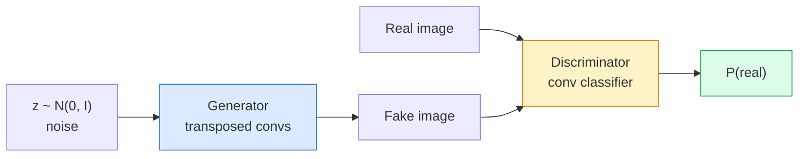
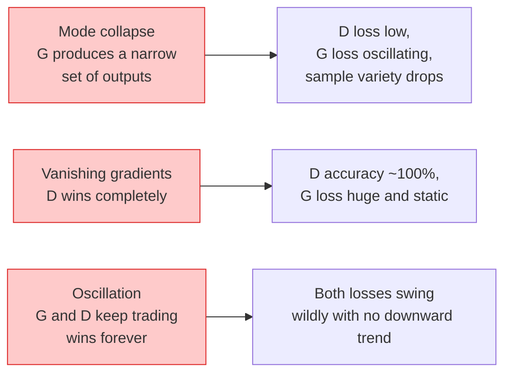

# 图像生成——GANs

> GAN 实质上是固定博弈中的两个神经网络。其中一个负责生成图像，另一个则负责评估质量。两者相互配合不断优化，直至生成的图像能够骗过评估器。

**类型：** 构建
**语言：** Python
**先修知识：** 第 4 阶段第 03 课（CNN）、第 3 阶段第 06 课（优化器）、第 3 阶段第 07 课（正则化）
**耗时：** 约 75 分钟

## 学习目标

- 解释生成器与判别器之间的极小极大博弈，以及为何其均衡状态对应于 p_model = p_data  
- 使用 PyTorch 实现一个 DCGAN，并在 60 行代码以内生成连贯的 32x32 合成图像  
- 运用三种标准技巧稳定 GAN 训练：非饱和损失函数、谱范数以及 TTUR（双尺度更新规则）  
- 解读训练曲线，从而区分正常收敛与模式崩溃、振荡以及判别器完全占优的情况

## 问题所在

分类任务旨在训练网络将图像映射到对应的标签。而生成任务则反向处理这一问题：生成看起来源自同一概率分布的新图像。这里并不存在可供对比的“正确”输出，只有需要模仿的概率分布。

标准的损失函数（如 MSE、交叉熵）无法判断“该样本是否来自真实的概率分布”。仅通过最小化逐像素误差只能得到模糊的平均结果，而非逼真的样本。突破性的思路在于引入专门的损失函数：训练第二个网络来区分真实与虚假图像，并利用其判断结果来引导生成器的工作。

GAN（Goodfellow 等人，2014 年）确立了这一框架。到 2018 年，StyleGAN 已能生成 1024x1024 像素的面部图像，其质量与真实照片几乎无法区分。尽管扩散模型在质量和可控性方面已占据优势，但所有让扩散模型得以实用化的技巧——如归一化策略、潜在空间设计以及特征损失函数——最初都是在 GAN 中被理解的。

## 概念概述

### 这两个网络



**生成器** G 接收一个噪声向量 `z`，并输出一张图像。**判别器** D 接收一张图像，输出一个标量值：即该图像为真实的概率。

### 游戏

G 希望 D 是错误的。D 希望自己是正确的。形式化表达为：

```
min_G max_D  E_x[log D(x)] + E_z[log(1 - D(G(z)))]
```

从右向左阅读：D 的目标是最大化在真实图像（`log D(real)`）和伪造图像（`log (1 - D(fake))`）上的准确率。G 的目标则是最小化 D 在伪造图像上的准确率——它希望 `D(G(z))` 的值尽可能高。

Goodfellow 证明了该极小极大问题存在一个全局均衡状态，在该状态下 `p_G = p_data`，D 在所有位置的输出均为 0.5，且生成分布与真实分布之间的 Jensen-Shannon 散度为零。难点在于如何达到这一状态。

### 非饱和损失函数

上述公式在数值上存在不稳定性。在训练初期，对于每一个伪造样本而言，`D(G(z))` 的值都接近于零，因此 `log(1 - D(G(z)))` 对于 G 来说梯度趋近于零。解决方法：反转 G 的损失函数。

```
L_D = -E_x[log D(x)] - E_z[log(1 - D(G(z)))]
L_G = -E_z[log D(G(z))]                          # non-saturating
```

当 `D(G(z))` 接近零时，G 的损失值会很大，且其梯度具有较高的信息量。所有现代 GAN 都采用这种变体进行训练。

### DCGAN 架构规范

Radford、Metz 和 Chintala（2015）将多年失败的实验总结为五条使 GAN 训练更加稳定的规则：

1. 在两个网络中均用步长卷积替代池化操作。
2. 在生成器和判别器中都使用批量归一化，但 G 的输出层和 D 的输入层除外。
3. 从更深层的架构中移除全连接层。
4. G 的所有层（输出层除外）均使用 ReLU 激活函数；若输出范围需控制在 [-1, 1] 内，则使用 tanh 激活函数。
5. D 的所有层均使用 LeakyReLU 激活函数，其负斜率为 0.2。

目前所有的现代基于卷积的 GAN（如 StyleGAN、BigGAN、GigaGAN）都是从这些规则出发，逐步替换部分组件来实现的。

### 故障模式及其特征标识



- **模式崩溃**：生成器 G 找到一张能够欺骗判别器 D 的图像并仅生成该图像。解决方案：加入小批量区分机制、谱范数或标签条件化。
- **判别器占优**：判别器 D 过快变得过于强大，导致生成器的梯度消失。解决方案：减小 D 的规模、降低 D 的学习率，或对真实标签应用标签平滑处理。
- **振荡现象**：两个网络交替占据优势，始终无法达到平衡状态。解决方案：采用 TTUR 算法（使判别器 D 的学习速度比生成器 G 快 2-4 倍），或改用 Wasserstein 损失函数。

### 评估

GAN 没有真实标签，那么如何判断它们是否正常工作呢？

- **样本检查**——在每个训练轮次结束时查看 64 个样本。这是必须执行的步骤。
- **FID（Fréchet Inception Distance）**——衡量真实数据集与生成数据集的 Inception-v3 特征分布之间的距离。数值越小越好，是行业通用标准。
- **Inception Score**——较为老旧且稳定性较差，建议优先使用 FID。
- **生成模型的精确度/召回率**——分别评估模型的质量（精确度）和覆盖范围（召回率）。相比单独使用 FID，能提供更多信息。

对于小型合成数据测试，样本检查即可满足需求。

## 构建它

### 步骤 1：生成器

一个小型 DCGAN 生成器，输入 64 维噪声并输出 32×32 的图像。

```python
import torch
import torch.nn as nn

class Generator(nn.Module):
    def __init__(self, z_dim=64, img_channels=3, feat=64):
        super().__init__()
        self.net = nn.Sequential(
            nn.ConvTranspose2d(z_dim, feat * 4, kernel_size=4, stride=1, padding=0, bias=False),
            nn.BatchNorm2d(feat * 4),
            nn.ReLU(inplace=True),
            nn.ConvTranspose2d(feat * 4, feat * 2, kernel_size=4, stride=2, padding=1, bias=False),
            nn.BatchNorm2d(feat * 2),
            nn.ReLU(inplace=True),
            nn.ConvTranspose2d(feat * 2, feat, kernel_size=4, stride=2, padding=1, bias=False),
            nn.BatchNorm2d(feat),
            nn.ReLU(inplace=True),
            nn.ConvTranspose2d(feat, img_channels, kernel_size=4, stride=2, padding=1, bias=False),
            nn.Tanh(),
        )

    def forward(self, z):
        return self.net(z.view(z.size(0), -1, 1, 1))
```

四个转置卷积层，每个层的参数均为 `kernel_size=4, stride=2, padding=1`，以此实现空间尺寸的精确翻倍。通过 tanh 函数将输出激活值限制在 [-1, 1] 范围内。

### 步骤 2：判别器

生成器的镜像层。包含 LeakyReLU 激活函数与步长卷积操作，最终输出一个标量逻辑值。

```python
class Discriminator(nn.Module):
    def __init__(self, img_channels=3, feat=64):
        super().__init__()
        self.net = nn.Sequential(
            nn.Conv2d(img_channels, feat, kernel_size=4, stride=2, padding=1),
            nn.LeakyReLU(0.2, inplace=True),
            nn.Conv2d(feat, feat * 2, kernel_size=4, stride=2, padding=1, bias=False),
            nn.BatchNorm2d(feat * 2),
            nn.LeakyReLU(0.2, inplace=True),
            nn.Conv2d(feat * 2, feat * 4, kernel_size=4, stride=2, padding=1, bias=False),
            nn.BatchNorm2d(feat * 4),
            nn.LeakyReLU(0.2, inplace=True),
            nn.Conv2d(feat * 4, 1, kernel_size=4, stride=1, padding=0),
        )

    def forward(self, x):
        return self.net(x).view(-1)
```

最后一个卷积层将 `4x4` 的特征图降维为 `1x1`。每张图像的输出为一个标量值；仅在损失计算时应用sigmoid函数。

### 步骤 3：训练阶段

备选方案：在每个批次中，先更新一次 D，然后再更新一次 G。

```python
import torch.nn.functional as F

def train_step(G, D, real, z, opt_g, opt_d, device):
    real = real.to(device)
    bs = real.size(0)

    # D step
    opt_d.zero_grad()
    d_real = D(real)
    d_fake = D(G(z).detach())
    loss_d = (F.binary_cross_entropy_with_logits(d_real, torch.ones_like(d_real))
              + F.binary_cross_entropy_with_logits(d_fake, torch.zeros_like(d_fake)))
    loss_d.backward()
    opt_d.step()

    # G step
    opt_g.zero_grad()
    d_fake = D(G(z))
    loss_g = F.binary_cross_entropy_with_logits(d_fake, torch.ones_like(d_fake))
    loss_g.backward()
    opt_g.step()

    return loss_d.item(), loss_g.item()
```

在 D 步骤中调用 `G(z).detach()` 非常重要：我们不希望在其更新过程中有梯度流入 G。忽略这一点是初学者常见的典型错误。

### 第 4 步：在合成形状上执行完整训练循环

```python
from torch.utils.data import DataLoader, TensorDataset
import numpy as np

def synthetic_images(num=2000, size=32, seed=0):
    rng = np.random.default_rng(seed)
    imgs = np.zeros((num, 3, size, size), dtype=np.float32) - 1.0
    for i in range(num):
        r = rng.uniform(6, 12)
        cx, cy = rng.uniform(r, size - r, size=2)
        yy, xx = np.meshgrid(np.arange(size), np.arange(size), indexing="ij")
        mask = (xx - cx) ** 2 + (yy - cy) ** 2 < r ** 2
        color = rng.uniform(-0.5, 1.0, size=3)
        for c in range(3):
            imgs[i, c][mask] = color[c]
    return torch.from_numpy(imgs)

device = "cuda" if torch.cuda.is_available() else "cpu"
data = synthetic_images()
loader = DataLoader(TensorDataset(data), batch_size=64, shuffle=True)

G = Generator(z_dim=64, img_channels=3, feat=32).to(device)
D = Discriminator(img_channels=3, feat=32).to(device)
opt_g = torch.optim.Adam(G.parameters(), lr=2e-4, betas=(0.5, 0.999))
opt_d = torch.optim.Adam(D.parameters(), lr=2e-4, betas=(0.5, 0.999))

for epoch in range(10):
    for (batch,) in loader:
        z = torch.randn(batch.size(0), 64, device=device)
        ld, lg = train_step(G, D, batch, z, opt_g, opt_d, device)
    print(f"epoch {epoch}  D {ld:.3f}  G {lg:.3f}")
```

`Adam(lr=2e-4, betas=(0.5, 0.999))` 是 DCGAN 的默认参数——较低的 beta1 值可防止动量项过度稳定对抗过程。

### 步骤 5：采样

```python
@torch.no_grad()
def sample(G, n=16, z_dim=64, device="cpu"):
    G.eval()
    z = torch.randn(n, z_dim, device=device)
    imgs = G(z)
    imgs = (imgs + 1) / 2
    return imgs.clamp(0, 1)
```

在采样之前，务必先切换到评估模式。对于 DCGAN 来说这一点尤为重要，因为此时会使用批归一化的运行统计量而非该批次的实际统计量。

### 步骤 6：谱归一化

用于替换鉴别器中 BN 模块的替代组件，可确保网络具有 1-Lipschitz 连续性。能够解决大多数“判别器过于强势”的问题。

```python
from torch.nn.utils import spectral_norm

def build_sn_discriminator(img_channels=3, feat=64):
    return nn.Sequential(
        spectral_norm(nn.Conv2d(img_channels, feat, 4, 2, 1)),
        nn.LeakyReLU(0.2, inplace=True),
        spectral_norm(nn.Conv2d(feat, feat * 2, 4, 2, 1)),
        nn.LeakyReLU(0.2, inplace=True),
        spectral_norm(nn.Conv2d(feat * 2, feat * 4, 4, 2, 1)),
        nn.LeakyReLU(0.2, inplace=True),
        spectral_norm(nn.Conv2d(feat * 4, 1, 4, 1, 0)),
    )
```

将 `Discriminator` 替换为 `build_sn_discriminator()`，通常就无需使用 TTUR 技巧了。谱范数是你可以采用的最为简单且有效的鲁棒性提升方法。

## 使用它

对于高精度生成任务，建议使用预训练权重或转而采用扩散模型。以下是两个常用的标准库：

- `torch_fidelity` 可直接在您的生成器上计算 FID / IS 指标，无需编写自定义的评估代码。
- `pytorch-gan-zoo`（已过时）与 `StudioGAN` 提供了经过测试的 DCGAN、WGAN-GP、SN-GAN、StyleGAN 以及 BigGAN 实现。

截至 2026 年，GAN 模型依然是以下场景的最佳选择：实时图像生成（延迟 <10 ms）、风格迁移，以及需要精确控制的图像到图像转换任务（如 Pix2Pix、CycleGAN）。而在照片级真实度与文本条件控制方面，扩散模型则更具优势。

## 发布它

本课程将生成以下内容：

- `outputs/prompt-gan-training-triage.md` — 一个提示词，用于读取训练曲线描述并识别故障模式（模式崩溃、D-wins、振荡），同时给出唯一的推荐修复方案。
- `outputs/skill-dcgan-scaffold.md` — 一项技能，可根据 `z_dim`、目标 `image_size` 和 `num_channels` 参数生成 DCGAN 框架，其中包含训练循环与样本保存功能。

## 练习题

1. **（简单）** 使用合成圆形数据集训练上述的 DCGAN，并在每个训练轮次结束时保存 16 个样本的网格图。生成图像在哪个训练轮次后能明显呈现为圆形？
2. **（中等）** 将判别器的批量归一化替换为谱归一化。同时训练这两种版本，哪种收敛速度更快？在三种不同的随机种子下，哪种版本的方差更低？
3. **（困难）** 实现一个条件 DCGAN：将类别标签输入到生成器 G 和判别器 D 中（在 G 中将 one-hot 编码与噪声拼接，在 D 中添加一个类别嵌入通道）。使用第 7 课中的合成“圆形 vs 正方形”数据集进行训练，并通过使用特定标签采样来证明类别条件作用的有效性。

## 关键术语

| 术语 | 通俗说法 | 实际含义 |
|------|----------|----------|
| 生成器 (G) | “生成内容的网络” | 将噪声映射为图像；经过训练以欺骗判别器 |
| 判别器 (D) | “评估器” | 二分类器；经过训练以区分真实图像与生成的图像 |
| 极小极大博弈 | “游戏机制” | 对 G 取极小值，对 D 取极大值，形成对抗损失函数；平衡状态为 p_G = p_data |
| 非饱和损失 | “数值上更稳定的版本” | 生成器的损失函数为 -log(D(G(z))) 而非 log(1 - D(G(z)))，以避免训练初期梯度消失 |
| 模式崩溃 | “生成器只生成单一类型内容” | 生成器仅能生成数据分布中的极小子集；可通过 SN、小批量判别或增大批次大小来解决 |
| TTUR | “双学习率策略” | 判别器的学习速度比生成器快，通常快2-4倍；有助于稳定训练过程 |
| 谱范数 | “1-Lipschitz 层” | 一种权重归一化方法，用于限制每层的 Lipschitz 常数；防止判别器变得过于陡峭 |
| FID | “Fréchet Inception 距离” | 真实数据集与生成数据集的 Inception-v3 特征分布之间的距离；是标准的评估指标 |

## 延伸阅读

- [生成对抗网络（Goodfellow 等人，2014）](https://arxiv.org/abs/1406.2661) —— 所有研究的起点论文  
- [DCGAN（Radford、Metz、Chintala，2015）](https://arxiv.org/abs/1511.06434) —— 使 GAN 可以被训练的架构规则  
- [GAN 的谱归一化方法（Miyato 等人，2018）](https://arxiv.org/abs/1802.05957) —— 最实用且有效的稳定性优化技巧  
- [StyleGAN3（Karras 等人，2021）](https://arxiv.org/abs/2106.12423) —— 当前最先进的 GAN 模型；堪称过去十年所有相关技术的精华集锦
