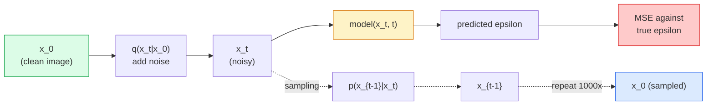

# 图像生成——扩散模型

> 扩散模型通过学习来去除噪声。训练该模型从含噪图像中逐步移除少量噪声，反向重复这一过程一千次，即可得到一个图像生成器。

**类型：** 构建
**语言：** Python
**先修知识：** 第4阶段第07课（U-Net）、第1阶段第06课（概率论）、第3阶段第06课（优化器）
**耗时：** 约75分钟

## 学习目标

- 推导前向加噪过程 `x_0 -> x_1 -> ... -> x_T`，并解释为何闭式解 `q(x_t | x_0)` 对任意 t 均成立。
- 实现一种 DDPM 风格的训练目标，用于回归每一步添加的噪声；同时实现一个从纯噪声逐步生成图像的采样器。
- 构建一个带时间条件的 U-Net（大小需足够小以便在 CPU 上训练），用于预测任意时间步的噪声值。
- 解释 DDPM 与 DDIM 采样方法的区别，以及何时使用其中一种方法（第 23 课将深入讲解流匹配与修正流）。

## 问题所在

GANs支持一次性生成：输入噪声，输出图像，仅需一次前向传播即可完成。这类模型训练速度快，但难度极高。而扩散模型则采用迭代方式生成：从纯噪声开始，通过逐步去噪最终形成图像。虽然训练速度较慢，但其训练难度较低。在过去的五年中，后者的优势日益明显：任何小型团队都能训练出扩散模型并获得质量尚可的样本；相比之下，GAN训练则是一门需要多年反复尝试才能掌握的技艺。

除了训练稳定性之外，扩散模型的迭代结构正是实现所有现代图像生成功能的关键：文本条件控制、图像修复、图像编辑、超分辨率处理以及可控风格化。在采样循环的每一步中，都可以注入新的约束条件。正因如此，Stable Diffusion、Imagen、DALL-E 3、Midjourney以及所有其他可控图像模型都基于扩散模型技术。

本课程将构建最基础的DDPM模型：包括前向去噪过程、后向去噪过程以及训练循环。下一课（Stable Diffusion）则会将该模型与VAE、文本编码器以及无分类器引导机制结合，形成一个完整的实际应用系统。

## 概念概述

### 正向处理流程

取一张图像 `x_0`。向其添加少量高斯噪声得到 `x_1`，再继续添加少量噪声得到 `x_2`。如此重复进行 T 步，直到 `x_T` 几乎无法与纯高斯噪声区分开来。

```
q(x_t | x_{t-1}) = N(x_t; sqrt(1 - beta_t) * x_{t-1},  beta_t * I)
```

`beta_t` 是一种较小的方差调度方案，通常在 T=1000 步的时间内从 0.0001 线性递增至 0.02。每一步都会略微减弱信号强度，并注入新的噪声。

### 封闭形式的跳变

逐步添加噪声属于马尔可夫链，但其数学模型更为简洁：只需一步即可直接从 `x_0` 采样得到 `x_t`。

```
Define alpha_t = 1 - beta_t
Define alpha_bar_t = prod_{s=1..t} alpha_s

Then:
  q(x_t | x_0) = N(x_t; sqrt(alpha_bar_t) * x_0,  (1 - alpha_bar_t) * I)

Equivalently:
  x_t = sqrt(alpha_bar_t) * x_0 + sqrt(1 - alpha_bar_t) * epsilon
  where epsilon ~ N(0, I)
```

正是这个方程使得扩散模型具备实际应用价值。在训练过程中，只需随机选取一个`t`值，直接从`x_0`中采样得到`x_t`，即可完成单步训练——无需对整个马尔可夫链进行模拟。

### 反向处理流程

前向过程是固定的。反向过程 `p(x_{t-1} | x_t)` 则是由神经网络学习的目标。扩散模型并不直接预测 `x_{t-1}`，而是预测在步骤 t 中添加的噪声 `epsilon`，随后通过数学推导得出 `x_{t-1}` 的值。



### 训练损失

在每个训练步骤中：

1. 抽样一张真实图像 `x_0`。
2. 从 [1, T] 范围内均匀随机抽取时间步长 `t`。
3. 抽样噪声 `epsilon ~ N(0, I)`。
4. 计算 `x_t = sqrt(alpha_bar_t) * x_0 + sqrt(1 - alpha_bar_t) * epsilon`。
5. 使用神经网络预测 `epsilon_theta(x_t, t)` 的值。
6. 最小化 `|| epsilon - epsilon_theta(x_t, t) ||^2`。

仅此而已。神经网络将学会预测任意时间步长下的噪声。损失函数为均方误差（MSE）。该过程中不存在对抗博弈、崩溃或振荡现象。

### 采样器（DDPM）

生成方法：从 `x_T ~ N(0, I)` 开始，逐次向后退一步。

```
for t = T, T-1, ..., 1:
    eps = model(x_t, t)
    x_{t-1} = (1 / sqrt(alpha_t)) * (x_t - (beta_t / sqrt(1 - alpha_bar_t)) * eps) + sqrt(beta_t) * z
    where z ~ N(0, I) if t > 1, else 0
return x_0
```

关键在于，尽管通常反向条件无法以封闭形式表示，但对于这种特定的高斯前向过程而言却是可以求解的。那些外观复杂的系数正是贝叶斯定理所给出的结果。

### 为何是 1000 步

前向噪声调度经过精心设计，确保每一步添加的噪声量恰好足够，从而使反向步骤近似服从高斯分布。若步数过少，反向步骤将严重偏离高斯分布，网络难以对其进行有效建模；而步数过多则会导致采样成本上升，且收益逐渐递减。DDPM 的默认设置为线性调度下的 T=1000。

### DDIM：采样速度提升20倍

训练过程保持不变，只有采样方式有所差异。DDIM（Song 等人，2020）定义了一种确定性反向流程，能够在不重新训练的情况下跳过某些时间步。使用 DDIM 进行 50 步采样即可获得接近 DDPM 1000 步采样的质量。所有生产系统均采用 DDIM 或其更高效的变体（如 DPM-Solver、Euler Ancestral）。

### 时间条件控制

网络 `epsilon_theta(x_t, t)` 需要知晓当前正在对哪个时间步进行去噪处理。现代扩散模型通过正弦时间嵌入的方式注入时间信息 `t`（其原理与 Transformer 中的位置编码类似），这些时间嵌入会被添加到 U-Net 各层的特征图中。

```
t_embedding = sinusoidal(t)
feature_map += MLP(t_embedding)
```

在没有时间条件约束的情况下，网络必须从图像本身推断噪声水平，这种方法虽然可行，但样本效率要低得多。

## 构建它

### 步骤 1：噪声调度

```python
import torch

def linear_beta_schedule(T=1000, beta_start=1e-4, beta_end=2e-2):
    return torch.linspace(beta_start, beta_end, T)


def precompute_schedule(betas):
    alphas = 1.0 - betas
    alphas_cumprod = torch.cumprod(alphas, dim=0)
    return {
        "betas": betas,
        "alphas": alphas,
        "alphas_cumprod": alphas_cumprod,
        "sqrt_alphas_cumprod": torch.sqrt(alphas_cumprod),
        "sqrt_one_minus_alphas_cumprod": torch.sqrt(1.0 - alphas_cumprod),
        "sqrt_recip_alphas": torch.sqrt(1.0 / alphas),
    }

schedule = precompute_schedule(linear_beta_schedule(T=1000))
```

预先计算一次，在训练和采样时按索引进行收集。

### 步骤 2：前向扩散（q_sample）

```python
def q_sample(x0, t, noise, schedule):
    sqrt_a = schedule["sqrt_alphas_cumprod"][t].view(-1, 1, 1, 1)
    sqrt_one_minus_a = schedule["sqrt_one_minus_alphas_cumprod"][t].view(-1, 1, 1, 1)
    return sqrt_a * x0 + sqrt_one_minus_a * noise
```

单行封闭形式。`t` 表示时间步批次，即批次中每张图像对应一个时间步。

### 步骤 3：一个小型时间条件 U-Net 模型

```python
import torch.nn as nn
import torch.nn.functional as F
import math

def timestep_embedding(t, dim=64):
    half = dim // 2
    freqs = torch.exp(-math.log(10000) * torch.arange(half, device=t.device) / half)
    args = t[:, None].float() * freqs[None]
    emb = torch.cat([args.sin(), args.cos()], dim=-1)
    return emb


class TinyUNet(nn.Module):
    def __init__(self, img_channels=3, base=32, t_dim=64):
        super().__init__()
        self.t_mlp = nn.Sequential(
            nn.Linear(t_dim, base * 4),
            nn.SiLU(),
            nn.Linear(base * 4, base * 4),
        )
        self.t_dim = t_dim
        self.enc1 = nn.Conv2d(img_channels, base, 3, padding=1)
        self.enc2 = nn.Conv2d(base, base * 2, 4, stride=2, padding=1)
        self.mid = nn.Conv2d(base * 2, base * 2, 3, padding=1)
        self.dec1 = nn.ConvTranspose2d(base * 2, base, 4, stride=2, padding=1)
        self.dec2 = nn.Conv2d(base * 2, img_channels, 3, padding=1)
        self.time_proj = nn.Linear(base * 4, base * 2)

    def forward(self, x, t):
        t_emb = timestep_embedding(t, self.t_dim)
        t_emb = self.t_mlp(t_emb)
        t_proj = self.time_proj(t_emb)[:, :, None, None]

        h1 = F.silu(self.enc1(x))
        h2 = F.silu(self.enc2(h1)) + t_proj
        h3 = F.silu(self.mid(h2))
        d1 = F.silu(self.dec1(h3))
        d2 = torch.cat([d1, h1], dim=1)
        return self.dec2(d2)
```

在瓶颈层注入时间条件信息的双层U-Net结构。针对真实图像，可进一步增加网络的深度与宽度。

### 第 4 步：训练循环

```python
def train_step(model, x0, schedule, optimizer, device, T=1000):
    model.train()
    x0 = x0.to(device)
    bs = x0.size(0)
    t = torch.randint(0, T, (bs,), device=device)
    noise = torch.randn_like(x0)
    x_t = q_sample(x0, t, noise, schedule)
    pred = model(x_t, t)
    loss = F.mse_loss(pred, noise)
    optimizer.zero_grad()
    loss.backward()
    optimizer.step()
    return loss.item()
```

这就是整个训练循环。没有 GAN 对抗机制，也没有专门的损失函数，仅需调用一次 MSE 即可。

### 第 5 步：采样器（DDPM）

```python
@torch.no_grad()
def sample(model, schedule, shape, T=1000, device="cpu"):
    model.eval()
    x = torch.randn(shape, device=device)
    betas = schedule["betas"].to(device)
    sqrt_one_minus_a = schedule["sqrt_one_minus_alphas_cumprod"].to(device)
    sqrt_recip_alphas = schedule["sqrt_recip_alphas"].to(device)

    for t in reversed(range(T)):
        t_batch = torch.full((shape[0],), t, dtype=torch.long, device=device)
        eps = model(x, t_batch)
        coef = betas[t] / sqrt_one_minus_a[t]
        mean = sqrt_recip_alphas[t] * (x - coef * eps)
        if t > 0:
            x = mean + torch.sqrt(betas[t]) * torch.randn_like(x)
        else:
            x = mean
    return x
```

进行1000次前向传播以生成一批样本。在实际代码中，应将其替换为DDIM 50步采样器。

### 步骤 6：DDIM 采样器（确定性算法，速度约快 20 倍）

```python
@torch.no_grad()
def sample_ddim(model, schedule, shape, steps=50, T=1000, device="cpu", eta=0.0):
    model.eval()
    x = torch.randn(shape, device=device)
    alphas_cumprod = schedule["alphas_cumprod"].to(device)

    ts = torch.linspace(T - 1, 0, steps + 1).long()
    for i in range(steps):
        t = ts[i]
        t_prev = ts[i + 1]
        t_batch = torch.full((shape[0],), t, dtype=torch.long, device=device)
        eps = model(x, t_batch)
        a_t = alphas_cumprod[t]
        a_prev = alphas_cumprod[t_prev] if t_prev >= 0 else torch.tensor(1.0, device=device)
        x0_pred = (x - torch.sqrt(1 - a_t) * eps) / torch.sqrt(a_t)
        sigma = eta * torch.sqrt((1 - a_prev) / (1 - a_t) * (1 - a_t / a_prev))
        dir_xt = torch.sqrt(1 - a_prev - sigma ** 2) * eps
        noise = sigma * torch.randn_like(x) if eta > 0 else 0
        x = torch.sqrt(a_prev) * x0_pred + dir_xt + noise
    return x
```

`eta=0` 时模型具有完全确定性（相同的噪声输入始终产生相同的输出）。`eta=1` 时可恢复为 DDPM 模型。

## 使用它

在正式生产环境中，请使用 `diffusers`：

```python
from diffusers import DDPMScheduler, UNet2DModel

unet = UNet2DModel(sample_size=32, in_channels=3, out_channels=3, layers_per_block=2)
scheduler = DDPMScheduler(num_train_timesteps=1000)
```

该库提供了现成的调度器（DDPM、DDIM、DPM-Solver、Euler、Heun）、可配置的U-Nets、文本到图像及图像到图像的流水线，以及LoRA微调辅助工具。

在研究领域中，`k-diffusion`（Katherine Crowson开发）拥有最贴近原实现的参考代码以及最佳的采样变体。

## 发布它

本课程将生成以下内容：

- `outputs/prompt-diffusion-sampler-picker.md` — 一个提示词生成工具，可根据质量目标、延迟预算以及条件类型来选择 DDPM / DDIM / DPM-Solver / Euler 等采样器。
- `outputs/skill-noise-schedule-designer.md` — 一种功能模块，能够根据时间 T 和目标噪声水平生成线性、余弦或 S 形的贝塔调度表，并输出随时间变化的信噪比诊断图表。

## 练习题

1. **(简单)** 可视化前向过程：选取一张图像，并在 `t in [0, 100, 250, 500, 750, 1000]` 的范围内绘制 `x_t` 曲线。验证 `x_1000` 是否呈现为纯粹的高斯噪声。
2. **(中等)** 在合成圆数据集上训练 TinyUNet 20 个周期，然后采样出 16 个圆形图像。对比 DDPM（1000 步）与 DDIM（50 步）的采样结果——使用相同的噪声种子时，它们生成的图像是否相似？
3. **(困难)** 实现余弦噪声调度算法（Nichol & Dhariwal, 2021）：`alpha_bar_t = cos^2((t/T + s) / (1 + s) * pi / 2)`。使用线性调度与余弦调度分别训练同一模型，并证明在步数较少的情况下，余弦调度能生成更优质的样本。

## 关键术语

| 术语 | 通俗说法 | 实际含义 |
|------|----------|----------|
| 正向过程 | “随时间添加噪声” | 一种固定马尔可夫链，会在 T 步内将图像逐步破坏为高斯噪声 |
| 反向过程 | “逐步去噪” | 一种经过学习的分布，用于从噪声反向推导出原始图像 |
| Epsilon 预测 | “预测噪声” | 训练目标：`epsilon_theta(x_t, t)` 用于预测第 t 步添加的噪声量 |
| Beta 调度 | “噪声强度” | 由 T 个较小的方差值构成的序列，决定了每步进入系统的噪声量 |
| alpha_bar_t | “累积保留因子” | 到时间 t 为止所有 (1 - beta_s) 的乘积；t 值越大，剩余的信号越少 |
| DDPM 采样器 | “基于祖先的随机采样” | 从条件高斯分布中逐个采样 x_{t-1}，通常需要 1000 步 |
| DDIM 采样器 | “确定性快速采样” | 将采样过程重写为确定性的常微分方程；仅需 20-100 步即可获得相近质量的结果 |
| 时间条件化 | “告知模型当前是第几步” | 将时间 t 的正弦嵌入值注入 U-Net，使其能够知晓当前的噪声水平 |

## 延伸阅读

- [去噪扩散概率模型（Ho 等人，2020）](https://arxiv.org/abs/2006.11239) —— 使扩散模型得以实际应用并在 FID 指标上超越 GAN 的论文  
- [改进型 DDPM（Nichol & Dhariwal，2021）](https://arxiv.org/abs/2102.09672) —— 余弦调度与 v 参数化技术  
- [DDIM（Song, Meng, Ermon，2020）](https://arxiv.org/abs/2010.02502) —— 实现实时推理的确定性采样器  
- [解析扩散模型的设计空间（Karras 等人，2022）](https://arxiv.org/abs/2206.00364) —— 对所有扩散模型设计选项的统一阐述；当前最权威的参考资料
