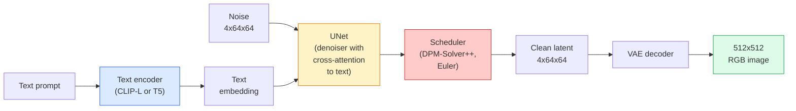

# Stable Diffusion — 架构与微调

> Stable Diffusion 是一种在预训练 VAE 的潜在空间中运行的 DDPM 模型，它通过交叉注意力机制依据文本条件进行生成，利用高效的确定性常微分方程求解器进行采样，并通过无分类器引导技术来控制生成过程。

**类型：** 学习 + 实践
**语言：** Python
**先修知识：** 第 4 阶段第 10 课（扩散模型），第 7 阶段第 02 课（自注意力机制）
**时长：** 约 75 分钟

## 学习目标

- 梳理 Stable Diffusion 流水线的五个核心组件：VAE、文本编码器、U-Net、调度器以及安全检查器，并说明每个组件的具体功能
- 解释潜在空间扩散技术，以及为何在 4x64x64 的潜在空间中进行训练（而非使用 3x512x512 的图像空间）能够在不损失质量的前提下将计算量降低 48 倍
- 使用 `diffusers` 库生成图像，实现图像到图像的转换、图像修复以及基于 ControlNet 的图像生成
- 利用 LoRA 技术在小型自定义数据集上对 Stable Diffusion 进行微调，并在推理阶段加载该 LoRA 适配器

## 问题所在

直接在 512x512 RGB 图像上训练 DDPM 需要极高的计算成本。每个训练步骤都需要通过一个 U-Net 进行反向传播，该网络会处理 3x512x512 = 786,432 个输入值；而采样过程则需要在同一个 U-Net 上进行 50 次以上的正向传播。要达到 Stable Diffusion 1.5（2022 年发布）的质量水平，像素空间扩散模型在消费级 GPU 上大约需要 256 GPU月级的训练时间，且每张图像的生成时间约为 10 到 30 秒。

让开源文本到图像模型得以实际应用的技巧就是**潜在空间扩散**（Rombach 等人，CVPR 2022）。首先训练一个 VAE，将 3x512x512 的图像映射为 4x64x64 的潜在张量，然后再反向映射回来，随后在該潜在空间中进行扩散运算。计算量可降低至 `(3*512*512)/(4*64*64) = 48 倍`。这样一来，在同一台 GPU 上，采样时间可从数十秒缩短到两秒以内。

几乎所有现代的图像生成模型——SDXL、SD3、FLUX、HunyuanDiT、Wan-Video——都属于潜在空间扩散模型，只是在自编码器结构、去噪模块（U-Net 或 DiT）以及文本条件处理方面存在不同设计。掌握了 Stable Diffusion，就相当于掌握了这类模型的通用框架。

## 概念概述

### 流水线



- **VAE** — 冻结式自编码器。编码器将图像转换为潜在向量（用于图像到图像生成及训练），解码器则将这些潜在向量转换回图像。
- **文本编码器** — CLIP 文本编码器（SD 1.x/2.x）、CLIP-L + CLIP-G（SDXL）或 T5-XXL（SD3/FLUX）。用于生成一系列令牌嵌入。
- **U-Net** — 去噪模块。其包含交叉注意力层，可在每个分辨率层级上将潜在向量与文本嵌入进行关联。
- **调度器** — 采样算法（DDIM、Euler、DPM-Solver++）。负责选择参数 sigma，并将预测的噪声混合回潜在向量中。
- **安全检查器** — 可选的功能，用于对输出图像进行不当内容或非法内容的过滤。

### 无分类器引导（CFG）

纯文本条件化会为每个提示词 `c` 学习函数 `epsilon_theta(x_t, t, c)`。条件生成模型则通过在 10% 的情况下省略 `c`（并用空嵌入替代），对同一网络进行训练，从而得到一个能够同时预测条件噪声与无条件噪声的单一模型。在推理阶段：

```
eps = eps_uncond + w * (eps_cond - eps_uncond)
```

`w` 即为引导系数。`w=0` 表示无条件生成，`w=1` 为普通条件生成，而 `w>1` 会以牺牲多样性为代价，使输出更倾向于“依据提示词生成”。SD 的默认值为 `w=7.5`。

CFG 是实现文本到图像高质量生成的关键因素。没有它时，提示词对输出的影响较弱；有了它之后，提示词则能完全主导生成结果。

### 潜在空间几何结构

VAE 的 4 通道潜在空间并非单纯的压缩图像，而是一个流形结构。在该流形中，算术运算大致对应于语义编辑操作（提示工程与插值均在此处发挥作用），且扩散 U-Net 已被训练为将全部的建模资源投入其中。对随机的 4x64x64 大小的潜在向量进行解码不会生成看似随机的图像——反而会得到无意义的数据，因为只有特定子流形中的潜在向量才能解码为有效图像。

由此产生两个后果：

1. **Img2img**：将图像编码为潜在向量，加入部分噪声后运行去噪器，最后再进行解码。由于编码过程近乎可逆，图像的结构得以保留；而内容则会根据输入的提示发生改变。
2. **Inpainting**：与 Img2img 的流程相同，但去噪器仅更新被遮盖的区域，未被遮盖的区域则保持为编码后的潜在向量状态。

### U-Net 架构

SD U-Net 是第 10 课中 TinyUNet 的扩展版本，增加了三项功能：

- 在每个空间分辨率处均加入**Transformer 块**，该块包含用于处理文本嵌入的自注意力机制与交叉注意力机制。
- 通过基于正弦编码的 MLP 实现**时间嵌入**。
- 在分辨率匹配的情况下，在编码器与解码器之间设置**跳接连接**。

SD 1.5 的参数总量约为 8.6 亿，SDXL 约为 26 亿，FLUX 约为 120 亿。参数量的大幅增长主要源于注意力层。

### LoRA 微调

对 Stable Diffusion 进行全量微调需要 20 GB 以上的显存，并会更新 8.6 亿个参数。LoRA（低秩适配）技术则保持基础模型不变，仅在注意力层中注入小型秩分解矩阵。用于 SD 的 LoRA 适配器通常大小在 10 MB 到 50 MB 之间，在单块消费级 GPU 上的训练时间约为 10 分钟到 60 分钟，且在推理时可直接作为即插即用的模块加载使用。

```
Original: W_q : (d_in, d_out)   frozen
LoRA:     W_q + alpha * (A @ B)   where A : (d_in, r), B : (r, d_out)

r is typically 4-32.
```

LoRA 是目前几乎所有社区进行模型微调时所采用的标准方式。CivitAI 和 Hugging Face 上托管着数以百万计的 LoRA 模型。

### 你将看到的调度器

- **DDIM** — 确定性算法，约50步，实现简单。
- **Euler ancestral** — 随机性算法，30-50步，生成的样本更具创造性。
- **DPM-Solver++ 2M Karras** — 确定性算法，20-30步，为生产环境默认选择。
- **LCM / TCD / Turbo** — 一致性模型及其简化版本；仅需1-4步即可生成结果，但质量会有所下降。

更换调度器只需在 `diffusers` 中进行一行修改，有时无需重新训练即可解决样本问题。

## 构建它

本课将直接使用 `diffusers` 库进行端到端操作，而非从头开始构建 Stable Diffusion。那些需要自行实现的组件（如 VAE、文本编码器、U-Net 以及调度器）属于其他课程的内容；本课的重点是熟练运用现成的 API。

### 步骤 1：文本转图像

```python
import torch
from diffusers import StableDiffusionPipeline

pipe = StableDiffusionPipeline.from_pretrained(
    "runwayml/stable-diffusion-v1-5",
    torch_dtype=torch.float16,
).to("cuda")

image = pipe(
    prompt="a dog riding a skateboard in tokyo, studio ghibli style",
    guidance_scale=7.5,
    num_inference_steps=25,
    generator=torch.Generator("cuda").manual_seed(42),
).images[0]
image.save("dog.png")
```

`float16` 编码可将显存占用减少一半，且不会造成明显的质量损失。在默认的 DPM-Solver++ 算法下，`num_inference_steps=25` 的效果与使用 DDIM 算法时 `num_inference_steps=50` 的效果相当。

### 步骤 2：更换调度器

```python
from diffusers import DPMSolverMultistepScheduler, EulerAncestralDiscreteScheduler

pipe.scheduler = DPMSolverMultistepScheduler.from_config(pipe.scheduler.config)
pipe.scheduler = EulerAncestralDiscreteScheduler.from_config(pipe.scheduler.config)
```

调度器状态与 U-Net 权重是解耦的。你可以使用 DDPM 进行训练，并搭配任意调度器进行采样。

### 步骤 3：图像到图像转换

```python
from diffusers import StableDiffusionImg2ImgPipeline
from PIL import Image

img2img = StableDiffusionImg2ImgPipeline.from_pretrained(
    "runwayml/stable-diffusion-v1-5",
    torch_dtype=torch.float16,
).to("cuda")

init_image = Image.open("dog.png").convert("RGB").resize((512, 512))
out = img2img(
    prompt="a dog riding a skateboard, oil painting",
    image=init_image,
    strength=0.6,
    guidance_scale=7.5,
).images[0]
```

`strength` 表示在去噪前添加的噪声量（0.0 = 不做更改，1.0 = 完全重建）。对于风格迁移任务，0.5-0.7 是标准范围。

### 第 4 步：局部修复

```python
from diffusers import StableDiffusionInpaintPipeline

inpaint = StableDiffusionInpaintPipeline.from_pretrained(
    "runwayml/stable-diffusion-inpainting",
    torch_dtype=torch.float16,
).to("cuda")

image = Image.open("dog.png").convert("RGB").resize((512, 512))
mask = Image.open("dog_mask.png").convert("L").resize((512, 512))

out = inpaint(
    prompt="a cat",
    image=image,
    mask_image=mask,
    guidance_scale=7.5,
).images[0]
```

掩膜中的白色像素为需要重新生成的区域，黑色像素则保持不变。

### 步骤 5：加载 LoRA 模型

```python
pipe.load_lora_weights("sayakpaul/sd-lora-ghibli")
pipe.fuse_lora(lora_scale=0.8)

image = pipe(prompt="a village square in ghibli style").images[0]
```

`lora_scale` 用于控制增强强度；0.0 表示无效果，1.0 表示完全生效。`fuse_lora` 为提升速度会将适配器直接烘焙到权重中，但由此会阻止权重交换。在加载其他适配器之前，请先调用 `pipe.unfuse_lora()`。

### 步骤 6：LoRA 训练（概要）

真正的 LoRA 训练功能位于 `peft` 或 `diffusers.training` 模块中。结构如下：

```python
# Pseudocode
for step, batch in enumerate(dataloader):
    images, prompts = batch
    latents = vae.encode(images).latent_dist.sample() * 0.18215

    t = torch.randint(0, num_train_timesteps, (batch_size,))
    noise = torch.randn_like(latents)
    noisy_latents = scheduler.add_noise(latents, noise, t)

    text_emb = text_encoder(tokenizer(prompts))

    pred_noise = unet(noisy_latents, t, text_emb)  # LoRA weights injected here

    loss = F.mse_loss(pred_noise, noise)
    loss.backward()
    optimizer.step()
```

仅有 LoRA 矩阵会接收梯度；基础 U-Net、VAE 和文本编码器则被冻结。在批量大小为 1 且采用梯度检查点技术的条件下，该模型可适配 8 GB 的显存。

## 使用它

在生产环境中，实际需要做出的决策包括：

- **模型系列**：开源社区微调选用 SD 1.5，追求更高精度时选用 SDXL，而针对最先进技术且对许可要求严格的场景，则选用 SD3 或 FLUX。
- **调度器**：若生成步骤数为 20-30 步，可使用 DPM-Solver++ 2M Karras；当延迟需控制在 1 秒以内时，则采用 LCM-LoRA。
- **精度设置**：在 4080/4090 显卡上使用 `float16` 精度，在 A100 及更新一代显卡上使用 `bfloat16` 精度；当显存不足时，可通过 `bitsandbytes` 或 `compel` 工具将精度降为 `int8`。
- **条件控制**：直接输入纯文本即可；若需更强控制力，可在基础流程之上添加 ControlNet（支持边缘检测、深度图、姿态等类型）。

对于批量生成任务，社区常用工具为 `AUTO1111` 和 `ComfyUI`；而面向生产环境的 API 则通常结合 `diffusers` + `accelerate`，或使用经过 TensorRT 编译的 `optimum-nvidia`。

## 发布它

本课程将生成以下内容：

- `outputs/prompt-sd-pipeline-planner.md` — 一个提示词模板，可根据延迟预算、质量目标及许可限制，自动选择 SD 1.5 / SDXL / SD3 / FLUX 等模型，并确定相应的调度策略与精度设置。
- `outputs/skill-lora-training-setup.md` — 一种技能模块，能够为包含标题、排序等级、批量大小及学习率等信息的自定义数据集生成完整的 LoRA 训练配置文件。

## 练习题

1. **（简单）** 使用 `guidance_scale` 取值 `[1, 3, 5, 7.5, 10, 15]` 生成相同的提示词，并描述图像随之发生的变化。在何种 guidance 值下会出现伪影？
2. **（中等）** 选取任意一张真实照片，使用 `StableDiffusionImg2ImgPipeline` 并设置 `strength` 取值 `[0.2, 0.4, 0.6, 0.8, 1.0]` 进行处理。哪个 strength 值能够在改变风格的同时保留原图的构图？为何将 strength 设为 1.0 时会完全忽略输入图像？
3. **（困难）** 使用 10–20 张同一主题（如宠物、标志或角色）的图片来训练一个 LoRA 模型，进而生成包含该主题的新场景。请报告在避免过度拟合输入图片的前提下，能够最佳保留主体特征时的 LoRA 排名及训练步数。

## 关键术语

| 术语 | 常见说法 | 实际含义 |
|------|----------|----------|
| 潜在空间扩散 | “在潜在空间中进行扩散” | 在 VAE 的潜在空间（4x64x64）而非像素空间（3x512x512）中运行整个 DDPM 算法；可节省 48 倍的计算资源 |
| VAE 缩放因子 | “0.18215” | 用于将 VAE 的原始潜在向量重新缩放到近似单位方差的常数；在所有 SD 流水线中均为硬编码值 |
| 无分类器引导 | “CFG” | 混合条件噪声预测与无条件噪声预测；是对推理效果影响最大的参数之一 |
| 调度器 | “采样器” | 将噪声信号与模型预测结果转换为去噪后的潜在轨迹的算法 |
| LoRA | “低秩适配器” | 通过小型秩分解矩阵对注意力层进行微调，而无需修改基础权重 |
| 交叉注意力 | “文本-图像注意力” | 潜在空间中的令牌与文本令牌之间的注意力机制；可在每个 U-Net 层注入提示词信息 |
| ControlNet | “结构条件控制” | 一种单独训练的适配器，通过额外的输入（如 Canny 边缘图、深度图、姿态信息、分割图）来引导 SD 模型的生成过程 |
| DPM-Solver++ | “默认调度器” | 二阶确定性常微分方程求解器；在 2026 年，其在较少的步数（20-30 步）下仍能实现最佳生成质量 |

## 延伸阅读

- [基于潜在扩散的高分辨率图像合成（Rombach 等人，2022）](https://arxiv.org/abs/2112.10752) —— 即 Stable Diffusion 的相关论文；包含了所有用于论证模型设计的消融实验
- [无分类器扩散引导（Ho 与 Salimans，2022）](https://arxiv.org/abs/2207.12598) —— 即 CFG 相关论文
- [LoRA：大型语言模型的低秩适配方法（Hu 等人，2021）](https://arxiv.org/abs/2106.09685) —— LoRA 最初是为自然语言处理设计的；几乎无需修改即可应用于 Stable Diffusion
- [diffusers 文档](https://huggingface.co/docs/diffusers) —— 所有 SD / SDXL / SD3 / FLUX 工作流的参考资料
