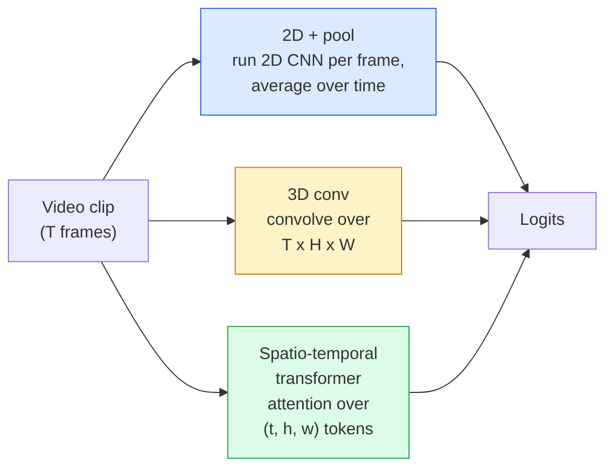

# 视频理解——时间建模

> 视频是由一系列图像以及连接这些图像的数学机制构成的。所有的视频模型要么将时间视为一个额外的维度（3D卷积），要么将其视为一条需要依次处理的序列（Transformer），又或者将其视为一次性提取并聚合的特征（2D+池化）。

**类型：** 学习 + 实践
**语言：** Python
**先修知识：** 第4阶段第03课（CNN）、第4阶段第04课（图像分类）
**时长：** 约45分钟

## 学习目标

- 区分三种主要的视频建模方法（2D+池化、3D卷积、时空变换器），并预测它们在成本与精度之间的权衡关系。  
- 使用 PyTorch 实现帧采样、时间池化以及基于 2D+池化的基准分类器。  
- 解释为何 I3D 的“膨胀”型 3D 卷积核能够很好地从 ImageNet 权重迁移过来，以及分解式（2+1）D 卷积有何不同之处。  
- 阅读标准的动作识别数据集及评估指标：Kinetics-400/600、UCF101、Something-Something V2；并了解在片段级和视频级下的 top-1 准确率含义。

## 问题所在

30帧/秒、时长为30秒的视频包含900张图像。从简单角度来看，视频分类可以理解为对这900张图像分别进行图像分类，然后再进行某种聚合处理。这种方法在几乎每一帧都能看到动作的场景（如体育、烹饪、健身视频）中效果尚可，但当动作本身由运动构成时就会彻底失效——例如“将某物从左推向右”的动作，在每一帧中看起来都只是两个静止的物体。

对于任何视频架构而言，核心问题都是：何时以及对如何对时间结构进行建模？这个问题的答案决定了其他所有方面——计算成本、预训练策略、是否能够复用ImageNet权重，以及模型需要使用哪些数据集进行训练。

本课程的设计时长刻意短于静态图像相关的课程。因为核心的图像处理机制已经存在，视频理解主要涉及时间层面的内容：即采样、建模与聚合。

## 概念概述

### 三种架构体系



### 2D + 池化层

使用二维卷积神经网络（如 ResNet、EfficientNet、ViT）。对每个采样帧分别运行该模型，然后对每帧的嵌入向量进行平均（或最大池化、注意力池化）处理。将池化后的向量输入分类器。

优点：
- 可直接利用 ImageNet 预训练权重。
- 实现最为简单。
- 成本较低：仅需 T 帧数乘以单张图像推理的成本。

缺点：
- 无法建模运动信息，动作被视为外观的聚合。
- 时间池化具有顺序不变性，“开门”与“关门”的特征看起来相同。

适用场景：以外观特征为主的任务、小型视频数据集上的迁移学习、作为初始基准模型。

### 3D卷积

将二维（H，W）核替换为三维（T，H，W）核。该网络会在空间和时间两个维度上进行卷积。早期的相关模型包括 C3D、I3D 和 SlowFast。

I3D 的实现技巧是：采用预训练的二维 ImageNet 模型，通过沿新的时间轴复制每个二维核来“扩展”它们。一个 3x3 的二维卷积操作会转变为 3x3x3 的三维卷积操作。这样一来，三维模型就能获得强大的预训练权重，而无需从头开始训练。

优点：
- 能直接对运动进行建模。
- I3D 的扩展方式可实现免费的迁移学习。

缺点：
- 相比二维版本，其计算量会增加 T/8 倍（因为时间核由 3 层结构堆叠而成）。
- 时间核的尺寸较小；对于长距离运动，需要采用金字塔结构或双流处理方法。

适用场景：以运动为关键特征的动作识别任务（如 Something-Something V2、包含大量运动类样本的 Kinetics 数据集）。

### 时空变换器

将视频分割为时空补丁网格，并对所有补丁应用注意力机制。相关模型包括 TimeSformer、ViViT、Video Swin 与 VideoMAE。

重要的注意力模式：
- **联合式** — 对整个 `(t, h, w)` 空间施加单一大型注意力，计算复杂度为 `T*H*W` 的二次方级，成本高昂。
- **分离式** — 每个块包含两种注意力：一种用于时间维度，另一种用于空间维度，计算复杂度呈线性增长趋势。
- **分解式** — 在不同块之间交替使用时间注意力与空间注意力。

优点：
- 在所有主要基准测试中均能达到当前最先进水平。
- 通过补丁扩展技术可从图像变换器（ViT）迁移模型能力。
- 能够借助稀疏注意力机制处理长上下文视频。

缺点：
- 计算资源消耗极大。
- 需要精心选择注意力模式，否则会导致运行时成本激增。

适用场景：大型数据集、高精度视频理解以及多模态视频+文本任务。

### 帧采样

30 帧/秒的 10 秒视频片段共有 300 帧；将全部 300 帧输入模型属于资源浪费。常用策略如下：

- **均匀采样** — 在整个片段中均匀选取 T 帧。这是 2D+池化操作的默认方法。
- **密集采样** — 随机选择连续的 T 帧窗口。由于运动分析需要相邻帧，因此常用于 3D 卷积操作。
- **多片段采样** — 从同一视频中选取多个 T 帧窗口进行分类，在测试时对预测结果取平均值。

T 的常见取值为 8、16、32 或 64。T 值越大，可获取的时间信号越丰富，但计算成本也越高。

### 评估

两个评估层级：
- **片段级准确率** — 模型处理一个 T-frame 片段后，输出 top-k 结果。
- **视频级准确率** — 对每段视频中的多个片段进行片段级预测后的平均值；该数值越高且越稳定。

必须同时报告这两个指标。若某模型的片段级准确率为 78%，视频级准确率为 82%，则说明其性能严重依赖于测试时的平均处理方式；而若分别为 80% 和 81%，则表示其在单个片段上的表现更为稳健。

### 你将接触到的数据集

- **Kinetics-400 / 600 / 700** — 通用动作数据集。包含40万个视频片段；提供YouTube链接（其中许多已失效）。
- **Something-Something V2** — 基于运动定义的动作（例如“将X从左移动到右”）。此类问题无法通过2D+池化方法解决。
- **UCF-101**, **HMDB-51** — 较旧且规模较小的数据集，但仍被用于相关研究。
- **AVA** — 用于定位动作在空间和时间上的位置；其难度高于动作分类任务。

## 构建它

### 步骤 1：构建采样器框架

适用于帧列表（或视频张量）的均匀且密集的采样器。

```python
import numpy as np

def sample_uniform(num_frames_total, T):
    if num_frames_total <= T:
        return list(range(num_frames_total)) + [num_frames_total - 1] * (T - num_frames_total)
    step = num_frames_total / T
    return [int(i * step) for i in range(T)]


def sample_dense(num_frames_total, T, rng=None):
    rng = rng or np.random.default_rng()
    if num_frames_total <= T:
        return list(range(num_frames_total)) + [num_frames_total - 1] * (T - num_frames_total)
    start = int(rng.integers(0, num_frames_total - T + 1))
    return list(range(start, start + T))
```

两者都会返回用于截取视频张量的 `T` 个索引。

### 步骤 2：2D+池化基线模型

对每一帧图像运行 2D ResNet-18 模型，对提取的特征进行平均池化处理，随后进行分类。

```python
import torch
import torch.nn as nn
from torchvision.models import resnet18, ResNet18_Weights

class FramePool(nn.Module):
    def __init__(self, num_classes=400, pretrained=True):
        super().__init__()
        weights = ResNet18_Weights.IMAGENET1K_V1 if pretrained else None
        backbone = resnet18(weights=weights)
        self.features = nn.Sequential(*(list(backbone.children())[:-1]))  # global avg pool kept
        self.head = nn.Linear(512, num_classes)

    def forward(self, x):
        # x: (N, T, 3, H, W)
        N, T = x.shape[:2]
        x = x.view(N * T, *x.shape[2:])
        feats = self.features(x).view(N, T, -1)
        pooled = feats.mean(dim=1)
        return self.head(pooled)

model = FramePool(num_classes=10)
x = torch.randn(2, 8, 3, 224, 224)
print(f"output: {model(x).shape}")
print(f"params: {sum(p.numel() for p in model.parameters()):,}")
```

拥有1100万个参数，经过ImageNet预训练，可逐帧运行以进行平均处理与分类。在依赖外观特征的任务中，该基准模型的性能通常仅比真正的3D模型落后5-10分——有时甚至表现更好，因为它复用了更强大的ImageNet主干网络。

### 步骤 3：I3D 风格的膨胀型 3D 卷积

通过沿新的时间轴重复权重，将单个二维卷积转换为三维卷积。

```python
def inflate_2d_to_3d(conv2d, time_kernel=3):
    out_c, in_c, kh, kw = conv2d.weight.shape
    weight_3d = conv2d.weight.data.unsqueeze(2)  # (out, in, 1, kh, kw)
    weight_3d = weight_3d.repeat(1, 1, time_kernel, 1, 1) / time_kernel
    conv3d = nn.Conv3d(in_c, out_c, kernel_size=(time_kernel, kh, kw),
                        padding=(time_kernel // 2, conv2d.padding[0], conv2d.padding[1]),
                        stride=(1, conv2d.stride[0], conv2d.stride[1]),
                        bias=False)
    conv3d.weight.data = weight_3d
    return conv3d

conv2d = nn.Conv2d(3, 64, kernel_size=3, padding=1, bias=False)
conv3d = inflate_2d_to_3d(conv2d, time_kernel=3)
print(f"2D weight shape:  {tuple(conv2d.weight.shape)}")
print(f"3D weight shape:  {tuple(conv3d.weight.shape)}")
x = torch.randn(1, 3, 8, 56, 56)
print(f"3D output shape:  {tuple(conv3d(x).shape)}")
```

通过除以 `time_kernel` 可使激活值的幅值大致保持恒定——这对于在首次处理时不破坏批量归一化的统计特性至关重要。

### 步骤 4：分解为 (2+1)D 卷积

将三维卷积拆分为二维（空间）卷积和一维（时间）卷积。其感受野保持不变，参数量更少，在某些基准测试中能获得更高的准确率。

```python
class Conv2Plus1D(nn.Module):
    def __init__(self, in_c, out_c, kernel_size=3):
        super().__init__()
        mid_c = (in_c * out_c * kernel_size * kernel_size * kernel_size) \
                // (in_c * kernel_size * kernel_size + out_c * kernel_size)
        self.spatial = nn.Conv3d(in_c, mid_c, kernel_size=(1, kernel_size, kernel_size),
                                 padding=(0, kernel_size // 2, kernel_size // 2), bias=False)
        self.bn = nn.BatchNorm3d(mid_c)
        self.act = nn.ReLU(inplace=True)
        self.temporal = nn.Conv3d(mid_c, out_c, kernel_size=(kernel_size, 1, 1),
                                  padding=(kernel_size // 2, 0, 0), bias=False)

    def forward(self, x):
        return self.temporal(self.act(self.bn(self.spatial(x))))

c = Conv2Plus1D(3, 64)
x = torch.randn(1, 3, 8, 56, 56)
print(f"(2+1)D output: {tuple(c(x).shape)}")
```

完整的 R(2+1)D 网络实际上等同于 ResNet-18，只不过其中的所有 3x3 卷积层都被替换为了 `Conv2Plus1D`。

## 使用它

有两个库可用于处理生产环境中的视频任务：

- `torchvision.models.video` — 支持 R(2+1)D、MViT、Swin3D 模型，并预加载了 Kinetics 数据集的权重。其 API 与图像模型相同。
- `pytorchvideo`（Meta 出品）—— 提供模型库以及针对 Kinetics / SSv2 / AVA 数据集的数据加载器，还包含标准的数据转换功能。

对于视觉语言视频模型（如视频字幕生成、视频问答），请使用 `transformers` 库中的 `VideoMAE`、`VideoLLaMA`、`InternVideo` 模型。

## 发布它

本课程将生成以下内容：

- `outputs/prompt-video-architecture-picker.md` — 一个提示词，可根据视觉特征与运动特性、数据集规模以及计算资源限制来选择 2D+pool / I3D / (2+1)D / transformer 等架构。
- `outputs/skill-frame-sampler-auditor.md` — 一种用于检测视频处理流程中采样器的工具，能够识别常见错误：索引偏移、当 `num_frames < T` 时采样不均匀、缺乏保持宽高比的裁剪等功能缺陷。

## 练习题

1. **（简单）** 计算在 T=8 条件下，FramePool 与类似 I3D 架构的 3D ResNet 的 FLOPs（近似值）。说明为何采用 2D+池化方法的计算成本仅为后者的 1/3 到 1/5。
2. **（中等）** 生成一个合成视频数据集：包含随机方向移动的球体，并根据运动方向标注为“从左到右”、“从右到左”或“对角向上”。使用该数据集训练 FramePool。验证其准确率仅略高于随机水平，从而证明仅依靠图像外观信息不足以完成运动检测任务。
3. **（困难）** 通过将 ResNet-18 中的每个 Conv2d 替换为 `Conv2Plus1D` 来构建一个 R(2+1)D-18 模型。从预训练于 ImageNet 的 ResNet-18 中加载第一个卷积层的权重，并使用第 2 题中的运动数据集对该模型进行训练，使其性能优于 FramePool。

## 关键术语

| 术语 | 常见说法 | 实际含义 |
|------|----------|----------|
| 2D + pool | “逐帧分类器” | 对每个采样的帧运行 2D CNN，对不同时间步的特征进行平均池化后进行分类 |
| 3D convolution | “时空卷积核” | 在 (T, H, W) 空间上执行卷积的核函数，能够直接建模运动特性 |
| Inflation | “将 2D 权重提升到 3D” | 通过沿新的时间轴重复 2D 卷积的权重来初始化 3D 卷积权重，随后除以 kernel_T 以保持激活值的尺度 |
| (2+1)D | “分解式卷积” | 将 3D 结构拆分为 2D 空间维度与 1D 时间维度；参数量更少，但需要在两者之间引入额外的非线性结构 |
| Divided attention | “先处理时间再处理空间” | Transformer 块中每层包含两种注意力机制：一种用于同一帧内的 token，另一种用于相同位置上的 token |
| Clip | “T 帧窗口” | 由 T 帧组成的采样子序列；视频模型处理的单个数据单元 |
| Clip vs video accuracy | “两种评估设置” | Clip 模式下每个视频仅使用一个样本进行评估，而视频模式则对多个采样的片段取平均值进行评估 |
| Kinetics | “视频领域的 ImageNet” | 包含 400–700 个动作类别及超过 30 万个 YouTube 视频片段，是标准的视频预训练语料库 |

## 延伸阅读

- [I3D: 行动识别的发展前景（Carreira & Zisserman，2017）](https://arxiv.org/abs/1705.07750) —— 提出了inflation方法及Kinetics数据集  
- [R(2+1)D：时空卷积的深入研究（Tran等人，2018）](https://arxiv.org/abs/1711.11248) —— 因子化卷积，至今仍是强大的基准模型  
- [TimeSformer：时空注意力是否就是全部所需？（Bertasius等人，2021）](https://arxiv.org/abs/2102.05095) —— 首个性能出色的视频Transformer模型  
- [VideoMAE（Tong等人，2022）](https://arxiv.org/abs/2203.12602) —— 用于视频的掩码自编码器预训练方法；目前最主流的预训练方案
