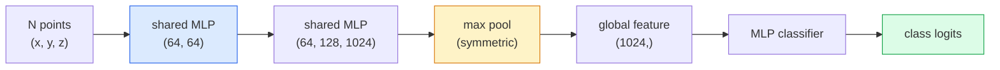

# 3D视觉——点云与NeRFs

> 3D视觉技术主要分为两种形式。点云是传感器的原始输出数据，而NeRF则是通过学习得到的体积场模型。二者都能回答“空间中某物位于何处”这一问题。

**类型：** 学习 + 实践
**编程语言：** Python
**先修知识：** 第4阶段第03课（CNN），第1阶段第12课（张量运算）
**所需时间：** 约45分钟

## 学习目标

- 区分显式（点云、网格、体素）与隐式（带符号距离场、NeRF）的3D表示方式，以及各自的适用场景
- 理解PointNet的对称函数技巧，该技巧使神经网络对无序点集具有排列不变性
- 推导NeRF的前向传播过程：光线投射、体积渲染、位置编码、MLP密度与颜色预测头
- 使用`nerfstudio`或`instant-ngp`，基于少量带姿态的图像进行预训练后的3D重建

## 问题所在

相机生成的是二维图像。激光雷达则输出一组无序的三维点。基于运动的结构分析流程会生成稀疏的三维关键点云。而NeRF则能从少量已构图图像中重建出完整的3D场景。尽管这些都是“视觉技术”，但它们看起来都与CNN所需的密集张量截然不同。

3D视觉至关重要，因为几乎所有高价值的机器人任务都在三维空间中进行：抓取、避障、导航、AR遮挡处理以及3D内容采集。仅掌握二维图像知识的视觉工程师将无法涉足该领域发展最快的细分市场（如AR/VR内容、机器人技术、自动驾驶系统，以及用于房地产或建筑行业的基于NeRF的3D重建技术）。

这两种表示形式之所以占据主导地位，原因各异。点云是传感器直接提供的原始数据。而当让神经网络去学习场景时，则会得到NeRF及其后续技术（如3D高斯溅射、神经SDF）所生成的成果。

## 概念概述

### 点云

点云是 R^3 空间中一组无序的 N 个点，这些点可选地具有各种特征（颜色、强度、法向量）。

```
cloud = [
  (x1, y1, z1, r1, g1, b1),
  (x2, y2, z2, r2, g2, b2),
  ...
  (xN, yN, zN, rN, gN, bN),
]
```

没有网格结构，就无法实现连接。有两个特性使得神经网络难以处理此类问题：

- **排列不变性** —— 输出结果不得依赖于点的顺序。
- **N值可变** —— 单一模型必须能够处理不同规模的点云。

PointNet（Qi 等人，2017年）通过一个思路解决了这两个问题：对每个点应用相同的多层感知机，然后使用对称函数（最大池化）进行聚合。最终得到的是一个固定大小的向量，且与点的顺序无关。

```
f(P) = max_{p in P} MLP(p)
```

这就是 PointNet 的核心所在。更高级的变体（如 PointNet++、Point Transformer）虽然增加了分层采样与局部聚合机制，但对称函数这一设计思路并未改变。

### PointNet 架构



“共享 MLP”指的是在每个数据点上独立运行相同的 MLP 模型。为提升效率，该实现采用在数据点维度上进行 1x1 卷积的方式。

### 神经辐射场（NeRFs）

NeRFs（Mildenhall 等人，2020）针对“能否从 N 张照片重建 3D 场景？”这一问题，提出了以神经网络本身作为场景的解决方案。该网络将 `(x, y, z, viewing_direction)` 映射为 `(density, colour)`。渲染新视角时，则需通过对该网络进行光线投射循环来实现。

```
NeRF MLP:  (x, y, z, theta, phi) -> (sigma, r, g, b)

To render a pixel (u, v) of a new view:
  1. Cast a ray from the camera through pixel (u, v)
  2. Sample points along the ray at distances t_1, t_2, ..., t_N
  3. Query the MLP at each point
  4. Composite the colours weighted by (1 - exp(-sigma * dt))
  5. The sum is the rendered pixel colour
```

损失函数会将渲染出的像素与训练图片中的真实像素进行对比。通过反向传播算法对渲染步骤进行优化，从而更新多层感知机模型。由于不存在三维真实数据或显式几何结构，场景信息便存储在多层感知机的权重中。

### NeRF中的位置编码

基于 `(x, y, z)` 的普通多层感知机无法表示高频细节，因为这类模型在频谱特性上偏向于处理低频信息。NeRF 通过在将数据输入多层感知机之前，先将每个坐标编码为傅里叶特征向量来解决这一问题：

```
gamma(p) = (sin(2^0 pi p), cos(2^0 pi p), sin(2^1 pi p), cos(2^1 pi p), ...)
```

支持高达 L=10 的频率层级。这与变换器用于处理位置信息的技巧相同，也在扩散时间条件控制中再次出现（第 10 课）。若没有这一机制，NeRF 模型将会显得模糊不清。

### 体积渲染

```
C(r) = sum_i T_i * (1 - exp(-sigma_i * delta_i)) * c_i

T_i  = exp(- sum_{j<i} sigma_j * delta_j)
delta_i = t_{i+1} - t_i
```

`T_i` 表示透射率，即有多少光线能够到达点 i。`(1 - exp(-sigma_i * delta_i))` 则表示点 i 处的不透明度。`c_i` 代表颜色。最终像素值是沿光线路径的各分量加权求和的结果。

### 什么取代了NeRF？

纯 NeRF 的训练速度较慢（需数小时），渲染速度也慢（每张图像需数秒）。其发展脉络如下：

- **Instant-NGP**（2022年）——采用哈希网格编码替代 MLP 的位置输入，训练仅需数秒。
- **Mip-NeRF 360**——能够处理无边界场景并实现抗锯齿效果。
- **3D Gaussian Splatting**（2023年）——用数百万个 3D 高斯函数替代体积场，训练只需几分钟，即可实现实时渲染。这是目前生产环境中的默认选择。

到 2026 年，几乎所有实际的 NeRF 产品实际上都是基于 3D 高斯散射技术实现的。尽管如此，人们的认知模型依然停留在 NeRF 上。

### 数据集与基准测试

- **ShapeNet** — 将 3D CAD 模型分类并分割为点云。
- **ScanNet** — 用于分割的真实室内扫描数据。
- **KITTI** — 用于自动驾驶的室外激光雷达点云数据。
- **NeRF Synthetic** / **Blended MVS** — 用于视图合成的带姿态图像数据集。
- **Mip-NeRF 360** 数据集 — 无边界真实场景数据。

## 构建它

### 步骤 1：PointNet 分类器

```python
import torch
import torch.nn as nn

class PointNet(nn.Module):
    def __init__(self, num_classes=10):
        super().__init__()
        self.mlp1 = nn.Sequential(
            nn.Conv1d(3, 64, 1),    nn.BatchNorm1d(64),   nn.ReLU(inplace=True),
            nn.Conv1d(64, 64, 1),   nn.BatchNorm1d(64),   nn.ReLU(inplace=True),
        )
        self.mlp2 = nn.Sequential(
            nn.Conv1d(64, 128, 1),  nn.BatchNorm1d(128),  nn.ReLU(inplace=True),
            nn.Conv1d(128, 1024, 1), nn.BatchNorm1d(1024), nn.ReLU(inplace=True),
        )
        self.head = nn.Sequential(
            nn.Linear(1024, 512),   nn.BatchNorm1d(512),  nn.ReLU(inplace=True),
            nn.Dropout(0.3),
            nn.Linear(512, 256),    nn.BatchNorm1d(256),  nn.ReLU(inplace=True),
            nn.Dropout(0.3),
            nn.Linear(256, num_classes),
        )

    def forward(self, x):
        # x: (N, 3, num_points) — transposed for Conv1d
        x = self.mlp1(x)
        x = self.mlp2(x)
        x = torch.max(x, dim=-1)[0]       # (N, 1024)
        return self.head(x)

pts = torch.randn(4, 3, 1024)
net = PointNet(num_classes=10)
print(f"output: {net(pts).shape}")
print(f"params: {sum(p.numel() for p in net.parameters()):,}")
```

参数量约为 160 万。在每台云端节点上可运行 1,024 个实例。

### 步骤 2：位置编码

```python
def positional_encoding(x, L=10):
    """
    x: (..., D) -> (..., D * 2 * L)
    """
    freqs = 2.0 ** torch.arange(L, dtype=x.dtype, device=x.device)
    args = x.unsqueeze(-1) * freqs * 3.141592653589793
    sinc = torch.cat([args.sin(), args.cos()], dim=-1)
    return sinc.reshape(*x.shape[:-1], -1)

x = torch.randn(5, 3)
y = positional_encoding(x, L=10)
print(f"input:  {x.shape}")
print(f"encoded: {y.shape}     # (5, 60)")
```

乘以 `2^l * pi` 可以得到逐渐更高的频率。

### 步骤 3：Tiny NeRF MLP

```python
class TinyNeRF(nn.Module):
    def __init__(self, L_pos=10, L_dir=4, hidden=128):
        super().__init__()
        self.L_pos = L_pos
        self.L_dir = L_dir
        pos_dim = 3 * 2 * L_pos
        dir_dim = 3 * 2 * L_dir
        self.trunk = nn.Sequential(
            nn.Linear(pos_dim, hidden), nn.ReLU(inplace=True),
            nn.Linear(hidden, hidden),  nn.ReLU(inplace=True),
            nn.Linear(hidden, hidden),  nn.ReLU(inplace=True),
            nn.Linear(hidden, hidden),  nn.ReLU(inplace=True),
        )
        self.sigma = nn.Linear(hidden, 1)
        self.color = nn.Sequential(
            nn.Linear(hidden + dir_dim, hidden // 2), nn.ReLU(inplace=True),
            nn.Linear(hidden // 2, 3), nn.Sigmoid(),
        )

    def forward(self, x, d):
        x_enc = positional_encoding(x, self.L_pos)
        d_enc = positional_encoding(d, self.L_dir)
        h = self.trunk(x_enc)
        sigma = torch.relu(self.sigma(h)).squeeze(-1)
        rgb = self.color(torch.cat([h, d_enc], dim=-1))
        return sigma, rgb

nerf = TinyNeRF()
x = torch.randn(128, 3)
d = torch.randn(128, 3)
s, c = nerf(x, d)
print(f"sigma: {s.shape}   rgb: {c.shape}")
```

与原始的 NeRF（包含两个深度为 8 的 MLP 主干）相比，其规模要小得多。这样的规模已足以用于演示该架构。

### 第 4 步：沿光线进行体积渲染

```python
def volumetric_render(sigma, rgb, t_vals):
    """
    sigma: (..., N_samples)
    rgb:   (..., N_samples, 3)
    t_vals: (N_samples,) distances along the ray
    """
    delta = torch.cat([t_vals[1:] - t_vals[:-1], torch.full_like(t_vals[:1], 1e10)])
    alpha = 1.0 - torch.exp(-sigma * delta)
    trans = torch.cumprod(torch.cat([torch.ones_like(alpha[..., :1]), 1.0 - alpha + 1e-10], dim=-1), dim=-1)[..., :-1]
    weights = alpha * trans
    rendered = (weights.unsqueeze(-1) * rgb).sum(dim=-2)
    depth = (weights * t_vals).sum(dim=-1)
    return rendered, depth, weights


N = 64
t_vals = torch.linspace(2.0, 6.0, N)
sigma = torch.rand(N) * 0.5
rgb = torch.rand(N, 3)
rendered, depth, weights = volumetric_render(sigma, rgb, t_vals)
print(f"rendered colour: {rendered.tolist()}")
print(f"depth:           {depth.item():.2f}")
```

一束光线，64个采样值，合成为一个RGB像素及对应的深度值。

## 使用它

实际应用中：

- `nerfstudio`（Tancik 等人开发）——目前 NeRF / Instant-NGP / 高斯飞溅算法的参考库，提供命令行接口及网页查看器。
- `pytorch3d`（Meta 开发）——支持可微渲染、点云处理工具以及网格运算功能。
- `open3d`——用于点云处理、配准及可视化。

在部署层面，由于 3D 高斯飞溅算法的渲染速度是传统 NeRF 的 100 倍，它已逐渐取代了纯 NeRF 算法，而其重建质量则与之相当。

## 发布它

本课程将生成以下内容：

- `outputs/prompt-3d-task-router.md` — 一种提示词，能够根据任务类型与输入数据自动选择合适的 3D 表示形式（点云、网格、体素、NeRF、高斯溅射模型）。
- `outputs/skill-point-cloud-loader.md` — 一项技能，用于为 .ply / .pcd / .xyz 文件生成经过正确归一化、居中处理且已完成点采样的 PyTorch `Dataset`。

## 练习题

1. **（简单）** 证明 PointNet 具有排列不变性：对同一组点集执行两次处理，其中一次对点进行随机排序。验证在浮点数误差范围内，两次处理的输出结果完全一致。
2. **（中等）** 实现一个最简的射线生成函数，该函数根据相机的内参与姿态信息，为 H × W 图像中的每个像素生成射线的起点和方向向量。
3. **（困难）** 在由可微渲染或简单光线追踪器生成的彩色立方体渲染视图构成的合成数据集上训练 TinyNeRF。报告第 1、10 和 100 个训练轮次时的渲染损失值。模型在哪个训练轮次能够生成可识别的视图？

## 关键术语

| 术语 | 常见说法 | 实际含义 |
|------|----------|----------|
| 点云 | “来自激光雷达的3D点” | 由每个点的 (x, y, z) 坐标及可选特征组成的无序集合 |
| PointNet | “首个用于处理点云的神经网络” | 每个点对应一个共享的多层感知机（MLP），并采用对称（最大值）池化操作；其结构本身具备排列不变性 |
| NeRF | “即场景本身的MLP” | 一种将 (x, y, z, dir) 映射为 (密度, 颜色) 的网络，通过光线投射方式进行渲染 |
| 位置编码 | “傅里叶特征” | 通过多个频率下的正弦/余弦函数对每个坐标进行编码，以克服多层感知机在低频区域的偏差 |
| 体渲染 | “光线积分” | 利用透射率和透明度信息，将沿光线的多个采样值合成一个像素 |
| Instant-NGP | “哈希网格NeRF” | 用多分辨率哈希网格替代NeRF中的坐标MLP，使其速度提升100至1000倍 |
| 3D高斯溅射 | “数百万个高斯函数” | 场景由大量3D高斯函数组成；可实现实时渲染，训练时间仅需几分钟 |
| SDF | “带符号距离场” | 一种返回到最近表面带符号距离的函数；属于另一种隐式表示方法 |

## 延伸阅读

- [PointNet（Qi 等人，2017）](https://arxiv.org/abs/1612.00593) —— 该置换不变分类器
- [NeRF（Mildenhall 等人，2020）](https://arxiv.org/abs/2003.08934) —— 将基于照片的3D重建转化为神经网络问题的论文
- [Instant-NGP（Müller 等人，2022）](https://arxiv.org/abs/2201.05989) —— 哈希网格技术，速度提升1000倍
- [3D Gaussian Splatting（Kerbl 等人，2023）](https://arxiv.org/abs/2308.04079) —— 在实际应用中取代NeRF的架构
