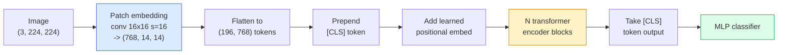

# 视觉变换器（ViT）

> 将图像切割成多个块，将每个块视为一個“词”，然后运行标准的Transformer模型。无需回溯之前的步骤。

**类型：** 构建
**语言：** Python
**先修知识：** 第7阶段第02课（自注意力机制），第4阶段第04课（图像分类）
**耗时：** 约45分钟

## 学习目标

- 从零实现补丁嵌入、学习得到的位置嵌入、类别令牌以及Transformer编码器块，从而构建一个最简版的ViT。
- 阐述为何在DeiT和MAE证明其可行性之前，人们认为ViT需要海量的预训练数据。
- 从架构假设的角度（无假设、局部窗口注意力、卷积骨干网络）对比ViT、Swin和ConvNeXt。
- 使用`timm`库以及标准的线性探针/微调流程，在小型数据集上对预训练好的ViT进行微调。

## 问题所在

十年来，卷积运算一直是计算机视觉领域的代名词。卷积神经网络拥有强大的归纳偏置——如局部性、平移不变性——人们原以为这些特性是无法被替代的。然而 Dosovitskiy 等人（2020）证明，只需将普通的变换器应用于展平后的图像块，且完全不使用任何卷积结构，在大规模数据集上其性能即可与最优秀的卷积神经网络相媲美甚至更佳。

但这一优势仅限于“大规模数据集”场景。在 ImageNet-1k 数据集上，ViT 模型的表现逊于 ResNet；而先在 ImageNet-21k 或 JFT-300M 上预训练、再在 ImageNet-1k 上微调的 ViT 模型则能战胜 ResNet。由此得出的结论是：变换器本身缺乏有用的先验知识，但可以通过足够多的数据来学习这些知识。后续的研究（如 DeiT、MAE、DINO）表明，通过恰当的训练策略——强化的数据增强、自监督预训练以及蒸馏技术——ViT 模型即便在小型数据集上也能实现良好的训练效果。

截至 2026 年，纯卷积神经网络在边缘设备上依然具有竞争力（其中 ConvNeXt 是表现最出色的架构），但变换器则主导了其余所有领域：图像分割（Mask2Former、SegFormer）、目标检测（DETR、RT-DETR）、多模态任务（CLIP、SigLIP）以及视频处理（VideoMAE、VJEPA）。掌握 ViT 的块结构是当前不可或缺的技能。

## 概念概述

### 流水线



七个步骤：补丁处理 -> 令牌化 -> 注意力机制 -> 分类器。每种变体（DeiT、Swin、ConvNeXt、MAE预训练）仅修改这七步中的一两步，其余步骤保持不变。

### 补丁嵌入

第一个卷积层是整个流程的关键。核大小为 16，步长也为 16，因此 224×224 的图像会被分割成由 16×16 的块组成的 14×14 网格，每个块都会被映射为一个 768 维的嵌入向量。这个单一的卷积层同时完成了图像的分块处理与线性投影操作。

```
Input:  (3, 224, 224)
Conv (3 -> 768, k=16, s=16, no padding):
Output: (768, 14, 14)
Flatten spatial: (196, 768)
```

196 个补丁对应 196 个令牌。每个令牌的特征维度分别为 ViT-B 的 768、ViT-L 的 1024 或 ViT-H 的 1280。

### 类令牌

添加到序列开头的单个学习得到的向量：

```
tokens = [CLS; patch_1; patch_2; ...; patch_196]   shape (197, 768)
```

经过 N 个Transformer块处理后，`[CLS]`输出即为全局图像表示。分类头仅读取该向量。

### 位置嵌入

Transformer 模型本身并不具备空间位置的概念。需为每个标记添加一个学习得到的向量：

```
tokens = tokens + learned_pos_embedding   (also shape (197, 768))
```

嵌入向量是模型的一个参数；基于梯度的训练方法会将其适配为二维图像结构。虽然存在正弦型的二维替代方案，但在实际应用中很少被使用。

### Transformer编码器模块

标准配置。多头自注意力机制、多层感知机、残差连接以及层归一化前的预处理步骤。

```
x = x + MSA(LN(x))
x = x + MLP(LN(x))

MLP is two-layer with GELU: Linear(d -> 4d) -> GELU -> Linear(4d -> d)
```

ViT-B/16由12个此类模块堆叠而成，每个模块包含12个注意力头，总参数量为8600万。

### 为何需要预LN处理

早期的 Transformer 模型采用后归一化方式（`x = LN(x + sublayer(x))`），若不进行预热训练，则在超过 6-8 层之后就难以继续训练。而前归一化方式（`x = x + sublayer(LN(x))`）则无需预热即可稳定地训练更深层的网络。所有的 ViT 模型以及现代大型语言模型均采用前归一化技术。

### 补丁大小与性能的权衡

- 16×16 的 Patch → 196 个 Token，为标准配置。
- 32×32 的 Patch → 49 个 Token，处理速度更快但分辨率较低。
- 8×8 的 Patch → 784 个 Token，细节更丰富，但注意力计算成本呈 O(n^2) 增长，性能下降明显。

Patch 越大，生成的 Token 数越少，处理速度越快，但空间细节越少。SwinV2 在分层窗口中采用 4×4 的 Patch。

### DeiT 在 ImageNet-1k 上训练 ViT 的方法论

原始的ViT需要JFT-300M才能战胜CNN。DeiT（Touvron等人，2020年）仅通过四项改进，就将ViT-B在ImageNet-1k数据集上的Top-1准确率提升至81.8%：

1. 大量数据增强：使用RandAugment、Mixup、CutMix以及随机擦除技术。
2. 随机深度策略（在训练过程中随机丢弃整个模块）。
3. 重复数据增强（每个批次对同一张图像进行3次采样）。
4. 基于CNN教师模型的蒸馏训练（可选，可进一步提升准确率）。

所有现代的ViT训练方案均源自DeiT。

### Swin 与 ConvNeXt 对比

- **Swin**（Liu 等人，2021）——基于窗口的注意力机制。每个块在局部窗口内进行注意力计算；交替的块会移动窗口位置，以实现跨窗口的信息混合。该模型在保留注意力运算符的同时，重新引入了类似 CNN 的局部性特征。
- **ConvNeXt**（Liu 等人，2022）——一种经过重新设计的 CNN，其架构选择与 Swin 相似（包括深度卷积、LayerNorm、GELU 激活函数以及倒置瓶颈结构）。研究表明，性能差距并非源于“注意力机制与卷积机制”的对比，而是取决于“现代训练方案”与“架构设计”。

到 2026 年，ConvNeXt-V2 和 Swin-V2 均已达到生产级水平；具体选择应依据您的推理框架（ConvNeXt 更适合边缘设备部署）以及预训练语料库来决定。

### MAE预训练

掩码自编码器（He 等人，2022）：随机遮盖75%的图像块，训练编码器仅处理可见的25%，再训练一个小型解码器从编码器的输出中重建被遮盖的块。预训练完成后，丢弃解码器并仅对编码器进行微调。

MAE使得ViT仅需在ImageNet-1k数据集上即可训练，并达到当前最佳性能，因此成为目前通用的自监督学习方案。

## 构建它

### 步骤 1：补丁嵌入

```python
import torch
import torch.nn as nn

class PatchEmbedding(nn.Module):
    def __init__(self, in_channels=3, patch_size=16, dim=192, image_size=64):
        super().__init__()
        assert image_size % patch_size == 0
        self.proj = nn.Conv2d(in_channels, dim, kernel_size=patch_size, stride=patch_size)
        num_patches = (image_size // patch_size) ** 2
        self.num_patches = num_patches

    def forward(self, x):
        x = self.proj(x)
        return x.flatten(2).transpose(1, 2)
```

一次卷积，一次展平，一次转置。这就是整个图像到令牌的转换过程。

### 步骤 2：Transformer 块

前馈网络层、多头自注意力机制、带GELU激活函数的多层感知机以及残差连接。

```python
class Block(nn.Module):
    def __init__(self, dim, num_heads, mlp_ratio=4, dropout=0.0):
        super().__init__()
        self.ln1 = nn.LayerNorm(dim)
        self.attn = nn.MultiheadAttention(dim, num_heads, dropout=dropout, batch_first=True)
        self.ln2 = nn.LayerNorm(dim)
        self.mlp = nn.Sequential(
            nn.Linear(dim, dim * mlp_ratio),
            nn.GELU(),
            nn.Dropout(dropout),
            nn.Linear(dim * mlp_ratio, dim),
            nn.Dropout(dropout),
        )

    def forward(self, x):
        a, _ = self.attn(self.ln1(x), self.ln1(x), self.ln1(x), need_weights=False)
        x = x + a
        x = x + self.mlp(self.ln2(x))
        return x
```

`nn.MultiheadAttention` 负责将输入拆分为多个头、执行缩放点积运算以及进行输出投影。设置 `batch_first=True` 后，数据形状将为 `(N, seq, dim)`。

### 步骤 3：ViT 模型

```python
class ViT(nn.Module):
    def __init__(self, image_size=64, patch_size=16, in_channels=3,
                 num_classes=10, dim=192, depth=6, num_heads=3, mlp_ratio=4):
        super().__init__()
        self.patch = PatchEmbedding(in_channels, patch_size, dim, image_size)
        num_patches = self.patch.num_patches
        self.cls_token = nn.Parameter(torch.zeros(1, 1, dim))
        self.pos_embed = nn.Parameter(torch.zeros(1, num_patches + 1, dim))
        self.blocks = nn.ModuleList([
            Block(dim, num_heads, mlp_ratio) for _ in range(depth)
        ])
        self.ln = nn.LayerNorm(dim)
        self.head = nn.Linear(dim, num_classes)
        nn.init.trunc_normal_(self.pos_embed, std=0.02)
        nn.init.trunc_normal_(self.cls_token, std=0.02)

    def forward(self, x):
        x = self.patch(x)
        cls = self.cls_token.expand(x.size(0), -1, -1)
        x = torch.cat([cls, x], dim=1)
        x = x + self.pos_embed
        for blk in self.blocks:
            x = blk(x)
        x = self.ln(x[:, 0])
        return self.head(x)

vit = ViT(image_size=64, patch_size=16, num_classes=10, dim=192, depth=6, num_heads=3)
x = torch.randn(2, 3, 64, 64)
print(f"output: {vit(x).shape}")
print(f"params: {sum(p.numel() for p in vit.parameters()):,}")
```

参数量约为 280 万——在 CPU 上即可运行的小型 ViT 模型。真正的 ViT-B 参数量为 8600 万；其结构定义与此处相同，即 `dim=768, depth=12, num_heads=12`。

### 步骤 4：合理性检查——单张图像推理

```python
logits = vit(torch.randn(1, 3, 64, 64))
print(f"logits: {logits}")
print(f"probs:  {logits.softmax(-1)}")
```

应能无错误运行。各概率值之和为 1。

## 使用它

`timm` 发布的所有 ViT 变体均预加载了 ImageNet 训练权重。一句话概括：

```python
import timm

model = timm.create_model("vit_base_patch16_224", pretrained=True, num_classes=10)
```

`timm` 是 2026 年视觉Transformer在生产环境中的默认选择。它通过统一的API支持ViT、DeiT、Swin、Swin-V2、ConvNeXt、ConvNeXt-V2、MaxViT、MViT、EfficientFormer以及数十种其他模型。

对于多模态任务（图像+文本），`transformers` 库提供了CLIP、SigLIP、BLIP-2、LLaVA等工具。上述所有模型中的图像编码器均为ViT的变体。

## 发布它

本课程将生成以下内容：

- `outputs/prompt-vit-vs-cnn-picker.md` — 一个提示词，可根据数据集大小、计算资源及推理框架来选择 ViT、ConvNeXt 或 Swin 模型。
- `outputs/skill-vit-patch-and-pos-embed-inspector.md` — 一项技能，用于验证 ViT 的补丁嵌入与位置嵌入的维度是否与模型预期的序列长度一致，从而检测最常见的移植错误。

## 练习题

1. **（简单）** 对上述小型 ViT 的前向传播过程，打印每个中间张量的形状。需确认：输入为 `(N, 3, 64, 64)` -> 分块后为 `(N, 16, 192)` -> 经过 CLS 层后为 `(N, 17, 192)` -> 分类器输入为 `(N, 192)` -> 输出为 `(N, num_classes)`。
2. **（中等）** 在第 4 课的合成 CIFAR 数据集上，对预训练好的 `timm` ViT-S/16 模型进行微调。并与在同一数据集上微调的 ResNet-18 模型进行对比，报告训练时间与最终准确率。
3. **（困难）** 为该小型 ViT 实现 MAE 预训练：屏蔽 75% 的分块，训练编码器及一个小型解码器以重建被屏蔽的分块。在预训练前后，使用线性探测方法评估在合成数据上的准确率。

## 关键术语

| 术语 | 常见说法 | 实际含义 |
|------|----------|----------|
| 补丁嵌入 | “第一个卷积层” | 核大小、步长与补丁大小均相等的卷积层；用于将图像转换为令牌嵌入的网格结构 |
| 类别令牌 | “[CLS]” | 添加在令牌序列开头的学习得到的向量；其最终输出即为整个图像的全局表示 |
| 位置嵌入 | “学习得到的位置向量” | 添加到每个令牌上的学习得到的向量，用于让Transformer知晓每个补丁的来源位置 |
| 预归一化层 | “子层前的LayerNorm” | 变体Transformer的结构：采用 `x + sublayer(LN(x))` 的形式，而非传统的 `LN(x + sublayer(x))` |
| 多头注意力 | “并行注意力机制” | 标准Transformer的注意力机制被拆分为多个独立的子空间（即多头），处理完成后再将结果拼接起来 |
| ViT-B/16 | “基础版，16补丁尺寸” | 其标准参数配置为：维度=768，层数=12，头数=12，补丁大小=16，输入图像尺寸=224；模型参数量约为8600万 |
| DeiT | “高数据效率的ViT” | 仅在ImageNet-1k数据集上经过训练且采用了强增强技术的ViT变体；证明了大规模预训练数据并非绝对必要 |
| MAE | “掩码自编码器” | 一种自我监督式预训练方法：对75%的补丁进行遮蔽，然后让模型尝试重构这些被遮蔽的部分；是目前最常用的ViT预训练方案 |

## 延伸阅读

- [一张图片相当于16×16个单词（Dosovitskiy等人，2020）](https://arxiv.org/abs/2010.11929) —— ViT相关论文  
- [DeiT：高数据效率的图像变换器（Touvron等人，2020）](https://arxiv.org/abs/2012.12877) —— 如何仅使用ImageNet-1k数据训练ViT  
- [掩码自编码器是可扩展的视觉学习模型（He等人，2022）](https://arxiv.org/abs/2111.06377) —— MAE预训练方法  
- [timm文档](https://huggingface.co/docs/timm) —— 你在生产环境中使用的所有视觉变换器的参考资料
