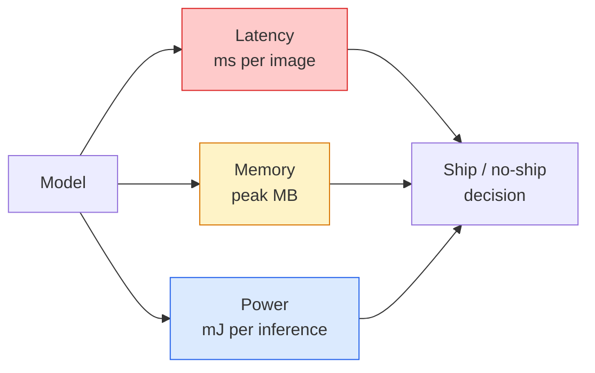

# 实时视觉技术——边缘端部署

> 边缘推理是一门致力于在仅拥有 2 GB 内存的设备上，让准确率达 90% 的模型以 30 帧/秒的速率运行的技术。准确率的每提升一个百分点，都会导致延迟增加数毫秒。

**类型：** 学习 + 实践
**语言：** Python
**先修课程：** 第 4 阶段第 04 课（图像分类）、第 10 阶段第 11 课（量化）
**时长：** 约 75 分钟

## 学习目标

- 测量任意 PyTorch 模型的推理延迟、峰值内存占用及吞吐量，分析 FLOPs、参数数量与延迟之间的权衡关系。
- 使用 PyTorch 的训练后量化功能将视觉模型量化为 INT8 格式，并确保精度损失低于 1%。
- 将模型导出为 ONNX 格式，然后使用 ONNX Runtime 或 TensorRT 进行编译；列举三种最常见的导出失败原因及其解决方案。
- 针对边缘设备性能限制的场景，说明何时选择 MobileNetV3、EfficientNet-Lite、ConvNeXt-Tiny 或 MobileViT。

## 问题所在

训练时的视觉模型堪称浮点运算的“巨无霸”：1亿个参数，每次前向传播需10 GFLOPs的计算量，还需2 GB的VRAM。这样的配置根本无法应用于手机、汽车娱乐系统、工业相机或无人机中。若要推出视觉系统，则必须在预算减少100倍的情况下实现相同的预测效果。

只需调整三个关键参数即可解决大部分问题：模型选择（采用相同算法但结构更小的模型）、量化处理（从FP32转为INT8），以及推理运行时环境（ONNX Runtime、TensorRT、Core ML、TFLite）。正确配置这些参数，才能让演示版本在工作站上运行，同时让产品能搭载在价值30美元的相机模块中上市。

本课程首先建立测量规范（无法衡量的事物就无法优化），随后逐一讲解这三个关键参数。其目的并非要求掌握所有边缘计算运行时环境，而是让大家了解现有的调整手段，并学会验证每种手段是否能达到预期效果。

## 概念概述

### 三个预算



- **延迟**：p50、p95、p99。仅计算 p50 的平均值会掩盖对实时系统至关重要的尾部行为。
- **峰值内存占用**：设备所达到的最高内存使用量，而非稳态下的平均值。因为在嵌入式系统中，内存溢出会导致严重后果。
- **功耗/能量消耗**：电池供电设备每次进行一次推理所消耗的毫焦耳数。通常通过 CPU/GPU 的利用率乘以时间来估算。

边缘决策的依据是一张包含（模型、延迟、内存占用、准确率）信息的表格。所有数值均在目标设备上测量，而非在工作站上。

### 测量学科

每个边缘端点配置都必须遵循的三大规则：

1. 在进行测量之前，需通过 5-10 次虚拟前向传播来**预热**模型。冷缓存与即时编译会导致初始测试数据缺乏代表性。
2. 在计时区间开始前后，均需使用 `torch.cuda.synchronize()` 来**同步** GPU 工作负载。否则测量的将只是内核调度时间而非实际执行时间。
3. 将输入尺寸调整为生产环境所需的分辨率。在 224x224 分辨率下的延迟数据无法反映 512x512 分辨率下的真实延迟情况。

### 以 FLOPs 作为代理指标

FLOPs（每次推理的浮点运算次数）是一种成本低廉、与硬件无关的延迟度量指标。它适用于架构对比，但若直接作为实际运行时间的参考则具有误导性。实际上，一个FLOPs数值高出10%的模型，如果采用了更适配硬件的运算操作（如深度卷积易于编译，而大型7×7卷积则不然），其速度可能会快两倍。

原则：在架构搜索阶段使用FLOPs进行评估，在实际部署决策时则应参考设备上的延迟表现。

### 量化是指在人工智能模型训练与推理过程中，通过将模型的权重、激活值等高精度数值映射为较低精度的数值类型（如8位整数或定点小数），从而在显著降低存储空间需求和计算成本的同时，尽可能保持模型性能不受过度损失的技术手段。

将 FP32 格式的权重和激活值替换为 INT8 格式。在支持 INT8 内核的硬件上（所有现代移动端 SoC、所有配备 Tensor Core 的 NVIDIA GPU），模型体积可缩小 4 倍，内存带宽降低 4 倍，计算性能下降 2 到 4 倍。通过训练后的静态量化处理，视觉任务中的精度损失通常在 0.1 到 1 个百分点之间。

量化类型：

- **动态量化** — 将权重量化为 INT8，激活值仍以 FP 格式计算。实现简单，速度提升幅度较小。
- **静态量化（训练后）** — 在较小的校准数据集上对权重进行量化并校准激活值的范围。其速度远快于动态量化。
- **量化感知训练（QAT）** — 在训练过程中模拟量化过程，使模型适应该量化环境。能够获得最佳精度，但需要标注过的数据。

对于视觉任务而言，训练后的静态量化仅需付出 5% 的努力即可获得 95% 的优化效果。仅当传统训练后量化导致的精度损失无法接受时，才应使用 QAT 方法。

### 剪枝与蒸馏

- **剪枝** — 移除不重要的权重（基于幅值）或通道（结构化方式）。对参数过多的模型效果显著；对于本身已较为紧凑的架构则作用有限。
- **蒸馏** — 训练一个较小的“学生模型”来模仿较大的“教师模型”的逻辑输出。通常能够恢复因模型规模缩小而损失的大部分精度。是生产环境边缘模型的标准技术。

### 推理运行时

- **PyTorch eager 模式** — 运行速度慢，不适用于部署，仅用于开发阶段。
- **TorchScript** — 旧版格式，已被 `torch.compile` 及 ONNX 导出功能取代。
- **ONNX Runtime** — 中立的运行时框架。CPU、CUDA、CoreML、TensorRT、OpenVINO 均提供 ONNX 支持，建议从这里开始。
- **TensorRT** — NVIDIA 的编译器，在 NVIDIA GPU（工作站及 Jetson 平台）上可实现最低延迟，可与 ONNX Runtime 集成或独立使用。
- **Core ML** — Apple 为 iOS/macOS 设计的运行时框架，需要 `.mlmodel` 或 `.mlpackage` 格式的模型文件。
- **TFLite** — Google 为 Android/ARM 平台设计的运行时框架，需要 `.tflite` 格式的模型文件。
- **OpenVINO** — Intel 为 CPU/VPU 设计的运行时框架，需要包含 `.xml` 和 `.bin` 文件的模型包。

实际应用中：先将 PyTorch 模型导出为 ONNX 格式，再根据目标平台选择相应的运行时。ONNX 是通用的模型交换格式。

### 边缘架构选择器

| 预算 | 模型 | 原因 |
|--------|-------|-----|
| < 300万参数 | MobileNetV3-Small | 可在任何平台编译，是良好的基准模型 |
| 300万–1000万参数 | EfficientNet-Lite-B0 | 在 TFLite 平台上具有最高的每参数精度 |
| 1000万–2000万参数 | ConvNeXt-Tiny | 每参数精度最高，且对 CPU 友好 |
| 2000万–3000万参数 | MobileViT-S 或 EfficientViT | 具备 ImageNet 级精度的 Transformer 模型 |
| 3000万–8000万参数 | Swin-V2-Tiny | 若框架支持窗口注意力机制则选用 |

除非有特殊原因，否则应将所有这些模型量化为 INT8 格式。

```figure
cnn-param-count
```

## 构建它

### 步骤 1：正确测量延迟

```python
import time
import torch

def measure_latency(model, input_shape, device="cpu", warmup=10, iters=50):
    model = model.to(device).eval()
    x = torch.randn(input_shape, device=device)
    with torch.no_grad():
        for _ in range(warmup):
            model(x)
        if device == "cuda":
            torch.cuda.synchronize()
        times = []
        for _ in range(iters):
            if device == "cuda":
                torch.cuda.synchronize()
            t0 = time.perf_counter()
            model(x)
            if device == "cuda":
                torch.cuda.synchronize()
            times.append((time.perf_counter() - t0) * 1000)
    times.sort()
    return {
        "p50_ms": times[len(times) // 2],
        "p95_ms": times[int(len(times) * 0.95)],
        "p99_ms": times[int(len(times) * 0.99)],
        "mean_ms": sum(times) / len(times),
    }
```

热身阶段，进行同步操作，并使用 `time.perf_counter()`。需报告百分位数而不仅仅是平均值。

### 步骤 2：参数数量与 FLOP 计数

```python
def parameter_count(model):
    return sum(p.numel() for p in model.parameters())

def flops_estimate(model, input_shape):
    """
    Rough FLOP count for a conv/linear-only model. For production use `fvcore` or `ptflops`.
    """
    total = 0
    def conv_hook(m, inp, out):
        nonlocal total
        c_out, c_in, kh, kw = m.weight.shape
        h, w = out.shape[-2:]
        total += 2 * c_in * c_out * kh * kw * h * w
    def linear_hook(m, inp, out):
        nonlocal total
        total += 2 * m.in_features * m.out_features
    hooks = []
    for m in model.modules():
        if isinstance(m, torch.nn.Conv2d):
            hooks.append(m.register_forward_hook(conv_hook))
        elif isinstance(m, torch.nn.Linear):
            hooks.append(m.register_forward_hook(linear_hook))
    model.eval()
    with torch.no_grad():
        model(torch.randn(input_shape))
    for h in hooks:
        h.remove()
    return total
```

在实际项目中，请使用 `fvcore.nn.FlopCountAnalysis` 或 `ptflops`；它们能够正确处理所有类型的模块。

### 步骤 3：训练后的静态量化

```python
def quantise_ptq(model, calibration_loader, backend="x86"):
    import torch.ao.quantization as tq
    model = model.eval().cpu()
    model.qconfig = tq.get_default_qconfig(backend)
    tq.prepare(model, inplace=True)
    with torch.no_grad():
        for x, _ in calibration_loader:
            model(x)
    tq.convert(model, inplace=True)
    return model
```

三个步骤：配置、准备（插入观察器）、使用真实数据进行校准，以及转换（融合与量化）。该流程要求模型已完成融合操作（即“Conv -> BN -> ReLU”结构变为“ConvBnReLU”结构），此任务由 `torch.ao.quantization.fuse_modules` 负责处理。

### 第 4 步：导出为 ONNX 格式

```python
def export_onnx(model, sample_input, path="model.onnx"):
    model = model.eval()
    torch.onnx.export(
        model,
        sample_input,
        path,
        input_names=["input"],
        output_names=["output"],
        dynamic_axes={"input": {0: "batch"}, "output": {0: "batch"}},
        opset_version=17,
    )
    return path
```

`opset_version=17` 是 2026 年的推荐安全默认值。`dynamic_axes` 功能允许使用任意批量大小来运行 ONNX 模型。

### 第 5 步：对不同运行模式进行基准测试与对比

```python
import torch.nn as nn
from torchvision.models import mobilenet_v3_small

def compare_regimes():
    model = mobilenet_v3_small(weights=None, num_classes=10)
    params = parameter_count(model)
    flops = flops_estimate(model, (1, 3, 224, 224))
    lat_fp32 = measure_latency(model, (1, 3, 224, 224), device="cpu")
    print(f"FP32 MobileNetV3-Small: {params:,} params  {flops/1e9:.2f} GFLOPs  "
          f"p50={lat_fp32['p50_ms']:.2f}ms  p95={lat_fp32['p95_ms']:.2f}ms")
```

对 `resnet50`、`efficientnet_v2_s` 和 `convnext_tiny` 运行相同的函数，即可得到用于部署决策的对比表格。

## 使用它

生产环境的技术栈主要沿以下三条路径发展：

- **Web / 无服务器架构**：PyTorch -> ONNX -> ONNX Runtime（支持 CPU 或 CUDA）。实现最为简单，足以满足大多数需求。
- **NVIDIA 边缘设备（Jetson、GPU 服务器）**：PyTorch -> ONNX -> TensorRT。延迟最低，但需要投入最多的工程开发工作。
- **移动端**：PyTorch -> ONNX -> Core ML（iOS）或 TFLite（Android）。在导出前需先进行量化处理。

用于性能测量的工具包括 `torch-tb-profiler`、`nvprof` / `nsys` 以及 macOS 系统上的 Instruments，它们能够提供逐层的性能分析数据。而 `benchmark_app`（OpenVINO）和 `trtexec`（TensorRT）则可输出独立的命令行性能指标。

## 发布它

本课程将生成以下内容：

- `outputs/prompt-edge-deployment-planner.md` — 一个提示词，可根据目标设备及延迟服务等级协议自动选择骨干网络、量化策略和运行时环境。
- `outputs/skill-latency-profiler.md` — 一个功能模块，可生成包含预热阶段、同步机制、百分位数统计以及内存监控功能的完整延迟基准测试脚本。

## 练习题

1. **（简单）** 在 CPU 上，以 224x224 的分辨率测试 `resnet18`、`mobilenet_v3_small`、`efficientnet_v2_s` 和 `convnext_tiny` 的 p50 延迟。输出对应的表格，并指出哪种架构的每毫秒准确率最高。
2. **（中等）** 对 `mobilenet_v3_small` 应用训练后的静态量化处理。在 CIFAR-10 或类似数据集的保留子集上，分别测试 FP32 和 INT8 模型的延迟以及准确率损失情况。
3. **（困难）** 将 `convnext_tiny` 导出为 ONNX 格式，使用 `onnxruntime` 及 `CPUExecutionProvider` 进行运行，并将其延迟与 PyTorch eager 模式的基准值进行比较。找出 ONNX Runtime 首次表现出更快速度的层，并解释原因。

## 关键术语

| 术语 | 通俗说法 | 实际含义 |
|------|----------|----------|
| 延迟 | “速度有多快” | 从输入到输出的时间；指 p50/p95/p99 百分位数，而非平均值 |
| FLOPs | “模型大小” | 每次前向传播中的浮点运算次数；可作为计算成本的粗略指标 |
| INT8 量化 | “8位” | 用8位整数替换 FP32 的权重和激活值；体积约缩小4倍，速度提升2-4倍 |
| PTQ | “训练后量化” | 不重新训练即可对已训练模型进行量化；操作简单，通常效果足够 |
| QAT | “量化感知训练” | 在训练过程中模拟量化过程；能获得最佳精度，但需要标注数据 |
| ONNX | “通用格式” | 所有主流推理运行时都支持的模型交换格式 |
| TensorRT | “NVIDIA 编译器” | 将 ONNX 文件编译为适用于 NVIDIA GPU 的优化引擎 |
| 蒸馏技术 | “教师模型 -> 学生模型” | 训练一个小模型来模仿大模型的逻辑输出；可恢复大部分丢失的精度 |

## 延伸阅读

- [EfficientNet (Tan & Le, 2019)](https://arxiv.org/abs/1905.11946) — 用于构建高效架构的复合缩放技术  
- [MobileNetV3 (Howard et al., 2019)](https://arxiv.org/abs/1905.02244) — 基于 h-swish 与 squeeze-excite 算法的移动端优先架构  
- [A Practical Guide to TensorRT Optimization (NVIDIA)](https://developer.nvidia.com/blog/accelerating-model-inference-with-tensorrt-tips-and-best-practices-for-pytorch-users/) — 如何获取论文中所述的吞吐量数据  
- [ONNX Runtime 文档](https://onnxruntime.ai/docs/) — 量化处理、图优化及提供程序选择指南
