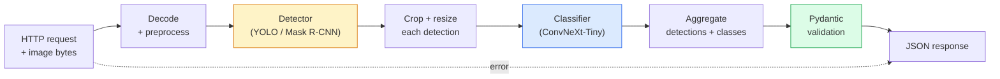

# 构建完整的视觉处理流水线——毕业设计项目

> 实际生产环境中的视觉系统是由一系列模型与规则通过数据契约连接而成的整体。这些组件在当前阶段已经准备就绪；最终项目则将它们端到端地整合在一起。

**类型：** 构建
**语言：** Python
**先修要求：** 第4阶段课程 01-15课
**时长：** 约120分钟

## 学习目标

- 设计一个生产级视觉处理流水线，用于检测物体、对其进行分类，并输出结构化的 JSON 数据——同时需覆盖所有可能的故障场景。
- 将检测器（Mask R-CNN 或 YOLO）、分类器（ConvNeXt-Tiny）以及数据契约（Pydantic）集成到同一个服务中。
- 对端到端的流水线进行性能测试，找出首个瓶颈环节（通常为预处理阶段，其次是检测器部分）。
- 部署一个最简的 FastAPI 服务，该服务可接收图像上传请求，运行上述流水线，并返回包含分类结果的检测信息。

## 问题所在

单个视觉模型固然有用，但真正的视觉产品是由多个模型串联而成的系统。例如，零售货架盘点系统就由检测器、产品分类器以及价格OCR处理流程组成；自动驾驶系统则包含2D检测器、3D检测器、分割器、跟踪器以及规划器。医疗预检系统则由分割器、区域分类器以及医生操作界面构成。

将这些模块串联起来，才是将机器学习原型转化为实际产品的关键所在。模型之间的每一个接口都可能成为故障的源头；每一次坐标变换、归一化处理或掩码尺寸调整都可能引发隐性故障。整个流程的稳定性取决于其中最薄弱的环节。

本综合项目旨在构建一个最小可行流程：包括检测、分类、结构化输出以及服务层。第四阶段的所有扩展功能都可以基于这一框架实现——例如用YOLOv8替换Mask R-CNN，添加OCR模块，增加分割分支或跟踪器。该架构具备稳定性，各组件之间也易于集成。

## 概念概述

### 流水线



七个阶段。这两个模型处理阶段成本高昂；而其余五个阶段则是错误频发的地方。

### 使用 Pydantic 定义数据契约

每个模型边界都会被转换为带类型的对象。这样一来，原本悄无声息的故障就会变得显而易见。

```
Detection(
    box: tuple[float, float, float, float],   # (x1, y1, x2, y2), absolute pixels
    score: float,                              # [0, 1]
    class_id: int,                             # from detector's label map
    mask: Optional[list[list[int]]],           # RLE-encoded if present
)

PipelineResult(
    image_id: str,
    detections: list[Detection],
    classifications: list[Classification],
    inference_ms: float,
)
```

当检测器返回的框坐标为 `(cx, cy, w, h)` 而非 `(x1, y1, x2, y2)` 时，Pydantic 的验证会在边界处立即失败，这样你就能立刻发现问题，而无需去调试那些会静默返回空区域的后续裁剪步骤。

### 延迟去向何处

几乎所有的视觉处理流程都遵循以下三个规律：

1. **预处理通常是耗时最长的环节。** 解码 JPEG 文件、转换色彩空间、调整分辨率——这些操作都属于 CPU 密集型任务，且容易被忽视。
2. **检测器占据了 GPU 大量的计算时间。** 70% 到 90% 的 GPU 计算时间都用于检测的前向传播过程。
3. **后处理（如 NMS、RLE 编码/解码）在 GPU 上运算成本低，而在 CPU 上成本较高。** 应始终使用实际目标数据进行性能分析。

了解各环节的耗时分布，才能将优化工作转化为有优先级的任务清单。

### 故障模式

- **空检测结果** — 返回空列表，不得导致程序崩溃，需进行日志记录。
- **超出边界的框** — 在裁剪前将其限制在图像尺寸范围内。
- **过小的裁剪区域** — 对于小于分类器最小输入尺寸的框，跳过分类处理。
- **损坏的上传文件** — 返回带有特定错误码的 400 响应，而非 500 错误。
- **模型加载失败** — 在服务启动阶段即发生故障，而非在首次请求时。

生产环境中的处理流程会针对上述每种情况分别处理，而不会使用通用的 `try/except` 语句来掩盖故障。每一种故障都会对应一个特定的错误码及相应的响应。

### 批量处理

生产级服务通常为多个客户端提供服务。通过跨请求对检测与分类操作进行批处理，可以提高吞吐量。但相应的代价是：需要等待批次填满，从而导致额外的延迟。典型的实现方式是：收集时长不超过20毫秒的请求，将它们合并后统一处理，最后分发响应。`torchserve`和`triton`可直接实现这一功能；而负载较为稳定、规模较小的服务则通常会自行开发微型批处理器。

## 构建它

### 步骤 1：数据契约

```python
from pydantic import BaseModel, Field
from typing import List, Optional, Tuple

class Detection(BaseModel):
    box: Tuple[float, float, float, float]
    score: float = Field(ge=0, le=1)
    class_id: int = Field(ge=0)
    mask_rle: Optional[str] = None


class Classification(BaseModel):
    detection_index: int
    class_id: int
    class_name: str
    score: float = Field(ge=0, le=1)


class PipelineResult(BaseModel):
    image_id: str
    detections: List[Detection]
    classifications: List[Classification]
    inference_ms: float
```

在任何一个复杂的流水线中，五秒钟的代码编写就能节省一小时的调试时间。

### 步骤 2：一个最简的 Pipeline 类

```python
import time
import numpy as np
import torch
from PIL import Image

class VisionPipeline:
    def __init__(self, detector, classifier, class_names,
                 device="cpu", min_crop=32):
        self.detector = detector.to(device).eval()
        self.classifier = classifier.to(device).eval()
        self.class_names = class_names
        self.device = device
        self.min_crop = min_crop

    def preprocess(self, image):
        """
        image: PIL.Image or np.ndarray (H, W, 3) uint8
        returns: CHW float tensor on device
        """
        if isinstance(image, Image.Image):
            image = np.asarray(image.convert("RGB"))
        tensor = torch.from_numpy(image).permute(2, 0, 1).float() / 255.0
        return tensor.to(self.device)

    @torch.no_grad()
    def detect(self, image_tensor):
        return self.detector([image_tensor])[0]

    @torch.no_grad()
    def classify(self, crops):
        if len(crops) == 0:
            return []
        batch = torch.stack(crops).to(self.device)
        logits = self.classifier(batch)
        probs = logits.softmax(-1)
        scores, cls = probs.max(-1)
        return list(zip(cls.tolist(), scores.tolist()))

    def run(self, image, image_id="anonymous"):
        t0 = time.perf_counter()
        tensor = self.preprocess(image)
        det = self.detect(tensor)

        crops = []
        detections = []
        valid_indices = []
        for i, (box, score, cls) in enumerate(zip(det["boxes"], det["scores"], det["labels"])):
            x1, y1, x2, y2 = [max(0, int(b)) for b in box.tolist()]
            x2 = min(x2, tensor.shape[-1])
            y2 = min(y2, tensor.shape[-2])
            detections.append(Detection(
                box=(x1, y1, x2, y2),
                score=float(score),
                class_id=int(cls),
            ))
            if (x2 - x1) < self.min_crop or (y2 - y1) < self.min_crop:
                continue
            crop = tensor[:, y1:y2, x1:x2]
            crop = torch.nn.functional.interpolate(
                crop.unsqueeze(0),
                size=(224, 224),
                mode="bilinear",
                align_corners=False,
            )[0]
            crops.append(crop)
            valid_indices.append(i)

        class_preds = self.classify(crops)

        classifications = []
        for valid_idx, (cls_id, cls_score) in zip(valid_indices, class_preds):
            classifications.append(Classification(
                detection_index=valid_idx,
                class_id=int(cls_id),
                class_name=self.class_names[cls_id],
                score=float(cls_score),
            ))

        return PipelineResult(
            image_id=image_id,
            detections=detections,
            classifications=classifications,
            inference_ms=(time.perf_counter() - t0) * 1000,
        )
```

每个接口都有类型定义。每条故障路径都配有明确的处理策略。

### 步骤 3：连接检测器与分类器

```python
from torchvision.models.detection import maskrcnn_resnet50_fpn_v2
from torchvision.models import convnext_tiny

# Use ImageNet-pretrained weights for a realistic pipeline without training
detector = maskrcnn_resnet50_fpn_v2(weights="DEFAULT")
classifier = convnext_tiny(weights="DEFAULT")
class_names = [f"imagenet_class_{i}" for i in range(1000)]

pipe = VisionPipeline(detector, classifier, class_names)

# Smoke test with a synthetic image
test_image = (np.random.rand(400, 600, 3) * 255).astype(np.uint8)
result = pipe.run(test_image, image_id="demo")
print(result.model_dump_json(indent=2)[:500])
```

### 第 4 步：FastAPI 服务

```python
from fastapi import FastAPI, UploadFile, HTTPException
from io import BytesIO

app = FastAPI()
pipe = None  # initialised on startup

@app.on_event("startup")
def load():
    global pipe
    detector = maskrcnn_resnet50_fpn_v2(weights="DEFAULT").eval()
    classifier = convnext_tiny(weights="DEFAULT").eval()
    pipe = VisionPipeline(detector, classifier, class_names=[f"c{i}" for i in range(1000)])

@app.post("/detect")
async def detect_endpoint(file: UploadFile):
    if file.content_type not in {"image/jpeg", "image/png", "image/webp"}:
        raise HTTPException(status_code=400, detail="unsupported image type")
    data = await file.read()
    try:
        img = Image.open(BytesIO(data)).convert("RGB")
    except Exception:
        raise HTTPException(status_code=400, detail="cannot decode image")
    result = pipe.run(img, image_id=file.filename or "upload")
    return result.model_dump()
```

使用 `uvicorn main:app --host 0.0.0.0 --port 8000` 进行运行。通过 `curl -F 'file=@dog.jpg' http://localhost:8000/detect` 进行测试。

### 步骤 5：对流水线进行基准测试

```python
import time

def benchmark(pipe, num_runs=20, image_size=(400, 600)):
    img = (np.random.rand(*image_size, 3) * 255).astype(np.uint8)
    pipe.run(img)  # warm up

    stages = {"preprocess": [], "detect": [], "classify": [], "total": []}
    for _ in range(num_runs):
        t0 = time.perf_counter()
        tensor = pipe.preprocess(img)
        t1 = time.perf_counter()
        det = pipe.detect(tensor)
        t2 = time.perf_counter()
        crops = []
        for box in det["boxes"]:
            x1, y1, x2, y2 = [max(0, int(b)) for b in box.tolist()]
            x2 = min(x2, tensor.shape[-1])
            y2 = min(y2, tensor.shape[-2])
            if (x2 - x1) >= pipe.min_crop and (y2 - y1) >= pipe.min_crop:
                crop = tensor[:, y1:y2, x1:x2]
                crop = torch.nn.functional.interpolate(
                    crop.unsqueeze(0), size=(224, 224), mode="bilinear", align_corners=False
                )[0]
                crops.append(crop)
        pipe.classify(crops)
        t3 = time.perf_counter()
        stages["preprocess"].append((t1 - t0) * 1000)
        stages["detect"].append((t2 - t1) * 1000)
        stages["classify"].append((t3 - t2) * 1000)
        stages["total"].append((t3 - t0) * 1000)

    for stage, times in stages.items():
        times.sort()
        print(f"{stage:12s}  p50={times[len(times)//2]:7.1f} ms  p95={times[int(len(times)*0.95)]:7.1f} ms")
```

在 CPU 上的典型运行时间：预处理约 3 毫秒，检测阶段为 300-500 毫秒，分类阶段为 20-40 毫秒，总耗时为 350-550 毫秒。在 GPU 上，检测阶段的耗时为 20-40 毫秒，而预处理与分类阶段的耗时则相对更为重要。

## 使用它

生产环境模板均采用相同的结构，此外还需满足以下要求：

- **模型版本控制** —— 始终在响应中记录模型名称及权重哈希值。
- **请求级追踪 ID** —— 记录每个请求的各个处理阶段耗时，以便将响应延迟与具体处理阶段关联起来。
- **回退机制** —— 若分类器超时，则返回检测结果而不进行分类，避免整个请求失败。
- **安全过滤机制** —— 在分类完成后、响应离开服务之前，运行 NSFW / PII 过滤功能。
- **批量处理接口** —— 提供 `/detect_batch` 接口，可接收图像 URL 列表以实现批量处理。

对于生产环境部署，`torchserve`、`Triton Inference Server` 和 `BentoML` 能够直接实现批量处理、版本控制、性能指标统计及健康检查功能。而对于原型开发或小型项目，直接运行 `FastAPI` 也是可行的方案。

## 发布它

本课程将生成以下内容：

- `outputs/prompt-vision-service-shape-reviewer.md` — 一个用于检查视觉服务代码是否存在契约/响应结构违规的提示词，并能指出首个导致问题的缺陷。
- `outputs/skill-pipeline-budget-planner.md` — 一种技能，可根据目标延迟和吞吐量为每个流水线阶段分配时间预算，并标出哪个阶段会最先超出预算。

## 练习题

1. **（简单）** 在任意公开数据集中的10张图像上运行该流水线。需报告每个阶段的平均耗时，以及每张图像的检测数量分布情况。
2. **（中等）** 在 `Detection` 对象中添加一个掩码输出字段，并将其采用RLE格式进行编码。即便处理包含10个对象的图像，也要确保生成的JSON文件大小保持在1MB以内。
3. **（困难）** 在分类器之前加入微批次处理机制：在最多10毫秒的时间内收集多个图像区域，通过一次GPU调用对所有区域进行分类，并为每个请求返回对应结果。需测量在每秒5个并发请求时的吞吐量提升幅度以及由此产生的额外延迟。

## 关键术语

| 术语 | 常见说法 | 实际含义 |
|------|----------|----------|
| Pipeline | “整个系统” | 由预处理、推理和后处理步骤按顺序连接而成的链，每两个相邻步骤之间都存在类型化的接口 |
| Data contract | “数据结构定义” | 指 Pydantic 或 dataclass 定义的规范，所有阶段的输入与输出都必须符合该规范；可在集成边界处捕获错误 |
| Preprocessing | “模型处理前的步骤” | 包括解码、颜色转换、尺寸调整、归一化等操作；通常会占用最多的 CPU 资源 |
| Postprocessing | “模型处理后的步骤” | 包括 NMS、掩码尺寸调整、阈值设定、RLE 编码等操作；在 GPU 上运算成本较低，而在 CPU 上则较高 |
| Microbatcher | “先收集再批量处理” | 一种聚合器，它会等待固定时间窗口内的多个请求，然后执行一次批量前向传播计算 |
| Trace ID | “请求编号” | 每个请求都有的唯一标识符，会在每个处理阶段被记录下来，以便对延迟较高的请求进行端到端的追踪 |
| Failure code | “特定错误码” | 针对不同故障类型设定的具体错误代码，而非通用的 500 错误；有助于客户端实现重试逻辑 |
| Health check | “健康检查探针” | 一种成本低廉的接口，用于判断服务是否能够响应请求；负载均衡器会依赖该功能 |

## 延伸阅读

- [全栈深度学习——模型部署](https://fullstackdeeplearning.com/course/2022/lecture-5-deployment/) —— 关于生产环境机器学习部署的权威概述
- [BentoML 文档](https://docs.bentoml.com) —— 支持批处理、版本控制和指标统计的服务框架
- [torchserve 文档](https://pytorch.org/serve/) —— PyTorch 官方服务库
- [NVIDIA Triton Inference Server](https://developer.nvidia.com/triton-inference-server) —— 具备批处理能力和多模型支持的高吞吐量服务引擎
