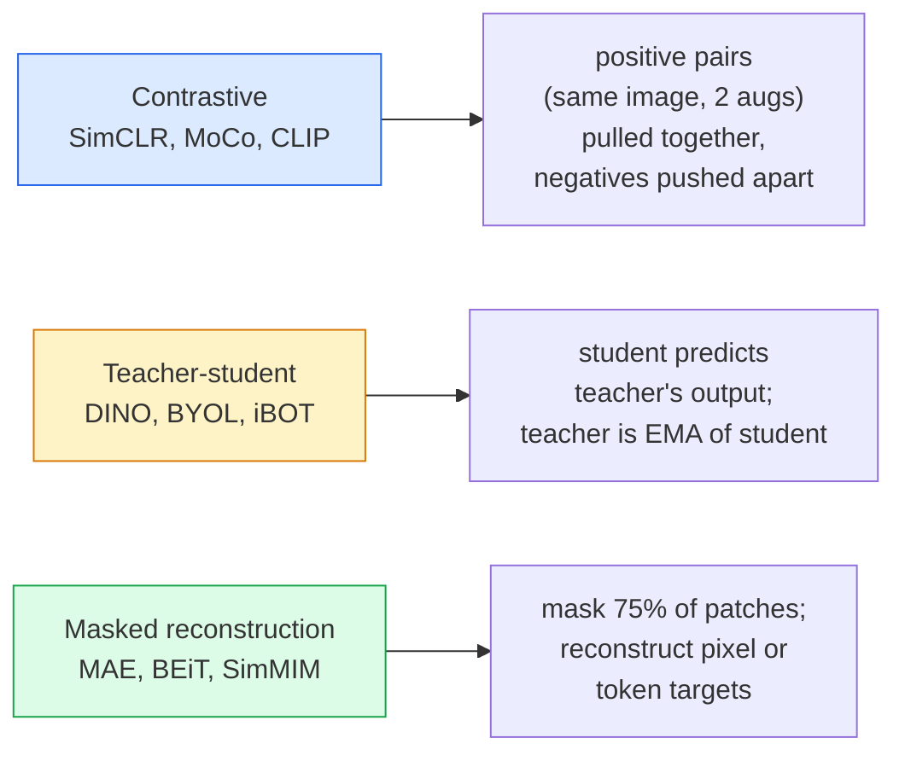

# 自监督视觉学习——SimCLR、DINO、MAE

> 标签是监督式视觉任务的瓶颈。自监督预训练则消除了这一障碍：从1亿张无标签图像中学习视觉特征，再在1万张有标签图像上进行微调。

**类型：** 学习 + 实践
**语言：** Python
**先修知识：** 第4阶段第04课（图像分类）、第4阶段第14课（ViT）
**时长：** 约75分钟

## 学习目标

- 梳理三大主流自监督学习范式——对比学习（SimCLR）、师生模型（DINO）和掩码重建（MAE），并说明每种方法优化的目标是什么
- 从零实现 InfoNCE 损失函数，并解释为何批量大小为 512 可行而批量大小为 32 会失败
- 阐述 MAE 所采用的 75% 掩码比例并非随意设定，以及该比例与 BERT 在文本处理中使用的 15% 比例之间的差异
- 利用 DINOv2 或 MAE ImageNet 的检查点进行线性探测及零样本检索实验

## 问题所在

监督式 ImageNet 数据集包含 130 万张带标签的图像，其标注工作预计耗资 1000 万美元。医疗和工业领域的数据集规模更小，且标注成本更高。每个视觉团队都会思考：是否可以先在价格低廉的无标签数据——如 YouTube 视频帧、网络爬取内容、网络摄像头录像以及卫星扫描图像——上进行预训练，然后再用少量带标签的数据进行微调？

自监督学习便是解决这一问题的方法。基于 LAION 或 JFT 数据集训练的现代自监督 ViT 模型，在经过微调后其准确率可达到或超越监督式 ImageNet 模型的水平。此外，与监督式预训练相比，这类模型在迁移至下游任务（检测、分割、深度分析等）时表现更为优异。目前，DINOv2（Meta，2023 年）和 MAE（Meta，2022 年）已成为生成可迁移视觉特征的常用方案。

其核心理念在于：模型被训练去完成的“前置任务”并不一定就是最终的下游任务。关键在于该任务能够迫使模型学习出有用的特征。无论是预测灰度图像的颜色、旋转图像并要求模型对旋转角度进行分类，还是对图像块进行遮蔽后再重建——这些方法均已被验证有效。目前具有良好扩展性的三种技术路径分别是对比学习、教师-学生蒸馏以及掩码重建。

## 概念概述

### 三个家族



### 对比学习（SimCLR）

选取一张图像，应用两种随机增强操作以生成两个视图。将这两个视图同时输入同一个编码器以及一个投影头中。通过最小化损失函数来实现目标：该损失函数要求“这两个嵌入向量应较为接近”，并且要求“当前嵌入向量与批次中其他所有图像的嵌入向量均保持较大距离”。

```
Loss for positive pair (z_i, z_j) among 2N views per batch:

   L_ij = -log( exp(sim(z_i, z_j) / tau) / sum_k in batch \ {i} exp(sim(z_i, z_k) / tau) )

sim = cosine similarity
tau = temperature (0.1 standard)
```

这就是 InfoNCE 损失函数。它要求每个正样本对应大量的负样本，因此批量大小至关重要——SimCLR 所需的批量大小为 512 至 8192。MoCo 引入了过去批次的动量队列，以此将负样本数量与批量大小解耦。

### 师生对齐模型（DINO）

两个架构相同的网络：学生网络和教师网络。教师网络的权重是学生网络权重的指数移动平均值。两者都会接收经过增强处理的图像视图。学生网络的输出会被训练以与教师网络的输出保持一致——无需使用显式的负样本。

```
loss = CE( student_output(view_1),  teacher_output(view_2) )
     + CE( student_output(view_2),  teacher_output(view_1) )

teacher_weights = m * teacher_weights + (1 - m) * student_weights   (m ≈ 0.996)
```

为何不会简化为“预测常数”：教师的输出会经过居中处理（减去各维度的均值）以及锐化处理（除以较小的温度参数）。居中操作可防止某一维度占据主导地位；锐化操作则能避免输出趋于均匀。

DINO 是在 1.42 亿张精心筛选的图像数据基础上对 DINOv2 进行扩展得到的模型。其生成的特征目前是零样本视觉检索和密集预测领域的最佳技术成果。

### 掩码重建（MAE）

对 ViT 输入中的 75% 的像素块进行掩码处理，仅将可见的 25% 传递给编码器。一个较小的解码器接收编码器的输出以及被掩码位置处的掩码标记，并通过训练来重建这些被掩码像素块的数值。

```
Encoder:  visible 25% of patches -> features
Decoder:  features + mask tokens at masked positions -> reconstructed pixels
Loss:     MSE between reconstructed and original pixels on masked patches only
```

使 MAE 能够有效工作的关键设计选择：

- **75% 的遮罩比例** —— 较高。这一比例迫使编码器学习语义特征；若仅需重建 25% 的区域则几乎轻而易举（相邻像素之间的相关性极高，CNN 即可轻松完成）。
- **非对称的编码器/解码器结构** —— 大型的 ViT 编码器仅处理可见区域的数据块；而小型解码器（8 层、512 维）则负责图像重建。其预训练速度比传统的 BEiT 快 3 倍。
- **像素级重建目标** —— 相较于 BEiT 的分词化目标，该结构更为简单，且在 ViT 上的表现更佳。

预训练完成后可舍弃解码器，编码器即作为特征提取器使用。

### 为何是75%而非15%？

BERT 会屏蔽 15% 的标记，而 MAE 则会屏蔽 75%。两者的差异在于信息密度。

- 自然语言中每个标记的熵值都很高。即便只预测 15% 的标记，难度依然很大，因为每个被屏蔽的位置都有许多合理的填充选项。
- 图像块则具有较低的熵值——未被屏蔽的周边区域往往几乎能完全决定被屏蔽块的像素值。若要让预测需要语义理解，就必须进行更彻底的屏蔽。

75% 这一比例已经高到简单的空间外推方法无法完成该任务；编码器必须能够表征图像内容。

### 线性探针评估

在完成自监督预训练后，标准的评估方法是**线性探针测试**：冻结编码器部分，在其顶部基于 ImageNet 标签训练一个简单的线性分类器，并报告 top-1 准确率。

- SimCLR ResNet-50：约 71%（2020年）
- DINO ViT-S/16：约 77%（2021年）
- MAE ViT-L/16：约 76%（2022年）
- DINOv2 ViT-g/14：约 86%（2023年）

线性探针测试纯粹用于衡量特征质量；虽然微调通常能提升 2-5 个百分点的准确率，但这一提升也包含了头部分重训练所带来的影响。

## 构建它

### 步骤 1：双视图增强流程

```python
import torch
import torchvision.transforms as T

two_view_train = lambda: T.Compose([
    T.RandomResizedCrop(96, scale=(0.2, 1.0)),
    T.RandomHorizontalFlip(),
    T.ColorJitter(0.4, 0.4, 0.4, 0.1),
    T.RandomGrayscale(p=0.2),
    T.ToTensor(),
])


class TwoViewDataset(torch.utils.data.Dataset):
    def __init__(self, base):
        self.base = base
        self.aug = two_view_train()

    def __len__(self):
        return len(self.base)

    def __getitem__(self, i):
        img, _ = self.base[i]
        v1 = self.aug(img)
        v2 = self.aug(img)
        return v1, v2
```

每次调用 __getitem__ 都会返回同一张图像的两个增强后的视图；无需标签。

### 步骤 2：InfoNCE 损失函数

```python
import torch.nn.functional as F

def info_nce(z1, z2, tau=0.1):
    """
    z1, z2: (N, D) L2-normalised embeddings of paired views
    """
    N, D = z1.shape
    z = torch.cat([z1, z2], dim=0)  # (2N, D)
    sim = z @ z.T / tau              # (2N, 2N)

    mask = torch.eye(2 * N, dtype=torch.bool, device=z.device)
    sim = sim.masked_fill(mask, float("-inf"))

    targets = torch.cat([torch.arange(N, 2 * N), torch.arange(0, N)]).to(z.device)
    return F.cross_entropy(sim, targets)
```

在调用之前，需对嵌入向量进行 L2 标准化处理。`tau=0.1` 是 SimCLR 的默认值；该参数越小，损失函数的梯度变化越剧烈，同时需要更多的负样本。

### 步骤 3：对 InfoNCE 进行合理性检查

```python
z1 = F.normalize(torch.randn(16, 32), dim=-1)
z2 = z1.clone()
loss_same = info_nce(z1, z2, tau=0.1).item()
z2_random = F.normalize(torch.randn(16, 32), dim=-1)
loss_random = info_nce(z1, z2_random, tau=0.1).item()
print(f"InfoNCE with identical pairs:  {loss_same:.3f}")
print(f"InfoNCE with random pairs:     {loss_random:.3f}")
```

相同的配对应产生较低的损失值（在批量较大且温度较低时接近 0）。对于包含 16 对样本的批次，随机配对产生的损失值应为 log(2N-1) ≈ log(31) ≈ 3.4。

### 步骤 4：MAE 风格的掩码处理

```python
def random_mask_indices(num_patches, mask_ratio=0.75, seed=0):
    g = torch.Generator().manual_seed(seed)
    n_keep = int(num_patches * (1 - mask_ratio))
    perm = torch.randperm(num_patches, generator=g)
    visible = perm[:n_keep]
    masked = perm[n_keep:]
    return visible.sort().values, masked.sort().values


num_patches = 196
visible, masked = random_mask_indices(num_patches, mask_ratio=0.75)
print(f"visible: {len(visible)} / {num_patches}")
print(f"masked:  {len(masked)} / {num_patches}")
```

简单、快速，且对于给定的种子具有确定性。真正的 MAE 实现会对这些操作进行批处理，并保留每个样本的掩码信息。

## 使用它

DINOv2 是 2026 年的业界标准：

```python
import torch
from transformers import AutoImageProcessor, AutoModel

processor = AutoImageProcessor.from_pretrained("facebook/dinov2-base")
model = AutoModel.from_pretrained("facebook/dinov2-base")
model.eval()

# Per-image embeddings for zero-shot retrieval
with torch.no_grad():
    inputs = processor(images=[pil_image], return_tensors="pt")
    outputs = model(**inputs)
    embedding = outputs.last_hidden_state[:, 0]  # CLS token
```

由此生成的768维嵌入向量是现代图像检索、密集对应关系学习以及零样本迁移流程的核心。针对下游任务进行微调时，通常仅需一个线性层即可满足需求。

在图像-文本嵌入方面，SigLIP或OpenCLIP可视为其对应方案；而对于MAE风格的微调，`timm`仓库中提供了所有的MAE检查点文件。

## 发布它

本课程将生成以下内容：

- `outputs/prompt-ssl-pretraining-picker.md` — 一个根据数据集规模、计算资源及下游任务来选择 SimCLR / MAE / DINOv2 的提示模板。
- `outputs/skill-linear-probe-runner.md` — 一种可用于对任意已冻结的编码器与带标签的数据集执行线性探针评估的工具。

## 练习题

1. **（简单）** 验证当嵌入向量对齐良好时，降低温度值会使 InfoNCE 损失下降；而当嵌入向量随机分布时，降低温度值则会导致损失上升。生成以 `tau in [0.05, 0.1, 0.2, 0.5]` 为横坐标、损失值为纵坐标的图表。
2. **（中等）** 实现 DINO 风格的中心缓冲机制。证明若不使用该中心化处理，模型在短短几轮训练后就会收敛为一个常量向量。
3. **（困难）** 使用第 10 课中的 TinyUNet 作为主干网络，在 CIFAR-100 数据集上训练 MAE 模型。报告在 10、50 和 200 轮训练后的线性探测准确率。并证明在同一组 1,000 张图像的子集上，经过 MAE 预训练的线性探测模型性能优于从零开始训练的监督式线性探测模型。

## 关键术语

| 术语 | 常见说法 | 实际含义 |
|------|----------|----------|
| 自监督学习 | “无标签” | 一种利用无标签数据生成有用表示的预训练任务 |
| 预训练任务 | “虚拟任务” | 在自监督学习中使用的目标函数（如重构补丁、匹配视图）；预训练完成后会被丢弃 |
| 线性探针 | “冻结编码器 + 线性头” | 标准的自监督学习评估方法：仅在冻结后的特征之上训练线性分类器 |
| InfoNCE | “对比损失” | 基于余弦相似度的 softmax 损失函数；正样本为目标类别，其余均为负样本 |
| EMA 教师模型 | “移动平均教师模型” | 其权重为学生模型权重的指数移动平均值；被 BYOL、MoCo、DINO 等方法采用 |
| 遮掩比例 | “遮掩的补丁百分比” | 在 MAE 过程中遮掩的补丁占比；视觉任务为 75%，文本任务为 15% |
| 表示坍塌 | “恒定输出” | 自监督学习失败的一种现象，即编码器对所有输入都输出相同的向量；可通过居中处理、锐化处理或使用负样本来避免 |
| DINOv2 | “生产环境自监督学习骨干网络” | Meta 于 2023 年推出的自监督学习 ViT 模型；在 2026 年时具备最强的通用图像特征提取能力 |

## 延伸阅读

- [SimCLR（Chen 等人，2020）](https://arxiv.org/abs/2002.05709) — 对比学习领域的参考文献  
- [DINO（Caron 等人，2021）](https://arxiv.org/abs/2104.14294) — 带有动量、居中与锐化机制的教师-学生模型  
- [MAE（He 等人，2022）](https://arxiv.org/abs/2111.06377) — 用于 ViT 的掩码自编码器预训练方法  
- [DINOv2（Oquab 等人，2023）](https://arxiv.org/abs/2304.07193) — 将自监督式 ViT 扩展至生产环境特征提取的方案
