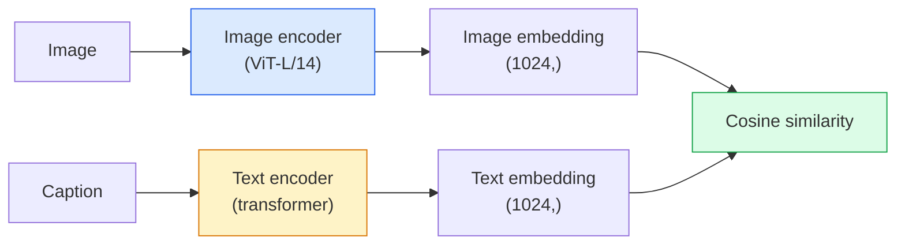

# 开放词汇视觉模型——CLIP

> 将图像编码器与文本编码器一起训练，使得匹配的（图像，标题）对在共享空间中落在同一点上。这就是其中的精髓所在。

**类型：** 构建 + 使用
**语言：** Python
**先修知识：** 第4阶段第14课（ViT），第4阶段第17课（自监督学习）
**耗时：** 约45分钟

## 学习目标

- 解释 CLIP 的双塔架构及其对比学习目标  
- 使用预训练的 CLIP（或 SigLIP）在无需任何任务特定训练的情况下实现零样本分类  
- 从零开始实现零样本分类：对类别提示进行编码、计算余弦相似度并取最大值  
- 区分 CLIP、SigLIP、OpenCLIP 以及 LLaVA/LLaMA-vision 模型——在 2026 年它们各自的应用场景是什么

## 问题所在

传统的分类器采用封闭词汇表：一个包含1000个类别的ImageNet模型只能预测这1000个标签。每增加一个新的类别，都需要相应的标注数据并重新训练模型。

Radford等人于2021年在OpenAI发表的CLIP研究表明，通过使用从网络上收集的4亿对（图像、描述文本）数据进行训练，可以构建出一种在推理阶段能够对任意类别集合进行分类的模型，且这些分类仅通过自然语言来定义。用户只需写一句话即可为其指定新的类别。

正是这种零样本迁移能力，使得所有现代视觉系统都从CLIP系列的预训练模型开始构建。无论是目标检测（Grounding DINO、OWL-ViT）、图像分割（CLIPSeg、SAM）、内容检索、内容审核、大语言模型，还是文本到图像的生成技术，都是基于CLIP风格的联合嵌入机制发展而来的。

## 概念概述

### 两座塔楼



两种编码器均通过线性投影将输出映射至相同的嵌入维度：CLIP-B/32为512，CLIP-L/14为1024。随后对向量进行L2归一化，并计算余弦相似度。

### 目标

给定一批包含 N 对（图像，标题）的数据，构建一个 NxN 的相似度矩阵。对两个编码器进行训练，使得对角线上的元素（匹配对）具有较高的相似度，而非对角线上的元素（不匹配对）则具有较低的相似度。

```
sim_matrix = image_embeddings @ text_embeddings.T / tau

loss_i2t = cross_entropy(sim_matrix,       targets=arange(N))
loss_t2i = cross_entropy(sim_matrix.T,     targets=arange(N))
loss = (loss_i2t + loss_t2i) / 2
```

对称的，因为图像转文本和文本转图像的检索功能都应能够正常工作。`tau`（温度参数）通常作为标量参数进行学习，初始值为 0.07。

### SigLIP：一种更优的损失函数

SigLIP（Zhai 等人，2023）用成对 Sigmoid 函数替换了 Softmax 函数：

```
loss = mean over pairs of log(1 + exp(-y_ij * sim_ij))
y_ij = +1 if matching, -1 otherwise
```

成对损失去除了CLIP所要求的批量级归一化处理。SigLIP在较小批次大小下训练效果更佳，在相同数据量下其性能可达到或超越CLIP。

### 零样本分类

给定一个已训练好的 CLIP 模型：

1. 对每个类别，构造如下提示语：“一张 {class} 的照片”。
2. 使用文本编码器对所有类别的提示语进行编码，得到形状为 `T`（C, d）的向量矩阵。
3. 将测试图像进行编码，得到形状为 `I`（1, d）的向量。
4. 相似度值 = `I @ T.T`，其形状为（1, C）。
5. 通过取最大值的方式确定预测类别。

提示语工程至关重要。OpenAI 发布了 80 种针对 ImageNet 的提示语模板（如“一张 {} 的照片”、“一张模糊的 {} 的照片”、“一幅 {} 的素描”等）。对每个类别的所有模板生成的嵌入向量取平均值，可使 Top-1 准确率提升 1-3%。

### 2026年CLIP风格模型应用场景

- **零样本分类** — 直接使用。
- **图像检索** — 先对所有图像进行一次编码，在推理时再嵌入查询向量。
- **文本条件检测** — Grounding DINO、OWL-ViT 将 CLIP 文本塔结构套在检测器之上。
- **文本条件分割** — CLIPSeg；SAM 通过 CLIP 接收文本提示作为输入。
- **视觉语言模型** — LLaVA、Qwen-VL、InternVL 将 CLIP 系列的视觉编码器接入大语言模型中。
- **文本生成图像** — Stable Diffusion、DALL-E 3 基于 CLIP 文本嵌入进行条件控制。

一旦拥有共享的嵌入空间，所有的视觉与语言任务都可转化为距离计算。

## 构建它

### 步骤 1：一个极小的双塔模型

真正的 CLIP 由 ViT 和 Transformer 组成。在本课程中，这些“塔状结构”实际上是基于预提取特征的小型多层感知机，因此训练信号可以在 CPU 上直接处理。

```python
import torch
import torch.nn as nn
import torch.nn.functional as F


class TwoTower(nn.Module):
    def __init__(self, img_in=128, txt_in=64, emb=64):
        super().__init__()
        self.image_proj = nn.Sequential(nn.Linear(img_in, 128), nn.ReLU(), nn.Linear(128, emb))
        self.text_proj = nn.Sequential(nn.Linear(txt_in, 128), nn.ReLU(), nn.Linear(128, emb))
        self.logit_scale = nn.Parameter(torch.ones([]) * 2.6592)  # ln(1/0.07)

    def forward(self, img_feats, txt_feats):
        i = F.normalize(self.image_proj(img_feats), dim=-1)
        t = F.normalize(self.text_proj(txt_feats), dim=-1)
        return i, t, self.logit_scale.exp()
```

两种投影方式、共享维度输出以及学习得到的温度参数。其结构与真实的 CLIP API 完全一致。

### 步骤 2：对比损失

```python
def clip_loss(image_emb, text_emb, logit_scale):
    N = image_emb.size(0)
    sim = logit_scale * image_emb @ text_emb.T
    targets = torch.arange(N, device=sim.device)
    l_i = F.cross_entropy(sim, targets)
    l_t = F.cross_entropy(sim.T, targets)
    return (l_i + l_t) / 2
```

对称型。logit_scale 值越大，softmax 函数的斜率越陡峭，模型预测的置信度越高，但出现不稳定的风险也越大。

### 步骤 3：零样本分类器

```python
@torch.no_grad()
def zero_shot_classify(model, image_feats, class_text_feats, class_names):
    """
    image_feats:      (N, img_in)
    class_text_feats: (C, txt_in)   one averaged embedding per class
    """
    i = F.normalize(model.image_proj(image_feats), dim=-1)
    t = F.normalize(model.text_proj(class_text_feats), dim=-1)
    sim = i @ t.T
    pred = sim.argmax(dim=-1)
    return [class_names[p] for p in pred.tolist()]
```

每步一行。这正是用于生产环境 CLIP 检查点的精确零样本流程。

### 步骤 4：合理性检查

```python
torch.manual_seed(0)
model = TwoTower()

img = torch.randn(8, 128)
txt = torch.randn(8, 64)
i, t, scale = model(img, txt)
loss = clip_loss(i, t, scale)
print(f"batch size: {i.size(0)}   loss: {loss.item():.3f}")
```

对于随机初始化的模型，其损失值应接近 `log(N) = log(8) = 2.08`，这代表了在尚未学习到任何结构时的对称交叉熵目标值。

## 使用它

在 2026 年，OpenCLIP 是社区默认的选择：

```python
import open_clip
import torch
from PIL import Image

model, _, preprocess = open_clip.create_model_and_transforms("ViT-B-32", pretrained="laion2b_s34b_b79k")
tokenizer = open_clip.get_tokenizer("ViT-B-32")

image = preprocess(Image.open("dog.jpg")).unsqueeze(0)
text = tokenizer(["a photo of a dog", "a photo of a cat", "a photo of a car"])

with torch.no_grad():
    image_features = model.encode_image(image)
    text_features = model.encode_text(text)
    image_features = image_features / image_features.norm(dim=-1, keepdim=True)
    text_features = text_features / text_features.norm(dim=-1, keepdim=True)
    probs = (100.0 * image_features @ text_features.T).softmax(dim=-1)

print(probs)
```

SigLIP版本更新，能在较小规模数据集上取得更好的训练效果，因此更受新研究的青睐：`google/siglip-base-patch16-224`。Hugging Face同时提供了这两个版本。

## 发布它

本课程将生成以下内容：

- `outputs/prompt-zero-shot-class-picker.md` — 一个用于为给定类别列表及领域设计零样本 CLIP 类别模板的提示词。
- `outputs/skill-image-text-retriever.md` — 一种技能，可利用任意 CLIP 检查点构建图像嵌入索引，并支持通过文本或图像进行查询。

## 练习题

1. **（简单）** 使用预训练的 OpenCLIP ViT-B/32，在 CIFAR-10 数据集上采用包含 80 个模板的提示集进行零样本分类。报告 top-1 准确率，该值应处于 85%-90% 左右。
2. **（中等）** 在相同的 CIFAR-10 任务中，比较单模板（“一张 {} 的照片”）与 80 个模板平均嵌入向量之间的差异。量化二者差距，并解释为何模板能起到辅助作用。
3. **（困难）** 构建一个零样本图像检索索引：使用 CLIP 对 1,000 张图片进行嵌入处理，构建 FAISS 索引，然后通过自然语言描述进行查询。针对您自行编写的 20 条保留测试查询，报告 retrieval recall@5 指标。

## 关键术语

| 术语 | 常见说法 | 实际含义 |
|------|----------|----------|
| 双塔结构 | “双编码器” | 分离的图像编码器和文本编码器，最终通过一个共享维度的投影头相连 |
| 零样本学习 | “无需特定任务训练” | 在推理阶段仅依据文本描述的类别进行分类；无需使用任何标签数据 |
| 温度参数 / 对数几率缩放 | “tau” | 一个经过学习的标量值，在应用 softmax 函数之前用于缩放相似度矩阵 |
| 提示词模板 | “一张{}的照片” | 围绕类别名称构建的自然语言包装结构；对多个模板进行平均处理可提升零样本学习的准确率 |
| CLIP | “图像+文本模型” | 2021 年由 OpenAI 开发的模型；已成为 2026 年该领域的标准模型 |
| SigLIP | “Sigmoid CLIP” | 用成对 sigmoid 函数替代 softmax 函数；在小批量训练场景下表现更佳 |
| OpenCLIP | “开源复现版本” | 基于 LAION 数据集由社区训练的 CLIP 变体；是开源流水线中的默认选择 |
| VLM | “视觉语言模型” | 属于 CLIP 系列的编码器与大型语言模型的组合，经过训练后可用于回答关于图像的问题 |

## 延伸阅读

- [CLIP：基于自然语言监督学习可迁移视觉模型（Radford等人，2021年）](https://arxiv.org/abs/2103.00020)
- [SigLIP：用于语言-图像预训练的Sigmoid损失函数（Zhai等人，2023年）](https://arxiv.org/abs/2303.15343)
- [OpenCLIP](https://github.com/mlfoundations/open_clip) —— 社区开源代码库
- [DINOv2与CLIP及MAE的对比：特征分析](https://huggingface.co/blog/dinov2) —— Hugging Face提供的包含并列应用场景的指南
