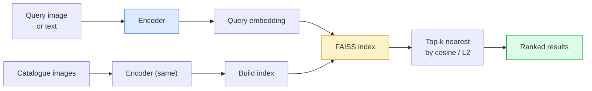

# 图像检索与度量学习

> 检索系统通过嵌入空间中的距离对候选项进行排序。度量学习则是一门用于塑造该空间的学科，旨在使这些距离能够体现预期的含义。

**类型：** 构建
**语言：** Python
**先修知识：** 第4阶段第14课（ViT）、第4阶段第18课（CLIP）
**耗时：** 约45分钟

## 学习目标

- 解释三元组学习、对比学习以及基于代理的度量学习损失函数，并为给定的数据集选择最合适的算法  
- 正确实现 L2 归一化与余弦相似度计算，同时分析“相同物品”检索与“相同类别”检索之间的差异  
- 构建 FAISS 索引，通过文本和图像进行查询，并针对保留的测试集报告 recall@K 指标  
- 使用 DINOv2、CLIP 和 SigLIP 这些现成的嵌入模型作为基础架构，并了解在何种场景下每种模型更具优势

## 问题所在

在工业级视觉系统中，检索技术无处不在：重复内容检测、逆向图像搜索、视觉搜索（“查找相似产品”）、人脸重识别、监控中的人员身份识别，以及电子商务领域的实例级匹配。核心问题始终如一：“给定这张查询图片，请对我的商品目录进行排序。”

整个系统的设计取决于两项关键决策。其一是嵌入模型——即用于生成向量值的模型；其二是索引结构——即如何在大规模数据下快速找到最接近的邻居。截至2026年，这两类技术均已十分成熟（嵌入模型选用DINOv2，索引结构选用FAISS），这反而提升了难度：真正的挑战在于为特定应用定义*何为相似*，并据此构建嵌入空间，使距离度量能够准确反映相似性。

而实现这一目标的技术就是度量学习。这是一门规模虽小但影响力巨大的学科。

## 概念概述

### 一目了然的检索



### 四种损失函数家族

| 损失函数 | 所需输入 | 优点 | 缺点 |
|------|----------|------|------|
| **对比损失** | （锚点，正样本）+ 负样本 | 简单，适用于任意成对标签 | 若负样本数量不足，收敛速度慢 |
| **三元组损失** | （锚点，正样本，负样本） | 直观；可直接控制损失幅度 | 难以挖掘的三元组会导致计算成本高昂 |
| **NT-Xent / InfoNCE** | 成对样本 + 批量挖掘的负样本 | 可扩展至大规模批次 | 需要较大的批次大小或动量队列 |
| **基于代理的损失（ProxyNCA）** | 仅类别标签 | 计算速度快，稳定性高，无需挖掘过程 | 在小规模数据集上可能过度拟合于代理特征 |

### 三元组损失的形式化定义

```
L = max(0, ||f(a) - f(p)||^2 - ||f(a) - f(n)||^2 + margin)
```

将锚点 `a` 拉近正数 `p`，同时将其推离负数 `n`，并设置一定的 `margin` 以确保两者之间存在间隙。这种三图像结构可推广至任意相似性排序方式。

采样策略至关重要：那些容易匹配的三元组（即 `n` 已经与 `a` 相距甚远）不会带来任何损失；只有难以匹配的三元组才能对网络起到训练作用。半困难采样策略（即 `n` 距离 `p` 更远但仍在 `margin` 范围内）是 2016 年 FaceNet 所采用的方案，至今仍占据主导地位。

### 余弦相似度与L2范数

两种度量指标，两种约定：

- **余弦值**：表示向量之间的夹角。要求使用经过 L2 标准化的嵌入向量。
- **L2 距离**：即欧几里得距离。既适用于原始嵌入向量，也适用于标准化后的嵌入向量，但通常会与 L2 标准化值及平方的 L2 值结合使用。

对于大多数现代神经网络而言，这两种度量指标是等价的：当 `||a|| = ||b|| = 1` 时，有 `||a - b||^2 = 2 - 2 cos(a, b)`。请选择与您的嵌入向量训练方式相匹配的约定；混用不同约定会隐式改变“最近”这一概念的含义。

### 召回率@K

标准的检索指标：

```
recall@K = fraction of queries where at least one correct match is in the top K results
```

并列展示 recall@1、@5、@10 的指标。若 recall@10 高于 0.95 而 recall@1 低于 0.5，说明嵌入空间结构合理，但排序结果存在噪声——可尝试更长时间的微调或加入重排步骤。

在重复内容检测中，precision@K 更为重要，因为每一个误报都会导致用户可见的错误。而在视觉搜索中，recall@K 才是核心指标。

### FAISS 是一个高效的开源近似最近邻搜索库，专为大规模向量数据集设计，能够以极低的计算成本快速检索出距离最近的若干个向量实例，常被用于推荐系统、图像搜索、自然语言处理等需要实时向量相似性分析的 AI 工程场景中。

Facebook AI 相似性搜索。这是事实上的最近邻搜索库，提供三种索引选项：

- `IndexFlatIP` / `IndexFlatL2` —— 使用暴力搜索算法，结果精确且无需训练。适用于最多约 100 万个向量。
- `IndexIVFFlat` —— 将数据划分为 K 个单元格，仅搜索距离最近的几个单元格。属于近似算法，速度较快，但需要训练数据。
- `IndexHNSW` —— 基于图结构，对于大量查询而言速度最快，但索引规模较大。

对于 10 万个向量，建议使用基于余弦相似度的 `IndexFlatIP`；对于 1000 万个向量，则适合使用 `IndexIVFFlat`；而对于超过 1 亿个向量，并结合产品量化技术时，则应选用 `IndexIVFPQ`。

### 实例级检索与类别级检索

同名但性质截然不同的两个问题：

- **类别级** — “在我的目录中查找猫。”属于基于类别条件的相似性任务；现成的 CLIP / DINOv2 嵌入模型表现良好。
- **实例级** — “在我的目录中查找*这个确切的产品*。”需要在同一类别下视觉上相似的对象之间进行精细区分；现成的嵌入模型效果不佳；采用度量学习方法进行微调至关重要。

在选择模型之前，务必先明确要解决的是哪一种问题。

## 构建它

### 步骤 1：三元组损失

```python
import torch
import torch.nn.functional as F

def triplet_loss(anchor, positive, negative, margin=0.2):
    d_ap = F.pairwise_distance(anchor, positive, p=2)
    d_an = F.pairwise_distance(anchor, negative, p=2)
    return F.relu(d_ap - d_an + margin).mean()
```

一行代码。适用于已进行L2归一化的嵌入向量或原始嵌入向量。

### 步骤 2：半硬式挖矿

给定一批嵌入向量和标签，为每个锚点找到最难的半难负样本。

```python
def semi_hard_negatives(emb, labels, margin=0.2):
    dist = torch.cdist(emb, emb)
    same_class = labels[:, None] == labels[None, :]
    diff_class = ~same_class
    N = emb.size(0)

    positives = dist.clone()
    positives[~same_class] = float("-inf")
    positives.fill_diagonal_(float("-inf"))
    pos_idx = positives.argmax(dim=1)

    semi_hard = dist.clone()
    semi_hard[same_class] = float("inf")
    d_ap = dist[torch.arange(N), pos_idx].unsqueeze(1)
    semi_hard[dist <= d_ap] = float("inf")
    neg_idx = semi_hard.argmin(dim=1)

    fallback_mask = semi_hard[torch.arange(N), neg_idx] == float("inf")
    if fallback_mask.any():
        hardest = dist.clone()
        hardest[same_class] = float("inf")
        neg_idx = torch.where(fallback_mask, hardest.argmin(dim=1), neg_idx)
    return pos_idx, neg_idx
```

每个锚点都会对应一个最难的正面样本（位于课堂内），以及一个中等难度的负面样本——该样本距离较远，但仍处于允许的误差范围内。

### 步骤 3：Recall@K

```python
def recall_at_k(query_emb, gallery_emb, query_labels, gallery_labels, k=1):
    sim = query_emb @ gallery_emb.T
    _, top_k = sim.topk(k, dim=-1)
    matches = (gallery_labels[top_k] == query_labels[:, None]).any(dim=-1)
    return matches.float().mean().item()
```

对经过 L2 标准化的嵌入向量使用内积进行 Top-k 排序，其结果等同于使用余弦相似度进行的 Top-k 排序。请报告至少存在一个正确邻居的查询的平均比例。

### 第 4 步：整合实现

```python
import torch
import torch.nn as nn
from torch.optim import Adam

class Encoder(nn.Module):
    def __init__(self, in_dim=128, emb_dim=64):
        super().__init__()
        self.net = nn.Sequential(
            nn.Linear(in_dim, 128), nn.ReLU(),
            nn.Linear(128, emb_dim),
        )

    def forward(self, x):
        return F.normalize(self.net(x), dim=-1)

torch.manual_seed(0)
num_classes = 6
protos = F.normalize(torch.randn(num_classes, 128), dim=-1)

def sample_batch(bs=32):
    labels = torch.randint(0, num_classes, (bs,))
    x = protos[labels] + 0.15 * torch.randn(bs, 128)
    return x, labels

enc = Encoder()
opt = Adam(enc.parameters(), lr=3e-3)

for step in range(200):
    x, y = sample_batch(32)
    emb = enc(x)
    pos_idx, neg_idx = semi_hard_negatives(emb, y)
    loss = triplet_loss(emb, emb[pos_idx], emb[neg_idx])
    opt.zero_grad(); loss.backward(); opt.step()
```

运行几百步后，嵌入向量会按类别形成各自的聚类。

## 使用它

2026年的生产环境技术栈：

- **DINOv2 + FAISS** —— 通用视觉检索方案，可直接商用。
- **CLIP + FAISS** —— 查询内容为文本时的解决方案。
- **微调后的 DINOv2 + FAISS** —— 用于实例级检索、人脸重识别、时尚及电子商务领域。
- **Milvus / Weaviate / Qdrant** —— 基于 FAISS 或 HNSW 构建的管理型向量数据库封装。

实现当前最先进的实例检索方案，其架构如下：采用 DINOv2 作为核心模型，添加嵌入头，并利用三元组损失或 InfoNCE 损失对带有实例标签的配对数据进行微调，最终将数据索引至 FAISS 中。

## 发布它

本课程将生成以下内容：

- `outputs/prompt-retrieval-loss-picker.md` — 用于为特定的检索问题选择 triplet / InfoNCE / ProxyNCA 损失函数的提示模板。
- `outputs/skill-recall-at-k-runner.md` — 一种工具，可编写结构清晰的 recall@K 评估框架，支持训练集/验证集/图库数据的分割，并确保数据格式的一致性。

## 练习题

1. **（简单）** 运行上述示例代码。使用 PCA 对训练前后的嵌入向量进行可视化，观察六个聚类是如何形成的。
2. **（中等）** 实现 ProxyNCA 损失函数：为每个类别学习一个“代理”特征，并基于余弦相似度计算标准的交叉熵损失。在该示例数据上对比该损失函数与三元组损失的收敛速度。
3. **（困难）** 取 1,000 张 ImageNet 验证集图像，通过 HuggingFace 使用 DINOv2 对其进行嵌入生成，构建一个 FAISS 平面索引，并报告针对这些图像作为查询时的召回率@{1, 5, 10}（该值应为 1.0），同时也要报告使用 ImageNet 标签作为真实标签的独立数据集上的召回率。

## 关键术语

| 术语 | 常见说法 | 实际含义 |
|------|----------|----------|
|度量学习 | “塑造空间” | 训练编码器，使其输出空间中的距离能够反映目标数据之间的相似性 |
|三元组损失 | “拉近与推开” | L = max(0, d(a, p) - d(a, n) + margin)；即标准的度量学习损失函数 |
|半硬负样本挖掘 | “有用的负样本” | 距离锚点比正样本更远但仍在容差范围内的负样本；经验表明这类样本最具信息量 |
|基于代理的损失函数 | “类别原型” | 每个类别对应一个学到的代理；通过计算与代理的相似度来使用交叉熵损失；无需进行成对挖掘 |
|Recall@K | “Top-K命中率” | 在前K个结果中至少包含一个正确答案的查询比例 |
|实例检索 | “精确查找特定对象” | 高精度匹配方式；现成的特征通常表现不佳 |
|FAISS | “神经网络库” | Facebook开发的最近邻搜索库；支持精确索引与近似索引 |
|HNSW | “图结构索引” | 层次化可导航小世界算法；具有较低内存开销的快速近似最近邻搜索方法 |

## 延伸阅读

- [FaceNet：用于人脸识别的统一嵌入模型（Schroff 等人，2015）](https://arxiv.org/abs/1503.03832) —— 三重损失 / 半硬采样相关论文  
- [为人物重识别中的三重损失辩护（Hermans 等人，2017）](https://arxiv.org/abs/1703.07737) —— 三重损失微调的实用指南  
- [FAISS 文档](https://github.com/facebookresearch/faiss/wiki) —— 每一种索引结构及其权衡因素  
- [SMoT：度量学习分类体系（Kim 等人，2021）](https://arxiv.org/abs/2010.06927) —— 现代损失函数及其关联关系的综述
