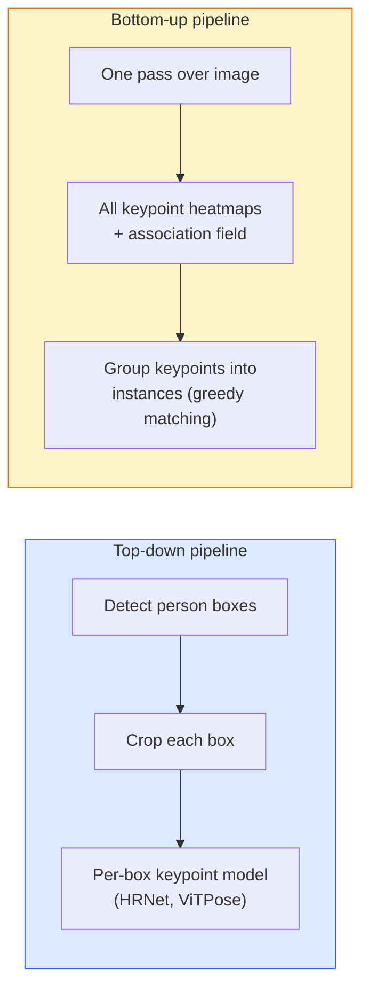

# 关键点检测与姿态估计

> 姿态是一组有序的关键点。关键点检测器实际上是一种热图回归模型，其余部分仅用于记录与统计。

**类型：** 构建
**语言：** Python
**先修知识：** 第4阶段第06课（检测），第4阶段第07课（U-Net）
**耗时：** 约45分钟

## 学习目标

- 区分自上而下与自下而上的姿态估计方法，并说明每种方法的适用场景  
- 以每个关键点为高斯目标来回归 K 个关键点的热图，并在推理阶段提取关键点坐标  
- 解释部分亲和场（Part Affinity Fields, PAFs）以及自下而上处理流程如何将关键点关联到实例中  
- 在实际应用中使用 MediaPipe Pose 或 MMPose 进行关键点估计，并了解它们的输出格式

## 问题所在

关键任务有多种不同的名称：人体姿态（17个身体关节）、面部特征点（68点或478点）、手部（21点）、动物姿态、机器人物体姿态以及医学解剖学特征点。它们都具有相同的结构：在对象上检测K个离散点，并输出这些点的(x, y)坐标。

姿态估计是动作捕捉、健身应用、体育分析、手势控制、动画制作、AR试穿以及机器人抓取技术的基础。2D姿态估计技术已经相当成熟；而3D姿态估计（通过单个摄像头估算世界坐标系中的关节位置）则是当前的研究前沿。

工程实现面临的核心挑战在于处理规模。单张图像中单个人体的姿态估计仅需20毫秒，但以30帧/秒的速度处理人群中多个人的姿态则属于完全不同的问题，需要采用不同的架构来解决。

## 概念概述

### 自上而下与自下而上



- **自上而下法** — 首先检测出所有人，然后对每个裁剪区域运行针对单个人的关键点模型。准确率最高；准确率与人数呈线性增长。
- **自下而上法** — 通过一次前向传播即可预测所有关键点以及关联字段，随后对这些关键点进行分组。无论人群规模如何，处理时间均保持不变。

在准确率方面，自上而下法（如 HRNet、ViTPose）表现最佳；而在处理密集场景的吞吐量方面，自下而上法（如 OpenPose、HigherHRNet）更具优势。

### 热图回归

无需直接对 `(x, y)` 做回归，而是为每个关键点预测一个尺寸为 `H x W` 的热图，该热图的中心位于真实位置，并采用高斯斑点模型表示。

```
target[k, y, x] = exp(-((x - cx_k)^2 + (y - cy_k)^2) / (2 sigma^2))
```

在推理阶段，每个热图的 argmax 值即为预测的关键点位置。

为何热图比直接回归更有效：网络的空间结构（卷积特征图）与空间输出天然契合。高斯目标函数还能起到正则化作用——微小的定位误差只会产生较小的损失，而非零损失。

### 亚像素定位

`argmax` 函数返回的是整数坐标。若需要亚像素级精度，可通过对 `argmax` 值及其邻近值拟合抛物线来进行微调，或采用常用的偏移量方向 `(dx, dy) = 0.25 * (heatmap[y, x+1] - heatmap[y, x-1], ...)`。

### 部件亲和力场（PAF）

OpenPose 的自下而上关联技巧。对于每一对相连的关键点（例如左肩到左肘），预测一个 2 通道场，该场用于编码从一个关键点指向另一个关键点的单位向量。为了将某个肩部关键点与其对应的肘部关键点关联起来，需要沿着候选关键点对之间的连线对 PAF 进行积分；积分值最高的那一对即被视为匹配对。

```
For each connection (limb):
  PAF channels: 2 (unit vector x, y)
  Line integral: sum over sample points of (PAF . line_direction)
  Higher integral = stronger match
```

设计优雅，可扩展至任意规模的人群，且无需为每位用户单独裁剪。

### COCO 关键点

标准的身体姿态数据集：每人有17个关键点，评估指标包括PCK（正确关键点比例）和OKS（对象关键点相似度）。OKS是IoU的关键点对应概念，也是COCO mAP@OKS报告所使用的指标。

### 二维与三维

- **2D姿态** — 图像坐标；已通过 MediaPipe、HRNet、ViTPose 等方法实现生产级精度。
- **3D姿态** — 世界坐标/相机坐标；目前仍处于研究阶段。常见方法包括：
  - 使用小型多层感知机将2D预测提升至3D空间（VideoPose3D）。
  - 直接从图像进行3D回归（PyMAF、MHFormer）。
  - 利用多视图设置获取真实值（CMU Panoptic）。

## 构建它

### 步骤 1：高斯热图目标

```python
import numpy as np
import torch

def gaussian_heatmap(size, cx, cy, sigma=2.0):
    yy, xx = np.meshgrid(np.arange(size), np.arange(size), indexing="ij")
    return np.exp(-((xx - cx) ** 2 + (yy - cy) ** 2) / (2 * sigma ** 2)).astype(np.float32)

hm = gaussian_heatmap(64, 32, 32, sigma=2.0)
print(f"peak: {hm.max():.3f} at ({hm.argmax() % 64}, {hm.argmax() // 64})")
```

沿通道轴堆叠的各关键点热图可呈现完整的目标张量。

### 步骤 2：Tiny 关键点头部

一种输出K个热图通道的U-Net风格模型。

```python
import torch.nn as nn
import torch.nn.functional as F

class TinyKeypointNet(nn.Module):
    def __init__(self, num_keypoints=4, base=16):
        super().__init__()
        self.down1 = nn.Sequential(nn.Conv2d(3, base, 3, 2, 1), nn.ReLU(inplace=True))
        self.down2 = nn.Sequential(nn.Conv2d(base, base * 2, 3, 2, 1), nn.ReLU(inplace=True))
        self.mid = nn.Sequential(nn.Conv2d(base * 2, base * 2, 3, 1, 1), nn.ReLU(inplace=True))
        self.up1 = nn.ConvTranspose2d(base * 2, base, 2, 2)
        self.up2 = nn.ConvTranspose2d(base, num_keypoints, 2, 2)

    def forward(self, x):
        h1 = self.down1(x)
        h2 = self.down2(h1)
        h3 = self.mid(h2)
        u1 = self.up1(h3)
        return self.up2(u1)
```

输入格式为 `(N, 3, H, W)`，输出格式为 `(N, K, H, W)`。损失值为基于高斯目标值的逐像素均方误差。

### 步骤 3：推理——提取关键点坐标

```python
def heatmap_to_coords(heatmaps):
    """
    heatmaps: (N, K, H, W)
    returns:  (N, K, 2) float coordinates in image pixels
    """
    N, K, H, W = heatmaps.shape
    hm = heatmaps.reshape(N, K, -1)
    idx = hm.argmax(dim=-1)
    ys = (idx // W).float()
    xs = (idx % W).float()
    return torch.stack([xs, ys], dim=-1)

coords = heatmap_to_coords(torch.randn(2, 4, 32, 32))
print(f"coords: {coords.shape}")  # (2, 4, 2)
```

推理时每行处理一条数据。对于亚像素级精修，可在 argmax 值周围进行插值处理。

### 步骤 4：合成关键点数据集

简单版：在白色画布上绘制四个点，并学习如何预测它们的位置。

```python
def make_synthetic_sample(size=64):
    img = np.ones((3, size, size), dtype=np.float32)
    rng = np.random.default_rng()
    kps = rng.integers(8, size - 8, size=(4, 2))
    for cx, cy in kps:
        img[:, cy - 2:cy + 2, cx - 2:cx + 2] = 0.0
    hms = np.stack([gaussian_heatmap(size, cx, cy) for cx, cy in kps])
    return img, hms, kps
```

对于小型模型而言，简单到只需一分钟就能学会。

### 第 5 步：模型训练

```python
model = TinyKeypointNet(num_keypoints=4)
opt = torch.optim.Adam(model.parameters(), lr=3e-3)

for step in range(200):
    batch = [make_synthetic_sample() for _ in range(16)]
    imgs = torch.from_numpy(np.stack([b[0] for b in batch]))
    hms = torch.from_numpy(np.stack([b[1] for b in batch]))
    pred = model(imgs)
    # Upsample pred to full resolution
    pred = F.interpolate(pred, size=hms.shape[-2:], mode="bilinear", align_corners=False)
    loss = F.mse_loss(pred, hms)
    opt.zero_grad(); loss.backward(); opt.step()
```

## 使用它

- **MediaPipe Pose** — 谷歌推出的生产级姿态估计工具；提供 WebGL 与移动端运行时，延迟低于 10 毫秒。
- **MMPose**（OpenMMLab）—— 全面的研究代码库；包含所有当前最先进的架构及预训练权重。
- **YOLOv8-pose** — 单次前向传播即可实现的最快速实时多人姿态检测方案。
- **transformers HumanDPT / PoseAnything** — 用于开放词汇表姿态识别的新型视觉语言模型（可识别任意物体及任意关键点集）。

## 发布它

本课程将生成以下内容：

- `outputs/prompt-pose-stack-picker.md` —— 一个提示词，可根据延迟、人群规模以及是否需要 2D/3D 数据来选择 MediaPipe / YOLOv8-pose / HRNet / ViTPose 中的合适模型。
- `outputs/skill-heatmap-to-coords.md` —— 一种功能模块，用于实现所有生产环境姿态模型所使用的亚像素热图转坐标算法。

## 练习题

1. **（简单）** 在合成的4点数据集上训练小型关键点模型。在200步之后，报告预测关键点与真实关键点之间的平均L2误差。
2. **（中等）** 增加亚像素级精修功能：根据argmax位置，从相邻像素出发沿x轴和y轴拟合一维抛物线。报告该功能相比整数argmax方法的精度提升幅度。
3. **（困难）** 构建一个包含两幅图像的合成数据集，每幅图像展示4点模式的两个实例。训练一个自下而上的处理流程，使用PAFs来预测每个关键点属于哪个实例，并评估OKS指标。

## 关键术语

| 术语 | 常见说法 | 实际含义 |
|------|----------|----------|
| 关键点 | “地标” | 对象上的一个特定有序点（关节、角点或特征点） |
| 姿态 | “骨架” | 属于同一实例的一组有序关键点 |
| 自上而下法 | “先检测再建模” | 两阶段流程：人物检测器 + 每个裁剪区域的关键词模型；精度最高 |
| 自下而上法 | “先建模再分组” | 单次遍历完成所有关键点预测并随后进行分组；在人群规模变化时处理时间保持不变 |
| 热图 | “高斯目标” | 每个关键点对应的 H x W 张量，峰值位于真实位置；是首选的回归目标 |
| PAF | “部件亲和场” | 一种包含两个通道的单位向量场，用于编码肢体的方向；用于将关键点分组为实例 |
| OKS | “关键点 IoU” | 对象关键点相似度；用于衡量姿态的 COCO 指标 |
| HRNet | “高分辨率网络” | 主流的自上而下型关键词架构；能够在整个处理过程中保留高分辨率特征 |

## 延伸阅读

- [OpenPose（Cao 等人，2017）](https://arxiv.org/abs/1812.08008) — 基于 PAFs 的自下而上方法；仍是该方法的最佳阐述文档  
- [HRNet（Sun 等人，2019）](https://arxiv.org/abs/1902.09212) — 自上而下的参考架构  
- [ViTPose（Xu 等人，2022）](https://arxiv.org/abs/2204.12484) — 以普通 ViT 作为姿态识别骨干网络；在众多基准测试中处于当前最先进水平  
- [MediaPipe Pose](https://developers.google.com/mediapipe/solutions/vision/pose_landmarker) — 用于生产环境的实时姿态识别方案；2026 年部署速度最快的技术栈
