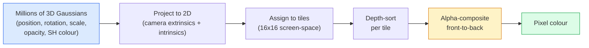

# 从零实现 3D 高斯溅射算法

> 场景由数百万个 3D 高斯点云组成。每个高斯点都包含位置、方向、缩放比例、透明度以及随观察方向变化的颜色。对它们进行光栅化处理，再通过光栅化过程反向传播，即可完成渲染。

**类型：** 构建
**语言：** Python
**先修要求：** 第 4 阶段第 13 课（3D 视觉与 NeRF）、第 1 阶段第 12 课（张量运算），第 4 阶段第 10 课（扩散算法基础，可选）
**耗时：** 约 90 分钟

## 学习目标

- 阐述为何在2026年，3D高斯溅射技术取代了NeRF，成为实现逼真3D重建的业界标准方案。
- 列出每个高斯点所包含的六个参数（位置、旋转四元数、缩放比例、透明度、球面谐波颜色以及可选特征），并说明每种参数占用多少个浮点数值。
- 从零开始使用`alpha`混合技术实现2D高斯溅射光栅化器，随后展示如何将3D场景的渲染逻辑映射到同一循环结构中。
- 利用`nerfstudio`、`gsplat`或`SuperSplat`工具，基于20至50张照片重建场景，并将其导出为`KHR_gaussian_splatting` glTF扩展格式或OpenUSD 26.03版本的`UsdVolParticleField3DGaussianSplat`架构。

## 问题所在

NeRF通过存储多层感知机（MLP）的权重来表示场景。每个渲染出的像素实际上都是沿光线方向进行的数百次MLP查询的结果。其训练过程需要数小时，而渲染仅需几秒钟，且这些权重无法被直接修改——如果想要移动场景中的椅子，就必须重新进行训练。

3D高斯溅射技术（Kerbl、Kopanas、Leimkühler、Drettakis，SIGGRAPH 2023）彻底改变了这一现状。该技术将场景表示为一组明确定义的3D高斯函数。渲染过程可通过GPU光栅化实现，帧率可达100帧以上；训练时间仅需几分钟。此外，对其进行编辑也非常直接：只需调整部分高斯函数的参数，即可实现物体的移动。截至2026年，Khronos Group已批准了针对高斯溅射技术的glTF扩展规范，OpenUSD 26.03版本也包含了相应的架构定义。Zillow和Apartments.com等平台已开始使用该技术进行房地产渲染，而大多数关于3D重建的新研究论文也都是基于这一核心理念的变体。

虽然其概念模型较为简单，但由于涉及复杂的数学运算，大多数入门教程都会从光栅化讲起，直接跳过投影与球面谐波等相关内容。本课程将系统地讲解整个原理——首先介绍2D版本，随后再拓展到3D应用。

## 概念概述

### 高斯分布包含哪些信息

一个 3D 高斯分布是空间中的参数化团块，具有以下属性：

```
position         mu         (3,)    centre in world coordinates
rotation         q          (4,)    unit quaternion encoding orientation
scale            s          (3,)    log-scales per axis (exponentiated at render time)
opacity          alpha      (1,)    post-sigmoid opacity [0, 1]
SH coefficients  c_lm       (3 * (L+1)^2,)   view-dependent colour
```

旋转与缩放运算可构建一个3×3的协方差矩阵：`Sigma = R S S^T R^T`。该矩阵代表了三维空间中高斯分布的形状。球面谐波能够使颜色随观察方向发生变化——产生镜面反光、微妙的光泽以及依赖视角的发光效果——而无需存储针对每个视角的纹理。当球面谐波阶数为3时，每个颜色通道会有16个系数，仅用于表示颜色的高斯分布就需要48个浮点数。

一个场景通常包含100万到500万个高斯分布。每个高斯分布大约需要存储60个浮点数（3 + 4 + 3 + 1 + 48 + 其他数据）。因此，一个包含500万个高斯分布的场景所需存储空间为240 MB——这一数值远小于包含逐点纹理的等效点云，也远远小于在高分辨率下重新渲染的NeRF多层感知机权重所占用的存储空间。

### 光栅化，而非光线追踪



五个步骤，全部兼容 GPU。无需为每个像素执行多层感知机查询。单块 RTX 3080 Ti 即可在 147 帧/秒的速率下渲染 600 万个斑点。

### 投影步骤

位于世界坐标 `mu`、具有三维协方差矩阵 `Sigma` 的三维高斯分布，会投影为位于屏幕坐标 `mu'`、具有二维协方差矩阵 `Sigma'` 的二维高斯分布：

```
mu' = project(mu)
Sigma' = J W Sigma W^T J^T          (2 x 2)

W = viewing transform (rotation + translation of camera)
J = Jacobian of the perspective projection at mu'
```

二维高斯函数的分布区域是一个椭圆，其轴分别为 `Sigma'` 的特征向量。该椭圆内的每个像素都会接收到高斯函数的影响值，该值由公式 `exp(-0.5 * (p - mu')^T Sigma'^-1 (p - mu'))` 进行加权计算。

### 阿尔法混合规则

对于每一个像素，覆盖它的高斯函数会按从后到前的顺序排列（或等价地，使用反向公式按从前到后的顺序排列）。颜色的合成仍采用自20世纪80年代以来所有半透明光栅化器所使用的相同公式：

```
C_pixel = sum_i alpha_i * T_i * c_i

T_i = prod_{j < i} (1 - alpha_j)       transmittance up to i
alpha_i = opacity_i * exp(-0.5 * d^T Sigma'^-1 d)   local contribution
c_i = eval_SH(SH_i, view_direction)    view-dependent colour
```

这**与 NeRF 的体积渲染方程完全相同**，只是将高斯分布显式地表示为稀疏集合，而非沿光线路径的密集采样点。正是由于这一等价性，其渲染质量才能与 NeRF 相媲美——二者实际上都在对相同的辐射场方程进行积分。

### 为何该函数可微分

每一个步骤——投影、瓦片分配、阿尔法混合以及SH评估——均可对高斯参数求导。给定一张真实图像后，计算渲染像素的损失值，通过光栅化器进行反向传播，并利用梯度下降法更新所有的 `(mu, q, s, alpha, c_lm)` 参数。经过约30,000次迭代后，这些高斯分布便能找到其正确的位置、尺度与颜色。

### 密度优化与剪枝

固定数量的高斯分布无法覆盖复杂的场景。训练过程中包含两种自适应机制：

- 当高斯分布的梯度幅值较大但尺度较小时，**克隆**该高斯分布至其当前位置——因为该区域需要更多的细节来重建。
- 当高斯分布的梯度幅值较高时，将其大尺度的版本**拆分**为两个较小的高斯分布——单个大的高斯分布过于平滑，无法适配该区域。
- 对透明度低于阈值的高斯分布进行**剪除**——因为它们已无法对结果产生贡献。

密度增强操作会在每 N 次迭代后执行一次。通常情况下，一个场景的初始高斯分布数量约为 10 万个（由结构光测量点生成），在训练结束时会增加到 100 万至 500 万个。

### 球面谐函数是一类用于描述在球坐标系下具有旋转对称性的函数的数学工具，它通过将角度变量分解为多个正交的基函数来表示任意复杂的波形或场分布，广泛应用于物理、天文以及机器学习中的特征提取与模式识别等领域。

视点依赖颜色是定义在单位球面上的函数 `c(direction)`。球面谐波即为该球面的傅里叶基函数。若将展开次数截断至 `L` 级，则每个通道将拥有 `(L+1)^2` 个基函数。要计算新视点下的颜色，需将学到的球面谐波系数与在观测方向上计算的基函数进行点积运算。当阶数为 0 时，仅有一个系数，对应恒定颜色；当阶数为 3 时，共有 16 个系数，足以实现朗伯反射、镜面反射以及轻微的漫反射效果。SD Gaussian Splatting 相关论文默认使用 3 阶球面谐波。

### 2026年生产环境技术栈

```
1. Capture         smartphone / DJI drone / handheld scanner
2. SfM / MVS       COLMAP or GLOMAP derives camera poses + sparse points
3. Train 3DGS      nerfstudio / gsplat / inria official / PostShot (~10-30 min on RTX 4090)
4. Edit            SuperSplat / SplatForge (clean floaters, segment)
5. Export          .ply -> glTF KHR_gaussian_splatting or .usd (OpenUSD 26.03)
6. View            Cesium / Unreal / Babylon.js / Three.js / Vision Pro
```

### 4D 及其生成式变体

- **4D 高斯飞溅模型** — 高斯函数随时间变化，用于生成体视频（如《超人 2026》、《A

## 构建它

### 步骤 1：二维高斯分布

我们首先构建一个二维光栅化器。经过投影后，三维场景可简化为该二维光栅化器的处理对象。

```python
import torch
import torch.nn as nn
import torch.nn.functional as F


def eval_2d_gaussian(means, covs, points):
    """
    means:  (G, 2)      centres
    covs:   (G, 2, 2)   covariance matrices
    points: (H, W, 2)   pixel coordinates
    returns: (G, H, W)  density at every pixel for every Gaussian
    """
    G = means.size(0)
    H, W, _ = points.shape
    flat = points.view(-1, 2)
    inv = torch.linalg.inv(covs)
    diff = flat[None, :, :] - means[:, None, :]
    d = torch.einsum("gpi,gij,gpj->gp", diff, inv, diff)
    density = torch.exp(-0.5 * d)
    return density.view(G, H, W)
```

`einsum` 会针对每一对（高斯分布，像素）计算二次型 `diff^T Sigma^-1 diff`。

### 步骤 2：二维飞溅光栅化器

前后顺序的阿尔法混合。在二维空间中深度概念并无意义，因此我们使用每个高斯函数对应的学习得到的标量值来表示排序顺序。

```python
def rasterise_2d(means, covs, colours, opacities, depths, image_size):
    """
    means:     (G, 2)
    covs:      (G, 2, 2)
    colours:   (G, 3)
    opacities: (G,)     in [0, 1]
    depths:    (G,)     per-Gaussian scalar used for ordering
    image_size: (H, W)
    returns:   (H, W, 3) rendered image
    """
    H, W = image_size
    yy, xx = torch.meshgrid(
        torch.arange(H, dtype=torch.float32, device=means.device),
        torch.arange(W, dtype=torch.float32, device=means.device),
        indexing="ij",
    )
    points = torch.stack([xx, yy], dim=-1)

    densities = eval_2d_gaussian(means, covs, points)
    alphas = opacities[:, None, None] * densities
    alphas = alphas.clamp(0.0, 0.99)

    order = torch.argsort(depths)
    alphas = alphas[order]
    colours_sorted = colours[order]

    T = torch.ones(H, W, device=means.device)
    out = torch.zeros(H, W, 3, device=means.device)
    for i in range(means.size(0)):
        a = alphas[i]
        out += (T * a)[..., None] * colours_sorted[i][None, None, :]
        T = T * (1.0 - a)
    return out
```

速度不快——实际实现会使用基于瓦片的 CUDA 核函数——但数学运算完全正确且具备全微分性。

### 步骤 3：可训练的二维飞溅场景

```python
class Splats2D(nn.Module):
    def __init__(self, num_splats=128, image_size=64, seed=0):
        super().__init__()
        g = torch.Generator().manual_seed(seed)
        H, W = image_size, image_size
        self.means = nn.Parameter(torch.rand(num_splats, 2, generator=g) * torch.tensor([W, H]))
        self.log_scale = nn.Parameter(torch.ones(num_splats, 2) * math.log(2.0))
        self.rot = nn.Parameter(torch.zeros(num_splats))  # single angle in 2D
        self.colour_logits = nn.Parameter(torch.randn(num_splats, 3, generator=g) * 0.5)
        self.opacity_logit = nn.Parameter(torch.zeros(num_splats))
        self.depth = nn.Parameter(torch.rand(num_splats, generator=g))

    def covs(self):
        s = torch.exp(self.log_scale)
        c, si = torch.cos(self.rot), torch.sin(self.rot)
        R = torch.stack([
            torch.stack([c, -si], dim=-1),
            torch.stack([si, c], dim=-1),
        ], dim=-2)
        S = torch.diag_embed(s ** 2)
        return R @ S @ R.transpose(-1, -2)

    def forward(self, image_size):
        covs = self.covs()
        colours = torch.sigmoid(self.colour_logits)
        opacities = torch.sigmoid(self.opacity_logit)
        return rasterise_2d(self.means, covs, colours, opacities, self.depth, image_size)
```

`log_scale`、`opacity_logit` 和 `colour_logits` 均为无约束参数，在渲染时会通过相应的激活函数进行映射。这是所有 3DGS 实现的标准模式。

### 步骤 4：将二维高斯函数拟合到目标图像上

```python
import math
import numpy as np

def make_target(size=64):
    yy, xx = np.meshgrid(np.arange(size), np.arange(size), indexing="ij")
    img = np.zeros((size, size, 3), dtype=np.float32)
    # Red circle
    mask = (xx - 20) ** 2 + (yy - 20) ** 2 < 10 ** 2
    img[mask] = [1.0, 0.2, 0.2]
    # Blue square
    mask = (np.abs(xx - 45) < 8) & (np.abs(yy - 40) < 8)
    img[mask] = [0.2, 0.3, 1.0]
    return torch.from_numpy(img)


target = make_target(64)
model = Splats2D(num_splats=64, image_size=64)
opt = torch.optim.Adam(model.parameters(), lr=0.05)

for step in range(200):
    pred = model((64, 64))
    loss = F.mse_loss(pred, target)
    opt.zero_grad(); loss.backward(); opt.step()
    if step % 40 == 0:
        print(f"step {step:3d}  mse {loss.item():.4f}")
```

经过超过200步的迭代，64个高斯函数最终会收敛为这两种形状。这正是整个算法的核心思想——在明确的几何原语上执行梯度下降法。

### 第 5 步：从二维到三维

3D 扩展保持了原有的循环结构。新增内容如下：

1. 每个高斯体的旋转采用四元数而非单一角度表示。
2. 协方差矩阵为 `R S S^T R^T`，其中 `R` 由该四元数生成，`S = diag(exp(log_scale))`。
3. 投影操作 `(mu, Sigma) -> (mu', Sigma')` 使用相机外参以及点在 `mu` 处的透视投影雅可比矩阵。
4. 颜色信息通过球面调和函数展开表示，并在观察方向上进行计算。
5. 深度排序依据的是实际的相机空间 z 值，而非学习得到的标量值。

所有实际产品实现（如 `gsplat`、`inria/gaussian-splatting`、`nerfstudio`）均在 GPU 上通过基于分块的 CUDA 核函数来完成上述操作。

### 步骤 6：球面谐波计算

度数不超过 3 的 SH 基函数在每个通道下包含 16 项。计算方法：

```python
def eval_sh_degree_3(sh_coeffs, dirs):
    """
    sh_coeffs: (..., 16, 3)   last dim is RGB channels
    dirs:      (..., 3)       unit vectors
    returns:   (..., 3)
    """
    C0 = 0.282094791773878
    C1 = 0.488602511902920
    C2 = [1.092548430592079, 1.092548430592079,
          0.315391565252520, 1.092548430592079,
          0.546274215296039]
    x, y, z = dirs[..., 0], dirs[..., 1], dirs[..., 2]
    x2, y2, z2 = x * x, y * y, z * z
    xy, yz, xz = x * y, y * z, x * z

    result = C0 * sh_coeffs[..., 0, :]
    result = result - C1 * y[..., None] * sh_coeffs[..., 1, :]
    result = result + C1 * z[..., None] * sh_coeffs[..., 2, :]
    result = result - C1 * x[..., None] * sh_coeffs[..., 3, :]

    result = result + C2[0] * xy[..., None] * sh_coeffs[..., 4, :]
    result = result + C2[1] * yz[..., None] * sh_coeffs[..., 5, :]
    result = result + C2[2] * (2.0 * z2 - x2 - y2)[..., None] * sh_coeffs[..., 6, :]
    result = result + C2[3] * xz[..., None] * sh_coeffs[..., 7, :]
    result = result + C2[4] * (x2 - y2)[..., None] * sh_coeffs[..., 8, :]

    # degree 3 terms omitted here for brevity; full 16-coefficient version in the code file
    return result
```

已了解到，`sh_coeffs` 存储了该高斯函数在各个方向上的“颜色值”。在渲染时，会根据当前的观察方向对这些系数进行计算，从而得到一个三维的 RGB 向量。

## 使用它

对于真正的 3D 游戏引擎开发工作，建议使用 `gsplat`（Meta 出品）或 `nerfstudio`：

```bash
pip install nerfstudio gsplat
ns-download-data example
ns-train splatfacto --data path/to/data
```

`splatfacto` 是 nerfstudio 开发的 3DGS 训练工具。在 RTX 4090 上处理典型场景时，运行时间约为 10 至 30 分钟。

2026 年值得关注的导出格式如下：

- `.ply` — 原始高斯云格式（便于携带，文件体积最大）。
- `.splat` — PlayCanvas / SuperSplat 的量化格式。
- glTF `KHR_gaussian_splatting` — Khronos 标准格式，在不同查看器间均可通用（2026 年 2 月测试版）。
- OpenUSD `UsdVolParticleField3DGaussianSplat` — 原生 USD 格式，适用于 NVIDIA Omniverse 及 Vision Pro 的工作流。

对于 4D/动态场景，`4DGS` 和 `Deformable-3DGS` 则通过引入时变参数和透明度功能，对同一技术框架进行扩展。

## 发布它

本课程将生成以下内容：

- `outputs/prompt-3dgs-capture-planner.md` — 一个用于规划特定场景拍摄方案的提示词，涵盖照片数量、相机移动路径及照明设置。
- `outputs/skill-3dgs-export-router.md` — 一种技能模块，可根据下游查看器或引擎的要求自动选择合适的导出格式（`.ply` / `.splat` / glTF / USD）。

## 练习题

1. **(简单)** 在另一张合成图像上运行上述的 2D splat 训练器。将 `num_splats` 的值设置为 `[16, 64, 256]`，并分别绘制每个设置下的 MSE 随迭代步数的变化曲线。找出收益开始下降的临界点。

2. **(中等)** 扩展该 2D 光栅化器，使其能够支持基于标量“视角”的高斯 RGB 颜色，该视角通过二次谐波函数来定义。使用一对目标图像进行训练，并验证模型能否正确重建这两幅图像。

3. **(困难)** 复制 `nerfstudio` 项目，然后利用你拥有的任意场景的 20 张照片（如办公桌、植物、人脸或房间）来训练 `splatfacto` 模型。将生成的模型导出为 `KHR_gaussian_splatting` 格式的 glTF 文件，并在相应的查看器中打开它（例如 Three.js 的 `GaussianSplats3D`、SuperSplat 或 Babylon.js V9）。需报告训练耗时、高斯函数的数量以及渲染时的帧率。

## 关键术语

| 术语 | 常见说法 | 实际含义 |
|------|----------|----------|
| 3DGS | “高斯溅射” | 将场景显式表示为数百万个三维高斯函数，每个高斯包含位置、旋转、缩放、透明度以及表面颜色信息 |
| 协方差矩阵 | “高斯的形状” | 表达式为 `Sigma = R S S^T R^T`，描述单个高斯的朝向及各向异性缩放特性 |
| Alpha混合模式 | “正反面混合” | 其方程与NeRF的体积渲染相同，只是现在作用于一组显式的稀疏点集上 |
| 密化处理 | “克隆与拆分” | 在重建效果不足的区域自适应地添加新的高斯函数 |
| 剪枝操作 | “删除透明度极低的点” | 移除在训练过程中透明度已降至接近零的高斯点 |
| 球面谐波 | “依赖观察方向的颜色” | 基于球面的傅里叶基，用于将颜色存储为与观察方向相关的函数 |
| Splatfacto | “nerfstudio的3DGS实现” | 2026年最简便的3DGS训练方案 |
| `KHR_gaussian_splatting` | “glTF标准” | Khronos组织在2026年推出的扩展标准，可实现3DGS在不同渲染器和引擎间的兼容性 |

## 延伸阅读

- [用于实时光度场渲染的3D高斯溅射技术（Kerbl等人，SIGGRAPH 2023）](https://repo-sam.inria.fr/fungraph/3d-gaussian-splatting/) —— 原始论文  
- [gsplat（Meta/nerfstudio）](https://github.com/nerfstudio-project/gsplat) —— 具有生产级质量的CUDA光栅化工具  
- [nerfstudio Splatfacto](https://docs.nerf.studio/nerfology/methods/splat.html) —— 参考训练方案  
- [Khronos KHR_gaussian_splatting扩展](https://github.com/KhronosGroup/glTF/blob/main/extensions/2.0/Khronos/KHR_gaussian_splatting/README.md) —— 2026年版本的便携格式  
- [OpenUSD 26.03版本发布说明](https://openusd.org/release/) —— `UsdVolParticleField3DGaussianSplat`架构规范  
- [《2026年高斯溅射技术行业现状》（THE FUTURE 3D）](https://www.thefuture3d.com/blog-0/2026/4/4/state-of-gaussian-splatting-2026) —— 行业概览
