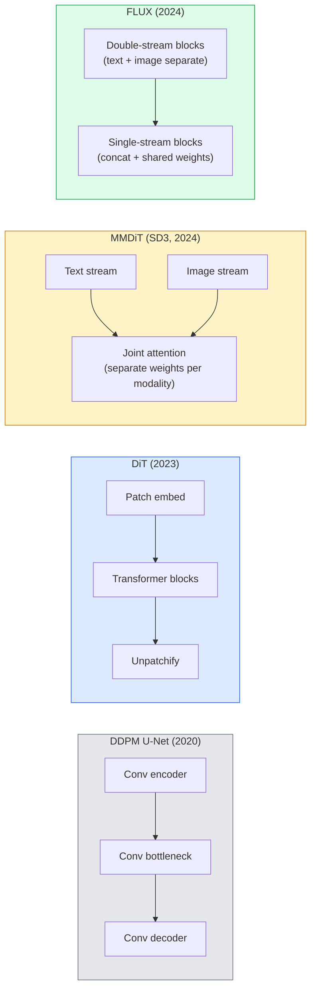

# 扩散变换器与修正流

> U-Net 并非扩散模型的核心秘密。用 Transformer 取代它，将噪声调度改为线性变化，这样便能诞生 SD3、FLUX 以及所有 2026 年推出的文本到图像模型。

**类型：** 学习 + 实践
**语言：** Python
**先修知识：** 第 4 阶段第 10 课（扩散模型 DDPM）、第 4 阶段第 14 课（ViT）、第 7 阶段第 02 课（自注意力机制）
**时长：** 约 75 分钟

## 学习目标

- 追溯从 U-Net DDPM（第10课）到 Diffusion Transformer（DiT）、MMDiT（SD3）以及单双流 DiT（FLUX）的演进历程  
- 解释修正流机制：为何在噪声与数据之间采用直线轨迹能使模型仅需20步即可采样，而非1000步  
- 实现一个简化的 DiT 模块及修正流训练循环，代码行数均控制在100行以内  
- 通过架构、参数量及许可协议等方面区分不同模型版本（SD3、FLUX.1-dev、FLUX.1-schnell、Z-Image、Qwen-Image）

## 问题所在

第10课介绍了基于U-Net去噪器的DDPM模型。该架构在2020年至2023年间占据主导地位：即U-Net结构、beta调度策略以及噪声预测损失函数。正是这一方案催生了Stable Diffusion 1.5与2.1版本，以及DALL-E 2。

到了2026年，所有最先进的文本到图像模型都已超越了这一架构。Stable Diffusion 3、FLUX、SD4、Z-Image、Qwen-Image、Hunyuan-Image等模型均不再使用U-Net，而是采用了扩散变换器（DiT）。SD3和FLUX还用修正流替换了DDPM的噪声调度机制，这种机制能够简化从噪声到数据的转换过程，从而实现1至4步的推理，并保持结果的一致性或生成精简版本。

这一转变至关重要，因为它使得基于扩散的图像生成技术变得可控、能精准响应提示词（SD3/SD4解决了文本渲染问题），且具备较高的生产效率。理解DiT与修正流，就等于掌握了2026年的生成式图像技术体系。

## 概念概述

### 从 U-Net 到 Transformer



- **DiT**（Peebles & Xie，2023）——在潜在特征块上用类似 ViT 的变换器替代 U-Net，并通过自适应层归一化（AdaLN）进行条件控制。
- **MMDiT**（SD3，Esser 等人，2024）——包含两个流，文本与图像令牌分别拥有独立权重，但共享一个联合注意力机制。
- **FLUX**（Black Forest Labs，2024）——前 N 个块采用类似 SD3 的双流结构，后续块则为了在更深层次下提升效率而进行连接并共享权重（单流结构）。
- **Z-Image**（2025）——一种参数量为 60 亿的高效单流 DiT 模型，对“不惜一切代价追求规模”的传统思路提出了挑战。

### 单段格式的修正流程

DDPM将前向过程定义为带有噪声的随机微分方程，其中`x_t`会逐渐受到污染。而学到的反向过程则是另一个随机微分方程，通过1000个小步骤来求解。

修正流则定义了在纯净数据与纯噪声之间的**直线**插值：

```
x_t = (1 - t) * x_0 + t * epsilon,     t in [0, 1]
```

训练一个网络来预测速度 `v_theta(x_t, t) = epsilon - x_0`——即从纯净数据到噪声的直线路径上的前进方向（对应 `dx_t/dt`）。在采样过程中，会沿此速度反向积分，从而从噪声逐步逼近数据。由此产生的常微分方程更接近于直线形式，因此所需的积分步数大幅减少。

SD3将此方法称为**修正流匹配**。FLUX、Z-Image以及大多数2026年的模型均采用相同的目标函数。典型的推理过程为：确定性算法需要20-30个欧拉步骤，而旧版DDPM则需要50个以上的DDIM步骤；经过精简的turbo、schnell和LCM变体则可将步数进一步降至1-4步。

### AdaLN 条件控制

DiT 通过**自适应层归一化**对时间步长以及类别/文本条件进行建模：从条件向量中预测 `scale` 和 `shift` 值，并在 LayerNorm 操作之后应用这些参数。这种方式比 U-Nets 中的 FiLM 风格调制方式，以及所有现代 DiT 的默认实现都要更为简洁高效。

```
cond -> MLP -> (scale, shift, gate)
norm(x) * (1 + scale) + shift, then residual add * gate
```

### SD3与FLUX中的文本编码器

- **SD3** 使用三种文本编码器：两个 CLIP 模型 + T5-XXL。这些嵌入向量会被拼接后作为文本条件输入到图像流中。
- **FLUX** 使用一个 CLIP-L + T5-XXL。
- **Qwen-Image / Z-Image** 变体则使用与其基础大语言模型相匹配的自有文本编码器。

正是由于这些文本编码器的存在，SD3/FLUX 才能比 SD1.5 更好地理解提示词。仅 T5-XXL 一个模型的参数量就高达 47 亿。

### 无分类器引导方法依然有效

修正流只会改变采样器，而不会影响条件处理机制。无分类器引导策略（在训练期间丢弃概率为10%的文本，在推理时混合条件预测与无条件预测）在修正流中依然能够保持相同的效果。2026年发布的多数模型采用的引导系数为3.5至5——这一数值低于SD1.5的7.5，因为修正流模型默认会更严格地遵循提示词内容。

### 一致性、Turbo、Schnell、最小公倍数

同一概念的四种命名方式：将低效的多步骤模型精简为高效的单步或少数步骤模型。

- **LCM（潜在一致性模型）** —— 训练一个“学生模型”，使其能够一步从任意中间状态 `x_t` 预测出最终结果 `x_0`。
- **SDXL Turbo / FLUX schnell** —— 通过对抗性扩散精简技术训练出的1至4步模型。
- **SD Turbo** —— 经过调整以适配潜在空间扩散的OpenAI风格一致性模型。

任何新模型的生产环境部署都会同时提供“全质量”检查点以及“Turbo / schnell”版本。Schnell（德语中意为“快速”，为Black Forest Labs的命名惯例）可在1至4步内完成计算，适用于实时处理流程。

### 2026年的模型格局

| 模型 | 参数量 | 架构 | 许可协议 |
|-------|--------|------|---------|
| Stable Diffusion 3 Medium | 20亿 | MMDiT | SAI Community |
| Stable Diffusion 3.5 Large | 80亿 | MMDiT | SAI Community |
| FLUX.1-dev | 120亿 | 双流 + 单流 DiT | 非商业用途 |
| FLUX.1-schnell | 120亿 | 同上架构，经过压缩优化 | Apache 2.0 |
| FLUX.2 | — | 基于FLUX.1迭代改进 | 混合许可 |
| Z-Image | 60亿 | S3-DiT（可扩展单流架构） | 宽松许可 |
| Qwen-Image | 约200亿 | DiT + Qwen文本塔结构 | Apache 2.0 |
| Hunyuan-Image-3.0 | 约800亿 | DiT架构 | 研究用途 |
| SD4 Turbo | 30亿 | DiT + 压缩优化技术 | SAI商业许可 |

FLUX.1-schnell是2026年默认的开源模型。Z-Image在效率方面表现最佳。FLUX.2与SD4则是目前质量表现最优的模型。

### 为何这种相位偏移如此重要

DDPM + U-Net 方案可行。DiT + 矫正流方案在性能、速度以及扩展性方面均表现**更优**，其发展轨迹与自然语言处理领域中从 RNN 到 Transformer 的演进类似：这两种架构原本用于解决相同的问题，但 Transformer 具备更好的扩展能力，现已成为主流。自 2026 年起，所有关于图像、视频或 3D 生成领域的论文几乎都会采用 DiT 结构的去噪器，并通常搭配矫正流目标函数。目前 U-Net + DDPM 方案主要用作教学示例（第 10 课）。

## 构建它

### 步骤 1：包含 AdaLN 的 DiT 块

```python
import torch
import torch.nn as nn


class AdaLNZero(nn.Module):
    """
    Adaptive LayerNorm with a gate. Predicts (scale, shift, gate) from the conditioning.
    Init such that the whole block starts as identity ("zero init").
    """

    def __init__(self, dim, cond_dim):
        super().__init__()
        self.norm = nn.LayerNorm(dim, elementwise_affine=False)
        self.mlp = nn.Linear(cond_dim, dim * 3)
        nn.init.zeros_(self.mlp.weight)
        nn.init.zeros_(self.mlp.bias)

    def forward(self, x, cond):
        scale, shift, gate = self.mlp(cond).chunk(3, dim=-1)
        h = self.norm(x) * (1 + scale.unsqueeze(1)) + shift.unsqueeze(1)
        return h, gate.unsqueeze(1)


class DiTBlock(nn.Module):
    def __init__(self, dim=192, heads=3, mlp_ratio=4, cond_dim=192):
        super().__init__()
        self.adaln1 = AdaLNZero(dim, cond_dim)
        self.attn = nn.MultiheadAttention(dim, heads, batch_first=True)
        self.adaln2 = AdaLNZero(dim, cond_dim)
        self.mlp = nn.Sequential(
            nn.Linear(dim, dim * mlp_ratio),
            nn.GELU(),
            nn.Linear(dim * mlp_ratio, dim),
        )

    def forward(self, x, cond):
        h, gate1 = self.adaln1(x, cond)
        a, _ = self.attn(h, h, h, need_weights=False)
        x = x + gate1 * a
        h, gate2 = self.adaln2(x, cond)
        x = x + gate2 * self.mlp(h)
        return x
```

`AdaLNZero` 最初为恒等映射，因为其多层感知器权重被初始化为零。训练过程会促使该模块偏离恒等映射状态；这一机制能够显著提升深度Transformer扩散模型的稳定性。

### 步骤 2：微型 DiT 模型

```python
def timestep_embedding(t, dim):
    import math
    half = dim // 2
    freqs = torch.exp(-math.log(10000) * torch.arange(half, device=t.device) / half)
    args = t[:, None].float() * freqs[None]
    return torch.cat([args.sin(), args.cos()], dim=-1)


class TinyDiT(nn.Module):
    def __init__(self, image_size=16, patch_size=2, in_channels=3, dim=96, depth=4, heads=3):
        super().__init__()
        self.patch_size = patch_size
        self.num_patches = (image_size // patch_size) ** 2
        self.patch = nn.Conv2d(in_channels, dim, kernel_size=patch_size, stride=patch_size)
        self.pos = nn.Parameter(torch.zeros(1, self.num_patches, dim))
        self.time_mlp = nn.Sequential(
            nn.Linear(dim, dim * 2),
            nn.SiLU(),
            nn.Linear(dim * 2, dim),
        )
        self.blocks = nn.ModuleList([DiTBlock(dim, heads, cond_dim=dim) for _ in range(depth)])
        self.norm_out = nn.LayerNorm(dim, elementwise_affine=False)
        self.head = nn.Linear(dim, patch_size * patch_size * in_channels)

    def forward(self, x, t):
        n = x.size(0)
        x = self.patch(x)
        x = x.flatten(2).transpose(1, 2) + self.pos
        t_emb = self.time_mlp(timestep_embedding(t, self.pos.size(-1)))
        for blk in self.blocks:
            x = blk(x, t_emb)
        x = self.norm_out(x)
        x = self.head(x)
        return self._unpatchify(x, n)

    def _unpatchify(self, x, n):
        p = self.patch_size
        h = w = int(self.num_patches ** 0.5)
        x = x.view(n, h, w, p, p, -1).permute(0, 5, 1, 3, 2, 4).reshape(n, -1, h * p, w * p)
        return x
```

### 步骤 3：校正流训练

```python
import torch.nn.functional as F

def rectified_flow_train_step(model, x0, optimizer, device):
    model.train()
    x0 = x0.to(device)
    n = x0.size(0)
    t = torch.rand(n, device=device)
    epsilon = torch.randn_like(x0)
    x_t = (1 - t[:, None, None, None]) * x0 + t[:, None, None, None] * epsilon

    target_velocity = epsilon - x0
    pred_velocity = model(x_t, t)

    loss = F.mse_loss(pred_velocity, target_velocity)
    optimizer.zero_grad()
    loss.backward()
    optimizer.step()
    return loss.item()
```

与 DDPM 的噪声预测损失（第 10 课）相比：结构相同，目标不同。我们不再预测噪声 `epsilon`，而是预测**速度** `epsilon - x_0`，该值表示沿直线插值从数据点指向噪声的方向。

### 步骤 4：欧拉采样器

修正流模型对应一个常微分方程。欧拉法是最简单的求解方法，对于训练良好的修正流模型而言，在20步以上迭代时其精度几乎可与更高阶的数值解法相媲美。

```python
@torch.no_grad()
def rectified_flow_sample(model, shape, steps=20, device="cpu"):
    model.eval()
    x = torch.randn(shape, device=device)
    dt = 1.0 / steps
    t = torch.ones(shape[0], device=device)
    for _ in range(steps):
        v = model(x, t)
        x = x - dt * v
        t = t - dt
    return x
```

20步。在经过训练的模型上，其生成的样本质量可与1000步DDPM的样本相媲美。

### 步骤 5：端到端冒烟测试

```python
import numpy as np

def synthetic_blobs(num=200, size=16, seed=0):
    rng = np.random.default_rng(seed)
    out = np.zeros((num, 3, size, size), dtype=np.float32)
    yy, xx = np.meshgrid(np.arange(size), np.arange(size), indexing="ij")
    for i in range(num):
        cx, cy = rng.uniform(4, size - 4, size=2)
        r = rng.uniform(2, 4)
        mask = (xx - cx) ** 2 + (yy - cy) ** 2 < r ** 2
        colour = rng.uniform(-1, 1, size=3)
        for c in range(3):
            out[i, c][mask] = colour[c]
    return torch.from_numpy(out)
```

使用修正流方法在此数据集上训练 `TinyDiT` 模型。经过 500 步迭代后，采样输出应呈现为淡色的色块状形态。

## 使用它

对于使用 FLUX / SD3 / Z-Image 进行真实图像生成的场景，`diffusers` 库为所有模型提供了统一的 API：

```python
from diffusers import FluxPipeline, StableDiffusion3Pipeline
import torch

pipe = FluxPipeline.from_pretrained(
    "black-forest-labs/FLUX.1-schnell",
    torch_dtype=torch.bfloat16,
).to("cuda")

out = pipe(
    prompt="a golden retriever surfing a tsunami, hyperrealistic, studio lighting",
    guidance_scale=0.0,           # schnell was trained without CFG
    num_inference_steps=4,
    max_sequence_length=256,
).images[0]
out.save("surf.png")
```

三行。通过四步完成 `FLUX.1-schnell` 的生成。若需在20-30步内并使用CFG参数获得更高质量的结果，可将模型ID替换为 `black-forest-labs/FLUX.1-dev`。

针对SD3：

```python
pipe = StableDiffusion3Pipeline.from_pretrained(
    "stabilityai/stable-diffusion-3.5-large",
    torch_dtype=torch.bfloat16,
).to("cuda")
out = pipe(prompt, guidance_scale=3.5, num_inference_steps=28).images[0]
```

## 发布它

本课程将生成以下内容：

- `outputs/prompt-dit-model-picker.md` — 根据质量、延迟及许可限制，在 SD3、FLUX.1-dev、FLUX.1-schnell、Z-Image、SD4 Turbo 等模型之间进行选择。
- `outputs/skill-rectified-flow-trainer.md` — 编写基于 AdaLN DiT 与欧拉采样算法的修正流完整训练循环。

## 练习题

1. **（简单）** 使用合成 blob 数据集对上述 TinyDiT 模型进行训练，步数为 500 步。分别使用 10、20 和 50 个欧拉步长生成样本，并进行比较。
2. **（中等）** 通过将学到的类别嵌入与时间嵌入相连接来加入文本条件控制（按颜色区分的 10 种 blob “类别”）。选取类别为 0、5 和 9 的样本，验证其颜色是否一致。
3. **（困难）** 计算在相同数据集上、相同步数下训练得到的经过修正流方法与 DDPM 方法构建的同等规模网络所生成样本之间的弗雷歇距离（作为 FID 的近似值）。并说明哪种方法的收敛速度更快。

## 关键术语

| 术语 | 常见说法 | 实际含义 |
|------|----------|----------|
| DiT | “扩散变换器” | 用该变换器替代 U-Net 作为扩散去噪模块；在分块后的潜变量上进行处理 |
| AdaLN | “自适应层归一化” | 通过学习得到的缩放、偏移及门控机制，在 LayerNorm 之后对时间步或文本进行条件控制；是所有现代 DiT 模型的标准组件 |
| MMDiT | “多模态 DiT（SD3）” | 为文本和图像令牌分别设置权重流，同时共享一个联合自注意力层 |
| 单流 / 双流 | “FLUX 技巧” | 前 N 个块采用双流结构（每种模态拥有独立的权重），后续块则采用单流结构（通过拼接并共享权重）以提高效率 |
| 矫正流 | “从噪声到数据的直线路径” | 在数据与噪声之间进行线性插值；网络负责预测变化速度，从而在推理时减少常微分方程的迭代步数 |
| 速度目标 | “epsilon - x_0” | 矫正流中的回归目标值；表示从纯净数据点指向噪声点的向量 |
| CFG 指导 | “无分类器指导” | 将条件预测与无条件预测相结合；仍被用于矫正流模型中 |
| Schnell / turbo / LCM | “1-4 步蒸馏技术” | 从高质量模型中提取出的小步长变体；适用于生产环境中的实时应用 |

## 延伸阅读

- [基于 Transformer 的可扩展扩散模型（Peebles & Xie，2023）](https://arxiv.org/abs/2212.09748) —— DiT 论文  
- [可扩展的修正流式 Transformer（Esser 等人，SD3 论文）](https://arxiv.org/abs/2403.03206) —— 大规模场景下的 MMDiT 与修正流技术  
- [FLUX.1 模型卡片及技术报告（Black Forest Labs）](https://huggingface.co/black-forest-labs/FLUX.1-dev) —— 双流与单流架构的详细说明  
- [Z-Image：高效图像生成基础模型（2025）](https://arxiv.org/html/2511.22699v1) —— 60 亿参数的单流 DiT 模型  
- [解析扩散模型的设计空间（Karras 等人，2022）](https://arxiv.org/abs/2206.00364) —— 所有扩散模型设计权衡的参考文献  
- [潜在一致性模型（Luo 等人，2023）](https://arxiv.org/abs/2310.04378) —— LCM-LoRA 如何实现四步推理流程
