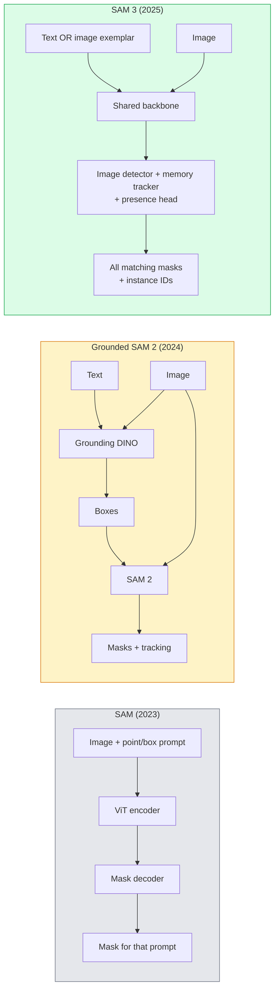

# SAM 3与开放词汇表分割技术

> 给模型输入文本提示和图像，即可获取每个匹配对象的掩码。SAM 3 仅需一次前向传播即可实现该功能。

**类型：** 使用 + 构建
**语言：** Python
**先修知识：** 第4阶段第07课（U-Net）、第4阶段第08课（Mask R-CNN）、第4阶段第18课（CLIP）
**所需时间：** 约60分钟

## 学习目标

- 区分仅支持视觉提示的 SAM、包含检测器与 SAM 组件的 Grounded SAM / SAM 2，以及通过 Promptable Concept Segmentation 支持原生文本提示的 SAM 3。  
- 解释 SAM 3 的架构：共享主干网络 + 图像检测器 + 基于内存的视频跟踪器 + 存在性预测模块 + 分离式的检测器与跟踪器设计。  
- 利用 Hugging Face `transformers` 库中的 SAM 3 组件实现基于文本提示的检测、分割及视频跟踪功能。  
- 根据延迟、概念复杂度以及部署目标，在 SAM 3、Grounded SAM 2、YOLO-World 和 SAM-MI 之间进行选择。

## 问题所在

2023版的SAM仅依赖视觉提示：用户只需点击一个点或绘制一个框，模型便会返回对应的掩码。对于“找出这张照片中的所有橙子”这类需求，需要先使用检测器（Grounding DINO）生成框，再由SAM对每个框进行分割。Grounded SAM将这两个步骤整合为一个流程，但本质上是两个固定模型的级联处理，难免会导致误差累积。

SAM 3（Meta于2025年11月发布，计划在2026年的ICLR会议上展示）打破了这种级联结构。它可直接接收简短的名词短语或图像样本作为提示，在单次前向传播中即可返回所有匹配的掩码及实例ID。这便是**Promptable Concept Segmentation（PCS）**技术。结合2026年3月发布的Object Multiplex更新版本（SAM 3.1），该模型还能高效地追踪视频中的同一概念的多个实例。

本课将探讨这一变革所代表的结构性转变：二维分割、目标检测以及文本-图像对齐功能已融合为一个模型。此时面临的问题不再是“该如何串联不同的处理流程”，而是“哪种支持提示输入的模型能够端到端解决我的应用需求”。

## 概念概述

### 三代产品



### 可提示的概念分割

“概念提示”是指简短的名词短语（如`"黄色校车"`、`"条纹红色雨伞"`、`"手持马克杯的手"`）或图像示例。模型会为图像中所有与该概念匹配的实例返回分割掩码，并为每个匹配项提供一个唯一的实例 ID。

这与传统的视觉提示 SAM 在三个方面有所不同：

1. 无需针对每个实例单独设置提示——一个文本提示即可获取所有匹配结果。
2. 词汇开放——该概念可以是任何能用自然语言描述的事物。
3. 一次返回多个实例，而非每个提示仅对应一个掩码。

### 核心架构组件

- **共享主干网络**——单个 ViT 模型负责处理图像，检测头与基于内存的跟踪器均从中读取特征。
- **存在性检测头**——用于预测图像中是否存在该目标概念，将“是否有此对象？”与“它位于何处？”两个问题解耦，从而减少对不存在对象的误报。
- **解耦式检测器-跟踪器**——图像级检测与视频级跟踪分别采用独立的检测头，避免彼此干扰。
- **内存库**——用于存储各帧中不同实例的特征，以支持视频跟踪（其机制与 SAM 2 相同）。

### 大规模训练

SAM 3 是在由数据引擎生成的 **400万个独特概念** 上进行训练的，该引擎通过人工智能与人工审核相结合的方式不断对数据进行标注与修正。新的 **SA-CO 基准测试** 包含27万个独特概念，其规模是以往基准测试的50倍。在 SA-CO 测试中，SAM 3 的性能可达人类水平的75%至80%，同时在图像和视频的PCS任务上，其性能也是现有系统的两倍。

### SAM 3.1 对象复用

2026年3月更新：**Object Multiplex** 引入了一种共享内存机制，可同时对同一概念的多个实例进行联合跟踪。此前，要跟踪N个实例需要N个独立的内存区域。Multiplex技术将这些内存整合为一个共享内存，并支持针对每个实例的查询操作。其结果是在不牺牲精度的前提下显著提升多目标跟踪的速度。

### 2026年，Grounded SAM为何依然重要

- 当需要更换特定的开放词汇检测器（如 DINO-X、Florence-2）时。
- 当 SAM 3 的许可证限制（需通过 HF 获取）成为障碍时。
- 当需要对检测器的阈值进行比 SAM 3 更精细的控制时。
- 用于对检测器组件进行研究或消融实验。

模块化流水线仍有其应用场景。对于大多数生产环境任务，SAM 3 是更为简单的选择。

### YOLO-World 与 SAM 3 的对比

- **YOLO-World** — 仅支持开放词汇检测（不提供掩码）。具备实时处理能力。当需要以高帧率获取目标框时最为适用。
- **SAM 3** — 支持完整的分割与跟踪功能。处理速度稍慢，但输出结果更为丰富。

在实际生产环境中，YOLO-World 用于仅需快速检测的流程（如机器人导航、快速数据看板），而 SAM 3 则用于需要掩码或跟踪功能的场景。

### SAM-MI 效率

SAM-MI（2025-2026）旨在解决 SAM 解码器的瓶颈问题。核心思路如下：

- **稀疏点提示** —— 仅使用少量精心挑选的点而非密集的提示信息，从而将解码器调用次数减少 96%。
- **浅层掩码聚合** —— 将粗略的掩码预测结果合并为一个更精确的掩码。
- **解耦式掩码注入** —— 解码器接收预先计算好的掩码特征，而无需重复运行相关流程。

测试结果表明：在开放词汇量的基准测试中，其速度相较于 Grounded-SAM 提升了约 1.6 倍。

### 三个模型的输出格式

所有模型的输出均采用相同的通用结构（框体 + 标签 + 分数 + 遮罩值 + ID），这非常方便——下游处理流程无需根据具体使用的模型进行分支处理。

## 构建它

### 步骤 1：提示词构建

构建一个辅助工具，将用户输入的句子转换为一系列 SAM 3 概念提示词。此处正是“用户输入的内容”与“模型接收的内容”之间的分界点。

```python
def split_concepts(sentence):
    """
    Heuristic splitter for multi-concept prompts.
    Returns list of short noun phrases.
    """
    for sep in [",", ";", "and", "or", "&"]:
        if sep in sentence:
            parts = [p.strip() for p in sentence.replace("and ", ",").split(",")]
            return [p for p in parts if p]
    return [sentence.strip()]

print(split_concepts("cats, dogs and balloons"))
```

SAM 3 在每次前向传播中仅能处理一个概念；对于多概念查询，需通过循环或批量处理的方式进行处理。

### 步骤 2：后处理辅助工具

将 SAM 3 的原始输出转换为符合我们第 4 阶段第 16 课流水线规范的整洁检测结果列表。

```python
from dataclasses import dataclass
from typing import List

@dataclass
class ConceptDetection:
    concept: str
    instance_id: int
    box: tuple          # (x1, y1, x2, y2)
    score: float
    mask_rle: str       # run-length encoded


def rle_encode(binary_mask):
    flat = binary_mask.flatten().astype("uint8")
    runs = []
    prev, count = flat[0], 0
    for v in flat:
        if v == prev:
            count += 1
        else:
            runs.append((int(prev), count))
            prev, count = v, 1
    runs.append((int(prev), count))
    return ";".join(f"{v}x{c}" for v, c in runs)
```

RLE 能够确保即使处理大量高分辨率掩码时，响应数据量依然保持较小。该格式在 SAM 2、SAM 3 以及 Grounded SAM 2 中均适用。

### 步骤 3：统一的开放词汇表分词接口

将您使用的任何后端（SAM 3、Grounded SAM 2、YOLO-World + SAM 2）封装在同一个方法中。这样，即使后端发生变更，下游代码也不需要修改。

```python
from abc import ABC, abstractmethod
import numpy as np

class OpenVocabSeg(ABC):
    @abstractmethod
    def detect(self, image: np.ndarray, concept: str) -> List[ConceptDetection]:
        ...


class StubOpenVocabSeg(OpenVocabSeg):
    """
    Deterministic stub used for pipeline testing when real models are not loaded.
    """
    def detect(self, image, concept):
        h, w = image.shape[:2]
        return [
            ConceptDetection(
                concept=concept,
                instance_id=0,
                box=(w * 0.2, h * 0.3, w * 0.5, h * 0.8),
                score=0.89,
                mask_rle="0x100;1x50;0x200",
            ),
            ConceptDetection(
                concept=concept,
                instance_id=1,
                box=(w * 0.55, h * 0.25, w * 0.85, h * 0.75),
                score=0.74,
                mask_rle="0x80;1x40;0x220",
            ),
        ]
```

真正的 `SAM3OpenVocabSeg` 子类会封装 `transformers.Sam3Model` 和 `Sam3Processor`。

### 步骤 4：Hugging Face SAM 3 的使用方法（参考）

对于实际模型，其 `transformers` 集成方式如下：

```python
from transformers import Sam3Processor, Sam3Model
import torch

processor = Sam3Processor.from_pretrained("facebook/sam3")
model = Sam3Model.from_pretrained("facebook/sam3").eval()

inputs = processor(images=pil_image, return_tensors="pt")
inputs = processor.set_text_prompt(inputs, "yellow school bus")

with torch.no_grad():
    outputs = model(**inputs)

masks = processor.post_process_masks(
    outputs.masks, inputs.original_sizes, inputs.reshaped_input_sizes
)
boxes = outputs.boxes
scores = outputs.scores
```

一个提示词，所有匹配结果均在单次调用中返回。

### 第 5 步：测量 Grounded SAM 2 免费提供的结果

客观的基准测试：在真实处理流程中用 SAM 3 替换 Grounded SAM 2 会带来什么变化？

- 延迟：SAM 3 省去了单独的检测器模块，仅需一次前向传播，但模型本身体积更大；通常延迟基本不变或仅有轻微提升。
- 准确率：在罕见概念或复合概念（如“带条纹的红伞”）的处理上，SAM 3 的表现显著更好；对于常见的单字概念，两者表现相近。
- 灵活性：Grounded SAM 2 允许用户更换不同的检测器模型（DINO-X、Florence-2、Grounding DINO 1.5）；而 SAM 3 则为整体式设计。

结论：对于 2026 年的开放词汇分割任务，SAM 3 是首选方案。当需要更高的检测器灵活性或不同的许可条款时，Grounded SAM 2 依然是合适的选择。

## 使用它

生产环境部署模式：

- **实时标注** — SAM 3 + CVAT的“标签作为文本提示”功能。标注员选择标签名称，SAM 3会自动为所有匹配的实例生成初始标签，随后由人工进行审核和修正。
- **视频分析** — 使用SAM 3.1的Object Multiplex功能实现多目标跟踪，并将帧数据输入基于内存的跟踪器中。
- **机器人技术** — 利用SAM 3处理开放词汇表指令（如“拾起红色杯子”），并将其作为规划的基本单元运行。
- **医学影像** — 在医学概念基础上对SAM 3进行微调；使用该功能需向HF提交访问申请。

Ultralytics将其Python包封装为SAM 3：

```python
from ultralytics import SAM

model = SAM("sam3.pt")
results = model(image_path, prompts="yellow school bus")
```

与 YOLO 和 SAM 2 具有相同的接口。

## 发布它

本课程将生成以下内容：

- `outputs/prompt-open-vocab-stack-picker.md` —— 一个提示词，可根据延迟、概念复杂度以及许可情况来选择 SAM 3 / Grounded SAM 2 / YOLO-World / SAM-MI。
- `outputs/skill-concept-prompt-designer.md` —— 一项技能，能够将用户输入的文本转换为结构完整的 SAM 3 概念提示词（包括分词、消歧义及备用方案处理）。

## 练习题

1. **（简单）** 使用您选择的概念提示，在10张图像上运行SAM 3，并将其与在相同图像上运行的SAM 2 + Grounding DINO 1.5进行对比。报告每个模型遗漏了哪些概念。
2. **（中等）** 在SAM 3之上构建一个“点击包含 / 点击排除”的用户界面：文本提示会生成候选实例；用户通过点击决定保留哪些作为正样本。将最终的概念集以JSON格式输出。
3. **（困难）** 使用每类20张带标签的图像，针对自定义概念集（例如5种电子元件）对SAM 3进行微调。将该模型与在相同测试集上运行的零样本SAM 3进行对比，衡量掩码交并比的提升程度。

## 关键术语

| 术语 | 常见说法 | 实际含义 |
|------|----------|----------|
| 开放词汇分割 | “按文本进行分割” | 为自然语言描述的物体生成掩码，而非使用固定的标签集 |
| PCS | “可提示概念分割” | SAM 3的核心任务——给定名词短语或图像示例，对所有匹配的实例进行分割 |
| 概念提示 | “文本输入” | 短小的名词短语或图像示例；并非完整的句子 |
| 存在检测模块 | “它在这里吗？” | SAM 3中的模块，在定位之前判断图像中是否存在该概念 |
| SA-CO | “SAM 3基准测试集” | 包含27万个概念的开放词汇分割基准测试集，规模是此前开放词汇基准测试集的50倍 |
| 多物体跟踪功能 | “SAM 3.1更新版本” | 基于共享内存的多物体跟踪技术；能够快速实现多个实例的联合跟踪 |
| Grounded SAM 2 | “模块化处理流程” | 检测器与SAM 2级联的结构；在需要更换检测器时仍具有实用性 |
| SAM-MI | “高效版SAM” | 通过掩码注入技术，其速度比Grounded-SAM快1.6倍 |

## 延伸阅读

- [SAM 3：基于概念的任意物体分割（arXiv 2511.16719）](https://arxiv.org/abs/2511.16719)
- [SAM 3.1 物体多路复用功能（Meta AI，2026年3月）](https://ai.meta.com/blog/segment-anything-model-3/)
- [Hugging Face上的SAM 3模型页面](https://huggingface.co/facebook/sam3)
- [基于Grounded SAM 2的教程（PyImageSearch）](https://pyimagesearch.com/2026/01/19/grounded-sam-2-from-open-set-detection-to-segmentation-and-tracking/)
- [Ultralytics SAM 3文档](https://docs.ultralytics.com/models/sam-3/)
- [SAM3-I：具备指令感知功能的SAM（arXiv 2512.04585）](https://arxiv.org/abs/2512.04585)
