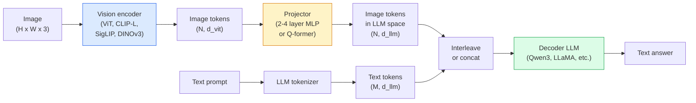

# 视觉语言模型——ViT-MLP-LLM 架构模式

> 视觉编码器将图像转换为标记。多层感知机投影器将这些标记映射到大语言模型的嵌入空间中，其余工作则由语言模型完成。这种“ViT-MLP-LLM”的架构模式已成为2026年所有商用视觉语言模型所采用的标准。

**类型：** 学习 + 实践
**编程语言：** Python
**先修课程：** 第4阶段第14课（ViT）、第4阶段第18课（CLIP）、第7阶段第02课（自注意力机制）
**所需时间：** 约75分钟

## 学习目标

- 阐述 ViT-MLP-LLM 架构，并说明这三个组件各自的作用  
- 从参数量、上下文长度以及基准测试性能三个方面对比 Qwen3-VL、InternVL3.5、LLaVA-Next 和 GLM-4.6V 的表现  
- 解释 DeepStack 的原理：为何多层 ViT 特征比单层最后一层的特征能更有效地实现视觉与语言的对齐  
- 使用跨模态错误率（CMER）来衡量生产环境中的 VLM 幻觉现象，并根据该指标采取相应措施

## 问题所在

CLIP（第4阶段 第18课）为图像和文本提供了一个共享的嵌入空间，这一特性足以支持零样本分类与检索任务。但它无法回答“这张图片中有多少辆红色汽车？”这类问题，因为CLIP并不生成文本——它仅能计算相似度。

视觉语言模型（VLMs），如Qwen3-VL、InternVL3.5、LLaVA-Next、GLM-4.6V等，则是将CLIP系列的图像编码器与完整的语言模型相结合。这类模型在接收到图像和问题后能够生成答案。到2026年，开源的VLMs在多模态基准测试（MMMU、MMBench、DocVQA、ChartQA、MathVista、OSWorld）中的表现已能与GPT-5及Gemini-2.5-Pro相媲美甚至超越它们。

ViT、投影器与LLM这三部分构成了标准架构。不同模型之间的差异体现在所使用的ViT类型、投影器类型、LLM类型、训练数据以及对齐策略上。一旦掌握了这一模式，更换任何组件都变得十分简单。

## 概念概述

### ViT-MLP-LLM 架构



1. **视觉编码器** — 一种预训练的 ViT 模型（如 CLIP-L/14、SigLIP、DINOv3 或其微调版本），用于生成补丁令牌。
2. **投影器** — 一个小型模块（2-4 层的多层感知机或 Q-former），负责将视觉令牌映射到大语言模型的嵌入维度。大部分微调工作都在该模块中进行。
3. **大语言模型** — 仅包含解码器的语言模型（如 Qwen3、Llama、Mistral、GLM、InternLM），按顺序读取视觉与文本令牌并生成文本。

从原理上讲，这三个组件都是可训练的。但在实际应用中，通常保持视觉编码器和大语言模型基本不变，仅对投影器进行训练——通过少量数十亿参数的成本来实现效果。

### DeepStack

Vanilla projection 仅使用最后一个 ViT 层。DeepStack（Qwen3-VL）则从多个不同深度的 ViT 层中采样特征并将其堆叠起来。较深的层负责处理高级语义信息，而较浅的层则负责传递精细的空间与纹理信息。将这两类特征同时输入大语言模型，能够弥合“图像包含什么内容”（语义）与“具体位于何处”（空间定位）之间的差距。

### 三个训练阶段

现代视觉语言模型通过分阶段训练来实现优化：

1. **对齐阶段** — 冻结 ViT 和 LLM 模型，仅对图像与标题配对数据进行投影器训练。该步骤旨在让投影器学会将视觉空间映射到语言空间。
2. **预训练阶段** — 解冻所有模型组件，在大规模的交错式图像-文本数据集（5 亿对以上）上进行训练，从而构建模型的视觉知识库。
3. **指令微调阶段** — 基于精心筛选的（图像、问题、答案）三元组数据进行微调。该步骤用于教授对话行为及任务处理格式，正是这一过程将“具备视觉感知能力的 LM”转化为可用的智能助手。

大多数 LoRA 微调方法均采用小型标注数据集，针对第 3 阶段进行优化。

### 模型系列对比（2026年初）

| 模型 | 参数量 | 视觉编码器 | 大语言模型 | 上下文长度 | 优势 |
|-------|--------|----------------|-----------|---------|-----------|
| Qwen3-VL-235B-A22B (MoE) | 235B（实际激活参数为22B） | 自定义ViT + DeepStack | Qwen3 | 256K | 达到当前最佳性能，支持GUI代理功能 |
| Qwen3-VL-30B-A3B (MoE) | 30B（实际激活参数为3B） | 自定义ViT + DeepStack | Qwen3 | 256K | 更小的MoE架构替代方案 |
| Qwen3-VL-8B (密集型) | 8B | 自定义ViT | Qwen3 | 128K | 生产环境常用的密集型默认模型 |
| InternVL3.5-38B | 38B | InternViT-6B | Qwen3 + GPT-OSS | 128K | 在MMBench和MMVet测试中表现优异 |
| InternVL3.5-241B-A28B | 241B（实际激活参数为28B） | InternViT-6B | Qwen3 | 128K | 性能可与GPT-4o相媲美 |
| LLaVA-Next 72B | 72B | SigLIP | Llama-3 | 32K | 开源模型，易于微调 |
| GLM-4.6V | 约70B | 自定义架构 | GLM | 64K | 开源实现，OCR性能强劲 |
| MiniCPM-V-2.6 | 8B | SigLIP | MiniCPM | 32K | 适合边缘设备使用 |

### 视觉智能体

Qwen3-VL-235B 在 OSWorld 基准测试中取得了全球顶尖的性能，该测试专为操作 GUI（桌面、移动端、网页）的**视觉智能体**设计。该模型能够识别屏幕截图，理解用户界面，并执行相应的操作（点击、输入、滚动）。结合各类工具后，它可完成常见的桌面任务闭环。这正是 2026 年大多数“AI PC”演示在背后所依赖的技术。

### 智能体能力 + RoPE 变体

VLM 需要知晓视频中某一帧的**出现时间**。Qwen3-VL 在 T-RoPE（时序旋转位置嵌入）的基础上发展出了**基于文本的时间对齐机制**——即将明确的时间戳文本标记与视频帧交错排列。该模型能够识别如“`<timestamp 00:32>` 帧，提示词”这样的结构，并据此推断时间上的关联关系。

### 对齐问题

在爬取的训练数据集中，12%的图像-文本对所包含的描述并未完全基于图像内容。在此类数据上训练的视觉语言模型会不知不觉地产生幻觉——虚构物体、误读数字、编造对象间的关系。在实际应用中，这是最主要的故障模式。

Skywork.ai引入了**跨模态错误率（CMER）**来监测这一问题：

```
CMER = fraction of outputs where the text confidence is high but the image-text similarity (via a CLIP-family checker) is low
```

较高的CMER值意味着模型会自信地输出与图像内容无关的信息。通过监控CMER并将其作为生产环境的关键绩效指标，他们在实际部署中将幻觉率降低了约35%。关键不在于“修复模型”，而在于将CMER值过高的输出转交人工进行审核。

### 使用 LoRA / QLoRA 进行微调

对于大多数团队而言，对70B参数规模的超大语言模型进行全量微调是不现实的。在注意力层和投影层上应用秩为16-64的LoRA，或使用4位精度的基础权重实现QLoRA，均可在单台A100/H100硬件上完成训练。所需数据量为5,000至50,000个样本，计算成本在100美元至5,000美元之间，训练时间则为2至10小时。

### 空间推理能力仍然较弱

目前的视觉语言模型在空间推理基准测试中的得分仅为50%-60%（涉及上下、左右、计数及距离判断）。如果您的应用场景需要确定“哪个物体位于另一个物体的上方”，必须进行严格验证——通用视觉语言模型的性能仍低于人类水平。对于纯粹的空间任务，优于视觉语言模型的替代方案包括：专门的关键点/姿态估计器、深度模型，或经过框形几何信息后处理的检测模型。

## 构建它

### 步骤 1：投影仪

您将最常进行训练的模型部分。采用 GELU 激活函数的 2-4 层多层感知机。

```python
import torch
import torch.nn as nn


class Projector(nn.Module):
    def __init__(self, vit_dim=768, llm_dim=4096, hidden=4096):
        super().__init__()
        self.net = nn.Sequential(
            nn.Linear(vit_dim, hidden),
            nn.GELU(),
            nn.Linear(hidden, llm_dim),
        )

    def forward(self, x):
        return self.net(x)
```

输入为一个形状为 `(N_patches, d_vit)` 的令牌张量。输出则为形状为 `(N_patches, d_llm)` 的张量。大语言模型会将每一行输出视为另一个普通令牌。

### 步骤 2：端到端组装 ViT-MLP-LLM 模型

最小化视觉语言模型前向传播的框架结构。实际代码中使用的是 `transformers` 库；此处仅为概念性示意图。

```python
class MinimalVLM(nn.Module):
    def __init__(self, vit, projector, llm, image_token_id):
        super().__init__()
        self.vit = vit
        self.projector = projector
        self.llm = llm
        self.image_token_id = image_token_id  # placeholder token in text prompt

    def forward(self, image, input_ids, attention_mask):
        # 1. vision features
        vision_tokens = self.vit(image)                     # (B, N_patches, d_vit)
        vision_embeds = self.projector(vision_tokens)       # (B, N_patches, d_llm)

        # 2. text embeddings
        text_embeds = self.llm.get_input_embeddings()(input_ids)  # (B, M, d_llm)

        # 3. replace image placeholder tokens with vision embeds
        merged = self._merge(text_embeds, vision_embeds, input_ids)

        # 4. run LLM
        return self.llm(inputs_embeds=merged, attention_mask=attention_mask)

    def _merge(self, text_embeds, vision_embeds, input_ids):
        out = text_embeds.clone()
        expected = vision_embeds.size(1)
        for b in range(input_ids.size(0)):
            positions = (input_ids[b] == self.image_token_id).nonzero(as_tuple=True)[0]
            if len(positions) != expected:
                raise ValueError(
                    f"batch item {b} has {len(positions)} image tokens but vision_embeds has {expected} patches."
                    " Every sample in the batch must be pre-padded to the same number of image placeholder tokens.")
            out[b, positions] = vision_embeds[b]
        return out
```

文本中的 `<image>` 占位符标记会被替换为真实的图像嵌入——这与 LLaVA、Qwen-VL 和 InternVL 所采用的模式相同。

### 步骤 3：CMER 计算

一个轻量级的运行时检查。

```python
import torch.nn.functional as F


def cross_modal_error_rate(image_emb, text_emb, text_confidence, sim_threshold=0.25, conf_threshold=0.8):
    """
    image_emb, text_emb: embeddings of image and generated text (normalised internally)
    text_confidence:     mean per-token probability in [0, 1]
    Returns:             fraction of high-confidence outputs with low image-text alignment
    """
    image_emb = F.normalize(image_emb, dim=-1)
    text_emb = F.normalize(text_emb, dim=-1)
    sim = (image_emb * text_emb).sum(dim=-1)        # cosine similarity
    high_conf_low_sim = (text_confidence > conf_threshold) & (sim < sim_threshold)
    return high_conf_low_sim.float().mean().item()
```

应将 CMER 视为生产环境的关键性能指标。需按端点、提示词类型及客户进行监控。CMER 值上升表明模型在处理某些输入数据时开始出现幻觉现象。

### 步骤 4：玩具级 VLM 分类器（可运行）

演示投影器训练过程。输入虚假的“ViT特征”，一个小型类LLM风格的令牌负责预测类别。

```python
class ToyVLM(nn.Module):
    def __init__(self, vit_dim=32, llm_dim=64, num_classes=5):
        super().__init__()
        self.projector = Projector(vit_dim, llm_dim, hidden=64)
        self.head = nn.Linear(llm_dim, num_classes)

    def forward(self, vision_tokens):
        projected = self.projector(vision_tokens)
        pooled = projected.mean(dim=1)
        return self.head(pooled)
```

在不到200步的时间内，即可将其应用于合成（特征、类别）对上——这足以证明投影器模式是有效的。

## 使用它

2026年生产团队使用大语言视觉模型的三种方式：

- **托管API** — OpenAI Vision、Anthropic Claude Vision、Google Gemini Vision。无需自行搭建基础设施，无供应商风险。
- **开源自托管** — 通过`transformers`和`vllm`使用Qwen3-VL或InternVL3.5。拥有完全控制权，但前期投入较大。
- **领域定制微调** — 加载Qwen2.5-VL-7B或LLaVA-1.6-7B模型，在5千至5万条自定义样本上进行LoRA微调，随后使用`vllm`或`TGI`进行服务部署。

```python
from transformers import AutoProcessor, AutoModelForVision2Seq
import torch
from PIL import Image

model_id = "Qwen/Qwen3-VL-8B-Instruct"
processor = AutoProcessor.from_pretrained(model_id)
model = AutoModelForVision2Seq.from_pretrained(model_id, torch_dtype=torch.bfloat16, device_map="auto")

messages = [{
    "role": "user",
    "content": [
        {"type": "image", "image": Image.open("plot.png")},
        {"type": "text", "text": "What does this chart show?"},
    ],
}]
inputs = processor.apply_chat_template(messages, add_generation_prompt=True, tokenize=True, return_dict=True, return_tensors="pt").to("cuda")
generated = model.generate(**inputs, max_new_tokens=256)
answer = processor.decode(generated[0][inputs["input_ids"].shape[1]:], skip_special_tokens=True)
```

`apply_chat_template` 会隐藏 `<image>` 占位符的标记化处理；模型会在内部完成合并操作。

## 发布它

本课程将生成以下内容：

- `outputs/prompt-vlm-selector.md` — 根据精度、延迟、上下文长度及预算要求，选择 Qwen3-VL / InternVL3.5 / LLaVA-Next / API。
- `outputs/skill-cmer-monitor.md` — 提供用于为生产环境中的 VLM 接口添加监控功能的代码，可实现跨模态错误率统计、各接口专用控制面板以及警报阈值设置。

## 练习题

1. **（简单）** 使用任意已打开的视觉语言模型，对五张图片分别运行三个提示词（“这是什么？”、“统计物体数量”、“描述场景”）。手动为每个回答打分，判定为正确/部分正确/幻觉内容，并计算初步的类似CMER的指标。  
2. **（中等）** 使用LoRA（秩为16）对目标领域的500张带标注图片进行微调，模型可选Qwen2.5-VL-3B或LLaVA-1.6-7B。比较零样本学习与微调后的MMBench风格准确率。  
3. **（困难）** 将视觉语言模型的图像编码器从默认的SigLIP/CLIP替换为DINOv3，仅重新训练投影层（大型语言模型和DINOv3均保持冻结状态）。检测密集预测任务（如计数、空间推理）的性能是否有所提升。

## 关键术语

| 术语 | 常见说法 | 实际含义 |
|------|----------|----------|
| ViT-MLP-LLM | “VLM 模式” | 视觉编码器 + 投影器 + 语言模型；所有 2026 年出现的 VLM 都属于此类 |
| Projector | “桥梁” | 用于将视觉令牌映射到 LLM 嵌入空间的 2-4 层 MLP（或 Q-former） |
| DeepStack | “Qwen3-VL 特性堆叠技巧” | 将多层的 ViT 特性进行堆叠，而不仅仅使用最底层特性 |
| Image token | “<image> 占位符” | 文本流中的特殊令牌，会被投影后的视觉嵌入所替代 |
| CMER | “幻觉 KPI” | 跨模态误差率；当文本置信度较高但图像与文本的相似度较低时该值会升高 |
| Visual agent | “可执行操作的 VLM” | 能够通过工具调用操作 GUI（OSWorld、移动端、网页）的 VLM |
| Q-former | “固定数量令牌桥梁” | 类似 BLIP-2 的投影器，能够生成固定数量的视觉查询令牌 |
| Alignment / pre-training / instruction tuning | “三个阶段” | 标准的 VLM 训练流程 |

## 延伸阅读

- [Qwen3-VL 技术报告 (arXiv 2511.21631)](https://arxiv.org/abs/2511.21631)
- [InternVL3.5：推动开源多模态模型发展 (arXiv 2508.18265)](https://arxiv.org/html/2508.18265v1)
- [LLaVA-Next 系列](https://llava-vl.github.io/blog/2024-05-10-llava-next-stronger-llms/)
- [BentoML：2026 年最佳开源 VLM 模型](https://www.bentoml.com/blog/multimodal-ai-a-guide-to-open-source-vision-language-models)
- [MMMU：多学科多模态理解基准测试](https://mmmu-benchmark.github.io/)
- [制造业中的 VLM 模型（《Robotics Tomorrow》，2026 年 3 月）](https://www.roboticstomorrow.com/story/2026/03/when-machines-learn-to-see-like-experts-the-rise-of-vision-language-models-in-manufacturing/26335/)
