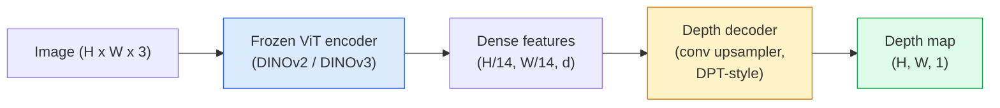

# 单目深度与几何估计

> 深度图是一种单通道图像，其中每个像素代表其到相机的距离。在没有立体视觉或激光雷达的情况下，仅凭一个 RGB 帧是无法预测深度图的。到了 2026 年，结合冻结的 ViT 编码器与轻量级头部结构，其预测结果已能与真实值相差不到几个百分点。

**类型：** 构建 + 应用
**语言：** Python
**先修知识：** 第 4 阶段第 14 课（ViT）、第 4 阶段第 17 课（自监督视觉）、第 4 阶段第 07 课（U-Net）
**耗时：** 约 60 分钟

## 学习目标

- 区分相对深度与度量深度，并说明每种生产模型（MiDaS、Marigold、Depth Anything V3、ZoeDepth）分别解决哪一类问题  
- 利用 Depth Anything V3（基于 DINOv2 的骨干网络）对任意单张图像进行深度预测，且无需校准过程  
- 阐述单目深度感知为何能够从单张图像中获取信息（如透视线索、纹理梯度以及学习到的先验知识），并说明其无法恢复的内容（如绝对尺度、被遮挡的几何结构）  
- 基于深度图与针孔相机的内参，将 2D 检测结果转换为 3D 点云

## 问题所在

深度是二维计算机视觉中缺失的维度。在拥有 RGB 颜色信息的情况下，我们可以知道物体在图像平面上的位置，但却无法得知其距离。深度传感器（如立体结构、激光雷达、飞行时间传感器）虽可直接解决这一问题，但成本高昂、易损且探测范围有限。

单目深度估计——即从单个 RGB 帧中预测深度——过去往往会产生模糊且不可靠的结果。到了 2026 年，经过预训练的大型编码器改变了这一状况：Depth Anything V3 采用了冻结状态的 DINOv2 主干网络，能够生成适用于室内、室外、医疗及卫星领域的通用深度图。Marigold 则将深度问题重新定义为条件扩散问题。ZoeDepth 则通过回归方法来计算真实的度量距离。

深度同时也是二维检测与三维理解之间的桥梁：将检测到的物体框中的像素值乘以深度值，即可将该二维物体转换为三维点云。这正是所有 AR 遮挡系统、避障流程以及“拾起杯子”类机器人的核心原理。

## 概念概述

### 相对深度与度量深度

- **相对深度** — 无实际单位、按顺序排列的 `z` 值。“像素 A 比像素 B 更近，但两者距离的比例并未以米为单位进行标定。”
- **绝对深度** — 相机到目标的实际距离，单位为米。该类型要求模型能够学习图像特征与真实距离之间的统计关联。

MiDaS 和 Depth Anything V3 生成相对深度。Marigold 也生成相对深度。ZoeDepth、UniDepth 和 Metric3D 则生成绝对深度。绝对深度模型对相机的内参较为敏感，而相对深度模型则不受此影响。

### 编解码器模式



Depth Anything V3 会冻结编码器，仅对 DPT 风格的解码器进行训练。编码器负责生成丰富的特征；解码器则将这些特征插值回图像分辨率，并据此反推深度信息。

### 为何单张图像能够呈现深度信息

2D图像包含许多与深度相关的单目线索：

- **透视效应** —— 3D空间中的平行线在2D图像中会汇聚。
- **纹理梯度** —— 距离较远的表面具有更小、更密集的纹理。
- **遮挡顺序** —— 更近的物体会遮挡更远的物体。
- **大小恒常性** —— 已知的物体（如汽车、人类）可提供大致的比例参考。
- **大气透视** —— 在户外场景中，远处的物体会显得更加模糊且呈蓝色。

在数十亿张图像上训练过的ViT模型能够内化这些线索。只要拥有足够的数据和强大的主干网络，无需任何显式的3D监督，单目深度估计就能达到相当高的精度。

### 单目深度感知无法实现的功能

- **绝对度量尺度**：在场景中不存在任何内在特征或已知物体时。网络可以预测“杯子的距离是勺子的两倍”，而无需知道杯子实际上是在1米还是10米远。
- **被遮挡的几何结构**——椅子的背面不可见，因此无法可靠地推断其信息。
- **完全无纹理/高反射率的表面**——如镜子、玻璃、均匀的墙壁。网络会输出看似合理但实际上错误的深度值。

### 2026年推出的Depth Anything V3

- 使用 Vanilla DINOv2 ViT-L/14 作为编码器（参数冻结）。
- DPT 解码器。
- 基于来自不同来源的带姿态图像对进行训练（除光度一致性外无需显式的深度监督）。
- 能够从**任意数量的视觉输入中预测空间上一致的几何结构，无论是否已知相机姿态**。
- 在单目深度估计、任意视角几何重建、视觉渲染以及相机姿态估计算法领域均处于当前最先进水平。

这是 2026 年需要深度信息时可直接使用的模型。

### Marigold — 深度扩散模型

Marigold（Ke 等人，CVPR 2024）将深度估计重新定义为条件图像到图像的扩散过程。条件输入为 RGB 图像，目标输出为深度图。该模型以预训练的 Stable Diffusion 2 U-Net 作为核心架构。其生成的深度图在物体边界处的清晰度极高。但缺点是推理速度较前馈模型慢（需要 10 到 50 步的去噪处理）。

### 内联函数与针孔相机

要将深度为 `d` 的像素 `(u, v)` 转换为相机坐标系下的 3D 点 `(X, Y, Z)`：

```
fx, fy, cx, cy = camera intrinsics
X = (u - cx) * d / fx
Y = (v - cy) * d / fy
Z = d
```

内参来源于EXIF元数据、标定图案，或是单目内参估计器（如Perspective Fields、UniDepth）。即便没有内参，也可以通过假设60-70°的视场角以及中等分辨率的主点来渲染点云——这种方式仅适用于可视化展示，无法用于精确测量。

### 评估

两个标准指标：

- **AbsRel**（绝对相对误差）：`mean(|d_pred - d_gt| / d_gt)`。数值越低越好。生产环境模型通常要求在 0.05 至 0.1 之间。
- **delta < 1.25**（阈值精度）：满足 `max(d_pred/d_gt, d_gt/d_pred) < 1.25` 的像素比例。数值越高越好。最先进的算法通常要求达到 0.9 以上。

对于相对深度模型（如 Depth Anything V3、MiDaS），评估时会使用对尺度和平移具有不变性的指标版本。

## 构建它

### 步骤 1：深度度量指标

```python
import torch

def abs_rel_error(pred, target, mask=None):
    if mask is not None:
        pred = pred[mask]
        target = target[mask]
    return (torch.abs(pred - target) / target.clamp(min=1e-6)).mean().item()


def delta_accuracy(pred, target, threshold=1.25, mask=None):
    if mask is not None:
        pred = pred[mask]
        target = target[mask]
    ratio = torch.maximum(pred / target.clamp(min=1e-6), target / pred.clamp(min=1e-6))
    return (ratio < threshold).float().mean().item()
```

在评估之前，务必对深度值无效的像素（零、NaN、饱和值）进行掩码处理。

### 步骤 2：缩放平移对齐

对于相对深度模型，在计算指标之前需先将预测值与真实值对齐。采用 `a * pred + b = target` 的最小二乘拟合方法：

```python
def align_scale_shift(pred, target, mask=None):
    if mask is not None:
        p = pred[mask]
        t = target[mask]
    else:
        p = pred.flatten()
        t = target.flatten()
    A = torch.stack([p, torch.ones_like(p)], dim=1)
    coeffs, *_ = torch.linalg.lstsq(A, t.unsqueeze(-1))
    a, b = coeffs[:2, 0]
    return a * pred + b
```

在评估 MiDaS / Depth Anything 时，请在调用 `abs_rel_error` 之前先运行 `align_scale_shift`。

### 步骤 3：将深度信息转换为点云

```python
import numpy as np

def depth_to_point_cloud(depth, intrinsics):
    H, W = depth.shape
    fx, fy, cx, cy = intrinsics
    v, u = np.meshgrid(np.arange(H), np.arange(W), indexing="ij")
    z = depth
    x = (u - cx) * z / fx
    y = (v - cy) * z / fy
    return np.stack([x, y, z], axis=-1)


depth = np.random.uniform(0.5, 4.0, (240, 320))
intr = (320.0, 320.0, 160.0, 120.0)
pc = depth_to_point_cloud(depth, intr)
print(f"point cloud shape: {pc.shape}  (H, W, 3)")
```

每个经过三维提升处理的应用都包含一个函数。可将点云导出为 `.ply` 格式，然后在 MeshLab 或 CloudCompare 中打开。

### 步骤 4：使用合成深度场景进行冒烟测试

```python
def synthetic_depth(size=96):
    yy, xx = np.meshgrid(np.arange(size), np.arange(size), indexing="ij")
    # Floor: linear gradient from near (top) to far (bottom)
    depth = 1.0 + (yy / size) * 4.0
    # Box in the middle: closer
    mask = (np.abs(xx - size / 2) < size / 6) & (np.abs(yy - size * 0.6) < size / 6)
    depth[mask] = 2.0
    return depth.astype(np.float32)


gt = torch.from_numpy(synthetic_depth(96))
pred = gt + 0.3 * torch.randn_like(gt)  # simulated prediction
aligned = align_scale_shift(pred, gt)
print(f"before align  absRel = {abs_rel_error(pred, gt):.3f}")
print(f"after align   absRel = {abs_rel_error(aligned, gt):.3f}")
```

### 步骤 5：Depth Anything V3 的使用方法（参考）

```python
import torch
from transformers import pipeline
from PIL import Image

pipe = pipeline(task="depth-estimation", model="LiheYoung/depth-anything-v2-large")

image = Image.open("street.jpg").convert("RGB")
out = pipe(image)
depth_np = np.array(out["depth"])
```

三行代码。`out["depth"]` 是 PIL 格式的灰度图像，需转换为 NumPy 数组以便进行数学运算。针对 Depth Anything V3 版本，在模型发布后只需更换模型 ID 即可，其 API 接口保持不变。

## 使用它

- **Depth Anything V3**（Meta AI / 字节跳动，2024–2026）——用于计算相对深度的默认模型。是生产环境中速度最快的 ViT-large 架构模型。
- **Marigold**（ETH，2024）——视觉质量最高，但推理速度较慢。
- **UniDepth**（ETH，2024）——可结合相机内参估计进行度量深度计算。
- **ZoeDepth**（英特尔，2023）——用于度量深度计算；虽较为老旧，但仍十分可靠。
- **MiDaS v3.1**——属于旧版模型但稳定性良好，可作为对比的基准。

典型的集成流程如下：

1. 接收 RGB 图像帧。
2. 深度模型生成深度图。
3. 检测器输出目标框。
4. 将目标框的质心映射到 3D 空间；如有点云数据，则将其与目标框合并。
5. 后续处理：AR 遮挡检测、路径规划、物体尺寸估算以及立体视觉替代。

对于实时应用场景，经过 INT8 量化的 **Depth Anything V2 Small** 模型在消费级 GPU 上，于 518×518 的分辨率下可实现约 30 帧/秒的运行速度。

## 发布它

本课程将生成以下内容：

- `outputs/prompt-depth-model-picker.md` — 根据延迟、指标与相对精度需求以及场景类型，在 Depth Anything V3、Marigold、UniDepth、MiDaS 这些模型之间进行选择。
- `outputs/skill-depth-to-pointcloud.md` — 一种能够从深度图构建点云的技能，可正确处理内参信息，并将结果导出为 `.ply` 格式。

## 练习题

1. **（简单）** 使用 Depth Anything V2 处理桌面上任意 10 张图片。将生成的深度信息保存为灰度 PNG 文件并进行查看。找出一个预测深度有误的物体，并解释为何单目视觉线索无法提供准确结果。
2. **（中等）** 已知来自 Depth Anything V2 的 RGB 图像及深度数据，将其转换为点云格式并使用 `open3d` 进行渲染。对比两个场景（室内/室外），判断哪个场景看起来更真实。
3. **（困难）** 准备五对仅因某个已知物体的位置发生变化而不同的图片（例如瓶子被移动了 30 厘米）。使用 UniDepth 分别预测这两组图片的标量深度值。报告预测的距离变化量与实际 30 厘米的差异。

## 关键术语

| 术语 | 常见说法 | 实际含义 |
|------|----------|----------|
| 单目深度 | “单图像深度” | 仅通过一个RGB帧进行深度估计，不使用立体视觉或激光雷达 |
| 相对深度 | “有序深度” | 具有顺序的z值，但不包含实际物理单位 |
| 米制深度 | “绝对距离” | 以米为单位的深度；需要校准或经过米制监督训练的模型 |
| AbsRel | “绝对相对误差” | 深度评估标准指标，定义为 |d_pred - d_gt| / d_gt| 的平均值 |
| Delta精度 | “delta < 1.25” | 预测值与真实值的差异在25%以内的像素比例 |
| 小孔相机 | “fx, fy, cx, cy” | 用于将(u, v, d)坐标转换为(X, Y, Z)坐标的相机模型参数 |
| DPT | “密集预测变换器” | 一种基于卷积的解码器，部署在已冻结的ViT编码器之上以生成深度图 |
| DINOv2骨干网络 | “其高效工作的原因” | 无需深度标签即可跨领域泛化的自监督特征提取模型 |

## 延伸阅读

- [Depth Anything V3 论文页面](https://depth-anything.github.io/) — 基于 DINOv2 编码器的最先进单目深度估计方法  
- [Marigold (Ke 等人，CVPR 2024)](https://marigoldmonodepth.github.io/) — 基于扩散模型的深度估计技术  
- [UniDepth (Piccinelli 等人，2024)](https://arxiv.org/abs/2403.18913) — 结合内参的度量型深度估计方法  
- [MiDaS v3.1 (Intel ISL)](https://github.com/isl-org/MiDaS) — 标准化的相对深度基准模型  
- [DINOv3 博文文章 (Meta)](https://ai.meta.com/blog/dinov3-self-supervised-vision-model/) — 提升深度估计精度的编码器系列
