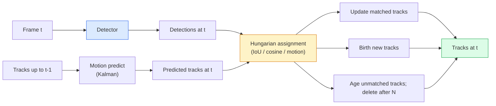

# 多目标跟踪与视频内存管理

> 跟踪即检测与关联的结合。需对每一帧进行检测，并通过 ID 将当前帧的检测结果与上一帧的轨迹对应起来。

**类型：** 构建
**语言：** Python
**先修课程：** 第 4 阶段第 06 课（YOLO 检测）、第 4 阶段第 08 课（Mask R-CNN）、第 4 阶段第 24 课（SAM 3）
**耗时：** 约 60 分钟

## 学习目标

- 区分基于检测的跟踪与基于查询的跟踪，并列举相关算法系列（SORT、DeepSORT、ByteTrack、BoT-SORT、SAM 2内存跟踪器、SAM 3.1对象多路复用）
- 从零实现经典基于检测的跟踪中的IoU + 匈牙利分配算法
- 解释SAM 2的内存库机制，以及为何其相比基于IoU的关联方法能更好地处理遮挡问题
- 阅读三种跟踪评估指标（MOTA、IDF1、HOTA），并判断在特定应用场景下哪种指标最为重要

## 问题所在

检测器能够告知你在单帧图像中物体的位置。而跟踪器则能确定第 `t` 帧中的某个检测结果与第 `t-1` 帧中的哪个检测结果是同一个物体。若没有跟踪器，就无法统计穿过某条线的物体数量、在遮挡情况下追踪球的位置，也无法得知“第4辆汽车已在车道上行驶了8秒”。

对于所有基于视频的产品而言，跟踪功能都是不可或缺的，例如体育数据分析、监控系统、自动驾驶、医学影像分析、野生动物监测以及文字计数等。其核心构成要素是通用的：逐帧检测器、运动模型（卡尔曼滤波或更复杂的模型）、关联步骤（基于交并比/余弦相似度/学习得到的特征所采用的匈牙利算法），以及跟踪对象的生命周期（生成、更新、消失）。

2026年出现了两种新的技术模式：**SAM 2基于内存的跟踪机制**（采用特征记忆而非运动模型进行关联）以及**SAM 3.1对象复用功能**（为同一概念的多个实例共享内存）。本课程将首先介绍传统的跟踪架构，随后讲解基于内存的跟踪方法。

## 概念概述

### 基于检测的跟踪



在 2026 年出现的所有跟踪器都是这一循环结构的变体。具体差异如下：

- **SORT**（2016）：卡尔曼滤波器 + IoU 匈牙利算法。结构简单、速度较快，且不依赖外观模型。
- **DeepSORT**（2017）：在 SORT 的基础上为每个跟踪目标添加基于 CNN 的外观特征（ReID 嵌入）。能够更好地处理目标交叉的情况。
- **ByteTrack**（2021）：将置信度较低的检测结果作为第二阶段进行处理；无需外观特征，但在 MOT17 数据集上的性能表现最佳。
- **BoT-SORT**（2022）：结合了 ByteTrack 的机制、相机运动补偿以及 ReID 技术。
- **StrongSORT / OC-SORT** —— 作为 ByteTrack 的衍生版本，在处理运动信息和外观特征方面具有更优的性能。

### 卡尔曼滤波器是一种基于线性系统模型与观测数据的递推算法，通过融合先验估计与实时观测信息来逐步优化状态估计值，其核心在于利用预测步骤生成系统的理论状态向量，并结合观测更新步骤根据实际测量结果调整该估计，从而在存在噪声干扰的情况下实现高精度的状态跟踪。

卡尔曼滤波器会为每条轨迹维护一个包含状态值 `(x, y, w, h, dx, dy, dw, dh)` 及其协方差的模型。在每一帧中，首先利用恒定速度模型对状态进行**预测**，随后根据匹配到的检测结果进行**更新**。当预测的不确定性较高时，更新过程会更多依赖检测结果。这种方式能够生成平滑的轨迹，并使轨迹能够在短暂的遮挡（1-5帧）后继续追踪。  

所有的经典跟踪器都在运动预测步骤中采用卡尔曼滤波器。

### 匈牙利算法

给定一个 `M x N` 的成本矩阵（轨迹数 × 检测数），寻找能够使总成本最小的单射分配方案。该成本通常为 `1 - IoU(track_bbox, detection_bbox)` 或外观特征的负余弦相似度。其时间复杂度为 O((M+N)^3)；当 M 和 N 的值均不超过约 1000 时，使用 Python 中的 `scipy.optimize.linear_sum_assignment` 即可实现快速计算。

### ByteTrack 的核心理念

标准跟踪器会丢弃置信度较低的检测结果（< 0.5）。而 ByteTrack 会将这些检测结果作为**第二阶段候选项**保留下来：在将跟踪目标与高置信度的检测结果匹配之后，未匹配的跟踪目标会尝试以稍宽松的 IoU 阈值来与低置信度的检测结果进行匹配。这样能够恢复因短暂遮挡或人群密集导致的身份切换问题。

### SAM 2 基于内存的跟踪机制

SAM 2 通过维护一个存储每个实例时空特征的**内存库**来处理视频。当接收到某一帧上的提示（点击、框选、文本）时，它会将该实例编码并存入内存中。在后续帧中，该内存会与新帧的特征进行交叉注意力计算，解码器则会生成新帧中同一实例的掩码。

无需卡尔曼滤波器，也无需匈牙利匹配算法。这种关联关系通过内存-注意力操作隐式实现。

优点：
- 对严重遮挡具有较强鲁棒性（内存能够跨多帧保留实例身份）。
- 结合 SAM 3 的文本提示时具备开放词汇能力。
- 无需单独的运动模型即可工作。

缺点：
- 在多目标跟踪任务中的性能低于 ByteTrack。
- 内存库会不断增长，从而限制上下文窗口的大小。

### SAM 3.1 对象复用

在先前的 SAM 2 / SAM 3 跟踪系统中，每个实例都会维护独立的记忆库。对于 50 个目标对象，就需要 50 个记忆库。而“对象复用”技术（2026 年 3 月推出）则通过**针对每个实例的查询令牌**将它们合并为一个共享内存。其成本随实例数量的增加呈次线性增长。

到 2026 年，“对象复用”将成为人群跟踪任务的默认方案，适用于音乐会现场的人群、仓库工人以及交通路口等场景。

### 需要了解的三个指标

- **MOTA（多目标跟踪精度）** — 1 - (FN + FP + ID切换次数) / GT。该指标会根据错误类型进行加权，是一个将检测失败与关联失败合并计算的单一指标。
- **IDF1（ID F1分数）** — ID精确度与召回率的调和平均值。它专门用于衡量每个真实轨迹在时间推移中保持其ID的能力。对于对ID切换敏感的任务而言，该指标优于MOTA。
- **HOTA（高阶跟踪精度）** — 可分解为检测精度(DetA)和关联精度(AssA)。自2020年起成为行业标准，是综合性最强的指标。

在监控应用中（用于识别人员身份）：应报告IDF1分数。在体育数据分析中（用于统计传球次数）：应使用HOTA。在一般的学术对比中：同样推荐使用HOTA。

## 构建它

### 步骤 1：基于 IoU 的成本矩阵

```python
import numpy as np


def bbox_iou(a, b):
    """
    a, b: (N, 4) arrays of [x1, y1, x2, y2].
    Returns (N_a, N_b) IoU matrix.
    """
    ax1, ay1, ax2, ay2 = a[:, 0], a[:, 1], a[:, 2], a[:, 3]
    bx1, by1, bx2, by2 = b[:, 0], b[:, 1], b[:, 2], b[:, 3]
    inter_x1 = np.maximum(ax1[:, None], bx1[None, :])
    inter_y1 = np.maximum(ay1[:, None], by1[None, :])
    inter_x2 = np.minimum(ax2[:, None], bx2[None, :])
    inter_y2 = np.minimum(ay2[:, None], by2[None, :])
    inter = np.clip(inter_x2 - inter_x1, 0, None) * np.clip(inter_y2 - inter_y1, 0, None)
    area_a = (ax2 - ax1) * (ay2 - ay1)
    area_b = (bx2 - bx1) * (by2 - by1)
    union = area_a[:, None] + area_b[None, :] - inter
    return inter / np.clip(union, 1e-8, None)
```

### 步骤 2：最小化版的 SORT 风格跟踪器

为简洁起见，此处省略了恒定速度卡尔曼滤波器的实现——我们在此使用简单的交并比关联方法；在实际应用中，卡尔曼预测是必不可少的。Python 的 `sort` 包提供了完整版本。

```python
from scipy.optimize import linear_sum_assignment


class Track:
    def __init__(self, tid, bbox, frame):
        self.id = tid
        self.bbox = bbox
        self.last_frame = frame
        self.hits = 1

    def update(self, bbox, frame):
        self.bbox = bbox
        self.last_frame = frame
        self.hits += 1


class SimpleTracker:
    def __init__(self, iou_threshold=0.3, max_age=5):
        self.tracks = []
        self.next_id = 1
        self.iou_threshold = iou_threshold
        self.max_age = max_age

    def step(self, detections, frame):
        if not self.tracks:
            for d in detections:
                self.tracks.append(Track(self.next_id, d, frame))
                self.next_id += 1
            return [(t.id, t.bbox) for t in self.tracks]

        track_boxes = np.array([t.bbox for t in self.tracks])
        det_boxes = np.array(detections) if len(detections) else np.empty((0, 4))

        iou = bbox_iou(track_boxes, det_boxes) if len(det_boxes) else np.zeros((len(track_boxes), 0))
        cost = 1 - iou
        cost[iou < self.iou_threshold] = 1e6

        matched_track = set()
        matched_det = set()
        if cost.size > 0:
            row, col = linear_sum_assignment(cost)
            for r, c in zip(row, col):
                if cost[r, c] < 1.0:
                    self.tracks[r].update(det_boxes[c], frame)
                    matched_track.add(r); matched_det.add(c)

        for i, d in enumerate(det_boxes):
            if i not in matched_det:
                self.tracks.append(Track(self.next_id, d, frame))
                self.next_id += 1

        self.tracks = [t for t in self.tracks if frame - t.last_frame <= self.max_age]
        return [(t.id, t.bbox) for t in self.tracks]
```

60行代码。输入每帧的检测结果，输出每帧的跟踪ID。实际系统中还会加入卡尔曼预测、ByteTrack的第二阶段重匹配以及外观特征处理。

### 步骤 3：合成轨迹测试

```python
def synthetic_frames(num_frames=20, num_objects=3, H=240, W=320, seed=0):
    rng = np.random.default_rng(seed)
    starts = rng.uniform(20, 200, size=(num_objects, 2))
    velocities = rng.uniform(-5, 5, size=(num_objects, 2))
    frames = []
    for f in range(num_frames):
        dets = []
        for i in range(num_objects):
            cx, cy = starts[i] + f * velocities[i]
            dets.append([cx - 10, cy - 10, cx + 10, cy + 10])
        frames.append(dets)
    return frames


tracker = SimpleTracker()
for f, dets in enumerate(synthetic_frames()):
    tracks = tracker.step(dets, f)
```

三个沿直线运动的物体在全部20帧中的ID应保持不变。

### 步骤 4：ID 切换指标

```python
def count_id_switches(tracks_per_frame, gt_per_frame):
    """
    tracks_per_frame:  list of list of (track_id, bbox)
    gt_per_frame:      list of list of (gt_id, bbox)
    Returns number of ID switches.
    """
    prev_assignment = {}
    switches = 0
    for tracks, gts in zip(tracks_per_frame, gt_per_frame):
        if not tracks or not gts:
            continue
        t_boxes = np.array([b for _, b in tracks])
        g_boxes = np.array([b for _, b in gts])
        iou = bbox_iou(g_boxes, t_boxes)
        for g_idx, (gt_id, _) in enumerate(gts):
            j = iou[g_idx].argmax()
            if iou[g_idx, j] > 0.5:
                t_id = tracks[j][0]
                if gt_id in prev_assignment and prev_assignment[gt_id] != t_id:
                    switches += 1
                prev_assignment[gt_id] = t_id
    return switches
```

这是一个简化的 IDF1 相关指标：用于统计真实物体其被分配的预测轨迹 ID 发生变化的次数。真正的 MOTA / IDF1 / HOTA 工具分别位于 `py-motmetrics` 和 `TrackEval` 中。

## 使用它

2026年的生产级跟踪器：

- `ultralytics` — 内置 YOLOv8 以及 ByteTrack / BoT-SORT 功能。使用方式：`results = model.track(source, tracker="bytetrack.yaml")`，为默认选择。
- `supervision`（Roboflow）— 提供 ByteTrack 封装及标注工具。
- SAM 2 / SAM 3.1 — 通过 `processor.track()` 实现基于内存的跟踪。
- 自定义组合：检测器（YOLOv8 / RT-DETR）+ `sort-tracker` / `OC-SORT` / `StrongSORT`。

选型建议：

- 需要以 30 帧/秒以上速度追踪行人、汽车或矩形目标：**搭配 ultralytics 使用 ByteTrack**。
- 在人群中需要识别同一类别的多个实例：**使用 SAM 3.1 的 Object Multiplex 功能**。
- 存在严重遮挡但目标外观仍可辨识的情况：**使用 DeepSORT / StrongSORT（基于 ReID 特征）**。
- 针对体育赛事或复杂交互场景：**选用 BoT-SORT 或经过训练的跟踪器（如 MOTRv3）**。

## 发布它

本课程将生成以下内容：

- `outputs/prompt-tracker-picker.md` — 根据场景类型、遮挡模式及延迟预算，选择 SORT / ByteTrack / BoT-SORT / SAM 2 / SAM 3.1 等跟踪器。
- `outputs/skill-mot-evaluator.md` — 编写用于针对真实轨迹评估 MOTA / IDF1 / HOTA 指标的完整测试框架。

## 练习题

1. **（简单）** 使用上述合成跟踪器，分别处理包含 3 个、10 个和 30 个物体的场景。报告每种情况下的 ID 切换次数，并找出仅依赖 IoU 的简单关联方法开始失效的位置。
2. **（中等）** 在关联操作之前加入一个恒速卡尔曼预测步骤。证明短时间（2-3 帧）的遮挡不再会导致 ID 切换。
3. **（困难）** 通过 `transformers` 库集成 SAM 2 的基于内存的跟踪器作为另一种跟踪器后端。在一段时长为 30 秒的人群视频上同时运行 SimpleTracker 和 SAM 2，比较两者的 ID 切换次数，并手动为其中 5 个显著人物标注真实的 ID。

## 关键术语

| 术语 | 常见说法 | 实际含义 |
|------|----------|----------|
| 检测跟踪 | “先检测再关联” | 每帧运行检测器，随后基于 IoU 或外观特征使用匈牙利分配算法进行关联 |
| 卡尔曼滤波器 | “运动预测” | 通过线性动力学模型与协方差矩阵来实现平滑的轨迹预测及遮挡处理 |
| 匈牙利算法 | “最优匹配” | 用于解决最小成本二分匹配问题；可通过 `scipy.optimize.linear_sum_assignment` 实现 |
| ByteTrack | “低置信度二次处理” | 对未匹配的轨迹与低置信度的检测结果重新进行匹配，以恢复短暂的遮挡情况 |
| DeepSORT | “SORT + 外观特征” | 引入 ReID 特征以实现跨帧匹配，更有利于保持目标身份的连续性 |
| 内存库 | “SAM 2 的技巧” | 在不同帧之间存储每个实例的时空特征；通过交叉注意力机制替代显式的关联操作 |
| 对象多路复用 | “SAM 3.1 的共享内存” | 采用单一共享内存结构，针对每个实例进行查询，从而实现快速的多目标跟踪 |
| HOTA | “现代跟踪指标” | 可分解为检测精度与关联精度两部分；已成为行业通用标准 |

## 延伸阅读

- [SORT（Bewley 等人，2016）](https://arxiv.org/abs/1602.00763) —— 最基础的检测驱动跟踪算法论文  
- [DeepSORT（Wojke 等人，2017）](https://arxiv.org/abs/1703.07402) —— 增加了外观特征  
- [ByteTrack（Zhang 等人，2022）](https://arxiv.org/abs/2110.06864) —— 用于低置信度场景的二次处理方法  
- [BoT-SORT（Aharon 等人，2022）](https://arxiv.org/abs/2206.14651) —— 支持相机运动补偿的跟踪算法  
- [HOTA（Luiten 等人，2020）](https://arxiv.org/abs/2009.07736) —— 基于分解思想的跟踪指标  
- [SAM 2 视频分割技术（Meta，2024）](https://ai.meta.com/sam2/) —— 基于内存的跟踪器  
- [SAM 3.1 对象多路复用功能（Meta，2026年3月）](https://ai.meta.com/blog/segment-anything-model-3/)
