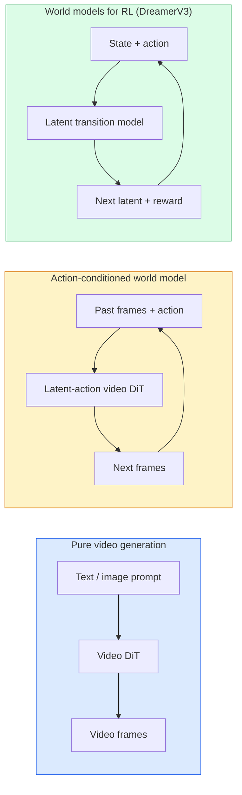

# 世界模型与视频扩散模型

> 能够预测场景接下来几秒内容的视频模型即世界模拟器。若将这种预测能力与动作控制相结合，便能构建出可学习的游戏引擎。

**类型：** 学习 + 构建
**语言：** Python
**先修课程：** 第4阶段第10课（扩散模型）、第4阶段第12课（视频理解）、第4阶段第23课（DiT与修正流）
**时长：** 约75分钟

## 学习目标

- 阐述纯视频生成模型（Sora 2）与动作条件世界模型（Genie 3、DreamerV3）之间的区别。  
- 描述视频 DiT 的结构：时空切片、3D 位置编码，以及针对 (T, H, W) 令牌的联合注意力机制。  
- 探讨世界模型如何融入机器人技术：由 VLM 制定计划 → 视频模型进行模拟 → 反向动力学模块生成动作指令。  
- 针对特定应用场景（创意视频、交互式仿真、自动驾驶合成），在 Sora 2、Genie 3、Runway GWM-1 Worlds、Wan-Video 和 HunyuanVideo 中进行选型。

## 问题所在

2026年，视频生成技术与世界建模技术实现了融合。一个能够生成时长为一分钟的连贯视频的模型，在某种程度上已经掌握了世界的运行规律：物体恒常性、重力作用、因果关系以及视觉风格等。如果将这些预测条件设定为特定动作（如向左行走、打开门），该视频模型便能转变为可学习的模拟器，从而替代游戏引擎、驾驶模拟器或机器人实验环境。

其应用价值十分显著。Genie 3能够仅凭一张图片生成可供游玩的环境；Runway GWM-1 Worlds则可以合成无限多的可探索场景；Sora 2则能生成带有同步音频及物理建模效果的分钟级视频。NVIDIA Cosmos-Drive、Wayve Gaia-2以及Tesla DrivingWorld则用于为自动驾驶车辆训练生成逼真的驾驶视频。目前，世界建模范式正在悄然取代传统“模拟到现实”的方法，成为机器人技术研究的主流方向。

本课是第四阶段的核心概览课程，它将图像生成、视频理解与智能体推理相结合，展现了当前研究领域正逐步形成的主导架构模式。

## 概念概述

### 世界建模的三大类别



- **Sora 2** 是基于提示词生成的纯视频模型，不具备动作控制接口。在生成过程中无法对其进行“引导”。
- **Genie 3**、**GWM-1 Worlds**、**Mirage / Magica** 属于基于动作的世界模型。它们会从观测到的视频中推断出潜在的动作，然后以此作为条件来预测后续帧的内容。这类模型具备交互性——用户按下按键或移动摄像头时，场景会做出相应响应。
- **DreamerV3** 以及传统的强化学习世界模型系列在隐式空间中进行预测，并带有明确的动作控制机制，其训练依赖于奖励信号。这类模型的视觉表现较弱，但更适用于需要高效采样进行强化学习的场景。

### Video DiT 架构

```
Video latent:          (C, T, H, W)
Patchify (spatial):    grid of P_h x P_w patches per frame
Patchify (temporal):   group P_t frames into a temporal patch
Resulting tokens:      (T / P_t) * (H / P_h) * (W / P_w) tokens
```

位置编码为三维结构：针对每个 (t, h, w) 坐标存在一个旋转型或学习得到的嵌入向量。注意力机制可分为以下几种：

- **全连接型** —— 所有标记都会关注所有其他标记。当标记数为 N 时，计算复杂度为 O(N^2)，对于长视频而言效率极低。
- **分块型** —— 交替进行时间注意力计算（相同空间位置，不同时间步：复杂度为 (H*W) * T^2）与空间注意力计算（相同时间步，不同空间位置：复杂度为 T * (H*W)^2）。TimeSformer 及大多数视频差分变换模型均采用此方式。
- **窗口型** —— 在 (t, h, w) 空间内划分局部窗口。Video Swin 模型使用该机制。

目前所有的 2026 年发布的视频扩散模型均采用上述三种模式中的一种，并结合 AdaLN 条件化技术（第 23 课）以及修正流算法。

### 基于动作的条件化：潜在动作模型

Genie 通过判别式预测连续两帧之间的动作，从而在每一帧学习一个**潜在动作**。模型的解码器随后会根据推断出的潜在动作进行生成——而非依据显式的键盘按键。在推理阶段，用户可以指定一个潜在动作（或从新的先验分布中采样一个），模型便会生成与该动作一致的下一帧。

Sora 则完全省去了动作界面。其解码器直接根据过去的时空标记来预测下一个时空标记。提示词仅用于设定起始状态，在生成过程中没有任何因素会对生成过程进行干预。

### 物理合理性

Sora 2 在 2026 年发布时明确强调了**物理合理性**：包括重量、平衡感、物体恒常性以及因果关系。团队通过手动评分来衡量其合理性；与 Sora 1 相比，该模型在处理物体掉落、角色碰撞以及故意设置的失败场景（如跳跃失误）时表现有了明显提升。

尽管如此，物理合理性问题依然是主要的缺陷所在。2024 年和 2025 年发布的那些人们吃意大利面或用杯子喝水的视频，暴露出了该模型缺乏对物体的持久表征能力。2026 年推出的模型（Sora 2、Runway Gen-5、HunyuanVideo）虽然有所改善，但并未彻底解决这些问题。

### 自动驾驶世界模型

驱动型世界模型能够根据轨迹、边界框或导航地图生成逼真的道路场景。应用示例：

- **Cosmos-Drive-Dreams**（NVIDIA）——用于为强化学习训练生成数分钟的驾驶视频。
- **Gaia-2**（Wayve）——基于轨迹条件进行场景合成，以用于策略评估。
- **DrivingWorld**（Tesla）——可模拟不同的天气、时段及交通状况。
- **Vista**（字节跳动）——具备反应式驾驶场景合成功能。

这些模型可替代昂贵的真实世界数据采集工作，用于处理那些原本需要数百万英里驾驶才能遇到的极端情况——如夜间行人横穿马路、结冰的交叉路口以及罕见的车辆类型。

### 机器人技术栈：视觉语言模型 + 视频模型 + 逆动力学

新兴的三分量机器人控制循环：

1. **VLM**负责解析目标（“拾起红色杯子”），并规划高层次的动作序列。
2. **视频生成模型**用于模拟执行每个动作时的场景——预测未来N帧的观测结果。
3. **逆动力学模型**则提取能够产生这些观测结果的具体电机指令。

该架构取代了基于奖励塑形的传统方法以及依赖大量样本的强化学习。世界模型负责“想象”场景，而逆动力学模型则完成从规划到实际执行的闭环控制。Genie Envisioner便是此类实现方案之一，目前许多研究团队都在朝着这一结构努力。

### 评估

- **视觉质量** — FVD（Fréchet视频距离）及用户测试结果。
- **提示词对齐度** — 每帧的CLIPScore值以及VQA风格的评估结果。
- **物理合理性** — 基于基准测试套件进行人工评分（Sora 2的内部基准测试，VBench）。
- **可控性**（针对交互式世界模型）——动作与观测结果的一致性；是否能够恢复到先前的状态？

### 2026年的模型格局

| 模型 | 应用场景 | 参数量 | 输出内容 | 许可协议 |
|-------|---------|--------|----------|---------|
| Sora 2 | 文本转视频、音频生成 | — | 1分钟1080p分辨率视频 + 音频 | 仅限API使用 |
| Runway Gen-5 | 文本/图像转视频 | — | 10秒长度的视频片段 | API接口 |
| Runway GWM-1 Worlds | 交互式世界构建 | — | 无限扩展的3D场景 | API接口 |
| Genie 3 | 基于图像生成交互式世界 | 110亿以上参数 | 可播放的画面帧 | 研究预览版 |
| Wan-Video 2.1 | 开源文本转视频工具 | 140亿参数 | 高质量视频片段 | 仅限非商业用途 |
| HunyuanVideo | 开源文本转视频工具 | 130亿参数 | 10秒长度的视频片段 | 宽松许可协议 |
| Cosmos / Cosmos-Drive | 自动驾驶模拟系统 | 70亿至140亿参数 | 驾驶场景数据 | NVIDIA开源版本 |
| Magica / Mirage 2 | 原生AI游戏引擎 | — | 可修改的3D世界 | 商业产品 |

## 构建它

### 步骤 1：视频的 3D 补丁处理

```python
import torch
import torch.nn as nn


class VideoPatch3D(nn.Module):
    def __init__(self, in_channels=4, dim=64, patch_t=2, patch_h=2, patch_w=2):
        super().__init__()
        self.proj = nn.Conv3d(
            in_channels, dim,
            kernel_size=(patch_t, patch_h, patch_w),
            stride=(patch_t, patch_h, patch_w),
        )
        self.patch_t = patch_t
        self.patch_h = patch_h
        self.patch_w = patch_w

    def forward(self, x):
        # x: (N, C, T, H, W)
        x = self.proj(x)
        n, c, t, h, w = x.shape
        tokens = x.reshape(n, c, t * h * w).transpose(1, 2)
        return tokens, (t, h, w)
```

步长等于卷积核大小的3D卷积可充当时空补丁生成器，将输入的`(T, H, W)`格式的令牌网格转换为`(T/2, H/2, W/2)`尺寸的网格。

### 步骤 2：3D 旋转位置编码

沿 `t`、`h`、`w` 轴分别应用的旋转位置嵌入（RoPE）：

```python
def rope_3d(tokens, t_dim, h_dim, w_dim, grid):
    """
    tokens: (N, T*H*W, D)
    grid: (T, H, W) sizes
    t_dim + h_dim + w_dim == D
    """
    T, H, W = grid
    n, seq, d = tokens.shape
    if t_dim + h_dim + w_dim != d:
        raise ValueError(f"t_dim+h_dim+w_dim ({t_dim}+{h_dim}+{w_dim}) must equal D={d}")
    assert seq == T * H * W
    t_idx = torch.arange(T, device=tokens.device).repeat_interleave(H * W)
    h_idx = torch.arange(H, device=tokens.device).repeat_interleave(W).repeat(T)
    w_idx = torch.arange(W, device=tokens.device).repeat(T * H)
    # Simplified: just scale channels by frequencies. Real RoPE rotates pairs.
    freqs_t = torch.exp(-torch.log(torch.tensor(10000.0)) * torch.arange(t_dim // 2, device=tokens.device) / (t_dim // 2))
    freqs_h = torch.exp(-torch.log(torch.tensor(10000.0)) * torch.arange(h_dim // 2, device=tokens.device) / (h_dim // 2))
    freqs_w = torch.exp(-torch.log(torch.tensor(10000.0)) * torch.arange(w_dim // 2, device=tokens.device) / (w_dim // 2))
    emb_t = torch.cat([torch.sin(t_idx[:, None] * freqs_t), torch.cos(t_idx[:, None] * freqs_t)], dim=-1)
    emb_h = torch.cat([torch.sin(h_idx[:, None] * freqs_h), torch.cos(h_idx[:, None] * freqs_h)], dim=-1)
    emb_w = torch.cat([torch.sin(w_idx[:, None] * freqs_w), torch.cos(w_idx[:, None] * freqs_w)], dim=-1)
    return tokens + torch.cat([emb_t, emb_h, emb_w], dim=-1)
```

简化的加法形式。实数版 RoPE 以不同频率旋转成对的通道，其位置信息保持不变。

### 步骤 3：分心注意力模块

```python
class DividedAttentionBlock(nn.Module):
    def __init__(self, dim=64, heads=2):
        super().__init__()
        self.time_attn = nn.MultiheadAttention(dim, heads, batch_first=True)
        self.space_attn = nn.MultiheadAttention(dim, heads, batch_first=True)
        self.ln1 = nn.LayerNorm(dim)
        self.ln2 = nn.LayerNorm(dim)
        self.ln3 = nn.LayerNorm(dim)
        self.mlp = nn.Sequential(nn.Linear(dim, 4 * dim), nn.GELU(), nn.Linear(4 * dim, dim))

    def forward(self, x, grid):
        T, H, W = grid
        n, seq, d = x.shape
        # time attention: same (h, w), across t
        xt = x.view(n, T, H * W, d).permute(0, 2, 1, 3).reshape(n * H * W, T, d)
        a, _ = self.time_attn(self.ln1(xt), self.ln1(xt), self.ln1(xt), need_weights=False)
        xt = (xt + a).reshape(n, H * W, T, d).permute(0, 2, 1, 3).reshape(n, seq, d)
        # space attention: same t, across (h, w)
        xs = xt.view(n, T, H * W, d).reshape(n * T, H * W, d)
        a, _ = self.space_attn(self.ln2(xs), self.ln2(xs), self.ln2(xs), need_weights=False)
        xs = (xs + a).reshape(n, T, H * W, d).reshape(n, seq, d)
        xs = xs + self.mlp(self.ln3(xs))
        return xs
```

时间注意力会在不同时间步的每个空间位置上进行处理；而空间注意力则会在每个帧的不同位置上进行计算。相比单一的 O((THW)^2) 计算量，这种方式需要执行两次 O(T^2 + (HW)^2) 的运算。这正是 TimeSformer 以及所有现代视频 DiT 模型的核心机制。

### 第 4 步：制作一个微型视频 DiT

```python
class TinyVideoDiT(nn.Module):
    def __init__(self, in_channels=4, dim=64, depth=2, heads=2):
        super().__init__()
        self.patch = VideoPatch3D(in_channels=in_channels, dim=dim, patch_t=2, patch_h=2, patch_w=2)
        self.blocks = nn.ModuleList([DividedAttentionBlock(dim, heads) for _ in range(depth)])
        self.out = nn.Linear(dim, in_channels * 2 * 2 * 2)

    def forward(self, x):
        tokens, grid = self.patch(x)
        for blk in self.blocks:
            tokens = blk(tokens, grid)
        return self.out(tokens), grid
```

这并非可运行的视频生成工具，而是一个结构演示，用于展示各组件是否能够正确组合。

### 步骤 5：检查形状

```python
vid = torch.randn(1, 4, 8, 16, 16)  # (N, C, T, H, W)
model = TinyVideoDiT()
out, grid = model(vid)
print(f"input  {tuple(vid.shape)}")
print(f"tokens grid {grid}")
print(f"output {tuple(out.shape)}")
```

补丁应用后，预期得到的结果为 `grid = (4, 8, 8)` 和 `out = (1, 256, 32)`；随后，头部结构会被映射为每个标记对应的时空补丁，以便再次反补丁还原为视频。

## 使用它

2026年的生产环境访问方案：

- **Sora 2 API**（OpenAI）——文本转视频，支持同步音频。采用高级定价。
- **Runway Gen-5 / GWM-1**（Runway）——图像转视频，可构建交互式世界。
- **Wan-Video 2.1 / HunyuanVideo**——开源自托管版本。
- **Cosmos / Cosmos-Drive**（NVIDIA）——驾驶模拟用开放权重模型。
- **Genie 3**——处于研究预览阶段，需申请访问权限。

若要构建交互式世界模型演示：首先使用Wan-Video保证视频质量，再叠加潜在动作适配器以实现交互功能。对于自动驾驶模拟，Cosmos-Drive是2026年的开放参考方案。

在机器人技术领域，实际应用中的技术栈如下：

1. 语言目标 -> 大语言视觉模型（Qwen3-VL） -> 生成高级规划。
2. 规划 -> 潜在动作视频模型 -> 模拟动作执行过程。
3. 动作执行 -> 反向动力学模型 -> 生成低级动作指令。
4. 执行动作后产生的观测数据反馈至第一步。

## 发布它

本课程将生成以下内容：

- `outputs/prompt-video-model-picker.md` — 根据任务类型、许可证要求及延迟指标，在 Sora 2 / Runway / Wan / HunyuanVideo / Cosmos 等模型中选择最优方案。
- `outputs/skill-physical-plausibility-checks.md` — 一种用于在视频发布前自动执行合理性检查的技能，可检测物体恒定性、重力规则及内容连贯性等问题。

## 练习题

1. **（简单）** 计算在 patch-t=2、patch-h=8、patch-w=8 条件下，5 秒长、360p 分辨率视频的 token 数量。分析该规模下注意力机制所需的内存资源。
2. **（中等）** 将上述的分割注意力块替换为完整的联合注意力块，并测量其结构形状与参数数量。解释为何在真实的视频模型中需要使用分割注意力机制。
3. **（困难）** 构建一个最简的潜在动作视频模型：选取包含 (frame_t, action_t, frame_{t+1}) 三元组的数据集（任意简单的 2D 游戏），训练一个基于动作嵌入的微型视频 DiT 模型，并证明不同的动作会生成不同的下一帧。

## 关键术语

| 术语 | 常见说法 | 实际含义 |
|------|----------|----------|
| 世界模型 | “学习型模拟器” | 根据状态和动作预测未来观测结果的模型 |
| Video DiT | “时空变换器” | 具有3D分块处理与分层注意力机制的扩散变换器 |
| 潜在动作 | “推断控制” | 从帧对中推断出的离散或连续动作潜在表示；用于引导下一帧的生成 |
| 分层注意力 | “先时间后空间” | 每个模块执行两次注意力操作——先处理时间维度，再处理空间维度——以保持计算复杂度在 O(N^2) 级别 |
| 物体恒常性 | “物体始终存在” | 视频模型必须学习的场景属性；在食物、玻璃器皿等对象上常见失效现象 |
| FVD | “Fréchet视频距离” | FID在视频领域的对应指标；主要的视觉质量评估标准 |
| 逆动力学模型 | “从观测到动作” | 给定（当前状态，下一状态），输出连接两者的动作；用于闭合机器人控制循环 |
| Cosmos-Drive | “NVIDIA驾驶模拟器” | 用于强化学习与性能评估的开源权重自动驾驶世界模型 |

## 延伸阅读

- [Sora技术报告（OpenAI）](https://openai.com/index/video-generation-models-as-world-simulators/)
- [Genie：生成式交互环境（Bruce等人，2024年）](https://arxiv.org/abs/2402.15391) —— 隐式动作世界模型
- [TimeSformer（Bertasius等人，2021年）](https://arxiv.org/abs/2102.05095) —— 视频Transformer的划分注意力机制
- [DreamerV3（Hafner等人，2023年）](https://arxiv.org/abs/2301.04104) —— 用于强化学习的世界模型
- [Cosmos-Drive-Dreams（NVIDIA，2025年）](https://research.nvidia.com/labs/toronto-ai/cosmos-drive-dreams/) —— 驾驶世界模型
- [2026年十大视频生成模型（DataCamp）](https://www.datacamp.com/blog/top-video-generation-models)
- [从视频生成到世界模型——综述代码库](https://github.com/ziqihuangg/Awesome-From-Video-Generation-to-World-Model/)
