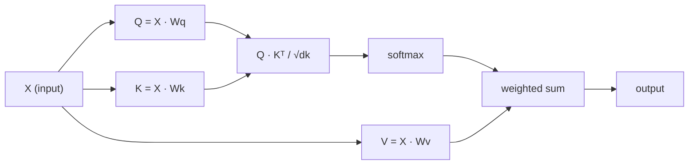

# 从零实现自注意力机制

> 注意力机制实际上是一个查找表，其中每个词都会询问“谁对我而言重要？”——并从中学习到答案。

**类型：** 构建
**语言：** Python
**先修要求：** 第3阶段（深度学习核心），第5阶段第10课（序列到序列）
**时长：** 约90分钟

## 学习目标

- 仅使用 NumPy 从零实现缩放点积自注意力机制，包括查询向量、键向量和值向量的投影以及经过 softmax 加权的求和操作。  
- 构建多头注意力层，通过划分不同“头”来并行计算注意力权重，并将各头的输出结果进行拼接。  
- 探讨注意力矩阵如何捕捉词元之间的关联关系，并解释为何对分母进行 sqrt(d_k) 缩放能够避免 softmax 函数出现饱和现象。  
- 应用因果掩码，将双向注意力机制转换为自回归式（解码器风格）的注意力机制。

## 问题所在

RNN 会逐个处理序列中的标记。当处理到第 50 个标记时，第 1 个标记的信息已经经历了 50 次压缩。长距离依赖关系会被压缩进固定大小的隐藏状态中——这是一个即便使用 LSTM 的门控机制也无法完全解决的瓶颈。

2014 年的 Bahdanau 注意力机制论文提出了解决方案：让解码器能够回溯查看每个编码器的位置，并判断哪些位置对当前步骤至关重要。但该机制仍被绑定在 RNN 结构之上。2017 年的《Attention Is All You Need》论文则提出了更为尖锐的问题：如果注意力机制就是*唯一的*处理机制会怎样？无需循环结构，也无需卷积操作，仅靠注意力即可。

自注意力机制允许序列中的每个位置在单个并行步骤中同时关注其他所有位置。这正是让 Transformer 拥有高速性能、可扩展性并成为主流技术的关键所在。

## 概念概述

### 数据库查询类比

可以将注意力机制视为一种温和的数据库查询：

```
Traditional database:
  Query: "capital of France"  -->  exact match  -->  "Paris"

Attention:
  Query: "capital of France"  -->  similarity to ALL keys  -->  weighted blend of ALL values
```

每个令牌都会生成三个向量：
- **查询向量（Q）**：“我在寻找什么？”
- **键向量（K）**：“我包含什么内容？”
- **值向量（V）**：“如果被选中，我会提供哪些信息？”

查询向量与所有键向量之间的点积会生成注意力分数。分数越高表示“该键与我的查询匹配度越高”。这些分数用于为对应的值向量赋予权重，最终输出即为各值向量的加权之和。

### Q、K、V 的计算

每个词元嵌入都会通过三个学习得到的权重矩阵进行投影：

```
Input embeddings (sequence of n tokens, each d-dimensional):

  X = [x1, x2, x3, ..., xn]       shape: (n, d)

Three weight matrices:

  Wq  shape: (d, dk)
  Wk  shape: (d, dk)
  Wv  shape: (d, dv)

Projections:

  Q = X @ Wq    shape: (n, dk)      each token's query
  K = X @ Wk    shape: (n, dk)      each token's key
  V = X @ Wv    shape: (n, dv)      each token's value
```

从视觉上看，对于一个令牌而言：

```
             Wq
  x_i ------[*]------> q_i    "What am I looking for?"
       |
       |     Wk
       +----[*]------> k_i    "What do I contain?"
       |
       |     Wv
       +----[*]------> v_i    "What do I offer?"
```

### 注意力矩阵

当所有标记的 Q、K、V 向量都准备就绪后，注意力分数会构成一个矩阵：

```
Scores = Q @ K^T    shape: (n, n)

              k1    k2    k3    k4    k5
        +-----+-----+-----+-----+-----+
   q1   | 2.1 | 0.3 | 0.1 | 0.8 | 0.2 |   <- how much q1 attends to each key
        +-----+-----+-----+-----+-----+
   q2   | 0.4 | 1.9 | 0.7 | 0.1 | 0.3 |
        +-----+-----+-----+-----+-----+
   q3   | 0.2 | 0.6 | 2.3 | 0.5 | 0.1 |
        +-----+-----+-----+-----+-----+
   q4   | 0.9 | 0.1 | 0.4 | 1.7 | 0.6 |
        +-----+-----+-----+-----+-----+
   q5   | 0.1 | 0.3 | 0.2 | 0.5 | 2.0 |
        +-----+-----+-----+-----+-----+

Each row: one token's attention over the entire sequence
```

观察单个查询如何依次遍历各个键：每一行会对每个标记进行评分，Softmax函数将这些评分转换为权重，而上下文向量则是这些加权值的混合结果。

```figure
attention-matrix
```

### 为何需要扩展？

点积值会随着维度 dk 的增大而增长。当 dk = 64 时，点积值可能在数十的范围内，从而导致 softmax 函数进入梯度为零的区域。解决方法：除以 sqrt(dk)。

```
Scaled scores = (Q @ K^T) / sqrt(dk)
```

这样可将数值维持在一定范围内，从而使 softmax 能生成有用的梯度。

### Softmax：将分数转换为权重

Softmax 将原始得分转换为每行对应的概率分布：

```
Raw scores for q1:   [2.1, 0.3, 0.1, 0.8, 0.2]
                            |
                         softmax
                            |
Attention weights:   [0.52, 0.09, 0.07, 0.14, 0.08]   (sums to ~1.0)
```

现在，每个令牌都有一组权重，用于指示应关注其他令牌的程度。

### 数值的加权和

每个标记的最终输出均为所有值向量的加权之和：

```
output_i = sum( attention_weight[i][j] * v_j  for all j )

For token 1:
  output_1 = 0.52 * v1 + 0.09 * v2 + 0.07 * v3 + 0.14 * v4 + 0.08 * v5
```

### 完整流水线



单行公式：

```
Attention(Q, K, V) = softmax( Q @ K^T / sqrt(dk) ) @ V
```

```figure
softmax-attention-scaling
```

## 构建它

### 步骤 1：从零实现 Softmax 函数

Softmax函数可将原始logit值转换为概率值。为保证数值稳定性，需先减去其中的最大值。

```python
import numpy as np

def softmax(x):
    shifted = x - np.max(x, axis=-1, keepdims=True)
    exp_x = np.exp(shifted)
    return exp_x / np.sum(exp_x, axis=-1, keepdims=True)

logits = np.array([2.0, 1.0, 0.1])
print(f"logits:  {logits}")
print(f"softmax: {softmax(logits)}")
print(f"sum:     {softmax(logits).sum():.4f}")
```

### 步骤 2：缩放点积注意力机制

核心函数。该函数接收 Q、K 和 V 矩阵，返回注意力输出结果及权重矩阵。

```python
def scaled_dot_product_attention(Q, K, V):
    dk = Q.shape[-1]
    scores = Q @ K.T / np.sqrt(dk)
    weights = softmax(scores)
    output = weights @ V
    return output, weights
```

### 步骤 3：带有学习得到的投影层的自注意力层

一个完整的自注意力模块，包含采用类Xavier缩放方式初始化的Wq、Wk和Wv权重矩阵。

```python
class SelfAttention:
    def __init__(self, d_model, dk, dv, seed=42):
        rng = np.random.default_rng(seed)
        scale = np.sqrt(2.0 / (d_model + dk))
        self.Wq = rng.normal(0, scale, (d_model, dk))
        self.Wk = rng.normal(0, scale, (d_model, dk))
        scale_v = np.sqrt(2.0 / (d_model + dv))
        self.Wv = rng.normal(0, scale_v, (d_model, dv))
        self.dk = dk

    def forward(self, X):
        Q = X @ self.Wq
        K = X @ self.Wk
        V = X @ self.Wv
        output, weights = scaled_dot_product_attention(Q, K, V)
        return output, weights
```

### 第 4 步：在句子上运行它

为某句话生成虚假的嵌入向量，然后观察注意力权重。

```python
sentence = ["The", "cat", "sat", "on", "the", "mat"]
n_tokens = len(sentence)
d_model = 8
dk = 4
dv = 4

rng = np.random.default_rng(42)
X = rng.normal(0, 1, (n_tokens, d_model))

attn = SelfAttention(d_model, dk, dv, seed=42)
output, weights = attn.forward(X)

print("Attention weights (each row: where that token looks):\n")
print(f"{'':>6}", end="")
for token in sentence:
    print(f"{token:>6}", end="")
print()

for i, token in enumerate(sentence):
    print(f"{token:>6}", end="")
    for j in range(n_tokens):
        w = weights[i][j]
        print(f"{w:6.3f}", end="")
    print()
```

### 步骤 5：使用 ASCII 热图可视化注意力机制

将注意力权重映射到字符，以便快速生成可视化结果。

```python
def ascii_heatmap(weights, tokens, chars=" ░▒▓█"):
    n = len(tokens)
    print(f"\n{'':>6}", end="")
    for t in tokens:
        print(f"{t:>6}", end="")
    print()

    for i in range(n):
        print(f"{tokens[i]:>6}", end="")
        for j in range(n):
            level = int(weights[i][j] * (len(chars) - 1) / weights.max())
            level = min(level, len(chars) - 1)
            print(f"{'  ' + chars[level] + '   '}", end="")
        print()

ascii_heatmap(weights, sentence)
```

## 使用它

PyTorch 的 `nn.MultiheadAttention` 恰好实现了我们构建的功能，同时还具备多头分割与输出投影功能：

```python
import torch
import torch.nn as nn

d_model = 8
n_heads = 2
seq_len = 6

mha = nn.MultiheadAttention(embed_dim=d_model, num_heads=n_heads, batch_first=True)

X_torch = torch.randn(1, seq_len, d_model)

output, attn_weights = mha(X_torch, X_torch, X_torch)

print(f"Input shape:            {X_torch.shape}")
print(f"Output shape:           {output.shape}")
print(f"Attention weight shape: {attn_weights.shape}")
print(f"\nAttn weights (averaged over heads):")
print(attn_weights[0].detach().numpy().round(3))
```

主要区别在于：多头注意力机制会并行运行多个注意力函数，每个函数都拥有大小为 dk = d_model / n_heads 的独立 Q、K、V 表示，随后将各函数的结果进行拼接。这样一来，模型便能同时关注不同类型的关系。

## 发布它

本课程将生成以下内容：
- `outputs/prompt-attention-explainer.md` —— 一个通过数据库查询类比来解释注意力机制的提示词

## 练习题

1. 修改 `scaled_dot_product_attention` 函数，使其能够接受一个可选的掩码矩阵；在应用 softmax 操作之前，该掩码会将某些位置设置为负无穷大（这就是因果/解码器掩码的实现方式）。  
2. 从零开始实现多头注意力机制：将 Q、K、V 向量分别分割为 `n_heads` 个块，对每个块独立执行注意力计算，然后将结果拼接起来，并通过最终的权重矩阵 Wo 进行投影。  
3. 取两段长度相同的不同句子，将其输入到同一个 SelfAttention 实例中，比较它们的注意力模式。有哪些变化？哪些保持不变？

## 关键术语

| 术语 | 通俗说法 | 实际含义 |
|------|----------|----------|
| 查询向量 (Q) | “问题向量” | 对输入进行学习得到的投影，用于表示该标记正在寻找的信息 |
| 键向量 (K) | “标签向量” | 对输入进行学习得到的投影，用于表示该标记包含的信息，并与查询向量进行匹配 |
| 值向量 (V) | “内容向量” | 包含实际信息的学习得到的投影，会根据注意力分数被聚合起来 |
| 缩放点积注意力 | “注意力计算公式” | softmax(QK^T / sqrt(dk)) @ V —— 通过缩放处理可防止在高维空间中softmax函数出现饱和现象 |
| 自注意力 | “标记同时关注自身与其他标记” | Q、K、V均来自同一序列的注意力机制，使得每个位置都能关注到其他所有位置 |
| 注意力权重 | “关注程度” | 基于缩放点积结果通过softmax计算得到的位置概率分布 |
| 多头注意力 | “并行注意力” | 使用多个具有不同投影的注意力函数分别处理数据，再将结果拼接起来以获得更丰富的表示 |

## 延伸阅读

- [Attention Is All You Need (Vaswani et al., 2017)](https://arxiv.org/abs/1706.03762) - 原始的 Transformer 论文  
- [The Illustrated Transformer (Jay Alammar)](https://jalammar.github.io/illustrated-transformer/) - 对完整架构最直观的可视化讲解  
- [The Annotated Transformer (Harvard NLP)](https://nlp.seas.harvard.edu/annotated-transformer/) - 带有解释的逐行 PyTorch 实现代码
