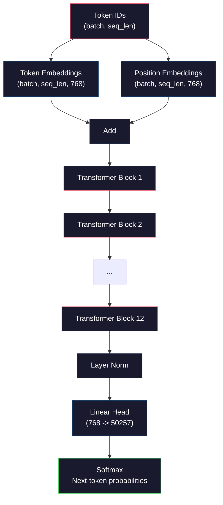
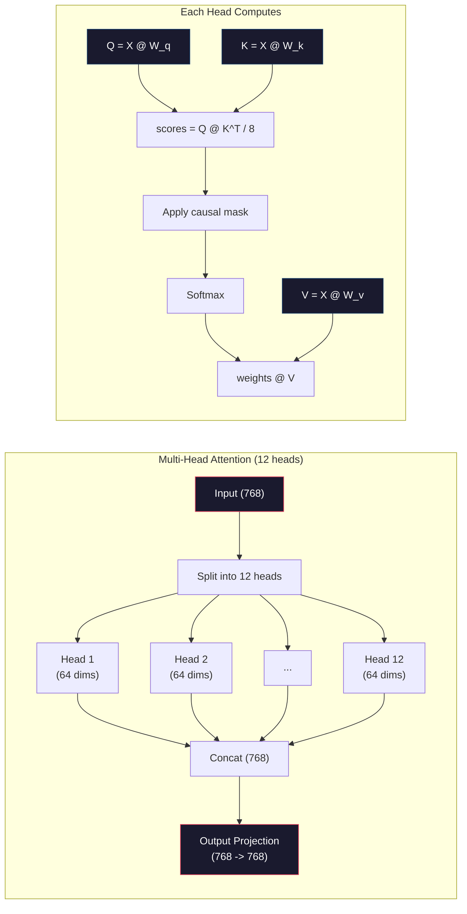
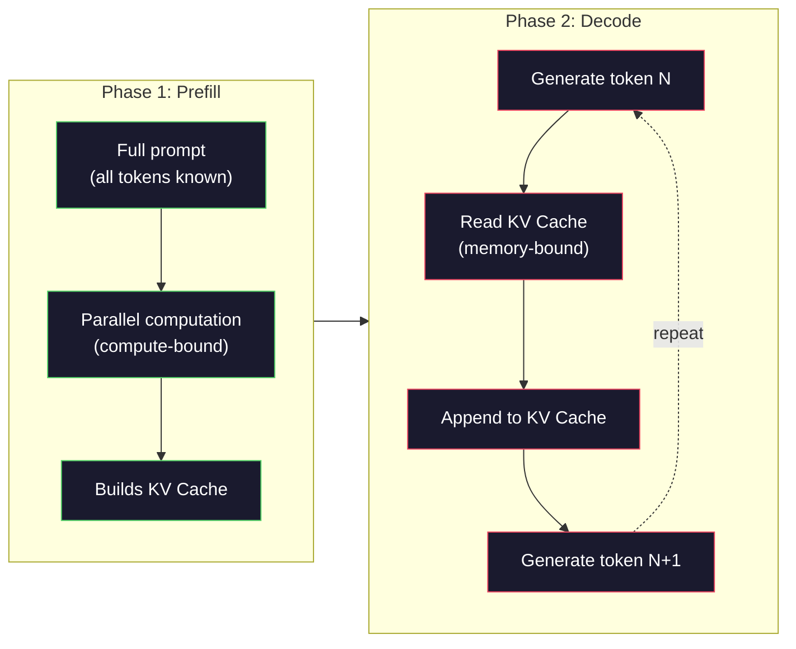

# 预训练一个迷你 GPT（124M 参数）

> GPT-2 Small 有 1.24 亿个参数。它包含 12 个 transformer 层、12 个注意力头，以及 768 维的嵌入向量。你可以在单块 GPU 上几个小时内从头训练出它。大多数人从来不会这么做，他们直接使用预训练好的 checkpoint。但如果你不亲手训练一个，你就并不真正理解你赖以构建产品的模型内部到底发生了什么。

**类型：** 构建
**语言：** Python（搭配 numpy）
**前置要求：** 第 10 阶段，第 01-03 课（分词器、构建分词器、数据管线）
**所需时间：** 约120分钟

## 学习目标

- 从头实现完整的 GPT-2 架构（124M 参数）：token 嵌入、位置嵌入、transformer 块，以及语言模型头
- 使用基于交叉熵损失的下一个 token 预测，在文本语料上训练一个 GPT 模型
- 实现带温度采样和 top-k/top-p 过滤的自回归文本生成
- 监控训练损失曲线，并验证模型学到了连贯的语言模式

## 问题所在

你知道什么是 transformer。你看过那些示意图。你能背出「attention is all you need」，并能在白板上画出标注着「Multi-Head Attention」的方框。

但这些都不代表你理解模型生成文本时究竟发生了什么。

GPT-2 Small 中有 124,438,272 个参数（带权重绑定）。它们中的每一个都是通过运行训练循环设定的：前向传播、计算损失、反向传播、更新权重。12 个 transformer 块。每个块 12 个注意力头。一个 768 维的嵌入空间。一个包含 50,257 个 token 的词表。每次模型生成一个 token，全部 1.24 亿个参数都参与一条矩阵乘法链，它接收一串 token ID，产出关于下一个 token 的概率分布。

如果你从未亲手构建过它，你面对的就是一个黑盒。你可以调用 API，可以做微调。但当出问题时——当模型产生幻觉、当它不断重复自己、当它拒绝遵循指令时——你对其中的「为什么」毫无心智模型。

本课从头构建 GPT-2 Small。不是用 PyTorch，而是用 numpy。每一次矩阵乘法都清晰可见。每一个梯度都由你的代码计算。你将精确地看到这 1.24 亿个数字是如何协同合作来预测下一个词的。

## 概念说明

### GPT 架构

GPT 是一个自回归语言模型。「自回归」意味着它一次生成一个 token，每个 token 都以之前所有 token 为条件。其架构是一摞 transformer 解码器块。

下面是从 token ID 到下一个 token 概率的完整计算图：

1. token ID 输入。形状：(batch_size, seq_len)。
2. token 嵌入查找。每个 ID 映射到一个 768 维向量。形状：(batch_size, seq_len, 768)。
3. 位置嵌入查找。每个位置（0、1、2……）映射到一个 768 维向量。形状相同。
4. 将 token 嵌入 + 位置嵌入相加。
5. 通过 12 个 transformer 块。
6. 最终层归一化。
7. 线性投影到词表大小。形状：(batch_size, seq_len, vocab_size)。
8. 通过 softmax 得到概率。

这就是整个模型。没有卷积，没有循环。只有嵌入、注意力、前馈网络和层归一化，堆叠 12 次。



### Transformer 块

12 个块中的每一个都遵循相同的模式。前置归一化架构（GPT-2 使用前置归一化，而非原始 transformer 那样的后置归一化）：

1. LayerNorm
2. 多头自注意力
3. 残差连接（把输入加回来）
4. LayerNorm
5. 前馈网络（MLP）
6. 残差连接（把输入加回来）

残差连接至关重要。没有它们，梯度在反向传播过程中到达第 1 块时就已经消失。有了它们，梯度可以通过「跳跃」路径从损失直接流向任意一层。这就是为什么你可以堆叠 12 个、32 个甚至 96 个块（据传 GPT-4 使用了 120 个）。

### 注意力：核心机制

自注意力让每个 token 都能查看之前的每一个 token，并决定对每一个分配多少注意力。下面是其中的数学。

对每个 token 位置，从输入计算三个向量：
- **Query（Q）**：「我在寻找什么？」
- **Key（K）**：「我包含什么？」
- **Value（V）**：「我携带什么信息？」

```
Q = input @ W_q    (768 -> 768)
K = input @ W_k    (768 -> 768)
V = input @ W_v    (768 -> 768)

attention_scores = Q @ K^T / sqrt(d_k)
attention_scores = mask(attention_scores)   # causal mask: -inf for future positions
attention_weights = softmax(attention_scores)
output = attention_weights @ V
```

因果掩码（causal mask）正是让 GPT 成为自回归模型的关键。位置 5 可以关注位置 0-5，但不能关注 6、7、8 等等。这防止模型在训练时通过查看未来 token 来「作弊」。

**多头注意力**将 768 维空间拆分为 12 个各 64 维的头。每个头学习不同的注意力模式。一个头可能跟踪句法关系（主谓一致），另一个可能跟踪语义相似性（同义词），还有一个可能跟踪位置邻近性（相邻词）。全部 12 个头的输出被拼接起来，再投影回 768 维。



除以 sqrt(d_k)——sqrt(64) = 8——是一种缩放。如果没有它，高维向量的点积会变得很大，把 softmax 推入梯度几乎为零的区域。这是原始论文「Attention Is All You Need」中的关键洞见之一。

### KV Cache：为什么推理很快

训练时，你一次性处理整个序列。推理时，你一次生成一个 token。如果不做优化，生成第 N 个 token 需要为之前所有 N-1 个 token 重新计算注意力。这对每个生成的 token 是 O(N^2)，对长度为 N 的序列总共是 O(N^3)。

KV Cache 解决了这个问题。在为每个 token 计算出 K 和 V 之后，把它们存起来。当生成第 N+1 个 token 时，你只需要为新 token 计算 Q，并查找之前所有 token 缓存的 K 和 V。这把每个 token 在 K 和 V 计算上的成本从 O(N) 降到 O(1)。注意力分数的计算仍是 O(N)，因为你要关注之前所有位置，但你避免了对输入的冗余矩阵乘法。

对于有 12 层、12 个头的 GPT-2，KV cache 为每个 token 存储 2（K + V）x 12 层 x 12 头 x 64 维 = 18,432 个值。对于一个 1024 token 的序列，在 FP32 下约为 75MB。对于有 128 层的 Llama 3 405B，单个序列的 KV cache 可能超过 10GB。这就是为什么长上下文推理是受内存限制的。

### Prefill 与 Decode：推理的两个阶段

当你把一个 prompt 发送给 LLM 时，推理分两个不同的阶段进行。

**Prefill** 并行处理你的整个 prompt。所有 token 都是已知的，因此模型可以同时计算所有位置的注意力。这一阶段是计算受限的——GPU 以全吞吐量执行矩阵乘法。对于 A100 上的 1000 token prompt，prefill 大约需要 20-50ms。

**Decode** 一次生成一个 token。每个新 token 都依赖之前所有 token。这一阶段是内存受限的——瓶颈在于从 GPU 内存读取模型权重和 KV cache，而非矩阵运算本身。GPU 的计算核心大部分时间都在空等内存读取。对于 GPT-2，无论矩阵乘法需要多少 FLOP，每个 decode 步骤花的时间都大致相同，因为内存带宽才是约束。

这一区别对生产系统至关重要。Prefill 吞吐量随 GPU 算力扩展（FLOPS 越多 = prefill 越快）。Decode 吞吐量随内存带宽扩展（内存越快 = decode 越快）。这就是为什么 NVIDIA 的 H100 相较 A100 着重提升内存带宽——它直接加速了 token 生成。



### 训练循环

训练 LLM 就是下一个 token 预测。给定 token [0, 1, 2, ..., N-1]，预测 token [1, 2, 3, ..., N]。损失函数是模型预测的概率分布与实际下一个 token 之间的交叉熵。

一个训练步骤：

1. **前向传播**：把这一批数据送过全部 12 个块。得到每个位置的 logits（softmax 之前的分数）。
2. **计算损失**：logits 与目标 token（即输入向后移一位）之间的交叉熵。
3. **反向传播**：用反向传播算法为全部 124M 参数计算梯度。
4. **优化器步骤**：更新权重。GPT-2 使用带学习率预热和余弦衰减的 Adam。

学习率调度的重要性超出你的预期。GPT-2 在前 2,000 步内将学习率从 0 预热到峰值，然后沿余弦曲线衰减。一开始就用高学习率会导致模型发散。一直保持高学习率会在训练后期引起震荡。先预热再衰减的模式被每一个主流 LLM 采用。

### GPT-2 Small：数字

| 组件 | 形状 | 参数量 |
|-----------|-------|------------|
| Token embeddings | (50257, 768) | 38,597,376 |
| Position embeddings | (1024, 768) | 786,432 |
| 每块注意力（W_q, W_k, W_v, W_out） | 4 x (768, 768) | 2,359,296 |
| 每块 FFN（up + down） | (768, 3072) + (3072, 768) | 4,718,592 |
| 每块 LayerNorm（2x） | 2 x 768 x 2 | 3,072 |
| 最终 LayerNorm | 768 x 2 | 1,536 |
| **每块总计** | | **7,080,960** |
| **总计（12 块）** | | **85,054,464 + 39,383,808 = 124,438,272** |

输出投影（logits 头）与 token 嵌入矩阵共享权重。这称为权重绑定（weight tying）——它把参数量减少了 38M，并提升性能，因为它迫使模型对输入和输出使用同一个表示空间。

## 开始构建

### 第 1 步：嵌入层

token 嵌入把 50,257 个可能 token 中的每一个映射到一个 768 维向量。位置嵌入则加入每个 token 在序列中所处位置的信息。两者相加。

```python
import numpy as np

class Embedding:
    def __init__(self, vocab_size, embed_dim, max_seq_len):
        self.token_embed = np.random.randn(vocab_size, embed_dim) * 0.02
        self.pos_embed = np.random.randn(max_seq_len, embed_dim) * 0.02

    def forward(self, token_ids):
        seq_len = token_ids.shape[-1]
        tok_emb = self.token_embed[token_ids]
        pos_emb = self.pos_embed[:seq_len]
        return tok_emb + pos_emb
```

初始化用的 0.02 标准差来自 GPT-2 论文。太大的话，最初的前向传播会产生极端值，破坏训练稳定性。太小的话，所有输入的初始输出几乎相同，使得早期的梯度信号毫无用处。

### 第 2 步：带因果掩码的自注意力

先看单头注意力。因果掩码在 softmax 之前把未来位置设为负无穷，确保每个位置只能关注自身及更早的位置。

```python
def attention(Q, K, V, mask=None):
    d_k = Q.shape[-1]
    scores = Q @ K.transpose(0, -1, -2 if Q.ndim == 4 else 1) / np.sqrt(d_k)
    if mask is not None:
        scores = scores + mask
    weights = np.exp(scores - scores.max(axis=-1, keepdims=True))
    weights = weights / weights.sum(axis=-1, keepdims=True)
    return weights @ V
```

这个 softmax 实现在取指数之前先减去最大值。否则，exp(large_number) 会溢出为无穷大。这是一个数值稳定性技巧，它不改变输出，因为对任意常数 c 都有 softmax(x - c) = softmax(x)。

### 第 3 步：多头注意力

把 768 维输入拆分为 12 个各 64 维的头。每个头独立计算注意力。把结果拼接起来，再投影回 768 维。

```python
class MultiHeadAttention:
    def __init__(self, embed_dim, num_heads):
        self.num_heads = num_heads
        self.head_dim = embed_dim // num_heads
        self.W_q = np.random.randn(embed_dim, embed_dim) * 0.02
        self.W_k = np.random.randn(embed_dim, embed_dim) * 0.02
        self.W_v = np.random.randn(embed_dim, embed_dim) * 0.02
        self.W_out = np.random.randn(embed_dim, embed_dim) * 0.02

    def forward(self, x, mask=None):
        batch, seq_len, d = x.shape
        Q = (x @ self.W_q).reshape(batch, seq_len, self.num_heads, self.head_dim).transpose(0, 2, 1, 3)
        K = (x @ self.W_k).reshape(batch, seq_len, self.num_heads, self.head_dim).transpose(0, 2, 1, 3)
        V = (x @ self.W_v).reshape(batch, seq_len, self.num_heads, self.head_dim).transpose(0, 2, 1, 3)

        scores = Q @ K.transpose(0, 1, 3, 2) / np.sqrt(self.head_dim)
        if mask is not None:
            scores = scores + mask
        weights = np.exp(scores - scores.max(axis=-1, keepdims=True))
        weights = weights / weights.sum(axis=-1, keepdims=True)
        attn_out = weights @ V

        attn_out = attn_out.transpose(0, 2, 1, 3).reshape(batch, seq_len, d)
        return attn_out @ self.W_out
```

reshape-transpose-reshape 这套操作是多头注意力中最令人困惑的部分。它发生的过程是这样的：(batch, seq_len, 768) 张量变成 (batch, seq_len, 12, 64)，再变成 (batch, 12, seq_len, 64)。现在 12 个头中的每一个都有自己的 (seq_len, 64) 矩阵来运行注意力。注意力之后，我们反向执行这一过程：(batch, 12, seq_len, 64) 变回 (batch, seq_len, 12, 64)，再变回 (batch, seq_len, 768)。

### 第 4 步：Transformer 块

一个完整的 transformer 块：LayerNorm、带残差的多头注意力、LayerNorm、带残差的前馈网络。

```python
class LayerNorm:
    def __init__(self, dim, eps=1e-5):
        self.gamma = np.ones(dim)
        self.beta = np.zeros(dim)
        self.eps = eps

    def forward(self, x):
        mean = x.mean(axis=-1, keepdims=True)
        var = x.var(axis=-1, keepdims=True)
        return self.gamma * (x - mean) / np.sqrt(var + self.eps) + self.beta


class FeedForward:
    def __init__(self, embed_dim, ff_dim):
        self.W1 = np.random.randn(embed_dim, ff_dim) * 0.02
        self.b1 = np.zeros(ff_dim)
        self.W2 = np.random.randn(ff_dim, embed_dim) * 0.02
        self.b2 = np.zeros(embed_dim)

    def forward(self, x):
        h = x @ self.W1 + self.b1
        h = np.maximum(0, h)  # GELU approximation: ReLU for simplicity
        return h @ self.W2 + self.b2


class TransformerBlock:
    def __init__(self, embed_dim, num_heads, ff_dim):
        self.ln1 = LayerNorm(embed_dim)
        self.attn = MultiHeadAttention(embed_dim, num_heads)
        self.ln2 = LayerNorm(embed_dim)
        self.ffn = FeedForward(embed_dim, ff_dim)

    def forward(self, x, mask=None):
        x = x + self.attn.forward(self.ln1.forward(x), mask)
        x = x + self.ffn.forward(self.ln2.forward(x))
        return x
```

前馈网络把 768 维输入扩展到 3,072 维（4 倍），施加一个非线性变换，再投影回 768 维。这种扩展-收缩的模式给了模型在每个位置上一个「更宽」的内部表示来运作。GPT-2 使用 GELU 激活，但为了简单起见我们这里用 ReLU——这个差异对于理解架构而言无关紧要。

### 第 5 步：完整 GPT 模型

堆叠 12 个 transformer 块。在前面加上嵌入层，在后面加上输出投影。

```python
class MiniGPT:
    def __init__(self, vocab_size=50257, embed_dim=768, num_heads=12,
                 num_layers=12, max_seq_len=1024, ff_dim=3072):
        self.embedding = Embedding(vocab_size, embed_dim, max_seq_len)
        self.blocks = [
            TransformerBlock(embed_dim, num_heads, ff_dim)
            for _ in range(num_layers)
        ]
        self.ln_f = LayerNorm(embed_dim)
        self.vocab_size = vocab_size
        self.embed_dim = embed_dim

    def forward(self, token_ids):
        seq_len = token_ids.shape[-1]
        mask = np.triu(np.full((seq_len, seq_len), -1e9), k=1)

        x = self.embedding.forward(token_ids)
        for block in self.blocks:
            x = block.forward(x, mask)
        x = self.ln_f.forward(x)

        logits = x @ self.embedding.token_embed.T
        return logits

    def count_parameters(self):
        total = 0
        total += self.embedding.token_embed.size
        total += self.embedding.pos_embed.size
        for block in self.blocks:
            total += block.attn.W_q.size + block.attn.W_k.size
            total += block.attn.W_v.size + block.attn.W_out.size
            total += block.ffn.W1.size + block.ffn.b1.size
            total += block.ffn.W2.size + block.ffn.b2.size
            total += block.ln1.gamma.size + block.ln1.beta.size
            total += block.ln2.gamma.size + block.ln2.beta.size
        total += self.ln_f.gamma.size + self.ln_f.beta.size
        return total
```

注意权重绑定：`logits = x @ self.embedding.token_embed.T`。输出投影复用了 token 嵌入矩阵（转置后）。这不仅仅是一个省参数的技巧。它意味着模型在理解 token（嵌入）和预测 token（输出）时使用同一个向量空间。

### 第 6 步：训练循环

要在 124M 参数上做一次真正的训练，你需要一块 GPU 和 PyTorch。这个训练循环用一个能在纯 numpy 中运行的小模型演示其机制。我们使用一个很小的模型（4 层、4 个头、128 维）来让它可行。

```python
def cross_entropy_loss(logits, targets):
    batch, seq_len, vocab_size = logits.shape
    logits_flat = logits.reshape(-1, vocab_size)
    targets_flat = targets.reshape(-1)

    max_logits = logits_flat.max(axis=-1, keepdims=True)
    log_softmax = logits_flat - max_logits - np.log(
        np.exp(logits_flat - max_logits).sum(axis=-1, keepdims=True)
    )

    loss = -log_softmax[np.arange(len(targets_flat)), targets_flat].mean()
    return loss


def train_mini_gpt(text, vocab_size=256, embed_dim=128, num_heads=4,
                   num_layers=4, seq_len=64, num_steps=200, lr=3e-4):
    tokens = np.array(list(text.encode("utf-8")[:2048]))
    model = MiniGPT(
        vocab_size=vocab_size, embed_dim=embed_dim, num_heads=num_heads,
        num_layers=num_layers, max_seq_len=seq_len, ff_dim=embed_dim * 4
    )

    print(f"Model parameters: {model.count_parameters():,}")
    print(f"Training tokens: {len(tokens):,}")
    print(f"Config: {num_layers} layers, {num_heads} heads, {embed_dim} dims")
    print()

    for step in range(num_steps):
        start_idx = np.random.randint(0, max(1, len(tokens) - seq_len - 1))
        batch_tokens = tokens[start_idx:start_idx + seq_len + 1]

        input_ids = batch_tokens[:-1].reshape(1, -1)
        target_ids = batch_tokens[1:].reshape(1, -1)

        logits = model.forward(input_ids)
        loss = cross_entropy_loss(logits, target_ids)

        if step % 20 == 0:
            print(f"Step {step:4d} | Loss: {loss:.4f}")

    return model
```

损失起始接近 ln(vocab_size)——对于 256 个 token 的字节级词表，那就是 ln(256) = 5.55。一个随机模型给每个 token 分配相等的概率。随着训练推进，损失下降，因为模型学会预测常见模式：「t」之后接「th」、句号之后接空格，等等。

在生产环境中，你会使用带梯度累积、学习率预热和梯度裁剪的 Adam 优化器。前向-损失-反向-更新的循环是相同的，只是优化器更复杂。

### 第 7 步：文本生成

生成使用训练好的模型一次预测一个 token。每次预测都从输出分布中采样（或者贪婪地取 argmax）。

```python
def generate(model, prompt_tokens, max_new_tokens=100, temperature=0.8):
    tokens = list(prompt_tokens)
    seq_len = model.embedding.pos_embed.shape[0]

    for _ in range(max_new_tokens):
        context = np.array(tokens[-seq_len:]).reshape(1, -1)
        logits = model.forward(context)
        next_logits = logits[0, -1, :]

        next_logits = next_logits / temperature
        probs = np.exp(next_logits - next_logits.max())
        probs = probs / probs.sum()

        next_token = np.random.choice(len(probs), p=probs)
        tokens.append(next_token)

    return tokens
```

温度控制随机性。温度 1.0 使用原始分布。温度 0.5 会让它更尖锐（更确定——模型更频繁地选择它的首选项）。温度 1.5 会让它更平坦（更随机——低概率 token 获得更大机会）。温度 0.0 是贪婪解码（总是选择概率最高的 token）。

`tokens[-seq_len:]` 这个窗口是必要的，因为模型有一个最大上下文长度（GPT-2 是 1024）。一旦超出，你必须丢弃最旧的 token。这就是人人都在谈论的「上下文窗口」。

```figure
sampling-decoder
```

## 实际运用

### 完整的训练与生成演示

```python
corpus = """The transformer architecture has revolutionized natural language processing.
Attention mechanisms allow the model to focus on relevant parts of the input.
Self-attention computes relationships between all pairs of positions in a sequence.
Multi-head attention splits the representation into multiple subspaces.
Each attention head can learn different types of relationships.
The feedforward network provides nonlinear transformations at each position.
Residual connections enable gradient flow through deep networks.
Layer normalization stabilizes training by normalizing activations.
Position embeddings give the model information about token ordering.
The causal mask ensures autoregressive generation during training.
Pre-training on large text corpora teaches the model general language understanding.
Fine-tuning adapts the pre-trained model to specific downstream tasks."""

model = train_mini_gpt(corpus, num_steps=200)

prompt = list("The transformer".encode("utf-8"))
output_tokens = generate(model, prompt, max_new_tokens=100, temperature=0.8)
generated_text = bytes(output_tokens).decode("utf-8", errors="replace")
print(f"\nGenerated: {generated_text}")
```

在小语料、小模型的条件下，生成的文本顶多算是半连贯。它会从训练文本中学到一些字节级模式，但无法像 GPT-2 那样借助 40GB 训练数据和完整的 124M 参数架构进行泛化。重点不在于输出质量，而在于你能追踪每一个步骤：嵌入查找、注意力计算、前馈变换、logit 投影、softmax 和采样。每一个操作都清晰可见。

## 交付成果

本课产出 `outputs/prompt-gpt-architecture-analyzer.md`——一个用于分析任何 GPT 风格模型架构选择的 prompt。把一份 model card 或技术报告喂给它，它会拆解其参数分配、注意力设计和扩展决策。

## 练习

1. 把模型改为使用 24 层和 16 个头，而不是 12/12。统计参数量。把深度翻倍与把宽度（嵌入维度）翻倍相比如何？

2. 实现 GELU 激活函数（GELU(x) = x * 0.5 * (1 + erf(x / sqrt(2)))），并替换前馈网络中的 ReLU。用每种激活各训练 500 步，比较最终损失。

3. 给生成函数加上 KV cache。在第一次前向传播后为每一层存储 K 和 V 张量，并在后续 token 中复用它们。测量加速效果：分别在有缓存和无缓存的情况下生成 200 个 token，比较墙钟时间。

4. 实现 top-k 采样（只考虑概率最高的 k 个 token）和 top-p 采样（核采样：考虑累积概率超过 p 的最小 token 集合）。在温度 0.8 下比较 top-k=50 与 top-p=0.95 的输出质量。

5. 构建一个训练损失曲线绘制器。把模型训练 1000 步，绘制损失对步数的曲线。识别三个阶段：快速的初始下降（学习常见字节）、较慢的中段（学习字节模式），以及平台期（在小语料上过拟合）。无论你训练的是 128 维模型还是 GPT-4，这条曲线的形状都是一样的。

## 关键术语

| 术语 | 通常说法 | 真实含义 |
|------|----------------|----------------------|
| Autoregressive（自回归） | 「它一次生成一个词」 | 每个输出 token 都以之前所有 token 为条件——模型预测 P(token_n \| token_0, ..., token_{n-1}) |
| Causal mask（因果掩码） | 「它看不到未来」 | 一个由 -infinity 值构成的上三角矩阵，在训练时阻止对未来位置的注意力 |
| Multi-head attention（多头注意力） | 「多种注意力模式」 | 把 Q、K、V 拆分成并行的头（例如 GPT-2 是 12 个各 64 维的头），使每个头能学习不同类型的关系 |
| KV Cache | 「为提速而缓存」 | 存储之前 token 计算出的 Key 和 Value 张量，以在自回归生成中避免冗余计算 |
| Prefill | 「处理 prompt」 | 第一个推理阶段，所有 prompt token 被并行处理——受限于 GPU FLOPS 算力 |
| Decode | 「生成 token」 | 第二个推理阶段，token 被一个接一个地生成——受限于 GPU 内存带宽 |
| Weight tying（权重绑定） | 「共享嵌入」 | 让输入 token 嵌入与输出投影头使用同一个矩阵——在 GPT-2 中节省 38M 参数 |
| Residual connection（残差连接） | 「跳跃连接」 | 把输入直接加到子层的输出上（x + sublayer(x)）——使深层网络中的梯度得以流动 |
| Layer normalization（层归一化） | 「归一化激活值」 | 沿特征维度归一化到均值 0、方差 1，并带有可学习的缩放和偏置参数 |
| Cross-entropy loss（交叉熵损失） | 「预测有多错」 | -log(分配给正确下一个 token 的概率)，在所有位置上取平均——标准的 LLM 训练目标 |

## 延伸阅读

- [Radford et al., 2019 -- "Language Models are Unsupervised Multitask Learners" (GPT-2)](https://cdn.openai.com/better-language-models/language_models_are_unsupervised_multitask_learners.pdf) —— 引入了 124M 到 1.5B 参数家族的 GPT-2 论文
- [Vaswani et al., 2017 -- "Attention Is All You Need"](https://arxiv.org/abs/1706.03762) —— 提出缩放点积注意力和多头注意力的原始 transformer 论文
- [Llama 3 Technical Report](https://arxiv.org/abs/2407.21783) —— Meta 如何用 16K 块 GPU 将 GPT 架构扩展到 405B 参数
- [Pope et al., 2022 -- "Efficiently Scaling Transformer Inference"](https://arxiv.org/abs/2211.05102) —— 将 prefill 与 decode 及 KV cache 分析形式化的论文
