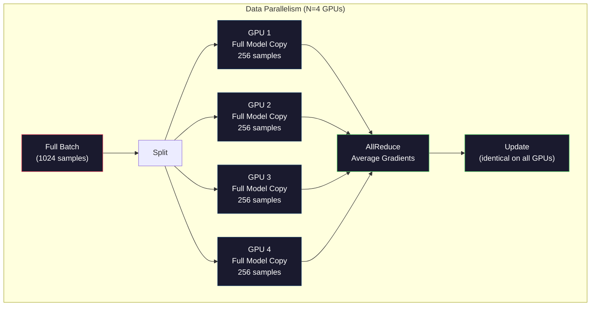
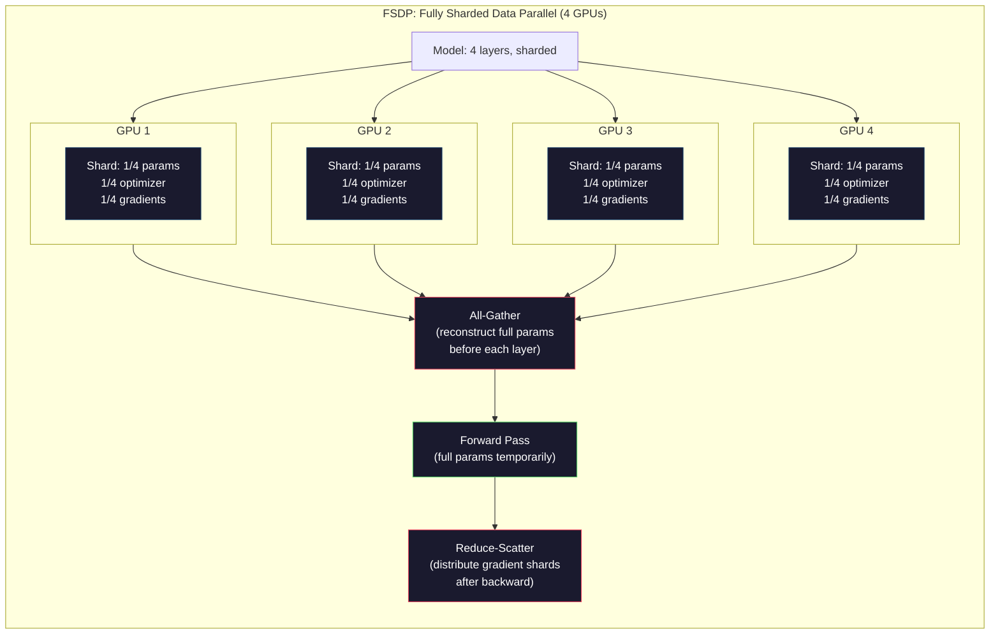
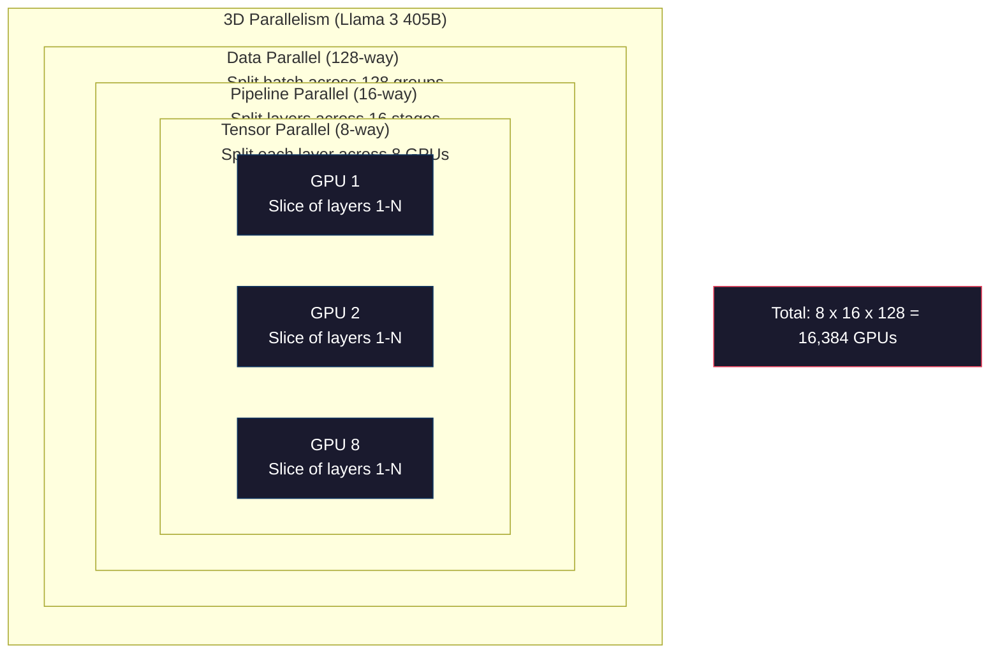

# 扩展：分布式训练、FSDP、DeepSpeed

> 你的 124M 模型在一块 GPU 上训练完了。现在试试 70 亿参数。模型放不进内存。数据在单台机器上要跑几周。在这种规模下，分布式训练不是可选项，而是唯一出路。

**类型：** 构建
**语言：** Python
**前置要求：** 第 10 阶段，第 04 课（预训练一个迷你 GPT）
**所需时间：** 约120分钟

## 学习目标

- 解释三种并行方式（数据并行、张量并行、流水线并行），以及根据模型和集群规模各自在何时是必需的
- 使用 PyTorch DDP 实现数据并行训练，并在多块 GPU 之间做梯度同步
- 为给定模型规模计算内存预算（权重 + 优化器状态 + 梯度 + 激活值），以确定最低硬件要求
- 配置 FSDP 或 DeepSpeed ZeRO 各阶段，在 GPU 之间切分模型状态，以容纳超出单 GPU 内存的模型

## 问题所在

一个 FP16 的 7B 参数模型，光是权重就需要 14GB。Adam 优化器为每个参数额外存储两份拷贝（一阶矩和二阶矩估计），那又是 28GB。反向传播时的梯度再加 14GB。在存储任何一个激活值之前，你就已经用到了 56GB。

一块 NVIDIA A100 有 80GB 内存。

80GB 中已用掉 56GB。这给激活值留下了 24GB——激活值是前向传播中计算出的中间值，必须保留到反向传播时用。对于一个 2048 token 序列、4096 维的模型，单层激活值约占 64MB。32 层的话，每个样本就需要 2GB。批大小为 8 需要 16GB。你有 24GB。批大小为 12 就爆了。

现在试试 70B 参数。光是权重：FP16 下 140GB。放不进一块 GPU。你至少需要 2 块 A100（2 x 80GB = 160GB）才能装下权重。加上优化器状态和梯度，你需要的就更多了：最少 3 块以上 GPU，而根据切分策略，实际上往往要 8-16 块。

Llama 3 405B 是在 16,384 块 NVIDIA H100 GPU 上训练的。这次训练的算力成本估计为 1 亿美元。DeepSeek V3 通过在架构上做巧妙设计（专家混合意味着每个 token 只激活一小部分参数）和训练效率优化，以大约 560 万美元训练出一个可比的模型。

本课涵盖让大规模训练成为可能的四种策略：数据并行、张量并行、流水线并行，以及全分片数据并行。在接触任何分布式训练框架之前，你将在纯 Python 中模拟每一种策略，以理解其机制。

## 概念说明

### 为什么必须分布式

下面是真实模型的内存账。每个数字都是算出来的，而非估计的。

| 模型 | 参数量 | 权重（FP16） | Adam 状态 | 梯度（FP16） | 总计（不含激活值） |
|-------|--------|----------------|-------------|------------------|----------------------|
| GPT-2 Small | 124M | 248 MB | 992 MB | 248 MB | 1.5 GB |
| Llama 3 8B | 8B | 16 GB | 64 GB | 16 GB | 96 GB |
| Llama 3 70B | 70B | 140 GB | 560 GB | 140 GB | 840 GB |
| Llama 3 405B | 405B | 810 GB | 3,240 GB | 810 GB | 4,860 GB |

「Adam 状态」这一列是致命的。Adam 为每个参数都存储一个滑动均值（m）和一个滑动方差（v），二者都是 FP32。对于一个 70B 模型，那就是 70B x 4 字节 x 2 = 560GB。光是优化器就需要七块 A100。

一块 H100 有 80GB。Llama 3 405B 至少需要 61 块 H100 才能装下权重、优化器和梯度。再加上激活值，这个数字还会增长。Meta 用了 16,384 块 GPU，不是因为他们想用——而是因为他们不得不用。

### 数据并行

最简单的分布式策略。把整个模型复制到 N 块 GPU。把每个训练批次拆成 N 等份。每块 GPU 在自己那份数据上跑一次前向和反向传播。反向传播后，在所有 GPU 之间对梯度求平均。每块 GPU 用同样的平均梯度更新它那份权重，使所有拷贝保持同步。

**好处：** 吞吐量线性扩展。N 块 GPU 每步处理 N 倍的数据。通信仅限于梯度求平均，而它可以与计算重叠。

**坏处：** 每块 GPU 都持有完整的模型、优化器状态和梯度拷贝。对于一个 70B 模型，每块 GPU 都需要 840GB。数据并行对降低单 GPU 内存毫无帮助，它只减少训练时间。

**数学：** 有效批大小 = per_gpu_batch_size x N。对于 N=64 块 GPU、每 GPU 批大小为 16 的情况，有效批大小为 1,024。Llama 3 使用的有效批大小为每步 1600 万 token。



### 张量并行

把单个层切分到多块 GPU 上。一次矩阵乘法被分给多块 GPU，每块计算结果的一部分。

考虑前馈层中一个形状为 (8192, 8192) 的权重矩阵。在 4 路张量并行下，每块 GPU 持有一个 (8192, 2048) 的分片。每块 GPU 用输入乘以它的分片，产生一个部分结果。这些部分结果被合并（通过 all-reduce 或 all-gather）以产生完整输出。

**好处：** 降低单 GPU 上模型权重的内存。一个 70B 模型切分到 8 块 GPU，意味着每块 GPU 持有约 8.75B 参数量的权重。

**坏处：** 在每一层之后都需要快速的 GPU 间通信。每次矩阵乘法后的 all-reduce 会增加延迟。这在 NVLink（同节点 GPU 间 900 GB/s）下效果很好，但在通过 InfiniBand（400 Gb/s，约 50 GB/s）连接的跨节点情况下效果很差。张量并行几乎总是限于单个节点内（8 块 GPU）。

**实际应用：** Megatron-LM 开创了张量并行。Llama 3 405B 在每个节点内使用 8 路张量并行。

### 流水线并行

按层切分模型。GPU 1 跑第 1-8 层。GPU 2 跑第 9-16 层。GPU 3 跑第 17-24 层。GPU 4 跑第 25-32 层。数据在流水线中流动：GPU 1 计算它的层并把激活值发给 GPU 2，GPU 2 计算它的层并发给 GPU 3，以此类推。

**好处：** GPU 之间通信极少——只在层边界处传递激活值，而它相比梯度或权重要小得多。因为带宽要求低，所以能跨节点工作。

**坏处：** 流水线气泡（pipeline bubbles）。当 GPU 4 正在 micro-batch 1 上做前向传播时，GPU 1、2、3 都在空闲（它们已经把自己那部分前向完了）。反向传播时，模式反转。采用朴素流水线时，GPU 利用率只有 1/N（N 为流水线级数）。

**GPipe 和 PipeDream** 通过把批次拆成 micro-batch 来解决气泡问题。GPU 1 一完成 micro-batch 1 的前向，就立刻开始 micro-batch 2。这使得计算在各流水线级之间重叠。有 M 个 micro-batch 和 N 个级时，气泡比例降到 (N-1)/M。用 M=16 个 micro-batch 和 N=4 个级，气泡就是 3/16 = 18.75% 的空闲时间。

### FSDP：全分片数据并行

FSDP 把数据并行的可扩展性和分片的内存效率结合起来。每块 GPU 不再持有模型的完整拷贝，而是只持有 1/N 的参数、梯度和优化器状态。

在某一层的前向传播之前，FSDP 运行一次 **all-gather**，把所有 GPU 上的完整参数收集到每块 GPU 的内存中。前向传播之后，每块 GPU 丢弃非本地的参数。反向传播过程中，再次运行 all-gather 以重建参数用于梯度计算。反向传播之后，一次 **reduce-scatter** 分发梯度分片，使每块 GPU 只存储 1/N 的梯度。

**70B 模型在 8 块 GPU 上的数学：**

| 组件 | 无 FSDP | 有 FSDP |
|-----------|-------------|-----------|
| 权重（FP16） | 每 GPU 140 GB | 每 GPU 17.5 GB |
| Adam 状态（FP32） | 每 GPU 560 GB | 每 GPU 70 GB |
| 梯度（FP16） | 每 GPU 140 GB | 每 GPU 17.5 GB |
| **总计** | **每 GPU 840 GB** | **每 GPU 105 GB** |

没有 FSDP，你无法把一个 70B 模型放进单块 80GB GPU。在 8 块 GPU 上用 FSDP，每块 GPU 用 105GB——等等，这仍然放不下。你至少需要 16 块 GPU 才能让每块 GPU 低于 80GB，或者把 FSDP 与激活值检查点（activation checkpointing，在反向传播时重算激活值而非存储它们）结合起来。

由于每层之前要做 all-gather，通信成本比普通数据并行更高。但内存的节省让以前不可能的训练成为可能。



### DeepSpeed ZeRO

DeepSpeed 的 ZeRO（Zero Redundancy Optimizer，零冗余优化器）在概念上与 FSDP 完全相同，但它由微软独立开发。它定义了三个阶段，每个阶段都更激进地分片：

| 阶段 | 分片对象 | 内存节省 | 通信 |
|-------|--------|---------------|---------------|
| ZeRO-1 | 仅优化器状态 | 约 4 倍降低 | 与数据并行相同 |
| ZeRO-2 | + 梯度 | 约 8 倍降低 | 略多 |
| ZeRO-3 | + 参数 | 约 N 倍降低（N 块 GPU） | 每层 all-gather |

ZeRO-3 等价于 FSDP。命名不同，机制相同。在 DeepSpeed 验证了这个概念之后，PyTorch 把 FSDP 作为一个原生实现加了进来。

DeepSpeed 还引入了 ZeRO-Offload（把优化器状态卸载到更便宜也更大的 CPU 内存）和 ZeRO-Infinity（卸载到 NVMe 固态硬盘）。它们用计算速度换内存容量——被卸载的操作更慢，但能腾出 GPU 内存。

### 混合精度训练

现代训练同时使用多种浮点格式：

- **前向传播**：FP16 或 BF16（16 位）。是 FP32 内存的一半。矩阵乘法在 tensor core 上快 2 倍。
- **主权重（Master weights）**：FP32（32 位）。由优化器维护，以保证权重更新时的数值精度。
- **损失缩放（Loss scaling）**：在反向传播之前把损失乘以一个大常数，以防止 FP16 梯度下溢为零。在优化器步骤之前再除以同一个常数。

BF16（Brain Float 16）具有与 FP32 相同的指数范围（8 个指数位），但精度更低（7 个尾数位，而 FP32 是 23 个）。它很少需要损失缩放，因为它能表示相同范围的值。FP16 有 5 个指数位和 10 个尾数位——它能表示更精细的值，但在极端量级处会溢出/下溢。

Google 的 TPU 原生使用 BF16。NVIDIA 的 A100 和 H100 同时支持 FP16 和 BF16。业界已大体转向 BF16，因为它消除了损失缩放的麻烦。

**一个 7B 模型的内存对比：**

| 精度 | 权重 | 优化器 | 梯度 | 总计 |
|-----------|---------|-----------|-----------|-------|
| 全程 FP32 | 28 GB | 56 GB | 28 GB | 112 GB |
| 混合精度（BF16 + FP32 主权重） | 14 GB | 56 GB | 14 GB | 84 GB |

在这个模型上，混合精度节省了 28GB。无论如何，优化器状态都保持在 FP32——内存的大头就花在这里。

### Megatron-LM 与 3D 并行

真正的大规模训练把三种并行都结合起来：

- **数据并行**跨节点组（扩展批大小）
- **张量并行**在节点内（把层切分到 8 块 GPU）
- **流水线并行**跨节点（把层组切分到不同机器）

Llama 3 405B 在 16,384 块 H100 上：
- 每个节点内 8 路张量并行（每节点 8 块 GPU）
- 跨节点 16 路流水线并行（16 个流水线级）
- 在剩余维度上 128 路数据并行（16,384 / 8 / 16 = 128）

这种 3D 分解（8 x 16 x 128 = 16,384）就是你扩展到数千块 GPU 的方式。每块 GPU 看到一份不同的数据分片（数据并行），持有每一层的一个切片（张量并行），并计算一组不同的层（流水线并行）。

DeepSeek V3 采取了不同的做法。他们的专家混合架构每个 token 只激活 671B 参数中的 37B。这意味着每块 GPU 只需计算（并存储激活值）那些被激活的参数。他们在 2,048 块 H800 GPU 上训练——不到 Meta GPU 数量的 1/8——花费 560 万美元，对比 Meta 估计的 1 亿美元。



```figure
paged-kv-cache
```

## 开始构建

### 第 1 步：模拟数据并行

把一个批次切分到模拟的 GPU 上。每块 GPU 在自己那份上计算前向传播。对「梯度」（我们用损失值来模拟它们）求平均。

```python
import numpy as np

def simulate_data_parallelism(data, num_gpus, model_fn):
    batch_size = len(data)
    shard_size = batch_size // num_gpus
    remainder = batch_size % num_gpus

    gpu_losses = []
    gpu_gradients = []

    offset = 0
    for gpu_id in range(num_gpus):
        extra = 1 if gpu_id < remainder else 0
        shard = data[offset:offset + shard_size + extra]
        offset += shard_size + extra

        loss, grad = model_fn(shard)
        gpu_losses.append(loss)
        gpu_gradients.append(grad)

    avg_loss = np.mean(gpu_losses)
    avg_gradient = np.mean(gpu_gradients, axis=0)

    return avg_loss, avg_gradient
```

all-reduce 操作（对梯度求平均）是数据并行中唯一的通信。在实践中，它在 NVIDIA GPU 上使用 NCCL 库，后者实现了环形 all-reduce（ring all-reduce）：每块 GPU 把它 1/N 的梯度发给邻居，从另一个邻居接收 1/N，经过 N-1 步后每块 GPU 都得到了完整的平均值。总通信量：2 x gradient_size x (N-1)/N，对于大 N 趋近于梯度大小的 2 倍。

### 第 2 步：模拟张量并行

把一个权重矩阵切分到多块 GPU 上。每块 GPU 计算一个部分矩阵乘法。合并结果。

```python
def simulate_tensor_parallelism(input_data, weight_matrix, num_gpus):
    d_in, d_out = weight_matrix.shape
    assert d_out % num_gpus == 0, f"d_out {d_out} not divisible by num_gpus {num_gpus}"
    shard_size = d_out // num_gpus

    partial_results = []
    for gpu_id in range(num_gpus):
        start = gpu_id * shard_size
        end = start + shard_size
        weight_shard = weight_matrix[:, start:end]

        partial = input_data @ weight_shard
        partial_results.append(partial)

    full_output = np.concatenate(partial_results, axis=-1)

    direct_output = input_data @ weight_matrix
    error = np.abs(full_output - direct_output).max()

    return full_output, error
```

误差应该正好为零（或者是机器精度量级）。张量并行在数学上是精确的——它产生的结果与在一块 GPU 上计算完整矩阵乘法相同。切分沿输出维度进行，因此每块 GPU 产生不同的列块，拼接起来重建出完整结果。

对于列并行的线性层（切分输出维度），你做拼接。对于行并行（切分输入维度），你做求和。在 transformer 的 FFN 中，第一个线性层（扩展）使用列并行，第二个线性层（收缩）使用行并行。这避免了两层之间的一次 all-reduce。

### 第 3 步：模拟流水线并行

把一个模型的层切分到虚拟 GPU 上。展示气泡问题——早期级在后期级计算时空闲。

```python
def simulate_pipeline_parallelism(num_layers, num_stages, num_microbatches):
    layers_per_stage = num_layers // num_stages

    timeline = {}
    clock = 0

    for mb in range(num_microbatches):
        for stage in range(num_stages):
            start_time = max(
                timeline.get((stage, mb - 1, "fwd"), (0, 0))[1] if mb > 0 else 0,
                timeline.get((stage - 1, mb, "fwd"), (0, 0))[1] if stage > 0 else 0,
            )
            end_time = start_time + layers_per_stage
            timeline[(stage, mb, "fwd")] = (start_time, end_time)

    last_fwd_end = max(v[1] for v in timeline.values())

    for mb in range(num_microbatches - 1, -1, -1):
        for stage in range(num_stages - 1, -1, -1):
            deps = [last_fwd_end]
            if mb < num_microbatches - 1 and (stage, mb + 1, "bwd") in timeline:
                deps.append(timeline[(stage, mb + 1, "bwd")][1])
            if stage < num_stages - 1 and (stage + 1, mb, "bwd") in timeline:
                deps.append(timeline[(stage + 1, mb, "bwd")][1])
            start_time = max(deps)
            end_time = start_time + layers_per_stage
            timeline[(stage, mb, "bwd")] = (start_time, end_time)

    total_time = max(v[1] for v in timeline.values())
    compute_time = num_microbatches * num_stages * layers_per_stage * 2
    bubble_fraction = 1.0 - compute_time / (total_time * num_stages)

    return timeline, total_time, bubble_fraction
```

有 4 个级、1 个 micro-batch 时，气泡比例是 75%——任意时刻四块 GPU 中有三块空闲。有 16 个 micro-batch 时，它降到约 19%。消除气泡的代价是内存：你必须同时存储所有在途 micro-batch 的激活值。

### 第 4 步：内存计算器

为任意模型规模计算精确的训练内存需求。

```python
def memory_calculator(
    params_billions,
    precision_bytes=2,
    optimizer="adam",
    num_gpus=1,
    sharding="none",
    sequence_length=2048,
    batch_size_per_gpu=1,
    hidden_dim=None,
    num_layers=None,
):
    params = params_billions * 1e9

    weight_memory = params * precision_bytes

    if optimizer == "adam":
        optimizer_memory = params * 4 * 2
    elif optimizer == "sgd":
        optimizer_memory = params * 4
    else:
        optimizer_memory = 0

    gradient_memory = params * precision_bytes

    total_no_activation = weight_memory + optimizer_memory + gradient_memory

    if hidden_dim and num_layers:
        activation_per_layer = (
            sequence_length * batch_size_per_gpu * hidden_dim * precision_bytes * 4
        )
        activation_memory = activation_per_layer * num_layers
    else:
        activation_memory = params * precision_bytes * 0.5

    if sharding == "fsdp" or sharding == "zero3":
        weight_memory /= num_gpus
        optimizer_memory /= num_gpus
        gradient_memory /= num_gpus
    elif sharding == "zero2":
        optimizer_memory /= num_gpus
        gradient_memory /= num_gpus
    elif sharding == "zero1":
        optimizer_memory /= num_gpus

    per_gpu_total = weight_memory + optimizer_memory + gradient_memory + activation_memory

    return {
        "params_billions": params_billions,
        "weights_gb": weight_memory / 1e9,
        "optimizer_gb": optimizer_memory / 1e9,
        "gradients_gb": gradient_memory / 1e9,
        "activations_gb": activation_memory / 1e9,
        "per_gpu_total_gb": per_gpu_total / 1e9,
        "total_across_gpus_gb": per_gpu_total * num_gpus / 1e9,
        "fits_on_80gb": per_gpu_total / 1e9 <= 80,
        "num_gpus": num_gpus,
        "sharding": sharding,
    }
```

这个计算器回答了每个 ML 工程师都会问的问题：「我需要多少块 GPU？」把模型规模喂给它，看看是否放得下。调整切分策略，直到单 GPU 总量降到 80GB 以下。

### 第 5 步：混合精度模拟

比较 FP32、FP16 和混合精度训练之间的内存使用。

```python
def mixed_precision_comparison(params_billions):
    params = params_billions * 1e9

    fp32_weights = params * 4
    fp32_optimizer = params * 4 * 2
    fp32_gradients = params * 4
    fp32_total = fp32_weights + fp32_optimizer + fp32_gradients

    fp16_weights = params * 2
    fp16_master = params * 4
    fp16_optimizer = params * 4 * 2
    fp16_gradients = params * 2
    fp16_total = fp16_weights + fp16_master + fp16_optimizer + fp16_gradients

    mixed_weights = params * 2
    mixed_optimizer = params * 4 * 2
    mixed_gradients = params * 2
    mixed_total = mixed_weights + mixed_optimizer + mixed_gradients

    return {
        "fp32_total_gb": fp32_total / 1e9,
        "fp16_with_master_gb": fp16_total / 1e9,
        "mixed_bf16_gb": mixed_total / 1e9,
        "savings_vs_fp32": 1 - mixed_total / fp32_total,
    }
```

对大多数人来说最大的意外是：混合精度并不会把内存减半。无论精度如何，优化器状态（Adam 的 m 和 v）都保持在 FP32。对于一个 7B 模型，FP32 训练用 112GB。混合精度用 84GB。那是减少了 25%，而不是 50%。优化器占了大头。

## 实际运用

### 运行所有模拟

```python
def run_all_demos():
    print("=" * 70)
    print("DATA PARALLELISM SIMULATION")
    print("=" * 70)

    np.random.seed(42)
    data = np.random.randn(64, 32)
    weight = np.random.randn(32, 16)

    def model_fn(batch):
        output = batch @ weight
        loss = np.mean(output ** 2)
        grad = 2 * batch.T @ (batch @ weight) / len(batch)
        return loss, grad

    for n_gpus in [1, 2, 4, 8]:
        loss, grad = simulate_data_parallelism(data, n_gpus, model_fn)
        print(f"  {n_gpus} GPUs: loss={loss:.4f}, grad_norm={np.linalg.norm(grad):.4f}")

    print()
    print("=" * 70)
    print("TENSOR PARALLELISM SIMULATION")
    print("=" * 70)

    x = np.random.randn(4, 8192)
    W = np.random.randn(8192, 8192)

    for n_gpus in [1, 2, 4, 8]:
        output, error = simulate_tensor_parallelism(x, W, n_gpus)
        print(f"  {n_gpus} GPUs: output_shape={output.shape}, max_error={error:.2e}")

    print()
    print("=" * 70)
    print("PIPELINE PARALLELISM SIMULATION")
    print("=" * 70)

    for n_mb in [1, 4, 8, 16, 32]:
        _, total_t, bubble = simulate_pipeline_parallelism(32, 4, n_mb)
        print(f"  {n_mb:2d} micro-batches: total_time={total_t:4d}, bubble={bubble:.1%}")

    print()
    print("=" * 70)
    print("MEMORY CALCULATOR")
    print("=" * 70)

    configs = [
        (7, "none", 1),
        (7, "fsdp", 8),
        (70, "none", 1),
        (70, "fsdp", 8),
        (70, "fsdp", 16),
        (405, "fsdp", 64),
        (405, "fsdp", 128),
    ]

    print(f"  {'Model':>8} {'Sharding':>8} {'GPUs':>5} {'Per-GPU':>10} {'Fits 80GB':>10}")
    print("  " + "-" * 50)
    for params, shard, gpus in configs:
        result = memory_calculator(params, num_gpus=gpus, sharding=shard)
        fits = "Yes" if result["fits_on_80gb"] else "No"
        print(f"  {params:>6}B {shard:>8} {gpus:>5} {result['per_gpu_total_gb']:>8.1f}GB {fits:>10}")

    print()
    print("=" * 70)
    print("MIXED PRECISION COMPARISON")
    print("=" * 70)

    for params_b in [7, 13, 70, 405]:
        result = mixed_precision_comparison(params_b)
        print(f"  {params_b}B: FP32={result['fp32_total_gb']:.0f}GB, "
              f"Mixed BF16={result['mixed_bf16_gb']:.0f}GB, "
              f"Savings={result['savings_vs_fp32']:.0%}")
```

## 交付成果

本课产出 `outputs/prompt-distributed-training-planner.md`——一个接收模型规模和可用硬件、然后产出完整分布式训练计划的 prompt：并行策略、内存预算、通信开销和预期吞吐量。

## 练习

1. 修改内存计算器以纳入激活值检查点。启用检查点时，只在每第 K 层存储激活值（典型 K=1，意味着全部重算）。展示内存与计算之间的权衡：检查点节省多少内存，又使训练慢多少（全量检查点大约多 33% 的计算）？

2. 扩展流水线并行模拟，实现 PipeDream 使用的 1F1B（一次前向，一次反向）调度。在 4 个级、8 个 micro-batch 的情况下，比较它与朴素调度的气泡比例。1F1B 调度应该有更小的峰值内存，因为它更早开始反向传播。

3. 实现一个梯度累积模拟器。不要在每个 micro-batch 后都 all-reduce，而是本地累积 K 步的梯度，然后 all-reduce。展示这如何把通信减少 K 倍，但产生完全相同的最终梯度（因而训练完全相同）。

4. 构建一个成本估算器。给定模型规模、目标 token 数、GPU 类型（A100 每小时 2 美元、H100 每小时 3.50 美元）和并行策略，估算以美元计的总训练成本。用已知成本来验证：Llama 3 405B 据报道花了约 1 亿美元，DeepSeek V3 花了约 560 万美元。

5. 给内存计算器加上 ZeRO-Offload。假设每节点 CPU 内存为 512GB，NVMe 为 2TB。展示把优化器状态卸载到 CPU 如何让一个 70B 模型能在 4 块 GPU（而非 16 块）上训练，代价是优化器步骤慢 30-50%。

## 关键术语

| 术语 | 通常说法 | 真实含义 |
|------|----------------|----------------------|
| Data parallelism（数据并行） | 「把模型复制到每块 GPU」 | 每块 GPU 处理一份不同的数据分片；每步之后通过 all-reduce 对梯度求平均 |
| Tensor parallelism（张量并行） | 「把一层切分到多块 GPU」 | 切分权重矩阵，让每块 GPU 计算矩阵乘法的一部分；需要快速的 NVLink 互连 |
| Pipeline parallelism（流水线并行） | 「把层切分到多块 GPU」 | 每块 GPU 跑一组不同的层；数据用 micro-batch 在流水线中流动以减少气泡 |
| FSDP | 「把一切都分片」 | 全分片数据并行——每块 GPU 持有 1/N 的权重、梯度和优化器状态；计算前做 all-gather |
| ZeRO | 「DeepSpeed 版的 FSDP」 | 零冗余优化器，有 3 个阶段：分片优化器（Stage 1）、+ 梯度（Stage 2）、+ 参数（Stage 3） |
| All-reduce | 「跨 GPU 求平均」 | 一种集合操作，每块 GPU 最终得到所有 GPU 输入的总和（或平均）——通常实现为环形 all-reduce |
| All-gather | 「从所有 GPU 收集」 | 一种集合操作，每块 GPU 最终得到所有 GPU 数据的拼接——在 FSDP 中用于重建完整参数 |
| Reduce-scatter | 「求和并分发」 | 一种集合操作，对数据做归约（求和）并把不同的块散发到不同 GPU——在 FSDP 中用于梯度分片 |
| Mixed precision（混合精度） | 「用半精度训练」 | 前向/反向用 FP16/BF16，优化器状态用 FP32——节省约 25% 内存而非 50%，因为优化器占大头 |
| Pipeline bubble（流水线气泡） | 「流水线中的空闲时间」 | GPU 等待上一级数据而空闲的时间比例——通过使用更多 micro-batch 来减少 |

## 延伸阅读

- [Rajbhandari et al., 2020 -- "ZeRO: Memory Optimizations Toward Training Trillion Parameter Models"](https://arxiv.org/abs/1910.02054) —— 定义了三个分片阶段的 DeepSpeed ZeRO 论文
- [Shoeybi et al., 2020 -- "Megatron-LM: Training Multi-Billion Parameter Language Models Using Model Parallelism"](https://arxiv.org/abs/1909.08053) —— NVIDIA 面向 transformer 的张量并行
- [Narayanan et al., 2021 -- "Efficient Large-Scale Language Model Training on GPU Clusters Using Megatron-LM"](https://arxiv.org/abs/2104.04473) —— 结合数据、张量和流水线的 3D 并行
- [Zhao et al., 2023 -- "PyTorch FSDP: Experiences on Scaling Fully Sharded Data Parallel"](https://arxiv.org/abs/2304.11277) —— PyTorch 的原生 FSDP 实现
- [Llama 3 Technical Report](https://arxiv.org/abs/2407.21783) —— 含 3D 并行细节的 16,384 块 GPU 训练
- [DeepSeek-V3 Technical Report](https://arxiv.org/abs/2412.19437) —— MoE 架构如何把训练成本降低一个数量级
