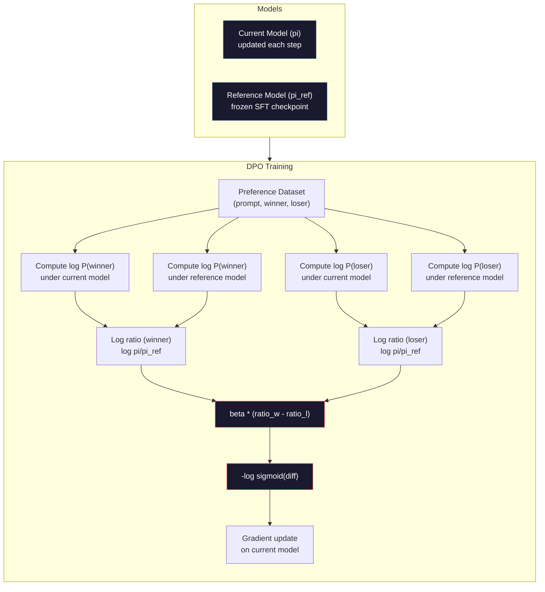

# DPO：直接偏好优化

> RLHF 有效。但它也需要训练三个模型（SFT、奖励模型、策略），需要应对 PPO 的不稳定性，还需要调一个 KL 惩罚。DPO 提出一个问题：如果你能跳过这一切呢？DPO 直接在偏好对上优化语言模型。不需要奖励模型，不需要 PPO，一个训练循环搞定，效果相同。

**类型：** 构建
**语言：** Python（搭配 numpy）
**前置要求：** 第 10 阶段，第 07 课（RLHF）
**所需时间：** 约90分钟

## 学习目标

- 实现 DPO 训练，无需单独的奖励模型，直接在偏好对上优化语言模型
- 推导 DPO 损失函数，并解释它如何通过策略的对数概率隐式地表示一个奖励模型
- 在训练稳定性、计算成本和所需模型数量方面比较 DPO 与 RLHF
- 调节 beta 参数，以控制训练后的策略偏离参考模型的程度

## 问题所在

你在第 07 课构建了一条 RLHF 流水线。三个阶段，三个模型。SFT 模型、奖励模型，以及用 PPO 优化的策略模型。仅奖励模型一项就需要数千个人类偏好对和一个单独的训练循环。PPO 需要仔细调节 KL 系数、学习率、裁剪比和 epoch 数。

在实践中，PPO 训练以不稳定而臭名昭著。微小的超参数变化就会导致训练发散。奖励模型只是人类偏好的一个不完美代理，而策略会找到办法利用它的弱点。KL 惩罚有帮助，但它本身也需要调节——太低你会得到奖励黑客，太高模型几乎学不到东西。

正是这种复杂性，让大多数开源模型在 InstructGPT 发表后好几年里都难以驾驭 RLHF。三阶段流水线很脆弱。每个阶段都有自己的失效模式，错误会层层累积。

2023 年 5 月，斯坦福的 Rafael Rafailov、Archit Sharma 及其同事发表了《Direct Preference Optimization: Your Language Model is Secretly a Reward Model》。关键洞见是：你不需要单独的奖励模型。最优奖励函数在数学上由语言模型自身的 token 概率所决定。你可以完全跳过奖励模型，直接在偏好对上优化语言模型。

DPO 把 RLHF 简化为一个单独的监督学习步骤。一个模型，一个损失函数，一个训练循环。没有强化学习。Zephyr-7B 是最早大规模使用 DPO 的模型之一，在多个基准上追平甚至击败了用完整 RLHF 训练的模型。Meta 在 Llama 3 的对齐流水线中把 DPO 作为其中一环。Anthropic 也在其对齐研究中引用过 DPO 风格的方法。

## 概念说明

### 关键洞见

RLHF 优化的是这个目标：

```
maximize: E[R(x, y)] - beta * KL(pi || pi_ref)
```

其中 R 是奖励模型，pi 是策略，pi_ref 是参考模型，beta 是 KL 系数。

DPO 论文表明这个目标有一个闭式最优解。对于任意奖励函数 R，最优策略为：

```
pi*(y | x) = pi_ref(y | x) * exp(R(x, y) / beta) / Z(x)
```

其中 Z(x) 是一个归一化常数。重新整理：

```
R(x, y) = beta * log(pi*(y | x) / pi_ref(y | x)) + beta * log Z(x)
```

这就是突破所在。奖励完全用策略模型的概率和参考模型的概率来表达。你不需要训练一个单独的奖励模型。奖励「隐式」地包含在这个概率比值中。

把它代入 Bradley-Terry 偏好模型：

```
P(y_w > y_l | x) = sigmoid(R(x, y_w) - R(x, y_l))
                  = sigmoid(beta * (log pi(y_w|x)/pi_ref(y_w|x) - log pi(y_l|x)/pi_ref(y_l|x)))
```

Z(x) 项相互抵消了，因为两个回复都以同一个提示 x 为条件。剩下的只是一个仅关于策略模型在被偏好回复和被拒绝回复上的对数概率，以及参考模型在这两者上的对数概率的函数。

### DPO 损失

```
L_DPO = -log(sigmoid(beta * (log pi(y_w|x)/pi_ref(y_w|x) - log pi(y_l|x)/pi_ref(y_l|x))))
```

我们逐项拆解：

- **y_w** = 被偏好的（获胜）回复
- **y_l** = 被拒绝的（落败）回复
- **x** = 提示
- **pi** = 当前模型（正在训练）
- **pi_ref** = 参考模型（冻结的 SFT 检查点）
- **beta** = 控制偏离参考程度的温度参数（通常为 0.1 到 0.5）

比值 `log pi(y|x) / pi_ref(y|x)` 是对数概率比。当这个比值为正时，当前模型给回复 y 分配了比参考模型更高的概率。为负时，当前模型分配了更低的概率。

DPO 损失推动模型提高被偏好回复的对数概率比，并降低被拒绝回复的对数概率比。beta 参数控制模型能够多激进地偏离参考——小的 beta 意味着允许较大的偏离，大的 beta 让模型保持接近参考。



### 为什么 DPO 更简单

| 方面 | RLHF（PPO） | DPO |
|--------|-----------|-----|
| 要训练的模型 | 3 个（SFT + 奖励 + 策略） | 1 个（仅策略） |
| 训练循环 | 3 个（SFT、RM 训练、PPO） | 2 个（SFT、DPO） |
| 超参数 | lr、KL 系数、裁剪比、RM 的 lr、x3 的 epoch | lr、beta、epoch |
| 奖励模型 | 必需（单独训练） | 隐含在模型概率中 |
| RL 算法 | PPO（复杂、不稳定） | 监督学习（稳定） |
| GPU 内存 | PPO 期间内存中有 3-4 个模型 | 2 个模型（当前 + 参考） |
| 训练稳定性 | 对超参数敏感 | 鲁棒，与 SFT 类似 |

DPO 在训练期间内存中需要两个模型——当前模型和冻结的参考模型。RLHF 需要三到四个：策略、参考、奖励模型，以及可选的价值函数基线。对于一个 70B 的模型，每份副本在 FP16 下占 140GB。消除奖励模型所节省的内存相当可观。

### 何时 DPO 胜过 RLHF

**小数据集。** 在 5,000 到 20,000 个偏好对的情况下，DPO 往往追平或超过 RLHF。RLHF 中的奖励模型需要足够的数据来泛化——数据有限时，它会过拟合并产生不可靠的奖励信号。DPO 通过根本不需要奖励模型来绕开这个问题。

**计算受限。** DPO 所需的计算量大约是完整 RLHF 的三分之一（一个训练循环而非三个）。对于没有大型 GPU 集群的团队，这是务实的选择。

**快速迭代。** 想试 10 个不同的偏好数据集，看哪个产生最好的模型？DPO 让你在几个小时内就跑完每个实验。RLHF 则需要为每个数据集重新训练奖励模型。

### 何时 RLHF 胜过 DPO

**大规模训练。** 在 GPT-4 或 Claude 的规模上，RLHF 单独的奖励模型能够捕捉更细微的偏好信号。奖励模型充当一个学习得到的损失函数，能适应复杂的质量标准。

**复杂的奖励信号。** 当「更好」涉及多个维度（有用性、无害性、诚实性）时，奖励模型可以学到这种多目标权衡。DPO 把每个偏好对都当作一个二元信号——一个更好，一个更差——而不建模其原因。

**迭代式对齐。** RLHF 流水线可以用当前策略生成新回复，让人类评分，然后在一个在线循环中重新训练奖励模型。DPO 工作在一个固定的偏好对数据集上。Constitutional AI（Anthropic 的方法）大量利用了 RLHF 的这种迭代特性。

### 超越 DPO：KTO、ORPO、SimPO

DPO 启发了一系列简化的对齐方法。

**KTO（Kahneman-Tversky Optimization，2024）：** 你甚至不需要成对数据。KTO 在非成对反馈上工作——只需把每个回复标记为「好」或「坏」，而不与某个替代方案比较。这大大简化了数据收集。你不必向标注员展示两个回复并问「哪个更好？」，而是展示一个回复并问「这个好吗？」损失函数应用了前景理论中的损失厌恶：坏回复受到的惩罚比好回复获得的奖励更重。

**ORPO（Odds Ratio Preference Optimization，2024）：** 把 SFT 和对齐合并到单个训练步骤中。ORPO 不是先做 SFT 再做 DPO，而是修改 SFT 损失以纳入一个偏好信号。损失有两项：在被偏好回复上的标准下一个 token 预测损失，加上一个增大被偏好回复与被拒绝回复概率差距的几率比项。一个训练循环而非两个。

**SimPO（Simple Preference Optimization，2024）：** 完全消除参考模型。SimPO 不是相对一个冻结的参考来计算对数概率比，而是把回复的平均对数概率（按长度归一化）用作隐式奖励。这节省了内存（不需要参考模型）并简化了训练。长度归一化防止模型偏好更短的回复。

| 方法 | 年份 | 内存中的模型数 | 需要成对数据？ | 需要参考模型？ | 训练循环 |
|--------|------|-----------------|-------------|-----------------|----------------|
| RLHF | 2022 | 3-4 | 是（用于 RM） | 是 | 3 |
| DPO | 2023 | 2 | 是 | 是 | 2 |
| KTO | 2024 | 2 | 否（非成对） | 是 | 2 |
| ORPO | 2024 | 1 | 是 | 否 | 1 |
| SimPO | 2024 | 1 | 是 | 否 | 1 |

趋势很明显：每种方法都再消除一块复杂性。RLHF 需要一个奖励模型和 PPO。DPO 把两者都消除了。KTO 消除了成对数据。ORPO 消除了单独的 SFT 阶段。SimPO 消除了参考模型。对齐税（alignment tax）——从基础模型走到对齐模型所付出的计算和复杂度成本——在持续下降。

### 真实的 DPO 部署

**Zephyr-7B（HuggingFace，2023 年 10 月）：** 以 Mistral 7B 为基础，在 UltraChat（20 万样本）上做 SFT，然后在 UltraFeedback（6 万个偏好对）上做 DPO。在 MT-Bench 上得分 6.47——当时最高的 7B 模型。作为对比，Llama 2 Chat 70B 得分 6.86，意味着 Zephyr 仅用 DPO 对齐就追到了一个比它大 10 倍的模型的 6% 以内。

**Llama 3（Meta，2024 年 4 月）：** 在初步的 RLHF 阶段之后使用 DPO。这种组合表明 DPO 与 RLHF 可以互补——RLHF 用于广泛对齐，DPO 用于有针对性的精修。

**Neural Magic / nm-chat（2024）：** 将 DPO 应用于多个开源模型，相比仅做 SFT 的基线，在对齐基准上持续展现出 5-15% 的提升。

```figure
dpo-loss
```

## 开始构建

### 第 1 步：偏好数据集

与 RLHF 格式相同——（prompt、preferred、rejected）三元组。DPO 直接消费这些数据，无需一个中间的奖励模型。

```python
import numpy as np
import sys
import os
sys.path.insert(0, os.path.join(os.path.dirname(__file__), "..", "..", "04-pre-training-mini-gpt", "code"))
from main import MiniGPT, LayerNorm, Embedding, TransformerBlock

PREFERENCE_DATA = [
    {
        "prompt": "What is the capital of France?",
        "preferred": "The capital of France is Paris.",
        "rejected": "France is a country in Europe. It has many cities. The capital is Paris. Paris is known for the Eiffel Tower.",
    },
    {
        "prompt": "Explain gravity in one sentence.",
        "preferred": "Gravity is the force that attracts objects with mass toward each other.",
        "rejected": "Gravity is something that makes things fall down when you drop them.",
    },
    {
        "prompt": "What is 15 times 7?",
        "preferred": "15 times 7 is 105.",
        "rejected": "Let me think about this. 15 times 7. Well, 10 times 7 is 70, and 5 times 7 is 35, so the answer might be around 105.",
    },
    {
        "prompt": "Name three programming languages.",
        "preferred": "Python, Rust, and TypeScript.",
        "rejected": "There are many programming languages. Some popular ones include various languages like Python and others.",
    },
    {
        "prompt": "What year did World War II end?",
        "preferred": "World War II ended in 1945.",
        "rejected": "World War II was a major global conflict. It involved many countries. The war ended in the mid-1940s, specifically in 1945.",
    },
    {
        "prompt": "Define machine learning.",
        "preferred": "Machine learning is a field where algorithms learn patterns from data to make predictions without being explicitly programmed.",
        "rejected": "Machine learning is a type of AI. AI stands for artificial intelligence. Machine learning uses data to learn.",
    },
]
```

### 第 2 步：序列对数概率

DPO 损失需要计算给定提示下一个回复的总对数概率。这意味着在完整的（prompt + response）序列上运行模型，并对每个回复 token 的对数概率求和。

```python
def tokenize_sequence(text, vocab_size=256):
    return [min(t, vocab_size - 1) for t in list(text.encode("utf-8"))]


def compute_sequence_log_prob(model, prompt_tokens, response_tokens, max_seq_len=128):
    full_sequence = prompt_tokens + response_tokens
    if len(full_sequence) > max_seq_len:
        full_sequence = full_sequence[:max_seq_len]

    if len(full_sequence) < 2:
        return 0.0

    input_ids = np.array(full_sequence[:-1]).reshape(1, -1)
    target_ids = np.array(full_sequence[1:])

    logits = model.forward(input_ids)
    logits = logits[0]

    max_logits = logits.max(axis=-1, keepdims=True)
    log_probs = logits - max_logits - np.log(
        np.exp(logits - max_logits).sum(axis=-1, keepdims=True)
    )

    prompt_len = len(prompt_tokens)
    response_start = max(0, prompt_len - 1)
    response_end = len(target_ids)

    if response_start >= response_end:
        return 0.0

    response_log_probs = log_probs[response_start:response_end, :]
    response_targets = target_ids[response_start:response_end]

    total_log_prob = 0.0
    for i, target in enumerate(response_targets):
        total_log_prob += response_log_probs[i, target]

    return total_log_prob
```

这个函数是 DPO 的主力。对每个偏好对，它运行四次：模型在被偏好回复上、模型在被拒绝回复上、参考在被偏好回复上、参考在被拒绝回复上。也就是说每个训练样本 4 次前向传播，相比之下 RLHF 需要生成 + 奖励打分 + 价值估计 + PPO 更新。更简单、更快、更稳定。

### 第 3 步：DPO 损失

论文核心的代码体现。一个函数，一个损失，没有奖励模型。

```python
def sigmoid(x):
    return np.where(
        x >= 0,
        1.0 / (1.0 + np.exp(-x)),
        np.exp(x) / (1.0 + np.exp(x))
    )


def dpo_loss(policy_logprob_preferred, policy_logprob_rejected,
             ref_logprob_preferred, ref_logprob_rejected, beta=0.1):
    preferred_ratio = policy_logprob_preferred - ref_logprob_preferred
    rejected_ratio = policy_logprob_rejected - ref_logprob_rejected

    logit = beta * (preferred_ratio - rejected_ratio)

    loss = -np.log(sigmoid(logit) + 1e-8)

    preferred_reward = beta * preferred_ratio
    rejected_reward = beta * rejected_ratio

    return loss, {
        "preferred_ratio": float(preferred_ratio),
        "rejected_ratio": float(rejected_ratio),
        "logit": float(logit),
        "implicit_preferred_reward": float(preferred_reward),
        "implicit_rejected_reward": float(rejected_reward),
        "reward_margin": float(preferred_reward - rejected_reward),
    }
```

`preferred_ratio` 和 `rejected_ratio` 是来自 DPO 推导的对数概率比。当当前模型给被偏好回复分配了更高的概率（相对于参考），并给被拒绝回复分配了更低的概率时，logit 为正，损失就低。训练信号正是把模型往这个方向推。

`implicit_preferred_reward` 和 `implicit_rejected_reward` 是 DPO 损失隐式分配的奖励。你可以把它们提取出来以验证训练是否在起作用——被偏好奖励与被拒绝奖励之间的边际应当随训练而增大。

### 第 4 步：DPO 训练循环

一个标准的监督训练循环。没有 PPO，没有奖励模型。只有前向传播和梯度更新。

```python
def copy_model_weights(source, target):
    target.embedding.token_embed = source.embedding.token_embed.copy()
    target.embedding.pos_embed = source.embedding.pos_embed.copy()
    target.ln_f.gamma = source.ln_f.gamma.copy()
    target.ln_f.beta = source.ln_f.beta.copy()
    for s_block, t_block in zip(source.blocks, target.blocks):
        t_block.attn.W_q = s_block.attn.W_q.copy()
        t_block.attn.W_k = s_block.attn.W_k.copy()
        t_block.attn.W_v = s_block.attn.W_v.copy()
        t_block.attn.W_out = s_block.attn.W_out.copy()
        t_block.ffn.W1 = s_block.ffn.W1.copy()
        t_block.ffn.W2 = s_block.ffn.W2.copy()
        t_block.ffn.b1 = s_block.ffn.b1.copy()
        t_block.ffn.b2 = s_block.ffn.b2.copy()
        t_block.ln1.gamma = s_block.ln1.gamma.copy()
        t_block.ln1.beta = s_block.ln1.beta.copy()
        t_block.ln2.gamma = s_block.ln2.gamma.copy()
        t_block.ln2.beta = s_block.ln2.beta.copy()


def dpo_train(policy_model, reference_model, preference_data,
              num_epochs=5, lr=5e-6, beta=0.1, max_seq_len=128):
    print(f"DPO Training: {len(preference_data)} pairs, {num_epochs} epochs, "
          f"lr={lr}, beta={beta}")
    print()

    losses = []
    margins = []

    for epoch in range(num_epochs):
        epoch_loss = 0.0
        epoch_margin = 0.0
        num_examples = 0

        indices = np.random.permutation(len(preference_data))

        for idx in indices:
            pair = preference_data[idx]

            prompt_tokens = tokenize_sequence(pair["prompt"])
            preferred_tokens = tokenize_sequence(pair["preferred"])
            rejected_tokens = tokenize_sequence(pair["rejected"])

            pi_logprob_w = compute_sequence_log_prob(
                policy_model, prompt_tokens, preferred_tokens, max_seq_len
            )
            pi_logprob_l = compute_sequence_log_prob(
                policy_model, prompt_tokens, rejected_tokens, max_seq_len
            )
            ref_logprob_w = compute_sequence_log_prob(
                reference_model, prompt_tokens, preferred_tokens, max_seq_len
            )
            ref_logprob_l = compute_sequence_log_prob(
                reference_model, prompt_tokens, rejected_tokens, max_seq_len
            )

            loss, metrics = dpo_loss(
                pi_logprob_w, pi_logprob_l,
                ref_logprob_w, ref_logprob_l, beta
            )

            update_direction = 1.0 if metrics["logit"] < 0 else -0.1
            for block in policy_model.blocks:
                block.ffn.W1 += lr * update_direction * np.random.randn(*block.ffn.W1.shape) * 0.01
                block.ffn.W2 += lr * update_direction * np.random.randn(*block.ffn.W2.shape) * 0.01

            epoch_loss += loss
            epoch_margin += metrics["reward_margin"]
            num_examples += 1
            losses.append(float(loss))
            margins.append(metrics["reward_margin"])

        avg_loss = epoch_loss / max(num_examples, 1)
        avg_margin = epoch_margin / max(num_examples, 1)

        print(f"  Epoch {epoch + 1}/{num_epochs} | Loss: {avg_loss:.4f} | "
              f"Avg Margin: {avg_margin:.4f}")

    return policy_model, losses, margins
```

相比 RLHF，这个训练循环简单得令人耳目一新。对每个偏好对：计算四个对数概率（两个模型，两个回复），把它们代入 DPO 损失，计算梯度，更新策略。没有生成步骤，没有奖励模型推理，没有优势估计，没有裁剪。

### 第 5 步：比较 DPO 与 RLHF

测量隐式奖励边际和对数概率偏移，以将 DPO 与第 07 课的 RLHF 模型作比较。

```python
def evaluate_preference_accuracy(model, reference_model, preference_data, beta=0.1, max_seq_len=128):
    correct = 0
    total = 0

    for pair in preference_data:
        prompt_tokens = tokenize_sequence(pair["prompt"])
        preferred_tokens = tokenize_sequence(pair["preferred"])
        rejected_tokens = tokenize_sequence(pair["rejected"])

        pi_w = compute_sequence_log_prob(model, prompt_tokens, preferred_tokens, max_seq_len)
        pi_l = compute_sequence_log_prob(model, prompt_tokens, rejected_tokens, max_seq_len)
        ref_w = compute_sequence_log_prob(reference_model, prompt_tokens, preferred_tokens, max_seq_len)
        ref_l = compute_sequence_log_prob(reference_model, prompt_tokens, rejected_tokens, max_seq_len)

        preferred_reward = beta * (pi_w - ref_w)
        rejected_reward = beta * (pi_l - ref_l)

        if preferred_reward > rejected_reward:
            correct += 1
        total += 1

    return correct / max(total, 1)


def analyze_implicit_rewards(model, reference_model, preference_data, beta=0.1, max_seq_len=128):
    print("Implicit Reward Analysis:")
    print("-" * 65)
    print(f"  {'Prompt':<30} {'Pref Reward':>12} {'Rej Reward':>12} {'Margin':>10}")
    print("  " + "-" * 60)

    for pair in preference_data:
        prompt_tokens = tokenize_sequence(pair["prompt"])
        preferred_tokens = tokenize_sequence(pair["preferred"])
        rejected_tokens = tokenize_sequence(pair["rejected"])

        pi_w = compute_sequence_log_prob(model, prompt_tokens, preferred_tokens, max_seq_len)
        pi_l = compute_sequence_log_prob(model, prompt_tokens, rejected_tokens, max_seq_len)
        ref_w = compute_sequence_log_prob(reference_model, prompt_tokens, preferred_tokens, max_seq_len)
        ref_l = compute_sequence_log_prob(reference_model, prompt_tokens, rejected_tokens, max_seq_len)

        pref_reward = beta * (pi_w - ref_w)
        rej_reward = beta * (pi_l - ref_l)
        margin = pref_reward - rej_reward

        truncated = pair["prompt"][:28] + ".." if len(pair["prompt"]) > 30 else pair["prompt"]
        print(f"  {truncated:<30} {pref_reward:>12.4f} {rej_reward:>12.4f} {margin:>10.4f}")

    print()
```

### 第 6 步：Beta 敏感性分析

beta 参数是 DPO 中等价于 RLHF 里 KL 系数的东西。它控制模型能在多大程度上偏离参考。这个实验展示了它的效果。

```python
def beta_sensitivity_analysis(sft_model, preference_data, betas, max_seq_len=128):
    print("Beta Sensitivity Analysis")
    print("-" * 60)
    print(f"  {'Beta':>8} {'Final Loss':>12} {'Final Margin':>14} {'Accuracy':>10}")
    print("  " + "-" * 55)

    results = []

    for beta in betas:
        policy = MiniGPT(
            vocab_size=256, embed_dim=128, num_heads=4,
            num_layers=4, max_seq_len=max_seq_len, ff_dim=512
        )
        reference = MiniGPT(
            vocab_size=256, embed_dim=128, num_heads=4,
            num_layers=4, max_seq_len=max_seq_len, ff_dim=512
        )
        copy_model_weights(sft_model, policy)
        copy_model_weights(sft_model, reference)

        policy, losses, margins_list = dpo_train(
            policy, reference, preference_data,
            num_epochs=3, lr=5e-6, beta=beta, max_seq_len=max_seq_len
        )

        accuracy = evaluate_preference_accuracy(
            policy, reference, preference_data, beta, max_seq_len
        )

        final_loss = losses[-1] if losses else 0
        final_margin = margins_list[-1] if margins_list else 0

        print(f"  {beta:>8.3f} {final_loss:>12.4f} {final_margin:>14.4f} {accuracy:>10.1%}")
        results.append({
            "beta": beta,
            "final_loss": final_loss,
            "final_margin": final_margin,
            "accuracy": accuracy,
        })

        print()

    return results
```

小的 beta（0.01）让模型自由地偏离参考——学习快但有退化解的风险。大的 beta（1.0）让模型保持接近参考——稳定但学习慢。对大多数应用来说，最佳区间是 0.1 到 0.3。

## 实际运用

### 完整 DPO 流水线演示

```python
if __name__ == "__main__":
    np.random.seed(42)

    print("=" * 70)
    print("DPO: DIRECT PREFERENCE OPTIMIZATION")
    print("=" * 70)
    print()

    print("STEP 1: Initialize SFT Model (from Lesson 06)")
    print("-" * 50)
    sft_model = MiniGPT(
        vocab_size=256, embed_dim=128, num_heads=4,
        num_layers=4, max_seq_len=128, ff_dim=512
    )
    print(f"  Parameters: {sft_model.count_parameters():,}")
    print()

    print("STEP 2: DPO Training")
    print("-" * 50)

    policy_model = MiniGPT(
        vocab_size=256, embed_dim=128, num_heads=4,
        num_layers=4, max_seq_len=128, ff_dim=512
    )
    reference_model = MiniGPT(
        vocab_size=256, embed_dim=128, num_heads=4,
        num_layers=4, max_seq_len=128, ff_dim=512
    )
    copy_model_weights(sft_model, policy_model)
    copy_model_weights(sft_model, reference_model)

    policy_model, losses, margins = dpo_train(
        policy_model, reference_model, PREFERENCE_DATA,
        num_epochs=5, lr=5e-6, beta=0.1
    )
    print()

    print("=" * 70)
    print("STEP 3: Evaluate")
    print("=" * 70)
    print()

    pre_accuracy = evaluate_preference_accuracy(
        sft_model, reference_model, PREFERENCE_DATA, beta=0.1
    )
    post_accuracy = evaluate_preference_accuracy(
        policy_model, reference_model, PREFERENCE_DATA, beta=0.1
    )

    print(f"  Preference accuracy (pre-DPO):  {pre_accuracy:.1%}")
    print(f"  Preference accuracy (post-DPO): {post_accuracy:.1%}")
    print()

    analyze_implicit_rewards(policy_model, reference_model, PREFERENCE_DATA, beta=0.1)

    print("=" * 70)
    print("STEP 4: Training Dynamics")
    print("=" * 70)
    print()

    if losses:
        print("  Loss curve:")
        window = max(1, len(losses) // 5)
        for i in range(0, len(losses), window):
            chunk = losses[i:i + window]
            avg = sum(chunk) / len(chunk)
            print(f"    Steps {i:3d}-{i + len(chunk) - 1:3d}: loss = {avg:.4f}")
        print()

    if margins:
        print("  Reward margin curve:")
        window = max(1, len(margins) // 5)
        for i in range(0, len(margins), window):
            chunk = margins[i:i + window]
            avg = sum(chunk) / len(chunk)
            print(f"    Steps {i:3d}-{i + len(chunk) - 1:3d}: margin = {avg:.4f}")
        print()

    print("=" * 70)
    print("STEP 5: Beta Sensitivity")
    print("=" * 70)
    print()

    beta_results = beta_sensitivity_analysis(
        sft_model, PREFERENCE_DATA, betas=[0.01, 0.1, 0.3, 1.0]
    )

    print("=" * 70)
    print("DPO vs RLHF COMPARISON")
    print("=" * 70)
    print()
    print("  DPO advantages:")
    print("    - 1 training loop (vs 3 for RLHF)")
    print("    - 2 models in memory (vs 3-4 for RLHF)")
    print("    - Supervised learning (vs RL, more stable)")
    print("    - No reward model to train or maintain")
    print()
    print("  RLHF advantages:")
    print("    - Separate reward model captures complex preferences")
    print("    - Online learning: generate, rate, retrain")
    print("    - Better for multi-objective alignment")
    print("    - Proven at largest scales (GPT-4, Claude)")
    print()
    print("  Practical guidance:")
    print("    - Start with DPO. It's simpler and often sufficient.")
    print("    - Switch to RLHF if DPO plateaus on your eval metrics.")
    print("    - Many production systems use both: RLHF first, DPO to refine.")
```

## 交付成果

本课产出 `outputs/prompt-alignment-method-selector.md`——一个帮助你为自己的用例选择正确对齐方法（SFT、RLHF、DPO、KTO、ORPO、SimPO）的提示。给定你的数据可获得性、计算预算和对齐目标，它会推荐一种方法和一份训练计划。

## 练习

1. 实现 KTO（Kahneman-Tversky Optimization）。KTO 不需要成对数据——只需把每个回复标记为「好」或「坏」。好回复的损失是 `-log(sigmoid(beta * log_ratio))`，坏回复的损失是 `-log(1 - sigmoid(beta * log_ratio))`，并在坏回复损失上加一个损失厌恶乘子（通常为 1.5 倍）。在相同数据上训练（把 preferred 当作「好」、rejected 当作「坏」，各自独立处理），并将准确率与 DPO 作比较。

2. 实现长度归一化的 DPO。不用原始对数概率，而是除以回复 token 的数量：`normalized_logprob = total_logprob / num_tokens`。这防止模型偏好更短的回复（它们的总对数概率更高）。比较有归一化和无归一化时的隐式奖励边际。

3. 构建一个 ORPO 风格的组合损失。在 DPO 损失上加一个在被偏好回复上的标准下一个 token 预测损失：`L = L_sft(preferred) + alpha * L_dpo`。试试 alpha 值为 0.1、0.5 和 1.0。组合损失应当产生一个既能遵循指令（来自 SFT 项）又偏好更好回复（来自 DPO 项）的模型，从而消除单独 SFT 阶段的需要。

4. 实现迭代式 DPO。运行 DPO 3 个 epoch，然后从训练好的模型生成新回复，把它们与原始的被偏好回复配成新的偏好对，再次运行 DPO。进行两轮这样的「自博弈」过程。比较第 1 轮和第 2 轮后的偏好准确率，看迭代式精修是否有帮助。

5. 比较使用不同参考模型的 DPO。不用 SFT 检查点作参考，而是试试：（a）基础模型（SFT 之前），（b）DPO 第 1 个 epoch 的检查点，（c）策略模型的指数移动平均。报告哪个参考产生最高的偏好准确率和最稳定的训练曲线。

## 关键术语

| 术语 | 通常说法 | 真实含义 |
|------|----------------|----------------------|
| DPO | 「不带 RL 的 RLHF」 | Direct Preference Optimization（直接偏好优化）：一种监督学习算法，直接在偏好对上优化语言模型，绕开奖励模型和 PPO |
| 隐式奖励 | 「奖励就在模型里」 | 奖励函数由策略模型与参考模型之间的对数概率比决定——不需要单独的奖励模型 |
| Beta（DPO） | 「那个温度」 | 控制策略能在多大程度上偏离参考模型——小的 beta 允许大偏离，大的 beta 让模型保持接近 |
| 对数概率比 | 「模型改变了多少」 | log pi(y\|x) - log pi_ref(y\|x)——为正意味着当前模型分配了比参考更高的概率 |
| 参考模型 | 「那个冻结的检查点」 | SFT 模型的一份副本，其权重永不改变——用作计算概率比的锚点 |
| KTO | 「不带成对数据的 DPO」 | Kahneman-Tversky Optimization：在非成对的「好」或「坏」标签上工作，而不要求偏好对 |
| ORPO | 「一步式对齐」 | Odds Ratio Preference Optimization：通过给 SFT 损失添加一个偏好项，把 SFT 和对齐合并到单个训练循环中 |
| SimPO | 「不需要参考」 | Simple Preference Optimization：用按长度归一化的平均对数概率作隐式奖励，从而消除参考模型 |
| 对齐税 | 「让模型变安全的代价」 | 从基础模型走到对齐模型所需的额外计算、数据和复杂度——DPO 显著降低了它 |

## 延伸阅读

- [Rafailov et al., 2023 -- "Direct Preference Optimization: Your Language Model is Secretly a Reward Model"](https://arxiv.org/abs/2305.18290) -- 把对齐从 RLHF 简化为监督学习的 DPO 论文
- [Tunstall et al., 2023 -- "Zephyr: Direct Distillation of LM Alignment"](https://arxiv.org/abs/2310.16944) -- Zephyr-7B，展示在 UltraFeedback 上的 DPO 在基准上追平 RLHF
- [Ethayarajh et al., 2024 -- "KTO: Model Alignment as Prospect Theoretic Optimization"](https://arxiv.org/abs/2402.01306) -- 消除对成对偏好的需要
- [Hong et al., 2024 -- "ORPO: Monolithic Preference Optimization without Reference Model"](https://arxiv.org/abs/2403.07691) -- 把 SFT 和对齐合并为一步
- [Meng et al., 2024 -- "SimPO: Simple Preference Optimization with a Reference-Free Reward"](https://arxiv.org/abs/2405.14734) -- 彻底消除参考模型
- [Llama 3 Technical Report](https://arxiv.org/abs/2407.21783) -- Meta 结合 RLHF 与 DPO 的对齐流水线
