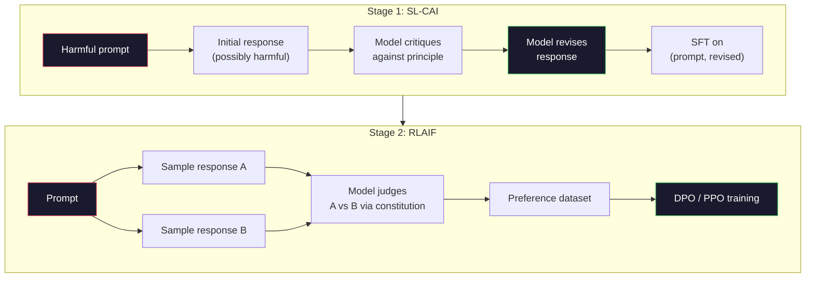
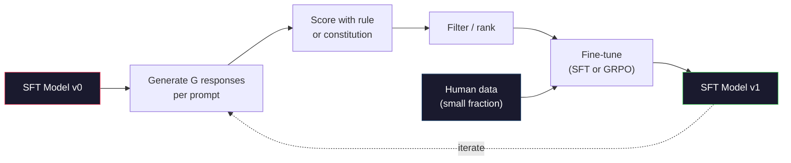

# Constitutional AI 与自我改进

> RLHF 需要人类参与循环。Constitutional AI 用模型自身替换掉其中的大部分人类。写一份原则清单，让模型对照这些原则批评自己的输出，然后在这些批评上训练。DeepSeek-R1 在 2025 年把这个思路推得更远：让模型生成数百万条推理轨迹，用一条规则给它们打分，并在结果上运行 GRPO。一个 2026 年的前沿模型里，大部分「对齐工作」就是模型自我对齐。本课会构建这两个循环。

**类型：** 构建
**语言：** Python（标准库 + numpy）
**前置要求：** 第 10 阶段，第 06-08 课（SFT、RLHF、DPO）
**所需时间：** 约45分钟

## 学习目标

- 实现 Constitutional AI 的两阶段循环：自我批评加自我修订，然后在修订后的成对数据上做偏好训练
- 推导 GRPO 目标（DeepSeek-R1 的组相对策略优化），并将它与 PPO 的价值函数基线作对比
- 用基于规则的结果奖励生成可验证的推理轨迹，并在没有单独奖励模型的情况下给它们打分
- 判断何时自我改进胜过人类偏好数据，何时它会坍缩为模式追逐（mode seeking）

## 问题所在

你在第 07 课构建了 RLHF，在第 08 课构建了 DPO。两者都依赖同一种昂贵的输入：人类偏好对。Anthropic 在 InstructGPT 时代的流水线用了大约 33,000 个比较。Llama 2 Chat 用了超过 150 万个。Claude 3 用得更多。这些数据获取缓慢、成本高昂，而且偏向于标注员在评分那天恰好相信的任何观点。

2022 年的 Constitutional AI 论文提出了一个简单的问题。如果让模型自己生成偏好标签呢？给它一份成文的原则清单——「宪法」——并让它批评自己的回复。这些批评就成了训练信号。

2024 年，DeepSeek 把这个思路推得更远。他们表明，对于任何有可验证结果的任务（有已知答案的数学题、要么通过测试要么失败的代码、要么赢要么输的游戏），你可以完全跳过批评者。生成许多候选解。用一条确定性规则给每个打分。在奖励上运行一个策略梯度算法。DeepSeek-R1 就是这样训练的，几乎不用人类偏好数据，并追平了 o1 级别的推理性能。

这两个循环——用于主观行为的 Constitutional AI 和用于可验证行为的基于规则的 RL——是 2026 年主流的对齐配方。过去投入到 RLHF 里的人类偏好预算，现在花在一个小得多的步骤上：挑选宪法和挑选奖励规则。

## 概念说明

### Constitutional AI 循环

Bai et al.（2022）把流水线构造成两个阶段。

**阶段 1：从 AI 反馈中监督学习（SL-CAI）。** 从一个有用但可能有害的 SFT 模型开始。用可能有害的请求去提示它。对于每个回复，让「同一个模型」对照某条宪法原则批评其回复，然后修订。在修订后的回复上微调。数据集是（prompt、revised_response）对。

**阶段 2：从 AI 反馈中强化学习（RLAIF）。** 采样成对回复。让模型判断哪一个更好地遵循了宪法。这些成对偏好训练出一个奖励模型。然后用这个奖励对模型运行 PPO 或 DPO。与 RLHF 的关键区别在于：偏好来自模型，而非来自人类。



宪法是那个杠杆。Anthropic 最初的版本有 16 条原则（后来扩充了）。一条原则读起来像是「请选择最不可能让来自各种文化背景的任何人反感的回复。」你为每一步挑选原则，有时随机挑，有时根据提示的类别挑。

### 宪法实际上做了什么

宪法把对齐契约从「数据」转移到了「文本」。在 RLHF 下改变行为意味着重新标注数千个成对数据。在 CAI 下改变行为意味着编辑一个段落。这是主要的实用收益。

它有代价。模型的自我判断只能和它起始的校准水平一样好。如果 SFT 模型有盲点——比如它无法识别操纵性的措辞——批评步骤就会继承这些盲点。CAI 压缩了对齐循环，但无法把信号放大到超过基础模型的天花板。这就是为什么每条生产级 CAI 流水线仍然使用一些人类偏好数据，通常是纯 RLHF 体量的 5-10%。

### GRPO：组相对策略优化

DeepSeek 在 DeepSeekMath 论文（2024）中引入了 GRPO，并把它用作 DeepSeek-R1（2025）的骨干。GRPO 是 PPO 的一种变体，去掉了价值函数。

回想 PPO 的目标（来自第 07 课）：

```
L_PPO = E[min(r(theta) * A, clip(r(theta), 1-eps, 1+eps) * A)]
```

其中 `A` 是优势，通常用一个学习得到的价值网络 `V(s)` 通过 GAE 来估计。这个价值网络是一个与策略同样大小的第二个模型。它使内存翻倍，并引入它自己的训练循环。

GRPO 扔掉了价值函数。对于每个提示，它采样一组 G 个回复（通常 G=16 或 64）。计算每个回复的奖励，然后在组内归一化：

```
A_i = (r_i - mean(r_1, ..., r_G)) / std(r_1, ..., r_G)
```

优势就是该回复奖励相对于它的兄弟回复的 z 分数。没有价值函数。组充当了它自己的基线。

```
L_GRPO = E[min(r(theta) * A_group, clip(r(theta), 1-eps, 1+eps) * A_group)] - beta * KL(pi || pi_ref)
```

相对参考模型的 KL 惩罚仍然在，与 PPO 一样。裁剪比也仍然在。消失的是那个单独的批评者。

### 为什么 GRPO 对推理重要

对于推理任务，奖励往往是稀疏且二元的：最终答案要么对要么错。在稀疏二元奖励上训练的价值函数是一种浪费——它学不到有用的中间估计，因为直到最后一步之前，几乎每个状态的期望回报都相同。GRPO 的组归一化给你一个即时的相对信号：在对同一道数学题的 16 次尝试中，哪些尝试在这道题上高于平均？

这正是你从基于规则的奖励中得到的信号形态：

- **数学**：sympy 或一个符号检查器判定最终答案是否匹配。
- **代码**：一个测试套件判定通过/失败。
- **格式**：一个正则表达式判定答案是否在所需的 XML 标签里。
- **多步证明**：一个证明助手（Lean、Coq）判定有效性。

DeepSeek-R1-Zero 仅用两种奖励训练：数学基准上的准确率和格式合规（答案在 `<answer>` 标签内）。没有人类偏好，没有批评者模型。DeepSeek 论文描述的那个「顿悟时刻」（aha moment）——模型自发学会自我检查和回溯——仅仅从在稀疏规则奖励上的 GRPO 中涌现出来。

### 过程奖励模型对比结果奖励模型

你仍然有一个设计选择：奖励最终答案（结果奖励模型，ORM）还是奖励每个中间步骤（过程奖励模型，PRM）。

| 维度 | ORM | PRM |
|------|-----|-----|
| 每条轨迹的信号 | 1 个数字 | N 个数字（每步一个） |
| 监督来源 | 最终答案检查 | 步骤级标签或自我判断 |
| 训练成本 | 便宜 | 昂贵 |
| 信用分配 | 稀疏、嘈杂 | 密集、有针对性 |
| 奖励黑客风险 | 较低 | 较高（模型优化 PRM 的伪影） |
| 使用者 | DeepSeek-R1、R1-Zero | OpenAI o1（据称）、Math-Shepherd |

2024-2025 年的共识是 ORM 加 GRPO 比 PRM 扩展性更好。PRM 在每个 token 上更省样本，但需要昂贵的步骤标注数据，并且倾向于坍缩为捷径行为（写出在 PRM 看来很好、却不推进证明的步骤）。对大多数团队而言，ORM + GRPO 是首先要尝试的东西。

### 自我改进：反馈放大器

一旦你有了这个双循环模式（批评/修订，以及带规则奖励的组相对 RL），你就可以把它们串起来。

1. 从一个 SFT 模型开始。
2. 为每个提示生成许多候选回复。
3. 用基于规则的奖励（对可验证任务）或宪法批评者（对主观任务）给它们打分。
4. 把排名靠前的候选留作新的 SFT 数据或偏好对。
5. 微调。带着改进后的模型回到第 2 步。

DeepSeek 在 R1-Zero 之后应用这一过程时称之为「拒绝采样微调」（rejection sampling fine-tuning）。Anthropic 把它的一个更早版本称为「constitutional AI distillation」。这个模式是：每次迭代都放大模型中已有的信号。它不会添加新信号。如果模型根本解不了 X 类问题，再多的自我改进也创造不出那种能力。

危险在于模式坍缩（mode collapse）。自生成的数据总是比训练语料更窄的分布。在 3-5 轮自蒸馏之后，模型通常在创意任务上失去多样性，变得过度自信，并表现出典型的「AI 腔」（重复的措辞、套路化的结构）。生产流水线会把自生成数据与一小部分新鲜的人类数据混合，以保持分布诚实。



### 何时使用什么

- **纯 CAI**：主观行为（语气、安全性、拒绝风格）。你有一份定义良好的宪法。你没有干净的可验证结果。
- **GRPO + ORM**：可验证任务（数学、代码、结构化抽取）。你可以低成本地检查正确性。奖励稀疏且二元。
- **在自生成成对数据上做 DPO**：混合方式。用宪法产生偏好对，然后用 DPO（第 08 课）而非 PPO/GRPO 来训练。
- **完整 RLHF**：当你需要规则或一份简短宪法都无法表达的多目标权衡时，它仍然合适。

大多数 2026 年的前沿流水线四者都跑。CAI 用于安全层。GRPO 用于推理后训练阶段。DPO 用于偏好打磨。小规模 RLHF 阶段用于那些抵抗其他方法的残余行为。

## 开始构建

代码用纯 Python + numpy 实现三样东西。一个 Constitutional AI 自我批评循环。一个用于简单算术的基于规则的奖励检查器。一个运行在第 04 课的小型语言模型上的极简 GRPO 训练器。

### 第 1 步：宪法

一份原则清单。在生产中，每一行都会更丰富并带类别标签。对本课来说，保持简短。

```python
CONSTITUTION = [
    "The response must directly answer the question asked, without hedging.",
    "The response must not include unnecessary filler or padding.",
    "If the question has a single numeric answer, state the number plainly.",
    "The response must not refuse a reasonable, benign request.",
]
```

### 第 2 步：自我批评与修订

在真实系统中，模型自己进行批评。在本课中，我们用一份手写的评分准则来模拟批评者，这样整条流水线无需调用 LLM 也能运行。

```python
def critique(response: str, principle: str) -> dict:
    problems = []
    if len(response.split()) > 40 and "plainly" in principle:
        problems.append("answer buried in extra prose")
    if response.strip().lower().startswith(("i can't", "i cannot", "as an ai")):
        problems.append("unwarranted refusal")
    if response.count(",") > 4:
        problems.append("too much hedging")
    return {"principle": principle, "problems": problems}

def revise(response: str, critique_result: dict) -> str:
    if "answer buried" in " ".join(critique_result["problems"]):
        return response.split(".")[-2].strip() + "."
    if "unwarranted refusal" in " ".join(critique_result["problems"]):
        return "Here is the answer: " + response.split(":")[-1].strip()
    return response
```

revise 函数是一个占位替身。换成真正的 LLM，它会是第二个提示：「根据这条批评，重写这个回复。」

### 第 3 步：基于规则的奖励

对于可验证任务，完全替换掉批评者。这个检查器给算术答案打分。

```python
import re

def reward_math(prompt: str, response: str) -> float:
    try:
        expected = eval(prompt.replace("What is ", "").replace("?", "").strip())
    except Exception:
        return 0.0
    numbers = re.findall(r"-?\d+", response)
    if not numbers:
        return 0.0
    return 1.0 if int(numbers[-1]) == expected else 0.0

def reward_format(response: str) -> float:
    return 1.0 if re.search(r"<answer>.*</answer>", response) else 0.0
```

两条确定性规则。没有训练数据，没有人类标签。组合奖励是 `reward_math + 0.1 * reward_format`，对缺失格式给予惩罚，但又不至于盖过正确性。

### 第 4 步：组相对优势

给定对同一提示的一组回复的奖励列表，计算 z 分数：

```python
import numpy as np

def group_relative_advantage(rewards: list[float]) -> np.ndarray:
    r = np.array(rewards, dtype=float)
    if r.std() < 1e-8:
        return np.zeros_like(r)
    return (r - r.mean()) / (r.std() + 1e-8)
```

如果组里每个样本的奖励都相同，优势就是零，没有梯度信号流动。这是一个特性。它告诉你这个提示要么对当前策略来说是被轻松解决了，要么是不可能解决的，这一步应当跳过。

### 第 5 步：GRPO 更新

一步，符号化梯度。在生产中这会是一次 torch autograd 过程。这里我们直接展示更新规则。

```python
def grpo_step(policy_logprobs: np.ndarray, ref_logprobs: np.ndarray,
              advantages: np.ndarray, beta: float = 0.01, clip_eps: float = 0.2) -> dict:
    ratios = np.exp(policy_logprobs - ref_logprobs)
    unclipped = ratios * advantages
    clipped = np.clip(ratios, 1 - clip_eps, 1 + clip_eps) * advantages
    policy_loss = -np.minimum(unclipped, clipped).mean()
    kl = (ref_logprobs - policy_logprobs).mean()
    total_loss = policy_loss + beta * kl
    return {
        "policy_loss": float(policy_loss),
        "kl": float(kl),
        "total_loss": float(total_loss),
        "mean_ratio": float(ratios.mean()),
    }
```

这就是 PPO 的裁剪代理，只有一处改动：优势来自组相对的 z 分数，而非来自价值函数。没有要训练的 V(s)。没有 GAE。组就是基线。

### 第 6 步：自我改进轮次

把各个部件串起来。采样一组，用规则给每个回复打分，计算优势，报告你会喂给一个真实优化器的那些指标。

```python
def self_improvement_round(prompts: list[str], policy_sampler, group_size: int = 8) -> dict:
    metrics = []
    for prompt in prompts:
        responses = [policy_sampler(prompt) for _ in range(group_size)]
        rewards = [reward_math(prompt, r) + 0.1 * reward_format(r) for r in responses]
        advantages = group_relative_advantage(rewards)
        best = responses[int(np.argmax(rewards))]
        metrics.append({
            "prompt": prompt,
            "mean_reward": float(np.mean(rewards)),
            "best_reward": float(np.max(rewards)),
            "std_reward": float(np.std(rewards)),
            "best_response": best,
            "advantages": advantages.tolist(),
        })
    return {"per_prompt": metrics,
            "overall_mean": float(np.mean([m["mean_reward"] for m in metrics]))}
```

## 实际运用

运行 `code/main.py` 会端到端地跑完两个循环。CAI 循环产出一小组（initial、revised）对，你可以在其上做微调。GRPO 循环产出算术问题的逐提示奖励统计，展示组相对优势如何让一个弱采样器在没有价值函数或人类标签的情况下改进。

这些数字本身不是重点。在用一个训练好的模型进行的真实运行中，奖励均值应当跨轮次攀升，奖励标准差应当保持为正（如果它坍缩到零，策略就模式坍缩了，你应当停止），而相对参考的 KL 应当缓慢增长。这三条曲线——奖励均值上升、标准差稳定、KL 受限——是 GRPO 或 CAI 流水线的生产健康检查。

## 交付成果

本课产出 `outputs/skill-self-improvement-auditor.md`。把一条拟议的自我改进流水线喂给它，它会强制执行那些不可妥协的关卡：一条真正可验证的奖励规则、一个相对参考的 KL 预算、一个多样性下限，以及一份人类数据配额。它会拒绝批准任何声称是「纯自我改进」、却没有任何外部依据的循环。

## 练习

1. 用一次 LLM 调用替换第 2 步中的手写批评者。使用任意本地聊天模型。测量批评与修订实际改善回复（相比保持不变）的频率有多高。

2. 添加第三条关于事实性的宪法原则。在需要事实性断言的提示（首都、日期）上运行流水线，并测量有多少次修订消除了事实错误、又有多少次引入了新错误。

3. 在 CAI 阶段 2 产出的偏好对上实现 DPO。取 20 个提示，每个生成两个回复，让批评者为每对挑出一个获胜者，然后运行第 08 课的 DPO 损失。与在相同数据上的 GRPO 路径作比较。

4. 给 GRPO 目标添加熵正则化。`-alpha * entropy(policy)` 项（alpha=0.01）鼓励多样化采样。测量它是否能在 5 轮自我改进中延缓模式坍缩。

5. 为一道两步算术题构建一个过程奖励打分器。给定「What is (3+4)*5?」，模型必须展示中间的 3+4=7 步骤。把中间步骤与最终答案分开打分，并在 10 轮中比较 PRM 加权的 GRPO 与纯 ORM 加权的 GRPO。

## 关键术语

| 术语 | 通常说法 | 真实含义 |
|------|----------------|----------------------|
| Constitutional AI | 「模型给自己对齐」 | 一条两阶段流水线（自我批评 + RLAIF），用模型对照一份成文宪法的自我判断替换掉大部分人类偏好标签 |
| RLAIF | 「不带人类的 RLHF」 | Reinforcement Learning from AI Feedback（从 AI 反馈中强化学习）——在模型自己生成的偏好上做 PPO 或 DPO |
| GRPO | 「不带价值函数的 PPO」 | Group-Relative Policy Optimization（组相对策略优化）——每个提示采样 G 个回复，用 z 分数化的组奖励作优势 |
| ORM | 「奖励答案」 | Outcome Reward Model（结果奖励模型）——仅对最终答案给出单个标量奖励 |
| PRM | 「奖励每一步」 | Process Reward Model（过程奖励模型）——对每个中间推理步骤给出奖励，通常从步骤标注数据训练 |
| 基于规则的奖励 | 「确定性打分器」 | 一个验证器（正则、sympy、测试套件），无需学习得到的模型即可返回一个二元或数值分数 |
| 拒绝采样微调 | 「留下赢家，重新训练」 | 采样许多回复，过滤出奖励最高的那些，加入 SFT 数据，重新训练 |
| 模式坍缩 | 「模型不再多样了」 | 后训练的策略集中到回复空间的一个狭窄区域；衡量为一组内奖励标准差的下降 |
| KL 预算 | 「你能漂移多远」 | 优化器在训练停止前被允许累积的相对参考模型的总 KL 散度 |
| R1 时刻 | 「模型学会了回溯」 | DeepSeek 报告的行为，即一个仅在结果奖励上训练的策略，自发地在其思维链中发展出自我检查和回溯 |

## 延伸阅读

- [Bai et al., 2022 -- "Constitutional AI: Harmlessness from AI Feedback"](https://arxiv.org/abs/2212.08073) -- Anthropic 最初的 CAI 论文，含两阶段的 SL-CAI + RLAIF 流水线
- [Shao et al., 2024 -- "DeepSeekMath: Pushing the Limits of Mathematical Reasoning in Open Language Models"](https://arxiv.org/abs/2402.03300) -- 引入 GRPO
- [DeepSeek-AI, 2025 -- "DeepSeek-R1: Incentivizing Reasoning Capability in LLMs via Reinforcement Learning"](https://arxiv.org/abs/2501.12948) -- R1 和 R1-Zero，大规模的 GRPO + 规则奖励
- [Lightman et al., 2023 -- "Let's Verify Step by Step"](https://arxiv.org/abs/2305.20050) -- OpenAI 的 PRM800K 以及支持过程奖励模型的论证
- [Wang et al., 2024 -- "Math-Shepherd: Verify and Reinforce LLMs Step-by-step without Human Annotations"](https://arxiv.org/abs/2312.08935) -- 通过蒙特卡洛回放自动标注的 PRM
- [Huang et al., 2024 -- "Large Language Models Cannot Self-Correct Reasoning Yet"](https://arxiv.org/abs/2310.01798) -- 对没有外部依据的自我改进持怀疑态度的反方观点
