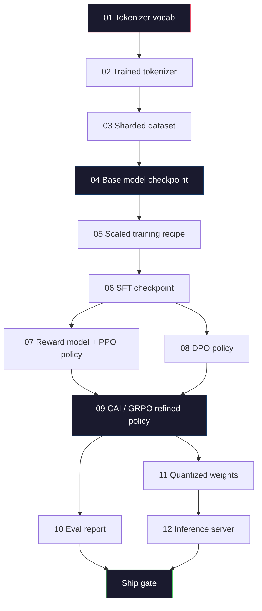
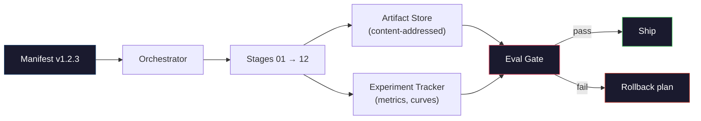

# 构建完整的 LLM 流水线

> 第 01 到 12 课的内容是一条流水线的一个阶段。本课程是将这些阶段整合为一个端到端运行的脚手架：分词、预训练、扩展、SFT、对齐、评估、量化、部署。你不会在笔记本电脑上训练一个 70B 的模型，但你会产出编排层、清单、评估门控和回滚计划——这些正是 2026 年前沿团队用来决定哪些成果可以交付的工具。这是本阶段的毕业设计。

**类型：** 构建
**语言：** Python（标准库）
**前置要求：** 第 10 阶段所有课程 01-12
**所需时间：** 约120分钟

## 学习目标

- 将前十一课的内容（分词器、数据、预训练、扩展、SFT、RLHF、DPO、CAI、评估、量化、推理）组合成一个可复现的流水线规范
- 定义各阶段之间的产物契约：每个阶段消费什么、产出什么，以及下一阶段如何验证输入
- 构建一个编排器来跟踪实验、对产物进行哈希，并基于评估门控决定是否交付
- 设计回滚计划：哪些产物可以廉价重跑，哪些代价高昂，损坏的检查点会造成什么损失

## 问题所在

前面的课程各自都能运行。分词器训练好了，Tiny GPT 预训练完成，SFT 数据集已组装，奖励模型已训练，DPO 已运行，评估已度量，量化权重已导出，推理服务器已启动。每个都是一份 notebook，各有各的约定、输出路径和随机种子。

前沿的训练运行不是 notebook。Llama 3 405B 耗费了大约 3000 万 H100 小时，历时约 54 天。DeepSeek-V3 使用了约 280 万 H800 小时。在这段时间里，一个损坏的检查点、一次数据污染、一次评估回退，都可能让团队浪费一周的时钟时间和一个月的 GPU 预算。团队能扛住这些靠的是流水线纪律：每个阶段都有确定性的输入、确定性的输出、清单、哈希和门控。

这是毕业设计。你不会在笔记本电脑上端到端运行这条流水线，但你会编写协调各阶段的编排器、描述运行的清单、门控交付决策的验证器，以及让第三方能从单个文件重跑你的工作的重放计划。代码量不大，但纪律要求很高。

这个模式从 1 亿到 1 万亿参数都不变。同样的四个组件——清单、编排器、评估门控、产物存储——既跑 Llama 3 也跑你的业余 GPT。区别在于每个阶段配置里的数字大小，而不是流水线的形状。

## 概念说明

### 十二个阶段

第 10 阶段的每节课都是一个阶段。下面是完整的依赖图。



阶段 07 和 08 可以并行运行，其余都是硬依赖。阶段 02（分词器）的变更会使所有下游产物失效。阶段 10（评估）的变更只影响交付决策。

### 清单

清单是一个单独的文件，完整描述一次运行以便复现。流水线产出的任何东西都不应依赖清单之外的状态。字段枯燥但不可或缺。

```
pipeline_version: 1.2.3
seed: 42
git_commit: a1b2c3d4
stages:
  01_tokenizer:
    recipe: bpe_32k
    input_hash: sha256:...
    output_hash: sha256:...
    wall_clock_sec: 3600
    cost_usd: 12
```

阶段 N 的输出哈希就是阶段 N+1 的输入哈希。任何偏差都会导致流水线暂停。这就是你尽早捕获数据损坏的方式，也是另一个大陆的队友验证他们的重放是否产生了与你相同产物的方式。

实践中，团队使用一个小的 YAML schema 加一个清单检查器，与上次成功的运行做 diff。除了预期字段（成本、时钟时间）之外的任何差异都是危险信号。

### 产物类型化

每个阶段的输出是类型化的产物。不是目录 blob，不是 pickle，而是带有已知 schema 的命名类型。

| 阶段 | 产物类型 | 关键字段 |
|-------|---------|---------|
| 01-02 | 分词器 | vocab.json, merges.txt, config.json, hash |
| 03 | 数据集 | shards[], 行数, token 数, 去重统计 |
| 04-05 | 检查点 | weights.safetensors, config.json, 优化器状态, 步数 |
| 06 | SFT 模型 | 检查点 + SFT 配方 + 数据混合 |
| 07 | 奖励模型 | RM 检查点 + 偏好数据哈希 |
| 08-09 | 策略 | 检查点 + 参考哈希 + beta + 已消耗的 KL 预算 |
| 10 | 评估报告 | 基准分数 + 回退 diff + 评估数据哈希 |
| 11 | 量化模型 | 量化权重 + 校准数据 + 与 FP16 的精度差异 |
| 12 | 服务规范 | 端点 + 模型哈希 + 配置 + 可观测性钩子 |

类型化防止了最常见的故障模式：把阶段 08 的输出当作阶段 06 的输入使用，把 DPO 训练的模型通过 SFT 路径交付。类型化的产物和类型化的阶段签名使这些错误成为编译时错误，而不是运行五天后才发现的错误。

### 评估门控

交付不是"训练完成"。交付是"训练完成且评估门控通过"。门控在运行开始之前就已定义。

```
gates:
  mmlu:      >= baseline + 0.5   # no regression
  humaneval: >= baseline + 1.0
  truthfulqa: >= baseline         # no drop
  safety_refusal_rate: <= 0.05
  kl_from_reference: <= 25.0
  cost_total_usd: <= 50000
```

每个门控都是数值阈值。没有"看起来不错"的门控，没有主观的签字确认。如果所有门控通过，产物标记为可交付。如果任何一个门控失败，运行将被挂起，等待指定审查员的明确覆盖——覆盖本身也会被记录在清单中。

两个门控就能捕获大多数灾难。*回退*门控（新模型在核心基准上必须至少与上一版一样好）捕获训练 bug。*KL 预算*门控（对齐后的策略偏离参考不得超过 X）捕获对齐过度。每条生产流水线都有这两个门控。

### 编排器

一小段代码，读取清单、调度阶段、跟踪产物，在任何契约违反时暂停。这不是 Airflow，不是 Kubeflow。为了流水线纪律，你需要的是自己写的、无聊的东西。

编排器的职责很窄：

1. 从清单解析 DAG。
2. 对每个阶段，检查预期输出是否已存在且哈希正确（如果是则跳过）。
3. 运行阶段，捕获 stdout/stderr，度量时钟时间和成本。
4. 验证输出哈希是否与下游阶段的预期输入哈希一致。
5. 失败时，写入包含确切失败阶段的部分清单，并以非零状态退出。

这是 200 行 Python。它看起来就像本课程的 `code/main.py`。在底层，真正的流水线使用 `torchrun` 或 `ray` 在集群上执行各个阶段，但编排器本身在单台机器上运行。

### 实验跟踪与产物存储

两个外部系统锚定流水线。

**实验跟踪器（wandb、neptune、mlflow）。** 记录每个阶段的损失曲线、评估指标和系统遥测。当你需要在三周后比较运行 A 和运行 B 时，跟踪器就是你去的地方。团队几乎总是使用托管跟踪器——自己写会浪费本该用于训练的时间。

**产物存储（S3、R2、GCS）。** 用于检查点、数据集、分词器、评估报告的不可变对象存储。产物通过哈希寻址，而非文件名。像 `latest.pt` 这样的文件名是定时炸弹；`ckpt-7b-step-20000-sha256:abc123.safetensors` 才是契约。

编排器向两者写入。跟踪器是给人看图表的。产物存储是给下一阶段查找输入的。

### 成本核算

前沿运行有明确的美元数字。预算纪律体现在两个地方。

**运行前估算。** 从清单计算预期 FLOPs（预训练：6 x 参数量 x token 数），预期 GPU 小时（FLOPs / 峰值吞吐 / 利用率），以及当前租赁价格下的美元成本。如果估算超出预算门控，流水线拒绝启动。

**运行中跟踪。** 每个阶段的时钟时间和成本被记录到清单中。每个阶段结束后检查剩余预算。如果某个阶段超支，下一阶段的门控会用新的剩余预算来评估。你不会等到 VC 打电话时才发现钱花光了。

Llama 3 报告的成本是 6100 万美元。DeepSeek-V3 报告主预训练运行花费 560 万美元。差距主要来自硬件效率和专家混合——但具体成本之所以可见，是因为两个团队都是按阶段而非按运行来跟踪的。

### 可复现性与确定性

这两者不同。*可复现*意味着相同的清单加相同的代码加相同的基础设施产生具有等效下游指标的检查点。*确定性*意味着比特级完全相同的输出。

现代 LLM 训练是可复现的但不是确定性的。分布式训练的 reduce 顺序、GPU kernel 的不确定性（cuBLAS、flash-attn）和混合精度舍入共同导致不同运行之间浮点数在 1e-5 级别有差异。这对最终指标没问题——指标不会波动。但如果你试图用比特级 diff 来调试，那就是致命的。解决方案是记录每个阶段的输入哈希、输出哈希和关键指标——如果这些匹配，即使权重不是比特级相同，运行也算"复现成功"。



### 回滚计划

在运行开始之前，写下每个阶段失败时该怎么办。三个类别。

- **廉价重跑**（小时级）：分词器、评估、量化、推理服务器。直接重跑。
- **中等**（天级）：SFT、DPO、CAI。保留基础模型，只重跑对齐阶段。
- **昂贵**（周级和数百万美元）：预训练。这里的回滚计划不是"重跑"，而是"使用上一个好的检查点，用修订后的数据重跑更廉价的下游阶段"。

由于阶段依赖是类型化和哈希化的，编排器可以自动计算回滚集：使失败阶段加上所有后代失效。阶段 06（SFT）的失败会使 06、07、08、09、10、11、12 失效。阶段 11（量化）的失败只使 11 和 12 失效。提前命名这些可以避免在凌晨四点团队精疲力竭时临时抱佛脚。

### 2026 年观察到的生产配方

大多数前沿团队收敛到了相同的骨架。

- 分词器：128k BPE，带字节回退。在小型、平衡的多语言切片上训练。
- 预训练：10-20T token，主要是网络加代码加合成数据。Muon 或 AdamW 优化器。FSDP2 或 DeepSpeed ZeRO-3。梯度检查点。BF16 权重，FP32 主副本。
- SFT：50 万-200 万指令对，混合人工和合成数据，与评估集严格去重。
- 对齐：DPO 或 CAI + GRPO。仅在偏好信号过于多维、DPO 无法处理时使用 RLHF。
- 评估：MMLU-Pro、MATH、HumanEval+、GPQA、SWE-Bench Verified、LiveBench，外加一个公众永远看不到的私有保留集。
- 量化：用于服务的 4-bit GPTQ 或 AWQ，用于精度差异重要的安全评估的 8-bit。
- 服务：vLLM、TensorRT-LLM 或自研。连续批处理。推测解码。KV 缓存淘汰。

数字每六个月变一次。骨架不变。

```figure
beam-search
```

## 开始构建

本课程的代码是一个编排器和一个清单检查器，而不是十二个训练脚本。每个阶段用一个占位符模拟，产出具有正确形状和哈希的输出产物。端到端运行编排器可以在你把 GPU 钱花在真正的阶段上之前，证明流水线的管道是通的。

完整实现见 `code/main.py`。关键部分：

- `Manifest` 数据类：流水线版本、种子、git commit、阶段、门控。
- `Stage` 数据类：名称、类型、输入（哈希）、输出（哈希）、时钟时间、成本。
- `Orchestrator.run()`：解析 DAG、调度阶段、验证哈希、更新清单。
- `EvalGate.check()`：读取阈值，与最新评估报告比较，返回通过/失败。
- `ArtifactStore`（内存桩）：按哈希存取，模拟 S3。
- `CostTracker`：按阶段和累计，超出上限时暂停。

`main.py` 中的流水线运行十二个占位符阶段，产出一份清单，并模拟一个失败的评估门控来展示被挂起的运行是什么样子。将每个占位符替换为对应课程的真正训练脚本，你就得到了一条真正前沿流水线使用的骨架。

## 使用它

标准工作流有三条命令。

```
python code/main.py plan    # validate manifest, compute cost estimate, print DAG
python code/main.py run     # execute stages, writing to manifest.out.yaml
python code/main.py gate    # read manifest.out.yaml, apply eval gates, ship-or-hold
```

每次先运行 `plan`。大多数流水线 bug 在 plan 阶段就会暴露——缺少门控阈值、过期的哈希、预算超支。运行 `plan` 是免费的，运行 `run` 是昂贵的。在便宜的一侧捕获 bug 可以省钱。

`gate` 的输出要么是 `SHIP` 要么是 `HOLD: <原因>`。被挂起的运行不是失败，而是一个决策点。指定审查员要么覆盖（覆盖会被记录），要么批准回滚。

## 交付它

本课程产出 `outputs/skill-llm-pipeline-reviewer.md`。将一份拟议的流水线清单喂给它，它会检查所有契约：阶段类型、哈希链、门控、回滚计划、成本估算。它会拒绝批准缺少评估门控、KL 预算无上限、或混合了评估和训练数据的运行。

## 练习

1. 扩展编排器以支持阶段 07 和 08 的并行执行。使用标准库的 `concurrent.futures` 模块。确认最终清单记录了两个阶段的输出，并且阶段 09 的输入哈希是两者的确定性组合。

2. 添加"污染检查"门控。给定评估数据集哈希和训练数据集分片，计算重叠度（精确字符串匹配或 13-gram 匹配）。如果重叠超过 0.1%，门控失败。喂给它一个被污染的训练集并确认门控会挂起运行。

3. 从第一性原理实现成本估算器。对于阶段 04（预训练），将 FLOPs 估算为 6 x 参数量 x token 数，假设 H100 上 BF16 算力为 989 TFLOPs，MFU（模型 FLOPs 利用率）为 40%，每 GPU 小时 2.50 美元。报告一个在 2T token 上训练的 7B 模型的估算值。与已发布的 Llama 2 数据比较。

4. 构建部分回滚。模拟阶段 09（CAI）的失败，然后重跑阶段 09 到 12，同时保留 01-08 的缓存。编排器应该通过哈希检测到缓存的产物并跳过它们。度量与完全重跑相比节省的时钟时间。

5. 添加可观测性。为每个阶段发射 OpenTelemetry span，包含参数、已处理 token 数、损失和成本等属性。将 span 导入本地收集器。重点不是仪表盘，而是每个阶段的健康状况都可以从单个 trace ID 追踪。

## 关键术语

| 术语 | 常见说法 | 实际含义 |
|------|---------|---------|
| 清单 | "配方文件" | 描述流水线版本、种子、每阶段配置和门控阈值的 YAML 或 JSON——足以重放一次运行 |
| 内容寻址 | "按哈希而非名称" | 产物按其内容的 SHA-256 存储，因此永远不会将版本 A 与版本 B 混淆 |
| 评估门控 | "交付标准" | 基准指标和安全分数上的数值阈值，必须通过才能将产物标记为可交付 |
| KL 预算 | "对齐偏移了多远" | 对齐阶段累计 KL(policy || reference) 的上限，作为门控强制执行 |
| MFU | "你用了多少 GPU" | 模型 FLOPs 利用率——实现的 FLOPs 除以理论峰值。70B 规模下 40% 是典型值，7B 规模下 55% |
| 回滚计划 | "出问题了怎么办" | 每个阶段失败时的预写行动方案：重跑、回退、用修订输入重新训练 |
| 编排器 | "指挥家" | 读取清单、调度阶段、验证哈希、在任何契约违反时暂停的进程 |
| 产物存储 | "权重的版本化 S3" | 不可变的内容寻址对象存储——检查点、数据集、评估报告的单一事实来源 |
| 可复现 | "重放时指标相同" | 比特级不同的权重但等效的下游指标——分布式 LLM 训练的现实目标 |
| 成本门控 | "不能超过 X" | 运行前成本估算加运行中跟踪器——如果估算超出预算，流水线拒绝启动 |

## 延伸阅读

- [Dubey et al., 2024 -- "The Llama 3 Herd of Models"](https://arxiv.org/abs/2407.21783) -- 对前沿流水线最详细的公开描述，包括数据、训练、对齐、评估
- [DeepSeek-AI, 2024 -- "DeepSeek-V3 Technical Report"](https://arxiv.org/abs/2412.19437) -- 效率优先的流水线，成本约为 Llama 3 级训练的 1/10
- [Kaplan et al., 2020 -- "Scaling Laws for Neural Language Models"](https://arxiv.org/abs/2001.08361) -- 原始的计算-数据-参数缩放关系
- [Hoffmann et al., 2022 -- "Training Compute-Optimal Large Language Models (Chinchilla)"](https://arxiv.org/abs/2203.15556) -- 对 Kaplan 的修正，重新校准了现代数据预算
- [PyTorch FSDP2 documentation](https://pytorch.org/docs/stable/fsdp.html) -- PyTorch 2.4+ 中取代 FSDP1 的分布式训练原语
- [Weights & Biases LLM Reports](https://wandb.ai/site/llms) -- 开源 LLM 运行的真实清单和实验跟踪器输出，可作为可借鉴的模板
