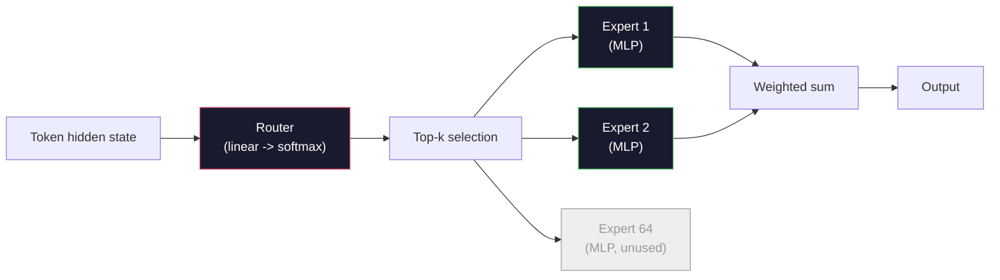

# 开放模型：架构走读

> 你在第 04 课从零构建了一个 GPT-2 Small。2026 年的前沿开放模型是同一家族，有五到六个具体变化：用 RMSNorm 代替 LayerNorm，用 SwiGLU 代替 GELU，用 RoPE 代替学习式位置编码，用 GQA 或 MLA 代替全量 MHA，以及大规模的专家混合。你已经掌握的数学覆盖了其中 95% 的内容。本课程并排阅读 Llama 3、DeepSeek-V3、Mixtral、Qwen 和 Gemma，指出每个架构在哪些具体行上分道扬镳。

**类型：** 学习
**语言：** Python（标准库）
**前置要求：** 第 10 阶段，课程 04、05、12（预训练、扩展、推理）
**所需时间：** 约45分钟

## 学习目标

- 阅读 Llama 3、Mistral、Mixtral、Gemma 2、Qwen 2.5 和 DeepSeek-V3 的 config.json 并解释每个字段
- 指出每个模型相对于 GPT-2 Small 做了哪些具体的架构变更，并从第一性原理论证其合理性
- 仅从 config 计算任意开放模型的参数量、KV 缓存大小和激活内存
- 给定延迟、内存和能力约束，为部署目标选择合适的开放模型

## 问题所在

在第 04 课中，你写了 350 行 numpy 就得到了一个 GPT-2 形状的模型。Llama 3 405B 有一份 200 页的技术报告。你的直觉是这两者完全不同。其实不然。那 200 页描述的是同一个对象加上五到六个有充分依据的修改，外加一千个关于扩展的实现细节。骨架——embedding、Transformer 块、注意力、MLP、归一化、输出头——完全没有变。

本课程就是一份 diff。对于每个主要开放模型家族，我们精确列出相对于 GPT-2 改变了什么、为什么改、代价是什么。学完之后，你就能阅读一张新的模型卡片，并在脑中将其转译回 GPT-2 基线。

实际收益是：当 Meta 发布 Llama 5 或 DeepSeek 发布 V4 时，你不需要新的心智模型。你会看着 config，看到哪些已知的旋钮移动了，就知道下游的影响是什么。2026 年的架构是一个有限的工具箱，每个新模型只是从中选取了不同的子集。

## 概念说明

### 不变的核心

所有自回归开放模型共享：

- Token embedding 矩阵（vocab_size x hidden_dim）。
- N 个解码器块的堆叠：归一化、自注意力、残差、归一化、MLP、残差。
- 最终归一化和投影到 vocab_size 的线性输出头（通常与 embedding 权重绑定）。
- 因果掩码、下一个 token 的交叉熵损失。

这就是形状。其余都是旋钮。

### 真正移动的六个旋钮

在 2024-2026 年的每个前沿开放模型中，同样的六个设计选择被反复选取：

1. **归一化。** LayerNorm -> RMSNorm。
2. **位置编码。** 学习式绝对位置 -> RoPE（加上变体：YaRN、NTK）。
3. **激活函数。** GELU -> SwiGLU（或 GeGLU）。
4. **注意力头共享。** MHA -> GQA -> MQA -> MLA。
5. **稠密 MLP vs 稀疏 MLP。** 稠密 -> 专家混合。
6. **前归一化放置。** 前归一化保留，后归一化消失。

其余一切（学习率调度、数据混合、批大小、上下文长度）都在训练配置中，而非架构中。六个旋钮。

### 旋钮 1：RMSNorm

LayerNorm 减去均值，除以标准差，缩放并偏移。RMSNorm 只保留缩放：

```
RMSNorm(x) = x / sqrt(mean(x^2) + eps) * gamma
```

不减均值，没有偏置。每个 token 少一次矩阵乘法。Zhang 和 Sennrich（2019）论证了它在机器翻译上与 LayerNorm 效果相当，同时快 10%。每个现代开放模型都使用它。

代价：无。收益：小幅吞吐提升，更简洁的代码。

### 旋钮 2：RoPE

GPT-2 中的学习式位置 embedding 是一个 1024 个槽位的查找表。上下文 1025 就超出了表的范围。模型无法外推到训练长度之外。

旋转位置编码（RoPE，Su 等 2021）通过在注意力点积之前对每对 Q 和 K 向量进行旋转来注入位置信息。旋转角度是位置的确定性函数，因此没有需要学习的东西，也没有会用完的东西。配合缩放技巧（NTK 感知插值、YaRN），在 8k 上下文训练的模型可以在推理时拉伸到 128k，精度损失很小。

```
q_rotated = rotate(q, angle(pos))
k_rotated = rotate(k, angle(pos))
score = q_rotated . k_rotated
```

每个 Llama、Mistral、Qwen、DeepSeek 和 Gemma 都使用 RoPE。Gemma 2 使用混合方案（大多数层用 RoPE，其他层用局部滑动窗口注意力）。

### 旋钮 3：SwiGLU

GPT-2 的 MLP 是 `x -> gelu(xW1 + b1) -> (...)W2 + b2`。SwiGLU（Shazeer 2020）用门控乘积替换激活函数：

```
SwiGLU(x) = (xW1) * sigmoid(xW1) * xV
```

两个并行投影代替一个，由 Swish 激活门控。经验上每参数的困惑度更强。Llama 2 采用了它，随后所有人都跟进了。MLP 的隐藏大小通常设置为使总参数量与原始稠密 MLP 匹配：如果 GPT-2 使用 `ff_dim = 4 * hidden`，SwiGLU 使用 `ff_dim = (2/3) * 4 * hidden = 8/3 * hidden`。

### 旋钮 4：注意力头共享

GPT-2 使用**多头注意力（MHA）**：每个头有自己的 Q、K、V 投影。

**多查询注意力（MQA，Shazeer 2019）**在所有头之间共享一个 K 和一个 V。将 KV 缓存缩小 num_heads 倍，在典型模型上是 12x 到 32x 的缩减。在困难基准上精度略有下降。

**分组查询注意力（GQA，Ainslie 等 2023）**是折中方案：G 组 Q 头共享一个 K 和一个 V。Llama 3 8B 使用 GQA，32 个 Q 头和 8 个 KV 头（G=8），因此 KV 缓存比全量 MHA 缩小 4 倍。

**多头潜在注意力（MLA，DeepSeek 2024）**将 K 和 V 压缩到一个共享的低秩潜在表示中，按头动态解压。进一步减小 KV 缓存，同时保留每头的表达能力。DeepSeek-V2 和 V3 依靠此技术实现长上下文性能。

| 方案 | KV 头数 | KV 缓存 | 精度 |
|------|--------|---------|------|
| MHA  | num_heads | 完整 | 最佳 |
| GQA  | num_groups（G < num_heads） | num_heads / G 缩减 | 接近 MHA |
| MQA  | 1 | num_heads 缩减 | 轻微损失 |
| MLA  | 潜在表示，按头解压 | 小于 MQA | 接近 MHA |

对于任何超过约 13B 参数的模型，GQA 或 MLA 实际上是强制性的。大规模的全量 MHA 是 KV 缓存的灾难。

### 旋钮 5：专家混合

稠密 MLP 为每个 token 激活所有参数。MoE MLP 每个块有 K 个专家和一个路由器，为每个 token 选择 top-k 个专家（通常 top-2）。只有被选中专家的权重才会对该 token 执行前向传播。

```
router_logits = xW_r
indices, weights = top_k(router_logits, k=2)
output = sum_i weights[i] * expert[indices[i]](x)
```

吸引力在于：你可以有 64 个各 7B 大小的专家（总参数量巨大），但每个 token 只运行其中 2 个（每 token 计算量与稠密 7B 模型相当）。Mixtral 8x7B 有 47B 总参数但每 token 只激活 13B。DeepSeek-V3 有 671B 总参数但每 token 只激活 37B。



优点：相同计算量，更多参数，更好容量。缺点：专家内存仍需存放在某处（因此服务需要比稠密等效模型更多的显存），路由器的负载均衡很难，在对齐期间微调路由器本身就是一个研究领域。

### 旋钮 6：前归一化保留

原始 Transformer 在每个子层之后应用层归一化。GPT-2 以来的每个开放模型都将其放在每个子层*之前*。前归一化在深层网络中严格更容易训练。没有争议。

### 逐模型 Diff

这是让一切具体化的表格。

| 模型 | 年份 | 总参数 | 激活参数 | 归一化 | 激活函数 | 位置编码 | 注意力 | MoE | 上下文 |
|------|------|-------|---------|-------|---------|---------|-------|-----|-------|
| GPT-2 Small | 2019 | 124M | 124M | LayerNorm | GELU | 学习式 | MHA（12 头） | 否 | 1k |
| Llama 3 8B | 2024 | 8B | 8B | RMSNorm | SwiGLU | RoPE | GQA（32/8） | 否 | 128k |
| Llama 3 70B | 2024 | 70B | 70B | RMSNorm | SwiGLU | RoPE | GQA（64/8） | 否 | 128k |
| Llama 3 405B | 2024 | 405B | 405B | RMSNorm | SwiGLU | RoPE | GQA（128/16） | 否 | 128k |
| Mistral 7B | 2023 | 7.2B | 7.2B | RMSNorm | SwiGLU | RoPE | GQA | 否 | 32k |
| Mixtral 8x7B | 2023 | 47B | 13B | RMSNorm | SwiGLU | RoPE | GQA | 是（8 专家，top-2） | 32k |
| Gemma 2 9B | 2024 | 9B | 9B | RMSNorm（前+后） | GeGLU | RoPE + 滑动窗口 | GQA | 否 | 8k |
| Qwen 2.5 72B | 2024 | 72B | 72B | RMSNorm | SwiGLU | RoPE（YaRN） | GQA（64/8） | 否 | 128k |
| DeepSeek V2 236B | 2024 | 236B | 21B | RMSNorm | SwiGLU | RoPE | MLA | 是（160 专家，top-6） | 128k |
| DeepSeek V3 | 2024 | 671B | 37B | RMSNorm | SwiGLU | RoPE | MLA | 是（256 专家，top-8） | 128k |

扫描各列。RMSNorm 是通用的。SwiGLU 或其 GeGLU 表亲是通用的。RoPE 是通用的。GQA 在 7B 以上是通用的，除非被 MLA 替代。MoE 是高端的差异化因素。

### 阅读 config.json

Llama 3 8B config：

```
{
  "hidden_size": 4096,
  "intermediate_size": 14336,
  "num_hidden_layers": 32,
  "num_attention_heads": 32,
  "num_key_value_heads": 8,
  "max_position_embeddings": 131072,
  "rope_theta": 500000.0,
  "rms_norm_eps": 1e-5,
  "vocab_size": 128256
}
```

每个字段对应你已经实现过的东西。

- `hidden_size`：embedding 维度。
- `intermediate_size`：MLP 隐藏大小（3.5 倍 hidden——SwiGLU 数学）。
- `num_hidden_layers`：堆叠深度。
- `num_attention_heads`：Q 头数。
- `num_key_value_heads`：KV 头数（GQA）。
- `max_position_embeddings`：训练上下文长度。
- `rope_theta`：RoPE 基频。Meta 将其从默认的 10k 缩放到 500k 以实现长上下文外推。
- `rms_norm_eps`：数值稳定性。
- `vocab_size`：token 数。

仅从这些你就能计算总参数量、KV 缓存和峰值激活内存。精确公式见 `code/main.py`。

### 激活内存预算

在超过几十亿参数时，激活内存主导训练内存。预训练的经验法则（带梯度检查点）：

```
activation_mem ~ batch_size * seq_len * hidden_size * num_layers * bytes_per_element
```

对于 Llama 3 8B，batch 1，seq 8192，BF16，32 层，hidden 4096：仅激活就需要约 8 GB（带检查点），不带检查点需要 40 GB。这就是 flash-attention 和 ring-attention 重要的原因——它们重写注意力计算使激活能放得下。

### KV 缓存预算

在最大上下文下的推理：

```
kv_cache = 2 * num_layers * num_kv_heads * head_dim * max_seq_len * bytes_per_element
```

Llama 3 8B 在 128k 上下文、BF16、head_dim = hidden / num_heads = 128 时：
`2 * 32 * 8 * 128 * 131072 * 2 = 17.2 GB` 每个序列。

8B 权重在 BF16 下是 16 GB。单个 128k 序列的 KV 缓存比权重还大。这就是驱动 GQA、MLA 和 KV 缓存量化研究的内存压力。

### 各模型的胜出场景

- **单卡 80GB，不用 MoE**：Llama 3 8B、Mistral 7B、Gemma 2 9B。易于服务，工具生态广泛。
- **单节点（8x80GB），大容量**：Llama 3 70B、Qwen 2.5 72B。最高的稠密开放能力。
- **最大开放能力，接受 MoE 复杂性**：DeepSeek V3、Mixtral 8x22B。每激活 FLOP 的最佳能力。
- **长上下文需求**：Llama 3（128k 带 RoPE 缩放）、DeepSeek（MLA 优势）。
- **低延迟服务**：Gemma 2 9B（滑动窗口减少长上下文计算量）。

```figure
rmsnorm-vs-layernorm
```

## 开始构建

本课程的代码是一个计算器。给定任意 config.json，它按组件打印参数量、最大上下文下的 KV 缓存、SwiGLU MLP 比率，以及对架构的简短判定（稠密 / GQA / MLA / MoE）。

```python
config = {
    "hidden_size": 4096, "intermediate_size": 14336,
    "num_hidden_layers": 32, "num_attention_heads": 32,
    "num_key_value_heads": 8, "vocab_size": 128256,
    "max_position_embeddings": 131072,
}
```

脚本逐字段遍历架构，计算 embedding、注意力（带 GQA 缩减）、MLP（带 SwiGLU 扩展）、LayerNorm 和输出头的参数量。然后计算指定上下文长度下的 KV 缓存并打印摘要。

实现见 `code/main.py`。

## 使用它

在脚本中内置的 Llama 3 8B、Mistral 7B、Mixtral 8x7B 和 DeepSeek V3 配置上运行计算器。比较参数分解。注意 MoE 模型的总参数量远超稠密模型，但激活参数量通常更小。注意 DeepSeek V3 的 KV 缓存比 Llama 3 405B 的更小，尽管总参数量更多——这就是 MLA 的效果。

然后插入你本地任意模型的 config，阅读摘要，判断它是否适合你的 GPU。

## 交付它

本课程产出 `outputs/skill-open-model-picker.md`。给定部署目标（GPU 类型、显存、上下文长度、延迟预算）和任务画像（聊天、代码、推理、长上下文），它会推荐一个开放模型、第 11 课的量化方案和第 12 课的推理栈，并对六个架构旋钮给出明确推理。

## 练习

1. 从 HuggingFace 读取 Qwen 2.5 72B 的 config。从零计算总参数量。与 HF 报告的值比较，找出差异来自哪里（头维度取整、KV 共享因子等）。

2. DeepSeek V3 使用 256 个专家和 top-8 路由。计算激活专家与总专家的比率，与 Mixtral 8x7B 的 8 个中 top-2 比较。从稀疏（25%）到更稀疏（3%）的转变对每 FLOP 容量意味着什么？

3. 计算 Llama 3 405B 在 128k 上下文下的 FP8 和 BF16 KV 缓存。FP8 是 BF16 的一半。在单个 8xH100 节点（每个 80GB = 总 640GB，减去权重内存）上你能服务多少个并行序列？

4. Gemma 2 交替使用全注意力和滑动窗口注意力层。当一半层使用 4096 token 的滑动窗口而非全上下文时，写出 KV 缓存的计算公式。在 8k 总上下文下能节省多少内存？

5. 找一个在本课程编写之后发布的近期前沿开放模型。确定它选取了六个旋钮中的哪些，以及是否引入了第七个旋钮。课程在新架构发布时就会感觉过时——目标是更新你的表格而不重建你的心智模型。

## 关键术语

| 术语 | 常见说法 | 实际含义 |
|------|---------|---------|
| RMSNorm | "去掉均值的 LayerNorm" | 仅通过均方根归一化，带可学习缩放——更廉价且与 LayerNorm 相当 |
| RoPE | "旋转位置" | 将每对 Q 和 K 向量在二维空间中按位置相关的角度旋转——通过缩放技巧可外推到训练长度之外 |
| SwiGLU | "新的 MLP 激活" | 带 Swish 的门控线性单元：`(xW1) * sigmoid(xW1) * xV`——每个 2024+ 开放模型的标准 |
| GQA | "折中注意力" | 分组查询注意力：G 组 Q 头共享一个 K 和一个 V 头——在不损失 MQA 精度的情况下缩小 KV 缓存 |
| MLA | "DeepSeek 的注意力" | 多头潜在注意力：将 K/V 压缩到共享的低秩潜在表示中，按头解压——大模型最小的 KV 缓存 |
| MoE | "稀疏专家" | 专家混合：每个块 N 个 MLP，路由器为每个 token 选择 top-k——总参数巨大，激活参数小 |
| Top-k 路由 | "每个 token 选 k 个专家" | 路由器为每个专家计算分数并激活最高的 k 个——典型 k 为 2（Mixtral）到 8（DeepSeek） |
| YaRN | "拉伸 RoPE" | 又一种 RoPE 扩展——在推理时插值旋转角度将上下文从 8k 扩展到 128k+ |
| 滑动窗口注意力 | "不必关注所有内容" | 每个 token 只关注最近的 W 个 token——将注意力成本上限为每 token O(W)，用于 Gemma 2 和早期 Mistral |
| 激活参数 | "每 token 运行的量" | 对于 MoE 模型，每个 token 执行前向传播的参数量（远小于总参数）——决定每 token FLOPs |

## 延伸阅读

- [Dubey et al., 2024 -- "The Llama 3 Herd of Models"](https://arxiv.org/abs/2407.21783) -- 稠密 Llama 3 家族的架构和训练参考
- [DeepSeek-AI, 2024 -- "DeepSeek-V3 Technical Report"](https://arxiv.org/abs/2412.19437) -- MLA 加无辅助损失负载均衡加 671B MoE
- [Jiang et al., 2024 -- "Mixtral of Experts"](https://arxiv.org/abs/2401.04088) -- 经典的 MoE 开放模型论文
- [Su et al., 2021 -- "RoFormer: Enhanced Transformer with Rotary Position Embedding"](https://arxiv.org/abs/2104.09864) -- RoPE 论文
- [Shazeer, 2020 -- "GLU Variants Improve Transformer"](https://arxiv.org/abs/2002.05202) -- SwiGLU、GeGLU 等
- [Ainslie et al., 2023 -- "GQA: Training Generalized Multi-Query Transformer Models"](https://arxiv.org/abs/2305.13245) -- GQA 论文
- [Gemma 2 Team, 2024 -- "Gemma 2: Improving Open Language Models at a Practical Size"](https://arxiv.org/abs/2408.00118) -- 混合全量+滑动注意力、前+后归一化
- [Qwen Team, 2024 -- "Qwen 2.5 Technical Report"](https://arxiv.org/abs/2412.15115) -- YaRN 上下文扩展和长上下文训练配方
