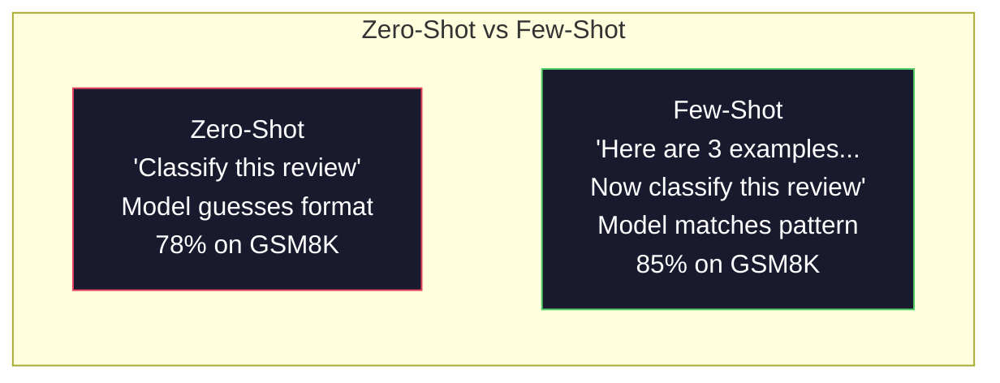
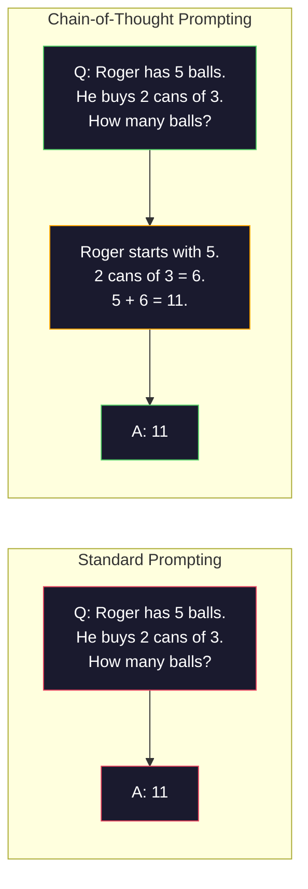
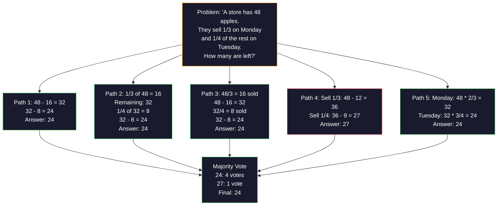
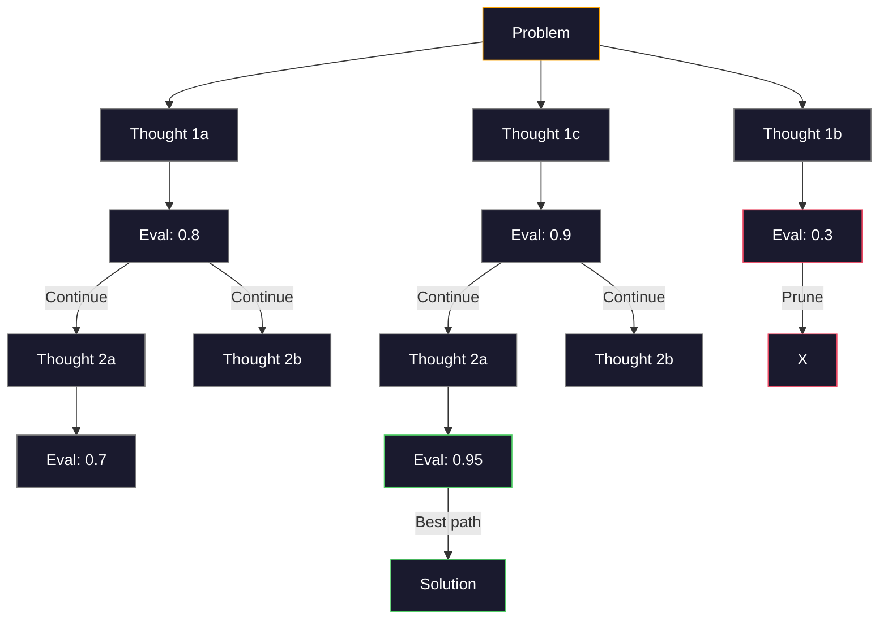
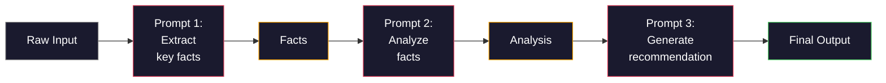

# 少样本、思维链、思维树

> 告诉模型要做什么，那是提示；展示给它该怎么思考，那才是工程。在同一个模型、同一个任务、同一份数据上，从 78% 到 91% 准确率之间的差距，靠的不是更好的模型，而是更好的推理策略。

**类型：** 构建
**语言：** Python
**前置要求：** 第 11.01 课（提示工程）
**所需时间：** 约 45 分钟

## 学习目标

- 实现少样本提示，通过挑选和格式化示例演示来最大化任务准确率
- 运用思维链（CoT）推理，提升在数学应用题等多步问题上的准确率
- 构建一个思维树提示，探索多条推理路径并从中选出最优的一条
- 在一个标准基准上，衡量零样本、少样本、CoT 三者之间的准确率提升

## 问题所在

你在做一个数学辅导应用。你的提示写着：“解这道应用题。”在标准的小学数学基准 GSM8K 上，GPT-5 有 94% 的概率答对。你以为已经到顶了。其实没有——思维链还能再加 3-4 个百分点。

加上五个词——“让我们一步一步想”——准确率就跳到了 91%。再加上几个做过的例子，它就达到了 95%。同样的模型，同样的温度，同样的 API 成本。唯一的区别在于，你给了模型一张草稿纸。

这不是花招，而是推理运作的方式。人类不会一步登天地解出多步问题，transformer 也不会。当你迫使模型生成中间 token 时，这些 token 就成了下一个 token 的上下文的一部分。每一个推理步骤都喂养着下一步。模型实实在在地一路计算到了答案。

但“一步一步想”只是开始，而非终点。如果你采样五条推理路径，然后取多数票呢？如果你让模型探索一棵可能性之树，对分支进行评估和剪枝呢？如果你把推理与工具使用交织起来呢？这些都不是空想。它们是有发表记录、有实测改进的技术，而你将在本课中把它们全都构建出来。

## 概念说明

### 零样本 vs 少样本：示例何时胜过指令

零样本提示只给模型一个任务，别的什么都不给。少样本提示则先给它一些示例。

Wei 等人（2022）在 8 个基准上测量了这一点。对于情感分类这类简单任务，零样本和少样本的表现相差在 2% 以内。而对于多步算术和符号推理这类复杂任务，少样本把准确率提升了 10-25%。

直觉如下：示例就是压缩过的指令。你不必描述输出格式，而是直接展示它；你不必解释推理过程，而是直接演示它。模型基于示例做模式匹配，要比它解读抽象指令更加可靠。



**少样本何时胜出：** 对格式敏感的任务、分类、结构化抽取、领域特定的行话，以及任何需要模型匹配特定模式的任务。

**零样本何时胜出：** 简单的事实性问题、示例会束缚创造力的创意任务，以及找好示例比写好指令更难的任务。

### 示例选择：相似胜过随机

并非所有示例都等价。挑选与目标输入相似的示例，在分类任务上比随机选择高出 5-15%（Liu 等人，2022）。三条原则：

1. **语义相似性**：挑选在嵌入空间中最接近输入的示例
2. **标签多样性**：让你的示例覆盖所有的输出类别
3. **难度匹配**：与目标问题的复杂度水平相匹配

对大多数任务而言，最优的示例数量是 3-5 个。少于 3 个，模型没有足够的信号来提取模式。多于 5 个，你就会遇到收益递减，并浪费上下文窗口的 token。对于有许多标签的分类，每个标签用一个示例。

### 思维链：给模型一张草稿纸

思维链（CoT）提示由 Google Brain 的 Wei 等人（2022）提出。其思路很简单：与其只向模型要答案，不如让它先展示推理步骤。



从机制上讲，为什么这有效？transformer 生成的每一个 token 都会成为下一个 token 的上下文。没有 CoT 时，模型必须把所有推理压缩进单次前向传播的隐藏状态里。有了 CoT，模型就把中间计算以 token 的形式外化出来。每一个推理 token 都延展了有效的计算深度。

**GSM8K 基准（小学数学，8500 道题）：**

| 模型 | 零样本 | 零样本 CoT | 少样本 CoT |
|-------|-----------|---------------|--------------|
| GPT-4o | 78% | 91% | 95% |
| GPT-5 | 94% | 97% | 98% |
| o4-mini（推理） | 97% | — | — |
| Claude Opus 4.7 | 93% | 97% | 98% |
| Gemini 3 Pro | 92% | 96% | 98% |
| Llama 4 70B | 80% | 89% | 94% |
| DeepSeek-V3.1 | 89% | 94% | 96% |

**关于推理模型的说明。** 像 OpenAI 的 o 系列（o3、o4-mini）和 DeepSeek-R1 这样的模型，会在给出答案之前于内部运行思维链。对推理模型再加上“让我们一步一步想”是多余的，有时甚至适得其反——它们早已这么做了。

CoT 有两种风味：

**零样本 CoT**：在提示后追加“让我们一步一步想”。无需示例。Kojima 等人（2022）表明，这一句话就能在算术、常识和符号推理任务上提升准确率。

**少样本 CoT**：提供包含推理步骤的示例。它比零样本 CoT 更有效，因为模型能看到你所期望的确切推理格式。

**CoT 何时有害**：简单的事实回忆（“法国的首都是哪里？”）、单步分类，以及速度比准确率更重要的任务。CoT 每次查询会增加 50-200 个 token 的推理开销。对于高吞吐、低复杂度的任务，这就是浪费的成本。

### 自一致性：多采样，单投票

Wang 等人（2023）提出了自一致性（self-consistency）。其洞见在于：单一的 CoT 路径可能包含推理错误。但如果你采样 N 条独立的推理路径（使用 temperature > 0），并对最终答案取多数票，错误就会相互抵消。



在最初的 PaLM 540B 实验中，自一致性把 GSM8K 准确率从 56.5%（单条 CoT）提升到了 N=40 时的 74.4%。在 GPT-5 上提升很小（97% 到 98%），因为基础准确率已经接近饱和。这项技术在基础 CoT 准确率为 60-85% 的模型上效果最为显著——这是单路径错误频繁但并非系统性的甜蜜区间。对于推理模型（o 系列、R1），自一致性已被其内置的内部采样所涵盖。

权衡之处：N 次采样意味着 N 倍的 API 成本和延迟。实践中，N=5 就能捕获大部分收益。N=3 是有意义投票的最低值。对大多数任务而言，N > 10 收益递减。

### 思维树：分支式探索

Yao 等人（2023）提出了思维树（Tree-of-Thought，ToT）。CoT 沿着一条线性的推理路径前进，而 ToT 则探索多个分支，并在继续之前评估哪些最有前景。



ToT 有三个组成部分：

1. **思维生成**：产出多个候选的下一步
2. **状态评估**：为每个候选打分（可以用 LLM 自身作为评估者）
3. **搜索算法**：在树中进行 BFS 或 DFS，对低分分支进行剪枝

在 Game of 24 任务（用算术组合 4 个数字凑出 24）上，使用标准提示的 GPT-4 解出了 7.3% 的题目。用 CoT，4.0%（CoT 在这里反而有害，因为搜索空间很宽）。用 ToT，则达到 74%。

ToT 代价高昂。树中的每个节点都需要一次 LLM 调用。一棵分支因子为 3、深度为 3 的树，最多需要 39 次 LLM 调用。仅在那些搜索空间大但可评估的问题上使用它——规划、解谜、带约束的创造性问题求解。

### ReAct：思考 + 行动

Yao 等人（2022）把推理轨迹与行动结合了起来。模型在思考（生成推理）与行动（调用工具、搜索、计算）之间交替进行。

```mermaid
graph LR
    Q["Question:\nWhat is the\npopulation of the\ncountry where\nthe Eiffel Tower\nis located?"]
    T1["Thought: I need to\nfind which country\nhas the Eiffel Tower"]
    A1["Action: search\n'Eiffel Tower location'"]
    O1["Observation:\nParis, France"]
    T2["Thought: Now I need\nFrance's population"]
    A2["Action: search\n'France population 2024'"]
    O2["Observation:\n68.4 million"]
    T3["Thought: I have\nthe answer"]
    F["Answer:\n68.4 million"]

    Q --> T1 --> A1 --> O1 --> T2 --> A2 --> O2 --> T3 --> F

    style Q fill:#1a1a2e,stroke:#ffa500,color:#fff
    style T1 fill:#1a1a2e,stroke:#51cf66,color:#fff
    style A1 fill:#1a1a2e,stroke:#e94560,color:#fff
    style O1 fill:#1a1a2e,stroke:#808080,color:#fff
    style T2 fill:#1a1a2e,stroke:#51cf66,color:#fff
    style A2 fill:#1a1a2e,stroke:#e94560,color:#fff
    style O2 fill:#1a1a2e,stroke:#808080,color:#fff
    style T3 fill:#1a1a2e,stroke:#51cf66,color:#fff
    style F fill:#1a1a2e,stroke:#51cf66,color:#fff
```



在知识密集型任务上，ReAct 胜过纯 CoT，因为它能把推理建立在真实数据之上。在 HotpotQA（多跳问答）上，使用 GPT-4 的 ReAct 达到了 35.1% 的精确匹配，而纯 CoT 为 29.4%。真正的威力在于，推理错误会被观测结果纠正——模型可以在执行途中更新它的计划。

ReAct 是现代 AI 智能体的基石。每个智能体框架（LangChain、CrewAI、AutoGen）都实现了某种变体的“思考-行动-观测”循环。你将在第 14 阶段构建完整的智能体。本课覆盖的是这一提示模式。

### 结构化提示：XML 标签、分隔符、标题

随着提示变得复杂，结构能防止模型混淆各个部分。三种方法：

**XML 标签**（与 Claude 配合最佳，在哪里都稳健）：
```
<context>
You are reviewing a pull request.
The codebase uses TypeScript and React.
</context>

<task>
Review the following diff for bugs, security issues, and style violations.
</task>

<diff>
{diff_content}
</diff>

<output_format>
List each issue with: file, line, severity (critical/warning/info), description.
</output_format>
```

**Markdown 标题**（通用）：
```
## Role
Senior security engineer at a fintech company.

## Task
Analyze this API endpoint for vulnerabilities.

## Input
{api_code}

## Rules
- Focus on OWASP Top 10
- Rate each finding: critical, high, medium, low
- Include remediation steps
```

**分隔符**（极简但有效）：
```
---INPUT---
{user_text}
---END INPUT---

---INSTRUCTIONS---
Summarize the above in 3 bullet points.
---END INSTRUCTIONS---
```

### 提示链：顺序式分解

有些任务对单个提示来说太复杂了。提示链把它们拆成多个步骤，前一个提示的输出成为下一个提示的输入。



提示链胜过单一提示，有三个原因：

1. **每一步都更简单**：模型处理一个聚焦的任务，而不必同时兼顾一切
2. **中间输出可被检查**：你可以在步骤之间进行校验和纠正
3. **不同步骤可以用不同的模型**：抽取用便宜的模型，推理用昂贵的模型

### 性能对比

| 技术 | 最适合 | GSM8K 准确率（GPT-5） | API 调用次数 | Token 开销 | 复杂度 |
|-----------|----------|------------------------|-----------|----------------|------------|
| 零样本 | 简单任务 | 94% | 1 | 无 | 微不足道 |
| 少样本 | 格式匹配 | 96% | 1 | 200-500 tokens | 低 |
| 零样本 CoT | 快速推理增强 | 97% | 1 | 50-200 tokens | 微不足道 |
| 少样本 CoT | 单次调用的最高准确率 | 98% | 1 | 300-600 tokens | 低 |
| 自一致性（N=5） | 高风险推理 | 98.5% | 5 | 5 倍 token 成本 | 中 |
| 推理模型（o4-mini） | CoT 的即插即用替代 | 97% | 1 | 隐藏（内部 2-10 倍） | 微不足道 |
| 思维树 | 搜索/规划问题 | 不适用（Game of 24 上为 74%） | 10-40+ | 10-40 倍 token 成本 | 高 |
| ReAct | 知识接地的推理 | 不适用（HotpotQA 上为 35.1%） | 3-10+ | 可变 | 高 |
| 提示链 | 复杂的多步任务 | 96%（流水线） | 2-5 | 2-5 倍 token 成本 | 中 |

正确的技术取决于三个因素：准确率要求、延迟预算和成本容忍度。对于大多数生产系统，带有 3 次采样自一致性兜底的少样本 CoT 能覆盖 90% 的使用场景。

## 开始构建

我们将构建一个数学题求解器，把少样本提示、思维链推理和自一致性投票整合进单条流水线。然后，我们会为难题加上思维树。

完整实现见 `code/advanced_prompting.py`。以下是关键组件。

### 第 1 步：少样本示例库

第一个组件管理少样本示例，并为给定的问题选出最相关的那些。

```python
GSM8K_EXAMPLES = [
    {
        "question": "Janet's ducks lay 16 eggs per day. She eats three for breakfast every morning and bakes muffins for her friends every day with four. She sells every egg at the farmers' market for $2. How much does she make every day at the farmers' market?",
        "reasoning": "Janet's ducks lay 16 eggs per day. She eats 3 and bakes 4, using 3 + 4 = 7 eggs. So she has 16 - 7 = 9 eggs left. She sells each for $2, so she makes 9 * 2 = $18 per day.",
        "answer": "18"
    },
    ...
]
```

每个示例有三个部分：问题、推理链和最终答案。正是这条推理链，把一个普通的少样本示例转变为一个 CoT 少样本示例。

### 第 2 步：思维链提示构建器

提示构建器把系统消息、带推理链的少样本示例以及目标问题组装成单个提示。

```python
def build_cot_prompt(question, examples, num_examples=3):
    system = (
        "You are a math problem solver. "
        "For each problem, show your step-by-step reasoning, "
        "then give the final numerical answer on the last line "
        "in the format: 'The answer is [number]'."
    )

    example_text = ""
    for ex in examples[:num_examples]:
        example_text += f"Q: {ex['question']}\n"
        example_text += f"A: {ex['reasoning']} The answer is {ex['answer']}.\n\n"

    user = f"{example_text}Q: {question}\nA:"
    return system, user
```

格式约束（“The answer is [number]”）至关重要。没有它，自一致性就无法跨样本抽取和比较答案。

### 第 3 步：自一致性投票

采样 N 条推理路径，取多数答案。

```python
def self_consistency_solve(question, examples, client, model, n_samples=5):
    system, user = build_cot_prompt(question, examples)

    answers = []
    reasonings = []
    for _ in range(n_samples):
        response = client.chat.completions.create(
            model=model,
            messages=[
                {"role": "system", "content": system},
                {"role": "user", "content": user}
            ],
            temperature=0.7
        )
        text = response.choices[0].message.content
        reasonings.append(text)
        answer = extract_answer(text)
        if answer is not None:
            answers.append(answer)

    vote_counts = Counter(answers)
    best_answer = vote_counts.most_common(1)[0][0] if vote_counts else None
    confidence = vote_counts[best_answer] / len(answers) if best_answer else 0

    return best_answer, confidence, reasonings, vote_counts
```

温度 0.7 很重要。在温度 0.0 时，全部 N 个样本都会完全相同，这就违背了初衷。你需要足够的随机性来获得多样的推理路径，但又不能太多以至于模型产出胡言乱语。

### 第 4 步：思维树求解器

对于线性推理失效的问题，ToT 探索多种方法，并评估哪个方向最有前景。

```python
def tree_of_thought_solve(question, client, model, breadth=3, depth=3):
    thoughts = generate_initial_thoughts(question, client, model, breadth)
    scored = [(t, evaluate_thought(t, question, client, model)) for t in thoughts]
    scored.sort(key=lambda x: x[1], reverse=True)

    for current_depth in range(1, depth):
        next_thoughts = []
        for thought, score in scored[:2]:
            extensions = extend_thought(thought, question, client, model, breadth)
            for ext in extensions:
                ext_score = evaluate_thought(ext, question, client, model)
                next_thoughts.append((ext, ext_score))
        scored = sorted(next_thoughts, key=lambda x: x[1], reverse=True)

    best_thought = scored[0][0] if scored else ""
    return extract_answer(best_thought), best_thought
```

评估者本身就是一次 LLM 调用。你问模型：“以 0.0 到 1.0 的尺度衡量，这条推理路径对于解决该问题有多大前景？”这正是 ToT 的关键洞见——模型评估它自己的部分解。

### 第 5 步：完整流水线

该流水线把所有技术与一个升级策略结合在一起。

```python
def solve_with_escalation(question, examples, client, model):
    system, user = build_cot_prompt(question, examples)
    single_response = call_llm(client, model, system, user, temperature=0.0)
    single_answer = extract_answer(single_response)

    sc_answer, confidence, _, _ = self_consistency_solve(
        question, examples, client, model, n_samples=5
    )

    if confidence >= 0.8:
        return sc_answer, "self_consistency", confidence

    tot_answer, _ = tree_of_thought_solve(question, client, model)
    return tot_answer, "tree_of_thought", None
```

升级逻辑：先试便宜的（单条 CoT）。如果自一致性的置信度低于 0.8（5 个样本中不到 4 个一致），就升级到 ToT。这在成本与准确率之间取得了平衡——大多数问题被廉价地解决，而难题获得更多算力。

## 实际使用

### 配合 LangChain

LangChain 为提示模板和输出解析提供了内置支持，简化了少样本和 CoT 模式：

```python
from langchain_core.prompts import FewShotPromptTemplate, PromptTemplate
from langchain_openai import ChatOpenAI

example_prompt = PromptTemplate(
    input_variables=["question", "reasoning", "answer"],
    template="Q: {question}\nA: {reasoning} The answer is {answer}."
)

few_shot_prompt = FewShotPromptTemplate(
    examples=examples,
    example_prompt=example_prompt,
    suffix="Q: {input}\nA: Let's think step by step.",
    input_variables=["input"]
)

llm = ChatOpenAI(model="gpt-4o", temperature=0.7)
chain = few_shot_prompt | llm
result = chain.invoke({"input": "If a train travels 120 km in 2 hours..."})
```

LangChain 还有用于语义相似度选择的 `ExampleSelector` 类：

```python
from langchain_core.example_selectors import SemanticSimilarityExampleSelector
from langchain_openai import OpenAIEmbeddings

selector = SemanticSimilarityExampleSelector.from_examples(
    examples,
    OpenAIEmbeddings(),
    k=3
)
```

### 配合 DSPy

DSPy 把提示策略当作可优化的模块。你不必手工打造 CoT 提示，而是定义一个签名，让 DSPy 来优化提示：

```python
import dspy

dspy.configure(lm=dspy.LM("openai/gpt-4o", temperature=0.7))

class MathSolver(dspy.Module):
    def __init__(self):
        self.solve = dspy.ChainOfThought("question -> answer")

    def forward(self, question):
        return self.solve(question=question)

solver = MathSolver()
result = solver(question="Janet's ducks lay 16 eggs per day...")
```

DSPy 的 `ChainOfThought` 会自动加入推理轨迹。`dspy.majority` 实现了自一致性：

```python
result = dspy.majority(
    [solver(question=q) for _ in range(5)],
    field="answer"
)
```

### 对比：从零构建 vs 框架

| 特性 | 从零构建（本课） | LangChain | DSPy |
|---------|--------------------------|-----------|------|
| 对提示格式的控制 | 完全 | 基于模板 | 自动 |
| 自一致性 | 手动投票 | 手动 | 内置（`dspy.majority`） |
| 示例选择 | 自定义逻辑 | `ExampleSelector` | `dspy.BootstrapFewShot` |
| 思维树 | 自定义树搜索 | 社区链 | 未内置 |
| 提示优化 | 手动迭代 | 手动 | 自动编译 |
| 最适合 | 学习、自定义流水线 | 标准工作流 | 研究、优化 |

## 交付成果

本课产出两个工件。

**1. 推理链提示**（`outputs/prompt-reasoning-chain.md`）：一个生产就绪的提示模板，用于带自一致性的少样本 CoT。插入你的示例和问题领域即可。

**2. CoT 模式选择技能**（`outputs/skill-cot-patterns.md`）：一个决策框架，用于根据任务类型、准确率要求和成本约束来选择正确的推理技术。

## 练习

1. **衡量差距**：拿 10 道 GSM8K 题目。用零样本、少样本、零样本 CoT 和少样本 CoT 各解一遍。记录每种方式的准确率。在你的模型上，哪种技术带来的提升最大？

2. **示例选择实验**：对同样的 10 道题，比较随机示例选择 vs 手工挑选的相似示例。测量准确率差异。在什么节点上，示例质量比示例数量更重要？

3. **自一致性成本曲线**：在 20 道 GSM8K 题目上，用 N=1、3、5、7、10 运行自一致性。绘制准确率 vs 成本（总 token 数）的曲线。对你的模型来说，曲线的拐点在哪里？

4. **构建一个 ReAct 循环**：用一个计算器工具来扩展该流水线。当模型生成一个数学表达式时，用 Python 的 `eval()`（在沙箱中）执行它，并把结果反馈回去。测量工具接地的推理是否胜过纯 CoT。

5. **用 ToT 做创意任务**：把思维树求解器改造用于一个创意写作任务：“写一个既好笑又悲伤的六词故事。”用 LLM 作为评估者。分支式探索是否比单次生成产出更好的创意输出？

## 关键术语

| 术语 | 人们怎么说 | 它实际的含义 |
|------|----------------|----------------------|
| 少样本提示（Few-shot prompting） | “给它几个例子” | 在提示中加入输入-输出演示，以锚定模型的输出格式和行为 |
| 思维链（Chain-of-Thought） | “让它一步一步想” | 引出中间推理 token，在产出最终答案之前延展模型的有效计算 |
| 自一致性（Self-Consistency） | “多跑几次” | 在 temperature > 0 时采样 N 条多样的推理路径，并通过多数票选出最常见的最终答案 |
| 思维树（Tree-of-Thought） | “让它探索选项” | 在推理分支上进行结构化搜索，对每个部分解进行评估，只扩展有前景的路径 |
| ReAct | “思考 + 工具使用” | 在“思考-行动-观测”循环中，把推理轨迹与外部行动（搜索、计算、API 调用）交织起来 |
| 提示链（Prompt chaining） | “把它拆成几步” | 把复杂任务分解为顺序的提示，每个输出喂给下一个输入 |
| 零样本 CoT（Zero-shot CoT） | “只加上‘一步一步想’” | 在提示后追加一个推理触发短语，而不提供任何示例，依靠模型潜在的推理能力 |

## 延伸阅读

- [Chain-of-Thought Prompting Elicits Reasoning in Large Language Models](https://arxiv.org/abs/2201.11903)——Wei 等人 2022。来自 Google Brain 的原始 CoT 论文。阅读第 2-3 节了解核心结果。
- [Self-Consistency Improves Chain of Thought Reasoning in Language Models](https://arxiv.org/abs/2203.11171)——Wang 等人 2023。自一致性论文。表 1 包含你需要的所有数字。
- [Tree of Thoughts: Deliberate Problem Solving with Large Language Models](https://arxiv.org/abs/2305.10601)——Yao 等人 2023。ToT 论文。第 4 节的 Game of 24 结果是亮点。
- [ReAct: Synergizing Reasoning and Acting in Language Models](https://arxiv.org/abs/2210.03629)——Yao 等人 2022。现代 AI 智能体的基石。第 3 节解释了“思考-行动-观测”循环。
- [Large Language Models are Zero-Shot Reasoners](https://arxiv.org/abs/2205.11916)——Kojima 等人 2022。“让我们一步一步想”那篇论文。就其简单程度而言，效果出人意料地好。
- [DSPy: Compiling Declarative Language Model Calls into Self-Improving Pipelines](https://arxiv.org/abs/2310.03714)——Khattab 等人 2023。把提示当作一个编译问题。如果你想超越手动的提示工程，就读一读。
- [OpenAI——推理模型指南](https://platform.openai.com/docs/guides/reasoning)——厂商关于思维链何时成为内部的、按 token 计费的“推理”模式，而非提示层面的技巧的指引。
- [Lightman 等人，《Let's Verify Step by Step》（2023）](https://arxiv.org/abs/2305.20050)——过程奖励模型（PRM），对一条链的每一步进行评分；这是胜过仅看结果的奖励的推理监督信号。
- [Snell 等人，《Scaling LLM Test-Time Compute Optimally》（2024）](https://arxiv.org/abs/2408.03314)——对 CoT 长度、自一致性采样和 MCTS 的系统性研究；当准确率比延迟更重要时，“一步一步想”该走向何方。
