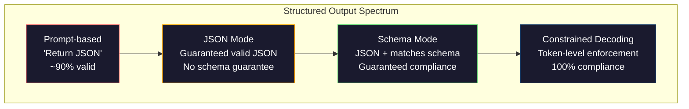
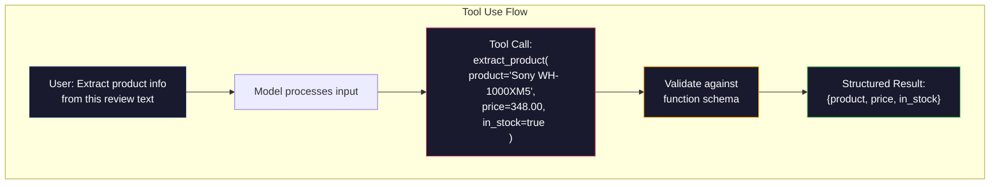

# 结构化输出：JSON、Schema 校验与受约束解码

> 你的 LLM 返回的是一个字符串。你的应用需要的却是 JSON。这道鸿沟造成的生产系统崩溃，比任何模型幻觉都要多。结构化输出正是连接自然语言与类型化数据之间的桥梁。做对了，你的 LLM 就成了一个可靠的 API；做错了，你就得在凌晨三点用正则表达式去解析自由文本。

**类型：** 构建
**语言：** Python
**前置要求：** Phase 10，第 01-05 课（从零构建 LLM）
**所需时间：** 约90分钟
**相关：** Phase 5 · 20（结构化输出与受约束解码）讲解了解码器层面的理论（FSM/CFG logit 处理器、Outlines、XGrammar）。本课聚焦于生产环境的 SDK 接口层（OpenAI `response_format`、Anthropic 工具使用、Instructor）——如果你想理解 API 之下究竟发生了什么，请先阅读 Phase 5 · 20。

## 学习目标

- 使用 OpenAI 和 Anthropic 的 API 参数实现 JSON 模式和受 schema 约束的输出
- 构建一个 Pydantic 校验层，拒绝格式错误的 LLM 输出，并带着错误反馈进行重试
- 解释受约束解码如何在 token 层面强制生成合法 JSON，而无需后处理
- 设计稳健的抽取提示词，可靠地将非结构化文本转换为类型化的数据结构

## 问题所在

你向 LLM 提问：“从这段文本中抽取产品名称、价格和库存状态。”它回答：

```
The product is the Sony WH-1000XM5 headphones, which cost $348.00 and are currently in stock.
```

这是个完全正确的答案，但对你的应用来说也完全没用。你的库存系统需要的是 `{"product": "Sony WH-1000XM5", "price": 348.00, "in_stock": true}`。你需要的是一个带有特定键、特定类型和特定取值约束的 JSON 对象，而不是一个句子。

最朴素的解决方案：在提示词里加上“以 JSON 格式回复”。这能在 90% 的情况下奏效。但另外 10% 的情况里，模型会把 JSON 包在 markdown 代码围栏里，或者加上一句“这是 JSON：”这样的开场白，又或者因为过早地闭合了某个括号而生成语法非法的 JSON。于是你的 JSON 解析器崩溃了，流水线断掉了。你加上 try/except 和重试循环，而重试有时会产出不同的数据。现在你在解析问题之上又多了一个一致性问题。

这不是一个提示词工程问题，而是一个解码问题。模型从左到右逐个生成 token。在每个位置，它从 10 万以上的词表选项中挑选最可能的下一个 token。在任意给定位置，这些选项中的大多数都会导致非法的 JSON。如果模型刚刚输出了 `{"price":`，那么下一个 token 必须是一个数字、一个引号（表示字符串）、`null`、`true`、`false` 或一个负号。除此之外的任何东西都会生成非法 JSON。在没有约束的情况下，模型可能挑选一个语义上完全合理、但在语法上灾难性错误的英文单词。

## 概念说明

### 结构化输出的谱系

结构化输出的控制有四个层级，每一层都比前一层更可靠。



**基于提示词**（“以合法的 JSON 格式回复”）：没有任何强制约束。模型通常会遵从，但有时不会。可靠性：约 90%。失败模式：markdown 围栏、开场白文本、被截断的输出、错误的结构。

**JSON 模式**：API 保证输出是合法的 JSON。OpenAI 的 `response_format: { type: "json_object" }` 可以启用这一模式。输出在解析时不会出错，但它可能与你期望的 schema 不匹配——多出来的键、错误的类型、缺失的字段。

**Schema 模式**：API 接收一个 JSON Schema，并保证输出与之匹配。到 2026 年，每一家主流厂商都原生支持这一功能：OpenAI 的 `response_format: { type: "json_schema", json_schema: {...} }`（也可通过 `tool_choice="required"`）、Anthropic 带 `input_schema` 的工具使用，以及 Gemini 的 `response_schema` + `response_mime_type: "application/json"`。输出会带有你指定的精确的键、类型和约束。

**受约束解码**：在生成过程中的每一个 token 位置，解码器会屏蔽掉所有会导致非法输出的 token。如果 schema 要求一个数字，而模型正打算输出一个字母，那么该 token 的概率会被设为零。模型只能生成那些通向合法输出的 token。这正是 OpenAI 的结构化输出模式以及 Outlines、Guidance 这类库在底层实现的机制。

### JSON Schema：契约语言

JSON Schema 是你用来告诉模型（或校验层）输出必须呈现何种形态的方式。每一个主流的结构化输出系统都会用到它。

```json
{
  "type": "object",
  "properties": {
    "product": { "type": "string" },
    "price": { "type": "number", "minimum": 0 },
    "in_stock": { "type": "boolean" },
    "categories": {
      "type": "array",
      "items": { "type": "string" }
    }
  },
  "required": ["product", "price", "in_stock"]
}
```

这个 schema 表示：输出必须是一个对象，包含字符串 `product`、非负数 `price`、布尔值 `in_stock`，以及一个可选的字符串数组 `categories`。任何不匹配的输出都会被拒绝。

Schema 能处理那些棘手的情况：嵌套对象、带类型条目的数组、枚举（将字符串约束为特定取值）、模式匹配（对字符串使用正则表达式），以及组合器（用于多态输出的 oneOf、anyOf、allOf）。

### Pydantic 模式

在 Python 里，你不必手写 JSON Schema。你定义一个 Pydantic 模型，它就会为你生成 schema。

```python
from pydantic import BaseModel

class Product(BaseModel):
    product: str
    price: float
    in_stock: bool
    categories: list[str] = []
```

这会生成与上面相同的 JSON Schema。Instructor 库（以及 OpenAI 的 SDK）可以直接接收 Pydantic 模型：传入模型类，拿回一个经过校验的实例。如果 LLM 的输出不匹配，Instructor 会自动重试。

### 函数调用 / 工具使用

针对同一个问题的另一种接口。你不再要求模型直接生成 JSON，而是定义带有类型化参数的“工具”（函数）。模型输出一个带有结构化参数的函数调用。OpenAI 称之为“函数调用”（function calling），Anthropic 称之为“工具使用”（tool use）。结果是一样的：结构化数据。



当模型需要选择调用哪个函数、而不仅仅是填充参数时，工具使用是更优的选择。如果你有 10 种不同的抽取 schema，而模型必须根据输入挑选正确的那一个，那么工具使用既能为你完成 schema 选择，又能给出结构化输出。

### 常见的失败模式

即便有了 schema 强制约束，结构化输出仍可能以微妙的方式失败。

**幻觉值**：输出符合 schema，但包含的是编造的数据。文本里写的是 $348，模型却产出 `{"price": 299.99}`。Schema 校验无法捕捉这种问题——类型是对的，值却是错的。

**枚举混淆**：你把某个字段约束为 `["in_stock", "out_of_stock", "preorder"]`。模型输出了 `"available"`——语义上正确，但不在允许的集合内。优秀的受约束解码能防止这种情况，基于提示词的方法则不能。

**嵌套对象深度**：层级很深的 schema（4 层以上）会产生更多错误。每一层嵌套都是模型可能丢失结构追踪的又一处地方。

**数组长度**：模型可能在数组里产出过多或过少的条目。Schema 支持 `minItems` 和 `maxItems`，但并非所有厂商都会在解码层面强制执行它们。

**可选字段被省略**：模型省略了那些在技术上可选、但对你的用例而言语义上重要的字段。即便数据有时确实缺失，也要在 schema 里把它们设为必需——强制模型显式地产出 `null`。

## 开始构建

### 第 1 步：JSON Schema 校验器

从零构建一个校验器，检查一个 Python 对象是否与某个 JSON Schema 匹配。这就是在输出端运行、用于验证合规性的部分。

```python
import json

def validate_schema(data, schema):
    errors = []
    _validate(data, schema, "", errors)
    return errors

def _validate(data, schema, path, errors):
    schema_type = schema.get("type")

    if schema_type == "object":
        if not isinstance(data, dict):
            errors.append(f"{path}: expected object, got {type(data).__name__}")
            return
        for key in schema.get("required", []):
            if key not in data:
                errors.append(f"{path}.{key}: required field missing")
        properties = schema.get("properties", {})
        for key, value in data.items():
            if key in properties:
                _validate(value, properties[key], f"{path}.{key}", errors)

    elif schema_type == "array":
        if not isinstance(data, list):
            errors.append(f"{path}: expected array, got {type(data).__name__}")
            return
        min_items = schema.get("minItems", 0)
        max_items = schema.get("maxItems", float("inf"))
        if len(data) < min_items:
            errors.append(f"{path}: array has {len(data)} items, minimum is {min_items}")
        if len(data) > max_items:
            errors.append(f"{path}: array has {len(data)} items, maximum is {max_items}")
        items_schema = schema.get("items", {})
        for i, item in enumerate(data):
            _validate(item, items_schema, f"{path}[{i}]", errors)

    elif schema_type == "string":
        if not isinstance(data, str):
            errors.append(f"{path}: expected string, got {type(data).__name__}")
            return
        enum_values = schema.get("enum")
        if enum_values and data not in enum_values:
            errors.append(f"{path}: '{data}' not in allowed values {enum_values}")

    elif schema_type == "number":
        if not isinstance(data, (int, float)):
            errors.append(f"{path}: expected number, got {type(data).__name__}")
            return
        minimum = schema.get("minimum")
        maximum = schema.get("maximum")
        if minimum is not None and data < minimum:
            errors.append(f"{path}: {data} is less than minimum {minimum}")
        if maximum is not None and data > maximum:
            errors.append(f"{path}: {data} is greater than maximum {maximum}")

    elif schema_type == "boolean":
        if not isinstance(data, bool):
            errors.append(f"{path}: expected boolean, got {type(data).__name__}")

    elif schema_type == "integer":
        if not isinstance(data, int) or isinstance(data, bool):
            errors.append(f"{path}: expected integer, got {type(data).__name__}")
```

### 第 2 步：Pydantic 风格的模型到 Schema 转换

构建一个最小化的“类到 schema”转换器。定义一个 Python 类，并自动生成它的 JSON Schema。

```python
class SchemaField:
    def __init__(self, field_type, required=True, default=None, enum=None, minimum=None, maximum=None):
        self.field_type = field_type
        self.required = required
        self.default = default
        self.enum = enum
        self.minimum = minimum
        self.maximum = maximum

def python_type_to_schema(field):
    type_map = {
        str: "string",
        int: "integer",
        float: "number",
        bool: "boolean",
    }

    schema = {}

    if field.field_type in type_map:
        schema["type"] = type_map[field.field_type]
    elif field.field_type == list:
        schema["type"] = "array"
        schema["items"] = {"type": "string"}
    elif isinstance(field.field_type, dict):
        schema = field.field_type

    if field.enum:
        schema["enum"] = field.enum
    if field.minimum is not None:
        schema["minimum"] = field.minimum
    if field.maximum is not None:
        schema["maximum"] = field.maximum

    return schema

def model_to_schema(name, fields):
    properties = {}
    required = []

    for field_name, field in fields.items():
        properties[field_name] = python_type_to_schema(field)
        if field.required:
            required.append(field_name)

    return {
        "type": "object",
        "properties": properties,
        "required": required,
    }
```

### 第 3 步：受约束的 Token 过滤器

模拟受约束解码。给定一个不完整的 JSON 字符串和一个 schema，判断在当前位置哪些 token 类别是合法的。

```python
def next_valid_tokens(partial_json, schema):
    stripped = partial_json.strip()

    if not stripped:
        return ["{"]

    try:
        json.loads(stripped)
        return ["<EOS>"]
    except json.JSONDecodeError:
        pass

    last_char = stripped[-1] if stripped else ""

    if last_char == "{":
        return ['"', "}"]
    elif last_char == '"':
        if stripped.endswith('":'):
            return ['"', "0-9", "true", "false", "null", "[", "{"]
        return ["a-z", '"']
    elif last_char == ":":
        return [" ", '"', "0-9", "true", "false", "null", "[", "{"]
    elif last_char == ",":
        return [" ", '"', "{", "["]
    elif last_char in "0123456789":
        return ["0-9", ".", ",", "}", "]"]
    elif last_char == "}":
        return [",", "}", "]", "<EOS>"]
    elif last_char == "]":
        return [",", "}", "<EOS>"]
    elif last_char == "[":
        return ['"', "0-9", "true", "false", "null", "{", "[", "]"]
    else:
        return ["any"]

def demonstrate_constrained_decoding():
    partial_states = [
        '',
        '{',
        '{"product"',
        '{"product":',
        '{"product": "Sony"',
        '{"product": "Sony",',
        '{"product": "Sony", "price":',
        '{"product": "Sony", "price": 348',
        '{"product": "Sony", "price": 348}',
    ]

    print(f"{'Partial JSON':<45} {'Valid Next Tokens'}")
    print("-" * 80)
    for state in partial_states:
        valid = next_valid_tokens(state, {})
        display = state if state else "(empty)"
        print(f"{display:<45} {valid}")
```

### 第 4 步：抽取流水线

把所有内容组合成一条抽取流水线：定义一个 schema，模拟一个产出结构化输出的 LLM，校验输出，并处理重试。

```python
def simulate_llm_extraction(text, schema, attempt=0):
    if "headphones" in text.lower() or "sony" in text.lower():
        if attempt == 0:
            return '{"product": "Sony WH-1000XM5", "price": 348.00, "in_stock": true, "categories": ["audio", "headphones"]}'
        return '{"product": "Sony WH-1000XM5", "price": 348.00, "in_stock": true}'

    if "laptop" in text.lower():
        return '{"product": "MacBook Pro 16", "price": 2499.00, "in_stock": false, "categories": ["computers"]}'

    return '{"product": "Unknown", "price": 0, "in_stock": false}'

def extract_with_retry(text, schema, max_retries=3):
    for attempt in range(max_retries):
        raw = simulate_llm_extraction(text, schema, attempt)

        try:
            data = json.loads(raw)
        except json.JSONDecodeError as e:
            print(f"  Attempt {attempt + 1}: JSON parse error -- {e}")
            continue

        errors = validate_schema(data, schema)
        if not errors:
            return data

        print(f"  Attempt {attempt + 1}: Schema validation errors -- {errors}")

    return None

product_schema = {
    "type": "object",
    "properties": {
        "product": {"type": "string"},
        "price": {"type": "number", "minimum": 0},
        "in_stock": {"type": "boolean"},
        "categories": {"type": "array", "items": {"type": "string"}},
    },
    "required": ["product", "price", "in_stock"],
}
```

### 第 5 步：运行完整的流水线

```python
def run_demo():
    print("=" * 60)
    print("  Structured Output Pipeline Demo")
    print("=" * 60)

    print("\n--- Schema Definition ---")
    product_fields = {
        "product": SchemaField(str),
        "price": SchemaField(float, minimum=0),
        "in_stock": SchemaField(bool),
        "categories": SchemaField(list, required=False),
    }
    generated_schema = model_to_schema("Product", product_fields)
    print(json.dumps(generated_schema, indent=2))

    print("\n--- Schema Validation ---")
    test_cases = [
        ({"product": "Test", "price": 10.0, "in_stock": True}, "Valid object"),
        ({"product": "Test", "price": -5.0, "in_stock": True}, "Negative price"),
        ({"product": "Test", "in_stock": True}, "Missing price"),
        ({"product": "Test", "price": "ten", "in_stock": True}, "String as price"),
        ("not an object", "String instead of object"),
    ]

    for data, label in test_cases:
        errors = validate_schema(data, product_schema)
        status = "PASS" if not errors else f"FAIL: {errors}"
        print(f"  {label}: {status}")

    print("\n--- Constrained Decoding Simulation ---")
    demonstrate_constrained_decoding()

    print("\n--- Extraction Pipeline ---")
    texts = [
        "The Sony WH-1000XM5 headphones are priced at $348 and currently available.",
        "The new MacBook Pro 16-inch laptop costs $2499 but is sold out.",
        "This is a random sentence with no product info.",
    ]

    for text in texts:
        print(f"\n  Input: {text[:60]}...")
        result = extract_with_retry(text, product_schema)
        if result:
            print(f"  Output: {json.dumps(result)}")
        else:
            print(f"  Output: FAILED after retries")
```

## 实际使用

### OpenAI 结构化输出

```python
# from openai import OpenAI
# from pydantic import BaseModel
#
# client = OpenAI()
#
# class Product(BaseModel):
#     product: str
#     price: float
#     in_stock: bool
#
# response = client.beta.chat.completions.parse(
#     model="gpt-5-mini",
#     messages=[
#         {"role": "system", "content": "Extract product information."},
#         {"role": "user", "content": "Sony WH-1000XM5, $348, in stock"},
#     ],
#     response_format=Product,
# )
#
# product = response.choices[0].message.parsed
# print(product.product, product.price, product.in_stock)
```

OpenAI 的结构化输出模式在内部使用受约束解码。模型生成的每一个 token 都能保证产出与 Pydantic schema 匹配的输出。无需重试，无需校验。约束被直接内置到了解码过程之中。

### Anthropic 工具使用

```python
# import anthropic
#
# client = anthropic.Anthropic()
#
# response = client.messages.create(
#     model="claude-opus-4-7",
#     max_tokens=1024,
#     tools=[{
#         "name": "extract_product",
#         "description": "Extract product information from text",
#         "input_schema": {
#             "type": "object",
#             "properties": {
#                 "product": {"type": "string"},
#                 "price": {"type": "number"},
#                 "in_stock": {"type": "boolean"},
#             },
#             "required": ["product", "price", "in_stock"],
#         },
#     }],
#     messages=[{"role": "user", "content": "Extract: Sony WH-1000XM5, $348, in stock"}],
# )
```

Anthropic 通过工具使用来实现结构化输出。模型发出一个工具调用，其结构化参数与 input_schema 匹配。结果相同，只是 API 接口不同。

### Instructor 库

```python
# pip install instructor
# import instructor
# from openai import OpenAI
# from pydantic import BaseModel
#
# client = instructor.from_openai(OpenAI())
#
# class Product(BaseModel):
#     product: str
#     price: float
#     in_stock: bool
#
# product = client.chat.completions.create(
#     model="gpt-5-mini",
#     response_model=Product,
#     messages=[{"role": "user", "content": "Sony WH-1000XM5, $348, in stock"}],
# )
```

Instructor 包装任意一个 LLM 客户端，并为其加上带校验的自动重试。如果第一次尝试未通过校验，它会把错误作为上下文发回给模型，并要求它修正输出。这适用于任意厂商，而不仅仅是 OpenAI。

## 交付成果

本课产出 `outputs/prompt-structured-extractor.md`——一个可复用的提示词模板，在给定 schema 定义的情况下，从任意文本中抽取结构化数据。把一个 JSON Schema 和非结构化文本喂给它，它就会返回经过校验的 JSON。

它还产出 `outputs/skill-structured-outputs.md`——一个决策框架，帮助你根据厂商、可靠性要求和 schema 复杂度，选择正确的结构化输出策略。

## 练习

1. 扩展 schema 校验器以支持 `oneOf`（数据必须恰好匹配若干 schema 中的一个）。这能处理多态输出——例如，一个既可以是 `Product` 对象、也可以是形态不同的 `Service` 对象的字段。

2. 构建一个“schema diff”工具，比较两个 schema 并识别出破坏性变更（移除了必需字段、改变了类型）与非破坏性变更（新增了可选字段、放宽了约束）。这对于在生产环境中对抽取 schema 做版本管理至关重要。

3. 实现一个更贴近现实的受约束解码模拟器。给定一个 JSON Schema 和一个含 100 个 token 的词表（字母、数字、标点、关键字），逐步走过生成过程，在每个位置屏蔽掉非法 token。测量在每一步中词表里有多大比例是合法的。

4. 构建一套抽取评测集。创建 50 条产品描述，并附上人工标注的 JSON 输出。在全部 50 条上运行你的抽取流水线，测量完全匹配率、字段级准确率和类型合规率。找出哪些字段最难被正确抽取。

5. 为你的抽取流水线加上“置信度分数”。对于每个被抽取的字段，估计模型有多大把握（基于 token 概率，或者通过运行 3 次抽取并测量一致性）。把低置信度的字段标记出来交由人工审查。

## 关键术语

| 术语 | 人们常说 | 实际含义 |
|------|----------------|----------------------|
| JSON 模式 | “返回 JSON” | 一个 API 标志，保证语法上合法的 JSON 输出，但不强制任何特定 schema |
| 结构化输出 | “类型化 JSON” | 与特定 JSON Schema 匹配的输出，具有正确的键、类型和约束 |
| 受约束解码 | “引导式生成” | 在每个 token 位置，屏蔽掉会导致非法输出的 token——保证 100% 的 schema 合规 |
| JSON Schema | “一个 JSON 模板” | 一种用于描述 JSON 数据的结构、类型和约束的声明式语言（被 OpenAPI、JSON Forms 等使用） |
| Pydantic | “Python dataclasses 加强版” | 一个用于定义带类型校验的数据模型的 Python 库，被 FastAPI 和 Instructor 用来生成 JSON Schema |
| 函数调用 | “工具使用” | LLM 输出一个结构化的函数调用（名称 + 类型化参数），而非自由文本——OpenAI 和 Anthropic 都支持 |
| Instructor | “面向 LLM 的 Pydantic” | 一个包装 LLM 客户端、返回经过校验的 Pydantic 实例、并在校验失败时自动重试的 Python 库 |
| Token 屏蔽 | “过滤词表” | 在生成过程中把特定 token 的概率设为零，使模型无法产出它们 |
| Schema 合规 | “匹配形态” | 输出具有每一个必需字段、正确的类型、约束范围内的取值，且没有多余的、不被允许的字段 |
| 重试循环 | “一直重试直到成功” | 把校验错误发回给模型并要求它修正输出——Instructor 会自动这样做，直到可配置的上限 |

## 延伸阅读

- [OpenAI Structured Outputs Guide](https://platform.openai.com/docs/guides/structured-outputs) —— OpenAI API 中基于 JSON Schema 的受约束解码的官方文档
- [Willard & Louf, 2023 -- "Efficient Guided Generation for Large Language Models"](https://arxiv.org/abs/2307.09702) —— Outlines 论文，描述如何把 JSON Schema 编译成有限状态机以实现 token 层面的约束
- [Instructor documentation](https://python.useinstructor.com/) —— 从任意 LLM 获取结构化输出的标准库，带 Pydantic 校验和重试
- [Anthropic Tool Use Guide](https://docs.anthropic.com/en/docs/tool-use) —— Claude 如何通过带 JSON Schema input_schema 的工具使用来实现结构化输出
- [JSON Schema specification](https://json-schema.org/) —— 每一个主流结构化输出系统所使用的 schema 语言的完整规范
- [Outlines library](https://github.com/outlines-dev/outlines) —— 使用正则表达式和编译成有限状态机的 JSON Schema 来实现受约束生成的开源库
- [Dong et al., "XGrammar: Flexible and Efficient Structured Generation Engine for Large Language Models" (MLSys 2025)](https://arxiv.org/abs/2411.15100) —— 当前最先进的语法引擎；采用下推自动机编译，以约 100 纳秒 / token 的速度屏蔽 token。
- [Beurer-Kellner et al., "Prompting Is Programming: A Query Language for Large Language Models" (LMQL)](https://arxiv.org/abs/2212.06094) —— LMQL 论文，将受约束解码构造成一种带类型和取值约束的查询语言。
- [Microsoft Guidance (framework docs)](https://github.com/guidance-ai/guidance) —— 模板驱动的受约束生成；是 Outlines 和 XGrammar 的厂商无关的补充。
