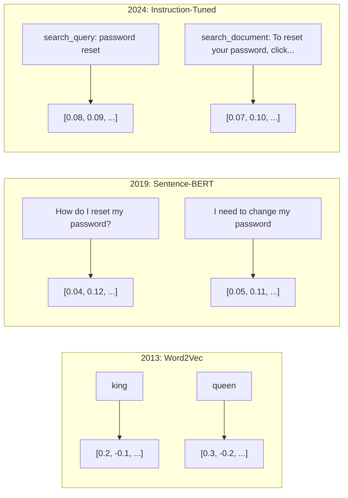
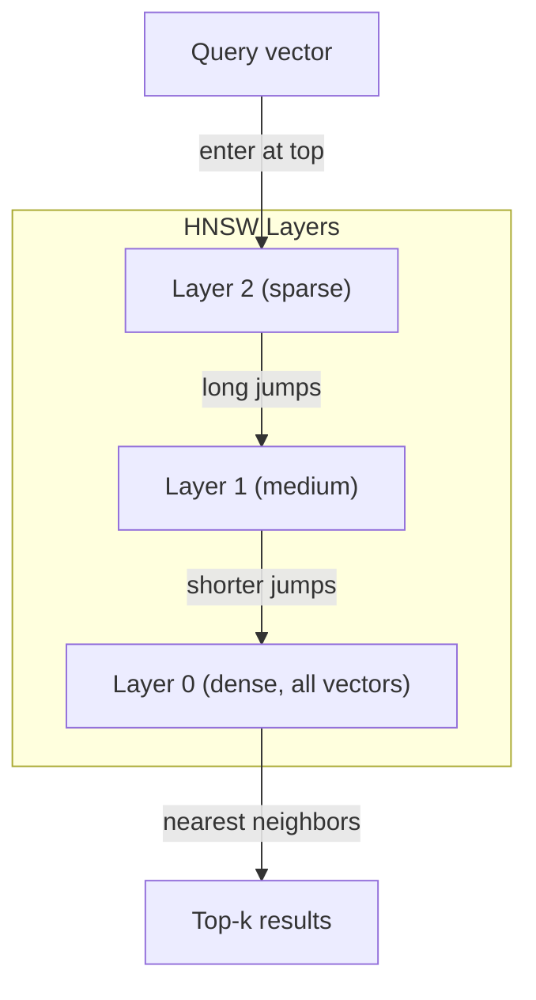
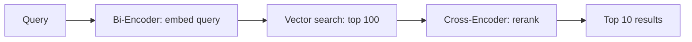

# 嵌入与向量表示

> 文本是离散的，数学是连续的。每当你让 LLM 查找“相似”的文档、比较含义，或者进行超越关键词的搜索时，你都在依赖一座连接这两个世界的桥梁。这座桥梁就是嵌入（embedding）。如果你不理解嵌入，你就不理解现代 AI——你只是在用它而已。

**类型：** 构建
**语言：** Python
**前置要求：** Phase 11，第 01 课（提示词工程）
**所需时间：** 约75分钟
**相关：** Phase 5 · 22（嵌入模型深度剖析）讲解了稠密 vs 稀疏 vs 多向量、Matryoshka 截断，以及按维度选择模型。本课聚焦于生产流水线（向量数据库、HNSW、相似度数学）。在选择模型之前，请先阅读 Phase 5 · 22。

## 学习目标

- 使用 API 厂商和开源模型生成文本嵌入，并计算它们之间的余弦相似度
- 解释嵌入为何能解决关键词搜索无法处理的词汇不匹配问题
- 构建一个语义搜索索引，按含义而非精确关键词匹配来检索文档
- 使用检索基准（precision@k、recall）评估嵌入质量，并为你的任务选择合适的嵌入模型

## 问题所在

你有 10,000 张工单。一位客户写道“我的付款没有成功”。你需要找到过去相似的工单。关键词搜索会找到包含“付款”和“没有成功”的工单，却会漏掉“交易失败”“扣款被拒”和“账单错误”。这些工单用完全不同的词描述了同一个问题。

这就是词汇不匹配问题。人类语言有几十种方式表达同一件事。关键词搜索把每个词当作一个独立的、没有含义的符号。它无法知道“被拒”和“没有成功”指的是同一个概念。

你需要一种文本表示，让相似度由含义、而非拼写来决定。你需要一种方法，把“我的付款没有成功”和“交易被拒”在某个数学空间里放得很近，同时尽管“我的付款准时到账”也含有“付款”一词，却把它推得很远。

那种表示就是嵌入。

## 概念说明

### 什么是嵌入？

嵌入是一个由浮点数构成的稠密向量，用来表示文本的含义。“稠密”这个词很关键——每一个维度都承载信息，这不同于稀疏表示（词袋、TF-IDF），后者的大多数维度都是零。

“The cat sat on the mat”会变成类似 `[0.023, -0.041, 0.087, ..., 0.012]` 的东西——一个由 768 到 3072 个数字组成的列表，具体取决于模型。这些数字编码了含义。你从不直接检视它们，而是去比较它们。

### Word2Vec 的突破

2013 年，Google 的 Tomas Mikolov 及其同事发表了 Word2Vec。其核心洞见是：训练一个神经网络去根据邻近词预测某个词（或根据某个词预测邻近词），隐藏层的权重就会变成有意义的向量表示。

那个著名的结果：

```
king - man + woman = queen
```

对词嵌入进行向量算术运算可以捕捉语义关系。从“man”到“woman”的方向，大致与从“king”到“queen”的方向相同。正是在这一刻，该领域意识到几何可以编码含义。

Word2Vec 产生的是 300 维向量。每个词无论上下文如何都只得到一个向量。“Bank”在“river bank”（河岸）和“bank account”（银行账户）中拥有相同的嵌入。这一局限推动了接下来十年的研究。

### 从词到句子

词嵌入表示的是单个 token。生产系统需要嵌入整个句子、段落或文档。出现了四种方法：

**平均法**：取句子中所有词向量的均值。廉价、有损，但对短文本而言效果意外地不错。它会完全丢失词序——“dog bites man”和“man bites dog”得到的嵌入完全相同。

**CLS token**：Transformer 模型（BERT，2018）会输出一个特殊的 [CLS] token 嵌入，用来表示整个输入。比平均法更好，但 [CLS] token 是为下一句预测（next-sentence prediction）训练的，而不是为相似度训练的。

**对比学习**：显式地训练模型，把相似的样本对拉近、把不相似的样本对推远。Sentence-BERT（Reimers & Gurevych, 2019）采用了这一方法，并成为现代嵌入模型的基础。给定“How do I reset my password?”和“I need to change my password”，模型学会让它们拥有几乎相同的向量。

**指令微调嵌入**：最新的方法。E5 和 GTE 这类模型接受一个任务前缀（“search_query:”“search_document:”），用以告诉模型要产出哪种嵌入。这让单个模型能服务于多种任务。



### 现代嵌入模型

市场已经沉淀出少数几个生产级选项（MTEB 分数截至 2026 年初，MTEB v2）：

| 模型 | 厂商 | 维度 | MTEB | 上下文 | 成本 / 100 万 token |
|-------|----------|-----------|------|---------|------------------|
| Gemini Embedding 2 | Google | 3072 (Matryoshka) | 67.7（检索） | 8192 | $0.15 |
| embed-v4 | Cohere | 1024 (Matryoshka) | 65.2 | 128K | $0.12 |
| voyage-4 | Voyage AI | 1024/2048 (Matryoshka) | 66.8 | 32K | $0.12 |
| text-embedding-3-large | OpenAI | 3072 (Matryoshka) | 64.6 | 8192 | $0.13 |
| text-embedding-3-small | OpenAI | 1536 (Matryoshka) | 62.3 | 8192 | $0.02 |
| BGE-M3 | BAAI | 1024 (dense+sparse+ColBERT) | 63.0 多语言 | 8192 | 开放权重 |
| Qwen3-Embedding | Alibaba | 4096 (Matryoshka) | 66.9 | 32K | 开放权重 |
| Nomic-embed-v2 | Nomic | 768 (Matryoshka) | 63.1 | 8192 | 开放权重 |

MTEB（Massive Text Embedding Benchmark，海量文本嵌入基准）v2 覆盖了检索、分类、聚类、重排序和摘要等 100 多项任务。分数越高越好。到 2026 年，开放权重模型（Qwen3-Embedding、BGE-M3）在大多数维度上已追平或超越了闭源托管模型。Gemini Embedding 2 在纯检索上领先；Voyage/Cohere 在特定领域（金融、法律、代码）领先。在最终决定之前，请始终在你自己的查询上做基准测试。

### 相似度度量

给定两个嵌入向量，有三种方式衡量它们有多相似：

**余弦相似度**：两个向量之间夹角的余弦值。范围从 -1（相反）到 1（方向相同）。它忽略幅度——一个 10 词的句子和一篇 500 词的文档，如果指向相同方向，就能得到 1.0 的分数。这是 90% 的用例的默认选择。

```
cosine_sim(a, b) = dot(a, b) / (||a|| * ||b||)
```

**点积**：两个向量的原始内积。当向量经过归一化（单位长度）时，它与余弦相似度完全相同。计算更快。OpenAI 的嵌入是归一化的，因此点积和余弦给出相同的排名。

```
dot(a, b) = sum(a_i * b_i)
```

**欧氏（L2）距离**：向量空间中的直线距离。越小 = 越相似。对幅度差异敏感。当重要的是空间中的绝对位置、而不仅仅是方向时使用它。

```
L2(a, b) = sqrt(sum((a_i - b_i)^2))
```

何时使用哪一种：

| 度量 | 何时使用 | 何时避免 |
|--------|----------|------------|
| 余弦相似度 | 比较不同长度的文本；大多数检索任务 | 幅度承载信息时 |
| 点积 | 嵌入已经归一化；追求最高速度 | 向量幅度参差不齐时 |
| 欧氏距离 | 聚类；空间最近邻问题 | 比较长度差异极大的文档时 |

### 向量数据库与 HNSW

暴力相似度搜索会拿查询与每一个存储的向量做比较。在 100 万个 1536 维向量的规模下，每次查询需要 15 亿次乘加运算。太慢了。

向量数据库用近似最近邻（Approximate Nearest Neighbor，ANN）算法来解决这个问题。占主导地位的算法是 HNSW（Hierarchical Navigable Small World，分层可导航小世界）：

1. 构建一个多层的向量图
2. 顶层是稀疏的——远距离簇之间的长程连接
3. 底层是稠密的——邻近向量之间的细粒度连接
4. 搜索从顶层开始，贪婪地向下逐层细化
5. 以 O(log n) 的时间返回近似的 top-k 结果，而非 O(n)

HNSW 用很小的精度损失（通常 95-99% 的召回率）换取巨大的速度提升。在 1000 万个向量的规模下，暴力搜索需要数秒，HNSW 只需毫秒。



生产环境选项：

| 数据库 | 类型 | 最适合 | 最大规模 |
|----------|------|----------|-----------|
| Pinecone | 托管 SaaS | 零运维的生产环境 | 数十亿 |
| Weaviate | 开源 | 自托管、混合搜索 | 1 亿以上 |
| Qdrant | 开源 | 高性能、过滤 | 1 亿以上 |
| ChromaDB | 嵌入式 | 原型开发、本地开发 | 100 万 |
| pgvector | Postgres 扩展 | 已经在用 Postgres | 1000 万 |
| FAISS | 库 | 进程内、研究用途 | 10 亿以上 |

### 分块策略

文档太长，无法作为单个向量来嵌入。一份 50 页的 PDF 涵盖了几十个主题——它的嵌入会变成所有内容的平均，谁都不像。你要把文档切分成块（chunk），并分别嵌入每一块。

**固定大小分块**：每 N 个 token 切分一次，块之间有 M 个 token 的重叠。简单且可预测。当文档没有清晰结构时效果良好。一个 512-token 的块、50-token 的重叠：块 1 是 token 0-511，块 2 是 token 462-973。

**基于句子的分块**：在句子边界处切分，把句子分组直到达到 token 上限。每一块至少是一个完整的句子。比固定大小更好，因为你永远不会把一个想法拦腰切断。

**递归分块**：先尝试在最大的边界处切分（章节标题）。如果仍然太大，再尝试段落边界。然后是句子边界，再然后是字符上限。这就是 LangChain 的 `RecursiveCharacterTextSplitter`，对于混合格式的语料效果良好。

**语义分块**：嵌入每一个句子，然后把嵌入相似的连续句子分到一组。当嵌入相似度降到某个阈值以下时，就开始一个新块。开销大（需要单独嵌入每一个句子），但能产生最连贯的块。

| 策略 | 复杂度 | 质量 | 最适合 |
|----------|-----------|---------|----------|
| 固定大小 | 低 | 尚可 | 非结构化文本、日志 |
| 基于句子 | 低 | 好 | 文章、邮件 |
| 递归 | 中 | 好 | Markdown、HTML、混合文档 |
| 语义 | 高 | 最佳 | 检索质量至关重要的场景 |

对大多数系统而言的最佳平衡点：256-512 token 的块，配 50-token 的重叠。

### 双编码器 vs 交叉编码器

双编码器（bi-encoder）独立地嵌入查询和文档，然后比较向量。快——你只需嵌入查询一次，再与预先计算好的文档嵌入做比较。这就是你用于检索的方式。

交叉编码器（cross-encoder）把查询和文档作为单个输入，输出一个相关性分数。慢——它要把每一个查询-文档对都跑一遍完整的模型。但准确得多，因为它可以同时关注（attend）查询和文档的 token。

生产模式：双编码器检索出 top-100 候选，交叉编码器把它们重排序为 top-10。这就是“检索后重排序”（retrieve-then-rerank）流水线。



重排序模型：Cohere Rerank 3.5（每 1000 次查询 $2）、BGE-reranker-v2（免费、开源）、Jina Reranker v2（免费、开源）。

### Matryoshka 嵌入

传统嵌入是要么全有、要么全无。一个 1536 维的向量要用满 1536 个浮点数。你无法在不重新训练的情况下截断到 256 维。

Matryoshka 表示学习（Matryoshka Representation Learning，Kusupati et al., 2022）解决了这个问题。模型经过训练，使得前 N 个维度捕捉到最重要的信息，就像俄罗斯套娃一样。把一个 1536 维的 Matryoshka 嵌入截断到 256 维会损失一些精度，但仍然可用。

OpenAI 的 text-embedding-3-small 和 text-embedding-3-large 通过 `dimensions` 参数支持 Matryoshka 截断。请求 256 维而非 1536 维，可以把存储削减 6 倍，而在 MTEB 基准上的精度损失大约只有 3-5%。

### 二值量化

一个以 float32 存储的 1536 维嵌入要占用 6,144 字节。乘以 1000 万份文档：仅向量就要 61 GB。

二值量化把每个浮点数转换为单个比特：正值变为 1，负值变为 0。存储从 6,144 字节降到 192 字节——缩减 32 倍。相似度用汉明距离（Hamming distance，统计不同的比特数）计算，CPU 用单条指令就能完成。

精度损失在检索召回率上约为 5-10%。常见模式是：用二值量化在数百万向量上做第一遍搜索，然后用全精度向量对 top-1000 重新打分。这样你能在内存少 32 倍的情况下，达到全精度准确率的 95% 以上。

```figure
cosine-similarity
```

## 开始构建

我们从零构建一个语义搜索引擎。没有向量数据库，没有外部嵌入 API。纯 Python，用 numpy 来做数学运算。

### 第 1 步：文本分块

```python
def chunk_text(text, chunk_size=200, overlap=50):
    words = text.split()
    chunks = []
    start = 0
    while start < len(words):
        end = start + chunk_size
        chunk = " ".join(words[start:end])
        chunks.append(chunk)
        start += chunk_size - overlap
    return chunks


def chunk_by_sentences(text, max_chunk_tokens=200):
    sentences = text.replace("\n", " ").split(".")
    sentences = [s.strip() + "." for s in sentences if s.strip()]
    chunks = []
    current_chunk = []
    current_length = 0
    for sentence in sentences:
        sentence_length = len(sentence.split())
        if current_length + sentence_length > max_chunk_tokens and current_chunk:
            chunks.append(" ".join(current_chunk))
            current_chunk = []
            current_length = 0
        current_chunk.append(sentence)
        current_length += sentence_length
    if current_chunk:
        chunks.append(" ".join(current_chunk))
    return chunks
```

### 第 2 步：从零构建嵌入

我们用带 L2 归一化的 TF-IDF 来实现一个简单的稠密嵌入。这不是神经网络嵌入，但它遵循相同的契约：输入文本，输出固定大小的向量，相似的文本产生相似的向量。

```python
import math
import numpy as np
from collections import Counter

class SimpleEmbedder:
    def __init__(self):
        self.vocab = []
        self.idf = []
        self.word_to_idx = {}

    def fit(self, documents):
        vocab_set = set()
        for doc in documents:
            vocab_set.update(doc.lower().split())
        self.vocab = sorted(vocab_set)
        self.word_to_idx = {w: i for i, w in enumerate(self.vocab)}
        n = len(documents)
        self.idf = np.zeros(len(self.vocab))
        for i, word in enumerate(self.vocab):
            doc_count = sum(1 for doc in documents if word in doc.lower().split())
            self.idf[i] = math.log((n + 1) / (doc_count + 1)) + 1

    def embed(self, text):
        words = text.lower().split()
        count = Counter(words)
        total = len(words) if words else 1
        vec = np.zeros(len(self.vocab))
        for word, freq in count.items():
            if word in self.word_to_idx:
                tf = freq / total
                vec[self.word_to_idx[word]] = tf * self.idf[self.word_to_idx[word]]
        norm = np.linalg.norm(vec)
        if norm > 0:
            vec = vec / norm
        return vec
```

### 第 3 步：相似度函数

```python
def cosine_similarity(a, b):
    dot = np.dot(a, b)
    norm_a = np.linalg.norm(a)
    norm_b = np.linalg.norm(b)
    if norm_a == 0 or norm_b == 0:
        return 0.0
    return float(dot / (norm_a * norm_b))


def dot_product(a, b):
    return float(np.dot(a, b))


def euclidean_distance(a, b):
    return float(np.linalg.norm(a - b))
```

### 第 4 步：带暴力搜索的向量索引

```python
class VectorIndex:
    def __init__(self):
        self.vectors = []
        self.texts = []
        self.metadata = []

    def add(self, vector, text, meta=None):
        self.vectors.append(vector)
        self.texts.append(text)
        self.metadata.append(meta or {})

    def search(self, query_vector, top_k=5, metric="cosine"):
        scores = []
        for i, vec in enumerate(self.vectors):
            if metric == "cosine":
                score = cosine_similarity(query_vector, vec)
            elif metric == "dot":
                score = dot_product(query_vector, vec)
            elif metric == "euclidean":
                score = -euclidean_distance(query_vector, vec)
            else:
                raise ValueError(f"Unknown metric: {metric}")
            scores.append((i, score))
        scores.sort(key=lambda x: x[1], reverse=True)
        results = []
        for idx, score in scores[:top_k]:
            results.append({
                "text": self.texts[idx],
                "score": score,
                "metadata": self.metadata[idx],
                "index": idx
            })
        return results

    def size(self):
        return len(self.vectors)
```

### 第 5 步：语义搜索引擎

```python
class SemanticSearchEngine:
    def __init__(self, chunk_size=200, overlap=50):
        self.embedder = SimpleEmbedder()
        self.index = VectorIndex()
        self.chunk_size = chunk_size
        self.overlap = overlap

    def index_documents(self, documents, source_names=None):
        all_chunks = []
        all_sources = []
        for i, doc in enumerate(documents):
            chunks = chunk_text(doc, self.chunk_size, self.overlap)
            all_chunks.extend(chunks)
            name = source_names[i] if source_names else f"doc_{i}"
            all_sources.extend([name] * len(chunks))
        self.embedder.fit(all_chunks)
        for chunk, source in zip(all_chunks, all_sources):
            vec = self.embedder.embed(chunk)
            self.index.add(vec, chunk, {"source": source})
        return len(all_chunks)

    def search(self, query, top_k=5, metric="cosine"):
        query_vec = self.embedder.embed(query)
        return self.index.search(query_vec, top_k, metric)

    def search_with_scores(self, query, top_k=5):
        results = self.search(query, top_k)
        return [
            {
                "text": r["text"][:200],
                "source": r["metadata"].get("source", "unknown"),
                "score": round(r["score"], 4)
            }
            for r in results
        ]
```

### 第 6 步：比较相似度度量

```python
def compare_metrics(engine, query, top_k=3):
    results = {}
    for metric in ["cosine", "dot", "euclidean"]:
        hits = engine.search(query, top_k=top_k, metric=metric)
        results[metric] = [
            {"score": round(h["score"], 4), "preview": h["text"][:80]}
            for h in hits
        ]
    return results
```

## 实际使用

换用生产级的嵌入 API 时，整体架构保持不变。变的只有 embedder：

```python
from openai import OpenAI

client = OpenAI()

def openai_embed(texts, model="text-embedding-3-small", dimensions=None):
    kwargs = {"model": model, "input": texts}
    if dimensions:
        kwargs["dimensions"] = dimensions
    response = client.embeddings.create(**kwargs)
    return [item.embedding for item in response.data]
```

用 OpenAI 做 Matryoshka 截断——同一个模型，更少的维度，更低的存储：

```python
full = openai_embed(["semantic search query"], dimensions=1536)
compact = openai_embed(["semantic search query"], dimensions=256)
```

256 维的向量占用的存储少 6 倍。对于 1000 万份文档，那就是 10 GB 对比 61 GB。在标准基准上，精度损失大约为 3-5%。

用 Cohere 做重排序：

```python
import cohere

co = cohere.ClientV2()

results = co.rerank(
    model="rerank-v3.5",
    query="What is the refund policy?",
    documents=["Full refund within 30 days...", "No refunds after 90 days..."],
    top_n=3
)
```

不依赖任何 API、做本地嵌入：

```python
from sentence_transformers import SentenceTransformer

model = SentenceTransformer("BAAI/bge-small-en-v1.5")
embeddings = model.encode(["semantic search query", "another document"])
```

我们构建出来的 `VectorIndex` 类适用于上述任意一种。换掉嵌入函数，保留搜索逻辑即可。

## 交付成果

本课产出：
- `outputs/prompt-embedding-advisor.md` —— 一个用于为特定用例选择嵌入模型和策略的提示词
- `outputs/skill-embedding-patterns.md` —— 一个技能，教智能体如何在生产环境中有效使用嵌入

## 练习

1. **度量比较**：用余弦相似度、点积和欧氏距离，针对示例文档运行相同的 5 个查询。记录每一种方式的 top-3 结果。在哪些查询上各度量出现了分歧？为什么？

2. **块大小实验**：用 50、100、200 和 500 词的块大小为示例文档建立索引。对每一种，运行 5 个查询并记录 top-1 的相似度分数。绘出块大小与检索质量之间的关系。找出更大的块开始产生负面影响的临界点。

3. **Matryoshka 模拟**：构建一个产出 500 维向量的 SimpleEmbedder。截断到 50、100、200 和 500 维。测量检索召回率在每个截断点上如何退化。这能在不需要真正的训练技巧的情况下模拟 Matryoshka 的行为。

4. **二值量化**：取搜索引擎产生的嵌入，把它们转换为二值（正为 1，负为 0），并实现汉明距离搜索。把 top-10 结果与全精度余弦相似度做对比。测量重叠百分比。

5. **基于句子的分块**：用 `chunk_by_sentences` 替换固定大小分块。运行相同的查询并比较检索分数。尊重句子边界是否改善了结果？

## 关键术语

| 术语 | 人们常说 | 实际含义 |
|------|----------------|----------------------|
| 嵌入 | “把文本变成数字” | 一个稠密向量，其几何上的接近程度编码了语义相似度 |
| Word2Vec | “初代嵌入” | 2013 年的模型，通过预测上下文词来学习词向量；证明了向量算术能编码含义 |
| 余弦相似度 | “两个向量有多相似” | 两向量夹角的余弦值；1 = 方向相同，0 = 正交，-1 = 相反 |
| HNSW | “快速向量搜索” | 分层可导航小世界图——一种多层结构，可实现 O(log n) 的近似最近邻搜索 |
| 双编码器 | “分开嵌入，快速比较” | 把查询和文档独立地编码为向量；可实现预计算和快速检索 |
| 交叉编码器 | “慢但准确的重排序器” | 把查询-文档对联合地跑一遍完整模型；准确率更高，无法预计算 |
| Matryoshka 嵌入 | “可截断的向量” | 经训练使前 N 个维度捕捉最重要信息的嵌入，可实现可变大小的存储 |
| 二值量化 | “1 比特嵌入” | 把浮点向量转换为二值（仅保留符号位），实现 32 倍存储缩减，配合汉明距离搜索 |
| 分块 | “为嵌入而切分文档” | 把文档切成 256-512 token 的片段，使每一片可被独立嵌入和检索 |
| 向量数据库 | “面向嵌入的搜索引擎” | 为存储向量、并大规模执行近似最近邻搜索而优化的数据存储 |
| 对比学习 | “通过比较来训练” | 一种把相似样本对的嵌入拉近、把不相似样本对的嵌入推远的训练方法 |
| MTEB | “嵌入基准” | Massive Text Embedding Benchmark（海量文本嵌入基准）——横跨 8 类任务的 56 个数据集；比较嵌入模型的标准 |

## 延伸阅读

- Mikolov et al., "Efficient Estimation of Word Representations in Vector Space" (2013) —— 用 king-queen 类比开启嵌入革命的 Word2Vec 论文
- Reimers & Gurevych, "Sentence-BERT: Sentence Embeddings using Siamese BERT-Networks" (2019) —— 如何训练双编码器以实现句子级相似度，现代嵌入模型的基础
- Kusupati et al., "Matryoshka Representation Learning" (2022) —— OpenAI 为 text-embedding-3 采用的、可变维度嵌入背后的技术
- Malkov & Yashunin, "Efficient and Robust Approximate Nearest Neighbor using Hierarchical Navigable Small World Graphs" (2018) —— HNSW 论文，大多数生产级向量搜索背后的算法
- OpenAI Embeddings Guide (platform.openai.com/docs/guides/embeddings) —— text-embedding-3 系列模型的实用参考，包括 Matryoshka 维度缩减
- MTEB Leaderboard (huggingface.co/spaces/mteb/leaderboard) —— 跨任务和语言比较所有嵌入模型的实时基准
- [Muennighoff et al., "MTEB: Massive Text Embedding Benchmark" (EACL 2023)](https://arxiv.org/abs/2210.07316) —— 定义了排行榜所报告的 8 类任务（分类、聚类、对分类、重排序、检索、STS、摘要、双语文本挖掘）的基准；在你信任任何单一 MTEB 分数之前请先阅读。
- [Sentence Transformers documentation](https://www.sbert.net/) —— 双编码器 vs 交叉编码器、池化策略，以及本课所实现的“摄取-切分-嵌入-存储” RAG 流水线的权威参考。
