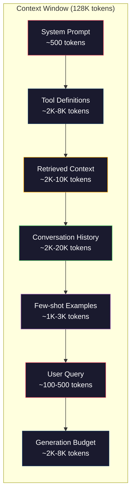
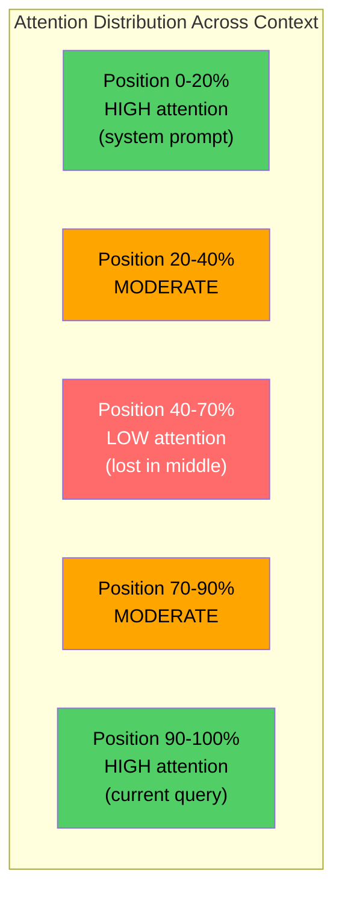
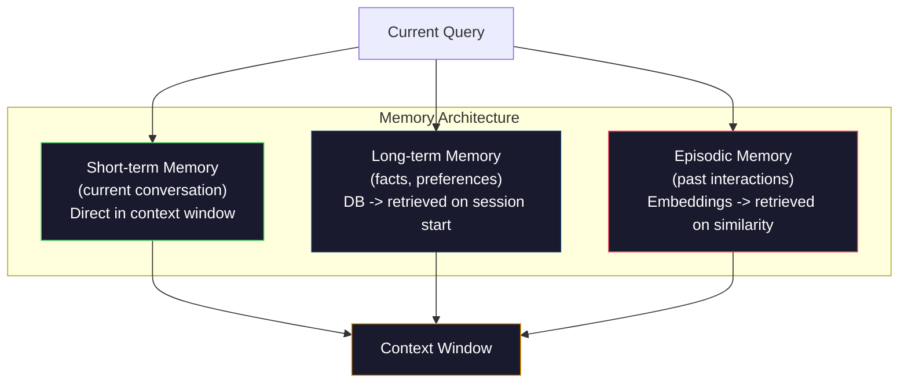

# 上下文工程：窗口、预算、记忆与检索

> 提示工程只是其中的一个子集，上下文工程才是全局博弈。提示词是你敲入的一串字符；而上下文是一切进入模型窗口的内容：系统指令、检索到的文档、工具定义、对话历史、少样本示例，以及提示词本身。2026 年最优秀的 AI 工程师都是上下文工程师。他们决定哪些内容进入窗口、哪些被排除在外，以及以何种顺序排列。

**类型：** 构建
**语言：** Python
**前置要求：** Phase 10（从零构建 LLM）、Phase 11 第 01-02 课
**所需时间：** 约90分钟
**相关：** Phase 11 · 15（提示缓存）——对缓存友好的布局是上下文工程的延伸。Phase 5 · 28（长上下文评估）讲解如何用 NIAH/RULER 衡量「中间丢失」现象。

## 学习目标

- 计算上下文窗口各组成部分的 token 预算（系统提示、工具、历史、检索文档、生成余量）
- 实现上下文窗口管理策略：截断、摘要，以及针对对话历史的滑动窗口
- 对上下文组成部分进行优先级排序和排列，以最大化模型对最相关信息的注意力
- 构建一个上下文组装器，根据查询类型和可用窗口空间动态分配 token

## 问题所在

Claude Opus 4.7 拥有 200K token 窗口（beta 版为 1M）。GPT-5 为 400K。Gemini 3 Pro 为 2M。Llama 4 号称达到 10M。这些数字听起来大得惊人，直到你把它们填满。

下面是一个编码助手的真实分解。系统提示：500 token。50 个工具的定义：8,000 token。检索到的文档：4,000 token。对话历史（10 轮）：6,000 token。当前用户查询：200 token。生成预算（最大输出）：4,000 token。总计：22,700 token。这仅占 128K 窗口的 18%。

但注意力并不会随上下文长度线性扩展。一个拥有 128K token 上下文的模型要支付二次方的注意力开销（原始 Transformer 中为 O(n^2)，尽管大多数生产模型使用高效的注意力变体）。更重要的是，检索准确率会下降。「大海捞针」（Needle in a Haystack）测试表明，模型难以找到放置在长上下文中间位置的信息。Liu 等人（2023）的研究显示，LLM 在检索长上下文开头和结尾的信息时准确率近乎完美，但对于放置在中间位置（上下文的 40-70% 处）的信息，准确率下降 10-20%。这种「中间丢失」（lost-in-the-middle）效应因模型而异，但影响所有当前架构。

实践教训是：拥有 200K token 可用并不意味着使用 200K token 是有效的。一份精心策划的 10K token 上下文往往优于一份随意堆砌的 100K token 上下文。上下文工程是一门在上下文窗口内最大化信噪比的学科。

你放入窗口的每一个 token，都会挤占一个本可以承载更相关信息的 token。每一个无关的工具定义、每一轮陈旧的对话、每一段无法回答问题的检索文本——它们都会让模型在任务上的表现稍稍变差。

## 概念说明

### 上下文窗口是一种稀缺资源

把上下文窗口想象成 RAM，而不是磁盘。它快速且可直接访问，但容量有限。你无法把所有东西都塞进去，必须做出选择。



每个组成部分都在争夺空间。添加更多工具定义意味着留给对话历史的空间更少。添加更多检索上下文意味着留给少样本示例的空间更少。上下文工程是一门分配这份预算以最大化任务表现的艺术。

### 中间丢失

这是上下文工程中最重要的实证发现。模型对上下文开头和结尾的信息关注得更好。位于中间的信息获得的注意力分数较低，更容易被忽略。

Liu 等人（2023）对此进行了系统性测试。他们将一份相关文档放置在 20 份无关文档中的不同位置，并测量回答准确率。当相关文档位于第一或最后位置时，准确率为 85-90%。当它位于中间（20 份中的第 10 份）时，准确率下降到 60-70%。

这对工程实践有直接的影响：

- 把最重要的信息放在最前面（系统提示、关键指令）
- 把当前查询和最相关的上下文放在最后面（近因偏好有帮助）
- 把上下文的中间区域视为最低优先级地带
- 如果你必须在中间包含某些信息，就在结尾处重复其关键要点



### 上下文组成部分

**系统提示**：设定角色、约束和行为规则。它放在最前面，并在各轮对话中保持不变。Claude Code 的系统提示（包括工具定义和行为指令）大约使用 6,000 token。要保持精简。系统提示中的每一个词都会在每次 API 调用时重复。

**工具定义**：每个工具增加 50-200 token（名称、描述、参数模式）。50 个工具，每个 150 token，在任何对话开始之前就达到了 7,500 token。动态工具选择——只包含与当前查询相关的工具——可以将这一数字减少 60-80%。

**检索上下文**：来自向量数据库的文档、搜索结果、文件内容。检索的质量直接决定响应的质量。糟糕的检索比没有检索更糟——它用噪声填满窗口，并主动误导模型。

**对话历史**：之前每一条用户消息和助手响应。它随对话长度线性增长。一段每轮 200 token 的 50 轮对话就是 10,000 token 的历史。其中大部分与当前查询无关。

**少样本示例**：展示期望行为的输入/输出对。两到三个精心挑选的示例，往往比数千 token 的指令更能提升输出质量。但它们要占用空间。

**生成预算**：为模型响应预留的 token。如果你把窗口填满到容量上限，模型就没有空间来回答了。至少要为生成预留 2,000-4,000 token。

### 上下文压缩策略

**历史摘要**：与其逐字保留之前所有的对话轮次，不如定期对对话进行摘要。用 100 token 的「我们讨论了 X，决定了 Y，用户想要 Z」来替换占用 2,000 token 的 10 轮对话。当历史超过某个阈值（例如 5,000 token）时运行摘要。

**相关性过滤**：根据当前查询为每份检索到的文档打分，丢弃低于阈值的文档。如果你检索了 10 个分块但只有 3 个相关，就丢弃其余 7 个。拥有 3 个高度相关的分块胜过拥有 10 个平庸的分块。

**工具裁剪**：对用户的查询意图进行分类，只包含与该意图相关的工具。一个代码问题不需要日历工具。一个排程问题不需要文件系统工具。这可以将工具定义从 8,000 token 减少到 1,000 token。

**递归摘要**：对于非常长的文档，分阶段进行摘要。先对每个章节摘要，再对这些摘要进行摘要。一份 50 页的文档变成一份 500 token 的摘要，捕捉其中的关键要点。

### 记忆系统

上下文工程跨越三个时间跨度。

**短期记忆**：当前对话。直接存储在上下文窗口中。随每一轮增长。通过摘要和截断来管理。

**长期记忆**：跨对话持久存在的事实和偏好。「用户偏好 TypeScript。」「该项目使用 PostgreSQL。」存储在数据库中，在会话开始时检索。Claude Code 将其存储在 CLAUDE.md 文件中。ChatGPT 将其存储在其记忆功能中。

**情景记忆**：可能相关的特定过往交互。「上周二，我们在 auth 模块调试过一个类似的问题。」以嵌入形式存储，当当前对话与某个过往情景匹配时检索。



### 动态上下文组装

关键洞见在于：不同的查询需要不同的上下文。静态系统提示 + 静态工具 + 静态历史是一种浪费。最优秀的系统会为每个查询动态组装上下文。

1. 对查询意图进行分类
2. 选择相关工具（而非所有工具）
3. 检索相关文档（而非固定的一组）
4. 包含相关的历史轮次（而非全部历史）
5. 添加匹配任务类型的少样本示例
6. 按重要性排列一切：关键内容放最前，重要内容放最后，可选内容放中间

这正是优秀 AI 应用与卓越 AI 应用之间的分水岭。模型是一样的。上下文才是差异所在。

## 开始构建

### 第 1 步：Token 计数器

无法度量的东西就无法做预算。构建一个简单的 token 计数器（用空白分割来近似，因为确切的计数取决于分词器）。

```python
import json
import numpy as np
from collections import OrderedDict

def count_tokens(text):
    if not text:
        return 0
    return int(len(text.split()) * 1.3)

def count_tokens_json(obj):
    return count_tokens(json.dumps(obj))
```

### 第 2 步：上下文预算管理器

核心抽象。预算管理器跟踪每个组成部分使用了多少 token，并强制执行限制。

```python
class ContextBudget:
    def __init__(self, max_tokens=128000, generation_reserve=4000):
        self.max_tokens = max_tokens
        self.generation_reserve = generation_reserve
        self.available = max_tokens - generation_reserve
        self.allocations = OrderedDict()

    def allocate(self, component, content, max_tokens=None):
        tokens = count_tokens(content)
        if max_tokens and tokens > max_tokens:
            words = content.split()
            target_words = int(max_tokens / 1.3)
            content = " ".join(words[:target_words])
            tokens = count_tokens(content)

        used = sum(self.allocations.values())
        if used + tokens > self.available:
            allowed = self.available - used
            if allowed <= 0:
                return None, 0
            words = content.split()
            target_words = int(allowed / 1.3)
            content = " ".join(words[:target_words])
            tokens = count_tokens(content)

        self.allocations[component] = tokens
        return content, tokens

    def remaining(self):
        used = sum(self.allocations.values())
        return self.available - used

    def utilization(self):
        used = sum(self.allocations.values())
        return used / self.max_tokens

    def report(self):
        total_used = sum(self.allocations.values())
        lines = []
        lines.append(f"Context Budget Report ({self.max_tokens:,} token window)")
        lines.append("-" * 50)
        for component, tokens in self.allocations.items():
            pct = tokens / self.max_tokens * 100
            bar = "#" * int(pct / 2)
            lines.append(f"  {component:<25} {tokens:>6} tokens ({pct:>5.1f}%) {bar}")
        lines.append("-" * 50)
        lines.append(f"  {'Used':<25} {total_used:>6} tokens ({total_used/self.max_tokens*100:.1f}%)")
        lines.append(f"  {'Generation reserve':<25} {self.generation_reserve:>6} tokens")
        lines.append(f"  {'Remaining':<25} {self.remaining():>6} tokens")
        return "\n".join(lines)
```

### 第 3 步：中间丢失重排序

实现重排序策略：最重要的项目放在最前和最后，最不重要的放在中间。

```python
def reorder_lost_in_middle(items, scores):
    paired = sorted(zip(scores, items), reverse=True)
    sorted_items = [item for _, item in paired]

    if len(sorted_items) <= 2:
        return sorted_items

    first_half = sorted_items[::2]
    second_half = sorted_items[1::2]
    second_half.reverse()

    return first_half + second_half

def score_relevance(query, documents):
    query_words = set(query.lower().split())
    scores = []
    for doc in documents:
        doc_words = set(doc.lower().split())
        if not query_words:
            scores.append(0.0)
            continue
        overlap = len(query_words & doc_words) / len(query_words)
        scores.append(round(overlap, 3))
    return scores
```

### 第 4 步：对话历史压缩器

对旧的对话轮次进行摘要，以回收 token 预算。

```python
class ConversationManager:
    def __init__(self, max_history_tokens=5000):
        self.turns = []
        self.summaries = []
        self.max_history_tokens = max_history_tokens

    def add_turn(self, role, content):
        self.turns.append({"role": role, "content": content})
        self._compress_if_needed()

    def _compress_if_needed(self):
        total = sum(count_tokens(t["content"]) for t in self.turns)
        if total <= self.max_history_tokens:
            return

        while total > self.max_history_tokens and len(self.turns) > 4:
            old_turns = self.turns[:2]
            summary = self._summarize_turns(old_turns)
            self.summaries.append(summary)
            self.turns = self.turns[2:]
            total = sum(count_tokens(t["content"]) for t in self.turns)

    def _summarize_turns(self, turns):
        parts = []
        for t in turns:
            content = t["content"]
            if len(content) > 100:
                content = content[:100] + "..."
            parts.append(f"{t['role']}: {content}")
        return "Previous: " + " | ".join(parts)

    def get_context(self):
        parts = []
        if self.summaries:
            parts.append("[Conversation Summary]")
            for s in self.summaries:
                parts.append(s)
        parts.append("[Recent Conversation]")
        for t in self.turns:
            parts.append(f"{t['role']}: {t['content']}")
        return "\n".join(parts)

    def token_count(self):
        return count_tokens(self.get_context())
```

### 第 5 步：动态工具选择器

只包含与当前查询相关的工具。先对意图分类，再进行过滤。

```python
TOOL_REGISTRY = {
    "read_file": {
        "description": "Read contents of a file",
        "tokens": 120,
        "categories": ["code", "files"],
    },
    "write_file": {
        "description": "Write content to a file",
        "tokens": 150,
        "categories": ["code", "files"],
    },
    "search_code": {
        "description": "Search for patterns in codebase",
        "tokens": 130,
        "categories": ["code"],
    },
    "run_command": {
        "description": "Execute a shell command",
        "tokens": 140,
        "categories": ["code", "system"],
    },
    "create_calendar_event": {
        "description": "Create a new calendar event",
        "tokens": 180,
        "categories": ["calendar"],
    },
    "list_emails": {
        "description": "List recent emails",
        "tokens": 160,
        "categories": ["email"],
    },
    "send_email": {
        "description": "Send an email message",
        "tokens": 200,
        "categories": ["email"],
    },
    "web_search": {
        "description": "Search the web for information",
        "tokens": 140,
        "categories": ["research"],
    },
    "query_database": {
        "description": "Run a SQL query on the database",
        "tokens": 170,
        "categories": ["code", "data"],
    },
    "generate_chart": {
        "description": "Generate a chart from data",
        "tokens": 190,
        "categories": ["data", "visualization"],
    },
}

def classify_intent(query):
    query_lower = query.lower()

    intent_keywords = {
        "code": ["code", "function", "bug", "error", "file", "implement", "refactor", "debug", "test"],
        "calendar": ["meeting", "schedule", "calendar", "appointment", "event"],
        "email": ["email", "mail", "send", "inbox", "message"],
        "research": ["search", "find", "what is", "how does", "explain", "look up"],
        "data": ["data", "query", "database", "chart", "graph", "analytics", "sql"],
    }

    scores = {}
    for intent, keywords in intent_keywords.items():
        score = sum(1 for kw in keywords if kw in query_lower)
        if score > 0:
            scores[intent] = score

    if not scores:
        return ["code"]

    max_score = max(scores.values())
    return [intent for intent, score in scores.items() if score >= max_score * 0.5]

def select_tools(query, token_budget=2000):
    intents = classify_intent(query)
    relevant = {}
    total_tokens = 0

    for name, tool in TOOL_REGISTRY.items():
        if any(cat in intents for cat in tool["categories"]):
            if total_tokens + tool["tokens"] <= token_budget:
                relevant[name] = tool
                total_tokens += tool["tokens"]

    return relevant, total_tokens
```

### 第 6 步：完整的上下文组装流水线

把一切串联起来。给定一个查询，动态组装最优上下文。

```python
class ContextEngine:
    def __init__(self, max_tokens=128000, generation_reserve=4000):
        self.budget = ContextBudget(max_tokens, generation_reserve)
        self.conversation = ConversationManager(max_history_tokens=5000)
        self.system_prompt = (
            "You are a helpful AI assistant. You have access to tools for "
            "code editing, file management, web search, and data analysis. "
            "Use the appropriate tools for each task. Be concise and accurate."
        )
        self.knowledge_base = [
            "Python 3.12 introduced type parameter syntax for generic classes using bracket notation.",
            "The project uses PostgreSQL 16 with pgvector for embedding storage.",
            "Authentication is handled by Supabase Auth with JWT tokens.",
            "The frontend is built with Next.js 15 using the App Router.",
            "API rate limits are set to 100 requests per minute per user.",
            "The deployment pipeline uses GitHub Actions with Docker multi-stage builds.",
            "Test coverage must be above 80% for all new modules.",
            "The codebase follows the repository pattern for data access.",
        ]

    def assemble(self, query):
        self.budget = ContextBudget(self.budget.max_tokens, self.budget.generation_reserve)

        system_content, _ = self.budget.allocate("system_prompt", self.system_prompt, max_tokens=1000)

        tools, tool_tokens = select_tools(query, token_budget=2000)
        tool_text = json.dumps(list(tools.keys()))
        tool_content, _ = self.budget.allocate("tools", tool_text, max_tokens=2000)

        relevance = score_relevance(query, self.knowledge_base)
        threshold = 0.1
        relevant_docs = [
            doc for doc, score in zip(self.knowledge_base, relevance)
            if score >= threshold
        ]

        if relevant_docs:
            doc_scores = [s for s in relevance if s >= threshold]
            reordered = reorder_lost_in_middle(relevant_docs, doc_scores)
            doc_text = "\n".join(reordered)
            doc_content, _ = self.budget.allocate("retrieved_context", doc_text, max_tokens=3000)

        history_text = self.conversation.get_context()
        if history_text.strip():
            history_content, _ = self.budget.allocate("conversation_history", history_text, max_tokens=5000)

        query_content, _ = self.budget.allocate("user_query", query, max_tokens=500)

        return self.budget

    def chat(self, query):
        self.conversation.add_turn("user", query)
        budget = self.assemble(query)
        response = f"[Response to: {query[:50]}...]"
        self.conversation.add_turn("assistant", response)
        return budget


def run_demo():
    print("=" * 60)
    print("  Context Engineering Pipeline Demo")
    print("=" * 60)

    engine = ContextEngine(max_tokens=128000, generation_reserve=4000)

    print("\n--- Query 1: Code task ---")
    budget = engine.chat("Fix the bug in the authentication module where JWT tokens expire too early")
    print(budget.report())

    print("\n--- Query 2: Research task ---")
    budget = engine.chat("What is the best approach for implementing vector search in PostgreSQL?")
    print(budget.report())

    print("\n--- Query 3: After conversation history builds up ---")
    for i in range(8):
        engine.conversation.add_turn("user", f"Follow-up question number {i+1} about the implementation details of the system")
        engine.conversation.add_turn("assistant", f"Here is the response to follow-up {i+1} with technical details about the architecture")

    budget = engine.chat("Now implement the changes we discussed")
    print(budget.report())

    print("\n--- Tool Selection Examples ---")
    test_queries = [
        "Fix the bug in auth.py",
        "Schedule a meeting with the team for Tuesday",
        "Show me the database query performance stats",
        "Search for best practices on error handling",
    ]

    for q in test_queries:
        tools, tokens = select_tools(q)
        intents = classify_intent(q)
        print(f"\n  Query: {q}")
        print(f"  Intents: {intents}")
        print(f"  Tools: {list(tools.keys())} ({tokens} tokens)")

    print("\n--- Lost-in-the-Middle Reordering ---")
    docs = ["Doc A (most relevant)", "Doc B (somewhat relevant)", "Doc C (least relevant)",
            "Doc D (relevant)", "Doc E (moderately relevant)"]
    scores = [0.95, 0.60, 0.20, 0.80, 0.50]
    reordered = reorder_lost_in_middle(docs, scores)
    print(f"  Original order: {docs}")
    print(f"  Scores:         {scores}")
    print(f"  Reordered:      {reordered}")
    print(f"  (Most relevant at start and end, least relevant in middle)")
```

## 实际使用

### Claude Code 的上下文策略

Claude Code 以分层方式管理上下文。系统提示包含行为规则和工具定义（约 6K token）。当你打开一个文件时，其内容会作为上下文注入。当你搜索时，结果会被添加进来。旧的对话轮次会被摘要。CLAUDE.md 提供跨会话持久存在的长期记忆。

关键的工程决策在于：Claude Code 不会把你的整个代码库都倾倒进上下文。它会按需检索相关文件。这就是上下文工程的实践。

### Cursor 的动态上下文加载

Cursor 将你的整个代码库索引为嵌入。当你输入查询时，它使用向量相似度检索最相关的文件和代码块。只有这些片段会进入上下文窗口。一个 50 万行的代码库被压缩成最相关的 5-10 个代码块。

这就是那个模式：嵌入一切，按需检索，只包含真正重要的内容。

### ChatGPT 记忆

ChatGPT 将用户偏好和事实存储为长期记忆。每次对话开始时，相关记忆会被检索并包含在系统提示中。「用户偏好 Python」只花费 5 token，却能在跨对话中省下数百 token 的重复指令。

### RAG 作为上下文工程

检索增强生成（Retrieval-Augmented Generation）是上下文工程的形式化。与其把知识塞进模型权重（训练）或系统提示（静态上下文），你在查询时检索相关文档，并将它们注入上下文窗口。整个 RAG 流水线——分块、嵌入、检索、重排序——存在的意义只是为了解决一个问题：把正确的信息放进上下文窗口。

## 交付成果

本课产出 `outputs/prompt-context-optimizer.md`——一个可复用的提示词，用于审计上下文组装策略并推荐优化方案。把你的系统提示、工具数量、平均历史长度和检索策略喂给它，它会识别出 token 浪费并给出改进建议。

它还产出 `outputs/skill-context-engineering.md`——一个决策框架，用于根据任务类型、上下文窗口大小和延迟预算来设计上下文组装流水线。

## 练习

1. 为 ContextBudget 类添加一个「token 浪费检测器」。它应当标记出占用预算超过 30% 的组成部分，并针对每种组成部分类型建议具体的压缩策略（摘要历史、裁剪工具、对文档重排序）。

2. 为检索上下文实现语义去重。如果两份检索到的文档相似度超过 80%（按词重叠或其嵌入的余弦相似度衡量），只保留得分较高的那一份。度量这能回收多少 token 预算。

3. 构建一个「上下文回放」工具。给定一段对话记录，将其通过 ContextEngine 回放，并可视化预算分配如何逐轮变化。绘制各组成部分随时间变化的 token 用量。找出上下文开始被压缩的那一轮。

4. 实现一个基于优先级的工具选择器。不要采用二元的包含/排除，而是为每个工具相对当前查询分配一个相关性分数。按相关性降序包含工具，直到工具预算耗尽。比较包含 5、10、20 和 50 个工具时的任务表现。

5. 构建一个多策略上下文压缩器。实现三种压缩策略（截断、摘要、关键句提取），并在一组 20 份文档上对它们进行基准测试。度量压缩率与信息保留之间的权衡（压缩后的版本是否仍然包含查询的答案？）。

## 关键术语

| 术语 | 人们的说法 | 实际含义 |
|------|----------------|----------------------|
| 上下文窗口 | 「模型能读多少」 | 模型在单次前向传播中处理的最大 token 数（输入 + 输出）——GPT-5 为 400K，Claude Opus 4.7 为 200K（beta 版 1M），Gemini 3 Pro 为 2M |
| 上下文工程 | 「高级提示工程」 | 决定哪些内容进入上下文窗口、以何种顺序、按何种优先级的学科——涵盖检索、压缩、工具选择和记忆管理 |
| 中间丢失 | 「模型会忘掉中间的东西」 | 一项实证发现，即 LLM 对上下文开头和结尾的关注更好，对放置在中间的信息准确率下降 10-20% |
| Token 预算 | 「你还剩多少 token」 | 对上下文窗口容量在各组成部分（系统提示、工具、历史、检索、生成）之间的显式分配，并设有每个组成部分的限额 |
| 动态上下文 | 「即时加载内容」 | 基于意图分类、相关工具选择和检索结果，为每个查询以不同方式组装上下文窗口 |
| 历史摘要 | 「压缩对话」 | 用一份简洁的摘要替换逐字的旧对话轮次，在保留关键信息的同时降低 token 成本 |
| 工具裁剪 | 「只包含相关工具」 | 对查询意图进行分类，只包含匹配的工具定义，将工具 token 成本减少 60-80% |
| 长期记忆 | 「跨会话记住」 | 存储在数据库中并在会话开始时检索的事实和偏好——CLAUDE.md、ChatGPT 记忆及类似系统 |
| 情景记忆 | 「记住特定的过往事件」 | 以嵌入形式存储的过往交互，当当前查询与某个过往对话相似时检索 |
| 生成预算 | 「留给答案的空间」 | 为模型输出预留的 token——如果上下文完全填满窗口，模型就没有空间来响应 |

## 延伸阅读

- [Liu et al., 2023 ——「Lost in the Middle: How Language Models Use Long Contexts」](https://arxiv.org/abs/2307.03172)——关于位置相关注意力的权威研究，表明模型难以处理长上下文中间的信息
- [Anthropic 的上下文检索博客文章](https://www.anthropic.com/news/contextual-retrieval)——Anthropic 如何处理上下文感知的分块检索，将检索失败率降低 49%
- [Simon Willison 的「Context Engineering」](https://simonwillison.net/2025/Jun/27/context-engineering/)——为这门学科命名并将其与提示工程区分开来的博客文章
- [LangChain 关于 RAG 的文档](https://python.langchain.com/docs/tutorials/rag/)——作为一种上下文工程模式的检索增强生成的实际实现
- [Greg Kamradt 的大海捞针测试](https://github.com/gkamradt/LLMTest_NeedleInAHaystack)——揭示了所有主流模型中位置相关检索失败的基准测试
- [Pope et al.,「Efficiently Scaling Transformer Inference」(2022)](https://arxiv.org/abs/2211.05102)——为什么上下文长度驱动内存和延迟，以及 KV cache、MQA 和 GQA 如何改变预算计算。
- [Agrawal et al.,「SARATHI: Efficient LLM Inference by Piggybacking Decodes with Chunked Prefills」(2023)](https://arxiv.org/abs/2308.16369)——推理的两个阶段使得长提示在 TTFT 上昂贵但在 TPOT 上廉价；上下文打包权衡背后的事实依据。
- [Ainslie et al.,「GQA: Training Generalized Multi-Query Transformer Models from Multi-Head Checkpoints」(EMNLP 2023)](https://arxiv.org/abs/2305.13245)——分组查询注意力论文，在不损失质量的前提下将生产解码器的 KV 内存削减 8 倍。
