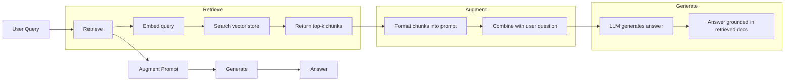
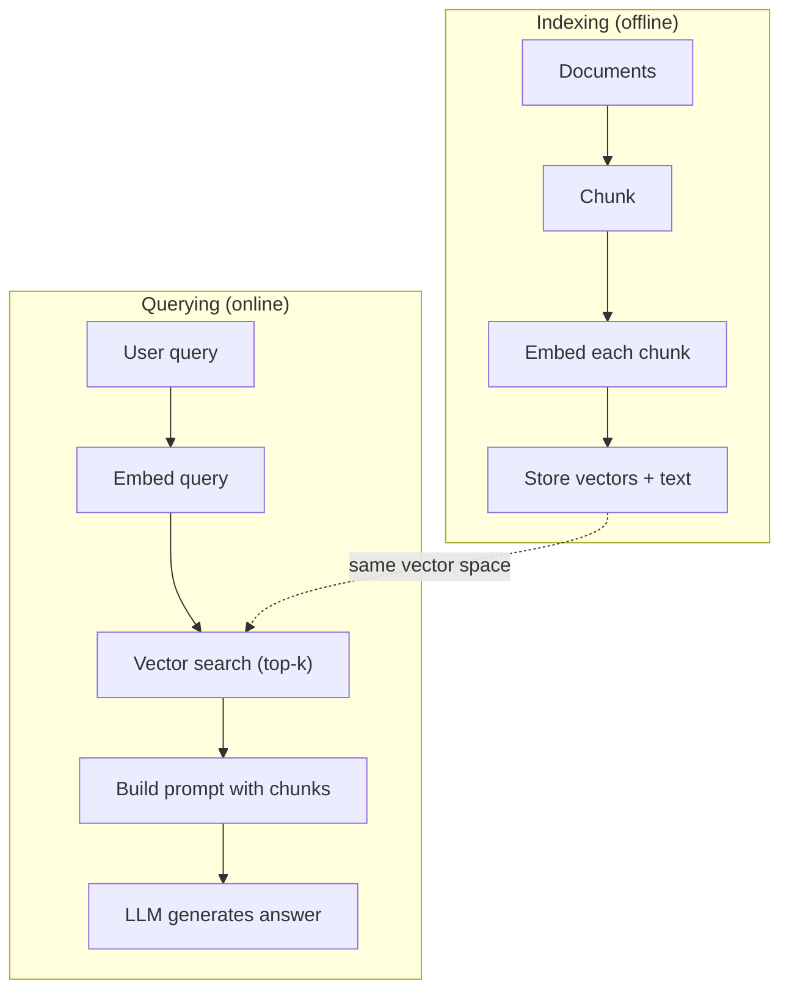

# RAG（检索增强生成）

> 你的 LLM 通晓其训练截止日期之前的一切。但它对你公司的文档、你的代码库或上周的会议记录一无所知。RAG 通过检索相关文档并将其塞进提示词来解决这个问题。它是生产 AI 中部署最广泛的模式。如果你在本课程中只动手构建一样东西，那就构建一条 RAG 流水线。

**类型：** 构建
**语言：** Python
**前置要求：** Phase 10（从零构建 LLM）、Phase 11 第 01-05 课
**所需时间：** 约90分钟
**相关：** Phase 5 · 23（RAG 的分块策略）讲解六种分块算法及各自的适用场景。Phase 5 · 22（嵌入模型深入剖析）讲解如何挑选嵌入器。Phase 11 · 07（高级 RAG）讲解混合检索、重排序和查询变换。

## 学习目标

- 构建一条完整的 RAG 流水线：文档加载、分块、嵌入、向量存储、检索和生成
- 使用向量数据库（ChromaDB、FAISS 或 Pinecone）并配以适当的索引来实现语义检索
- 解释为什么在知识接地的应用中 RAG 优于微调（成本、时效性、可溯源性）
- 使用检索指标（精确率、召回率）和生成指标（忠实度、相关性）评估 RAG 质量

## 问题所在

你为公司构建一个聊天机器人。一位客户问「企业版套餐的退款政策是什么？」LLM 给出了一个关于典型 SaaS 退款政策的泛泛回答。而真实的政策埋藏在一份 200 页的内部 wiki 中，写明企业客户享有 60 天窗口期并按比例退款。LLM 从未见过这份文档。它无法知道自己未曾被训练过的东西。

微调是一种解决方案。拿来 LLM，用你的内部文档训练它，然后部署更新后的模型。这种方法可行，但有严重的问题。微调要花费数千美元的算力。文档一旦改变，模型立刻就过时了。你无法知道模型借鉴了哪个来源。而且如果公司下个月收购了另一条产品线，你又得重新微调一遍。

RAG 是另一种解决方案。保持模型原封不动。当一个问题进来时，在你的文档库中搜索相关段落，把它们粘贴到问题之前的提示词中，让模型把这些段落当作上下文来作答。文档库可以在几分钟内更新。你可以确切地看到检索到了哪些文档。模型本身从不改变。这就是为什么 RAG 是生产中的主导模式：它更便宜、更新鲜、更可审计，并且适用于任何 LLM。

## 概念说明

### RAG 模式

整个模式可归结为四个步骤：



查询 -> 检索 -> 增强提示词 -> 生成。每个 RAG 系统都遵循这一模式。生产级 RAG 系统之间的差异在于每一步的细节：你如何分块、如何嵌入、如何检索，以及如何构造提示词。

### 为什么 RAG 胜过微调

| 关注点 | 微调 | RAG |
|---------|------------|-----|
| 成本 | 每次训练运行 1,000-100,000+ 美元 | 每次查询 0.01-0.10 美元（嵌入 + LLM） |
| 时效性 | 重新训练前都是陈旧的 | 通过重新索引文档在几分钟内更新 |
| 可审计性 | 无法将答案追溯到来源 | 可以展示确切的检索段落 |
| 幻觉 | 仍然会随意产生幻觉 | 接地于检索到的文档 |
| 数据隐私 | 训练数据被烘焙进权重 | 文档留在你的向量库中 |

微调永久性地改变模型的权重。RAG 临时性地改变模型的上下文。对大多数应用而言，临时上下文正是你想要的。

微调胜出的唯一场景是：当你需要模型采用某种特定的风格、语气或推理模式，而这无法仅通过提示词来实现时。对于事实性知识检索，RAG 每次都胜出。

### 嵌入模型

嵌入模型将文本转换为一个稠密向量。相似的文本会产生在这个高维空间中彼此靠近的向量。「How do I reset my password?」和「I need to change my password」尽管共享的词很少，却会产生几乎相同的向量。「The cat sat on the mat」则产生一个非常不同的向量。

常见的嵌入模型（2026 年阵容——完整分析见 Phase 5 · 22）：

| 模型 | 维度 | 提供方 | 备注 |
|-------|-----------|----------|-------|
| text-embedding-3-small | 1536（Matryoshka） | OpenAI | 对大多数用例而言性价比最佳 |
| text-embedding-3-large | 3072（Matryoshka） | OpenAI | 准确率更高，可截断为 256/512/1024 |
| Gemini Embedding 2 | 3072（Matryoshka） | Google | MTEB 检索榜首；8K 上下文 |
| voyage-4 | 1024/2048（Matryoshka） | Voyage AI | 领域变体（代码、金融、法律） |
| Cohere embed-v4 | 1024（Matryoshka） | Cohere | 多语言能力强，128K 上下文 |
| BGE-M3 | 1024（dense + sparse + ColBERT） | BAAI（开放权重） | 一个模型提供三种视图 |
| Qwen3-Embedding | 4096（Matryoshka） | 阿里巴巴（开放权重） | 开放权重检索得分最高 |
| all-MiniLM-L6-v2 | 384 | 开放权重（Sentence Transformers） | 原型开发基线 |

在本课中，我们使用 TF-IDF 构建自己的简单嵌入。这并不是因为 TF-IDF 是生产系统所用的方法，而是因为它能让概念变得具体：文本进去，向量出来，相似的文本产生相似的向量。

### 向量相似度

给定两个向量，如何度量相似度？有三个选项：

**余弦相似度**：两个向量之间夹角的余弦值。范围从 -1（相反）到 1（相同）。忽略大小，只关心方向。这是 RAG 的默认选择。

```
cosine_sim(a, b) = dot(a, b) / (||a|| * ||b||)
```

**点积**：原始内积。更大的向量会得到更高的分数。当大小承载信息时很有用（更长的文档可能更相关）。

```
dot(a, b) = sum(a_i * b_i)
```

**L2（欧几里得）距离**：向量空间中的直线距离。距离越小 = 越相似。对大小差异敏感。

```
L2(a, b) = sqrt(sum((a_i - b_i)^2))
```

余弦相似度是标准做法。它能优雅地处理不同长度的文档，因为它会按大小归一化。当有人说「向量检索」时，几乎总是指余弦相似度。

### 分块策略

文档太长，无法作为单个向量来嵌入。一份 50 页的 PDF 可能会产生一个糟糕的嵌入，因为它包含数十个主题。相反，你应将文档拆分成多个分块，并分别嵌入每个分块。

**固定大小分块**：每 N 个 token 拆分一次。简单且可预测。一个带 50 token 重叠的 512 token 分块意味着分块 1 是 token 0-511，分块 2 是 token 462-973，依此类推。重叠确保你不会在不巧的边界处把一句话切断。

**语义分块**：在自然边界处拆分。段落、章节或 markdown 标题。每个分块都是一个连贯的意义单元。实现起来更复杂，但能带来更好的检索效果。

**递归分块**：先尝试在最大的边界处拆分（章节标题）。如果某个章节仍然太大，就在段落边界处拆分。如果某个段落仍然太大，就在句子边界处拆分。这是 LangChain 的 RecursiveCharacterTextSplitter 方法，在实践中效果很好。

分块大小比人们想象的更重要：

- 太小（64-128 token）：每个分块缺乏上下文。「它上季度增长了 15%」在不知道「它」指代什么时毫无意义。
- 太大（2048+ token）：每个分块涵盖多个主题，稀释了相关性。当你搜索营收数据时，得到的分块 10% 是关于营收、90% 是关于人员编制。
- 最佳区间（256-512 token）：足以自成一体的上下文，又足够聚焦以保持相关。

大多数生产级 RAG 系统使用带 50 token 重叠的 256-512 token 分块。Anthropic 的 RAG 指南推荐这一区间。

### 向量数据库

一旦有了嵌入，你就需要某个地方来存储和检索它们。可选项：

| 数据库 | 类型 | 最适合 |
|----------|------|----------|
| FAISS | 库（进程内） | 原型开发、中小型数据集 |
| Chroma | 轻量级数据库 | 本地开发、小型部署 |
| Pinecone | 托管服务 | 无运维开销的生产环境 |
| Weaviate | 开源数据库 | 自托管生产环境 |
| pgvector | Postgres 扩展 | 已经在使用 Postgres |
| Qdrant | 开源数据库 | 高性能自托管 |

在本课中，我们构建一个简单的内存向量库。它将向量存储在一个列表中，并执行暴力的余弦相似度检索。这等价于使用扁平索引的 FAISS。它在变慢之前大约能扩展到 100,000 个向量。生产系统使用近似最近邻（ANN）算法，例如 HNSW，可在毫秒级检索数百万个向量。

### 完整流水线



索引阶段每份文档运行一次（或在文档更新时运行）。查询阶段在每次用户请求时运行。在生产中，索引可能需要数小时来处理数百万份文档。查询则必须在一秒内响应。

### 真实数字

大多数生产级 RAG 系统使用这些参数：

- **k = 5 到 10** 每次查询检索的分块数
- **分块大小 = 256 到 512 token**，带 50 token 重叠
- **上下文预算**：每次查询 2,500-5,000 token 的检索内容
- **总提示词**：约 8,000-16,000 token（系统提示 + 检索分块 + 对话历史 + 用户查询）
- **嵌入维度**：384-3072，取决于模型
- **索引吞吐量**：使用 API 嵌入时每秒 100-1,000 份文档
- **查询延迟**：检索 50-200ms，生成 500-3000ms

```figure
rag-chunking
```

## 开始构建

### 第 1 步：文档分块

```python
def chunk_text(text, chunk_size=200, overlap=50):
    words = text.split()
    chunks = []
    start = 0
    while start < len(words):
        end = start + chunk_size
        chunk = " ".join(words[start:end])
        chunks.append(chunk)
        start += chunk_size - overlap
    return chunks
```

### 第 2 步：TF-IDF 嵌入

我们构建一个简单的嵌入函数。TF-IDF（词频-逆文档频率，Term Frequency-Inverse Document Frequency）不是神经嵌入，但它以一种捕捉词重要性的方式将文本转换为向量。文档中的高频词获得更高的 TF。在整个语料库中罕见的词获得更高的 IDF。两者的乘积给出一个向量，其中重要而有辨识度的词具有高值。

```python
import math
from collections import Counter

def build_vocabulary(documents):
    vocab = set()
    for doc in documents:
        vocab.update(doc.lower().split())
    return sorted(vocab)

def compute_tf(text, vocab):
    words = text.lower().split()
    count = Counter(words)
    total = len(words)
    return [count.get(word, 0) / total for word in vocab]

def compute_idf(documents, vocab):
    n = len(documents)
    idf = []
    for word in vocab:
        doc_count = sum(1 for doc in documents if word in doc.lower().split())
        idf.append(math.log((n + 1) / (doc_count + 1)) + 1)
    return idf

def tfidf_embed(text, vocab, idf):
    tf = compute_tf(text, vocab)
    return [t * i for t, i in zip(tf, idf)]
```

### 第 3 步：余弦相似度检索

```python
def cosine_similarity(a, b):
    dot = sum(x * y for x, y in zip(a, b))
    norm_a = math.sqrt(sum(x * x for x in a))
    norm_b = math.sqrt(sum(x * x for x in b))
    if norm_a == 0 or norm_b == 0:
        return 0.0
    return dot / (norm_a * norm_b)

def search(query_embedding, stored_embeddings, top_k=5):
    scores = []
    for i, emb in enumerate(stored_embeddings):
        sim = cosine_similarity(query_embedding, emb)
        scores.append((i, sim))
    scores.sort(key=lambda x: x[1], reverse=True)
    return scores[:top_k]
```

### 第 4 步：提示词构造

这就是 RAG 中「增强」（augmented）发生的地方。拿来检索到的分块，把它们格式化成提示词，并要求 LLM 基于所提供的上下文来作答。

```python
def build_rag_prompt(query, retrieved_chunks):
    context = "\n\n---\n\n".join(
        f"[Source {i+1}]\n{chunk}"
        for i, chunk in enumerate(retrieved_chunks)
    )
    return f"""Answer the question based ONLY on the following context.
If the context doesn't contain enough information, say "I don't have enough information to answer that."

Context:
{context}

Question: {query}

Answer:"""
```

### 第 5 步：完整的 RAG 流水线

```python
class RAGPipeline:
    def __init__(self):
        self.chunks = []
        self.embeddings = []
        self.vocab = []
        self.idf = []

    def index(self, documents):
        all_chunks = []
        for doc in documents:
            all_chunks.extend(chunk_text(doc))
        self.chunks = all_chunks
        self.vocab = build_vocabulary(all_chunks)
        self.idf = compute_idf(all_chunks, self.vocab)
        self.embeddings = [
            tfidf_embed(chunk, self.vocab, self.idf)
            for chunk in all_chunks
        ]

    def query(self, question, top_k=5):
        query_emb = tfidf_embed(question, self.vocab, self.idf)
        results = search(query_emb, self.embeddings, top_k)
        retrieved = [(self.chunks[i], score) for i, score in results]
        prompt = build_rag_prompt(
            question, [chunk for chunk, _ in retrieved]
        )
        return prompt, retrieved
```

### 第 6 步：生成（模拟）

在生产中，这就是你调用 LLM API 的地方。在本课中，我们通过从检索到的上下文中提取最相关的句子来模拟生成。

```python
def simple_generate(prompt, retrieved_chunks):
    query_words = set(prompt.lower().split("question:")[-1].split())
    best_sentence = ""
    best_score = 0
    for chunk in retrieved_chunks:
        for sentence in chunk.split("."):
            sentence = sentence.strip()
            if not sentence:
                continue
            words = set(sentence.lower().split())
            overlap = len(query_words & words)
            if overlap > best_score:
                best_score = overlap
                best_sentence = sentence
    return best_sentence if best_sentence else "I don't have enough information."
```

## 实际使用

换上真实的嵌入模型和 LLM，代码几乎没有变化：

```python
from openai import OpenAI

client = OpenAI()

def embed(text):
    response = client.embeddings.create(
        model="text-embedding-3-small",
        input=text
    )
    return response.data[0].embedding

def generate(prompt):
    response = client.chat.completions.create(
        model="gpt-4o-mini",
        messages=[{"role": "user", "content": prompt}],
        temperature=0
    )
    return response.choices[0].message.content
```

或者使用 Anthropic：

```python
import anthropic

client = anthropic.Anthropic()

def generate(prompt):
    response = client.messages.create(
        model="claude-sonnet-4-20250514",
        max_tokens=1024,
        messages=[{"role": "user", "content": prompt}]
    )
    return response.content[0].text
```

流水线是一样的。换掉嵌入函数，换掉生成函数。检索逻辑、分块、提示词构造——无论你使用哪些模型，全都完全相同。

对于大规模的向量存储，用一个真正的向量数据库替换暴力检索：

```python
import chromadb

client = chromadb.Client()
collection = client.create_collection("my_docs")

collection.add(
    documents=chunks,
    ids=[f"chunk_{i}" for i in range(len(chunks))]
)

results = collection.query(
    query_texts=["What is the refund policy?"],
    n_results=5
)
```

Chroma 在内部处理嵌入（它默认使用 all-MiniLM-L6-v2）并将向量存储在本地数据库中。模式相同，只是管道不同。

## 交付成果

本课产出：
- `outputs/prompt-rag-architect.md`——一个用于为特定用例设计 RAG 系统的提示词
- `outputs/skill-rag-pipeline.md`——一项技能，教会智能体如何构建和调试 RAG 流水线

## 练习

1. 用一种简单的词袋方法（二元：词出现为 1，不出现为 0）替换 TF-IDF 嵌入。在样本文档上比较检索质量。TF-IDF 应当表现更优，因为它为罕见词赋予更高的权重。

2. 试验不同的分块大小：在同一组文档上尝试 50、100、200 和 500 个词。对每种大小，运行同样的 5 个查询，并统计有多少个查询在前 3 个结果中返回了相关分块。找到检索质量达到峰值的最佳点。

3. 为每个分块添加元数据（来源文档名称、分块位置）。修改提示词模板以包含来源归属，使 LLM 引用其来源。

4. 实现一个简单的评估：给定 10 个问答对，将每个问题通过 RAG 流水线运行，并度量检索到的分块中包含答案的百分比。这就是 k 处的检索召回率。

5. 构建一条对话感知的 RAG 流水线：维护最近 3 次交流的历史，并将它们连同检索到的分块一起包含在提示词中。在询问定价之后，用「那企业版呢？」之类的追问进行测试。

## 关键术语

| 术语 | 人们的说法 | 实际含义 |
|------|----------------|----------------------|
| RAG | 「会读你文档的 AI」 | 检索相关文档，把它们粘贴到提示词中，并生成一个接地于这些文档的答案 |
| 嵌入 | 「把文本转成数字」 | 文本的稠密向量表示，相似的含义产生相似的向量 |
| 向量数据库 | 「AI 的搜索引擎」 | 一种为存储向量并按相似度查找最近邻而优化的数据存储 |
| 分块 | 「把文档切成小块」 | 将文档拆分成更小的片段（通常 256-512 token），以便每一块都能被独立嵌入和检索 |
| 余弦相似度 | 「两个向量有多相似」 | 两个向量之间夹角的余弦值；1 = 方向相同，0 = 正交，-1 = 相反 |
| Top-k 检索 | 「取出最佳的 k 个匹配」 | 从向量库中返回与查询最相似的 k 个分块 |
| 上下文窗口 | 「LLM 能看到多少文本」 | LLM 在单次请求中能处理的最大 token 数；检索到的分块必须容纳于其中 |
| 增强生成 | 「用给定上下文作答」 | 使用检索到的文档作为上下文来生成响应，而非仅依赖训练得来的知识 |
| TF-IDF | 「词重要性评分」 | 词频乘以逆文档频率；按词在语料库中的辨识度对其加权 |
| 索引 | 「为检索准备文档」 | 对文档进行分块、嵌入和存储的离线过程，以便它们能在查询时被检索 |

## 延伸阅读

- Lewis et al.,「Retrieval-Augmented Generation for Knowledge-Intensive NLP Tasks」(2020)——来自 Facebook AI Research 的原始 RAG 论文，将「先检索后生成」的模式形式化
- Anthropic 的 RAG 文档（docs.anthropic.com）——关于分块大小、提示词构造和评估的实用指南
- Pinecone Learning Center,「What is RAG?」——对 RAG 流水线的清晰可视化讲解，并包含生产环境的考量
- Sentence-BERT: Reimers & Gurevych (2019)——all-MiniLM 嵌入模型背后的论文，展示如何为语义相似度训练双编码器
- [Karpukhin et al.,「Dense Passage Retrieval for Open-Domain Question Answering」(EMNLP 2020)](https://arxiv.org/abs/2004.04906)——DPR 论文，证明了稠密双编码器检索在开放域问答上胜过 BM25，并为现代 RAG 检索器奠定了模式。
- [LlamaIndex High-Level Concepts](https://docs.llamaindex.ai/en/stable/getting_started/concepts.html)——构建 RAG 流水线时需要了解的主要概念：数据加载器、节点解析器、索引、检索器、响应合成器。
- [LangChain RAG 教程](https://python.langchain.com/docs/tutorials/rag/)——风格相反的编排器；以可运行链（chain-of-runnables）视角看待同样的「先检索后生成」模式。
