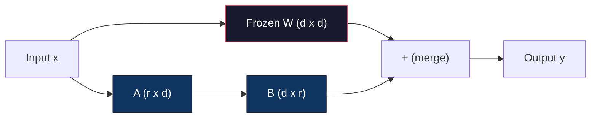
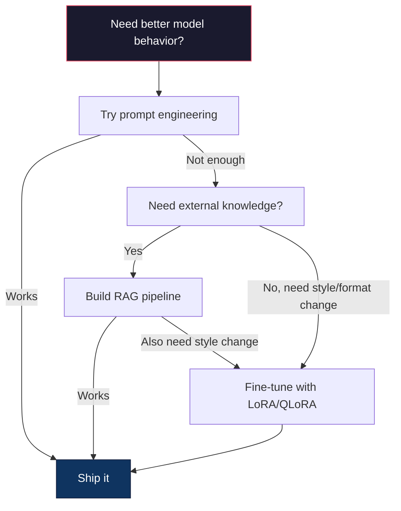

# 使用 LoRA 与 QLoRA 进行微调

> 全量微调一个 7B 模型需要 56GB 显存。你没有那么多显存，大多数公司也没有。LoRA 让你能在 6GB 显存内微调同一个模型，方法是只训练不到 1% 的参数。这不是一种妥协——在大多数任务上，它能达到与全量微调相当的质量。整个开源微调生态系统都建立在这一个技巧之上。

**类型：** 构建
**语言：** Python
**前置要求：** 第 10 阶段，第 06 课（指令微调 / SFT）
**所需时间：** 约 75 分钟
**相关：** 第 10 阶段从零讲解 SFT/DPO 循环。本课把这些循环接入 2026 年的 PEFT 工具包（PEFT、TRL、Unsloth、Axolotl、LLaMA-Factory）。

## 学习目标

- 通过把低秩适配矩阵（A 和 B）注入预训练模型的注意力层来实现 LoRA
- 计算 LoRA 相对于全量微调节省的参数量：在 d_model 维度下，秩为 r 的 LoRA 训练的是 2*r*d 个参数，而非 d^2 个
- 使用 QLoRA（4-bit 量化基座 + LoRA 适配器）微调模型，使其能装入消费级 GPU 内存
- 把 LoRA 权重合并回基座模型以用于部署，并比较带与不带适配器时的推理速度

## 问题所在

你有一个基座模型，Llama 3 8B。你想让它用你公司的口吻来回答客户支持工单。SFT 就是答案。但 SFT 有一个成本问题。

全量微调会更新模型中的每一个参数。Llama 3 8B 有 80 亿个参数。在 fp16 下，每个参数占 2 字节。仅加载权重就要 16GB。在训练期间，你还需要梯度（16GB）、Adam 的优化器状态（动量 + 方差共 32GB）以及激活值。总计：单个 8B 模型大约需要 56GB 显存。

一块 A100 80GB 勉强能装下这些。两块 A100 在云服务商处每小时要 3 到 4 美元。在 5 万个样本上训练 3 个 epoch 需要 6 到 10 小时。每次实验就是 30 到 40 美元。跑 10 次实验把超参数调对，你在部署任何东西之前就花掉了 400 美元。

把这放大到 Llama 3 70B，数字就变得荒谬了。仅权重就要 140GB。你需要一个集群。每次实验 100 美元以上。

还有一个更深层的问题。全量微调会修改模型中的每一个权重。如果你在客户支持数据上微调，可能会损害模型的通用能力。这叫作灾难性遗忘。模型在你的任务上变好了，在其他一切上变差了。

你需要一种方法：训练更少的参数，使用更少的内存，并且不破坏模型已有的知识。

## 概念说明

### LoRA：低秩适配

Edward Hu 及其在 Microsoft 的同事于 2021 年 6 月发表了 LoRA。论文的洞见是：微调期间的权重更新具有较低的内在秩。你不需要更新一个 4096x4096 权重矩阵中全部 1670 万个参数。该更新中的有用信息可以用一个秩为 16 或 32 的矩阵来捕捉。

下面是数学原理。一个标准的线性层计算的是：

```
y = Wx
```

其中 W 是一个 d_out x d_in 的矩阵。对于一个 4096x4096 的注意力投影，那就是 16,777,216 个参数。

LoRA 冻结 W 并加上一个低秩分解：

```
y = Wx + BAx
```

其中 B 是 (d_out x r)，A 是 (r x d_in)。秩 r 远小于 d——通常为 8、16 或 32。

对于一个 4096x4096 的层，取 r=16：
- 原始参数：4096 x 4096 = 16,777,216
- LoRA 参数：(4096 x 16) + (16 x 4096) = 65,536 + 65,536 = 131,072
- 缩减比例：131,072 / 16,777,216 = 0.78%

你训练的是 0.78% 的参数，却获得了 95% 到 100% 的质量。



A 用随机高斯分布初始化。B 初始化为零。这意味着 LoRA 的贡献从零开始——模型从其原始行为开始训练，并逐渐学习这种适配。

### 缩放因子：Alpha

LoRA 引入了一个缩放因子 alpha，用于控制低秩更新对输出的影响程度：

```
y = Wx + (alpha / r) * BAx
```

当 alpha = r 时，缩放为 1 倍。当 alpha = 2r（常见的默认值）时，缩放为 2 倍。这个超参数独立于基座学习率，单独控制 LoRA 路径的学习率。

实用指导：
- alpha = 2 * rank 是常见的社区惯例（原论文在大多数实验中使用 alpha = rank）
- alpha = rank 给出 1 倍缩放，保守但稳定
- 更高的 alpha 意味着每一步的更新更大，这可能加速收敛，也可能导致不稳定

### 在何处应用 LoRA

一个 Transformer 有许多线性层。你不需要给它们全部都加上 LoRA。原论文测试了不同的组合：

| 目标层 | 可训练参数（7B） | 质量 |
|--------------|----------------------|---------|
| 仅 q_proj | 4.7M | 良好 |
| q_proj + v_proj | 9.4M | 更好 |
| q_proj + k_proj + v_proj + o_proj | 18.9M | 注意力层的最佳选择 |
| 全部线性层（注意力 + MLP） | 37.7M | 收益微弱，参数翻倍 |

大多数任务的甜点区：q_proj + v_proj。这针对自注意力中的查询和值投影，它们控制着模型关注什么以及提取什么信息。加入 MLP 层对代码生成等复杂任务有帮助，但会让参数量翻倍，而在较简单的任务上收益递减。

### 秩的选择

秩 r 控制适配的表达能力：

| 秩 | 可训练参数（每层） | 最适合 |
|------|---------------------------|----------|
| 4 | 32,768 | 简单分类、情感分析 |
| 8 | 65,536 | 单领域问答、摘要 |
| 16 | 131,072 | 多领域任务、指令遵循 |
| 32 | 262,144 | 复杂推理、代码生成 |
| 64 | 524,288 | 对大多数任务收益递减 |
| 128 | 1,048,576 | 很少有合理理由使用 |

Hu et al. 表明，对于简单任务，r=4 就已经能捕捉大部分适配。r=8 和 r=16 是实践中最常见的选择。超过 r=64 很少能提升质量，而且开始失去 LoRA 在内存上的优势。

### QLoRA：4-bit 量化 + LoRA

Tim Dettmers 及其在华盛顿大学的同事于 2023 年 5 月发表了 QLoRA。其思路是：把冻结的基座模型量化到 4-bit 精度，然后在其上附加 fp16 的 LoRA 适配器。

这大幅改变了内存方程：

| 方法 | 权重内存（7B） | 训练内存（7B） | 所需 GPU |
|--------|-------------------|---------------------|-------------|
| 全量微调（fp16） | 14GB | 约 56GB | 1x A100 80GB |
| LoRA（fp16 基座） | 14GB | 约 18GB | 1x A100 40GB |
| QLoRA（4-bit 基座） | 3.5GB | 约 6GB | 1x RTX 3090 24GB |

QLoRA 做出了三项技术贡献：

**NF4（Normal Float 4-bit）**：一种专为神经网络权重设计的新数据类型。神经网络权重大致服从正态分布。NF4 把它的 16 个量化级别放在标准正态分布的分位点上。对于服从正态分布的数据，这在信息论意义上是最优的。它比均匀的 4-bit 量化（INT4）或标准的 Float4 损失更少的信息。

**双重量化**：量化常数本身也占用内存。每个 64 个权重的块需要一个 fp32 的缩放因子（4 字节）。对于一个 7B 模型，那就是额外的 0.4GB。双重量化把这些常数量化到 fp8，把开销减少到 0.1GB。虽小，但积少成多。

**分页优化器**：在训练期间，优化器状态（Adam 的动量和方差）在长序列上可能超出 GPU 内存。分页优化器利用 NVIDIA 的统一内存，在 GPU 内存耗尽时自动把优化器状态分页到 CPU 内存，并在需要时再分页回来。这能防止 OOM 崩溃，代价是损失一些吞吐量。

### 质量问题

减少参数或量化基座会损害质量吗？多篇论文的结果如下：

| 方法 | MMLU (5-shot) | MT-Bench | HumanEval |
|--------|--------------|----------|-----------|
| 全量微调（Llama 2 7B） | 48.3 | 6.72 | 14.6 |
| LoRA r=16 | 47.9 | 6.68 | 14.0 |
| QLoRA r=16 (NF4) | 47.5 | 6.61 | 13.4 |
| QLoRA r=64 (NF4) | 48.1 | 6.70 | 14.2 |

LoRA 在 r=16 时，在大多数基准上与全量微调相差不到 1%。QLoRA 在 r=16 时再损失零点几个百分点。QLoRA 在 r=64 时基本能匹配全量微调，同时少用 90% 的内存。

### 真实世界的成本

在 5 万个样本上微调 Llama 3 8B（3 个 epoch）：

| 方法 | GPU | 时间 | 成本 |
|--------|-----|------|------|
| 全量微调 | 2x A100 80GB | 8 小时 | 约 32 美元 |
| LoRA r=16 | 1x A100 40GB | 4 小时 | 约 8 美元 |
| QLoRA r=16 | 1x RTX 4090 24GB | 6 小时 | 约 5 美元 |
| QLoRA r=16 (Unsloth) | 1x RTX 4090 24GB | 2.5 小时 | 约 2 美元 |
| QLoRA r=16 | 1x T4 16GB | 12 小时 | 约 4 美元 |

在单块消费级 GPU 上跑 QLoRA，成本比一顿午饭还低。这就是为什么开放权重微调社区在 2023 年爆发，也是为什么下面每个训练框架在 2026 年都默认搭载 QLoRA。

### 2026 年的 PEFT 技术栈

| 框架 | 它是什么 | 何时选用 |
|-----------|-----------|-----------|
| **Hugging Face PEFT** | 规范的 LoRA/QLoRA/DoRA/IA3 库 | 你想要原始的控制力，且训练循环已经基于 `transformers.Trainer` |
| **TRL** | HF 的从反馈中强化学习的训练器（SFT、DPO、GRPO、PPO、ORPO） | 你在 SFT 之后需要 DPO/GRPO；构建于 PEFT 之上 |
| **Unsloth** | 对前向/反向传播的 Triton 内核重写 | 你想要 2-5 倍的加速 + 一半的显存且无精度损失；Llama/Mistral/Qwen 系列 |
| **Axolotl** | 在 PEFT + TRL + DeepSpeed + Unsloth 之上的 YAML 配置封装 | 你想要可复现、版本受控的训练运行 |
| **LLaMA-Factory** | 在 PEFT + TRL 之上的 GUI/CLI/API | 你想要零代码微调；支持 100 多个模型系列 |
| **torchtune** | 原生 PyTorch 配方，不依赖 `transformers` | 你想要最少的依赖，且你的组织已经统一标准化到 PyTorch |

经验法则：研究用途或一次性实验 → PEFT。可重复的生产流水线 → 启用 Unsloth 内核的 Axolotl。用完即弃的原型开发 → LLaMA-Factory。

### 合并适配器

训练完成后，你有两样东西：冻结的基座模型和一个小巧的 LoRA 适配器（通常为 10-100MB）。你可以选择：

1. **保持分离**：加载基座模型，在其上加载适配器。为不同任务切换适配器。这就是你从一个基座模型出发服务多个微调变体的方式。

2. **永久合并**：计算 W' = W + (alpha/r) * BA，并把结果保存为一个新的完整模型。合并后的模型与原模型大小相同。没有推理开销。没有需要管理的适配器。

如果要服务多个任务（客户支持适配器、代码适配器、翻译适配器），就保持分离。如果要部署单个专用模型，就合并。

用于组合多个适配器的高级合并技术：

- **TIES-Merging**（Yadav et al. 2023）：裁剪掉小幅度的参数，解决符号冲突，然后合并。减少适配器之间的干扰。
- **DARE**（Yu et al. 2023）：在合并前随机丢弃适配器参数，并对其余参数重新缩放。在组合各种能力方面出人意料地有效。
- **任务算术**：直接相加或相减适配器权重。把一个「代码」适配器和一个「数学」适配器相加，往往能产生一个两者都擅长的模型。

### 何时不该微调

微调是第三选择，而非首选。

**首选：提示工程。** 写一个更好的系统提示。加入少样本示例。使用思维链。这不花钱，只需几分钟。如果提示能让你达成 80% 的目标，你大概不需要微调。

**次选：RAG。** 如果模型需要了解你的特定数据（文档、知识库、产品目录），检索比把它烘焙进权重更便宜、更易维护。参见第 06 课。

**第三：微调。** 当你需要模型采用某种无法通过提示实现的特定风格、格式或推理模式时使用它。当你需要一致的结构化输出时。当你需要把一个更大的模型蒸馏成一个更小的模型时。当延迟很重要、而你无法承受少样本提示带来的额外 token 时。



```figure
lora-params
```

## 开始构建

我们用纯 PyTorch 从零实现 LoRA。没有库，没有魔法。你将构建 LoRA 层，把它注入模型，训练它，再把权重合并回去。

### 第 1 步：LoRA 层

```python
import torch
import torch.nn as nn
import math

class LoRALayer(nn.Module):
    def __init__(self, in_features, out_features, rank=8, alpha=16):
        super().__init__()
        self.rank = rank
        self.alpha = alpha
        self.scaling = alpha / rank

        self.A = nn.Parameter(torch.randn(in_features, rank) * (1 / math.sqrt(rank)))
        self.B = nn.Parameter(torch.zeros(rank, out_features))

    def forward(self, x):
        return (x @ self.A @ self.B) * self.scaling
```

A 用经过缩放的随机值初始化。B 初始化为零。乘积 BA 从零开始，因此模型以其原始行为为起点。

### 第 2 步：包裹 LoRA 的线性层

```python
class LinearWithLoRA(nn.Module):
    def __init__(self, linear, rank=8, alpha=16):
        super().__init__()
        self.linear = linear
        self.lora = LoRALayer(
            linear.in_features, linear.out_features, rank, alpha
        )

        for param in self.linear.parameters():
            param.requires_grad = False

    def forward(self, x):
        return self.linear(x) + self.lora(x)
```

原始的线性层被冻结。只有 LoRA 参数（A 和 B）是可训练的。

### 第 3 步：把 LoRA 注入模型

```python
def inject_lora(model, target_modules, rank=8, alpha=16):
    for param in model.parameters():
        param.requires_grad = False

    lora_layers = {}
    for name, module in model.named_modules():
        if isinstance(module, nn.Linear):
            if any(t in name for t in target_modules):
                parent_name = ".".join(name.split(".")[:-1])
                child_name = name.split(".")[-1]
                parent = dict(model.named_modules())[parent_name]
                lora_linear = LinearWithLoRA(module, rank, alpha)
                setattr(parent, child_name, lora_linear)
                lora_layers[name] = lora_linear
    return lora_layers
```

首先，冻结模型中的每一个参数。然后遍历模型树，找到与你的目标名称匹配的线性层，并把它们替换为包裹了 LoRA 的版本。LoRA 的 A 和 B 矩阵是整个模型中唯一可训练的参数。

### 第 4 步：统计参数

```python
def count_parameters(model):
    total = sum(p.numel() for p in model.parameters())
    trainable = sum(p.numel() for p in model.parameters() if p.requires_grad)
    frozen = total - trainable
    return {
        "total": total,
        "trainable": trainable,
        "frozen": frozen,
        "trainable_pct": 100 * trainable / total if total > 0 else 0
    }
```

### 第 5 步：把权重合并回去

```python
def merge_lora_weights(model):
    for name, module in model.named_modules():
        if isinstance(module, LinearWithLoRA):
            with torch.no_grad():
                merged = (
                    module.lora.A @ module.lora.B
                ) * module.lora.scaling
                module.linear.weight.data += merged.T
            parent_name = ".".join(name.split(".")[:-1])
            child_name = name.split(".")[-1]
            if parent_name:
                parent = dict(model.named_modules())[parent_name]
            else:
                parent = model
            setattr(parent, child_name, module.linear)
```

合并之后，LoRA 层就消失了。模型与原模型大小相同，适配已经烘焙进权重之中。没有推理开销。

### 第 6 步：模拟 QLoRA 量化

```python
def quantize_to_nf4(tensor, block_size=64):
    blocks = tensor.reshape(-1, block_size)
    scales = blocks.abs().max(dim=1, keepdim=True).values / 7.0
    scales = torch.clamp(scales, min=1e-8)
    quantized = torch.round(blocks / scales).clamp(-8, 7).to(torch.int8)
    return quantized, scales

def dequantize_from_nf4(quantized, scales, original_shape):
    dequantized = quantized.float() * scales
    return dequantized.reshape(original_shape)
```

这通过在 64 个权重一组的块内把权重映射到 16 个离散级别来模拟 4-bit 量化。生产级 QLoRA 使用 bitsandbytes 库在 GPU 上实现真正的 NF4。

### 第 7 步：训练循环

```python
def train_lora(model, data, epochs=5, lr=1e-3, batch_size=4):
    optimizer = torch.optim.AdamW(
        [p for p in model.parameters() if p.requires_grad], lr=lr
    )
    criterion = nn.MSELoss()

    losses = []
    for epoch in range(epochs):
        epoch_loss = 0.0
        n_batches = 0
        indices = torch.randperm(len(data["inputs"]))

        for i in range(0, len(indices), batch_size):
            batch_idx = indices[i:i + batch_size]
            x = data["inputs"][batch_idx]
            y = data["targets"][batch_idx]

            output = model(x)
            loss = criterion(output, y)

            optimizer.zero_grad()
            loss.backward()
            optimizer.step()

            epoch_loss += loss.item()
            n_batches += 1

        avg_loss = epoch_loss / n_batches
        losses.append(avg_loss)

    return losses
```

### 第 8 步：完整演示

```python
def demo():
    torch.manual_seed(42)
    d_model = 256
    n_classes = 10

    model = nn.Sequential(
        nn.Linear(d_model, 512),
        nn.ReLU(),
        nn.Linear(512, 512),
        nn.ReLU(),
        nn.Linear(512, n_classes),
    )

    n_samples = 500
    x = torch.randn(n_samples, d_model)
    y = torch.randint(0, n_classes, (n_samples,))
    y_onehot = torch.zeros(n_samples, n_classes).scatter_(1, y.unsqueeze(1), 1.0)

    data = {"inputs": x, "targets": y_onehot}

    params_before = count_parameters(model)

    lora_layers = inject_lora(
        model, target_modules=["0", "2"], rank=8, alpha=16
    )

    params_after = count_parameters(model)

    losses = train_lora(model, data, epochs=20, lr=1e-3)

    merge_lora_weights(model)
    params_merged = count_parameters(model)

    return {
        "params_before": params_before,
        "params_after": params_after,
        "params_merged": params_merged,
        "losses": losses,
    }
```

该演示创建一个小模型，把 LoRA 注入两个层，训练它，再把权重合并回去。在 LoRA 训练期间，参数量从全部可训练降到约 1% 可训练，合并之后又回到原始架构。

## 实际使用

借助 Hugging Face 生态系统，在真实模型上跑 LoRA 大约只需 20 行：

```python
from transformers import AutoModelForCausalLM, AutoTokenizer
from peft import LoraConfig, get_peft_model, TaskType

model = AutoModelForCausalLM.from_pretrained("meta-llama/Llama-3.1-8B")
tokenizer = AutoTokenizer.from_pretrained("meta-llama/Llama-3.1-8B")

lora_config = LoraConfig(
    task_type=TaskType.CAUSAL_LM,
    r=16,
    lora_alpha=32,
    lora_dropout=0.05,
    target_modules=["q_proj", "v_proj"],
)

model = get_peft_model(model, lora_config)
model.print_trainable_parameters()
```

要使用 QLoRA，加上 bitsandbytes 量化：

```python
from transformers import BitsAndBytesConfig

bnb_config = BitsAndBytesConfig(
    load_in_4bit=True,
    bnb_4bit_quant_type="nf4",
    bnb_4bit_compute_dtype=torch.bfloat16,
    bnb_4bit_use_double_quant=True,
)

model = AutoModelForCausalLM.from_pretrained(
    "meta-llama/Llama-3.1-8B",
    quantization_config=bnb_config,
    device_map="auto",
)

model = get_peft_model(model, lora_config)
```

就这样。同样的训练循环，同样的数据流水线。基座模型现在以 4-bit 存在，LoRA 适配器以 fp16 训练，整个东西装进 6GB。

使用 Hugging Face Trainer 进行训练：

```python
from transformers import TrainingArguments, Trainer
from datasets import load_dataset

dataset = load_dataset("tatsu-lab/alpaca", split="train[:5000]")

training_args = TrainingArguments(
    output_dir="./lora-llama",
    num_train_epochs=3,
    per_device_train_batch_size=4,
    gradient_accumulation_steps=4,
    learning_rate=2e-4,
    fp16=True,
    logging_steps=10,
    save_strategy="epoch",
    optim="paged_adamw_8bit",
)

trainer = Trainer(
    model=model,
    args=training_args,
    train_dataset=dataset,
)

trainer.train()

model.save_pretrained("./lora-adapter")
```

保存下来的适配器是 10-100MB。基座模型保持不动。你可以在 Hugging Face Hub 上分享适配器，而无需重新分发完整模型。

## 交付成果

本课产出：
- `outputs/prompt-lora-advisor.md` —— 一个帮助你为特定任务确定 LoRA 秩、目标模块和超参数的提示词
- `outputs/skill-fine-tuning-guide.md` —— 一个向智能体传授「何时以及如何微调」决策树的技能

## 练习

1. **秩消融研究。** 用秩 2、4、8、16、32 和 64 运行该演示。把最终损失对秩作图。找出收益递减的点——在那个点上，把秩翻倍不再让损失减半。对于一个在 256 维特征上的简单分类任务，这个点应该在 r=8-16 附近。

2. **目标模块比较。** 修改 inject_lora，使其分别只针对层「0」、只针对层「2」、只针对层「4」以及三者全部。各训练 20 个 epoch。比较收敛速度和最终损失。这映射了「针对 q_proj、v_proj 还是所有线性层」这一真实决策。

3. **量化误差分析。** 取训练后模型的权重矩阵在 quantize_to_nf4 / dequantize_from_nf4 前后的版本。计算均方误差、最大绝对误差，以及原始权重与重建权重之间的相关性。用 32、64、128 和 256 的 block_size 值做实验。

4. **多适配器服务。** 在数据的不同子集（偶数索引 vs 奇数索引）上训练两个 LoRA 适配器。保存这两个适配器。加载基座模型一次，然后切换适配器，并验证它们对同一输入产生不同的输出。这就是生产系统从一个基座出发服务多个微调模型的方式。

5. **合并 vs 未合并推理。** 在同样的 100 个输入上，比较 merge_lora_weights 前后 LoRA 模型的输出。验证输出是相同的（在 1e-5 的浮点容差内）。然后对两者的推理速度做基准测试——合并后的应该略快一些，因为它是单次矩阵乘法而非两次。

## 关键术语

| 术语 | 人们怎么说 | 它实际指的是什么 |
|------|----------------|----------------------|
| LoRA | 「高效微调」 | 低秩适配（Low-Rank Adaptation）：冻结基座权重，训练两个小矩阵 A 和 B，其乘积近似完整的权重更新 |
| QLoRA | 「在笔记本上微调」 | 量化 LoRA：以 4-bit NF4 加载基座模型，在其上以 fp16 训练 LoRA 适配器，从而在 6GB 显存内实现 7B 微调 |
| 秩 (r) | 「模型能学多少」 | A 和 B 矩阵的内部维度；控制表达能力与参数量之间的权衡 |
| Alpha | 「LoRA 学习率」 | 应用于 LoRA 输出的缩放因子；alpha/r 缩放适配对最终输出的贡献 |
| NF4 | 「4-bit 量化」 | Normal Float 4：一种 4-bit 数据类型，其量化级别位于正态分布的分位点上，对神经网络权重而言是最优的 |
| 适配器 | 「训练出来的那一小部分」 | 作为单独文件（10-100MB）保存的 LoRA A 和 B 矩阵，可加载到基座模型的任意副本之上 |
| 目标模块 | 「对哪些层做 LoRA」 | 注入 LoRA 适配器的具体线性层（q_proj、v_proj 等） |
| 合并 | 「把它烘焙进去」 | 计算 W + (alpha/r) * BA 并替换原始权重，在推理时消除适配器开销 |
| 分页优化器 | 「训练时别 OOM」 | 在 GPU 内存耗尽时，把优化器状态（Adam 动量、方差）卸载到 CPU |
| 灾难性遗忘 | 「微调把其他一切都搞坏了」 | 当更新所有权重导致模型丢失先前学到的能力时 |

## 延伸阅读

- Hu et al.，《LoRA: Low-Rank Adaptation of Large Language Models》(2021) —— 引入低秩分解方法的原始论文，在 GPT-3 175B 上测试，秩低至 4
- Dettmers et al.，《QLoRA: Efficient Finetuning of Quantized Language Models》(2023) —— 引入 NF4、双重量化和分页优化器，使得在单块 48GB GPU 上微调 65B 成为可能
- PEFT 库文档（huggingface.co/docs/peft）—— Hugging Face 生态系统中用于 LoRA、QLoRA 及其他参数高效方法的标准库
- Yadav et al.，《TIES-Merging: Resolving Interference When Merging Models》(2023) —— 在不降低质量的前提下组合多个 LoRA 适配器的技术
- [Rafailov et al.，《Direct Preference Optimization: Your Language Model is Secretly a Reward Model》(NeurIPS 2023)](https://arxiv.org/abs/2305.18290) —— DPO 推导；SFT 之后的偏好调优阶段，无需奖励模型。
- [TRL 文档](https://huggingface.co/docs/trl/) —— `SFTTrainer`、`DPOTrainer`、`KTOTrainer` 的官方参考，以及与 PEFT/bitsandbytes/Unsloth 的集成接口。
- [Unsloth 文档](https://docs.unsloth.ai/) —— 让微调吞吐量翻倍、内存减半的融合内核；TRL 之下的性能层。
- [Axolotl 文档](https://axolotl-ai-cloud.github.io/axolotl/) —— 用 YAML 配置的多 GPU SFT/DPO/QLoRA 训练器；手写脚本的配置即代码替代方案。
