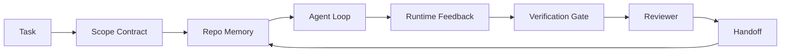

# 智能体工作台工程：为什么能力强的模型仍然失败

> 一个能力强的模型还不够。可靠的智能体需要一个工作台：指令、状态、范围、反馈、验证、审查和交接。剥去这些，即使是前沿模型也会产出不安全的交付物。

**类型：** 学习 + 构建
**语言：** Python（标准库）
**前置要求：** 第 14 阶段 · 01（智能体循环），第 14 阶段 · 26（失败模式）
**所需时间：** 约45分钟

## 学习目标

- 区分模型能力与执行可靠性。
- 说出决定智能体能否交付的七个工程界面。
- 在小型仓库任务上对比纯提示词运行与工作台引导运行。
- 产出一份失败模式报告，将每个缺失的界面映射到其导致的症状。

## 问题所在

你把一个前沿模型丢进一个真实仓库，要求它添加输入验证。它打开四个文件，写了看起来合理的代码，宣布完成，然后停止。你运行测试。两个失败了。第三个与验证无关的文件也被修改了。没有记录智能体做了什么假设、先尝试了什么、还剩什么没做。

模型在 Python 方面没有错。它在工作方面错了。它不知道什么算完成、可以在哪里写入、哪些测试是权威的、以及下一次会话该如何接续。

这不是模型 bug。这是工作台 bug。智能体周围的界面缺少将一次性生成转化为可靠、可恢复工程的部分。

## 概念说明

工作台是任务期间包裹模型的操作环境。它有七个界面：

| 界面 | 承载内容 | 缺失时的失败 |
|------|---------|------------|
| 指令 | 启动规则、禁止操作、完成定义 | 智能体猜测交付意味着什么 |
| 状态 | 当前任务、已修改文件、阻塞项、下一步操作 | 每次会话从零开始 |
| 范围 | 允许文件、禁止文件、验收标准 | 编辑泄露到无关代码 |
| 反馈 | 捕获到循环中的真实命令输出 | 智能体在 400 错误上宣布成功 |
| 验证 | 测试、lint、冒烟运行、范围检查 | "看起来不错"到达 main |
| 审查 | 不同角色的第二遍检查 | 构建者批改自己的作业 |
| 交接 | 变更内容、原因、剩余工作 | 下次会话重新发现一切 |

工作台独立于模型。你可以替换模型并保留界面。你无法替换界面并保留可靠性。



循环闭合在状态文件上，而非聊天历史上。聊天是易失的。仓库是系统记录。

### 工作台 vs 提示词工程

提示词告诉模型你这一轮想要什么。工作台告诉模型如何跨轮次和跨会话地工作。大多数智能体失败故事都是穿着提示词工程外衣的工作台失败。

### 工作台 vs 框架

框架给你一个运行时（LangGraph、AutoGen、Agents SDK）。工作台给智能体一个在该运行时内工作的位置。两者都需要。这个迷你系列讲的是后者。

### 从原语推理，而非从厂商分类

现在关于"运行器工程"有很多文章。Addy Osmani、OpenAI、Anthropic、LangChain、Martin Fowler、MongoDB、HumanLayer、Augment Code、Thoughtworks、walkinglabs awesome list，以及 Medium 和 Hacker News 上的持续讨论。它们对运行器的边界、范围和词汇不一致。我们不需要选边。七个界面是一个 UX 层；每个工作台底下都是支撑任何可靠后端的同一组分布式系统原语。

暂时剥去智能体标签。智能体运行是跨越时间、进程和机器的计算。要使其可靠，你需要任何生产系统都需要的原语。

| 原语 | 是什么 | 对智能体承载什么 |
|------|-------|----------------|
| 函数 | 类型化处理器。尽可能纯。拥有其输入和输出。 | 工具调用、规则检查、验证步骤、模型调用 |
| 工作者 | 拥有一个或多个函数和生命周期的长期进程 | 构建者、审查者、验证器、MCP 服务器 |
| 触发器 | 调用函数的事件源 | 智能体循环 tick、HTTP 请求、队列消息、定时、文件变更、钩子 |
| 运行时 | 决定什么在哪里运行、超时和资源的边界 | Claude Code 的进程、LangGraph 的运行时、工作者容器 |
| HTTP / RPC | 调用者和工作者之间的线路 | 工具调用协议、MCP 请求、模型 API |
| 队列 | 触发器和工作者之间的持久缓冲；背压、重试、幂等 | 任务板、反馈日志、审查收件箱 |
| 会话持久化 | 在崩溃、重启、模型替换中存活的状态 | `agent_state.json`、检查点、KV 存储、仓库本身 |
| 授权策略 | 谁可以用什么范围调用什么函数 | 允许/禁止文件、审批边界、MCP 能力列表 |

现在将七个工程界面映射到这些原语。

- **指令** — 策略 + 函数元数据。规则是检查（函数）。路由器（`AGENTS.md`）是附加到运行时启动的策略。
- **状态** — 会话持久化。运行时每步读取的键值存储。文件、KV 或 DB；持久化语义重要，存储后端不重要。
- **范围** — 每任务的授权策略。允许/禁止的 glob 是 ACL。需要审批的是权限格。
- **反馈** — 写入队列的调用日志。每次 shell 调用都是一条记录，持久、可重放。
- **验证** — 一个函数。对输入确定性。在任务关闭时触发。失败即关闭。
- **审查** — 一个独立工作者，对构建者产物有只读权限，对审查报告有只写权限。
- **交接** — 会话结束触发器发出的持久记录。下次会话的启动触发器读取它。

智能体循环本身就是一个工作者，消费事件（用户消息、工具结果、定时器 tick），调用函数（模型，然后模型选择的工具），写入记录（状态、反馈），并发出触发器（验证、审查、交接）。没有神秘；与任务处理器相同的形态。

### 流通中的模式，翻译为原语

每个流行的运行器模式都归结为八个原语。翻译表。

| 厂商或社区模式 | 实际是什么 |
|--------------|-----------|
| Ralph Loop（Claude Code、Codex、agentic_harness 书）— 当智能体试图提前停止时，将原始意图重新注入到新的上下文窗口 | 一个将任务重新入队并使用干净上下文的触发器；会话持久化携带目标前进 |
| Plan / Execute / Verify（PEV） | 三个工作者，每个角色一个，通过状态和队列在阶段间通信 |
| 运行器-计算分离（OpenAI Agents SDK，2026 年 4 月）— 将控制面从执行面分离 | 重述控制面/数据面。比智能体标签早了几十年 |
| Open Agent Passport（OAP，2026 年 3 月）— 在执行前根据声明式策略签名和审计每个工具调用 | 由预操作工作者执行的授权策略，带签名审计队列 |
| Guides and Sensors（Birgitta Böckeler / Thoughtworks）— 前馈规则 + 反馈可观测性 | 授权策略 + 验证函数 + 可观测性追踪 |
| 渐进式压缩，5 阶段（Claude Code 逆向工程，2026 年 4 月） | 一个状态管理工作者，以类似定时任务的方式运行在会话持久化上，保持在预算内 |
| 钩子/中间件（LangChain、Claude Code）— 拦截模型和工具调用 | 围绕运行时调用路径的触发器 + 函数 |
| 渐进式披露的 Markdown 技能（Anthropic、Flue） | 一个函数注册表，函数元数据按需加载到上下文中 |
| 沙箱智能体（Codex、Sandcastle、Vercel Sandbox） | 计算面：具有隔离文件系统、网络和生命周期的运行时 |
| MCP 服务器 | 通过稳定 RPC 暴露函数的工作者，以能力列表作为授权 |

该表中的每一项都是智能体社区抵达了一个在分布式系统中已有名称的原语，并给了它一个新名字。作为营销标签有用；作为工程词汇无用。

### 实际数据怎么说

运行器优于模型的主张现在有数据支持。值得了解，因为它们也是反对"等更聪明的模型就行"的唯一诚实论据。

- Terminal Bench 2.0 — 同一模型，运行器变更将编码智能体从 Top 30 之外提升到第五名（LangChain，*Anatomy of an Agent Harness*）。
- Vercel — 删除了 80% 的智能体工具；成功率从 80% 跳到 100%（MongoDB）。
- Harvey — 法律智能体仅通过运行器优化就将准确率翻倍以上（MongoDB）。
- 88% 的企业 AI 智能体项目未能投产。失败集中在运行时而非推理（preprints.org，*Harness Engineering for Language Agents*，2026 年 3 月）。
- 2025 年针对三个流行开源框架的基准研究报告约 50% 的任务完成率；长上下文 WebAgent 在长上下文条件下从 40-50% 骤降到 10% 以下，主要由于无限循环和目标丢失（2026 年初广泛报道）。

结论不是"运行器永远赢"。模型确实会随时间吸收运行器技巧。结论是今天，承重的工程在模型周围，而非模型内部，承载这些负载的原语是每个生产系统一直需要的。

### 厂商文章的局限

这部分你不需要客气。

- LangChain 的 *Anatomy of an Agent Harness* 枚举了十一个组件 — 提示词、工具、钩子、沙箱、编排、记忆、技能、子智能体和运行时"傻循环"。它没有命名队列、工作者作为部署单元、触发器语义、会话持久化作为独立关注点、或授权策略。它将运行器视为你配置的对象，而非你部署的系统。
- Addy Osmani 的 *Agent Harness Engineering* 提出了 `Agent = Model + Harness` 框架和棘轮模式，但没有说明运行器由什么构成。它读起来是立场，不是规范。
- Anthropic 和 OpenAI 在界面上走得最深，但停留在自己的运行时内。2026 年 4 月 Agents SDK 中的"运行器-计算分离"公告是第一个明确支持控制面/数据面分离的厂商文章。那是原语思想，不是新思想。
- agentic_harness 书将运行器视为配置对象（Jaymin West 的 *Agentic Engineering*，第 6 章），其中最强的一句话是"运行器是智能体系统中的主要安全边界"。那只是授权策略的重述。
- Hacker News 讨论不断到达同一地点。2026 年 4 月的讨论 *The agent harness belongs outside the sandbox* 认为运行器应该"更像一个位于一切之外、根据上下文和用户授权访问的虚拟机管理程序"。那又是授权策略作为独立面。

你不需要不同意任何这些文章就能注意到差距。它们在写一个已存在系统的 UX 描述。我们在写这个系统。当系统正确构建时，七个界面从原语中自然产出。当构建错误时，再多的 `AGENTS.md` 润色也无法修复缺失的队列。

所以当你在其他地方听到"运行器工程"时，翻译为原语。提示词和规则是策略和函数。脚手架是运行时。护栏是授权 + 验证。钩子是触发器。记忆是会话持久化。Ralph Loop 是重新入队。子智能体是工作者。沙箱是计算面。词汇在变；工程不变。工作台是面向智能体的 UX；运行器，在经受住下一次厂商重定义的意义上，是函数、工作者、触发器、运行时、队列、持久化和策略的正确连接。

## 开始构建

`code/main.py` 在一个小型仓库任务上运行两次。第一次仅用提示词，第二次接入七个界面。相同的模型，相同的任务。脚本统计失败运行中缺失的界面并打印失败模式报告。

仓库任务故意很小：在一个单文件 FastAPI 风格处理器中添加输入验证并编写一个通过的测试。

运行方式：

```
python3 code/main.py
```

输出：两次运行的并排日志、总结纯提示词运行的 `failure_modes.json`、以及工作台运行的一行裁定。

智能体是一个微小的规则化存根；重点是界面，不是模型。在这个迷你系列的其余部分，你将把每个界面重建为真实的、可复用的构件。

## 使用建议

三个地方已经在实际中存在工作台界面，即使没人这么称呼它们：

- **Claude Code、Codex、Cursor。** `AGENTS.md` 和 `CLAUDE.md` 是指令界面。斜杠命令是范围。钩子是验证。
- **LangGraph、OpenAI Agents SDK。** 检查点和会话存储是状态界面。交接是交接界面。
- **真实仓库的 CI。** 测试、lint 和类型检查是验证。PR 模板是交接。CODEOWNERS 是审查。

工作台工程是使这些界面显式化和可复用的学科，而不是让每个团队重新发现它们。

## 交付产物

`outputs/skill-workbench-audit.md` 是一个可移植技能，审计现有仓库的七个工程界面并报告哪些缺失、哪些部分存在、哪些健康。放到任何智能体设置旁边；它告诉你先修什么。

## 练习

1. 选一个你已经在运行智能体的仓库。对七个界面从 0（缺失）到 2（健康）打分。你最弱的界面是什么？
2. 扩展 `main.py` 使纯提示词运行也产出虚假的"成功"声明。验证门是否能捕捉到它？
3. 为你的产品添加第八个界面。论证为什么它不能归入现有七个之一。
4. 用另一个幻觉额外文件写入的存根智能体重新运行脚本。哪个界面最先捕捉到它？
5. 将第 14 阶段 · 26 的五种行业反复出现的失败模式映射到七个界面。每个界面设计用来吸收哪种模式？

## 关键术语

| 术语 | 常见说法 | 实际含义 |
|------|---------|---------|
| 工作台 | "设置" | 围绕模型的工程界面，使工作可靠 |
| 界面 | "一个文档"或"一个脚本" | 智能体每轮读取或写入的命名的、机器可读的输入 |
| 系统记录 | "笔记" | 聊天历史消失时智能体视为真实的文件 |
| 完成定义 | "验收" | 智能体无法伪造的客观的、基于文件的清单 |
| 工作台审计 | "仓库就绪检查" | 对七个界面的遍历，在工作开始前标记缺失部分 |

## 延伸阅读

将这些作为数据点阅读，而非权威。每一个都是部分分类。在决定是否采用之前，将每个概念翻译回原语（函数、工作者、触发器、运行时、HTTP/RPC、队列、持久化、策略）。

厂商框架：

- [Addy Osmani，Agent Harness Engineering](https://addyosmani.com/blog/agent-harness-engineering/) — `Agent = Model + Harness` 和棘轮模式；基础设施方面薄弱
- [LangChain，The Anatomy of an Agent Harness](https://blog.langchain.com/the-anatomy-of-an-agent-harness/) — 十一个组件：提示词、工具、钩子、编排、沙箱、记忆、技能、子智能体、运行时；遗漏队列、部署、授权
- [OpenAI，Harness engineering: leveraging Codex in an agent-first world](https://openai.com/index/harness-engineering/) — Codex 团队对其运行时周围界面的看法
- [OpenAI，Unrolling the Codex agent loop](https://openai.com/index/unrolling-the-codex-agent-loop/) — 智能体循环归结为对函数调用的 `while` 循环
- [Anthropic，Effective harnesses for long-running agents](https://www.anthropic.com/engineering/effective-harnesses-for-long-running-agents) — 特定运行时内的长程界面
- [Anthropic，Harness design for long-running application development](https://www.anthropic.com/engineering/harness-design-long-running-apps) — 应用设计笔记
- [LangChain Deep Agents 运行器能力](https://docs.langchain.com/oss/python/deepagents/harness) — 运行时配置界面

有实用细节的实践者文章：

- [Martin Fowler / Birgitta Böckeler，Harness engineering for coding agent users](https://martinfowler.com/articles/harness-engineering.html) — 指南（前馈）+ 传感器（反馈）；最清晰的控制论框架
- [HumanLayer，Skill Issue: Harness Engineering for Coding Agents](https://www.humanlayer.dev/blog/skill-issue-harness-engineering-for-coding-agents) — "不是模型问题，是配置问题"
- [MongoDB，The Agent Harness: Why the LLM Is the Smallest Part of Your Agent System](https://www.mongodb.com/company/blog/technical/agent-harness-why-llm-is-smallest-part-of-your-agent-system) — 数据：Vercel 80% 到 100%、Harvey 2x 准确率、Terminal Bench Top 30 到 Top 5
- [Augment Code，Harness Engineering for AI Coding Agents](https://www.augmentcode.com/guides/harness-engineering-ai-coding-agents) — 约束优先的讲解
- [Sequoia podcast，Harrison Chase on Context Engineering Long-Horizon Agents](https://sequoiacap.com/podcast/context-engineering-our-way-to-long-horizon-agents-langchains-harrison-chase/) — 运行时关注优先于模型关注

书籍、论文和参考实现：

- [Jaymin West，Agentic Engineering — 第 6 章：Harnesses](https://www.jayminwest.com/agentic-engineering-book/6-harnesses) — 书级深度，将运行器视为主要安全边界
- [preprints.org，Harness Engineering for Language Agents（2026 年 3 月）](https://www.preprints.org/manuscript/202603.1756) — 以控制/代理/运行时为框架的学术论文
- [walkinglabs/awesome-harness-engineering](https://github.com/walkinglabs/awesome-harness-engineering) — 涵盖上下文、评估、可观测性、编排的精选阅读列表
- [ai-boost/awesome-harness-engineering](https://github.com/ai-boost/awesome-harness-engineering) — 替代精选列表（工具、评估、记忆、MCP、权限）
- [andrewgarst/agentic_harness](https://github.com/andrewgarst/agentic_harness) — 生产就绪的参考实现，带 Redis 记忆和评估套件
- [HKUDS/OpenHarness](https://github.com/HKUDS/OpenHarness) — 带内置个人智能体的开放智能体运行器

值得阅读分歧而非共识的 Hacker News 讨论：

- [HN: Effective harnesses for long-running agents](https://news.ycombinator.com/item?id=46081704)
- [HN: Improving 15 LLMs at Coding in One Afternoon. Only the Harness Changed](https://news.ycombinator.com/item?id=46988596)
- [HN: The agent harness belongs outside the sandbox](https://news.ycombinator.com/item?id=47990675) — 主张授权作为独立面

本课程内部交叉引用：

- 第 14 阶段 · 23 — OpenTelemetry GenAI 约定：传感器文献指向的可观测性层
- 第 14 阶段 · 26 — 七个界面设计用来吸收的失败模式目录
- 第 14 阶段 · 27 — 位于授权策略原语的提示词注入防御
- 第 14 阶段 · 29 — 生产运行时（队列、事件、定时任务）：本课原语在部署中的位置
