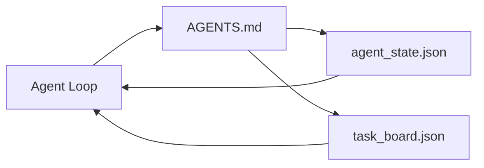

# 最小智能体工作台

> 最小可用工作台是三个文件：一个根指令路由器、一个状态文件和一个任务板。其他一切都在此之上分层。如果一个仓库连这三个文件都承载不了，任何模型都救不了它。

**类型：** 构建
**语言：** Python（标准库）
**前置要求：** 第 14 阶段 · 31（为什么能力强的模型仍然失败）
**所需时间：** 约45分钟

## 学习目标

- 定义组成最小可行工作台的三个文件。
- 解释为什么简短的根路由器优于冗长的整体 `AGENTS.md`。
- 构建一个智能体每轮读取并在结束时写入的状态文件。
- 构建一个能在无聊天历史的多会话工作中存活的任务板。

## 问题所在

大多数团队构建工作台的方式是写一个 3000 行的 `AGENTS.md` 就算完成。模型加载它，忽略无法总结的部分，仍然在它一直失败的界面上失败。

你需要相反的做法。一个微小的根文件，仅在相关时将智能体路由到更深层的文件。智能体在行动前读取、在行动后写入的持久状态。一个说明哪些任务在进行中、哪些被阻塞、哪些接下来做的任务板。

三个文件。每个都有一个职责。每个都足够机器可读，以便日后进化为真正的系统。

## 概念说明



### AGENTS.md 是路由器，不是手册

好的 `AGENTS.md` 是简短的。它将智能体指向：

- 状态文件（你在哪里）。
- 任务板（还剩什么）。
- 更深层的规则（在 `docs/agent-rules.md` 下）。
- 验证命令（如何知道它工作了）。

更长的内容放在更深层的文档中，仅在需要时加载。冗长的手册会被忽略。简短的路由器会被遵循。

### agent_state.json 是系统记录

状态承载：活跃任务 ID、已修改文件、已做的假设、阻塞项和下一步操作。智能体每轮读取它。下次会话读取它而不是重放聊天。

状态存在于文件中是因为聊天历史不可靠。会话会终止。对话会被裁剪。文件不会。

### task_board.json 是队列

任务板承载每个任务，状态为 `todo | in_progress | done | blocked`。它是状态为空时智能体从中拉取的队列，也是你想知道智能体是否正常进展时读取的队列。

板上的任务有 ID、目标、所有者（`builder`、`reviewer` 或 `human`）和验收标准。板子故意很小：当它超过一屏时，你有的是规划问题，不是板子问题。

### 三个文件是地板，不是天花板

后续课程添加范围契约、反馈运行器、验证门、审查者清单和交接包。这里的三个文件是它们都假设存在的基础。

## 开始构建

`code/main.py` 将最小工作台写入空仓库并演示一个智能体轮次，该轮次：

1. 读取 `agent_state.json`。
2. 如果状态为空，从 `task_board.json` 拉取下一个任务。
3. 在范围内修改一个文件。
4. 写回更新后的状态。

运行方式：

```
python3 code/main.py
```

脚本在自身旁边创建 `workdir/`，放置三个文件，运行一个轮次，并打印差异。重新运行以查看第二个轮次如何接续第一个轮次的进度。

## 使用建议

在生产智能体产品中，同样的三个文件以不同名称出现：

- **Claude Code：** `AGENTS.md` 或 `CLAUDE.md` 作为路由器，`.claude/state.json` 风格的存储作为状态，钩子作为板子。
- **Codex / Cursor：** 工作区规则作为路由器，会话记忆作为状态，聊天侧边栏中的排队任务作为板子。
- **自定义 Python 智能体：** 你刚写的同样的文件。

名称在变。形态不变。

## 实际生产模式

最小工作台在与真实 monorepo 接触时能存活，是因为在其上叠加了三种模式。它们是独立的；选择你的仓库实际需要的。

**带最近优先的嵌套 `AGENTS.md`。** OpenAI 在其主仓库中发布了 88 个 `AGENTS.md` 文件，每个子组件一个。Codex、Cursor、Claude Code 和 Copilot 都从工作文件向仓库根遍历，并拼接沿途找到的每个 `AGENTS.md`。子目录文件扩展根文件。Codex 添加 `AGENTS.override.md` 以替换而非扩展；覆盖机制是 Codex 特有的，跨工具工作时应避免。Augment Code 的测量是关键：最好的 `AGENTS.md` 文件带来的质量跳跃等同于从 Haiku 升级到 Opus；最差的使输出比没有文件还糟糕。

**拒绝的反模式，即使看起来像覆盖。** 冲突的指令会悄悄将智能体从交互模式降至贪婪模式（ICLR 2026 AMBIG-SWE：48.8% → 28% 的解决率）；用数字优先级而非平铺。不可验证的风格规则（"遵循 Google Python Style Guide"）没有执行命令让智能体自己编造合规；将每个风格规则与确切的 lint 命令配对。以风格而非命令开头埋没了验证路径；命令优先，风格最后。为人而非智能体写作浪费上下文预算；简洁是特性。

**跨工具符号链接。** 单个根文件加符号链接（`ln -s AGENTS.md CLAUDE.md`、`ln -s AGENTS.md .github/copilot-instructions.md`、`ln -s AGENTS.md .cursorrules`）使每个编码智能体保持同一真相来源。Nx 的 `nx ai-setup` 从单一配置自动为 Claude Code、Cursor、Copilot、Gemini、Codex 和 OpenCode 完成此操作。

## 交付产物

`outputs/skill-minimal-workbench.md` 为任何新仓库生成三文件工作台：针对项目调整的 `AGENTS.md` 路由器、带有正确键的 `agent_state.json`、以及用当前待办事项初始化的 `task_board.json`。

## 练习

1. 在 `agent_state.json` 中添加 `last_run` 时间戳。如果文件超过 24 小时，除非操作员确认，否则拒绝运行。
2. 在任务板中添加 `priority` 字段并更改拉取器使其总是选择最高优先级的 `todo`。
3. 将 `task_board.json` 迁移到 JSON Lines，使每项任务一行，在版本控制中差异清晰。
4. 编写 `lint_workbench.py`，当 `AGENTS.md` 超过 80 行或引用不存在的文件时失败。
5. 确定三个文件中失去哪个伤害最大。为它辩护。

## 关键术语

| 术语 | 常见说法 | 实际含义 |
|------|---------|---------|
| 路由器 | `AGENTS.md` | 指向更深层文档和文件的简短根文件 |
| 状态文件 | "笔记" | 每轮写入的智能体位置的机器可读记录 |
| 任务板 | "待办列表" | 带状态、所有者、验收的 JSON 任务队列 |
| 系统记录 | "真相来源" | 聊天消失时工作台视为权威的文件 |

## 延伸阅读

- [agents.md — 开放规范](https://agents.md/) — 被 Cursor、Codex、Claude Code、Copilot、Gemini、OpenCode 采用
- [Augment Code，A good AGENTS.md is a model upgrade. A bad one is worse than no docs at all](https://www.augmentcode.com/blog/how-to-write-good-agents-dot-md-files) — 实测的质量跳跃
- [Blake Crosley，AGENTS.md Patterns: What Actually Changes Agent Behavior](https://blakecrosley.com/blog/agents-md-patterns) — 实践中有效的和无效的
- [Datadog Frontend，Steering AI Agents in Monorepos with AGENTS.md](https://dev.to/datadog-frontend-dev/steering-ai-agents-in-monorepos-with-agentsmd-13g0) — 实践中的嵌套优先
- [Nx Blog，Teach Your AI Agent How to Work in a Monorepo](https://nx.dev/blog/nx-ai-agent-skills) — 跨六个工具的单一来源生成
- [The Prompt Shelf，AGENTS.md Best Practices: Structure, Scope, and Real Examples](https://thepromptshelf.dev/blog/agents-md-best-practices/) — 经得起审查的章节排序
- [Anthropic，Claude Code subagents and session store](https://docs.anthropic.com/en/docs/agents-and-tools/claude-code/sub-agents)
- 第 14 阶段 · 31 — 最小工作台吸收的失败模式
- 第 14 阶段 · 34 — 本课预览的持久状态模式
