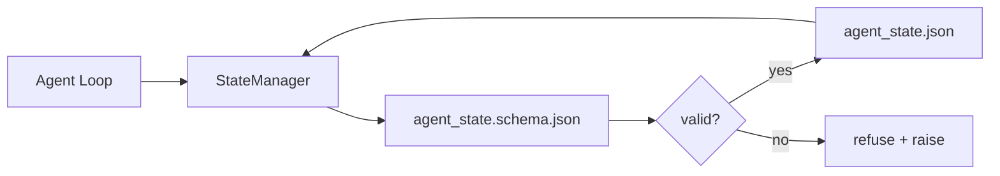

# 仓库记忆与持久状态

> 聊天历史是易失的。仓库是持久的。工作台将智能体状态存储在版本化的文件中，使下一次会话、下一个智能体和下一个审查者都从同一真相来源读取。

**类型：** 构建
**语言：** Python（标准库 + `jsonschema` 可选）
**前置要求：** 第 14 阶段 · 32（最小工作台）
**所需时间：** 约60分钟

## 学习目标

- 定义什么属于仓库记忆，什么属于聊天历史。
- 为 `agent_state.json` 和 `task_board.json` 编写 JSON Schema。
- 构建一个状态管理器，原子地加载、验证、修改和持久化状态。
- 使用模式在坏写入损坏工作台之前拒绝它们。

## 问题所在

智能体完成一次会话。聊天关闭。下次会话打开并问从哪里开始。模型说"让我检查文件"，读取过时的笔记，重新做了已经完成的工作。或者更糟，它重写了一个已完成的文件，因为没人告诉它文件已经完成。

工作台的修复是仓库记忆：状态存在于仓库的 JSON 文件中，按模式写入，原子持久化，在代码审查中差异友好。聊天是临时流；仓库是系统记录。

## 概念说明



### 什么属于仓库记忆

| 属于 | 不属于 |
|------|-------|
| 活跃任务 ID | 原始聊天记录 |
| 本次会话修改的文件 | Token 级推理追踪 |
| 智能体做的假设 | "用户看起来很沮丧" |
| 开放的阻塞项 | 采样完成 |
| 下一步操作 | 厂商特定的模型 ID |

测试标准是持久性：三个月后在 CI 重跑时，这个有用吗？如果有用，放仓库。如果没用，放遥测。

### 模式优先的状态

JSON Schema 是契约。没有它，每个智能体发明新字段，每个审查者学习新形态，每个 CI 脚本都要特殊处理旧版本。有了它，坏写入就是被拒绝的写入。

模式覆盖：

- 必需键。
- 允许的 `status` 值。
- 禁止的值（例如数组的 `null`）。
- 模式约束（任务 ID 匹配 `T-\d{3,}`）。
- 用于迁移的版本字段。

### 原子写入

状态写入需要在部分失败中存活：写入临时文件、fsync、重命名覆盖目标。状态文件是真相来源；写了一半的比没有文件更糟。

### 迁移

当模式变更时，在模式升级旁附带迁移脚本。状态文件携带 `schema_version` 字段；管理器拒绝加载来自无法迁移版本的文件。

## 开始构建

`code/main.py` 实现：

- `agent_state.schema.json` 和 `task_board.schema.json`。
- 仅标准库的验证器（JSON Schema 子集：required、type、enum、pattern、items）。
- `StateManager.load`、`StateManager.update`、`StateManager.commit`，带原子的临时文件-重命名写入。
- 演示修改状态、持久化、重新加载并证明往返。

运行方式：

```
python3 code/main.py
```

脚本写入 `workdir/agent_state.json` 和 `workdir/task_board.json`，跨两个轮次修改它们，并在每步打印验证后的状态。

## 实际生产模式

四种模式将本课的最小实现转化为多智能体 monorepo 能存活的东西。

**原子临时文件-重命名不是可选的。** 2026 年 3 月的 Hive 项目 bug 报告清楚记录了失败模式：`state.json` 通过 `write_text()` 写入，异常被捕获并静默。部分写入导致会话在损坏状态下恢复，无任何信号。修复始终是：`tempfile.mkstemp` 在目标同目录、写入、`fsync`、`os.replace`（POSIX 和 Windows 上的原子重命名）。本课的 `atomic_write` 正是这样做的。

**每个非幂等工具调用的幂等键。** 如果智能体在调用工具后但在检查点结果前崩溃，恢复会重试工具调用。对读取安全；对邮件、数据库插入、文件上传危险。模式：在执行前将每个工具调用 ID 记录到 `pending_calls.jsonl`。重试时检查 ID；如果存在，跳过调用并使用缓存结果。Anthropic 和 LangChain 在 2026 年指导中都指出了这一点；LangGraph 的检查点器持久化待处理写入出于同一原因。

**将大产物与状态分离。** 不要在 `agent_state.json` 中存储 CSV、长记录或生成的文件。将产物保存为单独文件（或上传到对象存储），在状态中只保留路径。检查点保持小而快；产物独立增长。

**事件溯源用于审计，快照用于恢复。** 每次修改追加到事件日志（`state.events.jsonl`）；定期快照到 `state.json`。恢复读取快照，然后重放快照时间戳之后的所有事件。这消耗更多磁盘但让你逐字重放智能体决策 — 在调试长程运行时至关重要。Postgres 内部用于 WAL 的相同形态。

**模式迁移或拒绝加载。** `schema_version` 整数是契约。当管理器加载未知版本的文件时，它拒绝读取。在模式升级旁附带迁移脚本；`tools/migrate_state.py` 在每次启动时幂等运行。

## 使用建议

生产中：

- **LangGraph 检查点器。** 相同的理念，不同的存储。检查点器将图状态持久化到 SQLite、Postgres 或自定义后端。本课的模式是检查点器崩溃时你需要手动读取状态时使用的。
- **Letta 记忆块。** 带结构化模式的持久块（第 14 阶段 · 08）。相同规范应用于长期运行的人设。
- **OpenAI Agents SDK 会话存储。** 可插拔后端，模式感知。本课的状态文件是本地文件后端。

## 交付产物

`outputs/skill-state-schema.md` 生成项目特定的 JSON Schema 对（状态 + 板子）、连接到原子写入的 Python `StateManager`，以及迁移脚手架，使下次模式升级不会破坏工作台。

## 练习

1. 添加 `last_human_touch` 时间戳。拒绝在人工编辑五秒内的任何智能体写入。
2. 扩展验证器支持 `oneOf`，使任务可以是构建任务或审查任务，各有不同的必需字段。
3. 添加 `schema_version` 字段并编写从 v1 到 v2 的迁移（将 `blockers` 重命名为 `risks`）。
4. 将存储后端从本地文件移到 SQLite。保持 `StateManager` API 不变。
5. 用 50ms 写入竞争让两个智能体对同一状态文件运行。什么会出问题？原子重命名如何拯救你？

## 关键术语

| 术语 | 常见说法 | 实际含义 |
|------|---------|---------|
| 仓库记忆 | "笔记文件" | 存储在仓库跟踪文件中的状态，按模式 |
| 模式优先 | "验证输入" | 在写入者之前定义契约，拒绝漂移 |
| 原子写入 | "只是重命名" | 写入临时文件、fsync、重命名，使部分失败不会损坏 |
| 迁移 | "模式升级" | 将 vN 状态转化为 v(N+1) 状态的脚本 |
| 系统记录 | "真相来源" | 工作台视为权威的构件 |

## 延伸阅读

- [JSON Schema 规范](https://json-schema.org/specification.html)
- [LangGraph 检查点器](https://langchain-ai.github.io/langgraph/concepts/persistence/)
- [Letta 记忆块](https://docs.letta.com/concepts/memory)
- [Fast.io，AI Agent State Checkpointing: A Practical Guide](https://fast.io/resources/ai-agent-state-checkpointing/) — 模式优先的检查点与幂等
- [Fast.io，AI Agent Workflow State Persistence: Best Practices 2026](https://fast.io/resources/ai-agent-workflow-state-persistence/) — 并发控制、TTL、事件溯源
- [Hive Issue #6263 — 非原子 state.json 写入被静默忽略](https://github.com/aden-hive/hive/issues/6263) — 真实项目中的失败模式
- [eunomia，Checkpoint/Restore Systems: Evolution, Techniques, Applications](https://eunomia.dev/blog/2025/05/11/checkpointrestore-systems-evolution-techniques-and-applications-in-ai-agents/) — 来自操作系统历史的检查点/恢复原语应用于智能体
- [Indium，7 State Persistence Strategies for Long-Running AI Agents in 2026](https://www.indium.tech/blog/7-state-persistence-strategies-ai-agents-2026/)
- [Microsoft Agent Framework，Compaction](https://learn.microsoft.com/en-us/agent-framework/agents/conversations/compaction) — 厂商检查点管理器
- 第 14 阶段 · 08 — 记忆块与睡眠时间计算
- 第 14 阶段 · 32 — 本课模式化的三文件最小工作台
- 第 14 阶段 · 40 — 从同一模式读取的交接包
